# TTExaLens Overview

Relevant source files
*   [.github/Dockerfile.ci](https://github.com/tenstorrent/tt-exalens/blob/046c35eb/.github/Dockerfile.ci)
*   [Makefile](https://github.com/tenstorrent/tt-exalens/blob/046c35eb/Makefile)
*   [README.md](https://github.com/tenstorrent/tt-exalens/blob/046c35eb/README.md?plain=1)
*   [docs/ttexalens-app-docs.md](https://github.com/tenstorrent/tt-exalens/blob/046c35eb/docs/ttexalens-app-docs.md?plain=1)
*   [docs/ttexalens-lib-docs.md](https://github.com/tenstorrent/tt-exalens/blob/046c35eb/docs/ttexalens-lib-docs.md?plain=1)
*   [scripts/create-venv.sh](https://github.com/tenstorrent/tt-exalens/blob/046c35eb/scripts/create-venv.sh)
*   [scripts/install-deps.sh](https://github.com/tenstorrent/tt-exalens/blob/046c35eb/scripts/install-deps.sh)
*   [scripts/setup-dev-env.sh](https://github.com/tenstorrent/tt-exalens/blob/046c35eb/scripts/setup-dev-env.sh)
*   [test/ttexalens/unit_tests/test_device.py](https://github.com/tenstorrent/tt-exalens/blob/046c35eb/test/ttexalens/unit_tests/test_device.py)
*   [test/ttexalens/unit_tests/test_lib.py](https://github.com/tenstorrent/tt-exalens/blob/046c35eb/test/ttexalens/unit_tests/test_lib.py)
*   [test/ttexalens/unit_tests/test_tensix_debug.py](https://github.com/tenstorrent/tt-exalens/blob/046c35eb/test/ttexalens/unit_tests/test_tensix_debug.py)
*   [ttexalens/__init__.py](https://github.com/tenstorrent/tt-exalens/blob/046c35eb/ttexalens/__init__.py)
*   [ttexalens/coordinate.py](https://github.com/tenstorrent/tt-exalens/blob/046c35eb/ttexalens/coordinate.py)
*   [ttexalens/debug_tensix.py](https://github.com/tenstorrent/tt-exalens/blob/046c35eb/ttexalens/debug_tensix.py)
*   [ttexalens/elf_loader.py](https://github.com/tenstorrent/tt-exalens/blob/046c35eb/ttexalens/elf_loader.py)
*   [ttexalens/tt_exalens_lib.py](https://github.com/tenstorrent/tt-exalens/blob/046c35eb/ttexalens/tt_exalens_lib.py)

## Purpose and Scope

This document provides a high-level introduction to TTExaLens, its purpose, capabilities, and architectural components. It serves as the entry point for understanding the system before diving into specific subsystems.

For detailed information about:

*   The layered architecture and component interactions, see [System Architecture and Layers](https://deepwiki.com/tenstorrent/tt-exalens/1.1-system-architecture-and-layers)
*   Coordinate systems and memory addressing, see [Coordinate Systems and Memory Addressing](https://deepwiki.com/tenstorrent/tt-exalens/1.2-coordinate-systems-and-memory-addressing)
*   Installation and first steps, see [Getting Started](https://deepwiki.com/tenstorrent/tt-exalens/2-getting-started)
*   The Python library API reference, see [Python Library API](https://deepwiki.com/tenstorrent/tt-exalens/3-python-library-api)
*   The CLI application, see [Command Line Interface](https://deepwiki.com/tenstorrent/tt-exalens/4-command-line-interface)

## What is TTExaLens?

TTExaLens is a low-level hardware debugger for Tenstorrent AI accelerator chips. It provides direct access to chip resources through multiple interfaces, enabling firmware development, system debugging, and hardware validation. The system bridges high-level debugging workflows with low-level hardware access through a layered architecture.

The name derives from "Exascale Lens" - a tool for examining systems at the exascale level, though it is used for debugging individual chips and small clusters.

**Sources:**[README.md 1-14](https://github.com/tenstorrent/tt-exalens/blob/046c35eb/README.md?plain=1#L1-L14)

## Target Hardware

TTExaLens supports the following Tenstorrent architectures:

| Architecture | Support Status | Device Class |
| --- | --- | --- |
| Wormhole | Fully Supported | `WormholeDevice` |
| Blackhole | Fully Supported | `BlackholeDevice` |
| Quasar | Fully Supported | `QuasarDevice` |

Each architecture has platform-specific implementations that handle architectural differences while presenting a unified interface through the abstract `Device` class.

**Sources:**[ttexalens/device.py](https://github.com/tenstorrent/tt-exalens/blob/046c35eb/ttexalens/device.py)[ttexalens/hardware/](https://github.com/tenstorrent/tt-exalens/blob/046c35eb/ttexalens/hardware/)

## Main Capabilities

### Memory Operations

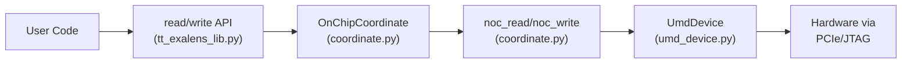

**Core Functions:**
- `read_word_from_device()` / `read_words_from_device()` / `read_from_device()` - memory reads
- `write_words_to_device()` / `write_to_device()` - memory writes
- `read_register()` / `write_register()` - configuration and debug register access
```


TTExaLens provides byte-level access to on-chip memory through the Network-on-Chip (NOC):

**Core Functions:**

*   `read_word_from_device()` / `read_words_from_device()` / `read_from_device()` - memory reads
*   `write_words_to_device()` / `write_to_device()` - memory writes
*   `read_register()` / `write_register()` - configuration and debug register access

**Sources:**[ttexalens/tt_exalens_lib.py 110-292](https://github.com/tenstorrent/tt-exalens/blob/046c35eb/ttexalens/tt_exalens_lib.py#L110-L292)[ttexalens/coordinate.py](https://github.com/tenstorrent/tt-exalens/blob/046c35eb/ttexalens/coordinate.py)

### RISC-V Core Control

Direct control and debugging of Baby RISC cores (BRISC, TRISC0-2, NCRISC, ERISC):

| Capability | Implementation |
| --- | --- |
| Execution Control | `RiscDebug.halt()`, `cont()`, `step()` |
| Memory Access | `read_memory()`, `write_memory()` via debug interface |
| Register Access | `read_gpr()`, `write_gpr()`, `read_pc()` |
| Breakpoints | Hardware watchpoints for PC and memory access |
| Call Stack Analysis | DWARF-based stack unwinding via `callstack()` |

**Sources:**[ttexalens/hardware/risc_debug.py](https://github.com/tenstorrent/tt-exalens/blob/046c35eb/ttexalens/hardware/risc_debug.py)[ttexalens/hardware/baby_risc_debug.py](https://github.com/tenstorrent/tt-exalens/blob/046c35eb/ttexalens/hardware/baby_risc_debug.py)

### ELF Firmware Management

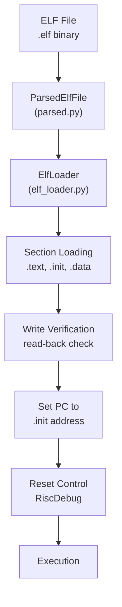

**Core Functions:**
- `load_elf()` - load firmware with core in reset
- `run_elf()` - load and execute firmware
- `parse_elf()` - parse ELF with DWARF symbols
```


Complete pipeline for loading and executing firmware on RISC-V cores:

**Core Functions:**

*   `load_elf()` - load firmware with core in reset
*   `run_elf()` - load and execute firmware
*   `parse_elf()` - parse ELF with DWARF symbols

**Sources:**[ttexalens/elf_loader.py](https://github.com/tenstorrent/tt-exalens/blob/046c35eb/ttexalens/elf_loader.py)[ttexalens/tt_exalens_lib.py 295-421](https://github.com/tenstorrent/tt-exalens/blob/046c35eb/ttexalens/tt_exalens_lib.py#L295-L421)

### Symbolic Debugging

DWARF-based symbolic access to variables and type information:

*   **Variable Access:**`ElfVariable` class provides symbolic memory access by name
*   **Type System:** Full DWARF type parsing including structs, arrays, pointers
*   **Call Stack:** Frame unwinding with source location information
*   **Coverage:** GCOV data extraction from running firmware

**Sources:**[ttexalens/elf/](https://github.com/tenstorrent/tt-exalens/blob/046c35eb/ttexalens/elf/)[ttexalens/tt_exalens_lib.py 588-690](https://github.com/tenstorrent/tt-exalens/blob/046c35eb/ttexalens/tt_exalens_lib.py#L588-L690)

### Tensix Core Debugging

Advanced debugging of Tensix computation cores:

*   **Instruction Injection:** Direct Tensix instruction execution via debug bus
*   **Register File Access:** Read/write SRCA, SRCB, DSTACC register files
*   **Direct Dest Access:** High-performance register file access on Blackhole
*   **Thread Control:** Per-thread FIFO control (threads 0-2)

**Sources:**[ttexalens/debug_tensix.py](https://github.com/tenstorrent/tt-exalens/blob/046c35eb/ttexalens/debug_tensix.py)

### Debug Bus Signal Monitoring

Real-time signal sampling from internal chip signals:

*   **Signal Database:** Predefined signals for ALU, pack, unpack, RISC cores
*   **L1 Sampling Mode:** Capture 128-bit signal snapshots to L1 memory
*   **Group Access:** Read entire signal groups efficiently
*   **Custom Signals:** Define custom signal descriptions

**Sources:**[ttexalens/debug_bus_signal_store.py](https://github.com/tenstorrent/tt-exalens/blob/046c35eb/ttexalens/debug_bus_signal_store.py)

## System Interfaces

TTExaLens provides three primary interfaces for user interaction:

### Python Library API

The programmatic interface for custom scripts and automation:

`import ttexalens as lib # Initialize contextctx = lib.init_ttexalens() # Memory operationsdata = lib.read_words_from_device("1,0", 0x1000, word_count=16)lib.write_words_to_device("1,0", 0x1000, [0xDEADBEEF] * 4) # Load and run firmwarelib.run_elf("firmware.elf", "all", "brisc") # Debug operationsstack = lib.callstack("1,0", "firmware.elf", risc_name="brisc")`
**Entry Point:**`ttexalens` module **Core Module:**[ttexalens/tt_exalens_lib.py](https://github.com/tenstorrent/tt-exalens/blob/046c35eb/ttexalens/tt_exalens_lib.py)**Initialization:**[ttexalens/tt_exalens_init.py](https://github.com/tenstorrent/tt-exalens/blob/046c35eb/ttexalens/tt_exalens_init.py)

**Sources:**[ttexalens/__init__.py](https://github.com/tenstorrent/tt-exalens/blob/046c35eb/ttexalens/__init__.py)[ttexalens/tt_exalens_lib.py 1-50](https://github.com/tenstorrent/tt-exalens/blob/046c35eb/ttexalens/tt_exalens_lib.py#L1-L50)

### Command Line Interface

Interactive REPL-based application for exploration and debugging:

`# Local mode - direct hardware accesstt-exalens # Remote mode - connect to servertt-exalens --remote <ip>:<port> # Server mode - host access for remote clientstt-exalens --server`
**Key Commands:**

*   `device` - display chip topology and RISC status
*   `brxy` - burst read memory
*   `bt` - call stack backtrace
*   `tensix` - dump Tensix core state
*   `debug-bus` - signal monitoring

**Entry Point:**`tt-exalens` command **Implementation:**[app/](https://github.com/tenstorrent/tt-exalens/blob/046c35eb/app/)

**Sources:**[README.md 35-44](https://github.com/tenstorrent/tt-exalens/blob/046c35eb/README.md?plain=1#L35-L44)[docs/ttexalens-app-docs.md 1-50](https://github.com/tenstorrent/tt-exalens/blob/046c35eb/docs/ttexalens-app-docs.md?plain=1#L1-L50)

### GDB Server

Standard GDB remote protocol server for RISC-V debugging:

`# Start GDB servertt-exalens --gdb-server <port> # Connect with GDB clientriscv-tt-elf-gdb firmware.elf(gdb) target remote localhost:<port>(gdb) break main(gdb) continue`
**Features:**

*   Standard GDB commands (break, step, continue, backtrace)
*   Multi-process support (one process per RISC core)
*   Memory and register access
*   vCont operations

**Implementation:**[ttexalens/gdb/](https://github.com/tenstorrent/tt-exalens/blob/046c35eb/ttexalens/gdb/)

**Sources:**[ttexalens/gdb/gdb_server.py](https://github.com/tenstorrent/tt-exalens/blob/046c35eb/ttexalens/gdb/gdb_server.py)

## Core Abstractions

### Context - Session Management

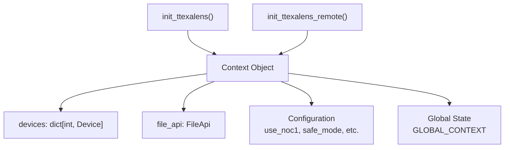

**Responsibilities:**
- Device discovery and initialization
- Session configuration (NOC selection, safe mode, etc.)
- File API for ELF and symbol management
- Global context management for library functions
```


The `Context` object manages the TTExaLens session lifecycle:

**Responsibilities:**

*   Device discovery and initialization
*   Session configuration (NOC selection, safe mode, etc.)
*   File API for ELF and symbol management
*   Global context management for library functions

**Sources:**[ttexalens/context.py](https://github.com/tenstorrent/tt-exalens/blob/046c35eb/ttexalens/context.py)[ttexalens/tt_exalens_init.py 50-63](https://github.com/tenstorrent/tt-exalens/blob/046c35eb/ttexalens/tt_exalens_init.py#L50-L63)

### Device - Hardware Abstraction

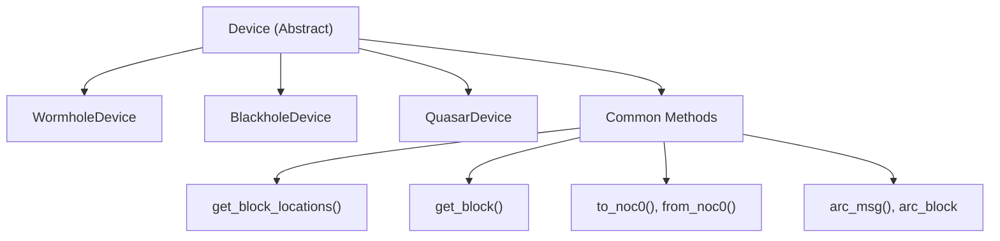

**Key Responsibilities:**
- Coordinate system conversions
- Block location queries
- Platform-specific behavior
- Memory map management
- ARC communication
```


The `Device` class abstracts architecture-specific details:

**Key Responsibilities:**

*   Coordinate system conversions
*   Block location queries
*   Platform-specific behavior
*   Memory map management
*   ARC communication

**Sources:**[ttexalens/device.py](https://github.com/tenstorrent/tt-exalens/blob/046c35eb/ttexalens/device.py)[ttexalens/hardware/wormhole/](https://github.com/tenstorrent/tt-exalens/blob/046c35eb/ttexalens/hardware/wormhole/)[ttexalens/hardware/blackhole/](https://github.com/tenstorrent/tt-exalens/blob/046c35eb/ttexalens/hardware/blackhole/)

### OnChipCoordinate - Location Abstraction

Unified representation of locations across five coordinate systems:

| System | Notation | Description | Harvesting Aware |
| --- | --- | --- | --- |
| `noc0` | X-Y | NOC 0 routing coordinates | No |
| `noc1` | X-Y | NOC 1 routing coordinates | No |
| `die` | X,Y | Geographic die layout | No |
| `logical` | X,Y or qX,Y | User-facing coordinates | Yes |
| `translated` | X-Y | Hardware routing with harvesting | Yes |

**Core Methods:**

*   `OnChipCoordinate.create()` - factory from string
*   `to(coord_type)` - convert to target system
*   `noc_read()` / `noc_write()` - memory operations

**Sources:**[ttexalens/coordinate.py 1-77](https://github.com/tenstorrent/tt-exalens/blob/046c35eb/ttexalens/coordinate.py#L1-L77)

### NocBlock - Chip Block Abstraction

Represents functional units on the chip:

**Block Types:**

*   `functional_workers` - Tensix compute cores
*   `eth` - Ethernet cores
*   `dram` - DRAM controllers
*   `arc` - ARC processor
*   `pcie` - PCIe interface
*   `router_only` - NOC routers without compute

Each block provides:

*   `get_risc_debug(risc_name)` - RISC-V debugging interface
*   `get_register_store()` - configuration/debug registers
*   Memory regions (L1, private memory, etc.)

**Sources:**[ttexalens/hardware/noc_block.py](https://github.com/tenstorrent/tt-exalens/blob/046c35eb/ttexalens/hardware/noc_block.py)

## Access Modes

### Local Mode

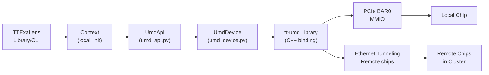

**Capabilities:**
- Direct MMIO access for local chips via PCIe
- Ethernet NOC tunneling for remote chips in cluster
- Full speed, no network overhead

**Initialization:** `init_ttexalens()`
```


Direct hardware access via PCIe and the `tt-umd` library:

**Capabilities:**

*   Direct MMIO access for local chips via PCIe
*   Ethernet NOC tunneling for remote chips in cluster
*   Full speed, no network overhead

**Initialization:**`init_ttexalens()`

**Sources:**[ttexalens/tt_exalens_init.py 1-118](https://github.com/tenstorrent/tt-exalens/blob/046c35eb/ttexalens/tt_exalens_init.py#L1-L118)[ttexalens/umd_api.py](https://github.com/tenstorrent/tt-exalens/blob/046c35eb/ttexalens/umd_api.py)[ttexalens/umd_device.py](https://github.com/tenstorrent/tt-exalens/blob/046c35eb/ttexalens/umd_device.py)

### Remote Mode

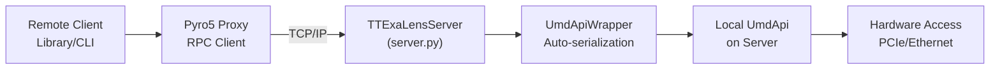

**Capabilities:**
- Access hardware from any network location
- Multiple concurrent clients
- Automatic object serialization via Pyro5
- Same API as local mode

**Initialization:** 
- Server: `tt-exalens --server` or programmatic via `TTExaLensServer`
- Client: `init_ttexalens_remote(ip_address, port)`
```


Network-based access to hardware via TTExaLens server:

**Capabilities:**

*   Access hardware from any network location
*   Multiple concurrent clients
*   Automatic object serialization via Pyro5
*   Same API as local mode

**Initialization:**

*   Server: `tt-exalens --server` or programmatic via `TTExaLensServer`
*   Client: `init_ttexalens_remote(ip_address, port)`

**Sources:**[ttexalens/tt_exalens_init.py 120-177](https://github.com/tenstorrent/tt-exalens/blob/046c35eb/ttexalens/tt_exalens_init.py#L120-L177)[ttexalens/server.py](https://github.com/tenstorrent/tt-exalens/blob/046c35eb/ttexalens/server.py)

## Operational Safety

### Safe Mode

Memory access validation to prevent unsafe operations:

*   **Enabled by default** via `safe_mode=True` in context initialization
*   **Validates** all memory accesses against known safe regions (L1, DRAM, etc.)
*   **Raises**`UnsafeAccessException` for unmapped or restricted regions
*   **Can be disabled** for expert usage: `safe_mode=False`

**Sources:**[ttexalens/memory_map.py](https://github.com/tenstorrent/tt-exalens/blob/046c35eb/ttexalens/memory_map.py)[ttexalens/device.py](https://github.com/tenstorrent/tt-exalens/blob/046c35eb/ttexalens/device.py)

### NOC Failover

Automatic retry on alternate NOC for timeout resilience:

*   **Enabled by default** via `noc_failover=True`
*   **Behavior:** On NOC 0 timeout, automatically retry on NOC 1
*   **Use case:** Work around transient NOC congestion or issues
*   **Can be disabled** for debugging NOC-specific issues

**Sources:**[ttexalens/umd_device.py](https://github.com/tenstorrent/tt-exalens/blob/046c35eb/ttexalens/umd_device.py)

## Architecture Overview
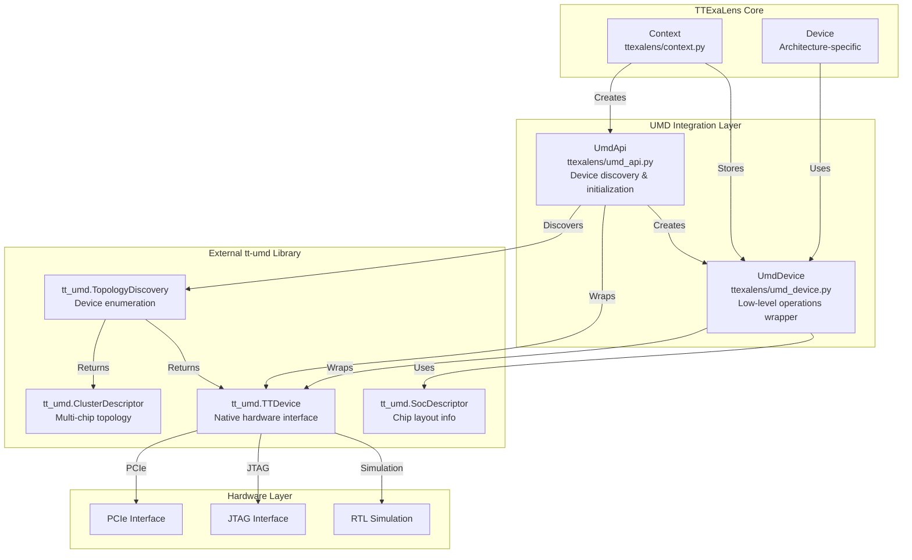


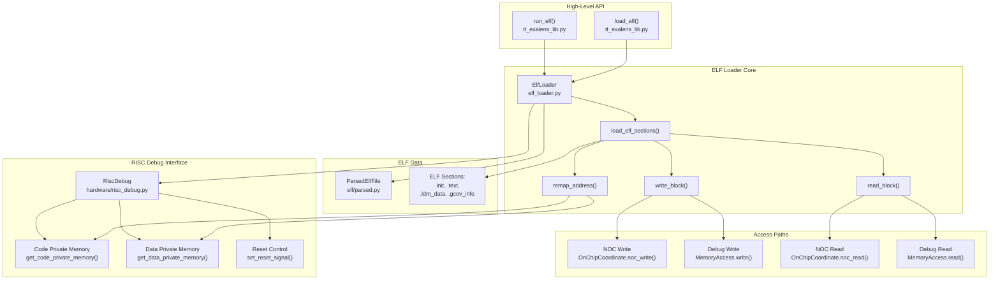


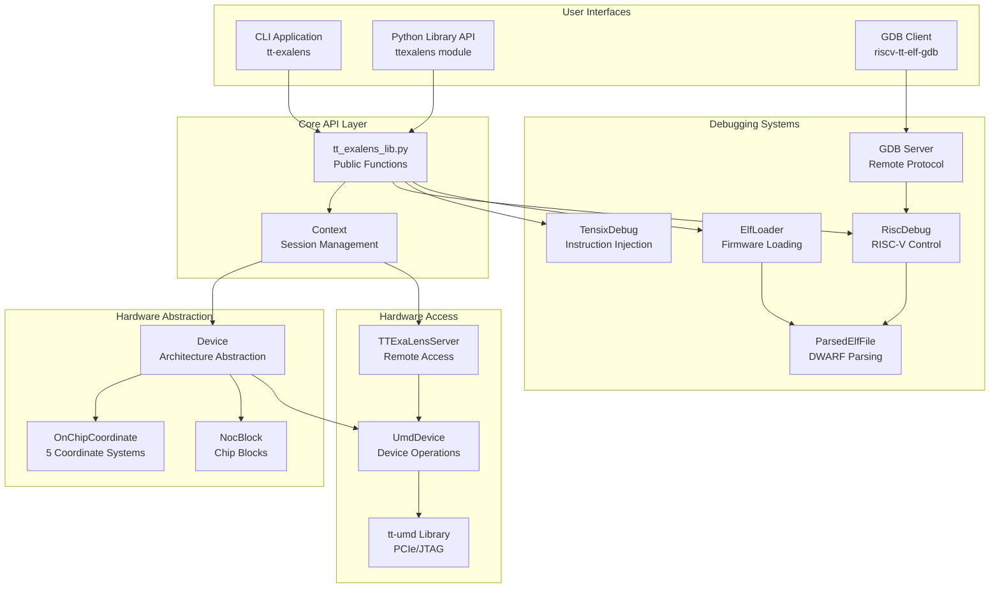

This architecture enables:
- **Multiple interfaces** (CLI, API, GDB) sharing common implementation
- **Clean abstraction layers** from user interface down to hardware
- **Flexible deployment** (local or remote access)
- **Platform independence** through Device abstraction
- **Comprehensive debugging** via multiple subsystems
```


The following diagram shows how the major system components relate:

This architecture enables:

*   **Multiple interfaces** (CLI, API, GDB) sharing common implementation
*   **Clean abstraction layers** from user interface down to hardware
*   **Flexible deployment** (local or remote access)
*   **Platform independence** through Device abstraction
*   **Comprehensive debugging** via multiple subsystems

**Sources:** All files, system-level diagram synthesis

* * *

For detailed information about specific subsystems, continue to:

 - Detailed component interactions
 - Memory model and addressing
 - Installation and first steps
 - Complete API reference
 - CLI commands and usage

This wiki is featured in the [repository](https://github.com/tenstorrent/tt-exalens/blob/main/README.md)

Dismiss
Refresh this wiki

Enter email to refresh

## Additional Diagrams


#### Build System Components


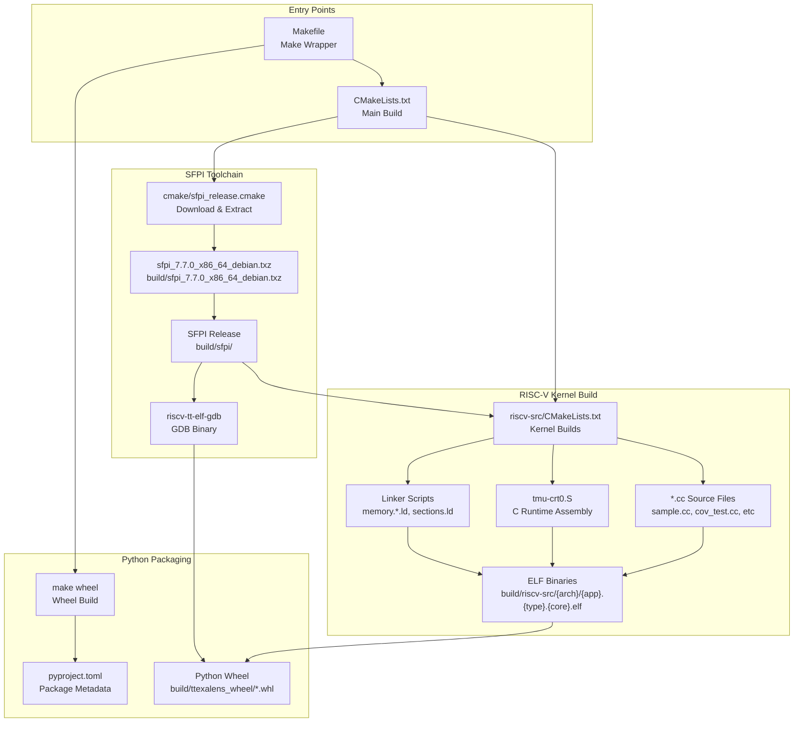

**Build System Overview**: The build system consists of three main stages: (1) SFPI toolchain download and extraction, (2) RISC-V kernel compilation for test applications, and (3) Python wheel packaging. The Make wrapper provides convenient high-level targets, while CMake handles the detailed build orchestration.

Sources: [CMakeLists.txt:1-47](), [Makefile:1-46](), [cmake/sfpi_release.cmake:1-36]()
```


#### Compilation Matrix


```mermaid
graph TB
    subgraph "Architectures"
        Wormhole["wormhole"]
        Blackhole["blackhole"]
    end
    
    subgraph "Applications"
        Sample["sample.cc<br/>Example program"]
        RunElfTest["run_elf_test.cc<br/>ELF loading test"]
        Callstack["callstack.cc<br/>Stack unwinding test"]
        CovTest["cov_test.cc<br/>Coverage test"]
        GlobalsTest["globals_test.cc<br/>Global variable test"]
        EdgeMemTest["edge_mem_test.cc<br/>Memory boundary test"]
    end
    
    subgraph "Core Types"
        Brisc["brisc<br/>Binary RISC"]
        Trisc0["trisc0<br/>Tensor RISC 0"]
        Trisc1["trisc1<br/>Tensor RISC 1"]
        Trisc2["trisc2<br/>Tensor RISC 2"]
        Ncrisc["ncrisc<br/>Network RISC"]
        Erisc["erisc<br/>Ethernet RISC (WH)"]
        Erisc0["erisc0<br/>Ethernet RISC 0 (BH)"]
        Erisc1["erisc1<br/>Ethernet RISC 1 (BH)"]
    end
    
    subgraph "Build Types"
        Debug["debug<br/>-O0, full symbols"]
        Release["release<br/>-O3, optimized"]
        Coverage["coverage<br/>-O0, gcov instrumentation"]
    end
    
    Wormhole -.-> Brisc
    Wormhole -.-> Trisc0
    Wormhole -.-> Erisc
    Blackhole -.-> Brisc
    Blackhole -.-> Erisc0
    Blackhole -.-> Erisc1
    
    Sample -.-> Debug
    Sample -.-> Release
    Sample -.-> Coverage
```

**Build Matrix**: TTExaLens compiles 6 test applications for 2 architectures (Wormhole, Blackhole), 8 core types, and 3 build configurations, resulting in approximately 288 ELF binaries. Not all combinations are valid (e.g., Wormhole doesn't have `erisc0`/`erisc1`).

Sources: [riscv-src/CMakeLists.txt:34-37]()
```


#### Build Function Implementation


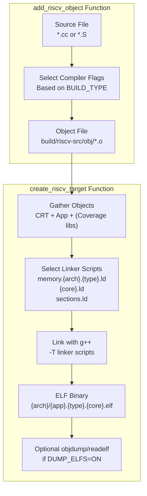

**Compilation Pipeline**: The build system uses two CMake functions to manage compilation. `add_riscv_object` compiles individual source files to object files with configuration-specific flags. `create_riscv_target` links object files with architecture-specific linker scripts to produce final ELF binaries.

The `create_riscv_target` function at [riscv-src/CMakeLists.txt:92-150]() performs:
1. Selects compiler and linker options based on `BUILD_TYPE` (debug/release/coverage)
2. Gathers required object files: CRT (`tmu-crt0.{type}.o`), application object, and optionally coverage libraries
3. Resolves linker scripts:
   - `memory.{arch}.{type}.ld` - Memory layout for architecture and build type
   - `{core}.ld` - Core-specific memory regions
   - `sections.ld` - Common section definitions
4. Invokes `riscv-tt-elf-g++` with `-T` flags to link objects
5. Optionally generates disassembly and DWARF dumps if `DUMP_ELFS=ON`

Sources: [riscv-src/CMakeLists.txt:42-150]()
```


#### Coverage Library Compilation


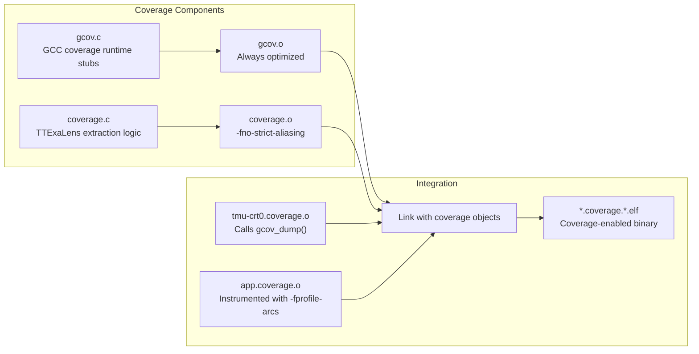

**Coverage Build**: Coverage builds link two additional libraries: `gcov.o` provides GCC coverage runtime stubs, and `coverage.o` contains TTExaLens-specific extraction logic. Both are compiled with optimization (`-O3`) to minimize overhead. The `coverage.c` file is compiled with `-fno-strict-aliasing` due to pointer aliasing tricks used to access coverage data structures.

The C runtime for coverage builds (`tmu-crt0.coverage.o`) includes a call to `gcov_dump()` which extracts coverage counters before the program exits. This enables coverage analysis without host filesystem support.

Sources: [riscv-src/CMakeLists.txt:61-82](), [riscv-src/CMakeLists.txt:108-115]()
```


#### Dockerfile Architecture


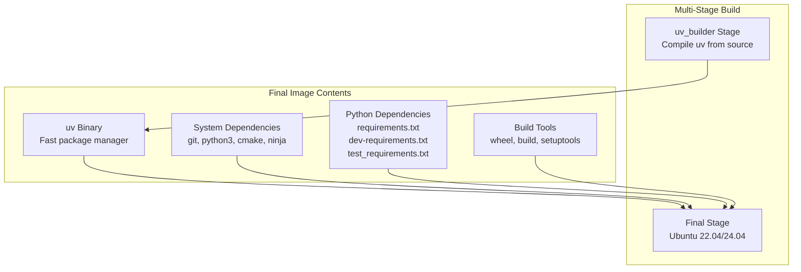

**Docker Build Strategy**: The Dockerfile uses a multi-stage build to compile the `uv` package manager from source, then copies it to the final image. The final image removes Python's `EXTERNALLY-MANAGED` marker to allow system-wide pip installations. All Python dependencies are installed using `uv pip` for speed.

Building the Docker image:
```bash
docker build -t ttexalens-ci \
    --build-arg UBUNTU_VERSION=22.04 \
    -f .github/Dockerfile.ci .
```

Building TTExaLens inside the container:
```bash
docker run --rm -v $(pwd):/workspace -w /workspace ttexalens-ci \
    bash -c "make clean && make"
```

Sources: [.github/Dockerfile.ci:1-42]()

---
```


#### GDB Binary Packaging


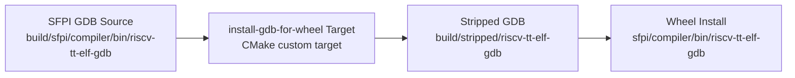

**GDB Packaging**: The `install-gdb-for-wheel` target copies the GDB binary from the SFPI toolchain to `build/stripped/`. If `STRIP_SYMBOLS=ON`, it strips debug symbols to reduce size (~90MB → ~15MB). When building a Python wheel, CMake installs this binary to the wheel's `sfpi/compiler/bin/` directory.

Sources: [CMakeLists.txt:23-46]()
1d:T3bf5,
```


## Execute commands on remote device


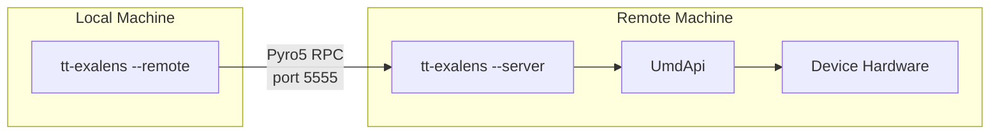


## Use remote context for operations


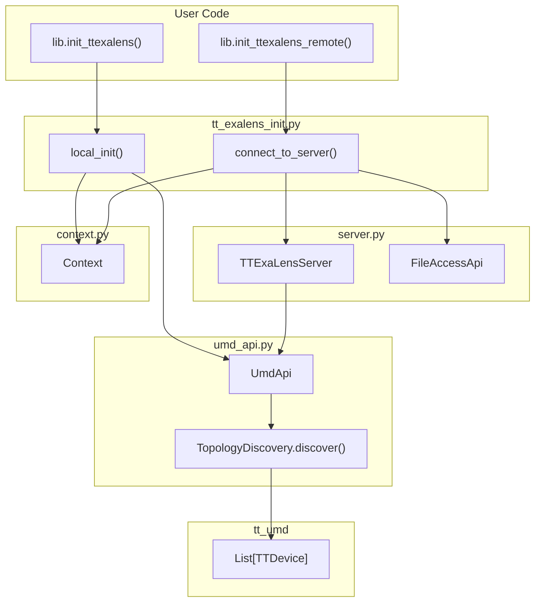


## Write words


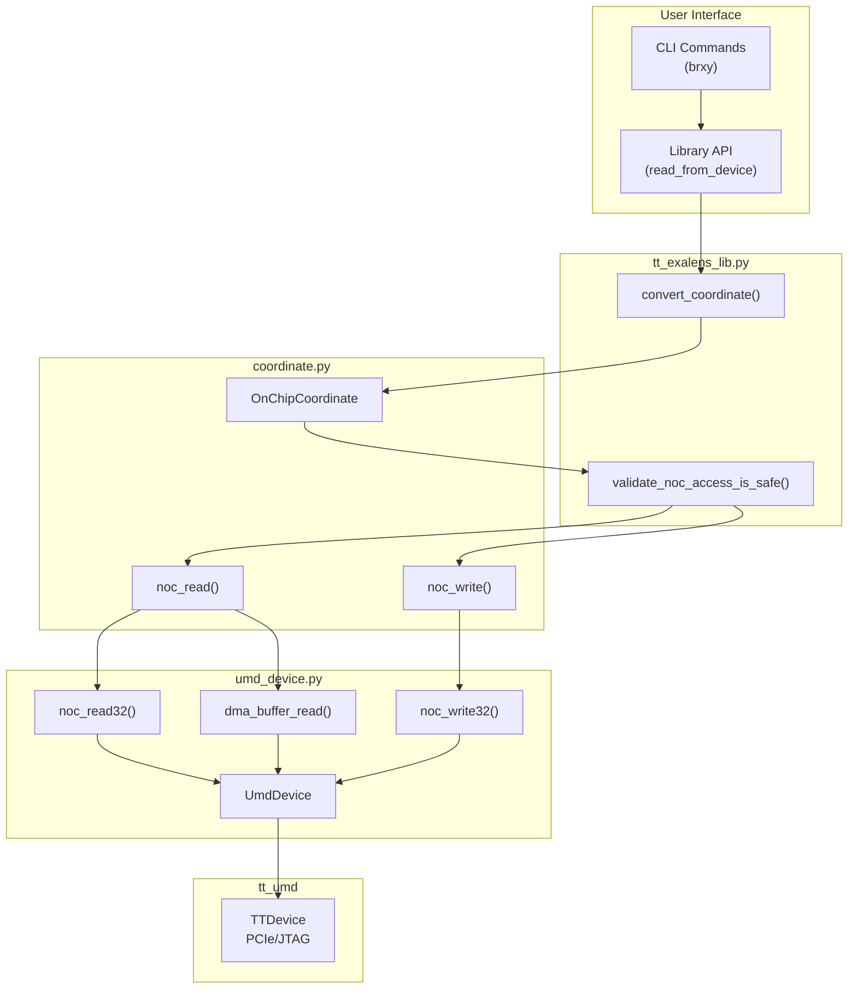


## Load to all functional worker cores


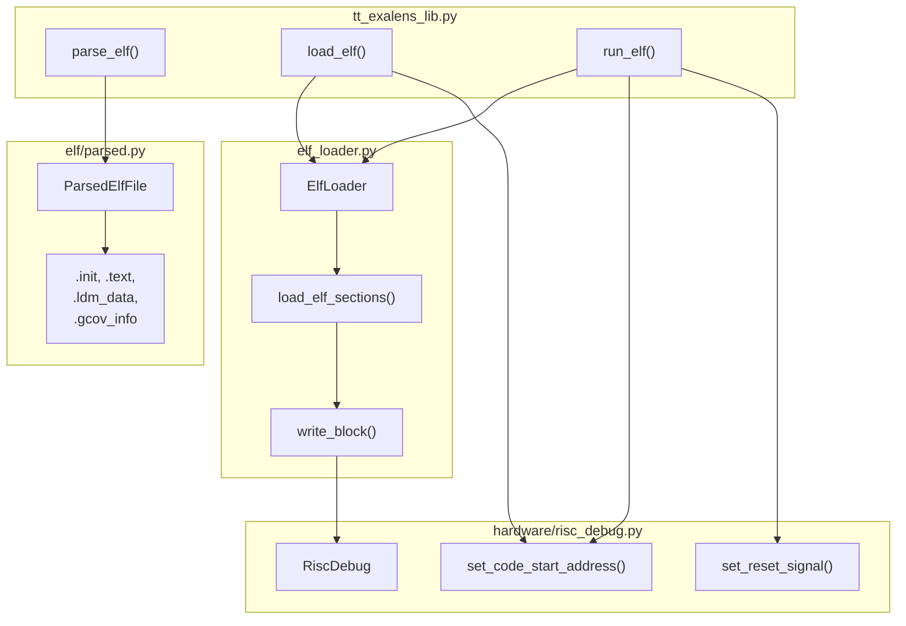


## Continue execution


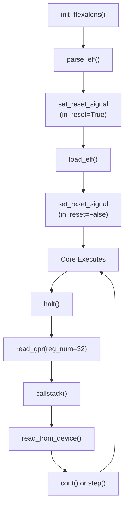


### Initialization Architecture


```mermaid
graph TB
    subgraph "User Code"
        UserApp["User Application"]
        CLIApp["CLI Application"]
    end
    
    subgraph "Initialization Functions"
        InitLocal["init_ttexalens()"]
        InitRemote["init_ttexalens_remote()"]
        LoadContext["load_context()"]
    end
    
    subgraph "Interface Layer"
        LocalInit["local_init()<br/>UmdApi"]
        ConnectServer["connect_to_server()<br/>Pyro5"]
        FileAPI["FileAccessApi"]
    end
    
    subgraph "Context Management"
        ContextObj["Context object<br/>umd_api, file_api<br/>devices, config"]
        GlobalCtx["GLOBAL_CONTEXT<br/>module variable"]
        CheckCtx["check_context()<br/>auto-init"]
    end
    
    subgraph "Server Mode"
        StartServer["start_server()"]
        ServerObj["TTExaLensServer<br/>Pyro5 Daemon"]
    end
    
    subgraph "Library Functions"
        ReadFunc["read_from_device()"]
        WriteFunc["write_to_device()"]
        LoadElf["load_elf()"]
        OtherFuncs["Other API functions"]
    end
    
    UserApp --> InitLocal
    UserApp --> InitRemote
    CLIApp --> InitLocal
    CLIApp --> InitRemote
    CLIApp --> StartServer
    
    InitLocal --> LocalInit
    InitLocal --> FileAPI
    InitLocal --> LoadContext
    
    InitRemote --> ConnectServer
    InitRemote --> LoadContext
    
    LoadContext --> ContextObj
    LoadContext --> GlobalCtx
    
    StartServer --> ServerObj
    ServerObj -->|"exposes"| LocalInit
    ServerObj -->|"exposes"| FileAPI
    
    ContextObj --> GlobalCtx
    
    ReadFunc --> CheckCtx
    WriteFunc --> CheckCtx
    LoadElf --> CheckCtx
    OtherFuncs --> CheckCtx
    
    CheckCtx -->|"if None"| InitLocal
    CheckCtx -->|"else"| GlobalCtx
```


#### Local Initialization Flow


```mermaid
graph TD
    Start["init_ttexalens()"]
    LocalInit["local_init(init_jtag, use_noc1, simulation_directory)"]
    CreateUmdApi["Create UmdApi instance<br/>- Open TTDevice<br/>- Query cluster descriptor<br/>- Discover devices"]
    CreateFileApi["Create FileAccessApi instance<br/>- Direct file system access"]
    LoadContext["load_context(umd_api, file_api, use_noc1, use_4B_mode, noc_failover)"]
    CreateContext["Create Context object<br/>- Store interfaces<br/>- Store configuration"]
    SetGlobal["Set GLOBAL_CONTEXT = context"]
    RegisterCleanup["Register atexit cleanup handler"]
    Return["Return Context"]
    
    Start --> LocalInit
    LocalInit --> CreateUmdApi
    LocalInit --> CreateFileApi
    CreateUmdApi --> LoadContext
    CreateFileApi --> LoadContext
    LoadContext --> CreateContext
    CreateContext --> SetGlobal
    SetGlobal --> RegisterCleanup
    RegisterCleanup --> Return
```


#### Remote Initialization Flow


```mermaid
graph TD
    Start["init_ttexalens_remote(ip_address, port)"]
    ConnectServer["connect_to_server(ip_address, port)"]
    CreateProxies["Create Pyro5 proxies<br/>- UmdApi proxy<br/>- FileAccessApi proxy"]
    SetSerializer["Set serializer = 'serpent'<br/>Configure binary transfer"]
    LoadContext["load_context(umd_api_proxy, file_api_proxy, use_4B_mode, noc_failover)"]
    CreateContext["Create Context object<br/>- Store proxy interfaces<br/>- Store configuration"]
    SetGlobal["Set GLOBAL_CONTEXT = context"]
    Return["Return Context"]
    
    Start --> ConnectServer
    ConnectServer --> CreateProxies
    CreateProxies --> SetSerializer
    SetSerializer --> LoadContext
    LoadContext --> CreateContext
    CreateContext --> SetGlobal
    SetGlobal --> Return
```


#### CLI Modes


```mermaid
graph TB
    CLIStart["tt-exalens command"]
    ParseArgs["Parse arguments<br/>--server, --remote, or default"]
    
    ServerMode{"--server<br/>flag?"}
    ServerBG{"--background<br/>flag?"}
    RemoteMode{"--remote<br/>flag?"}
    
    InitServerBG["init_ttexalens()<br/>start_server(port)<br/>Wait for exit.server file"]
    InitServerFG["Set --start-server=port<br/>Continue to main loop"]
    InitRemote["init_ttexalens_remote(ip, port)"]
    InitLocal["init_ttexalens(init_jtag, use_noc1, use_4B_mode, simulation_directory)"]
    
    MainLoop["main_loop(args, context)"]
    
    CLIStart --> ParseArgs
    ParseArgs --> ServerMode
    
    ServerMode -->|"Yes"| ServerBG
    ServerMode -->|"No"| RemoteMode
    
    ServerBG -->|"Yes"| InitServerBG
    ServerBG -->|"No"| InitServerFG
    
    RemoteMode -->|"Yes"| InitRemote
    RemoteMode -->|"No"| InitLocal
    
    InitServerFG --> InitLocal
    InitRemote --> MainLoop
    InitLocal --> MainLoop
```


#### TTExaLensServer Architecture


```mermaid
graph TB
    Server["<b>TTExaLensServer</b><br/>Pyro5 Daemon"]
    
    subgraph "Exposed Objects"
        UmdProxy["UmdApi proxy<br/>objectId='umd_api'"]
        FileProxy["FileAccessApi proxy<br/>objectId='file_api'"]
        DynamicProxies["Dynamic UMD objects<br/>objectId='umd_obj_*'"]
    end
    
    subgraph "Serialization"
        SerpentConfig["Pyro5 serpent serializer<br/>Handle bytes, enums, UMD types"]
        CustomSerializers["register_class_to_dict()<br/>tt_umd types"]
    end
    
    subgraph "Local Resources"
        LocalUmdApi["Local UmdApi<br/>TTDevice access"]
        LocalFileApi["Local FileAccessApi<br/>File system"]
    end
    
    Client["Remote Client<br/>init_ttexalens_remote()"]
    
    Client -->|"Pyro5 RPC"| Server
    Server --> UmdProxy
    Server --> FileProxy
    Server --> DynamicProxies
    
    UmdProxy --> LocalUmdApi
    FileProxy --> LocalFileApi
    
    Server --> SerpentConfig
    SerpentConfig --> CustomSerializers
```


### Device Abstraction Overview


```mermaid
graph TB
    subgraph "Public API Layer"
        API["tt_exalens_lib.py<br/>convert_coordinate()"]
        Context["Context<br/>devices dict"]
    end
    
    subgraph "Device Abstraction"
        DeviceFactory["Device.create()"]
        Device["Device<br/>Abstract Base"]
        WH["WormholeDevice"]
        BH["BlackholeDevice"]
        QS["QuasarDevice"]
    end
    
    subgraph "Coordinate System"
        OnChipCoord["OnChipCoordinate<br/>_noc0_coord<br/>_device"]
        CoordCreate["OnChipCoordinate.create()"]
        CoordConvert["to() / from_noc0() / to_noc0()"]
    end
    
    subgraph "Block Management"
        GetBlock["get_block()"]
        GetBlocks["get_blocks()"]
        GetBlockLocs["get_block_locations()"]
        BlockTypes["block_types dict"]
    end
    
    subgraph "Hardware Access"
        UmdDevice["UmdDevice"]
        SocDesc["SOC Descriptor"]
    end
    
    API --> Context
    Context --> Device
    API --> CoordCreate
    
    DeviceFactory --> WH
    DeviceFactory --> BH
    DeviceFactory --> QS
    WH --> Device
    BH --> Device
    QS --> Device
    
    Device --> OnChipCoord
    OnChipCoord --> CoordConvert
    CoordCreate --> OnChipCoord
    
    Device --> GetBlock
    Device --> GetBlocks
    Device --> GetBlockLocs
    Device --> BlockTypes
    
    Device --> UmdDevice
    Device --> SocDesc
    UmdDevice --> SocDesc
```


#### The Five Coordinate Systems


```mermaid
graph LR
    subgraph "Coordinate Systems"
        NOC0["noc0<br/>Physical NOC 0 routing<br/>Notation: X-Y"]
        NOC1["noc1<br/>Physical NOC 1 routing<br/>Notation: X-Y"]
        DIE["die<br/>Geographic layout<br/>Notation: X,Y"]
        LOGICAL["logical<br/>User-facing grid<br/>Notation: X,Y or qX,Y<br/>Harvesting hidden"]
        TRANSLATED["translated<br/>Hardware layout<br/>Notation: X-Y<br/>Harvesting aware"]
    end
    
    subgraph "Internal Storage"
        Storage["OnChipCoordinate<br/>_noc0_coord: tuple[int, int]<br/>_device: Device"]
    end
    
    NOC0 -.stored as.-> Storage
    NOC1 -.converts to.-> Storage
    DIE -.converts to.-> Storage
    LOGICAL -.converts to.-> Storage
    TRANSLATED -.converts to.-> Storage
    
    Storage -.converts from.-> NOC0
    Storage -.converts from.-> NOC1
    Storage -.converts from.-> DIE
    Storage -.converts from.-> LOGICAL
    Storage -.converts from.-> TRANSLATED
```

| Coordinate System | Purpose | Notation | Harvesting Dependent |
|-------------------|---------|----------|---------------------|
| **noc0** | NOC 0 routing coordinates. Distance of 1 = 1 hop on NOC. Wraps around. | `X-Y` | No |
| **noc1** | NOC 1 routing coordinates. Same as noc0 but opposite direction. | `X-Y` | No |
| **die** | Geographic/physical layout on die. Used in marketing materials. | `X,Y` | No |
| **logical** | User-facing Cartesian grid. Starts at 0,0, hides harvesting. Includes core type. | `X,Y` or `qX,Y` (q=core type prefix) | Yes |
| **translated** | NOC coordinates adjusted for harvesting. Used by NOC hardware. | `X-Y` | Yes |

The logical coordinate system includes core type information, so the same `(X,Y)` can refer to different core types:
- `0,0` or `t0,0` - Tensix core at logical position (0,0)
- `e0,0` - Ethernet core at logical position (0,0)
- `d0,0` - DRAM core at logical position (0,0)
```


#### Coordinate Conversion Methods


```mermaid
graph TB
    subgraph "Public API"
        ConvertCoord["convert_coordinate()<br/>str → OnChipCoordinate"]
    end
    
    subgraph "OnChipCoordinate Methods"
        OCCreate["OnChipCoordinate.create()<br/>str → OnChipCoordinate"]
        OCTo["to(output_type)<br/>→ tuple or tuple[tuple, str]"]
        OCToStr["to_str(output_type)<br/>→ str"]
        OCToUserStr["to_user_str()<br/>→ str (noc0 + logical)"]
        OCChange["change_device(device)<br/>→ OnChipCoordinate"]
    end
    
    subgraph "Device Conversion Methods"
        DevToNoc0["to_noc0(coord_tuple, coord_system, core_type)<br/>→ tuple[int, int]"]
        DevFromNoc0["from_noc0(noc0_tuple, coord_system)<br/>→ tuple[tuple[int, int], str]"]
    end
    
    subgraph "Internal Storage"
        Noc0["_noc0_coord: tuple[int, int]<br/>_device: Device"]
        LookupTables["_to_noc0: dict<br/>_from_noc0: dict"]
    end
    
    ConvertCoord --> OCCreate
    OCCreate --> OCTo
    OCTo --> OCToStr
    OCTo --> DevFromNoc0
    
    DevToNoc0 --> LookupTables
    DevFromNoc0 --> LookupTables
    
    LookupTables --> Noc0
```

**OnChipCoordinate conversion methods:**

```python
```


#### Block Types


```mermaid
graph TB
    subgraph "Block Type Definitions"
        BlockTypes["Device.block_types<br/>Dictionary of BlockType"]
        BlockType["BlockType dataclass<br/>symbol, desc, core_type<br/>core_harvesting, color"]
    end
    
    subgraph "Block Type Categories"
        FunctionalWorkers["functional_workers<br/>Tensix cores<br/>symbol: ."]
        Eth["eth<br/>Ethernet cores<br/>symbol: E"]
        Dram["dram<br/>DRAM controllers<br/>symbol: D"]
        Arc["arc<br/>ARC processor<br/>symbol: A"]
        Pcie["pcie<br/>PCIe interface<br/>symbol: P"]
        HarvestedWorkers["harvested_workers<br/>Harvested Tensix<br/>symbol: -"]
        RouterOnly["router_only<br/>NOC router only<br/>symbol: (space)"]
    end
    
    BlockTypes --> BlockType
    BlockType --> FunctionalWorkers
    BlockType --> Eth
    BlockType --> Dram
    BlockType --> Arc
    BlockType --> Pcie
    BlockType --> HarvestedWorkers
    BlockType --> RouterOnly
```

The complete block type definitions:

| Block Type | Symbol | Description | Core Type | Core Harvesting | Color |
|------------|--------|-------------|-----------|-----------------|-------|
| `functional_workers` | `.` | Functional Tensix worker | `tensix` | `False` | Green |
| `eth` | `E` | Ethernet core | `eth` | `False` | Yellow |
| `harvested_eth` | `e` | Harvested Ethernet | `eth` | `True` | Red |
| `arc` | `A` | ARC processor | `arc` | `False` | Grey |
| `dram` | `D` | DRAM controller | `dram` | `False` | Teal |
| `harvested_dram` | `d` | Harvested DRAM | `dram` | `True` | Red |
| `pcie` | `P` | PCIe interface | `pcie` | `False` | Grey |
| `router_only` | ` ` | Router only (no core) | `router_only` | `False` | Grey |
| `harvested_workers` | `-` | Harvested Tensix | `tensix` | `True` | Red |
| `security` | `S` | Security core | `security` | `False` | Grey |
| `l2cpu` | `C` | L2 CPU | `l2cpu` | `False` | Grey |
```


#### Querying Block Locations


```mermaid
graph TB
    subgraph "Block Location APIs"
        GetBlockLocs["get_block_locations(block_type)<br/>→ list[OnChipCoordinate]"]
        GetBlock["get_block(location)<br/>→ NocBlock"]
        GetBlocks["get_blocks(block_type)<br/>→ list[NocBlock]"]
        GetBlockType["get_block_type(location)<br/>→ str"]
    end
    
    subgraph "Internal Data Structures"
        BlockLocations["_block_locations<br/>dict[str, list[OnChipCoordinate]]"]
        Noc0ToBlockType["_noc0_to_block_type<br/>dict[tuple[int, int], str]"]
        SocDescriptor["_soc_descriptor<br/>UMD SOC Descriptor"]
    end
    
    subgraph "Special Block Getters"
        ArcBlock["arc_block<br/>→ ArcBlock"]
        ActiveEth["active_eth_block_locations<br/>→ list[OnChipCoordinate]"]
        IdleEth["idle_eth_block_locations<br/>→ list[OnChipCoordinate]"]
    end
    
    GetBlockLocs --> BlockLocations
    GetBlock --> GetBlockLocs
    GetBlocks --> GetBlockLocs
    GetBlockType --> Noc0ToBlockType
    
    BlockLocations --> SocDescriptor
    Noc0ToBlockType --> BlockLocations
    
    ArcBlock --> GetBlocks
    ActiveEth --> BlockLocations
    IdleEth --> BlockLocations
```

**Block location query methods:**

```python
```


#### Rendering System


```mermaid
graph TB
    subgraph "Rendering Entry Point"
        Render["render(axis_coordinate, cell_renderer, legend)<br/>→ str"]
        DeviceStr["__str__()<br/>→ render() with defaults"]
    end
    
    subgraph "Rendering Process"
        ComputeExtents["Compute UI coordinate extents<br/>ui_hor_range, ui_ver_range"]
        BuildGrid["Build 2D grid<br/>all_block_locs dict"]
        RenderCells["Render each cell<br/>cell_renderer(location)"]
        AddLegend["Add legend column"]
        Tabulate["Format with tabulate"]
    end
    
    subgraph "Coordinate System Selection"
        AxisCoords["axis_coordinate<br/>die, noc0, noc1<br/>logical, translated"]
        HorizontalAxis["OnChipCoordinate.horizontal_axis()"]
        VerticalAxis["OnChipCoordinate.vertical_axis()"]
    end
    
    subgraph "Cell Rendering"
        DefaultRenderer["Default: to_str('logical')"]
        CustomRenderer["Custom: user function"]
        RiscvStatus["RISC-V status renderer"]
        BlockSymbol["Block symbol renderer"]
        CoordRenderer["Coordinate renderer"]
    end
    
    Render --> ComputeExtents
    ComputeExtents --> BuildGrid
    BuildGrid --> RenderCells
    RenderCells --> AddLegend
    AddLegend --> Tabulate
    
    Render --> AxisCoords
    AxisCoords --> HorizontalAxis
    AxisCoords --> VerticalAxis
    
    RenderCells --> DefaultRenderer
    RenderCells --> CustomRenderer
    CustomRenderer --> RiscvStatus
    CustomRenderer --> BlockSymbol
    CustomRenderer --> CoordRenderer
```

**Render method signature:**

```python
def render(
    self, 
    axis_coordinate: str = "die",
    cell_renderer: Callable[[OnChipCoordinate], str] | None = None,
    legend: list[str] | None = None
) -> str
```

**Parameters:**

- `axis_coordinate`: The coordinate system to use for the grid axes. Options: `"die"`, `"noc0"`, `"noc1"`, `"logical"`, `"logical-tensix"`, `"logical-eth"`, `"logical-dram"`, `"translated"`
- `cell_renderer`: Optional function that takes an `OnChipCoordinate` and returns a string for that cell. If `None`, defaults to `location.to_str("logical")`
- `legend`: Optional list of strings to display as a legend column on the right side

**Example custom cell renderers:**

```python
```


### Coordinate System Initialization


```mermaid
graph TB
    subgraph "Initialization Flow"
        DeviceInit["Device.__init__()"]
        InitCoordSys["_init_coordinate_systems()"]
    end
    
    subgraph "Build Translation Tables"
        IterBlocks["Iterate all block_types<br/>and locations"]
        QueryUmd["Query UMD convert_from_noc0()<br/>for each coordinate system"]
        PopulateFromNoc0["Populate _from_noc0<br/>map: (noc0, coord_sys) → (coords, core_type)"]
        PopulateToNoc0["Populate _to_noc0<br/>map: (coords, coord_sys, core_type) → noc0"]
        AddDie["Add die coordinates<br/>(not supported by UMD)"]
    end
    
    subgraph "Build Block Type Map"
        BuildNoc0Map["Build _noc0_to_block_type<br/>map: noc0 → block_type"]
    end
    
    DeviceInit --> InitCoordSys
    InitCoordSys --> IterBlocks
    IterBlocks --> QueryUmd
    QueryUmd --> PopulateFromNoc0
    QueryUmd --> PopulateToNoc0
    PopulateToNoc0 --> AddDie
    IterBlocks --> BuildNoc0Map
```

The initialization process:

1. **Populate `_noc0_to_block_type`**: Map each NOC0 coordinate to its block type by iterating `_block_locations`

2. **Build conversion tables**: For each NOC0 location and block type:
   - Query UMD's coordinate manager for conversions to `noc1`, `logical`, `translated`
   - Store bidirectional mappings in `_from_noc0` and `_to_noc0` dictionaries
   - Add `die` coordinate mappings (not supported by UMD, computed using `DIE_X_TO_NOC_0_X` and similar lookup tables)

3. **Handle multiple core types**: `logical` and `die` coordinates include core type as a third dimension. `translated` and `noc1` are unique per coordinate (no ambiguity), so they map with `core_type="any"`

**Lookup table structures:**

```python
```


### Register Access Architecture


```mermaid
graph TB
    User["User Code"]
    API["read_register()<br/>write_register()"]
    Convert["convert_coordinate()"]
    Coord["OnChipCoordinate"]
    GetBlock["location.noc_block"]
    GetRegStore["noc_block.get_register_store()"]
    RegStore["RegisterStore"]
    ReadReg["register_store.read_register()"]
    WriteReg["register_store.write_register()"]
    NOCOps["noc_read32() / noc_write32()"]
    Device["Device"]
    Hardware["NOC Hardware"]
    
    User --> API
    API --> Convert
    Convert --> Coord
    API --> GetBlock
    GetBlock --> GetRegStore
    GetRegStore --> RegStore
    API --> ReadReg
    API --> WriteReg
    ReadReg --> NOCOps
    WriteReg --> NOCOps
    NOCOps --> Device
    Device --> Hardware
```

**Flow description:**

1. User calls `read_register()` or `write_register()` with location string and register identifier
2. Location is converted to `OnChipCoordinate` via `convert_coordinate()`
3. `RegisterStore` is obtained from the NOC block at that coordinate
4. For reads: `RegisterStore.read_register()` performs the read operation
5. For writes: `RegisterStore.write_register()` performs the write operation
6. Register operations translate to `noc_read32()` or `noc_write32()` calls
7. Device layer handles NOC operations with safe mode validation and failover
8. Hardware access occurs via NOC0 or NOC1

Sources: [ttexalens/tt_exalens_lib.py:497-572](), [ttexalens/device.py:329-372]()

#### Register Description Classes

```mermaid
graph TB
    RegDesc["RegisterDescription<br/>(base class)"]
    CfgReg["ConfigurationRegisterDescription<br/>index: int<br/>mask: int<br/>shift: int"]
    DbgReg["DebugRegisterDescription<br/>offset: int"]
    
    RegDesc --> CfgReg
    RegDesc --> DbgReg
    
    StrName["String Name<br/>e.g., 'ALU_FORMAT_SPEC_REG2_Dstacc'"]
    RegStore["RegisterStore"]
    Lookup["register_descriptions<br/>dictionary"]
    
    StrName --> RegStore
    CfgReg --> RegStore
    DbgReg --> RegStore
    RegStore --> Lookup
```

The `RegisterStore` class maintains a dictionary mapping register names to their descriptions. When a string name is provided, it is looked up to obtain the corresponding `RegisterDescription` object.

Sources: [ttexalens/tt_exalens_lib.py:523-533](), [test/ttexalens/unit_tests/test_lib.py:397-437]()
```


#### API Call Flow


```mermaid
graph TB
    User["User Code"]
    
    subgraph "Public API Layer"
        ReadMem["read_riscv_memory()"]
        WriteMem["write_riscv_memory()"]
    end
    
    subgraph "Core Interface"
        RiscDebug["RiscDebug<br/>(Abstract Interface)"]
        BabyRiscDebug["BabyRiscDebug<br/>(Base Implementation)"]
    end
    
    subgraph "Platform Implementations"
        WHDebug["WormholeBabyRiscDebug"]
        BHDebug["BlackholeBabyRiscDebug"]
        QDebug["QuasarBabyRiscDebug"]
    end
    
    subgraph "Hardware Access"
        DebugHW["BabyRiscDebugHardware<br/>debug_hardware"]
        MemAccess["MemoryAccess<br/>mem_access"]
        RegisterStore["RegisterStore<br/>register_store"]
    end
    
    subgraph "Hardware Layer"
        NOC["NOC Interface<br/>noc_read/noc_write"]
        DebugRegs["Debug Registers<br/>RISC_DBG_CNTL0/1<br/>RISC_DBG_STATUS0/1"]
    end
    
    User --> ReadMem
    User --> WriteMem
    
    ReadMem --> RiscDebug
    WriteMem --> RiscDebug
    
    RiscDebug --> BabyRiscDebug
    BabyRiscDebug --> WHDebug
    BabyRiscDebug --> BHDebug
    BabyRiscDebug --> QDebug
    
    BabyRiscDebug --> DebugHW
    BabyRiscDebug --> MemAccess
    BabyRiscDebug --> RegisterStore
    
    DebugHW --> DebugRegs
    MemAccess --> NOC
    RegisterStore --> NOC
    
    DebugRegs --> NOC
```


#### Byte-Level Memory Access


```mermaid
graph LR
    subgraph "User Request"
        Unaligned["read_memory_bytes(0x1001, 3)"]
    end
    
    subgraph "Alignment Logic"
        Read1["Read word at 0x1000"]
        Read2["Read word at 0x1004"]
        Extract["Extract bytes 1,2,3<br/>from words"]
    end
    
    subgraph "Hardware Access"
        Debug["Debug Interface<br/>read_memory(addr)"]
    end
    
    Unaligned --> Read1
    Unaligned --> Read2
    Read1 --> Extract
    Read2 --> Extract
    Extract --> Debug
```

The implementation automatically:
- Aligns read/write operations to 4-byte boundaries
- Performs read-modify-write for partial word writes
- Handles cross-boundary access spanning multiple words
```


#### Debug Register Protocol


```mermaid
graph TB
    subgraph "Debug Registers"
        CNTL0["RISC_DBG_CNTL0<br/>(Command/Control)"]
        CNTL1["RISC_DBG_CNTL1<br/>(Write Data)"]
        STATUS0["RISC_DBG_STATUS0<br/>(Status Flags)"]
        STATUS1["RISC_DBG_STATUS1<br/>(Read Data)"]
    end
    
    subgraph "Debug Commands"
        CMD["Command Register<br/>(Virtual)"]
        ARG0["Argument 0<br/>(Address/Register)"]
        ARG1["Argument 1<br/>(Write Value)"]
        RET["Return Value<br/>(Read Result)"]
    end
    
    subgraph "Operations"
        ReadMem["Read Memory"]
        WriteMem["Write Memory"]
        ReadGPR["Read GPR"]
        WriteGPR["Write GPR"]
        Halt["Halt"]
        Step["Step"]
        Continue["Continue"]
    end
    
    CNTL0 -.->|"Triggers"| CMD
    CNTL1 -.->|"Provides"| ARG1
    STATUS0 -.->|"Contains"| RET
    STATUS1 -.->|"Contains"| RET
    
    CMD --> ReadMem
    CMD --> WriteMem
    CMD --> ReadGPR
    CMD --> WriteGPR
    CMD --> Halt
    CMD --> Step
    CMD --> Continue
    
    ARG0 --> ReadMem
    ARG0 --> WriteMem
    ARG0 --> ReadGPR
    ARG0 --> WriteGPR
```


#### Platform Implementation Classes


```mermaid
graph TB
    RiscDebug["RiscDebug<br/>(Abstract Interface)"]
    BabyRiscDebug["BabyRiscDebug<br/>(Base Implementation)"]
    
    Wormhole["WormholeBabyRiscDebug"]
    Blackhole["BlackholeBabyRiscDebug"]
    Quasar["QuasarBabyRiscDebug"]
    
    RiscDebug --> BabyRiscDebug
    BabyRiscDebug --> Wormhole
    BabyRiscDebug --> Blackhole
    BabyRiscDebug --> Quasar
    
    Wormhole -.->|"Overrides"| ContWH["cont()<br/>step()<br/>read_gpr(32)"]
    Blackhole -.->|"Overrides"| ContBH["step()<br/>read_gpr(32)<br/>read/write_memory_bytes()"]
    Quasar -.->|"Overrides"| ContQ["invalidate_instruction_cache()<br/>read_gpr(32)"]
```


### Core Architecture


```mermaid
graph TB
    subgraph "User Code"
        UserScript["Python Script<br/>var.member[index]"]
    end
    
    subgraph "Symbolic Access Layer"
        ElfVariable["ElfVariable<br/>Operator Overloading"]
        TypeDie["ElfDie (type_die)<br/>Type Information"]
        Address["address: int<br/>Memory Location"]
    end
    
    subgraph "DWARF Information"
        ParsedElf["ParsedElfFile<br/>get_global()"]
        Variables["variables dict<br/>Name → ElfDie"]
        Types["types dict<br/>Type Definitions"]
        Members["members dict<br/>Struct Members"]
    end
    
    subgraph "Memory Access"
        MemoryAccess["MemoryAccess<br/>read()/write()"]
        Device["Device Memory<br/>NOC Operations"]
    end
    
    UserScript --> ElfVariable
    ElfVariable --> TypeDie
    ElfVariable --> Address
    ElfVariable --> MemoryAccess
    
    ParsedElf --> Variables
    ParsedElf --> Types
    ParsedElf --> Members
    
    Variables --> ElfVariable
    Types --> TypeDie
    Members --> TypeDie
    
    MemoryAccess --> Device
    
    TypeDie -.provides.-> Address
```

**Diagram: Symbolic Variable Access Architecture**

The `ElfVariable` class maintains three essential attributes: the type DIE (`ElfDie`) describing the variable's type structure, the memory address where the variable resides, and a `MemoryAccess` object for reading/writing bytes. All symbolic operations (member access, indexing, dereferencing) return new `ElfVariable` instances with updated type and address information.
```


#### Obtaining Global Variables


```mermaid
graph LR
    ParsedElf["ParsedElfFile"]
    Variables["variables: dict"]
    FindDie["find_die_by_name()"]
    GetGlobal["get_global()"]
    ReadGlobal["read_global()"]
    ElfVar["ElfVariable<br/>(lazy)"]
    ElfVarCached["ElfVariable<br/>(cached)"]
    
    ParsedElf --> Variables
    ParsedElf --> FindDie
    FindDie --> GetGlobal
    FindDie --> ReadGlobal
    GetGlobal --> ElfVar
    ReadGlobal --> ElfVarCached
    
    Variables -.fallback.-> GetGlobal
```

**Diagram: Global Variable Access Paths**

The `get_global()` method [ttexalens/elf/parsed.py:243-260]() first attempts fast lookup using `find_die_by_name()`, falling back to the full `variables` dictionary if needed. Once the DIE is located, it extracts the address and resolved type to construct the `ElfVariable`. The `read_global()` method [ttexalens/elf/parsed.py:262-266]() wraps this with a single bulk memory read via `ElfVariable.read()`.
```


#### Inheritance


```mermaid
graph TB
    Start["_resolve_inheritance_member(member_name, offset)"]
    IterChildren["Iterate children of type_die"]
    IsInheritance{"child.tag_is<br/>(inheritance)?"}
    GetChildType["child_type = child.resolved_type"]
    DirectMember["child_type.get_child_by_name()"]
    DirectFound{"member<br/>found?"}
    RecurseInheritance["Recursively search inheritance"]
    InheritFound{"member<br/>found?"}
    RecurseUnnamed["Search unnamed unions"]
    UnnamedFound{"member<br/>found?"}
    NextChild["Next child"]
    ReturnNone["Return (None, None)"]
    ReturnMember["Return (offset, member)"]
    
    Start --> IterChildren
    IterChildren --> IsInheritance
    IsInheritance -->|no| NextChild
    IsInheritance -->|yes| GetChildType
    
    GetChildType --> DirectMember
    DirectMember --> DirectFound
    DirectFound -->|yes| ReturnMember
    DirectFound -->|no| RecurseInheritance
    
    RecurseInheritance --> InheritFound
    InheritFound -->|yes| ReturnMember
    InheritFound -->|no| RecurseUnnamed
    
    RecurseUnnamed --> UnnamedFound
    UnnamedFound -->|yes| ReturnMember
    UnnamedFound -->|no| NextChild
    
    NextChild --> IterChildren
    IterChildren -->|done| ReturnNone
```

**Diagram: Inheritance Member Resolution**

The algorithm handles single and multiple inheritance by tracking cumulative offsets through the inheritance chain.
```


#### Pointer Dereferencing


```mermaid
graph LR
    PointerVar["ElfVariable<br/>(pointer_type)"]
    ReadAddr["Read pointer value<br/>from memory"]
    DereferencedType["type_die.dereference_type"]
    NewVar["ElfVariable<br/>(dereference_type, address)"]
    
    PointerVar --> ReadAddr
    PointerVar --> DereferencedType
    ReadAddr --> NewVar
    DereferencedType --> NewVar
```

**Diagram: Pointer Dereferencing Process**

The method reads the pointer value (4 bytes, little-endian) from memory, then constructs a new `ElfVariable` with the dereferenced type and the read address. This enables chaining: `ptr.dereference().member`.
```


#### Arithmetic Operators


```mermaid
graph TB
    subgraph "Binary Operators"
        Add["__add__, __radd__<br/>+"]
        Sub["__sub__, __rsub__<br/>-"]
        Mul["__mul__, __rmul__<br/>*"]
        Div["__truediv__, __rtruediv__<br/>/"]
        FloorDiv["__floordiv__, __rfloordiv__<br/>//"]
        Mod["__mod__, __rmod__<br/>%"]
        Pow["__pow__, __rpow__<br/>**"]
    end
    
    subgraph "Unary Operators"
        Neg["__neg__<br/>-var"]
        Pos["__pos__<br/>+var"]
        Abs["__abs__<br/>abs(var)"]
    end
    
    subgraph "Implementation"
        ReadValue["read_value()"]
        TypeCheck["TypeError on<br/>incompatible types"]
        Return["Return computed<br/>Python value"]
    end
    
    Add --> ReadValue
    Sub --> ReadValue
    Mul --> ReadValue
    Div --> ReadValue
    FloorDiv --> ReadValue
    Mod --> ReadValue
    Pow --> ReadValue
    Neg --> ReadValue
    Pos --> ReadValue
    Abs --> ReadValue
    
    ReadValue --> TypeCheck
    TypeCheck --> Return
```

**Diagram: Arithmetic Operator Implementation Pattern**

All arithmetic operators follow the same pattern: read the variable's value, perform the operation, and return the result as a Python native type. Reverse operators (`__radd__`, etc.) enable `100 + var` syntax.
```


### Integration with Memory Access Layer


```mermaid
graph TB
    ElfVar["ElfVariable"]
    
    subgraph "MemoryAccess Implementations"
        DirectAccess["MemoryAccess.create()<br/>Direct device access"]
        CachedAccess["CachedReadMemoryAccess<br/>Cached buffer"]
        FixedAccess["FixedMemoryAccess<br/>Constant values"]
        CustomAccess["Custom MemoryAccess<br/>User-defined"]
    end
    
    ElfVar --> DirectAccess
    ElfVar --> CachedAccess
    ElfVar --> FixedAccess
    ElfVar --> CustomAccess
    
    DirectAccess --> Device["Device NOC"]
    CachedAccess --> Buffer["In-memory buffer"]
    FixedAccess --> Const["Constant bytes"]
```

**Diagram: Memory Access Abstraction**

The test suite demonstrates custom `MemoryAccess` implementations for collecting statistics [test/ttexalens/unit_tests/test_debug_symbols.py:21-49]() and simulating error conditions [test/ttexalens/unit_tests/test_debug_symbols.py:52-71]().
```


#### Accessing the ARC Block


```mermaid
graph TB
    Device["Device Instance"]
    GetBlocks["get_blocks('arc')"]
    BlockList["list[NocBlock]"]
    Assert1["Assert len == 1"]
    Assert2["Assert isinstance(ArcBlock)"]
    Return["Return ArcBlock"]
    
    Device --> GetBlocks
    GetBlocks --> BlockList
    BlockList --> Assert1
    Assert1 --> Assert2
    Assert2 --> Return
    
    style Assert1 fill:#fff9e6
    style Assert2 fill:#fff9e6
```


#### Full Communication Stack


```mermaid
graph TB
    subgraph "Python API Layer"
        ArcMsg["arc_msg()"]
        ReadTelem["read_arc_telemetry_entry()"]
    end
    
    subgraph "Context Layer"
        Context["Context"]
        ServerIfc["server_ifc (TTExaLensCommunicator)"]
    end
    
    subgraph "Device Abstraction"
        Device["Device"]
        ArcBlock["ArcBlock"]
    end
    
    subgraph "Communication Backend"
        Pybind["TTExaLensPybind"]
        UMD["Tenstorrent UMD"]
    end
    
    subgraph "Hardware"
        ARC["ARC Firmware"]
    end
    
    ArcMsg --> Context
    ReadTelem --> Device
    ReadTelem --> ArcBlock
    Context --> ServerIfc
    ServerIfc --> Pybind
    Pybind --> UMD
    UMD --> ARC
    ArcMsg --> ServerIfc
    Device --> Context
    
    style ArcMsg fill:#e1f5ff
    style ReadTelem fill:#e1f5ff
    style ARC fill:#ffe1e1
```


#### Mode Selection


```mermaid
graph LR
    subgraph "Command Line Arguments"
        NoFlag["tt-exalens<br/>(no flags)"]
        RemoteFlag["tt-exalens --remote"]
        ServerFlag["tt-exalens --server"]
        GDBFlag["tt-exalens --gdb"]
    end
    
    subgraph "Initialization Path"
        LocalInit["init_ttexalens()<br/>[tt_exalens_init.py]<br/>Creates local Context"]
        RemoteInit["init_ttexalens_remote()<br/>[tt_exalens_init.py]<br/>Creates remote Context via Pyro5"]
        ServerStart["start_server()<br/>[server.py]<br/>TTExaLensServer on port"]
        GDBClient["subprocess.run()<br/>[cli.py:359]<br/>Launch riscv-tt-elf-gdb"]
    end
    
    subgraph "Operation Mode"
        LocalMode["Local Mode:<br/>Direct hardware access"]
        RemoteMode["Remote Mode:<br/>Connect to server"]
        ServerMode["Server Mode:<br/>Listen for clients"]
        ClientMode["GDB Client Mode:<br/>Launch debugger"]
    end
    
    NoFlag --> LocalInit --> LocalMode
    RemoteFlag --> RemoteInit --> RemoteMode
    ServerFlag --> ServerStart --> ServerMode
    GDBFlag --> GDBClient --> ClientMode
```


#### Command Loading Architecture


```mermaid
graph TB
    subgraph "Command Discovery"
        ImportCmds["import_commands()<br/>[cli.py:87-154]"]
        WalkDir["os.walk('cli_commands/')<br/>[cli.py:114-116]"]
        FilterPy["fnmatch.filter(*.py)<br/>[cli.py:115]"]
    end
    
    subgraph "Command Definition"
        ModuleFile["cli_commands/xyz.py"]
        CmdMetadata["command_metadata<br/>CommandMetadata instance"]
        RunFunc["run(cmd_text, context, ui_state)"]
        DocString["Module docstring (docopt format)"]
    end
    
    subgraph "Built-in Commands"
        Exit["exit: Exit program<br/>[cli.py:90-96]"]
        Reload["reload: Reload commands<br/>[cli.py:98-103]"]
        Eval["eval: Eval Python expr<br/>[cli.py:105-110]"]
    end
    
    subgraph "Command Metadata"
        LongName["long_name: Full command name"]
        ShortName["short_name: Shortcut"]
        Type["type: Command category"]
        Description["description: Help text"]
        Context["context: Required context"]
        Module["_module: Python module ref"]
    end
    
    ImportCmds --> WalkDir --> FilterPy
    FilterPy --> ModuleFile
    
    ModuleFile --> CmdMetadata
    ModuleFile --> RunFunc
    ModuleFile --> DocString
    
    CmdMetadata --> LongName
    CmdMetadata --> ShortName
    CmdMetadata --> Type
    CmdMetadata --> Description
    CmdMetadata --> Context
    CmdMetadata --> Module
    
    ImportCmds --> Exit
    ImportCmds --> Reload
    ImportCmds --> Eval
```


### CLI Modes Overview


```mermaid
graph TB
    subgraph "CLI Entry Point"
        Main["main()<br/>ttexalens/cli.py:349"]
    end
    
    subgraph "Mode Selection"
        ArgParse["docopt argument parsing<br/>ttexalens/cli.py:360"]
    end
    
    subgraph "Initialization Paths"
        LocalInit["init_ttexalens()<br/>Local mode initialization"]
        RemoteInit["init_ttexalens_remote()<br/>Remote mode initialization"]
        ServerStart["start_server()<br/>Server mode initialization"]
        GdbClient["get_gdb_client_path()<br/>GDB client launch"]
    end
    
    subgraph "Context Creation"
        LocalCtx["Context with UmdApi"]
        RemoteCtx["Context with Pyro5 proxies"]
        ServerCtx["Context with TTExaLensServer"]
    end
    
    subgraph "Execution"
        MainLoop["main_loop()<br/>ttexalens/cli.py:188"]
        GdbProcess["subprocess.run()<br/>ttexalens/cli.py:357"]
        ServerLoop["daemon.requestLoop()<br/>ttexalens/server.py:65"]
    end
    
    Main --> ArgParse
    
    ArgParse -->|"--remote"| RemoteInit
    ArgParse -->|"--server or --background"| ServerStart
    ArgParse -->|"--gdb"| GdbClient
    ArgParse -->|"default (no mode flag)"| LocalInit
    
    LocalInit --> LocalCtx
    RemoteInit --> RemoteCtx
    ServerStart --> ServerCtx
    
    LocalCtx --> MainLoop
    RemoteCtx --> MainLoop
    ServerCtx --> ServerLoop
    GdbClient --> GdbProcess
```

**CLI Mode Dispatch Architecture**

Sources: [ttexalens/cli.py:349-437](), [ttexalens/cli.py:1-42]()

| Mode | Flag | Description | Use Case |
|------|------|-------------|----------|
| **Local** | (default) | Direct hardware access via PCIe/JTAG | Single-machine debugging |
| **Remote** | `--remote` | Connect to remote TTExaLensServer | Debug hardware on remote machine |
| **Server** | `--server` | Start TTExaLensServer daemon | Expose hardware to remote clients |
| **GDB Client** | `--gdb` | Launch RISC-V GDB client | Connect to GDB server for source-level debugging |

---
```


#### Initialization


```mermaid
graph LR
    CLI["tt-exalens<br/>(no mode flag)"]
    InitFunc["init_ttexalens()<br/>ttexalens/__init__.py"]
    UmdLocal["UmdApi.local_init()<br/>ttexalens/umd_api.py"]
    DeviceDiscovery["detect_available_devices()<br/>ttexalens/umd_api.py"]
    Context["Context object<br/>ttexalens/context.py"]
    MainLoop["main_loop()<br/>ttexalens/cli.py:188"]
    
    CLI --> InitFunc
    InitFunc --> UmdLocal
    UmdLocal --> DeviceDiscovery
    DeviceDiscovery --> Context
    Context --> MainLoop
```

**Local Mode Initialization Flow**

The initialization process in [ttexalens/cli.py:422-427]() creates a `Context` object with direct UMD access:

```python
context = init_ttexalens(
    init_jtag=args["--jtag"],
    use_noc1=args["--use-noc1"],
    use_4B_mode=False if args["--disable-4B-mode"] else True,
    simulation_directory=args["-s"],
)
```


```mermaid
graph LR
    CLI["tt-exalens --remote"]
    ParseAddr["Parse --remote-address<br/>ttexalens/cli.py:415-417"]
    InitRemote["init_ttexalens_remote()<br/>ttexalens/__init__.py"]
    ConnectServer["connect_to_server()<br/>ttexalens/server.py:254"]
    Pyro5["Pyro5 proxy objects<br/>UmdApi, FileAccessApi"]
    Context["Context with remote APIs"]
    MainLoop["main_loop()<br/>ttexalens/cli.py:188"]
    
    CLI --> ParseAddr
    ParseAddr --> InitRemote
    InitRemote --> ConnectServer
    ConnectServer --> Pyro5
    Pyro5 --> Context
    Context --> MainLoop
```

**Remote Mode Initialization Flow**

The remote initialization in [ttexalens/cli.py:414-420]() establishes RPC connections:

```python
address = args["--remote-address"].split(":")
server_ip = address[0] if address[0] != "" else "localhost"
server_port = address[-1]
context = init_ttexalens_remote(server_ip, int(server_port), use_4B_mode)
```


#### Server Initialization


```mermaid
graph TB
    CLI["tt-exalens --server<br/>--port=5555"]
    CheckBg["Check --background flag<br/>ttexalens/cli.py:386"]
    InitLocal["init_ttexalens()<br/>Local initialization"]
    StartServer["start_server()<br/>ttexalens/server.py:221"]
    
    subgraph "TTExaLensServer"
        Daemon["Pyro5.Daemon<br/>ttexalens/server.py:60"]
        UmdWrap["UmdApi wrapper<br/>ttexalens/server.py:81-144"]
        FileApi["FileAccessApi<br/>ttexalens/server.py:24-39"]
        Thread["daemon.requestLoop()<br/>ttexalens/server.py:65"]
    end
    
    subgraph "Background Mode"
        ExitFile["Wait for exit.server file<br/>ttexalens/cli.py:403-406"]
    end
    
    CLI --> CheckBg
    CheckBg -->|"background=False"| InitLocal
    CheckBg -->|"background=True"| InitLocal
    InitLocal --> StartServer
    StartServer --> Daemon
    Daemon --> UmdWrap
    Daemon --> FileApi
    Daemon --> Thread
    Thread -.->|"background=True"| ExitFile
```

**Server Mode Architecture**
```


### GDB Client Mode


```mermaid
graph LR
    CLI["tt-exalens --gdb &lt;args&gt;"]
    GetPath["get_gdb_client_path()<br/>ttexalens/gdb/gdb_client.py"]
    Launch["subprocess.run()<br/>ttexalens/cli.py:357"]
    GdbBinary["riscv-tt-elf-gdb<br/>external binary"]
    
    CLI --> GetPath
    GetPath --> Launch
    Launch --> GdbBinary
```

**GDB Client Launch Flow**

This mode simply locates and launches the RISC-V GDB binary with the provided arguments:

```python
if len(sys.argv) > 1 and sys.argv[1] == "--gdb":
    gdb_client_path = get_gdb_client_path()
    gdb_client_args = sys.argv[2:]
    subprocess.run([gdb_client_path] + gdb_client_args)
    return
```

Example usage:
```bash
tt-exalens --gdb -ex "target remote localhost:9999"
```

Sources: [ttexalens/cli.py:350-358]()

---
```


#### Shell Components


```mermaid
graph TB
    subgraph "UIState Management"
        UIState["UIState<br/>ttexalens/uistate.py:63"]
        CurrentDevice["current_device_id<br/>ttexalens/uistate.py:68"]
        CurrentLoc["current_location<br/>OnChipCoordinate<br/>ttexalens/uistate.py:69"]
        Servers["gdb_server, ttexalens_server<br/>ttexalens/uistate.py:71-72"]
    end
    
    subgraph "Prompt System"
        PromptSession["PromptSession<br/>prompt_toolkit<br/>ttexalens/uistate.py:76"]
        Completer["TTExaLensCompleter<br/>ttexalens/uistate.py:19"]
        DynamicPrompt["get_dynamic_prompt()<br/>ttexalens/cli.py:232"]
    end
    
    subgraph "Command Processing"
        MainLoop["main_loop()<br/>ttexalens/cli.py:188"]
        ParseCmd["Command parsing<br/>ttexalens/cli.py:275-284"]
        FindCmd["find_command()<br/>ttexalens/command_parser.py"]
        ExecuteCmd["cmd_module.run()<br/>ttexalens/cli.py:309"]
    end
    
    UIState --> PromptSession
    UIState --> CurrentDevice
    UIState --> CurrentLoc
    UIState --> Servers
    
    PromptSession --> Completer
    PromptSession --> DynamicPrompt
    
    MainLoop --> PromptSession
    MainLoop --> ParseCmd
    ParseCmd --> FindCmd
    FindCmd --> ExecuteCmd
```

**Interactive Shell Architecture**
```


### Command Execution Flow


```mermaid
graph TB
    subgraph "Command Discovery"
        Import["import_commands()<br/>ttexalens/cli.py:85"]
        ScanDir["Scan cli_commands/<br/>ttexalens/cli.py:112-114"]
        LoadModule["importlib.import_module()<br/>ttexalens/cli.py:124"]
        Metadata["CommandMetadata<br/>ttexalens/cli.py:129"]
    end
    
    subgraph "Command Parsing"
        UserInput["User enters command"]
        Extract["Extract command string<br/>ttexalens/cli.py:275"]
        Lookup["Find matching command<br/>ttexalens/cli.py:281-284"]
        CheckBuiltin["Check built-in commands<br/>exit, reload, eval<br/>ttexalens/cli.py:299-310"]
    end
    
    subgraph "Command Execution"
        ParseArgs["tt_docopt parsing<br/>ttexalens/command_parser.py"]
        RunCmd["cmd_module.run()<br/>ttexalens/cli.py:309"]
        NavSuggest["Return navigation_suggestions<br/>ttexalens/cli.py:309"]
    end
    
    Import --> ScanDir
    ScanDir --> LoadModule
    LoadModule --> Metadata
    
    UserInput --> Extract
    Extract --> Lookup
    Lookup --> CheckBuiltin
    CheckBuiltin -->|"custom command"| ParseArgs
    ParseArgs --> RunCmd
    RunCmd --> NavSuggest
```

**Command Execution Flow**
```


#### Batch Command Execution


```mermaid
graph LR
    CLI["tt-exalens --commands='cmd1; cmd2; cmd3'"]
    Split["Split by semicolon<br/>ttexalens/cli.py:214"]
    Queue["non_interactive_commands list<br/>ttexalens/cli.py:214"]
    Execute["Execute sequentially<br/>ttexalens/cli.py:225-229"]
    Exit["Exit when queue empty"]
    
    CLI --> Split
    Split --> Queue
    Queue --> Execute
    Execute --> Exit
```

**Non-Interactive Command Execution**
```


#### Memory Access Flow Diagram


```mermaid
graph TB
    CLI["CLI: brxy command"]
    ConvertCoord["convert_coordinate()<br/>location string → OnChipCoordinate"]
    ReadAPI["read_words_from_device()<br/>or read_from_device()"]
    Coordinate["OnChipCoordinate"]
    NocRead["coordinate.noc_read()"]
    DeviceNocRead["device.noc_read()"]
    SafeCheck["Safe Mode Check<br/>UnsafeAccessException if invalid"]
    NOCOps["NOC Operations<br/>noc_read32 or DMA"]
    Failover["NOC Failover<br/>noc0 → noc1 on timeout"]
    HardwareRead["Hardware PCIe/TLB Read"]
    
    CLI --> ConvertCoord
    ConvertCoord --> ReadAPI
    ReadAPI --> Coordinate
    Coordinate --> NocRead
    NocRead --> DeviceNocRead
    DeviceNocRead --> SafeCheck
    SafeCheck --> NOCOps
    NOCOps --> Failover
    Failover --> HardwareRead
```

Sources: [ttexalens/tt_exalens_lib.py:87-107](), [ttexalens/coordinate.py:327-336]()

---
```


#### Memory Read Architecture


```mermaid
graph TB
    UserAPI["User API<br/>read_word_from_device<br/>read_words_from_device<br/>read_from_device"]
    Validate["Input Validation<br/>validate_addr()<br/>validate_device_id()"]
    CoordConvert["Coordinate Conversion<br/>convert_coordinate()"]
    OnChip["OnChipCoordinate<br/>noc_read() / noc_read32()"]
    Device["Device<br/>noc_read() / noc_read32()"]
    SafeMode{"safe_mode<br/>enabled?"}
    MemCheck["Memory Map Check<br/>is_safe_to_access()"]
    UnsafeEx["Raise<br/>UnsafeAccessException"]
    NocOp["NOC Operation<br/>TLB or DMA"]
    UmdDevice["UmdDevice<br/>read_from_device()"]
    Timeout{"Timeout?"}
    Failover["NOC Failover<br/>Switch noc0 ↔ noc1"]
    
    UserAPI --> Validate
    Validate --> CoordConvert
    CoordConvert --> OnChip
    OnChip --> Device
    Device --> SafeMode
    SafeMode -->|Yes| MemCheck
    SafeMode -->|No| NocOp
    MemCheck -->|Valid| NocOp
    MemCheck -->|Invalid| UnsafeEx
    NocOp --> UmdDevice
    UmdDevice --> Timeout
    Timeout -->|Yes| Failover
    Timeout -->|No| Return["Return data"]
    Failover --> NocOp
```

Sources: [ttexalens/tt_exalens_lib.py:109-216](), [ttexalens/coordinate.py:327-339]()

---
```


#### Unaligned Memory Access


```mermaid
graph LR
    UnalignedReq["Unaligned Request<br/>addr=0x101, size=2"]
    ReadWord["Read aligned word<br/>at 0x100 (4 bytes)"]
    Extract["Extract bytes<br/>offset 1, count 2"]
    Result["Return bytes<br/>at positions 1-2"]
    
    UnalignedReq --> ReadWord
    ReadWord --> Extract
    Extract --> Result
```

For writes:
```mermaid
graph LR
    UnalignedWrite["Unaligned Write<br/>addr=0x102, data=[A,B]"]
    ReadWord["Read word at 0x100"]
    Modify["Modify bytes<br/>Replace positions 2-3"]
    WriteBack["Write word back<br/>to 0x100"]
    
    UnalignedWrite --> ReadWord
    ReadWord --> Modify
    Modify --> WriteBack
```

Sources: [test/ttexalens/unit_tests/test_lib.py:284-360]()

---
```


#### Register Access API


```mermaid
graph TB
    ReadReg["read_register(location, register)"]
    WriteReg["write_register(location, register, value)"]
    ConvertCoord["convert_coordinate()"]
    GetRegStore["noc_block.get_register_store(noc_id, neo_id)"]
    RegStore["RegisterStore"]
    ReadOp["read_register()"]
    WriteOp["write_register()"]
    
    ReadReg --> ConvertCoord
    WriteReg --> ConvertCoord
    ConvertCoord --> GetRegStore
    GetRegStore --> RegStore
    RegStore --> ReadOp
    RegStore --> WriteOp
    
    subgraph "Register Types"
        StrName["String Name<br/>'RISCV_DEBUG_REG_DBG_BUS_CNTL_REG'"]
        CfgDesc["ConfigurationRegisterDescription<br/>(index, mask, shift)"]
        DbgDesc["DebugRegisterDescription<br/>(offset)"]
    end
    
    ReadReg -.->|register param| StrName
    ReadReg -.->|register param| CfgDesc
    ReadReg -.->|register param| DbgDesc
```

Sources: [ttexalens/tt_exalens_lib.py:498-572]()

---
```


#### Configuration Register Access


```mermaid
graph LR
    Input["ConfigurationRegisterDescription<br/>index=1, mask=0x1E000000, shift=25"]
    CalcAddr["Calculate Address<br/>base_addr + (index * 4)"]
    Read["Read 32-bit Word"]
    ExtractBits["Extract Bits<br/>(value & mask) >> shift"]
    Result["Return Value"]
    
    Input --> CalcAddr
    CalcAddr --> Read
    Read --> ExtractBits
    ExtractBits --> Result
```

For writes, the process includes read-modify-write:
```mermaid
graph LR
    WriteReq["write_register(reg, value)"]
    ReadCurrent["Read current word"]
    ClearBits["Clear masked bits<br/>word & ~mask"]
    SetBits["Set new bits<br/>word | ((value << shift) & mask)"]
    WriteBack["Write modified word"]
    
    WriteReq --> ReadCurrent
    ReadCurrent --> ClearBits
    ClearBits --> SetBits
    SetBits --> WriteBack
```

Sources: [test/ttexalens/unit_tests/test_lib.py:361-396](), [test/ttexalens/unit_tests/test_lib.py:467-521]()

---
```


#### Debug Register Access


```mermaid
graph LR
    Input["DebugRegisterDescription<br/>offset=0x54"]
    CalcAddr["Calculate Address<br/>base_addr + offset"]
    Direct["Direct Read/Write<br/>32-bit operation"]
    Result["Return/Write Value"]
    
    Input --> CalcAddr
    CalcAddr --> Direct
    Direct --> Result
```

Sources: [test/ttexalens/unit_tests/test_lib.py:397-438]()

---
```


#### Memory Map Validation


```mermaid
graph TB
    AccessReq["Memory Access Request"]
    SafeCheck{"safe_mode<br/>enabled?"}
    GetMemMap["Get Memory Map<br/>from NocBlock"]
    CheckRegion{"Address in<br/>safe region?"}
    AllowAccess["Allow Access"]
    BlockAccess["Raise UnsafeAccessException"]
    
    AccessReq --> SafeCheck
    SafeCheck -->|Yes| GetMemMap
    SafeCheck -->|No| AllowAccess
    GetMemMap --> CheckRegion
    CheckRegion -->|Yes| AllowAccess
    CheckRegion -->|No| BlockAccess
```

Safe regions typically include:
- **L1 memory**: General-purpose L1 data
- **Private memory**: Core-specific private regions (when accessible)
- **DRAM banks**: DRAM channel memory

Unsafe regions (blocked in safe mode):
- **Configuration registers**: Critical system configuration
- **Debug registers**: Debug and control registers
- **Unknown regions**: Unmapped or reserved areas

Sources: [ttexalens/tt_exalens_lib.py:109-216](), [ttexalens/device.py (inferred from safe_mode usage)]()

---
```


#### Memory Access Pipeline


```mermaid
graph TB
    API["Memory/Register API<br/>tt_exalens_lib.py"]
    Coordinate["OnChipCoordinate<br/>coordinate.py"]
    Device["Device<br/>device.py"]
    UmdDevice["UmdDevice<br/>umd_device.py"]
    TtUmd["tt-umd Library<br/>C++ PCIe/JTAG"]
    
    API --> Coordinate
    Coordinate --> Device
    Device --> UmdDevice
    UmdDevice --> TtUmd
    
    subgraph "Related Systems"
        MemAccess["MemoryAccess<br/>memory_access.py<br/>(RISC debug memory)"]
        RegStore["RegisterStore<br/>register_store.py<br/>(Register management)"]
        SafeMode["Memory Maps<br/>memory_map.py<br/>(Safe mode validation)"]
    end
```

Sources: [ttexalens/tt_exalens_lib.py:1-700](), [ttexalens/coordinate.py:1-354]()
2d:T585f,
```


#### Command Flow Diagram


```mermaid
graph TD
    User["User: bt command"]
    CLI["CLI Parser"]
    CS["callstack() function"]
    ParseELF["parse_elf()"]
    GetCoord["convert_coordinate()"]
    GetRisc["get_risc_debug()"]
    Halt["risc_debug.halt()"]
    ReadPC["risc_debug.get_pc()"]
    ReadGPR["risc_debug.read_gpr()"]
    ReadMem["risc_debug.read_memory()"]
    Unwind["Frame Unwinding"]
    DWARF["DWARF CFI Parsing"]
    Output["Format & Display"]
    
    User --> CLI
    CLI --> CS
    CS --> ParseELF
    CS --> GetCoord
    CS --> GetRisc
    CS --> Halt
    Halt --> ReadPC
    Halt --> ReadGPR
    Halt --> ReadMem
    ReadPC --> Unwind
    ReadGPR --> Unwind
    ReadMem --> Unwind
    ParseELF --> DWARF
    DWARF --> Unwind
    Unwind --> Output
```


#### Protocol Layer Diagram


```mermaid
graph TB
    subgraph "CLI Layer"
        BT["bt command"]
    end
    
    subgraph "API Layer"
        CallstackAPI["callstack()"]
        ParseELF["parse_elf()"]
    end
    
    subgraph "Debug Abstraction"
        RiscDebug["RiscDebug<br/>(abstract)"]
        BabyRiscDebug["BabyRiscDebug<br/>(implementation)"]
    end
    
    subgraph "Hardware Interface"
        BRDHardware["BabyRiscDebugHardware"]
        RegStore["RegisterStore"]
    end
    
    subgraph "Hardware Registers"
        CNTL0["RISC_DBG_CNTL_0"]
        CNTL1["RISC_DBG_CNTL_1"]
        STATUS0["RISC_DBG_STATUS_0"]
        STATUS1["RISC_DBG_STATUS_1"]
    end
    
    subgraph "RISC-V Core"
        Core["RISC-V Processor"]
        DebugUnit["Debug Hardware Unit"]
    end
    
    BT --> CallstackAPI
    CallstackAPI --> ParseELF
    CallstackAPI --> RiscDebug
    RiscDebug --> BabyRiscDebug
    BabyRiscDebug --> BRDHardware
    BRDHardware --> RegStore
    RegStore --> CNTL0
    RegStore --> CNTL1
    RegStore --> STATUS0
    RegStore --> STATUS1
    CNTL0 --> DebugUnit
    CNTL1 --> DebugUnit
    STATUS0 --> DebugUnit
    STATUS1 --> DebugUnit
    DebugUnit --> Core
```


#### Watchpoint Configuration


```mermaid
graph TD
    User["User code"]
    SetWP["set_watchpoint_on_*()"]
    UpdateSetting["__update_watchpoint_setting()"]
    SetAddr["Write to REG_HW_WATCHPOINT_N"]
    ReadOld["Read REG_HW_WATCHPOINT_SETTINGS"]
    MaskBits["Mask out 4 bits for watchpoint N"]
    WriteNew["Write updated settings"]
    
    User --> SetWP
    SetWP --> |"ensure_halted()"| UpdateSetting
    UpdateSetting --> SetAddr
    UpdateSetting --> ReadOld
    ReadOld --> MaskBits
    MaskBits --> WriteNew
```


#### Call Stack Reconstruction Flow


```mermaid
graph TD
    Start["callstack() called"]
    Halt["Halt RISC-V core"]
    ReadPC["Read PC register"]
    ReadGPRs["Read GPRs (sp, fp, etc.)"]
    ParseDWARF["Parse DWARF CFI"]
    Frame0["Create frame 0 at PC"]
    ReadMem["Read stack memory"]
    CalcCFA["Calculate CFA"]
    UnwindRegs["Restore caller registers"]
    FrameN["Create frame N"]
    Done["Format & return frames"]
    
    Start --> Halt
    Halt --> ReadPC
    Halt --> ReadGPRs
    Start --> ParseDWARF
    ReadPC --> Frame0
    ReadGPRs --> Frame0
    Frame0 --> ReadMem
    ParseDWARF --> CalcCFA
    ReadMem --> CalcCFA
    CalcCFA --> UnwindRegs
    UnwindRegs --> |"PC != 0"| FrameN
    FrameN --> |"depth < max"| ReadMem
    UnwindRegs --> |"PC == 0"| Done
    FrameN --> |"depth >= max"| Done
```


#### Register Files


```mermaid
graph TB
    TensixCore["Tensix Core"]
    
    subgraph "Register Files"
        SRCA["SRCA<br/>read_regfile(REGFILE.SRCA)<br/>64 rows × 8-16 values"]
        SRCB["SRCB<br/>(Not currently supported)"]
        DSTACC["DSTACC<br/>read_regfile(REGFILE.DSTACC)<br/>64 rows × 8-16 values"]
    end
    
    subgraph "State"
        RWC["Register Window Counters<br/>rwc0_srca, rwc0_srcb, rwc0_dst<br/>rwc1_srca, rwc1_srcb, rwc1_dst<br/>rwc2_srca, rwc2_srcb, rwc2_dst"]
        ALU["ALU Format Register<br/>ALU_FORMAT_SPEC_REG2_Dstacc"]
    end
    
    TensixCore --> SRCA
    TensixCore --> SRCB
    TensixCore --> DSTACC
    TensixCore --> RWC
    TensixCore --> ALU
```

**Register File Overview:**

| Component | CLI Flag | Read | Write | Description |
|-----------|----------|------|-------|-------------|
| SRCA | `--regfile srca` | ✓ | ✗ | Source A input (last 2 faces visible) |
| SRCB | `--regfile srcb` | ✗ | ✗ | Source B input (not supported) |
| DSTACC | `--regfile dstacc` | ✓ | ✓ (BH) | Destination/accumulator |

Sources: [ttexalens/debug_tensix.py:31-54](), [ttexalens/debug_tensix.py:202-265]()
```


#### ALU Format Register


```mermaid
graph TB
    ALUReg["ALU_FORMAT_SPEC_REG2_Dstacc<br/>ConfigurationRegisterDescription"]
    
    subgraph "Format Values"
        FP32["0: Float32"]
        FP16["1: Float16"]
        FP16B["2: Float16_b"]
        INT32["12: Int32"]
        UINT32["13: UInt32"]
        INT8["14: Int8"]
        UINT8["15: UInt8"]
    end
    
    ALUReg --> FP32
    ALUReg --> FP16
    ALUReg --> FP16B
    ALUReg --> INT32
    ALUReg --> UINT32
    ALUReg --> INT8
    ALUReg --> UINT8
```

**Reading Current Format:**
```python
format_value = read_register(location, "ALU_FORMAT_SPEC_REG2_Dstacc")
data_format = TensixDataFormat(format_value)
```

Sources: [ttexalens/debug_tensix.py:280](), [ttexalens/pack_unpack_regfile.py:1-50]()
```


#### TensixDebug Class Overview


```mermaid
graph TB
    CLI["CLI tensix command"]
    TensixDebug["TensixDebug class<br/>debug_tensix.py"]
    MemAccess["MemoryAccess<br/>via TRISC0 debug"]
    RegStore["RegisterStore"]
    
    subgraph "Tensix Core State"
        SRCA["SRCA Register File<br/>64 rows × 8 values"]
        SRCB["SRCB Register File<br/>64 rows × 8 values"]
        DSTACC["DSTACC Register File<br/>64 rows × 8/16 values"]
        DestMem["Dest Memory<br/>(Blackhole only)"]
    end
    
    subgraph "Access Methods"
        DirectRead["Direct Read<br/>via debug interface"]
        IndirectRead["Indirect Read<br/>via debug bus + instructions"]
    end
    
    CLI --> TensixDebug
    TensixDebug --> MemAccess
    TensixDebug --> RegStore
    
    TensixDebug --> DirectRead
    TensixDebug --> IndirectRead
    
    DirectRead --> DestMem
    IndirectRead --> SRCA
    IndirectRead --> SRCB
    IndirectRead --> DSTACC
    
    DirectRead -.Blackhole only.-> DSTACC
```

**Key Components:**

| Component | Purpose | File Reference |
|-----------|---------|----------------|
| `TensixDebug` | Main class for Tensix operations | [ttexalens/debug_tensix.py:57-356]() |
| `MemoryAccess` | Memory read/write via TRISC0 | [ttexalens/debug_tensix.py:69-71]() |
| `RegisterStore` | Configuration/debug register access | [ttexalens/debug_tensix.py:65-66]() |
| `inject_instruction()` | Inject instructions into Tensix FIFOs | [ttexalens/debug_tensix.py:118-139]() |
| `read_regfile()` | Read register file with format conversion | [ttexalens/debug_tensix.py:267-321]() |
| `write_regfile()` | Write register file with format conversion | [ttexalens/debug_tensix.py:343-355]() |

Sources: [ttexalens/debug_tensix.py:57-71](), [ttexalens/debug_tensix.py:118-356]()

---
```


#### Overview


```mermaid
graph LR
    subgraph "Register Files"
        SRCA["SRCA<br/>Source A Input<br/>64 rows"]
        SRCB["SRCB<br/>Source B Input<br/>64 rows<br/>(Currently unsupported)"]
        DSTACC["DSTACC<br/>Destination/Accumulator<br/>64 rows"]
    end
    
    subgraph "Properties"
        P1["Row size: 8 or 16 values<br/>depending on format"]
        P2["Thread access: 0-2"]
        P3["Read/Write support varies"]
    end
    
    SRCA --> P1
    SRCB --> P1
    DSTACC --> P1
    
    SRCA --> P2
    DSTACC --> P2
    
    DSTACC --> P3
```

**Register File Characteristics:**

| Register File | Enum Value | Rows | Values per Row | Read Support | Write Support | Notes |
|---------------|------------|------|----------------|--------------|---------------|-------|
| SRCA | `REGFILE.SRCA = 0` | 64 | 8 or 16 | ✓ | ✗ | Only last 2 faces visible |
| SRCB | `REGFILE.SRCB = 1` | 64 | 8 or 16 | ✗ | ✗ | Currently not supported |
| DSTACC | `REGFILE.DSTACC = 2` | 64 | 8 or 16 | ✓ | ✓ (BH only) | Full access on Blackhole |

Sources: [ttexalens/debug_tensix.py:31-54](), [ttexalens/debug_tensix.py:202-265]()
```


#### Supported Formats


```mermaid
graph TB
    subgraph "Data Formats"
        FP32["Float32<br/>32-bit floating point"]
        I32["Int32<br/>32-bit signed integer"]
        U32["UInt32<br/>32-bit unsigned integer"]
        I8["Int8<br/>8-bit signed integer"]
        U8["UInt8<br/>8-bit unsigned integer"]
        FP16["Float16<br/>16-bit floating point"]
        FP16B["Float16_b<br/>16-bit bfloat"]
        U16["UInt16<br/>16-bit unsigned"]
        BFP8["Bfp8<br/>Block floating point"]
    end
    
    subgraph "Access Support"
        Direct["Direct Access<br/>(Blackhole)"]
        Indirect["Indirect Access<br/>(All platforms)"]
    end
    
    FP32 --> Direct
    I32 --> Direct
    U32 --> Direct
    I8 --> Direct
    U8 --> Direct
    
    FP32 --> Indirect
    FP16 --> Indirect
    FP16B --> Indirect
    U16 --> Indirect
    BFP8 --> Indirect
```

**Format Properties:**

| Format | Value | Bits | Direct R/W | Indirect R/W | Notes |
|--------|-------|------|------------|--------------|-------|
| `Float32` | 0 | 32 | ✓ (BH) | ✓ | Special handling on WH |
| `Float16` | 1 | 16 | ✗ | ✓ | Standard 16-bit float |
| `Float16_b` | 2 | 16 | ✗ | ✓ | bfloat16 format |
| `Bfp8` | 3 | 8 | ✗ | ✓ | Block floating point |
| `Bfp8_b` | 4 | 8 | ✗ | ✓ | Block float variant |
| `Bfp4` | 5 | 4 | ✗ | ✓ | Block float 4-bit |
| `Bfp4_b` | 6 | 4 | ✗ | ✓ | Block float 4-bit variant |
| `Bfp2` | 7 | 2 | ✗ | ✓ | Block float 2-bit |
| `Bfp2_b` | 8 | 2 | ✗ | ✓ | Block float 2-bit variant |
| `UInt16` | 11 | 16 | ✗ | ✓ | Unsigned 16-bit |
| `Int32` | 12 | 32 | ✓ (BH) | ✓ | Signed 32-bit |
| `UInt32` | 13 | 32 | ✓ (BH) | ✓ | Unsigned 32-bit |
| `Int8` | 14 | 8 | ✓ (BH) | ✓ | Signed 8-bit (32-bit mode) |
| `UInt8` | 15 | 8 | ✓ (BH) | ✓ | Unsigned 8-bit (32-bit mode) |

Sources: [ttexalens/pack_unpack_regfile.py:1-200](), [ttexalens/debug_tensix.py:156-170]()
```


#### Overview


```mermaid
graph TB
    subgraph "Instruction Injection Flow"
        Start["Start Injection"]
        Claim["Claim Thread FIFO<br/>DBG_INSTRN_BUF_CTRL0"]
        WaitReady1["Wait for Buffer Ready<br/>DBG_INSTRN_BUF_STATUS"]
        WriteInsn["Write Instruction<br/>DBG_INSTRN_BUF_CTRL1"]
        Trigger["Trigger Push<br/>Set push bit"]
        WaitDrain["Wait for Drain<br/>DBG_INSTRN_BUF_STATUS"]
        Release["Release FIFO<br/>Clear CTRL0"]
    end
    
    Start --> Claim
    Claim --> WaitReady1
    WaitReady1 --> WriteInsn
    WriteInsn --> Trigger
    Trigger --> WaitDrain
    WaitDrain --> Release
    
    style Start fill:#f9f9f9
    style Release fill:#f9f9f9
```


#### Memory Layout


```mermaid
graph TB
    subgraph "Register File Row (64 rows total)"
        R0["Row 0"]
        R1["Row 1"]
        R63["Row 63"]
    end
    
    subgraph "Row Data (varies by format)"
        F32["32-bit format:<br/>8 values × 4 bytes = 32 bytes"]
        F16["16-bit format:<br/>16 values × 2 bytes = 32 bytes"]
    end
    
    subgraph "Debug Bus Segments"
        S0["Segment 0: bytes 0-3"]
        S1["Segment 1: bytes 4-7"]
        S7["Segment 7: bytes 28-31"]
    end
    
    R0 --> F32
    R0 --> F16
    F32 --> S0
    F32 --> S1
    F32 --> S7
```

**Destination Memory (Blackhole):**

| Property | Value |
|----------|-------|
| Tile Size | 32 × 32 = 1024 elements |
| Bytes per Element | 4 (for 32-bit formats) |
| Bytes per Tile | 1024 × 4 = 4096 bytes |
| Max Tiles | `dest.size / 4096` |

Sources: [ttexalens/debug_tensix.py:37-38](), [ttexalens/debug_tensix.py:141-154]()
```


### Coordinate System Integration


```mermaid
graph TB
    subgraph "Coordinate Translation Maps"
        ToNoc0["_to_noc0 dict<br/>Key: (coord, system, core_type)<br/>Value: noc0_coord"]
        FromNoc0["_from_noc0 dict<br/>Key: (noc0_coord, system)<br/>Value: (coord, core_type)"]
    end
    
    subgraph "Supported Systems"
        Noc0["NOC0<br/>(canonical)"]
        Noc1["NOC1"]
        Logical["Logical"]
        Translated["Translated"]
        Die["Die"]
    end
    
    subgraph "Translation Sources"
        UmdConvert["UMD convert_from_noc0()"]
        DieConvert["__noc_to_die()"]
        BlockType["Block Type Mapping"]
    end
    
    Noc1 --> UmdConvert
    Logical --> UmdConvert
    Translated --> UmdConvert
    Die --> DieConvert
    
    UmdConvert --> ToNoc0
    UmdConvert --> FromNoc0
    DieConvert --> ToNoc0
    DieConvert --> FromNoc0
    BlockType --> ToNoc0
    BlockType --> FromNoc0
    
    ToNoc0 -.->|"Used by"| Noc0
    FromNoc0 -.->|"Used by"| Noc0
```

**Translation Methods:**

| Method | Signature | Purpose |
|--------|-----------|---------|
| `to_noc0()` | `(coord_tuple, coord_system, core_type) -> tuple[int, int]` | Convert any coordinate to NOC0 |
| `from_noc0()` | `(noc0_tuple, coord_system) -> tuple[tuple[int, int], str]` | Convert NOC0 to any system |
| `_init_coordinate_systems()` | `() -> None` | Build translation caches at initialization |
```


### Context Integration


```mermaid
graph LR
    Context["Context"]
    Devices["devices property<br/>dict[int, Device]"]
    DeviceIds["device_ids property<br/>SortedSet[int]"]
    UmdApi["UmdApi"]
    ClusterDesc["ClusterDescriptor"]
    
    Context --> Devices
    Context --> DeviceIds
    Context --> UmdApi
    Context --> ClusterDesc
    
    Devices -.-> |"Created by"| DeviceFactory["Device.create()"]
    DeviceFactory --> UmdApi
    
    DeviceIds --> ClusterDesc
```

**Context Configuration Affecting Device Operations:**

| Context Property | Effect on Device |
|-----------------|------------------|
| `use_noc1` | Initial NOC priority: `[1, 0]` vs `[0, 1]` |
| `use_4B_mode` | Single-word vs block transfers |
| `dma_read_threshold` | When to use DMA vs NOC for reads |
| `dma_write_threshold` | When to use DMA vs NOC for writes |
| `noc_failover` | Enable/disable automatic NOC failover |
```


#### Memory Resources


```mermaid
graph LR
    Block["NocBlock Instance"]
    MemMap["noc_memory_map<br/>MemoryMap"]
    
    L1["L1 Memory<br/>MemoryMapBlockInfo"]
    DebugRegs["debug_regs<br/>MemoryMapBlockInfo"]
    PicRegs["pic_regs<br/>MemoryMapBlockInfo"]
    Noc0Regs["noc0_regs<br/>MemoryMapBlockInfo"]
    Noc1Regs["noc1_regs<br/>MemoryMapBlockInfo"]
    
    Block --> MemMap
    MemMap --> L1
    MemMap --> DebugRegs
    MemMap --> PicRegs
    MemMap --> Noc0Regs
    MemMap --> Noc1Regs
```


### Block Locations and Type Resolution


```mermaid
graph TB
    SocDesc["UmdDevice.soc_descriptor<br/>(tt-umd SOC descriptor)"]
    BlockTypes["Device.block_types<br/>(block type registry)"]
    
    Init["_block_locations property"]
    
    GetCores["soc_descriptor.get_cores()<br/>or get_harvested_cores()"]
    
    BlockLocs["_block_locations: dict[str, list[OnChipCoordinate]]"]
    
    NocBlockTypeMap["_noc0_to_block_type: dict[tuple[int,int], str]"]
    
    SocDesc --> Init
    BlockTypes --> Init
    Init --> GetCores
    GetCores --> BlockLocs
    
    BlockLocs --> NocBlockTypeMap
```


### get_block() System


```mermaid
graph LR
    User["User Code"]
    GetBlock["Device.get_block(location)"]
    Cache["@cache decorator"]
    Impl["Architecture-specific implementation"]
    BlockInst["NocBlock instance"]
    
    User --> GetBlock
    GetBlock --> Cache
    Cache --> Impl
    Impl --> BlockInst
    BlockInst --> User
```


#### Wormhole Functional Worker


```mermaid
graph TB
    subgraph "WormholeFunctionalWorkerBlock"
        L1["Shared L1: 1464 KB<br/>0x00000000"]
        
        BRISC_DATA["brisc.data_private_memory<br/>4 KB @ 0xFFB00000"]
        TRISC0_DATA["trisc0.data_private_memory<br/>2 KB @ 0xFFB00000"]
        TRISC1_DATA["trisc1.data_private_memory<br/>2 KB @ 0xFFB00000"]
        TRISC2_DATA["trisc2.data_private_memory<br/>2 KB @ 0xFFB00000"]
        NCRISC_DATA["ncrisc.data_private_memory<br/>4 KB @ 0xFFB00000"]
        NCRISC_CODE["ncrisc.code_private_memory<br/>16 KB @ 0xFFC00000"]
        
        DebugRegs["debug_regs<br/>0x1000 @ 0xFFB12000"]
        NOC0["noc0_regs<br/>0x10000 @ 0xFFB20000"]
        NOC1["noc1_regs<br/>0x10000 @ 0xFFB30000"]
    end
```


#### Blackhole Ethernet Block


```mermaid
graph TB
    subgraph "BlackholeEthBlock"
        L1["l1: 512 KB<br/>@ 0x00000000"]
        
        DebugRegs["debug_regs: 0x2010<br/>@ 0xFFB12000"]
        PicRegs["pic_regs: 0x44<br/>@ 0xFFB14020"]
        CtrlRegs["control_regs: 0x40<br/>@ 0xFFB14000"]
        
        NOC0["noc0_regs<br/>@ 0xFFB20000"]
        NOC1["noc1_regs<br/>@ 0xFFB30000"]
        
        ETH_TX0["eth_txq0_regs: 0x3000<br/>@ 0xFFB90000"]
        ETH_RX0["eth_rxq0_regs: 0x3000<br/>@ 0xFFB94000"]
        ETH_CTRL["eth_control_regs: 0x200<br/>@ 0xFFB98000"]
        
        ERISC0_DATA["erisc0.data_private_memory<br/>4 KB @ 0xFFB00000"]
        ERISC0_CODE["erisc0.code_private_memory<br/>16 KB @ 0xFFC00000"]
        
        ERISC1_DATA["erisc1.data_private_memory<br/>4 KB @ 0xFFB08000"]
        ERISC1_CODE["erisc1.code_private_memory<br/>16 KB @ 0xFFC04000"]
    end
```

**RISC core configuration:**

```python
self.erisc0 = BabyRiscInfo(
    risc_name="erisc0",
    risc_id=0,
    reset_flag_shift=11,
    code_start_address_register="RISC_CTRL_REG_RESET_PC_0",
    # ...
)

self.erisc1 = BabyRiscInfo(
    risc_name="erisc1",
    risc_id=1,
    reset_flag_shift=12,
    code_start_address_register="RISC_CTRL_REG_RESET_PC_1",
    # ...
)
```

Each RISC has independent code and data memory regions, allowing parallel packet processing. The control registers include separate reset PC registers for each core.
```


#### Quasar NEO Architecture


```mermaid
graph TB
    QFW["QuasarFunctionalWorkerBlock"]
    
    NEO0["QuasarFunctionalNeoBlock<br/>neo_id: 0<br/>Base: 0x01800000"]
    NEO1["QuasarFunctionalNeoBlock<br/>neo_id: 1<br/>Base: 0x01810000"]
    NEO2["QuasarFunctionalNeoBlock<br/>neo_id: 2<br/>Base: 0x01820000"]
    NEO3["QuasarFunctionalNeoBlock<br/>neo_id: 3<br/>Base: 0x01830000"]
    
    T00["trisc0<br/>risc_id: 0"]
    T01["trisc1<br/>risc_id: 1"]
    T02["trisc2<br/>risc_id: 2"]
    T03["trisc3<br/>risc_id: 3"]
    
    QFW --> NEO0
    QFW --> NEO1
    QFW --> NEO2
    QFW --> NEO3
    
    NEO0 --> T00
    NEO0 --> T01
    NEO0 --> T02
    NEO0 --> T03
```


#### MemoryBlock and DeviceAddress


```mermaid
graph TB
    MemoryBlock["MemoryBlock<br/>(hardware/memory_block.py)"]
    Size["size: int"]
    Address["address: DeviceAddress"]
    
    DeviceAddress["DeviceAddress<br/>(hardware/device_address.py)"]
    NocAddr["noc_address: int | None"]
    PrivAddr["private_address: int | None"]
    Bar0Addr["bar0_address: int | None"]
    NocId["noc_id: int | None"]
    
    JustNoc["just_noc_address()"]
    JustPriv["just_private_address()"]
    JustBar0["just_bar0_address()"]
    
    MemoryBlock --> Size
    MemoryBlock --> Address
    Address --> DeviceAddress
    
    DeviceAddress --> NocAddr
    DeviceAddress --> PrivAddr
    DeviceAddress --> Bar0Addr
    DeviceAddress --> NocId
    
    DeviceAddress --> JustNoc
    DeviceAddress --> JustPriv
    DeviceAddress --> JustBar0
```

**Diagram: MemoryBlock and DeviceAddress Structure**

The `just_*_address()` methods are used when crossing address space boundaries. For example, when accessing another RISC core's private memory via NOC, use `just_noc_address()` to keep only the NOC address representation:

```python
```


#### MemoryMapBlockInfo


```mermaid
graph LR
    SafetyFlag["safe_to_read / safe_to_write"]
    
    StaticTrue["Static: True<br/>Always safe"]
    StaticFalse["Static: False<br/>Never safe"]
    Function["Function: Callable[[int, int], bool]<br/>Address-dependent validation"]
    NoneVal["None<br/>Use default"]
    
    SafetyFlag --> StaticTrue
    SafetyFlag --> StaticFalse
    SafetyFlag --> Function
    SafetyFlag --> NoneVal
```

**Diagram: Safety Flag Options**

**Common Safety Patterns:**

```python
```


### Memory Map Construction


```mermaid
graph TB
    subgraph BlockInit["Block Initialization"]
        CREATE["Create MemoryBlock objects<br/>for each region"]
        WRAP["Wrap in MemoryMapBlockInfo<br/>with safety metadata"]
        ADD["Add to noc_memory_map<br/>and per-RISC memory_maps"]
    end
    
    subgraph MemoryBlocks["Example: Blackhole Functional Worker"]
        L1["self.l1<br/>MemoryBlock(1536KB)"]
        DEBUG["self.debug_regs<br/>MemoryBlock(0x1000)"]
        NOC0["self.noc0_regs<br/>MemoryBlock(0x10000)"]
        PRIV["self.brisc.data_private_memory<br/>MemoryBlock(8KB)"]
    end
    
    subgraph Maps["Memory Maps"]
        NOC_MAP["self.noc_memory_map<br/>NOC-accessible regions"]
        BRISC_MAP["self.brisc.memory_map<br/>BRISC-visible regions"]
        TRISC0_MAP["self.trisc0.memory_map<br/>TRISC0-visible regions"]
    end
    
    CREATE --> L1
    CREATE --> DEBUG
    CREATE --> NOC0
    CREATE --> PRIV
    
    L1 --> WRAP
    DEBUG --> WRAP
    NOC0 --> WRAP
    PRIV --> WRAP
    
    WRAP --> |"safe_to_write=True"| NOC_MAP
    WRAP --> |"Different visibility<br/>per core"| BRISC_MAP
    WRAP --> TRISC0_MAP
```

**Construction Steps:**

1. **Define MemoryBlock objects** - Create blocks for each memory region (L1, registers, private memory, etc.)
2. **Create MemoryMapBlockInfo wrappers** - Add safety flags and access checks
3. **Populate NOC memory map** - Add blocks accessible via NOC
4. **Populate per-RISC memory maps** - Add blocks visible to each RISC core

**Example: Blackhole Functional Worker Block**

[ttexalens/hardware/blackhole/functional_worker_block.py:234-531]()

```python
def _update_memory_maps(self):
    # NOC-accessible blocks
    self.noc_memory_map.add_blocks([
        MemoryMapBlockInfo("l1", self.l1, safe_to_write=True),
        MemoryMapBlockInfo("debug_regs", self.debug_regs),
        MemoryMapBlockInfo("brisc.data_private_memory", 
                          self.brisc.data_private_memory.just_noc_address(), 
                          safe_to_write=True, 
                          access_check=lambda: not self.get_risc_debug("brisc").is_in_reset()),
        # ... more blocks
    ])
    
    # BRISC-specific view
    self.brisc.memory_map.add_blocks([
        MemoryMapBlockInfo("l1", self.l1, safe_to_write=True),
        MemoryMapBlockInfo("data_private_memory", self.brisc.data_private_memory, safe_to_write=True),
        MemoryMapBlockInfo("tdma_regs", self.tdma_regs, safe_to_read=False),
        # ... more blocks including Tensix registers
    ])
```

Note the use of `just_noc_address()` for cross-RISC access - when accessing another core's private memory via NOC, only the NOC address is relevant.

Sources: [ttexalens/hardware/blackhole/functional_worker_block.py:234-531](), [ttexalens/hardware/wormhole/functional_worker_block.py:234-500]()
```


#### Functional Worker Block Layout


```mermaid
graph TB
    subgraph FunctionalWorker["Blackhole Functional Worker Block"]
        L1["L1 Memory<br/>1536 KB<br/>0x00000000"]
        
        subgraph RiscMemory["RISC Core Memory"]
            BRISC_PRIV["BRISC Data Private<br/>8 KB<br/>0xFFB00000 (private)<br/>0xFFB14000 (NOC)"]
            NCRISC_PRIV["NCRISC Data Private<br/>8 KB<br/>0xFFB00000 (private)<br/>0xFFB16000 (NOC)"]
            TRISC0_PRIV["TRISC0 Data Private<br/>4 KB<br/>0xFFB00000 (private)<br/>0xFFB18000 (NOC)"]
        end
        
        subgraph Registers["Register Blocks"]
            DEBUG["Debug Registers<br/>0x1000<br/>0xFFB12000"]
            PIC["PIC Registers<br/>0x38<br/>0xFFB13000"]
            NOC0["NOC0 Registers<br/>0x10000<br/>0xFFB20000"]
            NOC1["NOC1 Registers<br/>0x10000<br/>0xFFB30000"]
        end
        
        subgraph Tensix["Tensix Resources (BRISC view only)"]
            GPRS["Tensix GPRs<br/>T0: 0xFFE00000<br/>T1: 0xFFE00100<br/>T2: 0xFFE00200"]
            IBUF["Instruction Buffers<br/>T0: 0xFFE40000<br/>T1: 0xFFE50000<br/>T2: 0xFFE60000"]
            MBOX["Mailboxes<br/>4x 0x1000<br/>0xFFEC0000"]
        end
    end
```

**Key Characteristics:**
- **L1 Memory**: Large shared memory (1.5 MB Blackhole, 1.4 MB Wormhole) accessible to all cores
- **Private Memory**: Each RISC core has dedicated data private memory with different NOC addresses
- **Tensix Resources**: Only visible in BRISC's memory map, not in NOC memory map
- **Safety Flags**: L1 and private memory marked `safe_to_write=True`, TDMA registers marked `safe_to_read=False`

Sources: [ttexalens/hardware/blackhole/functional_worker_block.py:58-531](), [ttexalens/hardware/wormhole/functional_worker_block.py:58-500]()
```


#### DRAM Block Layout


```mermaid
graph TB
    subgraph DramBlock["Blackhole DRAM Block"]
        BANK["DRAM Bank<br/>4 GB<br/>0x00000000"]
        L1["L1 Memory<br/>128 KB<br/>0x2000000000 (NOC)"]
        
        subgraph Control["Control Registers"]
            TX0["TX Stream0 Regs<br/>256 bytes<br/>0x100FC000000"]
            TX1["TX Stream1 Regs<br/>256 bytes<br/>0x100FC000100"]
            TXCTL["TX Control Regs<br/>4 KB<br/>0x100FC001000"]
        end
        
        subgraph Memory["Memory Controller"]
            MC["GDDR MC Regs<br/>0x10000<br/>0x100FC100000"]
            PHY["GDDR PHY Regs<br/>0x20000<br/>0x100FC400000<br/>(safe_to_read=False)"]
        end
        
        subgraph RiscCore["DRISC Core"]
            DRISC_PRIV["Data Private<br/>8 KB<br/>0xFFB00000"]
            DEBUG["Debug Regs<br/>0x1000<br/>0x100FFB12000"]
        end
    end
```

**Key Characteristics:**
- **Large DRAM Bank**: 4 GB (Blackhole) or 2 GB (Wormhole) marked as safe to write
- **Memory Controller**: GDDR PHY registers marked `safe_to_read=False` to prevent hangs
- **Single RISC Core**: Only DRISC present, with simplified memory map
- **NOC Address Prefix**: DRAM blocks use high-order bits (0x100...) to distinguish from L1

**Example: Wormhole DRAM Bank**

[ttexalens/hardware/wormhole/dram_block.py:37-39]()

```python
self.dram_bank = MemoryBlock(
    size=2 * 1024 * 1024 * 1024, 
    address=DeviceAddress(private_address=0x00000000, noc_address=0x00000000)
)
```

Sources: [ttexalens/hardware/blackhole/dram_block.py:215-382](), [ttexalens/hardware/wormhole/dram_block.py:33-94]()
```


#### Ethernet Block Layout


```mermaid
graph TB
    subgraph EthBlock["Blackhole Ethernet Block"]
        L1["L1 Memory<br/>512 KB<br/>0x00000000"]
        
        subgraph RiscCores["RISC Cores"]
            ERISC0["ERISC0 Data Private<br/>8 KB<br/>0xFFB00000"]
            ERISC1["ERISC1 Data Private<br/>8 KB<br/>0xFFB00000"]
        end
        
        subgraph EthHardware["Ethernet Hardware"]
            TXQ["TX Queue Regs<br/>0x3000<br/>0xFFB90000"]
            RXQ["RX Queue Regs<br/>0x3000<br/>0xFFB94000"]
            CTRL["Control Regs<br/>0x200<br/>0xFFB98000"]
            HDR["TX Header Table<br/>0x500<br/>0xFFB98200"]
            CLASS["RX Classifier<br/>0x2A20<br/>0xFFB9C000"]
            MAC["MAC/PCS Regs<br/>0x10000<br/>0xFFBA0000<br/>(safe_to_read=False)"]
        end
    end
```

**Key Characteristics:**
- **Dual RISC Cores**: Blackhole has ERISC0 and ERISC1; Wormhole has single ERISC
- **Ethernet Hardware**: Specialized registers for packet transmission/reception
- **MAC/PCS Registers**: Marked `safe_to_read=False` to prevent hardware state corruption
- **Medium L1**: 512 KB (Blackhole) or 256 KB (Wormhole)

Sources: [ttexalens/hardware/blackhole/eth_block.py:169-342](), [ttexalens/hardware/wormhole/eth_block.py:128-244]()
```


#### Quasar NEO Architecture


```mermaid
graph TB
    subgraph QuasarWorker["Quasar Functional Worker Block"]
        L1["Shared L1 Memory<br/>4 MB<br/>0x00000000"]
        
        subgraph NEO0["NEO 0"]
            N0_BASE["Base: 0x01800000 (NOC)<br/>0x00800000 (Private)"]
            N0_T0["TRISC0 Private<br/>0x00000000"]
            N0_T1["TRISC1 Private<br/>0x00010000"]
            N0_T2["TRISC2 Private<br/>0x00020000"]
            N0_T3["TRISC3 Private<br/>0x00030000"]
        end
        
        subgraph NEO1["NEO 1"]
            N1_BASE["Base: 0x01810000 (NOC)"]
        end
        
        subgraph NEO2["NEO 2"]
            N2_BASE["Base: 0x01820000 (NOC)"]
        end
        
        subgraph NEO3["NEO 3"]
            N3_BASE["Base: 0x01830000 (NOC)"]
        end
    end
```

**Key Characteristics:**
- **Large Shared L1**: 4 MB shared across all NEO units
- **NEO Multiplexing**: Each NEO has 4 TRISC cores
- **Separate Memory Maps**: Each NEO maintains its own register store and memory map
- **Address Offsetting**: NEO base addresses distinguish between units

**Example: NEO Private Memory in NOC Map**

[ttexalens/hardware/quasar/functional_worker_block.py:53-73]()

```python
self.noc_memory_map.add_blocks([
    MemoryMapBlockInfo("l1", self.l1, safe_to_write=True),
    MemoryMapBlockInfo("neo0.trisc0.data_private_memory", 
                      self.neo0.trisc0.data_private_memory, 
                      safe_to_write=True),
    # ... for all 16 TRISC cores across 4 NEOs
])
```

Sources: [ttexalens/hardware/quasar/functional_worker_block.py:17-119]()
```


### Address Lookup and Safety Validation


```mermaid
graph TB
    Request["Memory Access Request<br/>address, num_bytes, is_write"]
    
    ConvertCoord["convert_coordinate()<br/>tt_exalens_lib.py:85-104"]
    GetBlock["location.noc_block<br/>coordinate.py"]
    GetMemMap["noc_block.noc_memory_map<br/>noc_block.py"]
    
    FindBlock["memory_map.find_by_noc_address(addr)<br/>memory_map.py:89-91"]
    IntervalTree["IntervalTree.at(address)<br/>O(log n) lookup"]
    
    CheckFound["Block found?"]
    CheckAccessible["block_info.is_accessible<br/>Evaluates access_check()"]
    CheckSafe["block_info.is_safe_to_read()<br/>or is_safe_to_write()"]
    
    RaiseException["Raise UnsafeAccessException<br/>tt_exalens_lib.py:107-129"]
    AllowAccess["Allow Access"]
    
    Request --> ConvertCoord
    ConvertCoord --> GetBlock
    GetBlock --> GetMemMap
    GetMemMap --> FindBlock
    FindBlock --> IntervalTree
    IntervalTree --> CheckFound
    
    CheckFound -->|"No"| RaiseException
    CheckFound -->|"Yes"| CheckAccessible
    CheckAccessible -->|"False"| RaiseException
    CheckAccessible -->|"True"| CheckSafe
    CheckSafe -->|"False"| RaiseException
    CheckSafe -->|"True"| AllowAccess
```

**Diagram: Safety Validation Flow**
```


### Architecture Detection and Instantiation


```mermaid
graph TB
    subgraph "Factory Method"
        Create["Device.create(device_id, context)"]
        GetDevice["context.umd_api.get_device(device_id)"]
        ArchDetect["umd_device.arch"]
    end
    
    subgraph "Architecture Types"
        WH["tt_umd.ARCH.WORMHOLE_B0"]
        BH["tt_umd.ARCH.BLACKHOLE"]
        QS["tt_umd.ARCH.QUASAR"]
    end
    
    subgraph "Platform-Specific Classes"
        WHDevice["WormholeDevice"]
        BHDevice["BlackholeDevice"]
        QSDevice["QuasarDevice"]
    end
    
    Create --> GetDevice
    GetDevice --> ArchDetect
    
    ArchDetect -->|"WORMHOLE_B0"| WH
    ArchDetect -->|"BLACKHOLE"| BH
    ArchDetect -->|"QUASAR"| QS
    
    WH --> WHDevice
    BH --> BHDevice
    QS --> QSDevice
    
    WHDevice --> Import1["ttexalens.hardware.wormhole.device"]
    BHDevice --> Import2["ttexalens.hardware.blackhole.device"]
    QSDevice --> Import3["ttexalens.hardware.quasar.device"]
```

Sources: [ttexalens/device.py:133-154]()

The factory method pattern allows the codebase to maintain a unified interface while supporting multiple hardware architectures:

```python
@staticmethod
def create(device_id: int, context: Context):
    umd_device = context.umd_api.get_device(device_id)
    arch = umd_device.arch
    match arch:
        case tt_umd.ARCH.WORMHOLE_B0:
            from ttexalens.hardware.wormhole.device import WormholeDevice
            return WormholeDevice(device_id, umd_device, context)
        
        case tt_umd.ARCH.BLACKHOLE:
            from ttexalens.hardware.blackhole.device import BlackholeDevice
            return BlackholeDevice(device_id, umd_device, context)
        
        case tt_umd.ARCH.QUASAR:
            from ttexalens.hardware.quasar.device import QuasarDevice
            return QuasarDevice(device_id, umd_device, context)
        
        case _:
            raise RuntimeError(f"Architecture {arch} is not supported")
```

Sources: [ttexalens/device.py:133-154]()
```


### Platform-Specific NocBlock Instantiation


```mermaid
graph TB
    subgraph "NocBlock Factory"
        GetBlock["Device.get_block(location)"]
        BlockType["Determine block_type from location"]
        
        GetBlock --> BlockType
    end
    
    subgraph "Platform-Specific Block Classes"
        TensixBlock["TensixBlock"]
        EthBlock["EthBlock"]
        DramBlock["DramBlock"]
        ArcBlock["ArcBlock"]
        RouterBlock["RouterOnlyBlock"]
    end
    
    subgraph "Platform Variants"
        WHBlocks["Wormhole-specific blocks"]
        BHBlocks["Blackhole-specific blocks"]
        QSBlocks["Quasar-specific blocks"]
    end
    
    BlockType -->|"functional_workers"| TensixBlock
    BlockType -->|"eth"| EthBlock
    BlockType -->|"dram"| DramBlock
    BlockType -->|"arc"| ArcBlock
    BlockType -->|"router_only"| RouterBlock
    
    TensixBlock --> WHBlocks
    TensixBlock --> BHBlocks
    TensixBlock --> QSBlocks
    
    EthBlock --> WHBlocks
    EthBlock --> BHBlocks
    EthBlock --> QSBlocks
```

Sources: [ttexalens/device.py:464-480]()

The `get_block()` method is cached to avoid redundant instantiation:

```python
@abstractmethod
@cache
def get_block(self, location: OnChipCoordinate) -> NocBlock:
    """
    Returns the NOC block at the given location
    """
    pass
```

Sources: [ttexalens/device.py:464-470]()
```


#### Platform-Specific Safe Mode Validation


```mermaid
graph TB
    subgraph "Memory Access Request"
        Request["noc_read() / noc_write()"]
        SafeCheck{"safe_mode<br/>enabled?"}
    end
    
    subgraph "Validation Pipeline"
        FindBlock["Find memory block by NOC address"]
        CheckAccess{"Block accessible<br/>and safe?"}
        PlatformCheck{"Platform-specific<br/>checks"}
    end
    
    subgraph "Platform-Specific Checks"
        BHCheck["Blackhole: data_private_memory"]
        WHCheck["Wormhole: (no special checks)"]
        QSCheck["Quasar: (no special checks)"]
    end
    
    subgraph "Execution"
        Proceed["Execute NOC operation"]
        Fail["Raise UnsafeAccessException"]
    end
    
    Request --> SafeCheck
    SafeCheck -->|"Yes"| FindBlock
    SafeCheck -->|"No"| Proceed
    
    FindBlock --> CheckAccess
    CheckAccess -->|"Yes"| PlatformCheck
    CheckAccess -->|"No"| Fail
    
    PlatformCheck --> BHCheck
    PlatformCheck --> WHCheck
    PlatformCheck --> QSCheck
    
    BHCheck -->|"Pass"| Proceed
    BHCheck -->|"Fail"| Fail
    WHCheck --> Proceed
    QSCheck --> Proceed
```

Sources: [ttexalens/device.py:248-300](), [ttexalens/device.py:302-327](), [ttexalens/device.py:335-360]()
```


### NOC Failover and Platform Resilience


```mermaid
graph LR
    subgraph "NOC Selection"
        Pref["Preferred NOC queue<br/>_noc_to_use"]
        Primary["Primary NOC"]
        Secondary["Secondary NOC"]
    end
    
    subgraph "Failover Logic"
        Try["Try NOC operation"]
        Timeout{"Timeout<br/>detected?"}
        Switch["Move failed NOC to back of queue"]
        NextNOC["Try next NOC in queue"]
    end
    
    subgraph "Platform State"
        Callback["on_noc_switch callback"]
        ActiveNOC["active_noc property"]
    end
    
    Pref --> Primary
    Primary --> Try
    Try --> Timeout
    
    Timeout -->|"No"| Success["Return result"]
    Timeout -->|"Yes"| Switch
    Switch --> NextNOC
    NextNOC -->|"NOCs remaining"| Try
    NextNOC -->|"All NOCs exhausted"| Fail["Raise TimeoutDeviceRegisterError"]
    
    Switch --> Callback
    Switch --> ActiveNOC
```

Sources: [ttexalens/device.py:167-217]()

The NOC queue is initialized based on context preferences:

```python
```


#### Device Discovery Process


```mermaid
graph LR
    subgraph "Initialization Path"
        Init["UmdApi.__init__()"]
        CheckMode{"Simulation<br/>or Physical?"}
        
        Init --> CheckMode
    end
    
    subgraph "Simulation Path"
        CreateSim["RtlSimulationTTDevice.create()"]
        FixSim["Fix simulator state<br/>Reset Tensix cores"]
        SimDescriptor["Create synthetic<br/>ClusterDescriptor"]
        
        CheckMode -->|"simulation_directory"| CreateSim
        CreateSim --> FixSim
        FixSim --> SimDescriptor
    end
    
    subgraph "Physical Device Path"
        DiscoveryOpts["TopologyDiscoveryOptions<br/>PCIe or JTAG"]
        Discover["TopologyDiscovery.discover()"]
        EnumDevices["Enumerate chips<br/>Get unique IDs"]
        CheckMMIO{"MMIO<br/>capable?"}
        ConfigEth["Configure active<br/>Ethernet cores"]
        
        CheckMode -->|"Physical"| DiscoveryOpts
        DiscoveryOpts --> Discover
        Discover --> EnumDevices
        EnumDevices --> CheckMMIO
        CheckMMIO -->|"No"| ConfigEth
    end
    
    subgraph "Result"
        WrapDevices["Create UmdDevice<br/>wrappers"]
        Store["Store in devices dict<br/>by chip_id & unique_id"]
        
        SimDescriptor --> WrapDevices
        CheckMMIO -->|"Yes"| WrapDevices
        ConfigEth --> WrapDevices
        WrapDevices --> Store
    end
```

**Key Methods:**

| Method | Purpose |
|--------|---------|
| `__init__(init_jtag, initialize_with_noc1, simulation_directory)` | Initialize and discover devices [ttexalens/umd_api.py:60-119]() |
| `select_noc_id(noc_id, arch)` | Set thread-local NOC selection for UMD [ttexalens/umd_api.py:46-58]() |
| `get_device(chip_id)` | Retrieve wrapped device by ID [ttexalens/umd_api.py:120-123]() |
| `get_cluster_descriptor()` | Get topology information [ttexalens/umd_api.py:125-126]() |
| `warm_reset(noc_id, is_galaxy_configuration)` | Perform device reset [ttexalens/umd_api.py:128-133]() |
```


#### Architecture Constraints


```mermaid
graph TB
    subgraph "UmdDevice Design"
        PublicAPI["Public API<br/>@property methods only"]
        PrivateState["Private Attributes<br/>__device, _arch, _soc_descriptor"]
        
        PublicAPI -->|"Accesses"| PrivateState
    end
    
    subgraph "Pyro5 Serialization"
        ClientSide["Client Side<br/>Remote calls"]
        Network["Pyro5 RPC<br/>Method invocations"]
        ServerSide["Server Side<br/>Actual UmdDevice"]
        
        ClientSide -->|"serialize"| Network
        Network -->|"deserialize"| ServerSide
    end
    
    subgraph "Constraint"
        Problem["Value attributes<br/>NOT serialized"]
        Solution["Property methods<br/>ARE serialized"]
        
        Problem -.->|"Fix"| Solution
    end
    
    PublicAPI -->|"Works with"| Network
```


#### NOC Read/Write


```mermaid
graph TB
    subgraph "Read Path"
        ReadReq["noc_read(noc_id, noc0_x, noc0_y,<br/>address, size, use_4B_mode, dma_threshold)"]
        CheckDMARead{"size >= dma_threshold<br/>AND is_mmio_capable<br/>AND NOT simulation?"}
        DMARead["dma_read_from_device()"]
        NocRead["noc_read()"]
        TimeoutCheck["Check timeout<br/>Check 0xFFFFFFFF pattern"]
        
        ReadReq --> CheckDMARead
        CheckDMARead -->|"Yes"| DMARead
        CheckDMARead -->|"No"| NocRead
        NocRead --> TimeoutCheck
    end
    
    subgraph "Write Path"
        WriteReq["noc_write(noc_id, noc0_x, noc0_y,<br/>address, data, use_4B_mode, dma_threshold)"]
        CheckDMAWrite{"len(data) >= dma_threshold<br/>AND is_mmio_capable<br/>AND NOT simulation?"}
        DMAWrite["dma_write_to_device()"]
        NocWrite["noc_write()"]
        TimeoutTrack["Track consecutive<br/>write timeouts"]
        
        WriteReq --> CheckDMAWrite
        CheckDMAWrite -->|"Yes"| DMAWrite
        CheckDMAWrite -->|"No"| NocWrite
        NocWrite --> TimeoutTrack
    end
    
    subgraph "Unaligned Handling"
        UnalignedRead["Read first unaligned word<br/>Read aligned blocks<br/>Read last unaligned word"]
        UnalignedWrite["RMW first unaligned word<br/>Write aligned blocks<br/>RMW last unaligned word"]
    end
    
    NocRead -.->|"if unaligned"| UnalignedRead
    NocWrite -.->|"if unaligned"| UnalignedWrite
```

**Unaligned Access Algorithm:**

For reads at unaligned addresses [ttexalens/umd_device.py:169-202]():
1. Read first partial 4-byte word (if address % 4 != 0)
2. Read all aligned 4-byte blocks
3. Read last partial 4-byte word (if size % 4 != 0)

For writes at unaligned addresses [ttexalens/umd_device.py:218-260]():
1. Read-Modify-Write first partial word
2. Write all aligned 4-byte blocks
3. Read-Modify-Write last partial word
```


#### Remote Access Architecture


```mermaid
graph TB
    subgraph "MMIO Device (Chip 0)"
        MMIO["MMIO Capable Device<br/>Direct PCIe access"]
        Eth0["Ethernet Core 0<br/>Active"]
        Eth1["Ethernet Core 1<br/>Idle"]
        Eth2["Ethernet Core 2<br/>Idle"]
        
        MMIO --> Eth0
        MMIO --> Eth1
        MMIO --> Eth2
    end
    
    subgraph "Remote Device (Chip 1)"
        Remote["Remote Device<br/>Not MMIO capable"]
        RemoteTensix["Tensix Cores"]
        
        Remote --> RemoteTensix
    end
    
    subgraph "Access Flow"
        Request["noc_read/write request"]
        TryAccess["Try remote access<br/>via current Eth core"]
        CheckError{"Exception?"}
        Reconfigure["__configure_working_active_eth()"]
        RetryAccess["Retry with new Eth core"]
        
        Request --> TryAccess
        TryAccess --> CheckError
        CheckError -->|"No"| Success["Return data"]
        CheckError -->|"Yes"| Reconfigure
        Reconfigure --> RetryAccess
        RetryAccess --> Success
    end
    
    Eth0 -.->|"Ethernet link"| Remote
    Eth1 -.->|"Ethernet link"| Remote
    Eth2 -.->|"Ethernet link"| Remote
```


### Usage in Context


```mermaid
graph LR
    subgraph "Context Initialization"
        ContextInit["Context.__init__()"]
        CreateUmdApi["Create UmdApi<br/>with NOC selection"]
        StoreApi["Store umd_api"]
        
        ContextInit --> CreateUmdApi
        CreateUmdApi --> StoreApi
    end
    
    subgraph "Device Access"
        GetDevices["Context.devices<br/>@cached_property"]
        GetDeviceIds["Context.device_ids<br/>from cluster_descriptor"]
        CreateDevice["Device.create(device_id, context)"]
        GetUmdDevice["context.umd_api.get_device(device_id)"]
        
        GetDevices --> GetDeviceIds
        GetDeviceIds --> CreateDevice
        CreateDevice --> GetUmdDevice
    end
    
    subgraph "Configuration"
        NocSelection["context.use_noc1"]
        FourBMode["context.use_4B_mode"]
        DMAThresholds["context.dma_read_threshold<br/>context.dma_write_threshold"]
    end
    
    StoreApi -.-> GetUmdDevice
    NocSelection -.-> CreateDevice
    FourBMode -.-> CreateDevice
    DMAThresholds -.-> CreateDevice
```

**Configuration Parameters in Context:**

| Parameter | Default | Purpose |
|-----------|---------|---------|
| `use_noc1` | `False` | Use NOC1 instead of NOC0 [ttexalens/context.py:29]() |
| `use_4B_mode` | `True` | Read/write 4 bytes at a time for unaligned access [ttexalens/context.py:30]() |
| `dma_read_threshold` | 24 | Minimum bytes for DMA read [ttexalens/context.py:31]() |
| `dma_write_threshold` | 56 | Minimum bytes for DMA write [ttexalens/context.py:32]() |
```


#### Core Debug Classes


```mermaid
graph TB
    subgraph HighLevel["High-Level Interface"]
        RiscDebug["RiscDebug<br/>(Abstract Base)"]
        RiscLocation["RiscLocation<br/>(location, risc_name, neo_id)"]
        RiscDebugStatus["RiscDebugStatus<br/>(is_halted, is_ebreak_hit)"]
    end
    
    subgraph ImplLayer["Implementation Layer"]
        BabyRiscDebug["BabyRiscDebug<br/>(Main Implementation)"]
        BabyRiscDebugHardware["BabyRiscDebugHardware<br/>(Hardware Interface)"]
        BabyRiscInfo["BabyRiscInfo<br/>(Core Configuration)"]
    end
    
    subgraph PlatformSpecific["Platform-Specific"]
        BlackholeBabyRiscDebug["BlackholeBabyRiscDebug"]
        WormholeBabyRiscDebug["WormholeBabyRiscDebug"]
        QuasarBabyRiscDebug["QuasarBabyRiscDebug"]
    end
    
    subgraph HardwareRegs["Hardware Registers"]
        RISC_DBG_CNTL0["RISC_DBG_CNTL0<br/>(Control Register 0)"]
        RISC_DBG_CNTL1["RISC_DBG_CNTL1<br/>(Control Register 1)"]
        RISC_DBG_STATUS0["RISC_DBG_STATUS0<br/>(Status Register 0)"]
        RISC_DBG_STATUS1["RISC_DBG_STATUS1<br/>(Status Register 1)"]
    end
    
    RiscDebug --> RiscLocation
    RiscDebug --> RiscDebugStatus
    BabyRiscDebug --> RiscDebug
    BabyRiscDebug --> BabyRiscDebugHardware
    BabyRiscDebug --> BabyRiscInfo
    
    BlackholeBabyRiscDebug --> BabyRiscDebug
    WormholeBabyRiscDebug --> BabyRiscDebug
    QuasarBabyRiscDebug --> BabyRiscDebug
    
    BabyRiscDebugHardware --> RISC_DBG_CNTL0
    BabyRiscDebugHardware --> RISC_DBG_CNTL1
    BabyRiscDebugHardware --> RISC_DBG_STATUS0
    BabyRiscDebugHardware --> RISC_DBG_STATUS1
```

Sources: [ttexalens/hardware/baby_risc_debug.py:468-480](), [ttexalens/hardware/baby_risc_debug.py:218-240]()
```


### Memory and Register Access


```mermaid
graph TB
    subgraph AccessRequest["Access Request"]
        Client["Client Code"]
        BRD["BabyRiscDebug"]
    end
    
    subgraph AddrTranslation["Address Translation"]
        BRI["BabyRiscInfo"]
        MemBlock["MemoryBlock"]
    end
    
    subgraph AccessPaths["Access Paths"]
        NOCPath["NOC Access Path<br/>(L1 Memory)"]
        DebugPath["Debug Interface Path<br/>(Private Memory)"]
    end
    
    subgraph HW["Hardware"]
        L1["L1 Memory<br/>(NOC Accessible)"]
        Private["Private Memory<br/>(Debug Only)"]
    end
    
    Client --> BRD
    BRD --> BRI
    BRI --> MemBlock
    MemBlock --> |"noc_address != None"| NOCPath
    MemBlock --> |"noc_address == None"| DebugPath
    NOCPath --> L1
    DebugPath --> Private
```

Sources: [ttexalens/hardware/baby_risc_debug.py:701-750]()
```


### ELF Loader Implementation


```mermaid
graph TB
    subgraph ClientLayer["Client Layer"]
        LoadAPI["load_elf()<br/>run_elf()"]
    end
    
    subgraph ElfLoaderClass["ElfLoader"]
        ElfLoader["ElfLoader"]
        LoadSections["load_elf_sections()"]
        RemapAddr["remap_address()"]
        WriteBlock["write_block()"]
        ReadBlock["read_block()"]
    end
    
    subgraph MemAccessSel["Memory Access Selection"]
        IsPrivate{"Inside Private<br/>Memory?"}
        DebugWrite["write_block_through_debug()"]
        NOCWrite["location.noc_write()"]
    end
    
    subgraph HardwareMem["Hardware"]
        L1Mem["L1 Memory"]
        PrivateMem["Private Memory"]
    end
    
    LoadAPI --> ElfLoader
    ElfLoader --> LoadSections
    LoadSections --> RemapAddr
    LoadSections --> WriteBlock
    WriteBlock --> IsPrivate
    IsPrivate -->|"Yes"| DebugWrite
    IsPrivate -->|"No"| NOCWrite
    DebugWrite --> PrivateMem
    NOCWrite --> L1Mem
```

Sources: [ttexalens/elf_loader.py:12-233]()
```


### Watchpoint System Overview


```mermaid
graph TB
    subgraph "User Code"
        API["set_watchpoint_on_*()<br/>methods"]
        STATUS["read_status()"]
    end
    
    subgraph "Debug Interface"
        BRD["BabyRiscDebug<br/>RISC abstraction"]
        BRDHW["BabyRiscDebugHardware<br/>Hardware control"]
    end
    
    subgraph "Hardware Registers"
        WPREG["Watchpoint Control<br/>Registers"]
        STATREGS["Debug Status<br/>Registers"]
    end
    
    subgraph "RISC Core Hardware"
        PC["Program Counter<br/>Monitor"]
        MEM["Memory Access<br/>Monitor"]
        HALT["Halt Logic"]
    end
    
    API --> BRDHW
    STATUS --> BRD
    BRD --> BRDHW
    BRDHW --> WPREG
    BRDHW --> STATREGS
    
    WPREG --> PC
    WPREG --> MEM
    PC --> HALT
    MEM --> HALT
    HALT --> STATREGS
    
    STATREGS -.read.-> BRDHW
```


### Watchpoint Types


```mermaid
graph LR
    subgraph "Watchpoint Configuration"
        IDX["Watchpoint Index<br/>(0 to max_watchpoints-1)"]
        ADDR["Target Address<br/>(PC or Memory)"]
        TYPE["Watchpoint Type"]
    end
    
    subgraph "Hardware Monitors"
        PCMON["PC Monitor"]
        MEMMON["Memory Monitor"]
    end
    
    subgraph "Trigger Conditions"
        PCEQ["PC == Address"]
        MEMRD["Memory Read<br/>Address == Address"]
        MEMWR["Memory Write<br/>Address == Address"]
        MEMACC["Memory Access<br/>Address == Address"]
    end
    
    TYPE -->|"PC"| PCMON
    TYPE -->|"Memory"| MEMMON
    ADDR --> PCMON
    ADDR --> MEMMON
    
    PCMON --> PCEQ
    MEMMON --> MEMRD
    MEMMON --> MEMWR
    MEMMON --> MEMACC
    
    PCEQ --> HALT["Core Halts"]
    MEMRD --> HALT
    MEMWR --> HALT
    MEMACC --> HALT
```


#### Reading Watchpoint Status


```mermaid
graph TD
    START["Core Executing"]
    MONITOR["Hardware Monitoring"]
    WPCOND["Watchpoint<br/>Condition Met?"]
    HALT["Set Halt State"]
    SETSTATUS["Set watchpoint_hit<br/>in Status Register"]
    CONTINUE["Continue Execution"]
    
    START --> MONITOR
    MONITOR --> WPCOND
    WPCOND -->|Yes| HALT
    WPCOND -->|No| CONTINUE
    HALT --> SETSTATUS
    CONTINUE --> MONITOR
    
    subgraph "User Detection"
        READ["read_status()"]
        CHECK["Check is_watchpoint_hit"]
        ACTION["Take Debug Action"]
    end
    
    SETSTATUS -.status available.-> READ
    READ --> CHECK
    CHECK --> ACTION
```


### Platform Detection and Instantiation


```mermaid
graph TB
    subgraph "Blackhole Blocks"
        BH_FW["BlackholeFunctionalWorkerBlock"]
        BH_ETH["BlackholeEthBlock"]
        BH_DRAM["BlackholeDramBlock"]
    end
    
    subgraph "Wormhole Blocks"
        WH_FW["WormholeFunctionalWorkerBlock"]
        WH_ETH["WormholeEthBlock"]
        WH_DRAM["WormholeDramBlock"]
    end
    
    subgraph "Quasar Blocks"
        Q_FW["QuasarFunctionalWorkerBlock"]
        Q_NEO["QuasarFunctionalNeoBlock"]
    end
    
    BH_FW -->|"get_risc_debug()"| BH_Debug["BlackholeBabyRiscDebug"]
    BH_ETH -->|"get_risc_debug()"| BH_Debug
    BH_DRAM -->|"get_risc_debug()"| BH_Debug
    
    WH_FW -->|"get_risc_debug()"| WH_Debug["WormholeBabyRiscDebug"]
    WH_ETH -->|"get_risc_debug()"| WH_Debug
    
    Q_FW -->|"contains"| Q_NEO
    Q_NEO -->|"get_risc_debug()"| Q_Debug["QuasarBabyRiscDebug"]
```


### ELF Section Loading Process


```mermaid
graph TB
    START["load_elf() called"]
    CHECKRESET["Assert RISC in reset"]
    LOADSECT["load_elf_sections()"]
    
    subgraph "For Each Section in SECTIONS_TO_LOAD"
        CHECKSECT["Section has address<br/>and data?"]
        ALIGNCHECK["Check 4-byte alignment"]
        REMAPADDR["remap_address()<br/>Handle loader sections"]
        WRITEDATA["write_block()<br/>Write section data"]
        VERIFYWRITE["verify_write enabled?"]
        READBACK["read_block()<br/>Read written data"]
        COMPARE["Compare read vs written"]
    end
    
    SETSTARTADDR["set_code_start_address()<br/>Set .init address"]
    END["Return init address<br/>or None"]
    
    START --> CHECKRESET
    CHECKRESET --> LOADSECT
    LOADSECT --> CHECKSECT
    CHECKSECT -->|Yes| ALIGNCHECK
    CHECKSECT -->|No| CHECKSECT
    ALIGNCHECK --> REMAPADDR
    REMAPADDR --> WRITEDATA
    WRITEDATA --> VERIFYWRITE
    VERIFYWRITE -->|Yes| READBACK
    VERIFYWRITE -->|No| CHECKSECT
    READBACK --> COMPARE
    COMPARE -->|Mismatch| ERROR["ERROR: Write failed"]
    COMPARE -->|Match| CHECKSECT
    CHECKSECT -->|Done| SETSTARTADDR
    SETSTARTADDR --> END
```


#### Remapping Logic


```mermaid
graph TB
    ADDR["Input Address"]
    CHECKDATA["Address in<br/>data_private_memory?"]
    CHECKCODE["Address in<br/>code_private_memory?"]
    
    DATALOADER["loader_data provided?"]
    CODELOADER["loader_code provided?"]
    
    CALCDATA["address -<br/>data_private_memory.address +<br/>loader_data"]
    CALCCODE["address -<br/>code_private_memory.address +<br/>loader_code"]
    
    RETURN["Return address<br/>(unchanged or remapped)"]
    
    ADDR --> CHECKDATA
    CHECKDATA -->|Yes| DATALOADER
    CHECKDATA -->|No| CHECKCODE
    
    DATALOADER -->|Yes| CALCDATA
    DATALOADER -->|No| RETURN
    CALCDATA --> RETURN
    
    CHECKCODE -->|Yes| CODELOADER
    CHECKCODE -->|No| RETURN
    
    CODELOADER -->|Yes| CALCCODE
    CODELOADER -->|No| RETURN
    CALCCODE --> RETURN
```


#### load_elf() Function


```mermaid
graph TB
    API["load_elf()<br/>tt_exalens_lib.py:376-443"]
    PARSE["Parse location parameter"]
    MULTI["Multiple locations?"]
    LOOP["For each location"]
    
    GETRISC["noc_block.get_risc_debug()"]
    CREATE["Create ElfLoader instance"]
    LOADELF["elf_loader.load_elf()"]
    COLLECT["Collect start addresses"]
    
    RETURN["Return addresses or None"]
    
    API --> PARSE
    PARSE --> MULTI
    MULTI -->|Yes| LOOP
    MULTI -->|No| GETRISC
    LOOP --> GETRISC
    GETRISC --> CREATE
    CREATE --> LOADELF
    LOADELF --> COLLECT
    COLLECT --> RETURN
```

The API supports loading to:
1. A single location (`str` or `OnChipCoordinate`)
2. Multiple locations (`list[str | OnChipCoordinate]`)
3. All cores (`location="all"`)
```


### Overview


```mermaid
graph TD
  subgraph "Server Machine (has hardware)"
    HW["Tenstorrent Device"]
    UMD["tt_umd (driver)"]
    UA["UmdApi\
(umd_api.py)"]
    FA["FileAccessApi\
(server.py)"]
    SRV["TTExaLensServer\
(server.py)"]
    DAEMON["Pyro5.api.Daemon\
(port 5555)"]
    UA --> UMD --> HW
    FA --> FS["Local Filesystem"]
    SRV --> DAEMON
    DAEMON -- "objectId=umd_api" --> UA
    DAEMON -- "objectId=file_api" --> FA
  end

  subgraph "Client Machine"
    CTX["Context\
(context.py)"]
    P1["Pyro5.api.Proxy\
umd_api"]
    P2["FileAccessApiWrapper\
file_api"]
    CTX --> P1
    CTX --> P2
    P1 -. "TCP RPC" .-> DAEMON
    P2 -. "TCP RPC" .-> DAEMON
  end
```

Sources: [ttexalens/server.py:41-80](), [ttexalens/umd_api.py:44-146](), [ttexalens/cli.py:7-43]()

---
```


### UmdApi and Pyro5 Exposure


```mermaid
graph LR
  subgraph "Client proxy layer"
    PA["Pyro5.api.Proxy\
(umd_api)"]
    PD["Pyro5.api.Proxy\
(umd_obj_NNNNN)"]
  end
  subgraph "Server registered objects"
    WA["UmdApiWrapper\
(objectId: umd_api)"]
    WD["UmdApiWrapper\
(objectId: umd_obj_NNNNN)"]
  end
  subgraph "Real objects"
    UA["UmdApi"]
    UD["UmdDevice"]
  end
  PA --> WA --> UA
  PD --> WD --> UD
  UA --> UD
```

Sources: [ttexalens/umd_api.py:44-65](), [ttexalens/umd_device.py:31-58]()

---
```


### Overview


```mermaid
graph TD
    ParsedElfFile["ParsedElfFile\
(ttexalens/elf/parsed.py)"]
    ElfDie["ElfDie\
(ttexalens/elf/die.py)"]
    ElfVariable["ElfVariable\
(ttexalens/elf/variable.py)"]
    MemoryAccess["MemoryAccess\
(ttexalens/memory_access.py)"]
    CachedReadMemoryAccess["CachedReadMemoryAccess\
(ttexalens/memory_access.py)"]
    RiscDebug["RiscDebug\
(ttexalens/hardware/risc_debug.py)"]

    ParsedElfFile -->|"get_global / read_global"| ElfVariable
    ParsedElfFile -->|"get_constant / get_enum_value"| ElfDie
    ElfVariable -->|"type_die: layout + offset info"| ElfDie
    ElfVariable -->|"mem_access: read/write bytes"| MemoryAccess
    CachedReadMemoryAccess -->|"implements"| MemoryAccess
    RiscDebug -->|"MemoryAccess.create(risc_debug)"| MemoryAccess
    ElfVariable -->|"read() returns ElfVariable with"| CachedReadMemoryAccess
```

Sources: [ttexalens/elf/variable.py:1-25](), [ttexalens/elf/parsed.py:1-30](), [ttexalens/elf/__init__.py:1-21]()

---
```


### System Architecture


```mermaid
graph TB
    subgraph "User API"
        callstack["callstack()<br/>top_callstack()"]
    end
    
    subgraph "RiscDebug - Core Unwinding Logic"
        get_callstack["get_callstack()"]
        get_frame_callstack["get_frame_callstack()"]
        ensure_halted["ensure_halted()"]
        read_gpr["read_gpr()"]
    end
    
    subgraph "Frame Information - DWARF CFI"
        FrameInfoProvider["FrameInfoProvider<br/>dwarf_info, fdes[]"]
        get_frame_desc["get_frame_description(pc)"]
        FrameDescription["FrameDescription<br/>pc, fde, current_fde_entry"]
        read_register["read_register(index, cfa)"]
        read_prev_cfa["read_previous_cfa(cfa)"]
    end
    
    subgraph "Frame Inspection - Context"
        FrameInspection["FrameInspection<br/>risc_debug, frame_desc, cfa"]
        fi_read_reg["read_register(index)"]
        mem_access["MemoryAccess"]
    end
    
    subgraph "ELF Parsing"
        ParsedElfFile["ParsedElfFile"]
        frame_info_prop["frame_info property"]
        find_file_line["find_file_line_by_address()"]
        find_function["find_function_by_address()"]
    end
    
    subgraph "Result Data"
        CallstackEntry["CallstackEntry<br/>pc, function_name<br/>file, line, column<br/>cfa, arguments, locals"]
        CallstackEntryVariable["CallstackEntryVariable<br/>die, value"]
    end
    
    callstack --> get_callstack
    get_callstack --> ensure_halted
    get_callstack --> read_gpr
    get_callstack --> get_frame_desc
    get_callstack --> get_frame_callstack
    
    get_frame_callstack --> find_file_line
    get_frame_callstack --> find_function
    get_frame_callstack --> CallstackEntry
    
    ParsedElfFile --> frame_info_prop
    frame_info_prop --> FrameInfoProvider
    FrameInfoProvider --> get_frame_desc
    get_frame_desc --> FrameDescription
    
    FrameDescription --> read_register
    FrameDescription --> read_prev_cfa
    read_register --> mem_access
    
    get_frame_callstack --> FrameInspection
    FrameInspection --> fi_read_reg
    fi_read_reg --> FrameDescription
    
    CallstackEntry --> CallstackEntryVariable
```


#### Frame Description Entries (FDEs)


```mermaid
graph LR
    FDE["FDE<br/>start_address, end_address"]
    CIE["CIE<br/>Common Information Entry"]
    Table["Decoded Table<br/>PC -> Register Rules"]
    
    FDE --> CIE
    FDE --> Table
    
    Table --> Rule1["PC=0x1000: CFA=r2+16<br/>r1=[CFA-4]"]
    Table --> Rule2["PC=0x1004: CFA=r2+32<br/>r1=[CFA-4]"]
    Table --> Rule3["..."]
```


### Frame Information Extraction


```mermaid
graph TB
    subgraph "Input"
        ELF["ParsedElfFile"]
        PC["Program Counter"]
        FP["Frame Pointer / CFA"]
        TopFrame["top_frame flag"]
        Inspection["FrameInspection"]
    end
    
    subgraph "PC Adjustment"
        CheckTop{"top_frame?"}
        AdjustPC["adjusted_pc = pc - 4"]
        UsePC["adjusted_pc = pc"]
    end
    
    subgraph "Source Location"
        FindFileLine["find_file_line_by_address(adjusted_pc)"]
        FileLineResult["file, line, column"]
    end
    
    subgraph "Function Information"
        FindFunc["find_function_by_address(adjusted_pc)"]
        FuncDie["ElfDie (function)"]
        CheckInline{"inlined_subroutine<br/>or lexical_block?"}
    end
    
    subgraph "Handle Inline"
        WalkParent["Walk up parent chain"]
        SkipLexical["Skip lexical blocks"]
        ExtractVars["Extract variables from each level"]
        CreateEntry["Create CallstackEntry for each inline"]
        GetCallSite["Get call_file_info from DIE"]
    end
    
    subgraph "Handle Regular"
        ExtractRegularVars["Extract function variables"]
        CreateRegularEntry["Create single CallstackEntry"]
    end
    
    subgraph "Variable Extraction"
        IterChildren["Iterate function DIE children"]
        CheckTag{"Tag type?"}
        FormalParam["formal_parameter"]
        LocalVar["variable"]
        ReadValue["child.read_value(inspection)"]
        AddArg["Add to arguments list"]
        AddLocal["Add to locals list"]
    end
    
    subgraph "Output"
        CallstackList["callstack: list[CallstackEntry]"]
    end
    
    ELF --> FindFileLine
    ELF --> FindFunc
    PC --> CheckTop
    
    CheckTop -->|No| AdjustPC
    CheckTop -->|Yes| UsePC
    AdjustPC --> FindFileLine
    UsePC --> FindFileLine
    AdjustPC --> FindFunc
    UsePC --> FindFunc
    
    FindFileLine --> FileLineResult
    FindFunc --> FuncDie
    FuncDie --> CheckInline
    
    CheckInline -->|Yes| WalkParent
    CheckInline -->|No| ExtractRegularVars
    
    WalkParent --> SkipLexical
    SkipLexical --> ExtractVars
    ExtractVars --> CreateEntry
    CreateEntry --> GetCallSite
    GetCallSite --> WalkParent
    
    ExtractRegularVars --> CreateRegularEntry
    
    ExtractVars --> IterChildren
    ExtractRegularVars --> IterChildren
    IterChildren --> CheckTag
    CheckTag --> FormalParam
    CheckTag --> LocalVar
    FormalParam --> ReadValue
    LocalVar --> ReadValue
    ReadValue --> AddArg
    ReadValue --> AddLocal
    
    CreateEntry --> CallstackList
    CreateRegularEntry --> CallstackList
```


### Memory Access During Unwinding


```mermaid
graph LR
    subgraph "FrameDescription"
        ReadReg["read_register(index, cfa)"]
        ReadCFA["read_previous_cfa(cfa)"]
    end
    
    subgraph "Memory Regions"
        L1["L1 Memory<br/>(shared)"]
        Private["Private Memory<br/>(per-RISC)"]
        Registers["GPR Registers"]
    end
    
    subgraph "MemoryAccess"
        MemInterface["MemoryAccess.read_word(addr)"]
        Restricted["RestrictedMemoryAccessError"]
    end
    
    subgraph "Fallback"
        GPRRead["risc_debug.read_gpr(index)"]
    end
    
    ReadReg --> MemInterface
    ReadCFA --> MemInterface
    MemInterface --> L1
    MemInterface --> Private
    MemInterface --> Restricted
    
    Restricted -.->|"Return None"| ReadReg
    ReadReg -.->|"Fallback"| GPRRead
    GPRRead --> Registers
```


### Integration with Other Systems


```mermaid
graph TB
    Callstack["callstack() API"]
    
    RiscDebug["RiscDebug<br/>halt, read_gpr"]
    ParsedElf["ParsedElfFile<br/>frame_info, DWARF"]
    MemAccess["MemoryAccess<br/>read L1/private"]
    
    FrameInfo["FrameInfoProvider<br/>FDEs"]
    DwarfParser["ElfDwarf<br/>find_function"]
    Variables["ElfDie<br/>read_value"]
    
    Callstack --> RiscDebug
    Callstack --> ParsedElf
    
    ParsedElf --> FrameInfo
    ParsedElf --> DwarfParser
    ParsedElf --> Variables
    
    FrameInfo --> MemAccess
    Variables --> MemAccess
    RiscDebug --> MemAccess
```


### Instruction Injection Mechanism


```mermaid
graph LR
    Start["Start Injection"]
    WaitReady1["Wait for Buffer Ready<br/>Poll DBG_INSTRN_BUF_STATUS[thread_id]"]
    TakeControl["Take Control<br/>Set DBG_INSTRN_BUF_CTRL0[thread_id]"]
    WaitReady2["Wait for Buffer Ready<br/>Poll STATUS[thread_id]"]
    WriteInsn["Write Instruction<br/>DBG_INSTRN_BUF_CTRL1"]
    TriggerPush["Trigger Push<br/>Set CTRL0[4+thread_id]"]
    WaitDrain["Wait for Drain<br/>Poll STATUS[4+thread_id]"]
    Release["Release Control<br/>Clear DBG_INSTRN_BUF_CTRL0"]
    
    Start --> WaitReady1
    WaitReady1 --> TakeControl
    TakeControl --> WaitReady2
    WaitReady2 --> WriteInsn
    WriteInsn --> TriggerPush
    TriggerPush --> WaitDrain
    WaitDrain --> Release
```

**Diagram: Instruction Injection Flow**

The instruction injection mechanism allows pushing individual Tensix instructions directly to the compute unit's instruction FIFO, bypassing the normal RISC-V execution path. This is used internally for register file access.

**Key Methods:**

1. **`_start_insn_push(thread_id)`** - Take control of thread's FIFO
   - Polls `RISCV_DEBUG_REG_DBG_INSTRN_BUF_STATUS` bit [thread_id] until ready
   - Sets `RISCV_DEBUG_REG_DBG_INSTRN_BUF_CTRL0` bit [thread_id] to claim control

2. **`_insn_push(insn, thread_id)`** - Push one instruction
   - Waits for buffer ready
   - Writes instruction to `RISCV_DEBUG_REG_DBG_INSTRN_BUF_CTRL1`
   - Sets push bit (4 + thread_id) in CTRL0
   - Waits for instruction to drain

3. **`_end_insn_push(thread_id)`** - Release control
   - Clears `RISCV_DEBUG_REG_DBG_INSTRN_BUF_CTRL0`

**Public API:**

```python
inject_instruction(instruction: bytes | bytearray | int, thread_id: int) -> None
```

Executes a single 32-bit Tensix instruction on the specified thread (0-2). The instruction is passed directly to Tensix, not to the baby RISCs.

Sources: [ttexalens/debug_tensix.py:76-139]()

---
```


#### Build System Integration


```mermaid
graph TB
    subgraph "Build Configuration"
        CMake["CMakeLists.txt<br/>Build System"]
        DebugFlags["Debug Flags<br/>-O0 -g"]
        ReleaseFlags["Release Flags<br/>-O3 -g"]
        CovFlags["Coverage Flags<br/>-fprofile-arcs<br/>-ftest-coverage<br/>-fprofile-info-section<br/>-DCOVERAGE"]
    end
    
    subgraph "Source Files"
        AppSource["Application Source<br/>sample.cc, cov_test.cc"]
        CRT["C Runtime<br/>tmu-crt0.S"]
        GcovLib["GCOV Library<br/>coverage/gcov.c"]
        CovExtract["Coverage Extraction<br/>coverage/coverage.c"]
    end
    
    subgraph "Compiled Objects"
        AppDebug["app.debug.o"]
        AppRelease["app.release.o"]
        AppCov["app.coverage.o<br/>Instrumented"]
        CRTDebug["tmu-crt0.debug.o"]
        CRTRelease["tmu-crt0.release.o"]
        CRTCov["tmu-crt0.coverage.o<br/>Calls gcov_dump"]
        GcovObj["gcov.o<br/>Always Optimized"]
        CovObj["coverage.o<br/>-fno-strict-aliasing"]
    end
    
    subgraph "Linked Binaries"
        DebugELF["sample.debug.brisc.elf"]
        ReleaseELF["sample.release.brisc.elf"]
        CovELF["sample.coverage.brisc.elf<br/>With Coverage Data"]
    end
    
    CMake --> DebugFlags
    CMake --> ReleaseFlags
    CMake --> CovFlags
    
    DebugFlags --> AppDebug
    DebugFlags --> CRTDebug
    ReleaseFlags --> AppRelease
    ReleaseFlags --> CRTRelease
    ReleaseFlags --> GcovObj
    ReleaseFlags --> CovObj
    CovFlags --> AppCov
    CovFlags --> CRTCov
    
    AppSource --> AppDebug
    AppSource --> AppRelease
    AppSource --> AppCov
    CRT --> CRTDebug
    CRT --> CRTRelease
    CRT --> CRTCov
    GcovLib --> GcovObj
    CovExtract --> CovObj
    
    AppDebug --> DebugELF
    CRTDebug --> DebugELF
    AppRelease --> ReleaseELF
    CRTRelease --> ReleaseELF
    AppCov --> CovELF
    CRTCov --> CovELF
    GcovObj --> CovELF
    CovObj --> CovELF
```

**Diagram: Coverage Build Pipeline**

The key compilation flag `-fprofile-info-section` instructs GCC to provide a pointer to raw coverage data structures rather than generating calls to unavailable runtime library functions. This enables coverage collection without libc or complete C runtime support.

Sources: [riscv-src/CMakeLists.txt:27-28](), [riscv-src/CMakeLists.txt:47-51](), [riscv-src/CMakeLists.txt:62-76](), [riscv-src/CMakeLists.txt:111-115]()
```


#### GCOV Data Format


```mermaid
graph TB
    subgraph "Coverage Data in Device Memory"
        GcovInfo["__gcov_info_head<br/>Global Linked List Head"]
        InfoNode1["gcov_info Node 1<br/>For source file 1"]
        InfoNode2["gcov_info Node 2<br/>For source file 2"]
        
        FuncArray1["gcov_fn_info[]<br/>Function Metadata"]
        CtrArray1["gcov_ctr_info[]<br/>Counter Arrays"]
        Counters1["uint64_t counters[]<br/>Arc Execution Counts"]
        
        FuncArray2["gcov_fn_info[]<br/>Function Metadata"]
        CtrArray2["gcov_ctr_info[]<br/>Counter Arrays"]
        Counters2["uint64_t counters[]<br/>Arc Execution Counts"]
    end
    
    subgraph "Structure Fields"
        InfoFields["version: uint32_t<br/>next: gcov_info*<br/>filename: char*<br/>n_functions: uint32_t<br/>functions: gcov_fn_info**<br/>ctr_mask: uint32_t<br/>counts: gcov_ctr_info*"]
        
        FuncFields["ident: uint32_t<br/>lineno_checksum: uint32_t<br/>cfg_checksum: uint32_t<br/>key: uint32_t<br/>n_ctrs: uint32_t"]
        
        CtrFields["num: uint32_t<br/>values: uint64_t*"]
    end
    
    GcovInfo --> InfoNode1
    InfoNode1 --> InfoNode2
    InfoNode1 --> FuncArray1
    InfoNode1 --> CtrArray1
    CtrArray1 --> Counters1
    
    InfoNode2 --> FuncArray2
    InfoNode2 --> CtrArray2
    CtrArray2 --> Counters2
    
    InfoNode1 -.-> InfoFields
    FuncArray1 -.-> FuncFields
    CtrArray1 -.-> CtrFields
```

**Diagram: GCOV Data Structure Layout in Device Memory**

The `__gcov_info_head` symbol provides the entry point to a linked list of `gcov_info` structures, one per source file. Each structure contains:
- **version**: GCOV file format version
- **filename**: Path to the source file
- **functions**: Array of function metadata with checksums
- **counts**: Array of counter arrays, one per counter type (arcs, branches, etc.)

Sources: Based on GCC GCOV implementation conventions
```


### Coverage Extraction Process


```mermaid
graph TB
    subgraph "On Device"
        FirmwareExec["Instrumented Firmware<br/>Executes on RISC-V Core"]
        CovData["Coverage Data<br/>in L1/Private Memory"]
        GcovDump["gcov_dump()<br/>Optional: Write to Fixed Location"]
    end
    
    subgraph "TTExaLens Python API"
        CoverageFunc["coverage()<br/>tt_exalens_lib.py"]
        ParseElf["parse_elf()<br/>Load ELF Symbols"]
        ElfVar["ElfVariable<br/>__gcov_info_head"]
    end
    
    subgraph "Data Traversal"
        ReadHead["Read __gcov_info_head<br/>Get First gcov_info Node"]
        TraverseList["Traverse Linked List<br/>Follow next Pointers"]
        ReadInfo["Read gcov_info<br/>Filename, Version, Functions"]
        ReadCounters["Read Counter Arrays<br/>Dereference Pointers"]
    end
    
    subgraph "File Generation"
        BuildGcda["Build .gcda Structure<br/>GCOV Binary Format"]
        WriteFile["Write .gcda File<br/>To Local Filesystem"]
        Report["Generate Report<br/>lcov/gcov Integration"]
    end
    
    FirmwareExec --> CovData
    FirmwareExec --> GcovDump
    GcovDump --> CovData
    
    CoverageFunc --> ParseElf
    ParseElf --> ElfVar
    ElfVar --> ReadHead
    
    ReadHead --> TraverseList
    TraverseList --> ReadInfo
    ReadInfo --> ReadCounters
    
    ReadCounters --> BuildGcda
    BuildGcda --> WriteFile
    WriteFile --> Report
```

**Diagram: Coverage Extraction Pipeline**

Sources: Based on the architecture described in [Diagram 6: ELF Loading and Firmware Execution Pipeline]() from the system overview
```


### Coverage Test Application


```mermaid
graph TB
    subgraph "cov_test Application"
        Main["main()<br/>Entry Point"]
        Branch1["Conditional Branch 1<br/>if (condition)"]
        Branch2["Conditional Branch 2<br/>switch (value)"]
        Loop["Loop<br/>for/while"]
        Function["Function Call<br/>test_function()"]
    end
    
    subgraph "Coverage Instrumentation"
        Arc1["Arc Counter 1<br/>Branch Taken"]
        Arc2["Arc Counter 2<br/>Branch Not Taken"]
        Arc3["Arc Counter 3<br/>Case 0"]
        Arc4["Arc Counter 4<br/>Case 1"]
        Arc5["Arc Counter 5<br/>Loop Iterations"]
        Arc6["Arc Counter 6<br/>Function Entry"]
    end
    
    subgraph "Coverage Data"
        CounterArray["Counter Array<br/>uint64_t[N]"]
        GcovInfo["gcov_info<br/>For cov_test.cc"]
    end
    
    Main --> Branch1
    Branch1 --> Branch2
    Branch2 --> Loop
    Loop --> Function
    
    Branch1 -.-> Arc1
    Branch1 -.-> Arc2
    Branch2 -.-> Arc3
    Branch2 -.-> Arc4
    Loop -.-> Arc5
    Function -.-> Arc6
    
    Arc1 --> CounterArray
    Arc2 --> CounterArray
    Arc3 --> CounterArray
    Arc4 --> CounterArray
    Arc5 --> CounterArray
    Arc6 --> CounterArray
    
    CounterArray --> GcovInfo
```

**Diagram: Coverage Test Application Structure**

The test application exercises various code coverage scenarios including conditional branches, switch statements, loops, and function calls. Each control flow arc is instrumented with a counter that tracks execution frequency.

Sources: [riscv-src/CMakeLists.txt:37]() (cov_test in RISCV_APPS list), [riscv-src/CMakeLists.txt:164]() (coverage build type)
```


### System Architecture


```mermaid
graph TB
    subgraph "User_Access"
        CLI["CLI: debug-bus command<br/>ttexalens.cli_commands.debug_bus"]
        API["Python API<br/>Device methods"]
    end
    
    subgraph "Device_Layer"
        Device["Device class<br/>ttexalens/device.py"]
        GetTensixDebugBus["get_tensix_debug_bus_description()"]
        TensixDebugBusDesc["TensixDebugBusDescription<br/>tensix_registers_description.py"]
    end
    
    subgraph "Signal_Definitions"
        PredefinedSignals["Predefined signals dict<br/>name -> DebugBusSignalDescription"]
        SignalGroups["Signal groups dict<br/>group_name -> list of signal names"]
        CustomFormat["Custom format parser<br/>{DaisyId,RDSel,SigSel,Mask}"]
    end
    
    subgraph "Register_Access"
        RegisterStore["RegisterStore<br/>register_store.py"]
        ReadRegister["read_register()"]
        WriteRegister["write_register()"]
    end
    
    subgraph "Access_Modes"
        DirectRead["Direct Read Mode<br/>Single 32-bit register read"]
        L1Sampling["L1 Sampling Mode<br/>128-bit captures to L1<br/>samples/interval config"]
    end
    
    subgraph "Hardware_Layer"
        DebugRegs["Debug registers:<br/>DBG_BUS_CNTL_REG<br/>DBG_BUS_DATA_REG"]
        L1Mem["L1 Memory<br/>0x0-0xFFFFF<br/>16-byte aligned"]
    end
    
    CLI --> Device
    API --> Device
    Device --> GetTensixDebugBus
    GetTensixDebugBus --> TensixDebugBusDesc
    
    TensixDebugBusDesc --> PredefinedSignals
    TensixDebugBusDesc --> SignalGroups
    
    CLI --> CustomFormat
    CustomFormat --> PredefinedSignals
    
    PredefinedSignals --> DirectRead
    PredefinedSignals --> L1Sampling
    SignalGroups --> L1Sampling
    
    DirectRead --> RegisterStore
    L1Sampling --> RegisterStore
    
    RegisterStore --> ReadRegister
    RegisterStore --> WriteRegister
    
    ReadRegister --> DebugRegs
    WriteRegister --> DebugRegs
    L1Sampling --> L1Mem
```

**Debug Bus System Architecture**

The system is accessed through the `Device` class hierarchy which provides `get_tensix_debug_bus_description()` method [ttexalens/device.py:396-398](). This returns a `TensixDebugBusDescription` object containing predefined signal mappings and signal group definitions. Signals are specified by routing parameters (daisy_id, rd_sel, sig_sel, mask) and accessed through the `RegisterStore` abstraction [ttexalens/register_store.py:169-362](). Access can be direct (single 32-bit read) or through L1 sampling (multiple 128-bit captures to memory).

Sources: [ttexalens/device.py:19,396-398](), [ttexalens/register_store.py:169-362](), [docs/ttexalens-app-docs.md:171-396]()
```


#### Signal Groups


```mermaid
graph LR
    subgraph "RISC-V Groups"
        BriscA["brisc_group_a<br/>PC, instruction validity"]
        BriscB["brisc_group_b<br/>Execution pipeline"]
        BriscC["brisc_group_c<br/>Additional state"]
        
        TriscGroups["trisc0/1/2_group_*<br/>Per-thread Tensix state"]
        NcriscGroups["ncrisc_group_*<br/>NOC RISC state"]
    end
    
    subgraph "Dataflow Groups"
        UnpackerGroups["adcs*_unpacker*_channel*<br/>Unpacker signals"]
        PackerGroups["adcs*_packers_channel*<br/>Packer signals"]
        DestGroups["adcs_dest_*<br/>Destination signals"]
    end
    
    Groups["Signal Groups"] --> BriscA
    Groups --> TriscGroups
    Groups --> UnpackerGroups
```

**Signal Group Organization**

Groups provide logical organization of related signals for common debugging tasks. For example, `brisc_group_a` contains signals for monitoring BRISC execution state, while `adcs0_unpacker0_channel0` contains signals for the first unpacker channel.

Sources: [docs/ttexalens-app-docs.md:291-332](), [docs/ttexalens-app-docs.md:186-191]()
```


#### L1 Sampling Mode


```mermaid
graph TB
    subgraph "L1 Sampling Configuration"
        User["User specifies:<br/>- Group name<br/>- L1 address<br/>- Sample count<br/>- Interval"]
        Config["Configure registers:<br/>DBG_BUS_CNTL_REG<br/>L1 target address<br/>Sample count<br/>Interval"]
    end
    
    subgraph "Hardware Sampling"
        Trigger["Trigger capture"]
        Capture1["Capture 128-bit<br/>sample 0"]
        Wait1["Wait interval<br/>cycles"]
        Capture2["Capture 128-bit<br/>sample 1"]
        Wait2["Wait..."]
        CaptureN["Capture 128-bit<br/>sample N-1"]
    end
    
    subgraph "L1 Memory Layout"
        L1Addr["L1 Address<br/>(16-byte aligned)"]
        Sample0["Sample 0<br/>(16 bytes)"]
        Sample1["Sample 1<br/>(16 bytes)"]
        SampleN["Sample N-1<br/>(16 bytes)"]
    end
    
    subgraph "Result Processing"
        Read["Read from L1"]
        Parse["Parse 128-bit words"]
        Extract["Extract per-signal values<br/>using RDSel and Mask"]
        Return["Return time-series<br/>[val0, val1, ..., valN-1]"]
    end
    
    User --> Config
    Config --> Trigger
    Trigger --> Capture1
    Capture1 --> Wait1
    Wait1 --> Capture2
    Capture2 --> Wait2
    Wait2 --> CaptureN
    
    Capture1 --> Sample0
    Capture2 --> Sample1
    CaptureN --> SampleN
    
    Sample0 --> Read
    Sample1 --> Read
    SampleN --> Read
    
    L1Addr -.-> Sample0
    Sample0 -.-> Sample1
    Sample1 -.-> SampleN
    
    Read --> Parse
    Parse --> Extract
    Extract --> Return
```

**L1 Sampling Mode Data Flow**

L1 sampling is essential for observing signal changes over time, detecting transient conditions, and analyzing temporal relationships between signals. The hardware automatically captures samples at the configured interval and stores them sequentially in L1 memory.

**Example:** Monitoring BRISC program counter evolution:
```
debug-bus group brisc_group_a 0x1000 --samples 4 --sampling-interval 10
```

This captures 4 snapshots of all signals in `brisc_group_a`, spaced 10 clock cycles apart, starting at L1 address 0x1000 (using 64 bytes total).

Sources: [docs/ttexalens-app-docs.md:192-199,333-370]()
```


### Testing Infrastructure Architecture


```mermaid
graph TB
    subgraph "test_execution_layer"
        PYTEST["pytest Test Cases"]
        PARAM["@parameterized_class / @parameterized.expand"]
        UNITTEST["unittest.TestCase"]
    end

    subgraph "test_base.py - Test Utilities"
        INIT["init_cached_test_context()"]
        INIT_DEFAULT["init_default_test_context()"]
        INIT_TEST["init_test_context()"]
        CACHE_CTX["_cached_test_context<br/>_cached_simulator_context"]
        ELF_CACHE["get_parsed_elf_file()<br/>_cached_parsed_elf_files: dict"]
        CORE_LOC["get_core_location()<br/>core_desc str -> OnChipCoordinate"]
    end

    subgraph "Execution Modes"
        LOCAL["init_ttexalens()<br/>Local hardware"]
        REMOTE["init_ttexalens_remote()<br/>TTEXALENS_TESTS_REMOTE"]
        SIM["init_ttexalens(simulation_directory)<br/>TTEXALENS_SIMULATOR"]
    end

    subgraph "Unit Test Modules"
        TEST_LIB["test_lib.py<br/>TestReadWrite, TestAutoContext"]
        TEST_DEV["test_device.py<br/>TestDevice"]
        TEST_TENSIX["test_tensix_debug.py<br/>TestTensixDebug"]
        TEST_NOC["test_noc_failover.py<br/>TestNocFailoverDisabled/Enabled"]
    end

    subgraph "CLI Test - test/app"
        RUNNER["TTExaLensTestRunner<br/>subprocess management"]
        VERIFIER["UmdTTExaLensOutputVerifier<br/>prompt detection"]
    end

    PYTEST --> PARAM
    PARAM --> UNITTEST
    UNITTEST --> INIT
    UNITTEST --> ELF_CACHE
    UNITTEST --> CORE_LOC
    UNITTEST --> RUNNER

    INIT --> INIT_DEFAULT
    INIT_DEFAULT --> CACHE_CTX
    CACHE_CTX --> LOCAL
    CACHE_CTX --> REMOTE
    CACHE_CTX --> SIM

    UNITTEST --> TEST_LIB
    UNITTEST --> TEST_DEV
    UNITTEST --> TEST_TENSIX
    UNITTEST --> TEST_NOC

    RUNNER --> VERIFIER
```

Sources: [test/ttexalens/unit_tests/test_base.py:1-108](), [test/app/test_umd_ttexalens.py:1-177](), [test/ttexalens/unit_tests/test_lib.py:1-50](), [test/ttexalens/unit_tests/test_noc_failover.py:1-50]()
```


#### Core Location Resolution


```mermaid
graph LR
    DESC["Core Descriptor<br/>String"]
    
    DESC --> CHECK_ETH{"Starts with<br/>'ETH'?"}
    DESC --> CHECK_FW{"Starts with<br/>'FW'?"}
    DESC --> CHECK_DRAM{"Starts with<br/>'DRAM'?"}
    DESC --> PARSE["OnChipCoordinate.create()"]
    
    CHECK_ETH -->|"Yes"| ETH_QUERY["device.idle_eth_blocks[index]"]
    CHECK_FW -->|"Yes"| FW_QUERY["device.get_block_locations<br/>(block_type='functional_workers')"]
    CHECK_DRAM -->|"Yes"| DRAM_QUERY["device.get_block_locations<br/>(block_type='dram')"]
    
    ETH_QUERY --> COORD["OnChipCoordinate"]
    FW_QUERY --> COORD
    DRAM_QUERY --> COORD
    PARSE --> COORD
```

Sources: [test/ttexalens/unit_tests/test_base.py:70-95]()
```


#### Execution Mode Selection Logic


```mermaid
graph TD
    START["init_default_test_context()"]
    
    START --> ENV_CHECK{"Check Environment<br/>Variables"}
    
    ENV_CHECK --> REMOTE_CHECK{"TTEXALENS_TESTS_REMOTE<br/>set?"}
    REMOTE_CHECK -->|"Yes"| REMOTE_INIT["init_ttexalens_remote()<br/>ip_address, port"]
    
    REMOTE_CHECK -->|"No"| SIM_CHECK{"TTEXALENS_SIMULATOR<br/>set?"}
    SIM_CHECK -->|"Yes"| SIM_INIT["init_ttexalens()<br/>simulation_directory=path"]
    
    SIM_CHECK -->|"No"| LOCAL_INIT["init_ttexalens()<br/>Local hardware"]
    
    ENV_CHECK --> NOC_CHECK{"TTEXALENS_TESTS_USE_NOC1<br/>== '1'?"}
    NOC_CHECK -->|"Yes"| NOC1["use_noc1=True"]
    NOC_CHECK -->|"No"| NOC0["use_noc1=False"]
    
    NOC1 --> REMOTE_INIT
    NOC0 --> REMOTE_INIT
    NOC1 --> SIM_INIT
    NOC0 --> SIM_INIT
    NOC1 --> LOCAL_INIT
    NOC0 --> LOCAL_INIT
```

Sources: [test/ttexalens/unit_tests/test_base.py:28-51](), [test/app/test_umd_ttexalens.py:94-101]()
```


#### TTExaLensTestRunner Architecture


```mermaid
graph TB
    subgraph "Test Case"
        TEST["unittest.TestCase"]
    end
    
    subgraph "TTExaLensTestRunner"
        RUNNER_CLASS["TTExaLensTestRunner<br/>subprocess management"]
        
        INVOKE["invoke(args)<br/>Start subprocess"]
        READLINE["readline(timeout)<br/>Read with timeout"]
        WRITELINE["writeline(line)<br/>Send command"]
        READ_PROMPT["read_until_prompt()<br/>Accumulate lines"]
        EXECUTE["execute(args, input)<br/>One-shot execution"]
    end
    
    subgraph "Output Verification"
        VERIFIER["TTExaLensOutputVerifier<br/>Abstract base"]
        UMD_VERIFIER["UmdTTExaLensOutputVerifier<br/>prompt_regex"]
        
        IS_PROMPT["is_prompt_line(line)<br/>Pattern matching"]
        VERIFY_STARTUP["verify_startup(lines)<br/>Expected output"]
    end
    
    subgraph "subprocess.Popen"
        PROCESS["tt-exalens.py process<br/>stdin/stdout/stderr pipes"]
    end
    
    TEST --> RUNNER_CLASS
    RUNNER_CLASS --> INVOKE
    INVOKE --> PROCESS
    
    RUNNER_CLASS --> READLINE
    RUNNER_CLASS --> WRITELINE
    RUNNER_CLASS --> READ_PROMPT
    RUNNER_CLASS --> EXECUTE
    
    READLINE --> PROCESS
    WRITELINE --> PROCESS
    
    RUNNER_CLASS --> VERIFIER
    VERIFIER --> UMD_VERIFIER
    UMD_VERIFIER --> IS_PROMPT
    UMD_VERIFIER --> VERIFY_STARTUP
```

Sources: [test/app/test_umd_ttexalens.py:14-177]()
```


### Mock-Based Unit Tests


```mermaid
graph LR
    subgraph "test_noc_failover.py"
        TC1["TestNocFailoverDisabled"]
        TC2["TestNocFailoverEnabled"]
        HELPER_ERR["create_timeout_error()"]
        HELPER_SAFE["setup_safe_mode_mocks()"]
    end

    subgraph "Mocked Objects"
        MOCK_CTX["Mock(spec=Context)<br/>noc_failover=False/True"]
        MOCK_UMD["Mock()<br/>noc_read / noc_write"]
        MOCK_LOC["Mock(spec=OnChipCoordinate)"]
    end

    subgraph "Patched Device Construction"
        PATCH_COORD["patch Device._init_coordinate_systems"]
        PATCH_BLOCK["patch Device.get_block"]
        PATCH_REG["patch Device.get_tensix_registers_description"]
        DEVICE_INST["Device(0, mock_umd_device, mock_context)"]
    end

    TC1 --> HELPER_ERR
    TC1 --> HELPER_SAFE
    TC2 --> HELPER_ERR
    TC1 --> MOCK_CTX
    TC1 --> MOCK_UMD
    TC1 --> MOCK_LOC
    MOCK_CTX --> DEVICE_INST
    MOCK_UMD --> DEVICE_INST
    PATCH_COORD --> DEVICE_INST
    PATCH_BLOCK --> DEVICE_INST
    PATCH_REG --> DEVICE_INST
```

The `create_timeout_error()` helper constructs a `TimeoutDeviceRegisterError` with a valid `tt_umd.CoreCoord` to simulate hardware timeout. The `setup_safe_mode_mocks()` helper configures the `noc_block` attribute chain so that safe-mode validation passes without touching real hardware [test/ttexalens/unit_tests/test_noc_failover.py:14-31]().

**Test assertions for failover behavior:**

| Test Class | `noc_failover` | Expected behavior |
|------------|----------------|-------------------|
| `TestNocFailoverDisabled` | `False` | `TimeoutDeviceRegisterError` propagates immediately; `noc_read` called exactly once |
| `TestNocFailoverEnabled` | `True` | First call times out, second call on alternate NOC succeeds; `_noc_to_use` rotated |

Sources: [test/ttexalens/unit_tests/test_noc_failover.py:1-175]()
```


#### Class-Level Parameterization


```mermaid
graph TD
    subgraph "test_tensix_debug.py"
        PC["@parameterized_class<br/>[{location_str: 0,0}, {location_str: 1,1}, {location_str: 2,2}]"]
        CLS["TestTensixDebug(unittest.TestCase)<br/>context, tensix_debug, debug_bus"]
        SETUP_CLASS["setUpClass()<br/>init_cached_test_context()"]
        SETUP["setUp()<br/>OnChipCoordinate.create(location_str)<br/>TensixDebug(location)"]
    end
    PC --> CLS
    CLS --> SETUP_CLASS
    CLS --> SETUP
```

Each class instance calls `setUpClass()` once per location, but `_cached_test_context` ensures only one UMD initialization occurs across all instances [test/ttexalens/unit_tests/test_base.py:15-17]().

`TestDevice` similarly parameterizes over `device_id` values `[0, 1, 2, 3]`, with `setUp()` calling `self.skipTest()` when the requested device is not present [test/ttexalens/unit_tests/test_device.py:12-33]().

Sources: [test/ttexalens/unit_tests/test_tensix_debug.py:18-43](), [test/ttexalens/unit_tests/test_device.py:12-33]()
```


### Test Execution Flow


```mermaid
graph TB
    PYTEST["pytest execution"]
    
    PYTEST --> PARAM_CLASS["@parameterized_class<br/>Creates test instances"]
    
    PARAM_CLASS --> SETUP_CLASS["setUpClass()<br/>init_cached_test_context()"]
    
    SETUP_CLASS --> CACHE_CHECK{"Context<br/>cached?"}
    CACHE_CHECK -->|"Yes"| USE_CACHED["Use _cached_test_context"]
    CACHE_CHECK -->|"No"| INIT_NEW["init_default_test_context()"]
    
    INIT_NEW --> MODE_SELECT["Select mode<br/>(local/remote/sim)"]
    MODE_SELECT --> INIT_LIB["init_ttexalens() or<br/>init_ttexalens_remote()"]
    INIT_LIB --> STORE_CACHE["_cached_test_context = ctx"]
    
    STORE_CACHE --> SETUP_METHOD
    USE_CACHED --> SETUP_METHOD["setUp()<br/>Resolve core locations"]
    
    SETUP_METHOD --> GET_CORE["get_core_location()<br/>core_desc → OnChipCoordinate"]
    GET_CORE --> GET_BLOCK["device.get_block(location)"]
    GET_BLOCK --> GET_RISC["block.get_risc_debug(risc_name)"]
    
    GET_RISC --> SKIP_CHECK{"RISC<br/>available?"}
    SKIP_CHECK -->|"No"| SKIP["self.skipTest()"]
    SKIP_CHECK -->|"Yes"| SETUP_ELF["Get ELF with<br/>get_parsed_elf_file()"]
    
    SETUP_ELF --> ELF_CACHE_CHECK{"ELF<br/>cached?"}
    ELF_CACHE_CHECK -->|"Yes"| USE_CACHED_ELF["Return cached ParsedElfFile"]
    ELF_CACHE_CHECK -->|"No"| PARSE_ELF["Parse ELF and cache"]
    
    PARSE_ELF --> TEST_METHOD
    USE_CACHED_ELF --> TEST_METHOD["Test method execution"]
    
    TEST_METHOD --> HW_OPS["Hardware operations<br/>(load ELF, read memory, etc.)"]
```


### Test File Map


```mermaid
graph TD
  root["test/"]
  ttexalens["test/ttexalens/unit_tests/"]
  app["test/app/"]
  wheel["test/wheel/"]

  root --> ttexalens
  root --> app
  root --> wheel

  ttexalens --> tl["test_lib.py"]
  ttexalens --> trd["test_risc_debug.py"]
  ttexalens --> ttd["test_tensix_debug.py"]
  ttexalens --> td["test_device.py"]
  ttexalens --> tmc["test_multicore.py"]
  ttexalens --> tb["test_base.py (helpers)"]
  ttexalens --> cs["core_simulator.py (RiscvCoreSimulator)"]
  ttexalens --> pw["program_writer.py (RiscvProgramWriter)"]

  tl --> TestAutoContext
  tl --> TestReadWrite

  trd --> TestDebugging["TestDebugging (parameterized)"]

  ttd --> TestTensixDebug["TestTensixDebug (parameterized)"]

  td --> TestDevice["TestDevice (parameterized)"]

  tmc --> TestMulticore
```

Sources: [test/ttexalens/unit_tests/test_lib.py:1-100](), [test/ttexalens/unit_tests/test_risc_debug.py:1-80](), [test/ttexalens/unit_tests/test_tensix_debug.py:1-50](), [test/ttexalens/unit_tests/test_device.py:1-52](), [test/ttexalens/unit_tests/test_multicore.py:1-30]()

---
```


#### Core Matrix


```mermaid
graph LR
  TestDebugging["TestDebugging"]
  
  TestDebugging --> ETH0_ERISC["core_desc=ETH0, risc_name=ERISC"]
  TestDebugging --> ETH0_ERISC0["core_desc=ETH0, risc_name=ERISC0"]
  TestDebugging --> ETH0_ERISC1["core_desc=ETH0, risc_name=ERISC1"]
  TestDebugging --> FW0_BRISC["core_desc=FW0, risc_name=BRISC"]
  TestDebugging --> FW0_TRISC0["core_desc=FW0, risc_name=TRISC0"]
  TestDebugging --> FW0_TRISC1["core_desc=FW0, risc_name=TRISC1"]
  TestDebugging --> FW0_TRISC2["core_desc=FW0, risc_name=TRISC2"]
  TestDebugging --> FW1_BRISC["core_desc=FW1, risc_name=BRISC"]
  TestDebugging --> FW1_TRISC0["core_desc=FW1, risc_name=TRISC0"]
  TestDebugging --> FW1_TRISC1["core_desc=FW1, risc_name=TRISC1"]
  TestDebugging --> FW1_TRISC2["core_desc=FW1, risc_name=TRISC2"]
  TestDebugging --> DRAM0_DRISC["core_desc=DRAM0, risc_name=DRISC"]
  TestDebugging --> Quasar_NEO["core_desc=FW0, neo_id=0..3, risc_name=TRISC0..3 (Quasar only)"]
```

Sources: [test/ttexalens/unit_tests/test_risc_debug.py:16-47]()
```


#### `RiscvCoreSimulator`


```mermaid
graph TD
  TestDebugging -->|"creates"| RiscvCoreSimulator
  TestDebugging -->|"creates"| RiscvProgramWriter

  RiscvCoreSimulator -->|"wraps"| BabyRiscDebug
  RiscvCoreSimulator -->|"uses"| ElfLoader
  RiscvCoreSimulator -->|"uses"| DebugBusSignalStore

  RiscvProgramWriter -->|"writes machine code via"| RiscvCoreSimulator
```

Sources: [test/ttexalens/unit_tests/core_simulator.py:17-216](), [test/ttexalens/unit_tests/test_risc_debug.py:48-80]()
```


### Test Infrastructure Diagram


```mermaid
graph TD
  init_cached_test_context["init_cached_test_context()"]
  Context["Context"]
  Device["Device"]

  TestAutoContext -->|"calls"| check_context["check_context()"]
  TestAutoContext -->|"calls"| init_ttexalens["init_ttexalens()"]

  TestReadWrite -->|"setup via"| init_cached_test_context
  TestDebugging -->|"setup via"| init_cached_test_context
  TestTensixDebug -->|"setup via"| init_cached_test_context
  TestDevice -->|"setup via"| init_cached_test_context
  TestMulticore -->|"setup via"| init_cached_test_context

  init_cached_test_context --> Context
  Context --> Device

  TestReadWrite -->|"calls"| read_from_device["read_from_device()"]
  TestReadWrite -->|"calls"| write_to_device["write_to_device()"]
  TestReadWrite -->|"calls"| read_register["read_register()"]
  TestReadWrite -->|"calls"| write_register["write_register()"]
  TestReadWrite -->|"calls"| read_riscv_memory["read_riscv_memory()"]

  TestDebugging -->|"creates"| RiscvCoreSimulator
  RiscvCoreSimulator -->|"holds"| BabyRiscDebug["BabyRiscDebug"]
  BabyRiscDebug -->|"accesses"| Device

  TestTensixDebug -->|"creates"| TensixDebug["TensixDebug"]
  TensixDebug -->|"uses"| RegisterStore["RegisterStore"]
  TensixDebug -->|"uses"| MemoryAccess["MemoryAccess"]

  TestDevice -->|"calls"| get_block_locations["Device.get_block_locations()"]
  TestDevice -->|"calls"| active_eth_block_locations["Device.active_eth_block_locations"]
```

Sources: [test/ttexalens/unit_tests/test_lib.py:80-90](), [test/ttexalens/unit_tests/test_risc_debug.py:56-79](), [test/ttexalens/unit_tests/test_tensix_debug.py:33-43](), [test/ttexalens/unit_tests/test_device.py:27-33](), [test/ttexalens/unit_tests/core_simulator.py:17-51]()
4b:T38b8,
```

