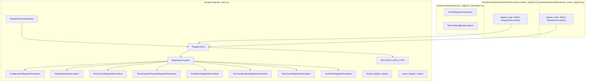
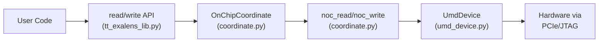
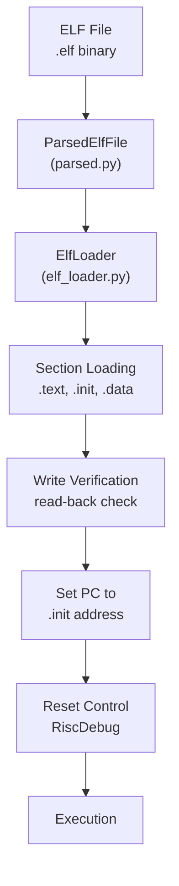
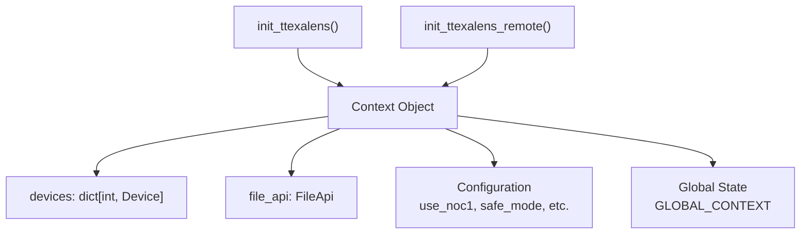
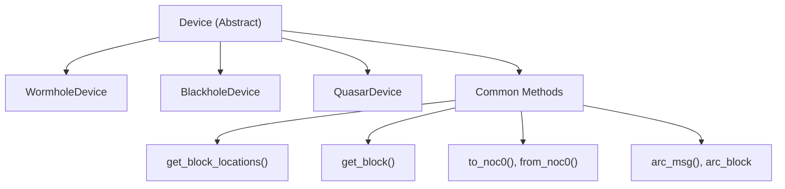
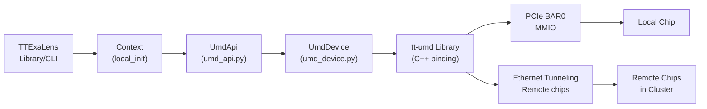
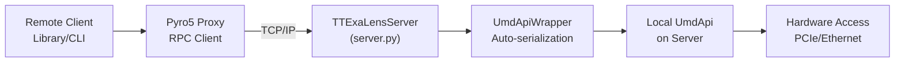
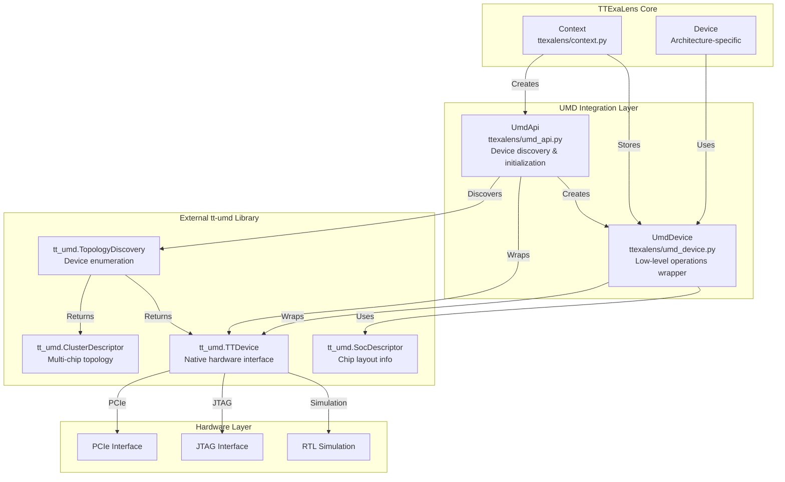
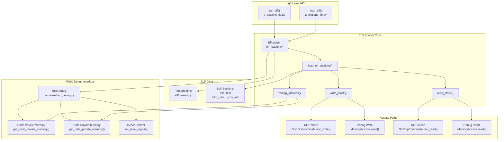
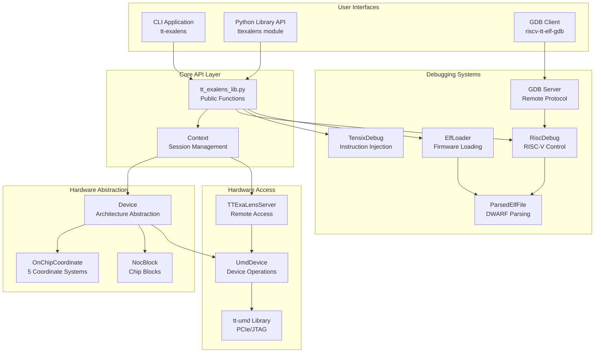

# TTExaLens Overview

Relevant source files
*   [.github/Dockerfile.ci](https://github.com/tenstorrent/tt-exalens/blob/046c35eb/.github/Dockerfile.ci)
*   [Makefile](https://github.com/tenstorrent/tt-exalens/blob/046c35eb/Makefile)
*   [README.md](https://github.com/tenstorrent/tt-exalens/blob/046c35eb/README.md?plain=1)
*   [docs/ttexalens-app-docs.md](https://github.com/tenstorrent/tt-exalens/blob/046c35eb/docs/ttexalens-app-docs.md?plain=1)
*   [docs/ttexalens-lib-docs.md](https://github.com/tenstorrent/tt-exalens/blob/046c35eb/docs/ttexalens-lib-docs.md?plain=1)
*   [scripts/create-venv.sh](https://github.com/tenstorrent/tt-exalens/blob/046c35eb/scripts/create-venv.sh)
*   [scripts/install-deps.sh](https://github.com/tenstorrent/tt-exalens/blob/046c35eb/scripts/install-deps.sh)
*   [scripts/setup-dev-env.sh](https://github.com/tenstorrent/tt-exalens/blob/046c35eb/scripts/setup-dev-env.sh)
*   [test/ttexalens/unit_tests/test_device.py](https://github.com/tenstorrent/tt-exalens/blob/046c35eb/test/ttexalens/unit_tests/test_device.py)
*   [test/ttexalens/unit_tests/test_lib.py](https://github.com/tenstorrent/tt-exalens/blob/046c35eb/test/ttexalens/unit_tests/test_lib.py)
*   [test/ttexalens/unit_tests/test_tensix_debug.py](https://github.com/tenstorrent/tt-exalens/blob/046c35eb/test/ttexalens/unit_tests/test_tensix_debug.py)
*   [ttexalens/__init__.py](https://github.com/tenstorrent/tt-exalens/blob/046c35eb/ttexalens/__init__.py)
*   [ttexalens/coordinate.py](https://github.com/tenstorrent/tt-exalens/blob/046c35eb/ttexalens/coordinate.py)
*   [ttexalens/debug_tensix.py](https://github.com/tenstorrent/tt-exalens/blob/046c35eb/ttexalens/debug_tensix.py)
*   [ttexalens/elf_loader.py](https://github.com/tenstorrent/tt-exalens/blob/046c35eb/ttexalens/elf_loader.py)
*   [ttexalens/tt_exalens_lib.py](https://github.com/tenstorrent/tt-exalens/blob/046c35eb/ttexalens/tt_exalens_lib.py)

## Purpose and Scope

This document provides a high-level introduction to TTExaLens, its purpose, capabilities, and architectural components. It serves as the entry point for understanding the system before diving into specific subsystems.

For detailed information about:

*   The layered architecture and component interactions, see [System Architecture and Layers](https://deepwiki.com/tenstorrent/tt-exalens/1.1-system-architecture-and-layers)
*   Coordinate systems and memory addressing, see [Coordinate Systems and Memory Addressing](https://deepwiki.com/tenstorrent/tt-exalens/1.2-coordinate-systems-and-memory-addressing)
*   Installation and first steps, see [Getting Started](https://deepwiki.com/tenstorrent/tt-exalens/2-getting-started)
*   The Python library API reference, see [Python Library API](https://deepwiki.com/tenstorrent/tt-exalens/3-python-library-api)
*   The CLI application, see [Command Line Interface](https://deepwiki.com/tenstorrent/tt-exalens/4-command-line-interface)




Sources: [ttexalens/register_store.py:1-20](), [ttexalens/hardware/tensix_registers_description.py](), [ttexalens/hardware/wormhole/functional_worker_registers.py:1-15](), [ttexalens/hardware/blackhole/functional_worker_registers.py:1-15]()

---
```
## What is TTExaLens?

TTExaLens is a low-level hardware debugger for Tenstorrent AI accelerator chips. It provides direct access to chip resources through multiple interfaces, enabling firmware development, system debugging, and hardware validation. The system bridges high-level debugging workflows with low-level hardware access through a layered architecture.

The name derives from "Exascale Lens" - a tool for examining systems at the exascale level, though it is used for debugging individual chips and small clusters.

**Sources:**[README.md 1-14](https://github.com/tenstorrent/tt-exalens/blob/046c35eb/README.md?plain=1#L1-L14)

## Target Hardware

TTExaLens supports the following Tenstorrent architectures:

| Architecture | Support Status | Device Class |
| --- | --- | --- |
| Wormhole | Fully Supported | `WormholeDevice` |
| Blackhole | Fully Supported | `BlackholeDevice` |
| Quasar | Fully Supported | `QuasarDevice` |

Each architecture has platform-specific implementations that handle architectural differences while presenting a unified interface through the abstract `Device` class.

**Sources:**[ttexalens/device.py](https://github.com/tenstorrent/tt-exalens/blob/046c35eb/ttexalens/device.py)[ttexalens/hardware/](https://github.com/tenstorrent/tt-exalens/blob/046c35eb/ttexalens/hardware/)

## Main Capabilities

### Memory Operations



**Core Functions:**
- `read_word_from_device()` / `read_words_from_device()` / `read_from_device()` - memory reads
- `write_words_to_device()` / `write_to_device()` - memory writes
- `read_register()` / `write_register()` - configuration and debug register access
```


TTExaLens provides byte-level access to on-chip memory through the Network-on-Chip (NOC):

**Core Functions:**

*   `read_word_from_device()` / `read_words_from_device()` / `read_from_device()` - memory reads
*   `write_words_to_device()` / `write_to_device()` - memory writes
*   `read_register()` / `write_register()` - configuration and debug register access

**Sources:**[ttexalens/tt_exalens_lib.py 110-292](https://github.com/tenstorrent/tt-exalens/blob/046c35eb/ttexalens/tt_exalens_lib.py#L110-L292)[ttexalens/coordinate.py](https://github.com/tenstorrent/tt-exalens/blob/046c35eb/ttexalens/coordinate.py)

### RISC-V Core Control

Direct control and debugging of Baby RISC cores (BRISC, TRISC0-2, NCRISC, ERISC):

| Capability | Implementation |
| --- | --- |
| Execution Control | `RiscDebug.halt()`, `cont()`, `step()` |
| Memory Access | `read_memory()`, `write_memory()` via debug interface |
| Register Access | `read_gpr()`, `write_gpr()`, `read_pc()` |
| Breakpoints | Hardware watchpoints for PC and memory access |
| Call Stack Analysis | DWARF-based stack unwinding via `callstack()` |

**Sources:**[ttexalens/hardware/risc_debug.py](https://github.com/tenstorrent/tt-exalens/blob/046c35eb/ttexalens/hardware/risc_debug.py)[ttexalens/hardware/baby_risc_debug.py](https://github.com/tenstorrent/tt-exalens/blob/046c35eb/ttexalens/hardware/baby_risc_debug.py)

### ELF Firmware Management



**Core Functions:**
- `load_elf()` - load firmware with core in reset
- `run_elf()` - load and execute firmware
- `parse_elf()` - parse ELF with DWARF symbols
```


Complete pipeline for loading and executing firmware on RISC-V cores:

**Core Functions:**

*   `load_elf()` - load firmware with core in reset
*   `run_elf()` - load and execute firmware
*   `parse_elf()` - parse ELF with DWARF symbols

**Sources:**[ttexalens/elf_loader.py](https://github.com/tenstorrent/tt-exalens/blob/046c35eb/ttexalens/elf_loader.py)[ttexalens/tt_exalens_lib.py 295-421](https://github.com/tenstorrent/tt-exalens/blob/046c35eb/ttexalens/tt_exalens_lib.py#L295-L421)

### Symbolic Debugging

DWARF-based symbolic access to variables and type information:

*   **Variable Access:**`ElfVariable` class provides symbolic memory access by name
*   **Type System:** Full DWARF type parsing including structs, arrays, pointers
*   **Call Stack:** Frame unwinding with source location information
*   **Coverage:** GCOV data extraction from running firmware

**Sources:**[ttexalens/elf/](https://github.com/tenstorrent/tt-exalens/blob/046c35eb/ttexalens/elf/)[ttexalens/tt_exalens_lib.py 588-690](https://github.com/tenstorrent/tt-exalens/blob/046c35eb/ttexalens/tt_exalens_lib.py#L588-L690)

### Tensix Core Debugging

Advanced debugging of Tensix computation cores:

*   **Instruction Injection:** Direct Tensix instruction execution via debug bus
*   **Register File Access:** Read/write SRCA, SRCB, DSTACC register files
*   **Direct Dest Access:** High-performance register file access on Blackhole
*   **Thread Control:** Per-thread FIFO control (threads 0-2)

**Sources:**[ttexalens/debug_tensix.py](https://github.com/tenstorrent/tt-exalens/blob/046c35eb/ttexalens/debug_tensix.py)

### Debug Bus Signal Monitoring

Real-time signal sampling from internal chip signals:

*   **Signal Database:** Predefined signals for ALU, pack, unpack, RISC cores
*   **L1 Sampling Mode:** Capture 128-bit signal snapshots to L1 memory
*   **Group Access:** Read entire signal groups efficiently
*   **Custom Signals:** Define custom signal descriptions

**Sources:**[ttexalens/debug_bus_signal_store.py](https://github.com/tenstorrent/tt-exalens/blob/046c35eb/ttexalens/debug_bus_signal_store.py)

## System Interfaces

TTExaLens provides three primary interfaces for user interaction:

### Python Library API

The programmatic interface for custom scripts and automation:

`import ttexalens as lib # Initialize contextctx = lib.init_ttexalens() # Memory operationsdata = lib.read_words_from_device("1,0", 0x1000, word_count=16)lib.write_words_to_device("1,0", 0x1000, [0xDEADBEEF] * 4) # Load and run firmwarelib.run_elf("firmware.elf", "all", "brisc") # Debug operationsstack = lib.callstack("1,0", "firmware.elf", risc_name="brisc")`
**Entry Point:**`ttexalens` module **Core Module:**[ttexalens/tt_exalens_lib.py](https://github.com/tenstorrent/tt-exalens/blob/046c35eb/ttexalens/tt_exalens_lib.py)**Initialization:**[ttexalens/tt_exalens_init.py](https://github.com/tenstorrent/tt-exalens/blob/046c35eb/ttexalens/tt_exalens_init.py)

**Sources:**[ttexalens/__init__.py](https://github.com/tenstorrent/tt-exalens/blob/046c35eb/ttexalens/__init__.py)[ttexalens/tt_exalens_lib.py 1-50](https://github.com/tenstorrent/tt-exalens/blob/046c35eb/ttexalens/tt_exalens_lib.py#L1-L50)

### Command Line Interface

Interactive REPL-based application for exploration and debugging:

`# Local mode - direct hardware accesstt-exalens # Remote mode - connect to servertt-exalens --remote <ip>:<port> # Server mode - host access for remote clientstt-exalens --server`
**Key Commands:**

*   `device` - display chip topology and RISC status
*   `brxy` - burst read memory
*   `bt` - call stack backtrace
*   `tensix` - dump Tensix core state
*   `debug-bus` - signal monitoring

**Entry Point:**`tt-exalens` command **Implementation:**[app/](https://github.com/tenstorrent/tt-exalens/blob/046c35eb/app/)

**Sources:**[README.md 35-44](https://github.com/tenstorrent/tt-exalens/blob/046c35eb/README.md?plain=1#L35-L44)[docs/ttexalens-app-docs.md 1-50](https://github.com/tenstorrent/tt-exalens/blob/046c35eb/docs/ttexalens-app-docs.md?plain=1#L1-L50)

### GDB Server

Standard GDB remote protocol server for RISC-V debugging:

`# Start GDB servertt-exalens --gdb-server <port> # Connect with GDB clientriscv-tt-elf-gdb firmware.elf(gdb) target remote localhost:<port>(gdb) break main(gdb) continue`
**Features:**

*   Standard GDB commands (break, step, continue, backtrace)
*   Multi-process support (one process per RISC core)
*   Memory and register access
*   vCont operations

**Implementation:**[ttexalens/gdb/](https://github.com/tenstorrent/tt-exalens/blob/046c35eb/ttexalens/gdb/)

**Sources:**[ttexalens/gdb/gdb_server.py](https://github.com/tenstorrent/tt-exalens/blob/046c35eb/ttexalens/gdb/gdb_server.py)

## Core Abstractions

### Context - Session Management



**Responsibilities:**
- Device discovery and initialization
- Session configuration (NOC selection, safe mode, etc.)
- File API for ELF and symbol management
- Global context management for library functions
```


The `Context` object manages the TTExaLens session lifecycle:

**Responsibilities:**

*   Device discovery and initialization
*   Session configuration (NOC selection, safe mode, etc.)
*   File API for ELF and symbol management
*   Global context management for library functions

**Sources:**[ttexalens/context.py](https://github.com/tenstorrent/tt-exalens/blob/046c35eb/ttexalens/context.py)[ttexalens/tt_exalens_init.py 50-63](https://github.com/tenstorrent/tt-exalens/blob/046c35eb/ttexalens/tt_exalens_init.py#L50-L63)

### Device - Hardware Abstraction



**Key Responsibilities:**
- Coordinate system conversions
- Block location queries
- Platform-specific behavior
- Memory map management
- ARC communication
```


The `Device` class abstracts architecture-specific details:

**Key Responsibilities:**

*   Coordinate system conversions
*   Block location queries
*   Platform-specific behavior
*   Memory map management
*   ARC communication

**Sources:**[ttexalens/device.py](https://github.com/tenstorrent/tt-exalens/blob/046c35eb/ttexalens/device.py)[ttexalens/hardware/wormhole/](https://github.com/tenstorrent/tt-exalens/blob/046c35eb/ttexalens/hardware/wormhole/)[ttexalens/hardware/blackhole/](https://github.com/tenstorrent/tt-exalens/blob/046c35eb/ttexalens/hardware/blackhole/)

### OnChipCoordinate - Location Abstraction

Unified representation of locations across five coordinate systems:

| System | Notation | Description | Harvesting Aware |
| --- | --- | --- | --- |
| `noc0` | X-Y | NOC 0 routing coordinates | No |
| `noc1` | X-Y | NOC 1 routing coordinates | No |
| `die` | X,Y | Geographic die layout | No |
| `logical` | X,Y or qX,Y | User-facing coordinates | Yes |
| `translated` | X-Y | Hardware routing with harvesting | Yes |

**Core Methods:**

*   `OnChipCoordinate.create()` - factory from string
*   `to(coord_type)` - convert to target system
*   `noc_read()` / `noc_write()` - memory operations

**Sources:**[ttexalens/coordinate.py 1-77](https://github.com/tenstorrent/tt-exalens/blob/046c35eb/ttexalens/coordinate.py#L1-L77)

### NocBlock - Chip Block Abstraction

Represents functional units on the chip:

**Block Types:**

*   `functional_workers` - Tensix compute cores
*   `eth` - Ethernet cores
*   `dram` - DRAM controllers
*   `arc` - ARC processor
*   `pcie` - PCIe interface
*   `router_only` - NOC routers without compute

Each block provides:

*   `get_risc_debug(risc_name)` - RISC-V debugging interface
*   `get_register_store()` - configuration/debug registers
*   Memory regions (L1, private memory, etc.)

**Sources:**[ttexalens/hardware/noc_block.py](https://github.com/tenstorrent/tt-exalens/blob/046c35eb/ttexalens/hardware/noc_block.py)

## Access Modes

### Local Mode



**Capabilities:**
- Direct MMIO access for local chips via PCIe
- Ethernet NOC tunneling for remote chips in cluster
- Full speed, no network overhead

**Initialization:** `init_ttexalens()`
```


Direct hardware access via PCIe and the `tt-umd` library:

**Capabilities:**

*   Direct MMIO access for local chips via PCIe
*   Ethernet NOC tunneling for remote chips in cluster
*   Full speed, no network overhead

**Initialization:**`init_ttexalens()`

**Sources:**[ttexalens/tt_exalens_init.py 1-118](https://github.com/tenstorrent/tt-exalens/blob/046c35eb/ttexalens/tt_exalens_init.py#L1-L118)[ttexalens/umd_api.py](https://github.com/tenstorrent/tt-exalens/blob/046c35eb/ttexalens/umd_api.py)[ttexalens/umd_device.py](https://github.com/tenstorrent/tt-exalens/blob/046c35eb/ttexalens/umd_device.py)

### Remote Mode



**Capabilities:**
- Access hardware from any network location
- Multiple concurrent clients
- Automatic object serialization via Pyro5
- Same API as local mode

**Initialization:** 
- Server: `tt-exalens --server` or programmatic via `TTExaLensServer`
- Client: `init_ttexalens_remote(ip_address, port)`
```


Network-based access to hardware via TTExaLens server:

**Capabilities:**

*   Access hardware from any network location
*   Multiple concurrent clients
*   Automatic object serialization via Pyro5
*   Same API as local mode

**Initialization:**

*   Server: `tt-exalens --server` or programmatic via `TTExaLensServer`
*   Client: `init_ttexalens_remote(ip_address, port)`

**Sources:**[ttexalens/tt_exalens_init.py 120-177](https://github.com/tenstorrent/tt-exalens/blob/046c35eb/ttexalens/tt_exalens_init.py#L120-L177)[ttexalens/server.py](https://github.com/tenstorrent/tt-exalens/blob/046c35eb/ttexalens/server.py)

## Operational Safety

### Safe Mode

Memory access validation to prevent unsafe operations:

*   **Enabled by default** via `safe_mode=True` in context initialization
*   **Validates** all memory accesses against known safe regions (L1, DRAM, etc.)
*   **Raises**`UnsafeAccessException` for unmapped or restricted regions
*   **Can be disabled** for expert usage: `safe_mode=False`

**Sources:**[ttexalens/memory_map.py](https://github.com/tenstorrent/tt-exalens/blob/046c35eb/ttexalens/memory_map.py)[ttexalens/device.py](https://github.com/tenstorrent/tt-exalens/blob/046c35eb/ttexalens/device.py)

### NOC Failover

Automatic retry on alternate NOC for timeout resilience:

*   **Enabled by default** via `noc_failover=True`
*   **Behavior:** On NOC 0 timeout, automatically retry on NOC 1
*   **Use case:** Work around transient NOC congestion or issues
*   **Can be disabled** for debugging NOC-specific issues

**Sources:**[ttexalens/umd_device.py](https://github.com/tenstorrent/tt-exalens/blob/046c35eb/ttexalens/umd_device.py)

## Architecture Overview








This architecture enables:
- **Multiple interfaces** (CLI, API, GDB) sharing common implementation
- **Clean abstraction layers** from user interface down to hardware
- **Flexible deployment** (local or remote access)
- **Platform independence** through Device abstraction
- **Comprehensive debugging** via multiple subsystems
```


The following diagram shows how the major system components relate:

This architecture enables:

*   **Multiple interfaces** (CLI, API, GDB) sharing common implementation
*   **Clean abstraction layers** from user interface down to hardware
*   **Flexible deployment** (local or remote access)
*   **Platform independence** through Device abstraction
*   **Comprehensive debugging** via multiple subsystems

**Sources:** All files, system-level diagram synthesis

* * *

For detailed information about specific subsystems, continue to:

 - Detailed component interactions
 - Memory model and addressing
 - Installation and first steps
 - Complete API reference
 - CLI commands and usage

This wiki is featured in the [repository](https://github.com/tenstorrent/tt-exalens/blob/main/README.md)

Dismiss
Refresh this wiki

Enter email to refresh
