# System Architecture and Layers

Relevant source files
*   [VERSION](https://github.com/tenstorrent/tt-exalens/blob/046c35eb/VERSION)
*   [test/ttexalens/unit_tests/test_device.py](https://github.com/tenstorrent/tt-exalens/blob/046c35eb/test/ttexalens/unit_tests/test_device.py)
*   [test/ttexalens/unit_tests/test_lib.py](https://github.com/tenstorrent/tt-exalens/blob/046c35eb/test/ttexalens/unit_tests/test_lib.py)
*   [test/ttexalens/unit_tests/test_remote_communication.py](https://github.com/tenstorrent/tt-exalens/blob/046c35eb/test/ttexalens/unit_tests/test_remote_communication.py)
*   [test/ttexalens/unit_tests/test_tensix_debug.py](https://github.com/tenstorrent/tt-exalens/blob/046c35eb/test/ttexalens/unit_tests/test_tensix_debug.py)
*   [test/wheel/run-wheel.sh](https://github.com/tenstorrent/tt-exalens/blob/046c35eb/test/wheel/run-wheel.sh)
*   [ttexalens/cli_commands/interfaces.py](https://github.com/tenstorrent/tt-exalens/blob/046c35eb/ttexalens/cli_commands/interfaces.py)
*   [ttexalens/debug_tensix.py](https://github.com/tenstorrent/tt-exalens/blob/046c35eb/ttexalens/debug_tensix.py)
*   [ttexalens/device.py](https://github.com/tenstorrent/tt-exalens/blob/046c35eb/ttexalens/device.py)
*   [ttexalens/elf_loader.py](https://github.com/tenstorrent/tt-exalens/blob/046c35eb/ttexalens/elf_loader.py)
*   [ttexalens/requirements.txt](https://github.com/tenstorrent/tt-exalens/blob/046c35eb/ttexalens/requirements.txt)
*   [ttexalens/server.py](https://github.com/tenstorrent/tt-exalens/blob/046c35eb/ttexalens/server.py)
*   [ttexalens/tt_exalens_lib.py](https://github.com/tenstorrent/tt-exalens/blob/046c35eb/ttexalens/tt_exalens_lib.py)
*   [ttexalens/umd_api.py](https://github.com/tenstorrent/tt-exalens/blob/046c35eb/ttexalens/umd_api.py)
*   [ttexalens/umd_device.py](https://github.com/tenstorrent/tt-exalens/blob/046c35eb/ttexalens/umd_device.py)
*   [ttexalens/util.py](https://github.com/tenstorrent/tt-exalens/blob/046c35eb/ttexalens/util.py)

## Purpose and Scope

This document describes the layered architecture of TTExaLens, explaining how the system is organized from user-facing interfaces down to hardware communication. The architecture consists of five distinct layers that provide progressively lower-level access to Tenstorrent devices. This document focuses on the static structure and relationships between layers.

For runtime behavior and debugging workflows, see [Advanced Features](https://deepwiki.com/tenstorrent/tt-exalens/7-advanced-features). For device-specific implementations and hardware quirks, see [Device Architecture](https://deepwiki.com/tenstorrent/tt-exalens/5-device-architecture). For coordinate systems and memory addressing details, see [Coordinate Systems and Memory Addressing](https://deepwiki.com/tenstorrent/tt-exalens/1.2-coordinate-systems-and-memory-addressing).

* * *

## Architectural Overview

TTExaLens employs a strict layered architecture where each layer depends only on layers below it. The architecture enables multiple access patterns: direct library usage, command-line interaction, and remote debugging via GDB protocol.

### Five-Layer Architecture

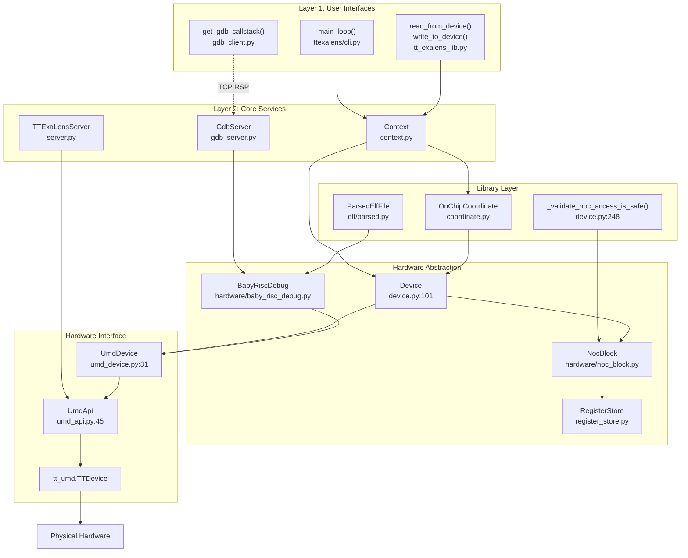


**Sources:**[ttexalens/device.py 101-155](https://github.com/tenstorrent/tt-exalens/blob/046c35eb/ttexalens/device.py#L101-L155)[ttexalens/tt_exalens_lib.py 109-292](https://github.com/tenstorrent/tt-exalens/blob/046c35eb/ttexalens/tt_exalens_lib.py#L109-L292)[ttexalens/cli.py 188-347](https://github.com/tenstorrent/tt-exalens/blob/046c35eb/ttexalens/cli.py#L188-L347)[ttexalens/gdb/gdb_server.py 55-708](https://github.com/tenstorrent/tt-exalens/blob/046c35eb/ttexalens/gdb/gdb_server.py#L55-L708)[ttexalens/server.py 41-145](https://github.com/tenstorrent/tt-exalens/blob/046c35eb/ttexalens/server.py#L41-L145)[ttexalens/umd_device.py 31-89](https://github.com/tenstorrent/tt-exalens/blob/046c35eb/ttexalens/umd_device.py#L31-L89)[ttexalens/umd_api.py 45-149](https://github.com/tenstorrent/tt-exalens/blob/046c35eb/ttexalens/umd_api.py#L45-L149)

* * *

## Layer 1: User Interfaces

The topmost layer provides three distinct entry points for interacting with Tenstorrent devices. Each interface targets different use cases but converges on the same underlying functionality.

### CLI Application

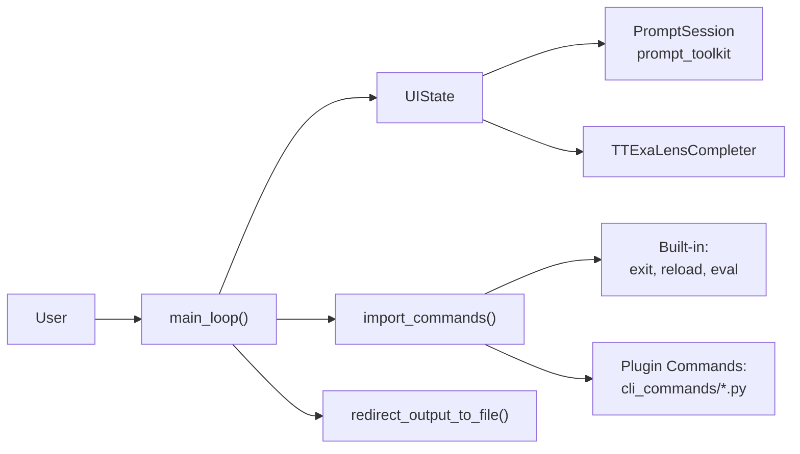

**Key Components:**
- **`main_loop()`** [ttexalens/cli.py:188-347]() - Main command processing loop
- **`import_commands()`** [ttexalens/cli.py:85-152]() - Dynamically loads commands from `cli_commands/` directory
- **`UIState`** [ttexalens/uistate.py:63-122]() - Manages prompt state, current location, and server instances
- **`TTExaLensCompleter`** [ttexalens/uistate.py:19-50]() - Provides command and symbol auto-completion

The CLI supports:
- Output redirection to files (`>`, `>>`, `|>`, `|>>`)
- Command history and auto-completion
- Navigation suggestions ("speed dial" numbered shortcuts)
- Multiple server modes (GDB server, TTExaLens server)
```


The command-line interface provides an interactive REPL environment for device inspection and debugging.

**Key Components:**

*   **`main_loop()`**[ttexalens/cli.py 188-347](https://github.com/tenstorrent/tt-exalens/blob/046c35eb/ttexalens/cli.py#L188-L347) - Main command processing loop
*   **`import_commands()`**[ttexalens/cli.py 85-152](https://github.com/tenstorrent/tt-exalens/blob/046c35eb/ttexalens/cli.py#L85-L152) - Dynamically loads commands from `cli_commands/` directory
*   **`UIState`**[ttexalens/uistate.py 63-122](https://github.com/tenstorrent/tt-exalens/blob/046c35eb/ttexalens/uistate.py#L63-L122) - Manages prompt state, current location, and server instances
*   **`TTExaLensCompleter`**[ttexalens/uistate.py 19-50](https://github.com/tenstorrent/tt-exalens/blob/046c35eb/ttexalens/uistate.py#L19-L50) - Provides command and symbol auto-completion

The CLI supports:

*   Output redirection to files (`>`, `>>`, `|>`, `|>>`)
*   Command history and auto-completion
*   Navigation suggestions ("speed dial" numbered shortcuts)
*   Multiple server modes (GDB server, TTExaLens server)

**Sources:**[ttexalens/cli.py 188-347](https://github.com/tenstorrent/tt-exalens/blob/046c35eb/ttexalens/cli.py#L188-L347)[ttexalens/uistate.py 63-122](https://github.com/tenstorrent/tt-exalens/blob/046c35eb/ttexalens/uistate.py#L63-L122)

### Python Library API

The programmatic interface exposes core functionality through Python functions in `tt_exalens_lib.py`.

| Function Category | Key Functions | Purpose |
| --- | --- | --- |
| Memory Operations | `read_from_device`, `write_to_device`, `read_words_from_device`, `write_words_to_device` | Raw memory access with safety validation |
| Register Access | `read_register`, `write_register` | Configuration and debug register manipulation |
| ELF Management | `load_elf`, `run_elf` | Load and execute programs on RISC-V cores |
| Debugging | `callstack`, `get_global`, `coverage` | Symbolic debugging with DWARF information |
| ARC Communication | `arc_msg`, `read_arc_telemetry_entry` | ARC processor interaction |
| Coordinate Conversion | `convert_coordinate` | Translate between coordinate systems |

**Entry Point Pattern:** All public API functions follow this pattern:

1.   Accept optional `context` parameter
2.   Call `check_context()`[ttexalens/tt_exalens_lib.py 48-60](https://github.com/tenstorrent/tt-exalens/blob/046c35eb/ttexalens/tt_exalens_lib.py#L48-L60) to get or create context
3.   Convert string coordinates to `OnChipCoordinate` objects
4.   Validate inputs and addresses
5.   Delegate to appropriate hardware abstraction layer

**Sources:**[ttexalens/tt_exalens_lib.py 48-900](https://github.com/tenstorrent/tt-exalens/blob/046c35eb/ttexalens/tt_exalens_lib.py#L48-L900)

### GDB Client Interface

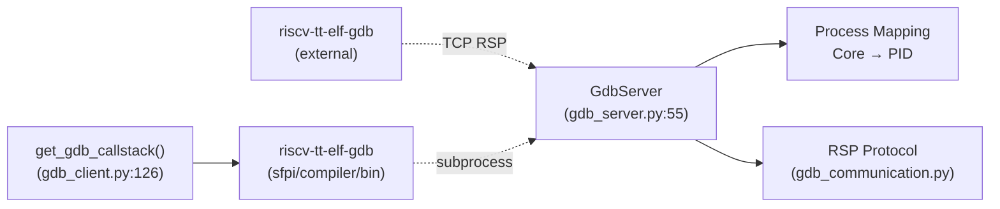


External GDB clients connect via TCP to the embedded GDB server, enabling standard GDB debugging workflows.

**Sources:**[ttexalens/gdb/gdb_server.py 55-708](https://github.com/tenstorrent/tt-exalens/blob/046c35eb/ttexalens/gdb/gdb_server.py#L55-L708)[ttexalens/gdb/gdb_client.py 16-180](https://github.com/tenstorrent/tt-exalens/blob/046c35eb/ttexalens/gdb/gdb_client.py#L16-L180)

* * *

## Layer 2: Core Services

The Core Services layer manages state, provides RPC capabilities, and implements protocol servers.

### Context Manager

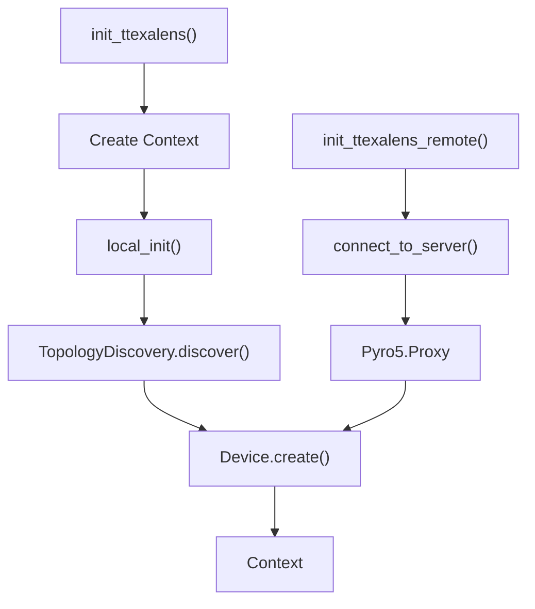


**`Context`** is the central coordination point for all TTExaLens operations.

| Responsibility | Implementation |
| --- | --- |
| Device Registry | Maintains `devices: dict[int, Device]` mapping device IDs to device objects |
| Configuration | Stores global settings (`use_noc1`, `use_4B_mode`, `safe_mode`, thresholds) |
| Session State | Tracks loaded ELFs, cluster descriptor, file API |
| Command Registry | Holds available CLI commands for dynamic dispatch |

**Initialization Paths:**

**Sources:**[test/ttexalens/unit_tests/test_lib.py 46-79](https://github.com/tenstorrent/tt-exalens/blob/046c35eb/test/ttexalens/unit_tests/test_lib.py#L46-L79)[test/ttexalens/unit_tests/test_ttexalens_init.py 21-87](https://github.com/tenstorrent/tt-exalens/blob/046c35eb/test/ttexalens/unit_tests/test_ttexalens_init.py#L21-L87)

### GDB Server

**`GdbServer`**[ttexalens/gdb/gdb_server.py 55-708](https://github.com/tenstorrent/tt-exalens/blob/046c35eb/ttexalens/gdb/gdb_server.py#L55-L708) implements the GDB Remote Serial Protocol (RSP) to expose RISC-V cores as debuggable processes.

**Process Mapping:**

*   Each RISC-V core becomes a separate process with unique PID
*   Process ID assigned on first run of core (when taken out of reset)
*   Multi-process debugging supported via `vAttach` and `vCont` packets

**Supported Operations:**

*   Memory read/write (`m`, `M` packets)
*   Register access (`g`, `G` packets)
*   Breakpoint/watchpoint management (`Z`, `z` packets)
*   Execution control (`c`, `s`, `vCont` packets)
*   Thread enumeration (`qfThreadInfo`, `qsThreadInfo`)
*   ELF symbol information via `qXfer`

**Protocol Handling:**[ttexalens/gdb/gdb_communication.py 120-338](https://github.com/tenstorrent/tt-exalens/blob/046c35eb/ttexalens/gdb/gdb_communication.py#L120-L338) implements low-level packet parsing and serialization, including:

*   Checksum validation
*   Escape sequence handling
*   ACK/NACK protocol
*   Run-length encoding (not used)

**Sources:**[ttexalens/gdb/gdb_server.py 55-708](https://github.com/tenstorrent/tt-exalens/blob/046c35eb/ttexalens/gdb/gdb_server.py#L55-L708)[ttexalens/gdb/gdb_communication.py 1-338](https://github.com/tenstorrent/tt-exalens/blob/046c35eb/ttexalens/gdb/gdb_communication.py#L1-L338)

### TTExaLens Server

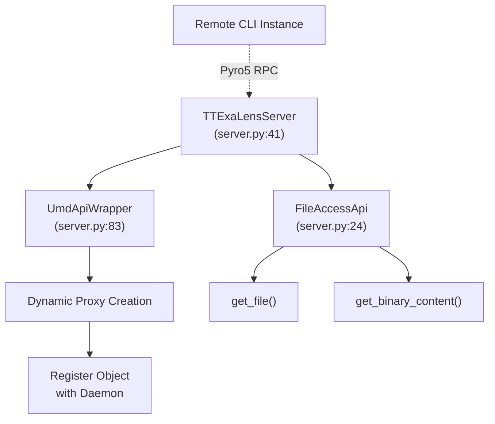

**Object Wrapping:** The server dynamically wraps UMD API objects, exposing all methods and properties over RPC. Complex return types are automatically registered as new Pyro5 objects and returned as proxies [ttexalens/server.py:88-144]().
```


**`TTExaLensServer`**[ttexalens/server.py 41-145](https://github.com/tenstorrent/tt-exalens/blob/046c35eb/ttexalens/server.py#L41-L145) enables remote access to TTExaLens functionality via Pyro5 RPC.

**Architecture:**

**Object Wrapping:** The server dynamically wraps UMD API objects, exposing all methods and properties over RPC. Complex return types are automatically registered as new Pyro5 objects and returned as proxies [ttexalens/server.py 88-144](https://github.com/tenstorrent/tt-exalens/blob/046c35eb/ttexalens/server.py#L88-L144)

**Sources:**[ttexalens/server.py 41-145](https://github.com/tenstorrent/tt-exalens/blob/046c35eb/ttexalens/server.py#L41-L145)[test/ttexalens/unit_tests/test_ttexalens_init.py 29-87](https://github.com/tenstorrent/tt-exalens/blob/046c35eb/test/ttexalens/unit_tests/test_ttexalens_init.py#L29-L87)

* * *

## Layer 3: Library Layer

The Library Layer provides high-level abstractions that hide hardware complexity and ensure safe operation.

### Coordinate System

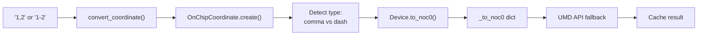

**Cache Structure:** [ttexalens/device.py:279-333]()
- `Device._to_noc0: dict[(coord_tuple, coord_system, core_type), noc0_tuple]`
- `Device._from_noc0: dict[(noc0_tuple, coord_system), (converted_tuple, core_type)]`
```


**`OnChipCoordinate`** is the universal addressing mechanism for on-chip resources.

**Supported Coordinate Systems:**

| System | Example | Description | Canonical |
| --- | --- | --- | --- |
| `noc0` | `"1-2"` | Physical NOC0 coordinates (x-y format) | Yes (internal) |
| `noc1` | `"1-2"` | Physical NOC1 coordinates | No |
| `logical` | `"1,2"` | Software logical coordinates (x,y format) | No |
| `translated` | `"1-2"` | Routing coordinates for cluster | No |
| `die` | `"1-2"` | Silicon die coordinates | No |

**Conversion Mechanism:**

**Cache Structure:**[ttexalens/device.py 279-333](https://github.com/tenstorrent/tt-exalens/blob/046c35eb/ttexalens/device.py#L279-L333)

*   `Device._to_noc0: dict[(coord_tuple, coord_system, core_type), noc0_tuple]`
*   `Device._from_noc0: dict[(noc0_tuple, coord_system), (converted_tuple, core_type)]`

**Sources:**[ttexalens/device.py 273-333](https://github.com/tenstorrent/tt-exalens/blob/046c35eb/ttexalens/device.py#L273-L333)[ttexalens/tt_exalens_lib.py 85-104](https://github.com/tenstorrent/tt-exalens/blob/046c35eb/ttexalens/tt_exalens_lib.py#L85-L104)

### Safety Validation

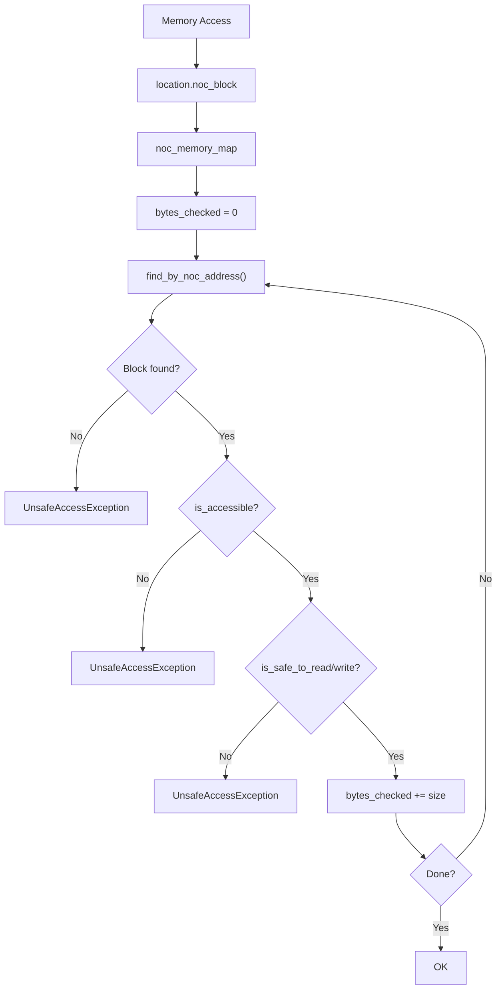

**Memory Block Safety Rules:**
- Must be in known memory block (found in `MemoryMap`)
- Block must have `is_accessible = True`
- Address range must pass block-specific safety checks
- Handles cross-block accesses by validating each chunk
```


**`_validate_noc_access_is_safe()`**[ttexalens/device.py 248-300](https://github.com/tenstorrent/tt-exalens/blob/046c35eb/ttexalens/device.py#L248-L300) prevents accidental hardware corruption by validating all memory accesses.

**Validation Process:**

**Memory Block Safety Rules:**

*   Must be in known memory block (found in `MemoryMap`)
*   Block must have `is_accessible = True`
*   Address range must pass block-specific safety checks
*   Handles cross-block accesses by validating each chunk

**Sources:**[ttexalens/device.py 248-300](https://github.com/tenstorrent/tt-exalens/blob/046c35eb/ttexalens/device.py#L248-L300)

### ELF/DWARF System

The ELF system provides symbolic debugging capabilities by parsing DWARF debug information.

| Component | Purpose | Location |
| --- | --- | --- |
| `ParsedElfFile` | Container for entire ELF file and DWARF tree | [ttexalens/elf/parsed.py](https://github.com/tenstorrent/tt-exalens/blob/046c35eb/ttexalens/elf/parsed.py) |
| `ElfDwarf` | DWARF structure parser | [ttexalens/elf/dwarf.py](https://github.com/tenstorrent/tt-exalens/blob/046c35eb/ttexalens/elf/dwarf.py) |
| `ElfDie` | Debug Information Entry navigation | [ttexalens/elf/die.py](https://github.com/tenstorrent/tt-exalens/blob/046c35eb/ttexalens/elf/die.py) |
| `ElfVariable` | Runtime variable access with operator overloading | [ttexalens/elf/variable.py](https://github.com/tenstorrent/tt-exalens/blob/046c35eb/ttexalens/elf/variable.py) |
| `FrameInfoProvider` | Call Frame Information for stack unwinding | [ttexalens/elf/cfi.py](https://github.com/tenstorrent/tt-exalens/blob/046c35eb/ttexalens/elf/cfi.py) |

**Sources:** See [ELF and DWARF Parsing](https://deepwiki.com/tenstorrent/tt-exalens/7.3-elf-and-dwarf-parsing)

* * *

## Layer 4: Hardware Abstraction

The Hardware Abstraction layer provides platform-independent interfaces to device functionality.

### Device Class Hierarchy

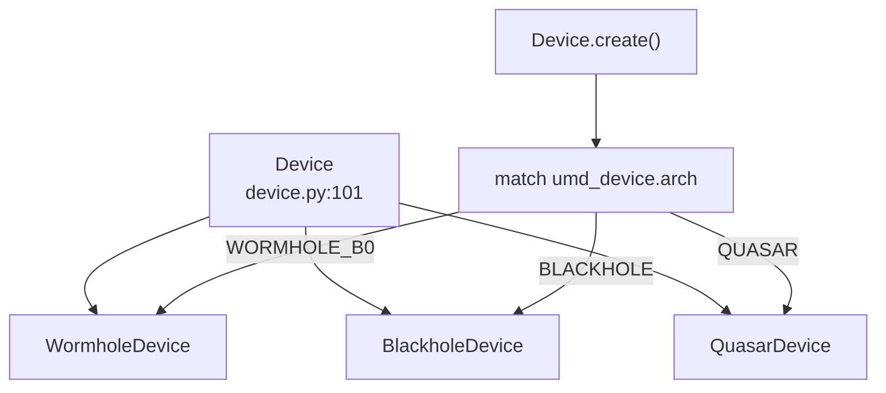

**Device Responsibilities:**

| Capability | Methods/Properties | Implementation |
|------------|-------------------|----------------|
| Memory Operations | `noc_read()`, `noc_write()`, `noc_read32()`, `noc_write32()` | [device.py:199-246]() |
| Block Management | `get_block()`, `get_blocks()`, `get_block_locations()` | [device.py:340-423]() |
| Coordinate Translation | `to_noc0()`, `from_noc0()` | [device.py:313-332]() |
| NOC Failover | `_with_noc_failover()` | [device.py:143-167]() |
| Register Access | `bar0_read32()`, `bar0_write32()` | [device.py:248-252]() |
```


**`Device`**[ttexalens/device.py 72-552](https://github.com/tenstorrent/tt-exalens/blob/046c35eb/ttexalens/device.py#L72-L552) is the abstract base class for all device implementations.

**Device Responsibilities:**

| Capability | Methods/Properties | Implementation |
| --- | --- | --- |
| Memory Operations | `noc_read()`, `noc_write()`, `noc_read32()`, `noc_write32()` | [device.py 199-246](https://github.com/tenstorrent/tt-exalens/blob/046c35eb/device.py#L199-L246) |
| Block Management | `get_block()`, `get_blocks()`, `get_block_locations()` | [device.py 340-423](https://github.com/tenstorrent/tt-exalens/blob/046c35eb/device.py#L340-L423) |
| Coordinate Translation | `to_noc0()`, `from_noc0()` | [device.py 313-332](https://github.com/tenstorrent/tt-exalens/blob/046c35eb/device.py#L313-L332) |
| NOC Failover | `_with_noc_failover()` | [device.py 143-167](https://github.com/tenstorrent/tt-exalens/blob/046c35eb/device.py#L143-L167) |
| Register Access | `bar0_read32()`, `bar0_write32()` | [device.py 248-252](https://github.com/tenstorrent/tt-exalens/blob/046c35eb/device.py#L248-L252) |

**Sources:**[ttexalens/device.py 72-552](https://github.com/tenstorrent/tt-exalens/blob/046c35eb/ttexalens/device.py#L72-L552)

### NocBlock System

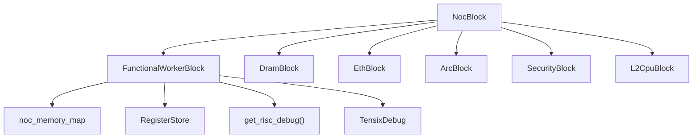

**Block Initialization:** [ttexalens/device.py:407-423]()
```python
```


**`NocBlock`** represents a hardware block on the NOC (Network-on-Chip). Each block type has specific capabilities.

**Block Type Classification:**

**Block Initialization:**[ttexalens/device.py 407-423](https://github.com/tenstorrent/tt-exalens/blob/046c35eb/ttexalens/device.py#L407-L423)

**Sources:**[ttexalens/device.py 407-423](https://github.com/tenstorrent/tt-exalens/blob/046c35eb/ttexalens/device.py#L407-L423)

### RISC-V Debug System

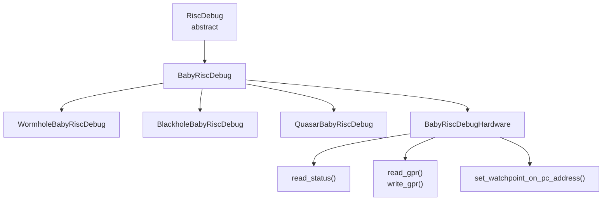

**Core Operations:**

| Operation | Method | Description |
|-----------|--------|-------------|
| Execution Control | `halt()`, `step()`, `cont()` | Start/stop core execution |
| Reset Management | `set_reset_signal()`, `is_in_reset()` | Control reset state |
| Register Access | `read_gpr(n)`, `write_gpr(n, value)` | Access general purpose registers (x0-x31, pc) |
| Memory Access | `read_memory()`, `write_memory()` | Access core private memory via debug interface |
| Breakpoints | `set_watchpoint_on_pc_address()` | Hardware watchpoint/breakpoint support |

**Platform-Specific Workarounds:**
- **Wormhole**: Double-stepping on branches due to branch prediction [hardware/wormhole/baby_risc_debug.py]()
- **Blackhole**: Instruction cache invalidation required after memory writes [hardware/blackhole/baby_risc_debug.py]()
- **Quasar**: Similar to Blackhole but different register offsets
```


The RISC-V debug system provides low-level control over RISC-V cores.

**Class Hierarchy:**

**Core Operations:**

| Operation | Method | Description |
| --- | --- | --- |
| Execution Control | `halt()`, `step()`, `cont()` | Start/stop core execution |
| Reset Management | `set_reset_signal()`, `is_in_reset()` | Control reset state |
| Register Access | `read_gpr(n)`, `write_gpr(n, value)` | Access general purpose registers (x0-x31, pc) |
| Memory Access | `read_memory()`, `write_memory()` | Access core private memory via debug interface |
| Breakpoints | `set_watchpoint_on_pc_address()` | Hardware watchpoint/breakpoint support |

**Platform-Specific Workarounds:**

*   **Wormhole**: Double-stepping on branches due to branch prediction [hardware/wormhole/baby_risc_debug.py](https://github.com/tenstorrent/tt-exalens/blob/046c35eb/hardware/wormhole/baby_risc_debug.py)
*   **Blackhole**: Instruction cache invalidation required after memory writes [hardware/blackhole/baby_risc_debug.py](https://github.com/tenstorrent/tt-exalens/blob/046c35eb/hardware/blackhole/baby_risc_debug.py)
*   **Quasar**: Similar to Blackhole but different register offsets

**Sources:** See [RISC-V Debugging System](https://deepwiki.com/tenstorrent/tt-exalens/6-risc-v-debugging-system)

### Register Store

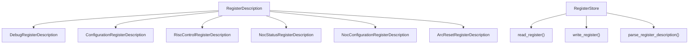

**Register Access Paths:**

| Register Type | Access Method | Address Calculation |
|---------------|---------------|---------------------|
| Configuration | Via debug control registers | Base + (index × 4) |
| Debug | Direct NOC access | Base + offset |
| BAR0 | PCIe BAR0 | BAR0 address space |
| NOC Status/Config | NOC register space | NOC-specific addressing |
| RISC Control | Debug hardware | Private memory space |
```


**`RegisterStore`**[ttexalens/register_store.py 169-390](https://github.com/tenstorrent/tt-exalens/blob/046c35eb/ttexalens/register_store.py#L169-L390) provides unified access to various register types.

**Register Type Hierarchy:**

**Register Access Paths:**

| Register Type | Access Method | Address Calculation |
| --- | --- | --- |
| Configuration | Via debug control registers | Base + (index × 4) |
| Debug | Direct NOC access | Base + offset |
| BAR0 | PCIe BAR0 | BAR0 address space |
| NOC Status/Config | NOC register space | NOC-specific addressing |
| RISC Control | Debug hardware | Private memory space |

**Sources:**[ttexalens/register_store.py 169-390](https://github.com/tenstorrent/tt-exalens/blob/046c35eb/ttexalens/register_store.py#L169-L390)[test/ttexalens/unit_tests/test_lib.py 362-551](https://github.com/tenstorrent/tt-exalens/blob/046c35eb/test/ttexalens/unit_tests/test_lib.py#L362-L551)

* * *

## Layer 5: Hardware Interface

The Hardware Interface layer wraps the C++ `tt_umd` library and provides Python bindings.

### UMD Device Wrapper

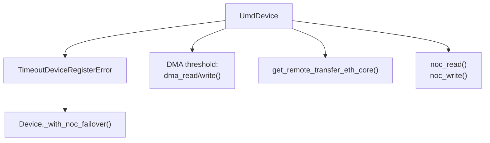

**DMA Thresholding:** Operations larger than `dma_read_threshold` or `dma_write_threshold` automatically use DMA instead of NOC reads/writes.
```


**`UmdDevice`**[ttexalens/umd_device.py](https://github.com/tenstorrent/tt-exalens/blob/046c35eb/ttexalens/umd_device.py) wraps `tt_umd` device objects with additional functionality.

**Key Enhancements:**

**DMA Thresholding:** Operations larger than `dma_read_threshold` or `dma_write_threshold` automatically use DMA instead of NOC reads/writes.

**Sources:**[ttexalens/umd_device.py](https://github.com/tenstorrent/tt-exalens/blob/046c35eb/ttexalens/umd_device.py)

### UMD API

**`UmdApi`** provides device discovery and management.

| Method | Purpose |
| --- | --- |
| `detect_available_devices()` | Enumerate devices in cluster |
| `get_device(device_id)` | Retrieve device wrapper by ID |
| `convert_from_noc0()` | Coordinate system conversion (fallback) |

**Initialization:**

*   **Local**: `local_init()` creates `UmdApi` using local `tt_umd` instance
*   **Remote**: `init_ttexalens_remote()` creates proxy to remote `UmdApi` via Pyro5

**Sources:**[ttexalens/umd_api.py](https://github.com/tenstorrent/tt-exalens/blob/046c35eb/ttexalens/umd_api.py)

* * *

## Data Flow Through Layers

This section illustrates how a typical operation flows through all layers.

### Memory Read Operation

**Sources:**[ttexalens/tt_exalens_lib.py 253-289](https://github.com/tenstorrent/tt-exalens/blob/046c35eb/ttexalens/tt_exalens_lib.py#L253-L289)[ttexalens/device.py 199-218](https://github.com/tenstorrent/tt-exalens/blob/046c35eb/ttexalens/device.py#L199-L218)

### ELF Load Operation

**Sources:**[ttexalens/tt_exalens_lib.py 376-443](https://github.com/tenstorrent/tt-exalens/blob/046c35eb/ttexalens/tt_exalens_lib.py#L376-L443)[ttexalens/elf_loader.py 143-233](https://github.com/tenstorrent/tt-exalens/blob/046c35eb/ttexalens/elf_loader.py#L143-L233)

* * *

## Cross-Layer Patterns

### Context Propagation

All layers accept an optional `context` parameter that defaults to the global context:

**Sources:**[ttexalens/tt_exalens_lib.py 48-60](https://github.com/tenstorrent/tt-exalens/blob/046c35eb/ttexalens/tt_exalens_lib.py#L48-L60)

### Error Handling Strategy

| Layer | Error Type | Responsibility |
| --- | --- | --- |
| Library Layer | `TTException` | Input validation, high-level errors |
| Hardware Abstraction | `CoordinateTranslationError`, `RestrictedMemoryAccessError` | Abstraction violations |
| Hardware Interface | `TimeoutDeviceRegisterError` | Hardware communication failures |
| Safety Validation | `UnsafeAccessException` | Memory access violations |

Errors propagate upward with context preserved. CLI catches most exceptions and displays them without exiting [ttexalens/cli.py 322-336](https://github.com/tenstorrent/tt-exalens/blob/046c35eb/ttexalens/cli.py#L322-L336)

**Sources:**[ttexalens/util.py 181-203](https://github.com/tenstorrent/tt-exalens/blob/046c35eb/ttexalens/util.py#L181-L203)[ttexalens/tt_exalens_lib.py 107-129](https://github.com/tenstorrent/tt-exalens/blob/046c35eb/ttexalens/tt_exalens_lib.py#L107-L129)

### NOC Failover Mechanism

Implementation in [ttexalens/device.py 143-167](https://github.com/tenstorrent/tt-exalens/blob/046c35eb/ttexalens/device.py#L143-L167) maintains a NOC queue and rotates on failure.

**Sources:**[ttexalens/device.py 143-167](https://github.com/tenstorrent/tt-exalens/blob/046c35eb/ttexalens/device.py#L143-L167)

* * *

## Summary

The five-layer architecture provides:

1.   **Separation of Concerns**: Each layer has well-defined responsibilities
2.   **Multiple Access Patterns**: CLI, library, and GDB interfaces converge on same backend
3.   **Platform Independence**: Hardware abstraction hides device-specific details
4.   **Safety by Default**: Validation layer prevents accidental hardware corruption
5.   **Extensibility**: Plugin system for CLI commands, dynamic device type discovery
6.   **Remote Capability**: Pyro5 server enables network-transparent operation

The architecture enables both high-level symbolic debugging and low-level hardware manipulation while maintaining type safety and preventing common errors.

Dismiss
Refresh this wiki

Enter email to refresh

## Additional Diagrams


#### SFPI Toolchain Management


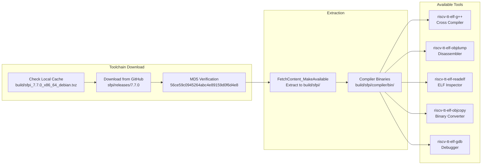

**SFPI Toolchain Lifecycle**: The build system first checks for a cached SFPI archive in `build/`. If not found, it downloads version 7.7.0 from GitHub releases and verifies the MD5 hash. The archive is then extracted to `build/sfpi/` using CMake's `FetchContent` mechanism.

The toolchain provides five essential RISC-V cross-compilation tools:
- **riscv-tt-elf-g++**: Cross-compiler for RISC-V with Tenstorrent extensions
- **riscv-tt-elf-objdump**: Disassembles and dumps ELF files
- **riscv-tt-elf-readelf**: Inspects ELF headers and sections
- **riscv-tt-elf-objcopy**: Converts between binary formats
- **riscv-tt-elf-gdb**: Debugger for RISC-V cores (packaged with wheel)

Sources: [cmake/sfpi_release.cmake:1-36](), [riscv-src/CMakeLists.txt:8-13](), [CMakeLists.txt:24-46]()

---
```


### Context Object Structure


```mermaid
graph TB
    subgraph "Context Class"
        Context["<b>Context</b><br/>ttexalens/context.py"]
        
        subgraph "Device Interfaces"
            UmdApi["umd_api: UmdApi<br/>Device communication"]
            FileApi["file_api: FileAccessApi<br/>File system access"]
        end
        
        subgraph "Configuration"
            ShortName["short_name: str<br/>'default'"]
            UseNoc1["use_noc1: bool<br/>NOC selection"]
            Use4B["use_4B_mode: bool<br/>4-byte transfer mode"]
            DmaReadThresh["dma_read_threshold: int<br/>24 bytes"]
            DmaWriteThresh["dma_write_threshold: int<br/>56 bytes"]
            NocFailover["noc_failover: bool<br/>Auto NOC0/NOC1 switch"]
            SafeMode["safe_mode: bool<br/>Restrict unsafe memory access"]
        end
</thinking>
        
        subgraph "Cached Resources"
            Devices["devices: dict[int, Device]<br/>@cached_property"]
            DeviceIds["device_ids: SortedSet[int]<br/>@cached_property"]
            ClusterDesc["cluster_descriptor<br/>@cached_property"]
            DeviceByUID["device_by_unique_id<br/>@cached_property"]
            ElfObj["elf: ELF<br/>@cached_property"]
        end
        
        subgraph "Session State"
            Commands["commands: list[CommandMetadata]<br/>Available commands"]
            LoadedElfs["loaded_elfs: dict[RiscLocation, str]<br/>Tracking loaded ELFs"]
        end
    end
    
    Context --> UmdApi
    Context --> FileApi
    Context --> UseNoc1
    Context --> Use4B
    Context --> DmaReadThresh
    Context --> DmaWriteThresh
    Context --> NocFailover
    Context --> Devices
    Context --> DeviceIds
    Context --> Commands
    Context --> LoadedElfs
```


#### Context Usage Pattern in Library Functions


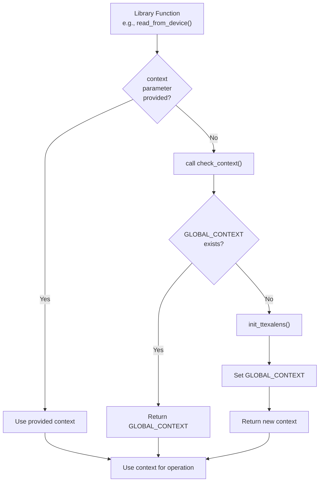


## Take core out of reset


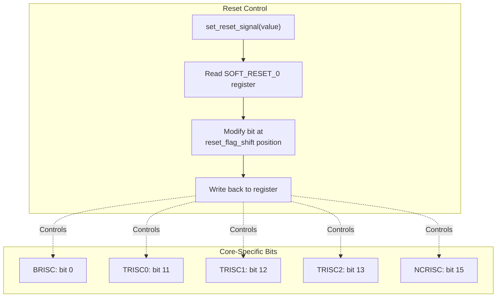


#### Access Patterns


**Key Implementation Details:**

1. **Core Running:** If the core is not in reset, simply halt it, perform operations, and resume.

2. **Core in Reset:** The implementation:
   - Saves 4 bytes from the start address
   - Writes an endless loop instruction (`JAL x0, 0` = 0x6F) to start address
   - Takes core out of reset (it enters the endless loop)
   - Halts the core
   - Performs memory operations
   - Returns core to reset
   - Restores original bytes at start address
```


## Both syntaxes are equivalent for struct members


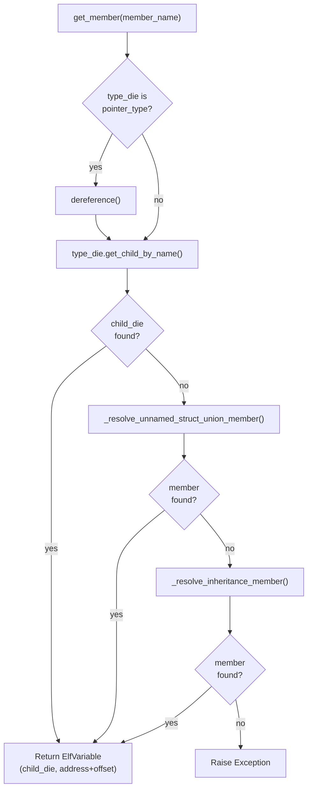

**Diagram: Member Resolution Algorithm**
```


#### Memory Access Errors


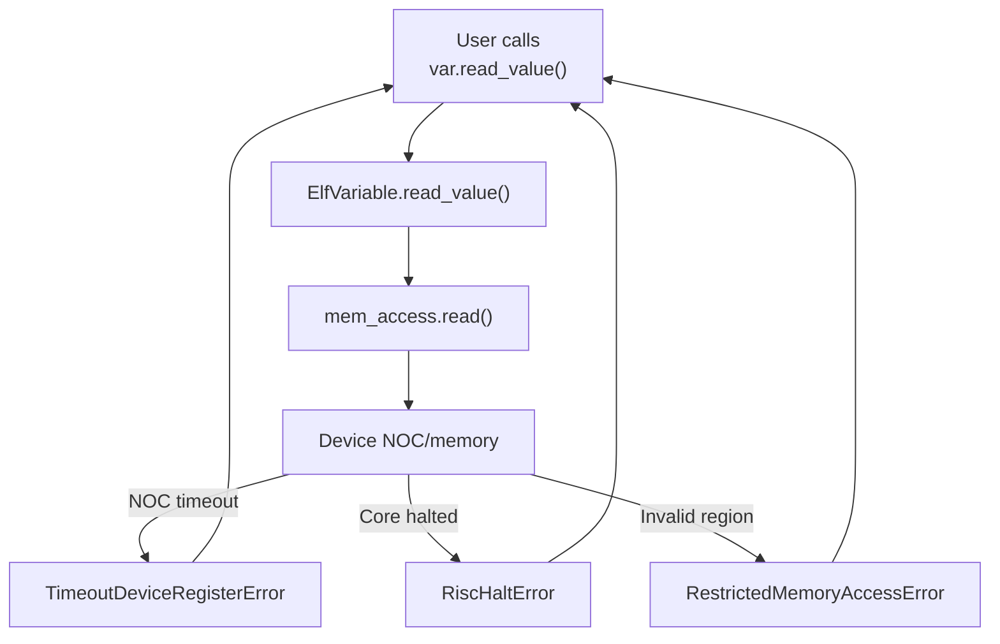

**Diagram: Memory Error Propagation**

All operator overloads and value access methods explicitly re-raise these exceptions [ttexalens/elf/variable.py:528-529](), [ttexalens/elf/variable.py:546-547](), [ttexalens/elf/variable.py:564-565](), [ttexalens/elf/variable.py:583-584]().
```


#### ARC in Device Hierarchy


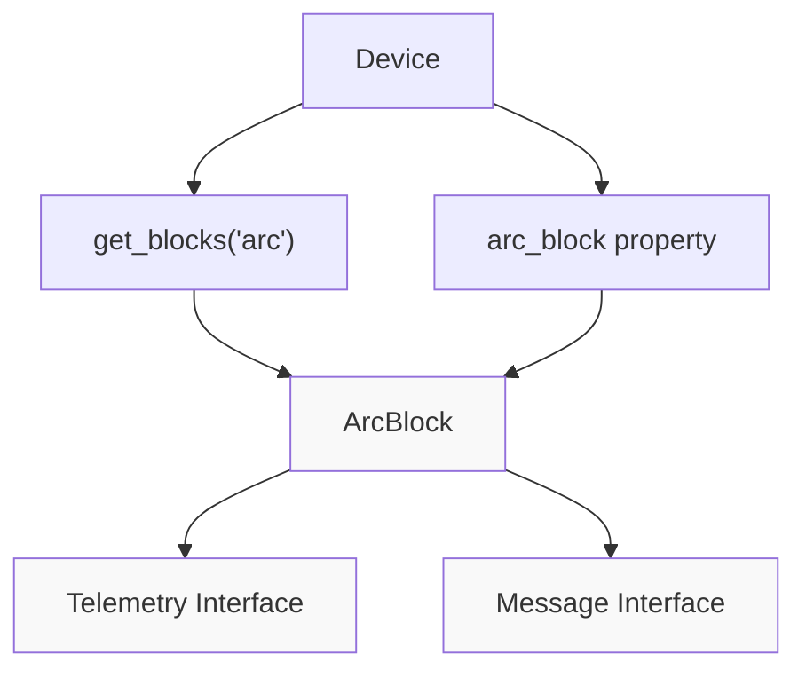


#### System Structure


```mermaid
graph TB
    subgraph "Entry Point"
        Main["main()<br/>[cli.py:351-447]"]
    end
    
    subgraph "Initialization"
        ParseArgs["docopt argument parsing<br/>[cli.py:362]"]
        InitLocal["init_ttexalens()<br/>Local Mode"]
        InitRemote["init_ttexalens_remote()<br/>Remote Mode"]
        StartServer["start_server()<br/>Server Mode"]
    end
    
    subgraph "REPL Loop"
        MainLoop["main_loop()<br/>[cli.py:190-349]"]
        UIState["UIState<br/>[uistate.py:63-125]"]
        ImportCmds["import_commands()<br/>[cli.py:87-154]"]
    end
    
    subgraph "Command Execution"
        Prompt["prompt_session.prompt()"]
        FindCmd["find command<br/>[cli.py:283-286]"]
        RunCmd["command._module.run()"]
        SpeedDial["navigation_suggestions<br/>[cli.py:70-83]"]
    end
    
    subgraph "Command Completion"
        Completer["TTExaLensCompleter<br/>[uistate.py:19-50]"]
        LookupCmds["lookup_commands()"]
        FuzzyAddr["fuzzy_lookup_addresses()"]
    end
    
    Main --> ParseArgs
    ParseArgs --> InitLocal
    ParseArgs --> InitRemote
    ParseArgs --> StartServer
    
    InitLocal --> MainLoop
    InitRemote --> MainLoop
    StartServer --> MainLoop
    
    MainLoop --> UIState
    MainLoop --> ImportCmds
    MainLoop --> Prompt
    
    Prompt --> Completer
    Completer --> LookupCmds
    Completer --> FuzzyAddr
    
    Prompt --> FindCmd
    FindCmd --> RunCmd
    RunCmd --> SpeedDial
    SpeedDial --> Prompt
```


#### Main Loop Flow


```mermaid
graph TB
    Start["Enter main_loop()"]
    ImportCmds["Import commands<br/>[cli.py:196-198]"]
    InitUI["Initialize UIState<br/>[cli.py:201]"]
    CheckServer["Check --start-server<br/>[cli.py:206-208]"]
    CheckGDB["Check --start-gdb<br/>[cli.py:211-213]"]
    NonInteractive["Non-interactive commands?<br/>[cli.py:216]"]
    
    PrintSuggestions["print_navigation_suggestions()<br/>[cli.py:225]"]
    
    GetCommand{"Command source?"}
    NonInteractiveCmd["Pop from<br/>non_interactive_commands"]
    InteractiveCmd["prompt_session.prompt()<br/>[cli.py:259]"]
    
    TrimComment["Trim comments (#)<br/>[cli.py:262]"]
    ExtractRedirect["extract_command_file_output()<br/>[cli.py:265]"]
    RedirectOutput["redirect_command_output_to_file()<br/>[cli.py:269]"]
    
    CheckSpeedDial{"Is integer?<br/>[cli.py:270-275]"}
    UseSpeedDial["Use navigation_suggestions[n]"]
    ParseCmd["Split command<br/>[cli.py:277]"]
    
    FindCmd["Find command in context.commands<br/>[cli.py:283-286]"]
    CheckBuiltin{"Built-in?"}
    HandleExit["exit with code"]
    HandleReload["importlib.reload()"]
    HandleEval["eval() expression"]
    HandleModule["found_command._module.run()<br/>[cli.py:311]"]
    
    UpdateSuggestions["Update navigation_suggestions<br/>[cli.py:312]"]
    HandleException["notify_exception()<br/>[cli.py:329]"]
    
    Loop["Loop back"]
    Exit["Exit main_loop()"]
    
    Start --> ImportCmds --> InitUI
    InitUI --> CheckServer --> CheckGDB
    CheckGDB --> NonInteractive
    
    NonInteractive --> PrintSuggestions
    PrintSuggestions --> GetCommand
    
    GetCommand -->|Non-interactive| NonInteractiveCmd
    GetCommand -->|Interactive| InteractiveCmd
    
    NonInteractiveCmd --> TrimComment
    InteractiveCmd --> TrimComment
    
    TrimComment --> ExtractRedirect
    ExtractRedirect --> RedirectOutput
    RedirectOutput --> CheckSpeedDial
    
    CheckSpeedDial -->|Yes| UseSpeedDial
    CheckSpeedDial -->|No| ParseCmd
    UseSpeedDial --> ParseCmd
    
    ParseCmd --> FindCmd
    FindCmd -->|Not found| HandleException
    FindCmd -->|Found| CheckBuiltin
    
    CheckBuiltin -->|exit| HandleExit --> Exit
    CheckBuiltin -->|reload| HandleReload --> Loop
    CheckBuiltin -->|eval| HandleEval --> Loop
    CheckBuiltin -->|module| HandleModule
    
    HandleModule --> UpdateSuggestions --> Loop
    HandleException --> Loop
    Loop --> NonInteractive
```


#### Automatic DMA Threshold


```mermaid
graph TB
    ReadReq["Read Request<br/>size_bytes"]
    CheckSize{"size_bytes ><br/>dma_threshold?"}
    TLBRead["TLB Read<br/>(Small transfers)"]
    DMARead["DMA Read<br/>(Large transfers)"]
    
    ReadReq --> CheckSize
    CheckSize -->|"<= threshold"| TLBRead
    CheckSize -->|"> threshold"| DMARead
```

**Default DMA Threshold**: Configured per context, typically optimized for 1KB+ transfers

**Benefits:**
- **TLB Mode**: Low latency for small reads (< 256 bytes)
- **DMA Mode**: High throughput for bulk transfers (> 1KB)

Sources: [test/ttexalens/unit_tests/test_lib.py:127-145]()

---
```


#### Memory Address Translation


```mermaid
graph LR
    Private["Private Address<br/>0x2000-0x4000"]
    NOC["NOC Address<br/>0x100002000-0x100004000"]
    
    Private -->|"translate_to_noc_address()"| NOC
    NOC -->|"contains_private_address()"| Private
```

For memory outside L1 (e.g., TRISC private data), NOC access is not possible and the debug protocol must be used.
```


#### Register Access Hierarchy


```mermaid
graph TB
    RegisterAccess["Register Access Request"]
    
    Bar0Check{"BAR0 address<br/>available?"}
    NocCheck{"NOC address<br/>available?"}
    CfgCheck{"Configuration<br/>register?"}
    PrivateCheck{"Private address<br/>available?"}
    
    Bar0Read["device.bar0_read32()"]
    NocRead["location.noc_read32()"]
    CfgRead["Write index to control register<br/>Read from data register"]
    PrivateRead["risc_debug.read_memory()"]
    
    Error["Error: No access method"]
    
    RegisterAccess --> Bar0Check
    Bar0Check -->|Yes| Bar0Read
    Bar0Check -->|No| NocCheck
    
    NocCheck -->|Yes| NocRead
    NocCheck -->|No| CfgCheck
    
    CfgCheck -->|Yes| CfgRead
    CfgCheck -->|No| PrivateCheck
    
    PrivateCheck -->|Yes| PrivateRead
    PrivateCheck -->|No| Error
```

**Register Types:**

| Register Type | Access Method | Use Case |
|--------------|---------------|----------|
| `DebugRegisterDescription` | Direct NOC or Private | Debug interface registers |
| `ConfigurationRegisterDescription` | Indexed (control + data registers) | Configuration space |
| `RiscControlRegisterDescription` | NOC or Private | RISC-V control registers |
| `NocStatusRegisterDescription` | NOC read | NOC status monitoring |
| `NocConfigurationRegisterDescription` | NOC read/write | NOC configuration |
| `ArcResetRegisterDescription` | BAR0 | ARC reset control |
```


#### Class Hierarchy


```mermaid
graph TB
    NocBlock["NocBlock<br/>(Abstract Base)<br/>ttexalens/hardware/noc_block.py"]
    
    WormholeNocBlock["WormholeNocBlock<br/>ttexalens/hardware/wormhole/noc_block.py"]
    BlackholeNocBlock["BlackholeNocBlock<br/>ttexalens/hardware/blackhole/noc_block.py"]
    QuasarNocBlock["QuasarNocBlock<br/>ttexalens/hardware/quasar/noc_block.py"]
    
    WH_FW["WormholeFunctionalWorkerBlock<br/>5 RISCs: brisc, trisc0-2, ncrisc<br/>L1: 1464 KB"]
    WH_ETH["WormholeEthBlock<br/>1 RISC: erisc<br/>L1: 256 KB"]
    WH_DRAM["WormholeDramBlock<br/>No RISCs<br/>Bank: 2 GB"]
    
    BH_FW["BlackholeFunctionalWorkerBlock<br/>5 RISCs: brisc, trisc0-2, ncrisc<br/>L1: 1536 KB"]
    BH_ETH["BlackholeEthBlock<br/>2 RISCs: erisc0, erisc1<br/>L1: 512 KB"]
    BH_DRAM["BlackholeDramBlock<br/>1 RISC: drisc<br/>L1: 128 KB"]
    BH_DRAM_SIM["BlackholeDramBlockSim<br/>Simulator only<br/>No RISCs"]
    
    Q_FW["QuasarFunctionalWorkerBlock<br/>4 NEOs × 4 RISCs each<br/>L1: 4 MB"]
    
    NocBlock --> WormholeNocBlock
    NocBlock --> BlackholeNocBlock
    NocBlock --> QuasarNocBlock
    
    WormholeNocBlock --> WH_FW
    WormholeNocBlock --> WH_ETH
    WormholeNocBlock --> WH_DRAM
    
    BlackholeNocBlock --> BH_FW
    BlackholeNocBlock --> BH_ETH
    BlackholeNocBlock --> BH_DRAM
    BlackholeNocBlock --> BH_DRAM_SIM
    
    QuasarNocBlock --> Q_FW
```


#### Register Stores


```mermaid
graph LR
    Maps["register_map<br/>niu_register_map<br/>(dict of RegisterDescription)"]
    Callable["get_register_base_address_callable(noc_id)<br/>Returns base addresses"]
    
    Init["RegisterStore.create_initialization()<br/>RegisterStoreInitialization"]
    
    Store0["RegisterStore<br/>(noc0)<br/>Instance at location"]
    Store1["RegisterStore<br/>(noc1)<br/>Instance at location"]
    
    Maps --> Init
    Callable --> Init
    
    Init --> Store0
    Init --> Store1
```

**Example from Blackhole functional worker:**

```python
```


#### RISC Core Properties


```mermaid
graph TB
    subgraph "Functional Worker Block"
        Block["BlackholeFunctionalWorkerBlock"]
        
        BRISC["brisc<br/>BabyRiscInfo<br/>risc_id: 0<br/>reset_flag_shift: 11"]
        TRISC0["trisc0<br/>BabyRiscInfo<br/>risc_id: 1<br/>reset_flag_shift: 12"]
        TRISC1["trisc1<br/>BabyRiscInfo<br/>risc_id: 2<br/>reset_flag_shift: 13"]
        TRISC2["trisc2<br/>BabyRiscInfo<br/>risc_id: 3<br/>reset_flag_shift: 14"]
        NCRISC["ncrisc<br/>BabyRiscInfo<br/>risc_id: 4<br/>reset_flag_shift: 18"]
        
        Block --> BRISC
        Block --> TRISC0
        Block --> TRISC1
        Block --> TRISC2
        Block --> NCRISC
    end
    
    subgraph "Access Methods"
        GetDefault["get_default_risc_debug()<br/>Returns: brisc"]
        GetByName["get_risc_debug(risc_name, neo_id)<br/>Returns: Specific RISC"]
        AllRiscs["all_riscs<br/>Returns: All 5 RISCs"]
        Debuggable["debuggable_riscs<br/>Returns: 4 RISCs<br/>(ncrisc excluded)"]
    end
    
    Block --> GetDefault
    Block --> GetByName
    Block --> AllRiscs
    Block --> Debuggable
```


## Pattern used in ttexalens/hardware/wormhole/device.py


```mermaid
graph TB
    FirstCall["get_blocks('functional_workers')"]
    GetLocs["get_block_locations('functional_workers')<br/>Returns: List of OnChipCoordinate"]
    
    Loop["For each location"]
    GetBlock["get_block(location)"]
    CheckCache{"Block cached?"}
    CreateBlock["Instantiate block"]
    ReturnCached["Return cached block"]
    
    BuildList["Build list of blocks"]
    CacheList["Cache the list"]
    ReturnList["Return list"]
    
    SecondCall["get_blocks('functional_workers')<br/>(subsequent call)"]
    ReturnCachedList["Return cached list directly"]
    
    FirstCall --> GetLocs
    GetLocs --> Loop
    Loop --> GetBlock
    GetBlock --> CheckCache
    CheckCache -->|No| CreateBlock
    CheckCache -->|Yes| ReturnCached
    CreateBlock --> BuildList
    ReturnCached --> BuildList
    BuildList --> CacheList
    CacheList --> ReturnList
    
    SecondCall --> ReturnCachedList
```


#### MemoryMap


```mermaid
graph TB
    subgraph MemoryMap["MemoryMap"]
        NOC_TREE["_noc_addresses: IntervalTree"]
        PRIV_TREE["_private_addresses: IntervalTree"]
        BAR0_TREE["_bar0_addresses: IntervalTree"]
        BLOCKS["_blocks_info: dict[str, MemoryMapBlockInfo]"]
    end
    
    subgraph Operations["Lookup Operations"]
        ADD["add_block(block_info)"]
        FIND_NOC["find_by_noc_address(addr)"]
        FIND_PRIV["find_by_private_address(addr)"]
        FIND_BAR0["find_by_bar0_address(addr)"]
        FIND_NAME["find_by_name(name)"]
        NEXT_NOC["find_next_by_noc_address(addr)"]
    end
    
    ADD --> |"Adds to all<br/>applicable trees"| NOC_TREE
    ADD --> PRIV_TREE
    ADD --> BAR0_TREE
    ADD --> BLOCKS
    
    FIND_NOC --> |"O(log n) lookup"| NOC_TREE
    FIND_PRIV --> PRIV_TREE
    FIND_BAR0 --> BAR0_TREE
    FIND_NAME --> |"O(1) lookup"| BLOCKS
```

**Key Methods:**

- `add_block(block_info: MemoryMapBlockInfo)` - Registers a memory block in all applicable interval trees
- `find_by_noc_address(noc_address: int) -> MemoryMapBlockInfo | None` - Finds block containing NOC address
- `find_by_private_address(private_address: int) -> MemoryMapBlockInfo | None` - Finds block containing private address
- `find_by_bar0_address(bar0_address: int) -> MemoryMapBlockInfo | None` - Finds block containing BAR0 address
- `find_by_name(name: str) -> MemoryMapBlockInfo | None` - Finds block by name
- `find_next_by_*_address(address: int)` - Finds next block after given address

The interval trees enable O(log n) lookup by address range, critical for validating memory accesses during debugging operations.

Sources: [ttexalens/memory_map.py:37-128]()
```


### Register Description Class Hierarchy


```mermaid
graph TB
    RD["RegisterDescription\
(base_address, offset, mask, shift, data_type)"]

    DRD["DebugRegisterDescription\
Direct NOC/private debug registers"]
    RCRD["RiscControlRegisterDescription\
RISC execution control registers"]
    CRD["ConfigurationRegisterDescription\
Indirect config registers\
(+ index field)"]
    TGPRD["TensixGeneralPurposeRegisterDescription\
Tensix GPR access\
(+ index + thread_id fields)"]
    NSRD["NocStatusRegisterDescription\
NOC status flags"]
    NCRD["NocConfigurationRegisterDescription\
NOC configuration"]
    NCTRL["NocControlRegisterDescription\
NOC control commands"]
    ARRD["ArcResetRegisterDescription\
ARC reset control"]
    ACSM["ArcCsmRegisterDescription\
ARC CSM registers"]
    AROM["ArcRomRegisterDescription\
ARC ROM registers"]

    RD --> DRD
    RD --> RCRD
    RD --> CRD
    RD --> TGPRD
    RD --> NSRD
    RD --> NCRD
    RD --> NCTRL
    RD --> ARRD
    RD --> ACSM
    RD --> AROM
```

Sources: [ttexalens/register_store.py:63-161]()
```


#### RegisterStore Class


```mermaid
graph TB
    RSI["RegisterStoreInitialization\
(registers_map, get_register_base_address)"]
    LOC["OnChipCoordinate\
(location)"]
    NEO["neo_id: int | None"]

    RS["RegisterStore\
(ttexalens/register_store.py)"]

    DEV["Device\
(via location._device)"]
    CTX["Context\
(via device._context)"]
    BLOCK["NocBlock\
(via location.noc_block)"]
    RISC["RiscDebug\
(via block.get_default_risc_debug())"]
    MMAP["MemoryMap\
(risc_info.memory_map)"]

    RSI --> RS
    LOC --> RS
    NEO --> RS

    RS -.->|"hardware access"| DEV
    RS -.->|"settings"| CTX
    RS -.->|"private memory"| RISC
    RS -.->|"config_regs bounds"| MMAP
    BLOCK --> RISC
    RISC --> MMAP
```

Sources: [ttexalens/register_store.py:169-211]()
```


### Coordinate System Translation Tables


```mermaid
graph LR
    subgraph "Coordinate Translation"
        DIE["die coordinate (x, y)"]
        NOC0["noc0 coordinate (x, y)"]
        
        DIE -->|"DIE_X_TO_NOC_0_X[x]<br/>DIE_Y_TO_NOC_0_Y[y]"| NOC0
        NOC0 -->|"NOC_0_X_TO_DIE_X[x]<br/>NOC_0_Y_TO_DIE_Y[y]"| DIE
    end
    
    subgraph "Platform Implementations"
        WHMap["WormholeDevice translation tables"]
        BHMap["BlackholeDevice translation tables"]
        QSMap["QuasarDevice translation tables"]
    end
    
    DIE -.-> WHMap
    DIE -.-> BHMap
    DIE -.-> QSMap
```

Sources: [ttexalens/device.py:103-106](), [ttexalens/device.py:400-437]()

The `__noc_to_die()` method uses these translation tables:

```python
def __noc_to_die(self, noc_loc, noc_id=0):
    noc_x, noc_y = noc_loc
    assert noc_id == 0
    return (self.NOC_0_X_TO_DIE_X[noc_x], self.NOC_0_Y_TO_DIE_Y[noc_y])
```

Sources: [ttexalens/device.py:400-403]()

The coordinate system initialization process (`_init_coordinate_systems()`) populates the internal translation dictionaries that enable conversion between all five coordinate systems: `noc0`, `noc1`, `die`, `logical`, and `translated`.

Sources: [ttexalens/device.py:405-437]()
```


#### TimeoutDeviceRegisterError


```mermaid
graph TB
    subgraph "Read Timeout Detection"
        ReadStart["Start timer"]
        ReadOp["UMD noc_read()"]
        ReadEnd["End timer"]
        CheckReadTimeout{"elapsed > READ_TIMEOUT<br/>AND last 4 bytes == 0xFFFFFFFF<br/>AND is_mmio_capable<br/>AND NOT simulation?"}
        RaiseReadTimeout["Raise TimeoutDeviceRegisterError"]
        
        ReadStart --> ReadOp
        ReadOp --> ReadEnd
        ReadEnd --> CheckReadTimeout
        CheckReadTimeout -->|"Yes"| RaiseReadTimeout
    end
    
    subgraph "Write Timeout Detection"
        WriteStart["Start timer"]
        WriteOp["UMD noc_write()"]
        WriteEnd["End timer"]
        CheckWriteTimeout{"elapsed > WRITE_TIMEOUT<br/>AND len(data) == 4<br/>AND is_mmio_capable<br/>AND NOT simulation?"}
        TrackTimeout["Add to consecutive<br/>timeout list"]
        CheckCount{"len(timeouts) >=<br/>NUM_OF_CONSECUTIVE_TIMEOUTS?"}
        RaiseWriteTimeout["Raise first<br/>timeout error"]
        ClearTimeouts["Clear timeout list"]
        
        WriteStart --> WriteOp
        WriteOp --> WriteEnd
        WriteEnd --> CheckWriteTimeout
        CheckWriteTimeout -->|"Yes"| TrackTimeout
        CheckWriteTimeout -->|"No"| ClearTimeouts
        TrackTimeout --> CheckCount
        CheckCount -->|"Yes"| RaiseWriteTimeout
    end
```


### Architecture and Class Structure


```mermaid
graph TB
    TensixDebug["TensixDebug<br/>(debug_tensix.py:57)"]
    Location["OnChipCoordinate"]
    NocBlock["NocBlock"]
    RegisterStore["RegisterStore"]
    MemoryAccess["MemoryAccess"]
    RiscDebug["RiscDebug<br/>(trisc0)"]
    
    TensixDebug --> Location
    TensixDebug --> NocBlock
    TensixDebug --> RegisterStore
    TensixDebug --> MemoryAccess
    
    Location --> NocBlock
    NocBlock --> RegisterStore
    MemoryAccess --> RiscDebug
    
    subgraph "Access Methods"
        IndirectAccess["Indirect Access<br/>_start_insn_push()<br/>_insn_push()<br/>_end_insn_push()"]
        DirectAccess["Direct Access<br/>direct_dest_read()<br/>direct_dest_write()"]
    end
    
    TensixDebug --> IndirectAccess
    TensixDebug --> DirectAccess
    
    subgraph "Register Files"
        SRCA["SRCA<br/>(Source A)"]
        SRCB["SRCB<br/>(Source B)"]
        DSTACC["DSTACC<br/>(Destination)"]
    end
    
    IndirectAccess -.reads.-> SRCA
    IndirectAccess -.reads.-> SRCB
    IndirectAccess -.reads.-> DSTACC
    DirectAccess -.reads/writes.-> DSTACC
```

**Diagram: TensixDebug Class Architecture**

The `TensixDebug` class is initialized with an `OnChipCoordinate` and obtains:
- `noc_block` - Hardware block representing the Tensix core
- `register_store` - Access to configuration and debug registers
- `mem_access` - Memory access through TRISC0 debug hardware with `restricted_access=False` to access destination register memory

Sources: [ttexalens/debug_tensix.py:57-71]()

---
```


#### File Structure


```mermaid
graph LR
    subgraph "GCDA File Format"
        Magic["Magic Number<br/>0x67636461 'gcda'"]
        Version["Version<br/>Matches Compiler"]
        Stamp["Timestamp"]
        
        subgraph "Per-Function Records"
            FuncTag["Function Tag<br/>0x01000000"]
            FuncLen["Record Length"]
            FuncIdent["Function Ident"]
            FuncChecksum["Lineno Checksum"]
            CfgChecksum["CFG Checksum"]
            
            CounterTag["Counter Tag<br/>0x01a10000"]
            CounterLen["Record Length"]
            CounterData["Counter Values<br/>uint64_t[]"]
        end
        
        ObjectTag["Object Summary"]
        ProgramTag["Program Summary"]
    end
    
    Magic --> Version
    Version --> Stamp
    Stamp --> FuncTag
    FuncTag --> FuncLen
    FuncLen --> FuncIdent
    FuncIdent --> FuncChecksum
    FuncChecksum --> CfgChecksum
    CfgChecksum --> CounterTag
    CounterTag --> CounterLen
    CounterLen --> CounterData
    CounterData --> ObjectTag
    ObjectTag --> ProgramTag
```

**Diagram: GCDA File Format Structure**

The `.gcda` files generated by TTExaLens are binary-compatible with standard GCOV tools, enabling integration with existing coverage workflows:

- **gcov**: Generate text-based coverage reports
- **lcov**: Generate HTML coverage reports
- **gcovr**: Generate XML/JSON coverage reports for CI integration

Sources: Based on GCC GCOV file format specification
```


#### Context Caching Mechanism


```mermaid
graph TB
    TEST["Test Case Execution"]
    
    TEST --> INIT_CACHED["init_cached_test_context()"]
    
    INIT_CACHED --> CHECK{"_cached_test_context<br/>exists?"}
    
    CHECK -->|"Yes"| RETURN_CACHED["Return cached context"]
    CHECK -->|"No"| INIT_DEFAULT["init_default_test_context()"]
    
    INIT_DEFAULT --> MODE{"Execution Mode"}
    
    MODE -->|"TTEXALENS_TESTS_REMOTE"| REMOTE["init_ttexalens_remote()<br/>Connect to server"]
    MODE -->|"TTEXALENS_SIMULATOR"| SIM_CHECK{"_cached_simulator_context<br/>exists?"}
    MODE -->|"Default"| LOCAL["init_ttexalens()<br/>Local hardware"]
    
    SIM_CHECK -->|"Yes"| RETURN_SIM["Return cached simulator context"]
    SIM_CHECK -->|"No"| SIM_INIT["init_ttexalens()<br/>simulation_directory=..."]
    
    REMOTE --> CACHE_STORE["_cached_test_context = context"]
    LOCAL --> CACHE_STORE
    SIM_INIT --> SIM_CACHE["_cached_simulator_context = context"]
    
    CACHE_STORE --> RETURN_CACHED
    SIM_CACHE --> RETURN_SIM
    RETURN_SIM --> RETURN_CACHED
```

Sources: [test/ttexalens/unit_tests/test_base.py:9-62]()
```

