# System Architecture and Layers

Relevant source files
*   [VERSION](https://github.com/tenstorrent/tt-exalens/blob/046c35eb/VERSION)
*   [test/ttexalens/unit_tests/test_device.py](https://github.com/tenstorrent/tt-exalens/blob/046c35eb/test/ttexalens/unit_tests/test_device.py)
*   [test/ttexalens/unit_tests/test_lib.py](https://github.com/tenstorrent/tt-exalens/blob/046c35eb/test/ttexalens/unit_tests/test_lib.py)
*   [test/ttexalens/unit_tests/test_remote_communication.py](https://github.com/tenstorrent/tt-exalens/blob/046c35eb/test/ttexalens/unit_tests/test_remote_communication.py)
*   [test/ttexalens/unit_tests/test_tensix_debug.py](https://github.com/tenstorrent/tt-exalens/blob/046c35eb/test/ttexalens/unit_tests/test_tensix_debug.py)
*   [test/wheel/run-wheel.sh](https://github.com/tenstorrent/tt-exalens/blob/046c35eb/test/wheel/run-wheel.sh)
*   [ttexalens/cli_commands/interfaces.py](https://github.com/tenstorrent/tt-exalens/blob/046c35eb/ttexalens/cli_commands/interfaces.py)
*   [ttexalens/debug_tensix.py](https://github.com/tenstorrent/tt-exalens/blob/046c35eb/ttexalens/debug_tensix.py)
*   [ttexalens/device.py](https://github.com/tenstorrent/tt-exalens/blob/046c35eb/ttexalens/device.py)
*   [ttexalens/elf_loader.py](https://github.com/tenstorrent/tt-exalens/blob/046c35eb/ttexalens/elf_loader.py)
*   [ttexalens/requirements.txt](https://github.com/tenstorrent/tt-exalens/blob/046c35eb/ttexalens/requirements.txt)
*   [ttexalens/server.py](https://github.com/tenstorrent/tt-exalens/blob/046c35eb/ttexalens/server.py)
*   [ttexalens/tt_exalens_lib.py](https://github.com/tenstorrent/tt-exalens/blob/046c35eb/ttexalens/tt_exalens_lib.py)
*   [ttexalens/umd_api.py](https://github.com/tenstorrent/tt-exalens/blob/046c35eb/ttexalens/umd_api.py)
*   [ttexalens/umd_device.py](https://github.com/tenstorrent/tt-exalens/blob/046c35eb/ttexalens/umd_device.py)
*   [ttexalens/util.py](https://github.com/tenstorrent/tt-exalens/blob/046c35eb/ttexalens/util.py)

## Purpose and Scope

This document describes the layered architecture of TTExaLens, explaining how the system is organized from user-facing interfaces down to hardware communication. The architecture consists of five distinct layers that provide progressively lower-level access to Tenstorrent devices. This document focuses on the static structure and relationships between layers.

For runtime behavior and debugging workflows, see [Advanced Features](https://deepwiki.com/tenstorrent/tt-exalens/7-advanced-features). For device-specific implementations and hardware quirks, see [Device Architecture](https://deepwiki.com/tenstorrent/tt-exalens/5-device-architecture). For coordinate systems and memory addressing details, see [Coordinate Systems and Memory Addressing](https://deepwiki.com/tenstorrent/tt-exalens/1.2-coordinate-systems-and-memory-addressing).

* * *


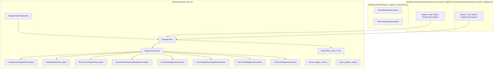

Sources: [ttexalens/register_store.py:1-20](), [ttexalens/hardware/tensix_registers_description.py](), [ttexalens/hardware/wormhole/functional_worker_registers.py:1-15](), [ttexalens/hardware/blackhole/functional_worker_registers.py:1-15]()

---
```
## Architectural Overview

TTExaLens employs a strict layered architecture where each layer depends only on layers below it. The architecture enables multiple access patterns: direct library usage, command-line interaction, and remote debugging via GDB protocol.

### Five-Layer Architecture

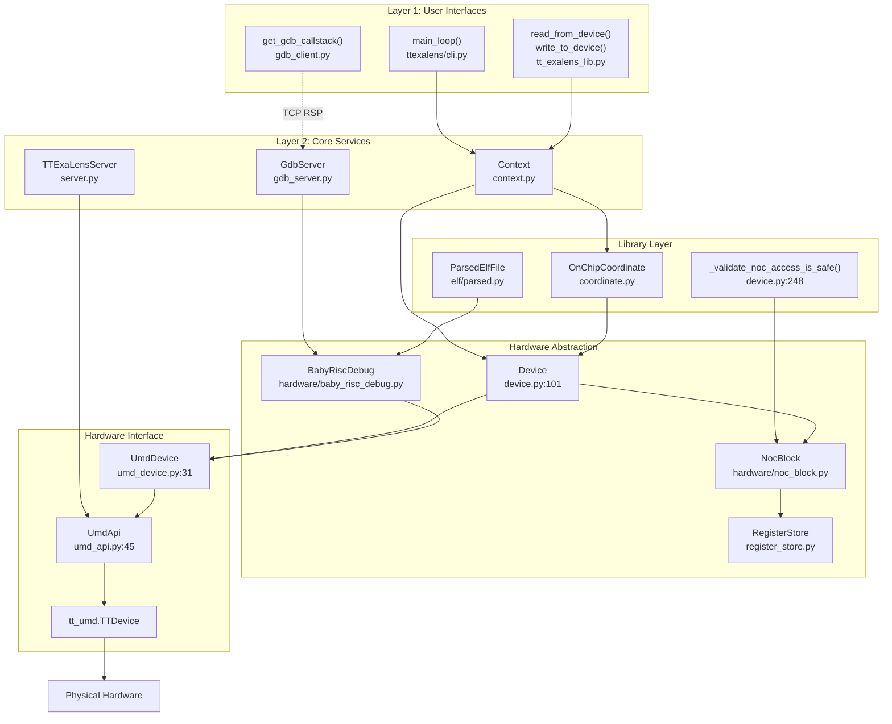


**Sources:**[ttexalens/device.py 101-155](https://github.com/tenstorrent/tt-exalens/blob/046c35eb/ttexalens/device.py#L101-L155)[ttexalens/tt_exalens_lib.py 109-292](https://github.com/tenstorrent/tt-exalens/blob/046c35eb/ttexalens/tt_exalens_lib.py#L109-L292)[ttexalens/cli.py 188-347](https://github.com/tenstorrent/tt-exalens/blob/046c35eb/ttexalens/cli.py#L188-L347)[ttexalens/gdb/gdb_server.py 55-708](https://github.com/tenstorrent/tt-exalens/blob/046c35eb/ttexalens/gdb/gdb_server.py#L55-L708)[ttexalens/server.py 41-145](https://github.com/tenstorrent/tt-exalens/blob/046c35eb/ttexalens/server.py#L41-L145)[ttexalens/umd_device.py 31-89](https://github.com/tenstorrent/tt-exalens/blob/046c35eb/ttexalens/umd_device.py#L31-L89)[ttexalens/umd_api.py 45-149](https://github.com/tenstorrent/tt-exalens/blob/046c35eb/ttexalens/umd_api.py#L45-L149)

* * *

## Layer 1: User Interfaces

The topmost layer provides three distinct entry points for interacting with Tenstorrent devices. Each interface targets different use cases but converges on the same underlying functionality.

### CLI Application

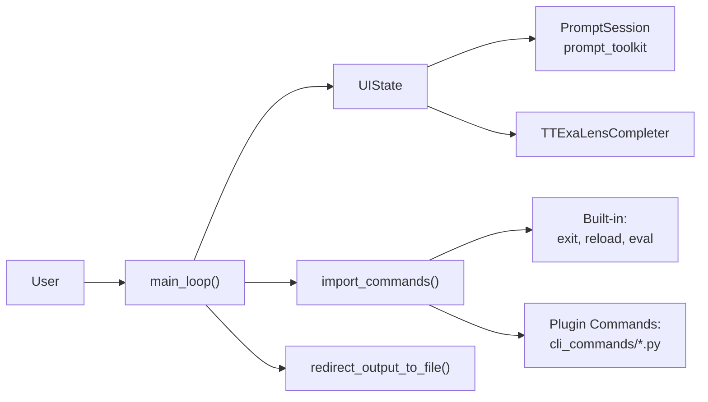

**Key Components:**
- **`main_loop()`** [ttexalens/cli.py:188-347]() - Main command processing loop
- **`import_commands()`** [ttexalens/cli.py:85-152]() - Dynamically loads commands from `cli_commands/` directory
- **`UIState`** [ttexalens/uistate.py:63-122]() - Manages prompt state, current location, and server instances
- **`TTExaLensCompleter`** [ttexalens/uistate.py:19-50]() - Provides command and symbol auto-completion

The CLI supports:
- Output redirection to files (`>`, `>>`, `|>`, `|>>`)
- Command history and auto-completion
- Navigation suggestions ("speed dial" numbered shortcuts)
- Multiple server modes (GDB server, TTExaLens server)
```


The command-line interface provides an interactive REPL environment for device inspection and debugging.

**Key Components:**

*   **`main_loop()`**[ttexalens/cli.py 188-347](https://github.com/tenstorrent/tt-exalens/blob/046c35eb/ttexalens/cli.py#L188-L347) - Main command processing loop
*   **`import_commands()`**[ttexalens/cli.py 85-152](https://github.com/tenstorrent/tt-exalens/blob/046c35eb/ttexalens/cli.py#L85-L152) - Dynamically loads commands from `cli_commands/` directory
*   **`UIState`**[ttexalens/uistate.py 63-122](https://github.com/tenstorrent/tt-exalens/blob/046c35eb/ttexalens/uistate.py#L63-L122) - Manages prompt state, current location, and server instances
*   **`TTExaLensCompleter`**[ttexalens/uistate.py 19-50](https://github.com/tenstorrent/tt-exalens/blob/046c35eb/ttexalens/uistate.py#L19-L50) - Provides command and symbol auto-completion

The CLI supports:

*   Output redirection to files (`>`, `>>`, `|>`, `|>>`)
*   Command history and auto-completion
*   Navigation suggestions ("speed dial" numbered shortcuts)
*   Multiple server modes (GDB server, TTExaLens server)

**Sources:**[ttexalens/cli.py 188-347](https://github.com/tenstorrent/tt-exalens/blob/046c35eb/ttexalens/cli.py#L188-L347)[ttexalens/uistate.py 63-122](https://github.com/tenstorrent/tt-exalens/blob/046c35eb/ttexalens/uistate.py#L63-L122)

### Python Library API

The programmatic interface exposes core functionality through Python functions in `tt_exalens_lib.py`.

| Function Category | Key Functions | Purpose |
| --- | --- | --- |
| Memory Operations | `read_from_device`, `write_to_device`, `read_words_from_device`, `write_words_to_device` | Raw memory access with safety validation |
| Register Access | `read_register`, `write_register` | Configuration and debug register manipulation |
| ELF Management | `load_elf`, `run_elf` | Load and execute programs on RISC-V cores |
| Debugging | `callstack`, `get_global`, `coverage` | Symbolic debugging with DWARF information |
| ARC Communication | `arc_msg`, `read_arc_telemetry_entry` | ARC processor interaction |
| Coordinate Conversion | `convert_coordinate` | Translate between coordinate systems |

**Entry Point Pattern:** All public API functions follow this pattern:

1.   Accept optional `context` parameter
2.   Call `check_context()`[ttexalens/tt_exalens_lib.py 48-60](https://github.com/tenstorrent/tt-exalens/blob/046c35eb/ttexalens/tt_exalens_lib.py#L48-L60) to get or create context
3.   Convert string coordinates to `OnChipCoordinate` objects
4.   Validate inputs and addresses
5.   Delegate to appropriate hardware abstraction layer

**Sources:**[ttexalens/tt_exalens_lib.py 48-900](https://github.com/tenstorrent/tt-exalens/blob/046c35eb/ttexalens/tt_exalens_lib.py#L48-L900)

### GDB Client Interface

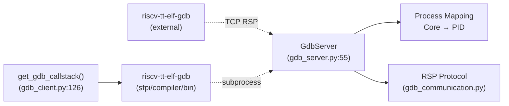


External GDB clients connect via TCP to the embedded GDB server, enabling standard GDB debugging workflows.

**Sources:**[ttexalens/gdb/gdb_server.py 55-708](https://github.com/tenstorrent/tt-exalens/blob/046c35eb/ttexalens/gdb/gdb_server.py#L55-L708)[ttexalens/gdb/gdb_client.py 16-180](https://github.com/tenstorrent/tt-exalens/blob/046c35eb/ttexalens/gdb/gdb_client.py#L16-L180)

* * *

## Layer 2: Core Services

The Core Services layer manages state, provides RPC capabilities, and implements protocol servers.

### Context Manager

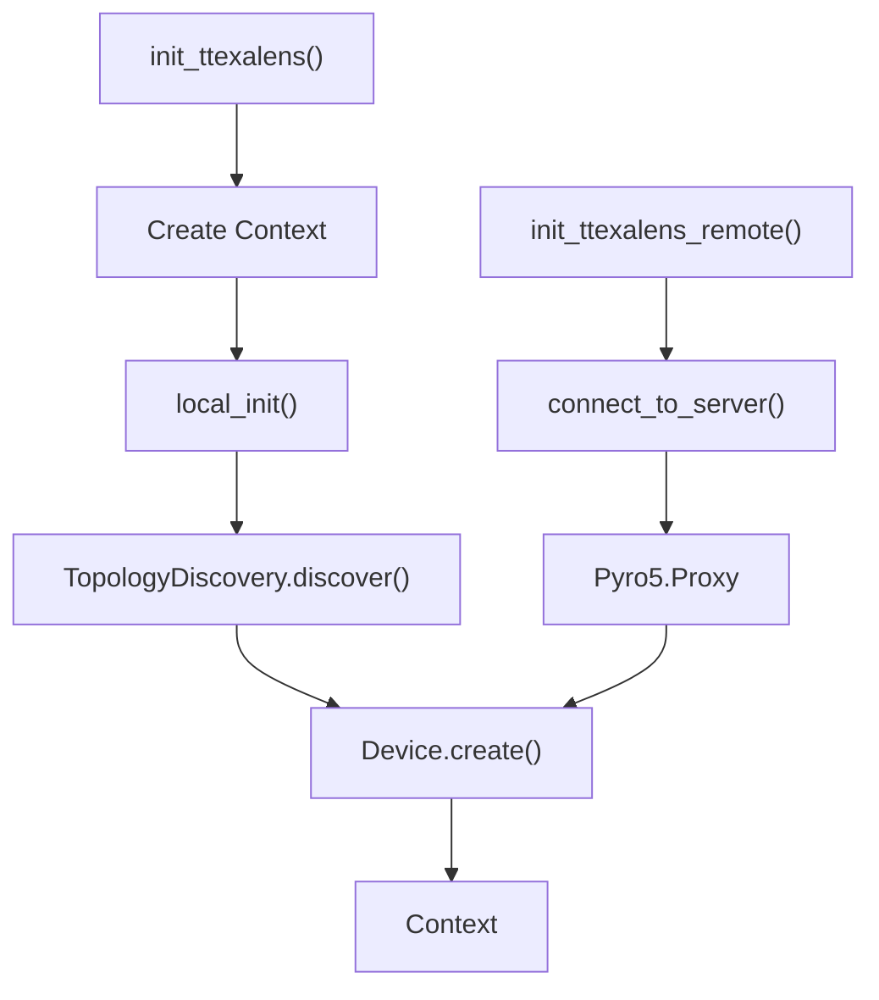


**`Context`** is the central coordination point for all TTExaLens operations.

| Responsibility | Implementation |
| --- | --- |
| Device Registry | Maintains `devices: dict[int, Device]` mapping device IDs to device objects |
| Configuration | Stores global settings (`use_noc1`, `use_4B_mode`, `safe_mode`, thresholds) |
| Session State | Tracks loaded ELFs, cluster descriptor, file API |
| Command Registry | Holds available CLI commands for dynamic dispatch |

**Initialization Paths:**

**Sources:**[test/ttexalens/unit_tests/test_lib.py 46-79](https://github.com/tenstorrent/tt-exalens/blob/046c35eb/test/ttexalens/unit_tests/test_lib.py#L46-L79)[test/ttexalens/unit_tests/test_ttexalens_init.py 21-87](https://github.com/tenstorrent/tt-exalens/blob/046c35eb/test/ttexalens/unit_tests/test_ttexalens_init.py#L21-L87)

### GDB Server

**`GdbServer`**[ttexalens/gdb/gdb_server.py 55-708](https://github.com/tenstorrent/tt-exalens/blob/046c35eb/ttexalens/gdb/gdb_server.py#L55-L708) implements the GDB Remote Serial Protocol (RSP) to expose RISC-V cores as debuggable processes.

**Process Mapping:**

*   Each RISC-V core becomes a separate process with unique PID
*   Process ID assigned on first run of core (when taken out of reset)
*   Multi-process debugging supported via `vAttach` and `vCont` packets

**Supported Operations:**

*   Memory read/write (`m`, `M` packets)
*   Register access (`g`, `G` packets)
*   Breakpoint/watchpoint management (`Z`, `z` packets)
*   Execution control (`c`, `s`, `vCont` packets)
*   Thread enumeration (`qfThreadInfo`, `qsThreadInfo`)
*   ELF symbol information via `qXfer`

**Protocol Handling:**[ttexalens/gdb/gdb_communication.py 120-338](https://github.com/tenstorrent/tt-exalens/blob/046c35eb/ttexalens/gdb/gdb_communication.py#L120-L338) implements low-level packet parsing and serialization, including:

*   Checksum validation
*   Escape sequence handling
*   ACK/NACK protocol
*   Run-length encoding (not used)

**Sources:**[ttexalens/gdb/gdb_server.py 55-708](https://github.com/tenstorrent/tt-exalens/blob/046c35eb/ttexalens/gdb/gdb_server.py#L55-L708)[ttexalens/gdb/gdb_communication.py 1-338](https://github.com/tenstorrent/tt-exalens/blob/046c35eb/ttexalens/gdb/gdb_communication.py#L1-L338)

### TTExaLens Server

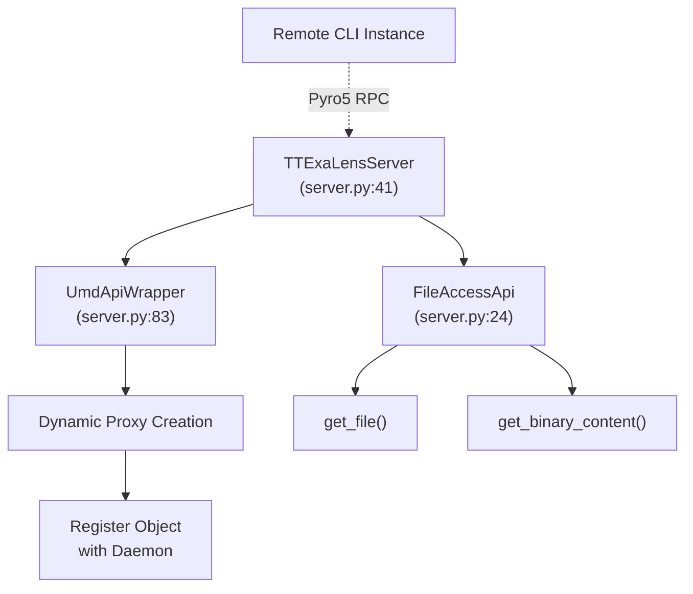

**Object Wrapping:** The server dynamically wraps UMD API objects, exposing all methods and properties over RPC. Complex return types are automatically registered as new Pyro5 objects and returned as proxies [ttexalens/server.py:88-144]().
```


**`TTExaLensServer`**[ttexalens/server.py 41-145](https://github.com/tenstorrent/tt-exalens/blob/046c35eb/ttexalens/server.py#L41-L145) enables remote access to TTExaLens functionality via Pyro5 RPC.

**Architecture:**

**Object Wrapping:** The server dynamically wraps UMD API objects, exposing all methods and properties over RPC. Complex return types are automatically registered as new Pyro5 objects and returned as proxies [ttexalens/server.py 88-144](https://github.com/tenstorrent/tt-exalens/blob/046c35eb/ttexalens/server.py#L88-L144)

**Sources:**[ttexalens/server.py 41-145](https://github.com/tenstorrent/tt-exalens/blob/046c35eb/ttexalens/server.py#L41-L145)[test/ttexalens/unit_tests/test_ttexalens_init.py 29-87](https://github.com/tenstorrent/tt-exalens/blob/046c35eb/test/ttexalens/unit_tests/test_ttexalens_init.py#L29-L87)

* * *

## Layer 3: Library Layer

The Library Layer provides high-level abstractions that hide hardware complexity and ensure safe operation.

### Coordinate System

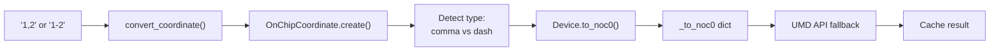

**Cache Structure:** [ttexalens/device.py:279-333]()
- `Device._to_noc0: dict[(coord_tuple, coord_system, core_type), noc0_tuple]`
- `Device._from_noc0: dict[(noc0_tuple, coord_system), (converted_tuple, core_type)]`
```


**`OnChipCoordinate`** is the universal addressing mechanism for on-chip resources.

**Supported Coordinate Systems:**

| System | Example | Description | Canonical |
| --- | --- | --- | --- |
| `noc0` | `"1-2"` | Physical NOC0 coordinates (x-y format) | Yes (internal) |
| `noc1` | `"1-2"` | Physical NOC1 coordinates | No |
| `logical` | `"1,2"` | Software logical coordinates (x,y format) | No |
| `translated` | `"1-2"` | Routing coordinates for cluster | No |
| `die` | `"1-2"` | Silicon die coordinates | No |

**Conversion Mechanism:**

**Cache Structure:**[ttexalens/device.py 279-333](https://github.com/tenstorrent/tt-exalens/blob/046c35eb/ttexalens/device.py#L279-L333)

*   `Device._to_noc0: dict[(coord_tuple, coord_system, core_type), noc0_tuple]`
*   `Device._from_noc0: dict[(noc0_tuple, coord_system), (converted_tuple, core_type)]`

**Sources:**[ttexalens/device.py 273-333](https://github.com/tenstorrent/tt-exalens/blob/046c35eb/ttexalens/device.py#L273-L333)[ttexalens/tt_exalens_lib.py 85-104](https://github.com/tenstorrent/tt-exalens/blob/046c35eb/ttexalens/tt_exalens_lib.py#L85-L104)

### Safety Validation

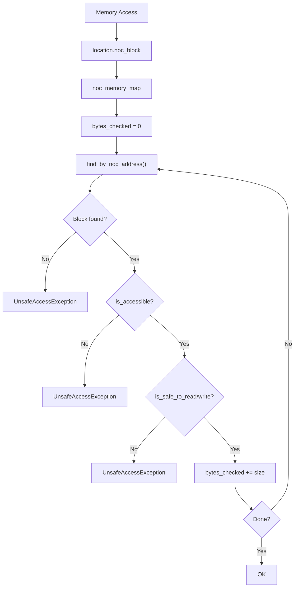

**Memory Block Safety Rules:**
- Must be in known memory block (found in `MemoryMap`)
- Block must have `is_accessible = True`
- Address range must pass block-specific safety checks
- Handles cross-block accesses by validating each chunk
```


**`_validate_noc_access_is_safe()`**[ttexalens/device.py 248-300](https://github.com/tenstorrent/tt-exalens/blob/046c35eb/ttexalens/device.py#L248-L300) prevents accidental hardware corruption by validating all memory accesses.

**Validation Process:**

**Memory Block Safety Rules:**

*   Must be in known memory block (found in `MemoryMap`)
*   Block must have `is_accessible = True`
*   Address range must pass block-specific safety checks
*   Handles cross-block accesses by validating each chunk

**Sources:**[ttexalens/device.py 248-300](https://github.com/tenstorrent/tt-exalens/blob/046c35eb/ttexalens/device.py#L248-L300)

### ELF/DWARF System

The ELF system provides symbolic debugging capabilities by parsing DWARF debug information.

| Component | Purpose | Location |
| --- | --- | --- |
| `ParsedElfFile` | Container for entire ELF file and DWARF tree | [ttexalens/elf/parsed.py](https://github.com/tenstorrent/tt-exalens/blob/046c35eb/ttexalens/elf/parsed.py) |
| `ElfDwarf` | DWARF structure parser | [ttexalens/elf/dwarf.py](https://github.com/tenstorrent/tt-exalens/blob/046c35eb/ttexalens/elf/dwarf.py) |
| `ElfDie` | Debug Information Entry navigation | [ttexalens/elf/die.py](https://github.com/tenstorrent/tt-exalens/blob/046c35eb/ttexalens/elf/die.py) |
| `ElfVariable` | Runtime variable access with operator overloading | [ttexalens/elf/variable.py](https://github.com/tenstorrent/tt-exalens/blob/046c35eb/ttexalens/elf/variable.py) |
| `FrameInfoProvider` | Call Frame Information for stack unwinding | [ttexalens/elf/cfi.py](https://github.com/tenstorrent/tt-exalens/blob/046c35eb/ttexalens/elf/cfi.py) |

**Sources:** See [ELF and DWARF Parsing](https://deepwiki.com/tenstorrent/tt-exalens/7.3-elf-and-dwarf-parsing)

* * *

## Layer 4: Hardware Abstraction

The Hardware Abstraction layer provides platform-independent interfaces to device functionality.

### Device Class Hierarchy

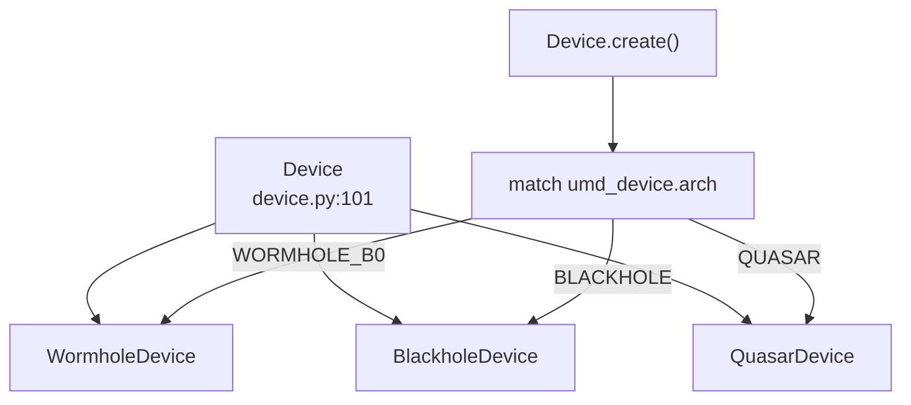

**Device Responsibilities:**

| Capability | Methods/Properties | Implementation |
|------------|-------------------|----------------|
| Memory Operations | `noc_read()`, `noc_write()`, `noc_read32()`, `noc_write32()` | [device.py:199-246]() |
| Block Management | `get_block()`, `get_blocks()`, `get_block_locations()` | [device.py:340-423]() |
| Coordinate Translation | `to_noc0()`, `from_noc0()` | [device.py:313-332]() |
| NOC Failover | `_with_noc_failover()` | [device.py:143-167]() |
| Register Access | `bar0_read32()`, `bar0_write32()` | [device.py:248-252]() |
```


**`Device`**[ttexalens/device.py 72-552](https://github.com/tenstorrent/tt-exalens/blob/046c35eb/ttexalens/device.py#L72-L552) is the abstract base class for all device implementations.

**Device Responsibilities:**

| Capability | Methods/Properties | Implementation |
| --- | --- | --- |
| Memory Operations | `noc_read()`, `noc_write()`, `noc_read32()`, `noc_write32()` | [device.py 199-246](https://github.com/tenstorrent/tt-exalens/blob/046c35eb/device.py#L199-L246) |
| Block Management | `get_block()`, `get_blocks()`, `get_block_locations()` | [device.py 340-423](https://github.com/tenstorrent/tt-exalens/blob/046c35eb/device.py#L340-L423) |
| Coordinate Translation | `to_noc0()`, `from_noc0()` | [device.py 313-332](https://github.com/tenstorrent/tt-exalens/blob/046c35eb/device.py#L313-L332) |
| NOC Failover | `_with_noc_failover()` | [device.py 143-167](https://github.com/tenstorrent/tt-exalens/blob/046c35eb/device.py#L143-L167) |
| Register Access | `bar0_read32()`, `bar0_write32()` | [device.py 248-252](https://github.com/tenstorrent/tt-exalens/blob/046c35eb/device.py#L248-L252) |

**Sources:**[ttexalens/device.py 72-552](https://github.com/tenstorrent/tt-exalens/blob/046c35eb/ttexalens/device.py#L72-L552)

### NocBlock System

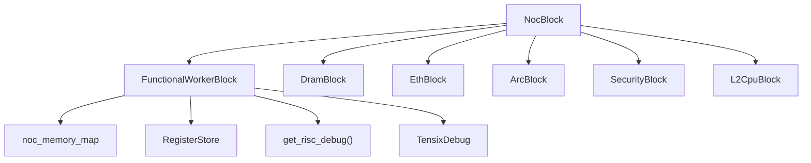

**Block Initialization:** [ttexalens/device.py:407-423]()
```python
```


**`NocBlock`** represents a hardware block on the NOC (Network-on-Chip). Each block type has specific capabilities.

**Block Type Classification:**

**Block Initialization:**[ttexalens/device.py 407-423](https://github.com/tenstorrent/tt-exalens/blob/046c35eb/ttexalens/device.py#L407-L423)

**Sources:**[ttexalens/device.py 407-423](https://github.com/tenstorrent/tt-exalens/blob/046c35eb/ttexalens/device.py#L407-L423)

### RISC-V Debug System

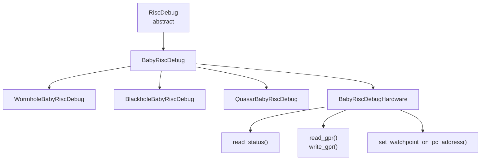

**Core Operations:**

| Operation | Method | Description |
|-----------|--------|-------------|
| Execution Control | `halt()`, `step()`, `cont()` | Start/stop core execution |
| Reset Management | `set_reset_signal()`, `is_in_reset()` | Control reset state |
| Register Access | `read_gpr(n)`, `write_gpr(n, value)` | Access general purpose registers (x0-x31, pc) |
| Memory Access | `read_memory()`, `write_memory()` | Access core private memory via debug interface |
| Breakpoints | `set_watchpoint_on_pc_address()` | Hardware watchpoint/breakpoint support |

**Platform-Specific Workarounds:**
- **Wormhole**: Double-stepping on branches due to branch prediction [hardware/wormhole/baby_risc_debug.py]()
- **Blackhole**: Instruction cache invalidation required after memory writes [hardware/blackhole/baby_risc_debug.py]()
- **Quasar**: Similar to Blackhole but different register offsets
```


The RISC-V debug system provides low-level control over RISC-V cores.

**Class Hierarchy:**

**Core Operations:**

| Operation | Method | Description |
| --- | --- | --- |
| Execution Control | `halt()`, `step()`, `cont()` | Start/stop core execution |
| Reset Management | `set_reset_signal()`, `is_in_reset()` | Control reset state |
| Register Access | `read_gpr(n)`, `write_gpr(n, value)` | Access general purpose registers (x0-x31, pc) |
| Memory Access | `read_memory()`, `write_memory()` | Access core private memory via debug interface |
| Breakpoints | `set_watchpoint_on_pc_address()` | Hardware watchpoint/breakpoint support |

**Platform-Specific Workarounds:**

*   **Wormhole**: Double-stepping on branches due to branch prediction [hardware/wormhole/baby_risc_debug.py](https://github.com/tenstorrent/tt-exalens/blob/046c35eb/hardware/wormhole/baby_risc_debug.py)
*   **Blackhole**: Instruction cache invalidation required after memory writes [hardware/blackhole/baby_risc_debug.py](https://github.com/tenstorrent/tt-exalens/blob/046c35eb/hardware/blackhole/baby_risc_debug.py)
*   **Quasar**: Similar to Blackhole but different register offsets

**Sources:** See [RISC-V Debugging System](https://deepwiki.com/tenstorrent/tt-exalens/6-risc-v-debugging-system)

### Register Store

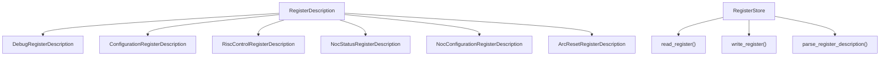

**Register Access Paths:**

| Register Type | Access Method | Address Calculation |
|---------------|---------------|---------------------|
| Configuration | Via debug control registers | Base + (index × 4) |
| Debug | Direct NOC access | Base + offset |
| BAR0 | PCIe BAR0 | BAR0 address space |
| NOC Status/Config | NOC register space | NOC-specific addressing |
| RISC Control | Debug hardware | Private memory space |
```


**`RegisterStore`**[ttexalens/register_store.py 169-390](https://github.com/tenstorrent/tt-exalens/blob/046c35eb/ttexalens/register_store.py#L169-L390) provides unified access to various register types.

**Register Type Hierarchy:**

**Register Access Paths:**

| Register Type | Access Method | Address Calculation |
| --- | --- | --- |
| Configuration | Via debug control registers | Base + (index × 4) |
| Debug | Direct NOC access | Base + offset |
| BAR0 | PCIe BAR0 | BAR0 address space |
| NOC Status/Config | NOC register space | NOC-specific addressing |
| RISC Control | Debug hardware | Private memory space |

**Sources:**[ttexalens/register_store.py 169-390](https://github.com/tenstorrent/tt-exalens/blob/046c35eb/ttexalens/register_store.py#L169-L390)[test/ttexalens/unit_tests/test_lib.py 362-551](https://github.com/tenstorrent/tt-exalens/blob/046c35eb/test/ttexalens/unit_tests/test_lib.py#L362-L551)

* * *

## Layer 5: Hardware Interface

The Hardware Interface layer wraps the C++ `tt_umd` library and provides Python bindings.

### UMD Device Wrapper

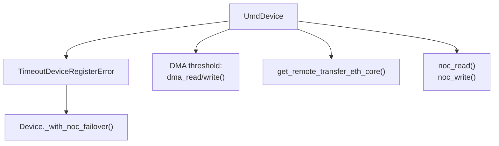

**DMA Thresholding:** Operations larger than `dma_read_threshold` or `dma_write_threshold` automatically use DMA instead of NOC reads/writes.
```


**`UmdDevice`**[ttexalens/umd_device.py](https://github.com/tenstorrent/tt-exalens/blob/046c35eb/ttexalens/umd_device.py) wraps `tt_umd` device objects with additional functionality.

**Key Enhancements:**

**DMA Thresholding:** Operations larger than `dma_read_threshold` or `dma_write_threshold` automatically use DMA instead of NOC reads/writes.

**Sources:**[ttexalens/umd_device.py](https://github.com/tenstorrent/tt-exalens/blob/046c35eb/ttexalens/umd_device.py)

### UMD API

**`UmdApi`** provides device discovery and management.

| Method | Purpose |
| --- | --- |
| `detect_available_devices()` | Enumerate devices in cluster |
| `get_device(device_id)` | Retrieve device wrapper by ID |
| `convert_from_noc0()` | Coordinate system conversion (fallback) |

**Initialization:**

*   **Local**: `local_init()` creates `UmdApi` using local `tt_umd` instance
*   **Remote**: `init_ttexalens_remote()` creates proxy to remote `UmdApi` via Pyro5

**Sources:**[ttexalens/umd_api.py](https://github.com/tenstorrent/tt-exalens/blob/046c35eb/ttexalens/umd_api.py)

* * *

## Data Flow Through Layers

This section illustrates how a typical operation flows through all layers.

### Memory Read Operation

**Sources:**[ttexalens/tt_exalens_lib.py 253-289](https://github.com/tenstorrent/tt-exalens/blob/046c35eb/ttexalens/tt_exalens_lib.py#L253-L289)[ttexalens/device.py 199-218](https://github.com/tenstorrent/tt-exalens/blob/046c35eb/ttexalens/device.py#L199-L218)

### ELF Load Operation

**Sources:**[ttexalens/tt_exalens_lib.py 376-443](https://github.com/tenstorrent/tt-exalens/blob/046c35eb/ttexalens/tt_exalens_lib.py#L376-L443)[ttexalens/elf_loader.py 143-233](https://github.com/tenstorrent/tt-exalens/blob/046c35eb/ttexalens/elf_loader.py#L143-L233)

* * *

## Cross-Layer Patterns

### Context Propagation

All layers accept an optional `context` parameter that defaults to the global context:

**Sources:**[ttexalens/tt_exalens_lib.py 48-60](https://github.com/tenstorrent/tt-exalens/blob/046c35eb/ttexalens/tt_exalens_lib.py#L48-L60)

### Error Handling Strategy

| Layer | Error Type | Responsibility |
| --- | --- | --- |
| Library Layer | `TTException` | Input validation, high-level errors |
| Hardware Abstraction | `CoordinateTranslationError`, `RestrictedMemoryAccessError` | Abstraction violations |
| Hardware Interface | `TimeoutDeviceRegisterError` | Hardware communication failures |
| Safety Validation | `UnsafeAccessException` | Memory access violations |

Errors propagate upward with context preserved. CLI catches most exceptions and displays them without exiting [ttexalens/cli.py 322-336](https://github.com/tenstorrent/tt-exalens/blob/046c35eb/ttexalens/cli.py#L322-L336)

**Sources:**[ttexalens/util.py 181-203](https://github.com/tenstorrent/tt-exalens/blob/046c35eb/ttexalens/util.py#L181-L203)[ttexalens/tt_exalens_lib.py 107-129](https://github.com/tenstorrent/tt-exalens/blob/046c35eb/ttexalens/tt_exalens_lib.py#L107-L129)

### NOC Failover Mechanism

Implementation in [ttexalens/device.py 143-167](https://github.com/tenstorrent/tt-exalens/blob/046c35eb/ttexalens/device.py#L143-L167) maintains a NOC queue and rotates on failure.

**Sources:**[ttexalens/device.py 143-167](https://github.com/tenstorrent/tt-exalens/blob/046c35eb/ttexalens/device.py#L143-L167)

* * *

## Summary

The five-layer architecture provides:

1.   **Separation of Concerns**: Each layer has well-defined responsibilities
2.   **Multiple Access Patterns**: CLI, library, and GDB interfaces converge on same backend
3.   **Platform Independence**: Hardware abstraction hides device-specific details
4.   **Safety by Default**: Validation layer prevents accidental hardware corruption
5.   **Extensibility**: Plugin system for CLI commands, dynamic device type discovery
6.   **Remote Capability**: Pyro5 server enables network-transparent operation

The architecture enables both high-level symbolic debugging and low-level hardware manipulation while maintaining type safety and preventing common errors.

Dismiss
Refresh this wiki

Enter email to refresh
