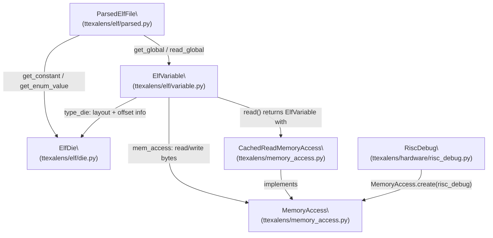
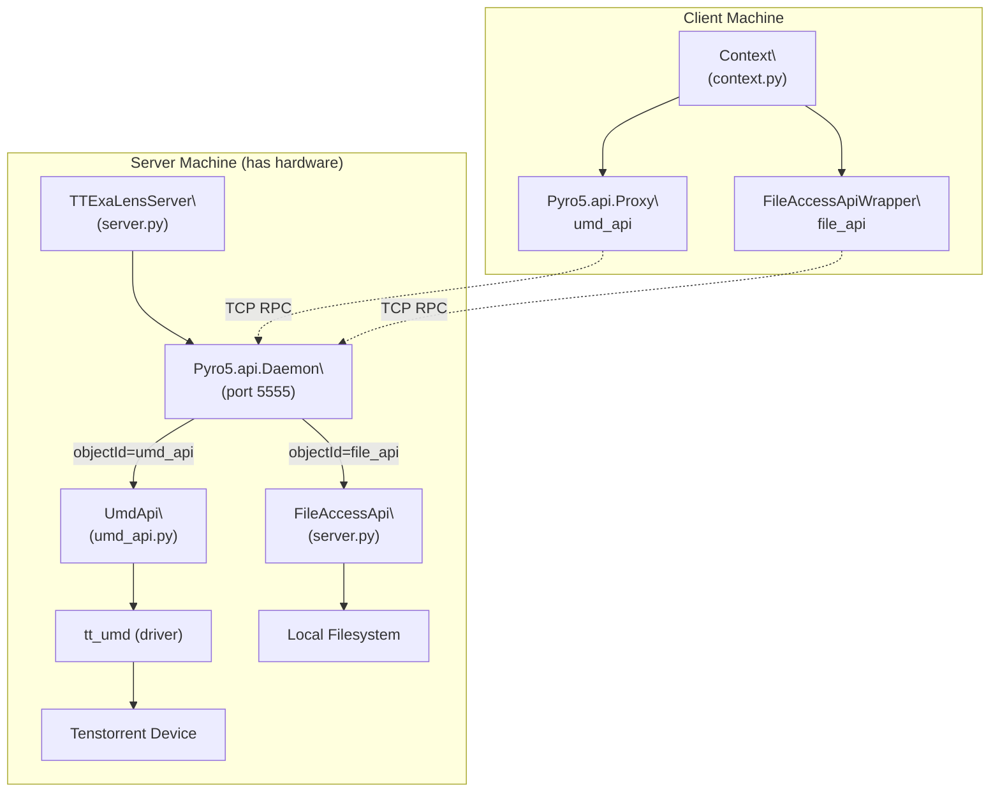

# Getting Started

Relevant source files
*   [.github/Dockerfile.ci](https://github.com/tenstorrent/tt-exalens/blob/046c35eb/.github/Dockerfile.ci)
*   [Makefile](https://github.com/tenstorrent/tt-exalens/blob/046c35eb/Makefile)
*   [README.md](https://github.com/tenstorrent/tt-exalens/blob/046c35eb/README.md?plain=1)
*   [docs/ttexalens-app-docs.md](https://github.com/tenstorrent/tt-exalens/blob/046c35eb/docs/ttexalens-app-docs.md?plain=1)
*   [docs/ttexalens-lib-docs.md](https://github.com/tenstorrent/tt-exalens/blob/046c35eb/docs/ttexalens-lib-docs.md?plain=1)
*   [scripts/create-venv.sh](https://github.com/tenstorrent/tt-exalens/blob/046c35eb/scripts/create-venv.sh)
*   [scripts/install-deps.sh](https://github.com/tenstorrent/tt-exalens/blob/046c35eb/scripts/install-deps.sh)
*   [scripts/setup-dev-env.sh](https://github.com/tenstorrent/tt-exalens/blob/046c35eb/scripts/setup-dev-env.sh)
*   [ttexalens/__init__.py](https://github.com/tenstorrent/tt-exalens/blob/046c35eb/ttexalens/__init__.py)
*   [ttexalens/coordinate.py](https://github.com/tenstorrent/tt-exalens/blob/046c35eb/ttexalens/coordinate.py)

This page covers the prerequisites, installation methods, and the minimum steps needed to start interacting with Tenstorrent hardware using TTExaLens. It is the entry point for new users.

*   For detailed coverage of each installation variant, see [Installation Options](https://deepwiki.com/tenstorrent/tt-exalens/2.1-installation-options).
*   For building from source using CMake/Make, see [Building from Source](https://deepwiki.com/tenstorrent/tt-exalens/2.2-building-from-source).
*   For practical first-use examples with the Python library and CLI, see [Quick Start Guide](https://deepwiki.com/tenstorrent/tt-exalens/2.3-quick-start-guide).

* * *

## Overview

TTExaLens is a low-level hardware debugger for Tenstorrent Wormhole, Blackhole, and Quasar devices. It exposes two user-facing interfaces:

| Interface | Entry Point | Purpose |
| --- | --- | --- |
| CLI application | `tt-exalens` command | Interactive shell for device inspection, memory access, RISC-V debugging |
| Python library | `import ttexalens` | Scripted hardware access from Python programs |

Both interfaces share the same underlying device abstraction and communication layers. For an architectural description of how these layers relate, see [System Architecture and Layers](https://deepwiki.com/tenstorrent/tt-exalens/1.1-system-architecture-and-layers).

* * *




Sources: [ttexalens/elf/variable.py:1-25](), [ttexalens/elf/parsed.py:1-30](), [ttexalens/elf/__init__.py:1-21]()

---
```




Sources: [ttexalens/server.py:41-80](), [ttexalens/umd_api.py:44-146](), [ttexalens/cli.py:7-43]()

---
```
## System Requirements

| Requirement | Details |
| --- | --- |
| OS | Linux only (`POSIX :: Linux`) |
| Python | 3.10, 3.11, 3.12, or 3.13 |
| Hardware | Tenstorrent Wormhole, Blackhole, or Quasar device |
| Build tools (source builds only) | `cmake`, `ninja-build`, `make` |
| System libraries (dev only) | `rsync`, `gdb`, `libyaml-cpp-dev` |

Sources: [pyproject.toml 1-28](https://github.com/tenstorrent/tt-exalens/blob/046c35eb/pyproject.toml#L1-L28)[scripts/setup-dev-env.sh 1-9](https://github.com/tenstorrent/tt-exalens/blob/046c35eb/scripts/setup-dev-env.sh#L1-L9)[README.md 79-84](https://github.com/tenstorrent/tt-exalens/blob/046c35eb/README.md?plain=1#L79-L84)

* * *

## Installation Paths

**Installation paths and their entry points:**

Sources: [README.md 17-51](https://github.com/tenstorrent/tt-exalens/blob/046c35eb/README.md?plain=1#L17-L51)[pyproject.toml 35-37](https://github.com/tenstorrent/tt-exalens/blob/046c35eb/pyproject.toml#L35-L37)[Makefile 39-41](https://github.com/tenstorrent/tt-exalens/blob/046c35eb/Makefile#L39-L41)

* * *

## Installing from PyPI

The simplest installation installs the latest published release:

```
pip install tt-exalens
```

To install a specific version:

```
pip install tt-exalens=="x.y.z"
```

After installation, the `tt-exalens` CLI command is available directly in your shell. The CLI entry point is registered as `ttexalens.cli:main` in [pyproject.toml 35-37](https://github.com/tenstorrent/tt-exalens/blob/046c35eb/pyproject.toml#L35-L37)

Sources: [README.md 17-23](https://github.com/tenstorrent/tt-exalens/blob/046c35eb/README.md?plain=1#L17-L23)[pyproject.toml 35-37](https://github.com/tenstorrent/tt-exalens/blob/046c35eb/pyproject.toml#L35-L37)

* * *

## Installing from GitHub

To install the current development state of the `main` branch without cloning:

```
pip install git+https://github.com/tenstorrent/tt-exalens.git
```

This installs directly from source, compiling what is needed. The same `tt-exalens` CLI command and `ttexalens` library are available after installation.

Sources: [README.md 28-31](https://github.com/tenstorrent/tt-exalens/blob/046c35eb/README.md?plain=1#L28-L31)

* * *

## Setting Up a Development Environment

For development or testing, a full source checkout is needed. The recommended approach uses the provided scripts.

**Option A — Create a dedicated virtual environment:**

`./scripts/create-venv.shsource .venv/bin/activate`
**Option B — Install into an existing environment:**

`./scripts/install-deps.sh`
The `install-deps.sh` script installs the following dependency sets in order:

| Requirements file | Purpose |
| --- | --- |
| `ttexalens/requirements.txt` | Runtime dependencies |
| `ttexalens/dev-requirements.txt` | Development dependencies |
| `test/test_requirements.txt` | Test-only dependencies |
| `wheel`, `build`, `setuptools` | Packaging tools |

The script detects whether `uv` is available and uses it in preference to plain `pip` for faster installs. See [scripts/install-deps.sh 17-23](https://github.com/tenstorrent/tt-exalens/blob/046c35eb/scripts/install-deps.sh#L17-L23) for the detection logic.

For system-level dependencies needed for full development (e.g., `libyaml-cpp-dev`, `gdb`):

`sudo apt-get install rsync gdb libyaml-cpp-dev`
Sources: [README.md 55-74](https://github.com/tenstorrent/tt-exalens/blob/046c35eb/README.md?plain=1#L55-L74)[scripts/install-deps.sh 1-39](https://github.com/tenstorrent/tt-exalens/blob/046c35eb/scripts/install-deps.sh#L1-L39)[scripts/setup-dev-env.sh 1-9](https://github.com/tenstorrent/tt-exalens/blob/046c35eb/scripts/setup-dev-env.sh#L1-L9)

* * *

## Module and Package Structure

**How package components map to source and runtime artifacts:**

Sources: [pyproject.toml 36-47](https://github.com/tenstorrent/tt-exalens/blob/046c35eb/pyproject.toml#L36-L47)[CMakeLists.txt 23-46](https://github.com/tenstorrent/tt-exalens/blob/046c35eb/CMakeLists.txt#L23-L46)[Makefile 39-41](https://github.com/tenstorrent/tt-exalens/blob/046c35eb/Makefile#L39-L41)

* * *

## First Interaction: CLI

Once installed, start the interactive CLI:

`tt-exalens`
The CLI auto-detects attached hardware and opens an interactive prompt. For remote hardware access, a server must be started on the machine with hardware attached; the client then connects to it. Both local and remote modes are covered in [CLI Modes and Navigation](https://deepwiki.com/tenstorrent/tt-exalens/4.1-cli-modes-and-navigation).

Sources: [README.md 33-44](https://github.com/tenstorrent/tt-exalens/blob/046c35eb/README.md?plain=1#L33-L44)

* * *

## First Interaction: Python Library

The library is importable as `ttexalens`. The typical entry point is `init_ttexalens` or `init_ttexalens_remote`, which return a context object used for all subsequent device operations. Detailed API usage is in [Context and Initialization](https://deepwiki.com/tenstorrent/tt-exalens/3.1-context-and-initialization) and the [Quick Start Guide](https://deepwiki.com/tenstorrent/tt-exalens/2.3-quick-start-guide).

Sources: [README.md 47-51](https://github.com/tenstorrent/tt-exalens/blob/046c35eb/README.md?plain=1#L47-L51)

* * *

## Next Steps

| Topic | Page |
| --- | --- |
| All installation variants in detail | [Installation Options](https://deepwiki.com/tenstorrent/tt-exalens/2.1-installation-options) |
| Building with CMake, SFPI toolchain, make targets | [Building from Source](https://deepwiki.com/tenstorrent/tt-exalens/2.2-building-from-source) |
| First code examples: reading memory, loading ELFs, CLI session | [Quick Start Guide](https://deepwiki.com/tenstorrent/tt-exalens/2.3-quick-start-guide) |
| Full Python library API reference | [Python Library API](https://deepwiki.com/tenstorrent/tt-exalens/3-python-library-api) |
| CLI command reference | [Command Line Interface](https://deepwiki.com/tenstorrent/tt-exalens/4-command-line-interface) |
| Architecture overview | [TTExaLens Overview](https://deepwiki.com/tenstorrent/tt-exalens/1-ttexalens-overview) |

This wiki is featured in the [repository](https://github.com/tenstorrent/tt-exalens/blob/main/README.md)

Dismiss
Refresh this wiki

Enter email to refresh
