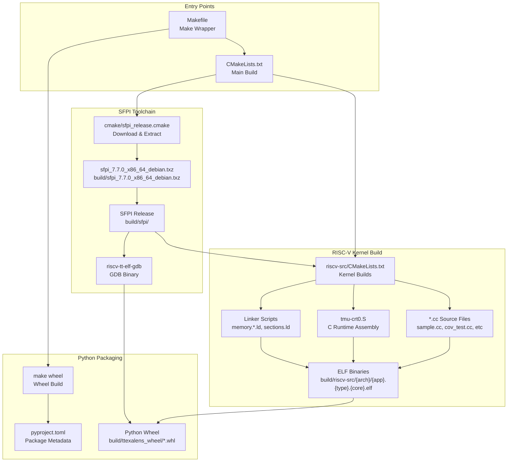
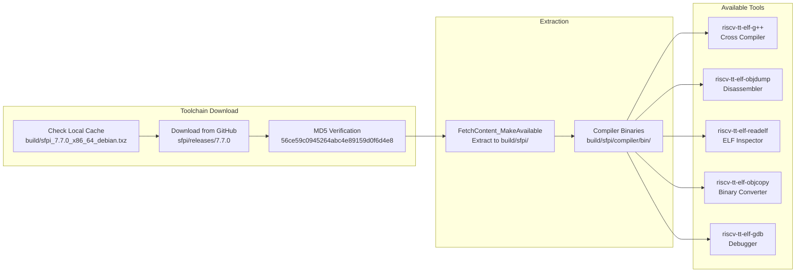
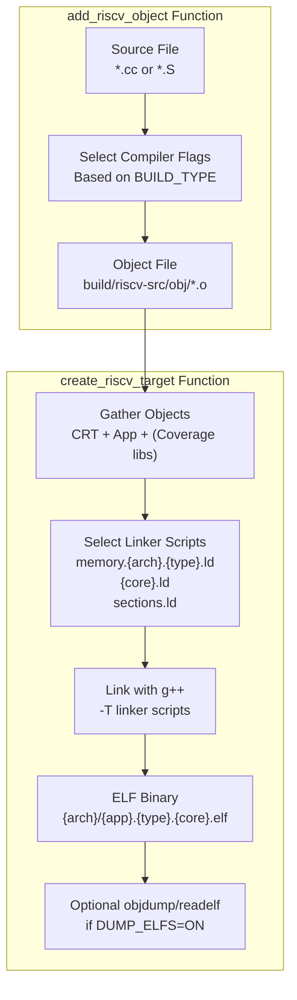
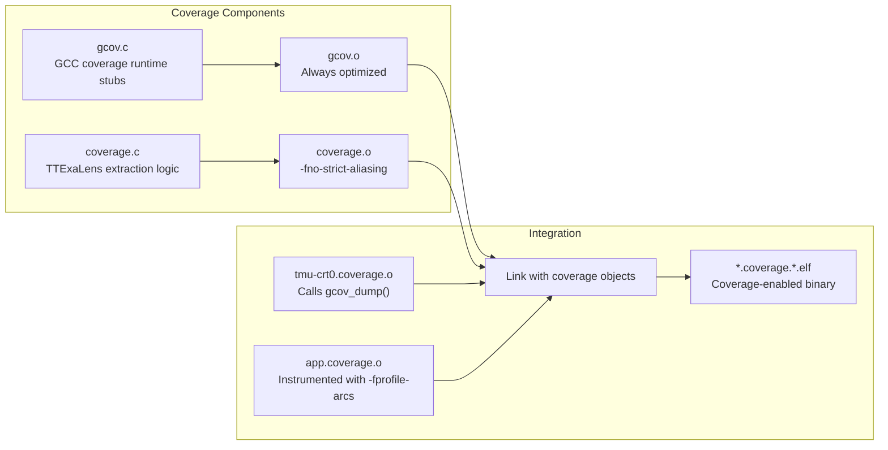
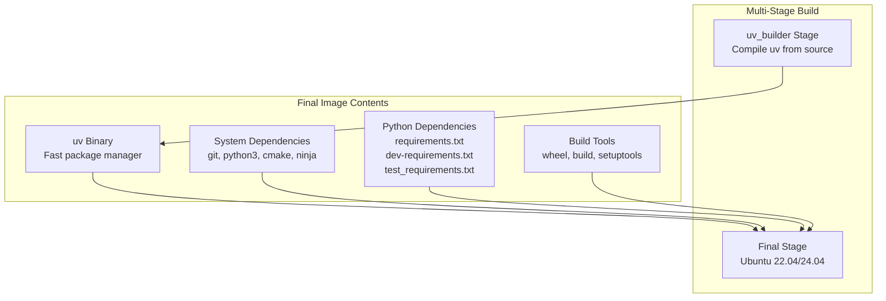
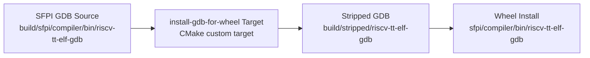

# Building from Source

Relevant source files
*   [.github/Dockerfile.ci](https://github.com/tenstorrent/tt-exalens/blob/046c35eb/.github/Dockerfile.ci)
*   [.gitignore](https://github.com/tenstorrent/tt-exalens/blob/046c35eb/.gitignore)
*   [CMakeLists.txt](https://github.com/tenstorrent/tt-exalens/blob/046c35eb/CMakeLists.txt)
*   [Makefile](https://github.com/tenstorrent/tt-exalens/blob/046c35eb/Makefile)
*   [README.md](https://github.com/tenstorrent/tt-exalens/blob/046c35eb/README.md?plain=1)
*   [cmake/sfpi_release.cmake](https://github.com/tenstorrent/tt-exalens/blob/046c35eb/cmake/sfpi_release.cmake)
*   [docs/gdb.md](https://github.com/tenstorrent/tt-exalens/blob/046c35eb/docs/gdb.md?plain=1)
*   [riscv-src/CMakeLists.txt](https://github.com/tenstorrent/tt-exalens/blob/046c35eb/riscv-src/CMakeLists.txt)
*   [scripts/create-venv.sh](https://github.com/tenstorrent/tt-exalens/blob/046c35eb/scripts/create-venv.sh)
*   [scripts/install-deps.sh](https://github.com/tenstorrent/tt-exalens/blob/046c35eb/scripts/install-deps.sh)
*   [scripts/setup-dev-env.sh](https://github.com/tenstorrent/tt-exalens/blob/046c35eb/scripts/setup-dev-env.sh)

This page documents the process of building TTExaLens from source, including the CMake build system architecture, dependency management, RISC-V kernel compilation, and Python wheel packaging. This guide is intended for developers who need to modify the codebase, contribute to the project, or understand the build process in detail.

For installation using pre-built packages, see [Installation Options](https://deepwiki.com/tenstorrent/tt-exalens/2.1-installation-options). For information about the testing infrastructure that relies on this build system, see [Build System Architecture](https://deepwiki.com/tenstorrent/tt-exalens/8.1-build-system-architecture).

* * *

## Prerequisites

### System Dependencies

The following system packages are required to build TTExaLens:

| Dependency | Purpose |
| --- | --- |
| `cmake` (≥3.22) | Build system generator |
| `ninja-build` | Fast parallel build tool |
| `python3` | Python interpreter |
| `python3-pip` | Python package manager |
| `git` | Version control for cloning repository |

Optional dependencies:

*   `ccache` - Compiler cache to speed up rebuilds (automatically detected and used if available)

Sources: [CMakeLists.txt 1](https://github.com/tenstorrent/tt-exalens/blob/046c35eb/CMakeLists.txt#L1-L1)[riscv-src/CMakeLists.txt 1](https://github.com/tenstorrent/tt-exalens/blob/046c35eb/riscv-src/CMakeLists.txt#L1-L1)[.github/Dockerfile.ci 25-32](https://github.com/tenstorrent/tt-exalens/blob/046c35eb/.github/Dockerfile.ci#L25-L32)

### Python Dependencies

Python dependencies are managed through multiple requirements files:

*   **Runtime dependencies**: [ttexalens/requirements.txt 1-16](https://github.com/tenstorrent/tt-exalens/blob/046c35eb/ttexalens/requirements.txt#L1-L16) - Includes `tt-umd`, `Pyro5`, `pyelftools`, etc.
*   **Development dependencies**: `ttexalens/dev-requirements.txt` - Includes `mypy`, `pre-commit`
*   **Test dependencies**: `test/test_requirements.txt` - Includes `pytest` and test utilities

The [scripts/install-deps.sh 1-39](https://github.com/tenstorrent/tt-exalens/blob/046c35eb/scripts/install-deps.sh#L1-L39) script automates installation of all dependencies:

`./scripts/install-deps.sh`
This script automatically detects and uses `uv` (Astral UV package manager) for faster installations if available, falling back to standard `pip` otherwise.

Sources: [scripts/install-deps.sh 16-35](https://github.com/tenstorrent/tt-exalens/blob/046c35eb/scripts/install-deps.sh#L16-L35)[ttexalens/requirements.txt 1-16](https://github.com/tenstorrent/tt-exalens/blob/046c35eb/ttexalens/requirements.txt#L1-L16)

* * *

## Build System Architecture

The TTExaLens build system is organized as a multi-component CMake project with a Make wrapper for convenience.

### Build System Components

**Build System Overview**: The build system consists of three main stages: (1) SFPI toolchain download and extraction, (2) RISC-V kernel compilation for test applications, and (3) Python wheel packaging. The Make wrapper provides convenient high-level targets, while CMake handles the detailed build orchestration.

Sources: [CMakeLists.txt 1-47](https://github.com/tenstorrent/tt-exalens/blob/046c35eb/CMakeLists.txt#L1-L47)[Makefile 1-46](https://github.com/tenstorrent/tt-exalens/blob/046c35eb/Makefile#L1-L46)[cmake/sfpi_release.cmake 1-36](https://github.com/tenstorrent/tt-exalens/blob/046c35eb/cmake/sfpi_release.cmake#L1-L36)




**Build System Overview**: The build system consists of three main stages: (1) SFPI toolchain download and extraction, (2) RISC-V kernel compilation for test applications, and (3) Python wheel packaging. The Make wrapper provides convenient high-level targets, while CMake handles the detailed build orchestration.

Sources: [CMakeLists.txt:1-47](), [Makefile:1-46](), [cmake/sfpi_release.cmake:1-36]()
```
### SFPI Toolchain Management

The SFPI (Scalar Floating Point Instruction) toolchain provides the RISC-V cross-compilation tools required to build firmware for Tenstorrent hardware.

**SFPI Toolchain Lifecycle**: The build system first checks for a cached SFPI archive in `build/`. If not found, it downloads version 7.7.0 from GitHub releases and verifies the MD5 hash. The archive is then extracted to `build/sfpi/` using CMake's `FetchContent` mechanism.

The toolchain provides five essential RISC-V cross-compilation tools:

*   **riscv-tt-elf-g++**: Cross-compiler for RISC-V with Tenstorrent extensions
*   **riscv-tt-elf-objdump**: Disassembles and dumps ELF files
*   **riscv-tt-elf-readelf**: Inspects ELF headers and sections
*   **riscv-tt-elf-objcopy**: Converts between binary formats
*   **riscv-tt-elf-gdb**: Debugger for RISC-V cores (packaged with wheel)

Sources: [cmake/sfpi_release.cmake 1-36](https://github.com/tenstorrent/tt-exalens/blob/046c35eb/cmake/sfpi_release.cmake#L1-L36)[riscv-src/CMakeLists.txt 8-13](https://github.com/tenstorrent/tt-exalens/blob/046c35eb/riscv-src/CMakeLists.txt#L8-L13)[CMakeLists.txt 24-46](https://github.com/tenstorrent/tt-exalens/blob/046c35eb/CMakeLists.txt#L24-L46)

* * *




**SFPI Toolchain Lifecycle**: The build system first checks for a cached SFPI archive in `build/`. If not found, it downloads version 7.7.0 from GitHub releases and verifies the MD5 hash. The archive is then extracted to `build/sfpi/` using CMake's `FetchContent` mechanism.

The toolchain provides five essential RISC-V cross-compilation tools:
- **riscv-tt-elf-g++**: Cross-compiler for RISC-V with Tenstorrent extensions
- **riscv-tt-elf-objdump**: Disassembles and dumps ELF files
- **riscv-tt-elf-readelf**: Inspects ELF headers and sections
- **riscv-tt-elf-objcopy**: Converts between binary formats
- **riscv-tt-elf-gdb**: Debugger for RISC-V cores (packaged with wheel)

Sources: [cmake/sfpi_release.cmake:1-36](), [riscv-src/CMakeLists.txt:8-13](), [CMakeLists.txt:24-46]()

---
```
## Building the Project

### Quick Build

The simplest way to build the entire project:

`make`
This executes the default `build` target which:

1.   Configures CMake with Ninja generator
2.   Downloads/extracts SFPI toolchain if needed
3.   Compiles all RISC-V test kernels
4.   Copies GDB binary for wheel packaging

Sources: [Makefile 4-17](https://github.com/tenstorrent/tt-exalens/blob/046c35eb/Makefile#L4-L17)[README.md 87-99](https://github.com/tenstorrent/tt-exalens/blob/046c35eb/README.md?plain=1#L87-L99)

### Step-by-Step Build Process

For more control over the build process:

`# 1. Configure CMake buildcmake -B build -G Ninja # 2. Build all targetsninja -C build # 3. (Optional) Build Python wheelpip wheel --no-deps --no-cache-dir . --wheel-dir build/ttexalens_wheel`
With `ccache` enabled for faster rebuilds:

`cmake -B build -G Ninja \    -DCMAKE_C_COMPILER_LAUNCHER=ccache \    -DCMAKE_CXX_COMPILER_LAUNCHER=ccacheninja -C build`
Sources: [Makefile 5-17](https://github.com/tenstorrent/tt-exalens/blob/046c35eb/Makefile#L5-L17)

### Build Targets

| Target | Command | Description |
| --- | --- | --- |
| `build` (default) | `make` or `make build` | Build all RISC-V kernels and prepare GDB binary |
| `clean` | `make clean` | Remove `build/` directory |
| `test` | `make test` | Build, install dependencies, and run all tests |
| `wheel` | `make wheel` | Build Python wheel package |
| `mypy` | `make mypy` | Run static type checking |
| `docs` | `make docs` | Generate library documentation |
| `dump_elfs` | `make dump_elfs` | Build with objdump/readelf output |

Sources: [Makefile 1-46](https://github.com/tenstorrent/tt-exalens/blob/046c35eb/Makefile#L1-L46)

* * *

## RISC-V Kernel Compilation

The build system compiles test applications for multiple architectures, cores, and build configurations.

### Compilation Matrix

**Build Matrix**: TTExaLens compiles 6 test applications for 2 architectures (Wormhole, Blackhole), 8 core types, and 3 build configurations, resulting in approximately 288 ELF binaries. Not all combinations are valid (e.g., Wormhole doesn't have `erisc0`/`erisc1`).

Sources: [riscv-src/CMakeLists.txt 34-37](https://github.com/tenstorrent/tt-exalens/blob/046c35eb/riscv-src/CMakeLists.txt#L34-L37)

```mermaid
graph TB
    subgraph "Architectures"
        Wormhole["wormhole"]
        Blackhole["blackhole"]
    end
    
    subgraph "Applications"
        Sample["sample.cc<br/>Example program"]
        RunElfTest["run_elf_test.cc<br/>ELF loading test"]
        Callstack["callstack.cc<br/>Stack unwinding test"]
        CovTest["cov_test.cc<br/>Coverage test"]
        GlobalsTest["globals_test.cc<br/>Global variable test"]
        EdgeMemTest["edge_mem_test.cc<br/>Memory boundary test"]
    end
    
    subgraph "Core Types"
        Brisc["brisc<br/>Binary RISC"]
        Trisc0["trisc0<br/>Tensor RISC 0"]
        Trisc1["trisc1<br/>Tensor RISC 1"]
        Trisc2["trisc2<br/>Tensor RISC 2"]
        Ncrisc["ncrisc<br/>Network RISC"]
        Erisc["erisc<br/>Ethernet RISC (WH)"]
        Erisc0["erisc0<br/>Ethernet RISC 0 (BH)"]
        Erisc1["erisc1<br/>Ethernet RISC 1 (BH)"]
    end
    
    subgraph "Build Types"
        Debug["debug<br/>-O0, full symbols"]
        Release["release<br/>-O3, optimized"]
        Coverage["coverage<br/>-O0, gcov instrumentation"]
    end
    
    Wormhole -.-> Brisc
    Wormhole -.-> Trisc0
    Wormhole -.-> Erisc
    Blackhole -.-> Brisc
    Blackhole -.-> Erisc0
    Blackhole -.-> Erisc1
    
    Sample -.-> Debug
    Sample -.-> Release
    Sample -.-> Coverage
```




**Build Matrix**: TTExaLens compiles 6 test applications for 2 architectures (Wormhole, Blackhole), 8 core types, and 3 build configurations, resulting in approximately 288 ELF binaries. Not all combinations are valid (e.g., Wormhole doesn't have `erisc0`/`erisc1`).

Sources: [riscv-src/CMakeLists.txt:34-37]()
```
### Compiler Configuration

Three build types with distinct compiler flags:

#### Debug Build

```
-O0 -mtune=rvtt-b1 -mabi=ilp32 -std=c++17 -g -flto -ffast-math
-fno-use-cxa-atexit -fno-exceptions -Wall -Werror
```

Used for: Development, testing, debugging with full symbol information

#### Release Build

```
-O3 -mabi=ilp32 -std=c++17 -g -ffast-math -flto
-fno-use-cxa-atexit -Wall -fno-exceptions -fno-rtti -Werror
```

Used for: Production, performance testing, size optimization

#### Coverage Build

```
Debug flags + 
-fprofile-arcs -ftest-coverage -fprofile-info-section -DCOVERAGE
```

Used for: Code coverage analysis with gcov

Key flags:

*   `-mabi=ilp32`: RISC-V 32-bit integer ABI
*   `-flto`: Link-time optimization
*   `-fprofile-info-section`: Embeds coverage data structure pointers in ELF (avoids runtime dependencies)
*   `-nostartfiles`: No standard C runtime (bare metal)

Sources: [riscv-src/CMakeLists.txt 15-28](https://github.com/tenstorrent/tt-exalens/blob/046c35eb/riscv-src/CMakeLists.txt#L15-L28)

### Build Function Implementation

**Compilation Pipeline**: The build system uses two CMake functions to manage compilation. `add_riscv_object` compiles individual source files to object files with configuration-specific flags. `create_riscv_target` links object files with architecture-specific linker scripts to produce final ELF binaries.

The `create_riscv_target` function at [riscv-src/CMakeLists.txt 92-150](https://github.com/tenstorrent/tt-exalens/blob/046c35eb/riscv-src/CMakeLists.txt#L92-L150) performs:

1.   Selects compiler and linker options based on `BUILD_TYPE` (debug/release/coverage)
2.   Gathers required object files: CRT (`tmu-crt0.{type}.o`), application object, and optionally coverage libraries
3.   Resolves linker scripts: 
    *   `memory.{arch}.{type}.ld` - Memory layout for architecture and build type
    *   `{core}.ld` - Core-specific memory regions
    *   `sections.ld` - Common section definitions

4.   Invokes `riscv-tt-elf-g++` with `-T` flags to link objects
5.   Optionally generates disassembly and DWARF dumps if `DUMP_ELFS=ON`

Sources: [riscv-src/CMakeLists.txt 42-150](https://github.com/tenstorrent/tt-exalens/blob/046c35eb/riscv-src/CMakeLists.txt#L42-L150)




**Compilation Pipeline**: The build system uses two CMake functions to manage compilation. `add_riscv_object` compiles individual source files to object files with configuration-specific flags. `create_riscv_target` links object files with architecture-specific linker scripts to produce final ELF binaries.

The `create_riscv_target` function at [riscv-src/CMakeLists.txt:92-150]() performs:
1. Selects compiler and linker options based on `BUILD_TYPE` (debug/release/coverage)
2. Gathers required object files: CRT (`tmu-crt0.{type}.o`), application object, and optionally coverage libraries
3. Resolves linker scripts:
   - `memory.{arch}.{type}.ld` - Memory layout for architecture and build type
   - `{core}.ld` - Core-specific memory regions
   - `sections.ld` - Common section definitions
4. Invokes `riscv-tt-elf-g++` with `-T` flags to link objects
5. Optionally generates disassembly and DWARF dumps if `DUMP_ELFS=ON`

Sources: [riscv-src/CMakeLists.txt:42-150]()
```
### Coverage Library Compilation

The coverage subsystem requires special handling:

**Coverage Build**: Coverage builds link two additional libraries: `gcov.o` provides GCC coverage runtime stubs, and `coverage.o` contains TTExaLens-specific extraction logic. Both are compiled with optimization (`-O3`) to minimize overhead. The `coverage.c` file is compiled with `-fno-strict-aliasing` due to pointer aliasing tricks used to access coverage data structures.

The C runtime for coverage builds (`tmu-crt0.coverage.o`) includes a call to `gcov_dump()` which extracts coverage counters before the program exits. This enables coverage analysis without host filesystem support.

Sources: [riscv-src/CMakeLists.txt 61-82](https://github.com/tenstorrent/tt-exalens/blob/046c35eb/riscv-src/CMakeLists.txt#L61-L82)[riscv-src/CMakeLists.txt 108-115](https://github.com/tenstorrent/tt-exalens/blob/046c35eb/riscv-src/CMakeLists.txt#L108-L115)




**Coverage Build**: Coverage builds link two additional libraries: `gcov.o` provides GCC coverage runtime stubs, and `coverage.o` contains TTExaLens-specific extraction logic. Both are compiled with optimization (`-O3`) to minimize overhead. The `coverage.c` file is compiled with `-fno-strict-aliasing` due to pointer aliasing tricks used to access coverage data structures.

The C runtime for coverage builds (`tmu-crt0.coverage.o`) includes a call to `gcov_dump()` which extracts coverage counters before the program exits. This enables coverage analysis without host filesystem support.

Sources: [riscv-src/CMakeLists.txt:61-82](), [riscv-src/CMakeLists.txt:108-115]()
```
### Linker Script Selection

Each ELF requires three linker scripts:

| Script Type | Example | Purpose |
| --- | --- | --- |
| Memory Layout | `memory.wormhole.debug.ld` | Defines available memory regions for architecture and build type |
| Core Mapping | `brisc.ld` | Maps sections to core-specific memory regions |
| Section Definitions | `sections.ld` | Defines standard ELF sections (`.text`, `.data`, `.bss`, etc.) |

Key differences by build type:

*   **Debug**: Larger memory allocations for debug symbols and unoptimized code
*   **Release**: Optimized memory layout for production
*   **Coverage**: Uses debug linker scripts to accommodate instrumentation overhead

Sources: [riscv-src/CMakeLists.txt 108-129](https://github.com/tenstorrent/tt-exalens/blob/046c35eb/riscv-src/CMakeLists.txt#L108-L129)

* * *

## Build Artifacts

### Output Directory Structure

```
build/
├── sfpi/                                    # SFPI toolchain
│   └── compiler/
│       └── bin/
│           └── riscv-tt-elf-gdb            # GDB binary
├── stripped/
│   └── riscv-tt-elf-gdb                    # Stripped GDB (for wheel)
├── riscv-src/
│   ├── obj/                                # Object files
│   │   ├── tmu-crt0.{type}.o
│   │   ├── {app}.{type}.o
│   │   ├── gcov.o
│   │   └── coverage.o
│   ├── wormhole/                           # Wormhole ELFs
│   │   ├── sample.debug.brisc.elf
│   │   ├── sample.release.brisc.elf
│   │   ├── sample.coverage.brisc.elf
│   │   └── ...
│   └── blackhole/                          # Blackhole ELFs
│       └── ...
└── ttexalens_wheel/                        # Python wheel
    └── tt_exalens-{version}-py3-none-any.whl
```

Sources: [riscv-src/CMakeLists.txt 30-32](https://github.com/tenstorrent/tt-exalens/blob/046c35eb/riscv-src/CMakeLists.txt#L30-L32)[CMakeLists.txt 24-26](https://github.com/tenstorrent/tt-exalens/blob/046c35eb/CMakeLists.txt#L24-L26)

### ELF Naming Convention

ELF binaries follow the pattern: `{app}.{build_type}.{core}.elf`

Examples:

*   `sample.debug.brisc.elf` - Sample app, debug build, BRISC core
*   `cov_test.coverage.ncrisc.elf` - Coverage test, coverage build, NCRISC core
*   `globals_test.release.trisc0.elf` - Globals test, release build, TRISC0 core

Sources: [riscv-src/CMakeLists.txt 99](https://github.com/tenstorrent/tt-exalens/blob/046c35eb/riscv-src/CMakeLists.txt#L99-L99)

* * *

## Advanced Build Options

### CMake Options

| Option | Default | Description |
| --- | --- | --- |
| `BUILD_PYTHON_WHEEL` | `OFF` | Skip RISC-V builds, only download SFPI |
| `STRIP_SYMBOLS` | `OFF` | Strip symbols from GDB binary to reduce size |
| `DUMP_ELFS` | `OFF` | Generate objdump and readelf output |
| `CMAKE_C_COMPILER_LAUNCHER` | (unset) | Use ccache if available |
| `CMAKE_CXX_COMPILER_LAUNCHER` | (unset) | Use ccache if available |

Usage:

`cmake -B build -DBUILD_PYTHON_WHEEL=ON -DSTRIP_SYMBOLS=ON`
Sources: [CMakeLists.txt 12-39](https://github.com/tenstorrent/tt-exalens/blob/046c35eb/CMakeLists.txt#L12-L39)[riscv-src/CMakeLists.txt 6](https://github.com/tenstorrent/tt-exalens/blob/046c35eb/riscv-src/CMakeLists.txt#L6-L6)

### Wheel-Only Build

For CI/CD or when RISC-V kernels are not needed:

`cmake -B build -DBUILD_PYTHON_WHEEL=ONninja -C build`
This skips RISC-V compilation and only downloads/extracts the SFPI toolchain to obtain the GDB binary for packaging.

Sources: [CMakeLists.txt 18-21](https://github.com/tenstorrent/tt-exalens/blob/046c35eb/CMakeLists.txt#L18-L21)[CMakeLists.txt 42-46](https://github.com/tenstorrent/tt-exalens/blob/046c35eb/CMakeLists.txt#L42-L46)

### Dump ELF Information

Generate disassembly and DWARF debug information:

`make dump_elfs# orDUMP_ELFS=ON make`
This creates `.objdump` and `.dwarf` files alongside each ELF:

*   `.objdump` - Disassembly, hex dump, and sorted symbol table
*   `.dwarf` - Complete DWARF debug information dump

Sources: [Makefile 19-20](https://github.com/tenstorrent/tt-exalens/blob/046c35eb/Makefile#L19-L20)[riscv-src/CMakeLists.txt 135-148](https://github.com/tenstorrent/tt-exalens/blob/046c35eb/riscv-src/CMakeLists.txt#L135-L148)

### Custom Build Directory

`BUILD_DIR=my_build make`
Changes the build output directory from `build/` to `my_build/`.

Sources: [Makefile 1](https://github.com/tenstorrent/tt-exalens/blob/046c35eb/Makefile#L1-L1)

### Parallel Build Control

Ninja automatically uses all CPU cores. To limit parallelism:

`ninja -C build -j 4  # Use 4 cores`

* * *

## Docker-Based Build

The CI/CD pipeline uses Docker containers for reproducible builds across Ubuntu 22.04 and 24.04.

### Dockerfile Architecture

**Docker Build Strategy**: The Dockerfile uses a multi-stage build to compile the `uv` package manager from source, then copies it to the final image. The final image removes Python's `EXTERNALLY-MANAGED` marker to allow system-wide pip installations. All Python dependencies are installed using `uv pip` for speed.

Building the Docker image:

`docker build -t ttexalens-ci \    --build-arg UBUNTU_VERSION=22.04 \    -f .github/Dockerfile.ci .`
Building TTExaLens inside the container:

`docker run --rm -v $(pwd):/workspace -w /workspace ttexalens-ci \    bash -c "make clean && make"`
Sources: [.github/Dockerfile.ci 1-42](https://github.com/tenstorrent/tt-exalens/blob/046c35eb/.github/Dockerfile.ci#L1-L42)

* * *




**Docker Build Strategy**: The Dockerfile uses a multi-stage build to compile the `uv` package manager from source, then copies it to the final image. The final image removes Python's `EXTERNALLY-MANAGED` marker to allow system-wide pip installations. All Python dependencies are installed using `uv pip` for speed.

Building the Docker image:
```bash
docker build -t ttexalens-ci \
    --build-arg UBUNTU_VERSION=22.04 \
    -f .github/Dockerfile.ci .
```

Building TTExaLens inside the container:
```bash
docker run --rm -v $(pwd):/workspace -w /workspace ttexalens-ci \
    bash -c "make clean && make"
```

Sources: [.github/Dockerfile.ci:1-42]()

---
```
## Build System Integration Points

### Virtual Environment Setup

The [scripts/create-venv.sh 1-23](https://github.com/tenstorrent/tt-exalens/blob/046c35eb/scripts/create-venv.sh#L1-L23) script automates virtual environment creation:

`./scripts/create-venv.sh`
This creates `.venv/`, installs pip, and runs `install-deps.sh` to set up a complete development environment.

Sources: [scripts/create-venv.sh 1-23](https://github.com/tenstorrent/tt-exalens/blob/046c35eb/scripts/create-venv.sh#L1-L23)[README.md 56-67](https://github.com/tenstorrent/tt-exalens/blob/046c35eb/README.md?plain=1#L56-L67)

### Test Integration

The `make test` target coordinates the full test workflow:

`make test`
This executes [test/run_all.sh](https://github.com/tenstorrent/tt-exalens/blob/046c35eb/test/run_all.sh) which:

1.   Builds RISC-V kernels (`make build`)
2.   Installs runtime and test dependencies
3.   Runs library tests (`pytest test/ttexalens`)
4.   Runs CLI tests (`pytest test/app`)
5.   Builds Python wheel
6.   Runs wheel installation tests

Sources: [Makefile 26-32](https://github.com/tenstorrent/tt-exalens/blob/046c35eb/Makefile#L26-L32)[README.md 86-112](https://github.com/tenstorrent/tt-exalens/blob/046c35eb/README.md?plain=1#L86-L112)

### GDB Binary Packaging




**GDB Packaging**: The `install-gdb-for-wheel` target copies the GDB binary from the SFPI toolchain to `build/stripped/`. If `STRIP_SYMBOLS=ON`, it strips debug symbols to reduce size (~90MB → ~15MB). When building a Python wheel, CMake installs this binary to the wheel's `sfpi/compiler/bin/` directory.

Sources: [CMakeLists.txt:23-46]()
1d:T3bf5,
```

The build system includes a custom target to prepare the GDB binary for wheel packaging:

**GDB Packaging**: The `install-gdb-for-wheel` target copies the GDB binary from the SFPI toolchain to `build/stripped/`. If `STRIP_SYMBOLS=ON`, it strips debug symbols to reduce size (~90MB → ~15MB). When building a Python wheel, CMake installs this binary to the wheel's `sfpi/compiler/bin/` directory.

Sources: [CMakeLists.txt 23-46](https://github.com/tenstorrent/tt-exalens/blob/046c35eb/CMakeLists.txt#L23-L46)

This wiki is featured in the [repository](https://github.com/tenstorrent/tt-exalens/blob/main/README.md)

Dismiss
Refresh this wiki

Enter email to refresh
