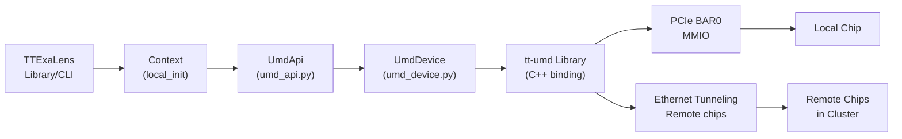
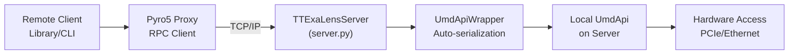

# Quick Start Guide

Relevant source files
*   [.github/Dockerfile.ci](https://github.com/tenstorrent/tt-exalens/blob/046c35eb/.github/Dockerfile.ci)
*   [Makefile](https://github.com/tenstorrent/tt-exalens/blob/046c35eb/Makefile)
*   [README.md](https://github.com/tenstorrent/tt-exalens/blob/046c35eb/README.md?plain=1)
*   [docs/ttexalens-app-docs.md](https://github.com/tenstorrent/tt-exalens/blob/046c35eb/docs/ttexalens-app-docs.md?plain=1)
*   [docs/ttexalens-lib-docs.md](https://github.com/tenstorrent/tt-exalens/blob/046c35eb/docs/ttexalens-lib-docs.md?plain=1)
*   [scripts/create-venv.sh](https://github.com/tenstorrent/tt-exalens/blob/046c35eb/scripts/create-venv.sh)
*   [scripts/install-deps.sh](https://github.com/tenstorrent/tt-exalens/blob/046c35eb/scripts/install-deps.sh)
*   [scripts/setup-dev-env.sh](https://github.com/tenstorrent/tt-exalens/blob/046c35eb/scripts/setup-dev-env.sh)
*   [test/app/test_umd_ttexalens.py](https://github.com/tenstorrent/tt-exalens/blob/046c35eb/test/app/test_umd_ttexalens.py)
*   [test/ttexalens/unit_tests/program_writer.py](https://github.com/tenstorrent/tt-exalens/blob/046c35eb/test/ttexalens/unit_tests/program_writer.py)
*   [test/ttexalens/unit_tests/test_base.py](https://github.com/tenstorrent/tt-exalens/blob/046c35eb/test/ttexalens/unit_tests/test_base.py)
*   [test/ttexalens/unit_tests/test_l1_mem_access.py](https://github.com/tenstorrent/tt-exalens/blob/046c35eb/test/ttexalens/unit_tests/test_l1_mem_access.py)
*   [test/ttexalens/unit_tests/test_noc_failover.py](https://github.com/tenstorrent/tt-exalens/blob/046c35eb/test/ttexalens/unit_tests/test_noc_failover.py)
*   [ttexalens/__init__.py](https://github.com/tenstorrent/tt-exalens/blob/046c35eb/ttexalens/__init__.py)
*   [ttexalens/context.py](https://github.com/tenstorrent/tt-exalens/blob/046c35eb/ttexalens/context.py)
*   [ttexalens/coordinate.py](https://github.com/tenstorrent/tt-exalens/blob/046c35eb/ttexalens/coordinate.py)
*   [ttexalens/tt_exalens_init.py](https://github.com/tenstorrent/tt-exalens/blob/046c35eb/ttexalens/tt_exalens_init.py)

This guide demonstrates the most common TTExaLens workflows for both CLI and Python library usage. For installation instructions, see [Installation Options](https://deepwiki.com/tenstorrent/tt-exalens/2.1-installation-options). For building from source, see [Building from Source](https://deepwiki.com/tenstorrent/tt-exalens/2.2-building-from-source).

* * *

## CLI Usage

### Local Mode

Run the CLI to access locally-attached devices:

`# Start interactive CLItt-exalens # Execute specific commandstt-exalens --commands "device; brxy 0,0 0x100 16" # Use NOC1 instead of NOC0tt-exalens --use-noc1 # Use JTAG interfacett-exalens --jtag`
The CLI provides an interactive shell with auto-completion and help. Type `help` to see available commands or `<command> --help` for command-specific help.

**Sources:**[ttexalens/cli.py 1-42](https://github.com/tenstorrent/tt-exalens/blob/046c35eb/ttexalens/cli.py#L1-L42)[README.md 35-45](https://github.com/tenstorrent/tt-exalens/blob/046c35eb/README.md?plain=1#L35-L45)




**Capabilities:**
- Direct MMIO access for local chips via PCIe
- Ethernet NOC tunneling for remote chips in cluster
- Full speed, no network overhead

**Initialization:** `init_ttexalens()`
```
### Remote Mode

For debugging devices on remote machines, start a server on the machine with hardware access:

`# On remote machine with hardwarett-exalens --server --port 5555 # Or run server in backgroundtt-exalens --server --port 5555 --background`
Then connect from your local machine:

`# Connect to remote servertt-exalens --remote --remote-address 192.168.1.100:5555 # Execute commands on remote devicett-exalens --remote --remote-address 192.168.1.100:5555 --commands "device"`
**Remote Access Architecture**

**Sources:**[ttexalens/cli.py 7-42](https://github.com/tenstorrent/tt-exalens/blob/046c35eb/ttexalens/cli.py#L7-L42)[ttexalens/server.py 221-230](https://github.com/tenstorrent/tt-exalens/blob/046c35eb/ttexalens/server.py#L221-L230)

* * *




**Capabilities:**
- Access hardware from any network location
- Multiple concurrent clients
- Automatic object serialization via Pyro5
- Same API as local mode

**Initialization:** 
- Server: `tt-exalens --server` or programmatic via `TTExaLensServer`
- Client: `init_ttexalens_remote(ip_address, port)`
```
## Python Library Usage

### Local Initialization

Import and initialize TTExaLens to access locally-attached devices:

`import ttexalens as lib # Initialize with default settings (NOC0, 4B mode enabled)context = lib.init_ttexalens() # Initialize with NOC1context = lib.init_ttexalens(use_noc1=True) # Initialize JTAG interfacecontext = lib.init_ttexalens(init_jtag=True)`
The returned `Context` object manages device connections. Most library functions accept an optional `context` parameter; if omitted, they use a global context that is automatically initialized on first use.

**Sources:**[ttexalens/tt_exalens_init.py](https://github.com/tenstorrent/tt-exalens/blob/046c35eb/ttexalens/tt_exalens_init.py)[docs/ttexalens-lib-docs.md 1-26](https://github.com/tenstorrent/tt-exalens/blob/046c35eb/docs/ttexalens-lib-docs.md?plain=1#L1-L26)

### Remote Initialization

Connect to a TTExaLens server running on a remote machine:

`import ttexalens as lib # Connect to remote servercontext = lib.init_ttexalens_remote(    ip_address="192.168.1.100",    port=5555) # Use remote context for operationsdata = lib.read_from_device("0,0", 0x100, context=context)`
The server must be started separately using `tt-exalens --server` on the machine with hardware access.

**Initialization Flow**

**Sources:**[ttexalens/tt_exalens_init.py](https://github.com/tenstorrent/tt-exalens/blob/046c35eb/ttexalens/tt_exalens_init.py)[ttexalens/umd_api.py 60-145](https://github.com/tenstorrent/tt-exalens/blob/046c35eb/ttexalens/umd_api.py#L60-L145)[ttexalens/server.py 221-278](https://github.com/tenstorrent/tt-exalens/blob/046c35eb/ttexalens/server.py#L221-L278)[test/ttexalens/unit_tests/test_ttexalens_init.py 21-46](https://github.com/tenstorrent/tt-exalens/blob/046c35eb/test/ttexalens/unit_tests/test_ttexalens_init.py#L21-L46)

### Coordinate Formats

TTExaLens supports multiple coordinate formats for addressing hardware locations:

| Format | Separator | Example | Usage |
| --- | --- | --- | --- |
| Logical | Comma | `"0,0"` | Tensix cores (default) |
| Logical DRAM | Comma with prefix | `"d0,0"` | DRAM cores |
| Logical Ethernet | Comma with prefix | `"e0,0"` | Ethernet cores |
| DRAM Channel | `ch` prefix | `"ch0"` | DRAM by channel |
| NOC0 | Hyphen | `"1-2"` | Physical NOC coordinates |
| Translated | Hyphen | `"18-18"` | Hardware-translated coordinates |
`import ttexalens as lib # All of these are valid location specifications:lib.read_from_device("0,0", 0x100)      # Logical tensixlib.read_from_device("d0,0", 0x100)     # Logical DRAMlib.read_from_device("ch0", 0x1000)     # DRAM channellib.read_from_device("1-2", 0x100)      # NOC0 coordinates`
Most library functions accept location strings and automatically convert them to `OnChipCoordinate` objects internally. For details on coordinate systems, see [Coordinate Systems and Memory Addressing](https://deepwiki.com/tenstorrent/tt-exalens/1.2-coordinate-systems-and-memory-addressing).

**Sources:**[ttexalens/coordinate.py 269-325](https://github.com/tenstorrent/tt-exalens/blob/046c35eb/ttexalens/coordinate.py#L269-L325)[ttexalens/tt_exalens_lib.py 100-122](https://github.com/tenstorrent/tt-exalens/blob/046c35eb/ttexalens/tt_exalens_lib.py#L100-L122)

* * *

## Common Workflows

### Reading and Writing Memory

**CLI:**

`# Read 16 words from address 0x100 at core 0,0tt-exalens --commands "brxy 0,0 0x100 16" # Read from DRAM channel 0tt-exalens --commands "brxy ch0 0x1000 32"`
**Python:**

`import ttexalens as lib # Read bytesdata = lib.read_from_device("0,0", addr=0x100, num_bytes=64) # Read wordswords = lib.read_words_from_device("0,0", addr=0x100, word_count=16) # Write byteslib.write_to_device("0,0", addr=0x100, data=b'\x01\x02\x03\x04') # Write wordslib.write_words_to_device("0,0", addr=0x100, data=[0xDEADBEEF, 0xCAFEBABE])`
The `safe_mode=True` parameter (default) validates memory accesses against known safe regions. Set to `False` to bypass validation for advanced use cases.

**Memory Access Flow**

**Sources:**[ttexalens/tt_exalens_lib.py 174-280](https://github.com/tenstorrent/tt-exalens/blob/046c35eb/ttexalens/tt_exalens_lib.py#L174-L280)[docs/ttexalens-app-docs.md 1-112](https://github.com/tenstorrent/tt-exalens/blob/046c35eb/docs/ttexalens-app-docs.md?plain=1#L1-L112)[ttexalens/coordinate.py 327-351](https://github.com/tenstorrent/tt-exalens/blob/046c35eb/ttexalens/coordinate.py#L327-L351)[test/ttexalens/unit_tests/test_lib.py 92-196](https://github.com/tenstorrent/tt-exalens/blob/046c35eb/test/ttexalens/unit_tests/test_lib.py#L92-L196)

### Loading and Running ELF Files

**CLI:** The CLI does not directly support ELF loading. Use the Python library for ELF operations.

**Python:**

`import ttexalens as lib # Parse ELF fileelf = lib.parse_elf("build/riscv-src/wormhole/sample.brisc.elf") # Load ELF to a single core (core must be in reset)lib.load_elf(elf, location="0,0", risc_name="brisc") # Load and execute in one steplib.run_elf(elf, location="0,0", risc_name="brisc") # Load to multiple coreslib.load_elf(elf, location=["0,0", "0,1", "1,0"], risc_name="trisc0") # Load to all functional worker coreslib.run_elf(elf, location="all", risc_name="brisc")`
The ELF loader handles private memory regions automatically by routing writes through the debug interface when needed.

**ELF Loading Flow**

**Sources:**[ttexalens/tt_exalens_lib.py 376-502](https://github.com/tenstorrent/tt-exalens/blob/046c35eb/ttexalens/tt_exalens_lib.py#L376-L502)[ttexalens/elf_loader.py 12-233](https://github.com/tenstorrent/tt-exalens/blob/046c35eb/ttexalens/elf_loader.py#L12-L233)[test/ttexalens/unit_tests/test_lib.py 941-1000](https://github.com/tenstorrent/tt-exalens/blob/046c35eb/test/ttexalens/unit_tests/test_lib.py#L941-L1000)

### Debugging a RISC-V Core

**CLI:**

`# View device status showing all RISC-V corestt-exalens --commands "device" # Get callstack for BRISC at core 0,0tt-exalens --commands "bt build/riscv-src/wormhole/sample.brisc.elf -r brisc -l 0,0" # Inspect Tensix core statett-exalens --commands "tensix -l 0,0" # Read debug bus signalstt-exalens --commands "debug-bus brisc_pc,brisc_dbg_obs_cmt_vld"`
**Python:**

`import ttexalens as lib # Initialize and load firmwarecontext = lib.init_ttexalens()elf = lib.parse_elf("build/riscv-src/wormhole/sample.brisc.elf") # Reset, load, and start corelib.set_reset_signal("0,0", risc_name="brisc", in_reset=True)lib.load_elf(elf, location="0,0", risc_name="brisc")lib.set_reset_signal("0,0", risc_name="brisc", in_reset=False) # Let it run brieflyimport timetime.sleep(0.1) # Halt and inspectlib.halt("0,0", risc_name="brisc") # Read program counterpc = lib.read_gpr("0,0", risc_name="brisc", reg_num=32)print(f"PC: {pc:#x}") # Get callstackstack = lib.callstack("0,0", elfs=elf, risc_name="brisc")for entry in stack:    print(f"{entry.function_name} at {entry.file}:{entry.line}") # Read memoryl1_data = lib.read_from_device("0,0", addr=0x1000, num_bytes=64) # Continue executionlib.cont("0,0", risc_name="brisc")`
**Debugging Workflow**

**Sources:**[ttexalens/tt_exalens_lib.py](https://github.com/tenstorrent/tt-exalens/blob/046c35eb/ttexalens/tt_exalens_lib.py)[docs/ttexalens-app-docs.md 123-397](https://github.com/tenstorrent/tt-exalens/blob/046c35eb/docs/ttexalens-app-docs.md?plain=1#L123-L397)[test/ttexalens/unit_tests/test_lib.py 1002-1224](https://github.com/tenstorrent/tt-exalens/blob/046c35eb/test/ttexalens/unit_tests/test_lib.py#L1002-L1224)

* * *

## CLI Command Reference

The CLI provides an interactive shell with auto-completion. Common commands:

| Command | Short | Description | Example |
| --- | --- | --- | --- |
| `device` | `d` | Show device status and RISC-V core state | `device` |
| `burst-read-xy` | `brxy` | Read memory from a location | `brxy 0,0 0x100 16` |
| `bt` | - | Show callstack | `bt firmware.elf -r brisc -l 0,0` |
| `tensix` | - | Dump Tensix core state | `tensix -l 0,0` |
| `debug-bus` | `dbus` | Read debug bus signals | `debug-bus brisc_pc` |
| `help` | - | List all commands | `help` |

For comprehensive CLI documentation, see [Command Line Interface](https://deepwiki.com/tenstorrent/tt-exalens/4-command-line-interface).

**Sources:**[ttexalens/cli.py 83-152](https://github.com/tenstorrent/tt-exalens/blob/046c35eb/ttexalens/cli.py#L83-L152)[docs/ttexalens-app-docs.md](https://github.com/tenstorrent/tt-exalens/blob/046c35eb/docs/ttexalens-app-docs.md?plain=1)

## Python Library API Reference

Common functions for getting started:

| Function | Purpose | Example |
| --- | --- | --- |
| `init_ttexalens()` | Initialize local session | `ctx = lib.init_ttexalens()` |
| `init_ttexalens_remote()` | Initialize remote session | `ctx = lib.init_ttexalens_remote("192.168.1.100", 5555)` |
| `read_from_device()` | Read memory bytes | `data = lib.read_from_device("0,0", 0x100, num_bytes=64)` |
| `write_to_device()` | Write memory bytes | `lib.write_to_device("0,0", 0x100, b'\x01\x02\x03\x04')` |
| `read_words_from_device()` | Read 4-byte words | `words = lib.read_words_from_device("0,0", 0x100, word_count=16)` |
| `write_words_to_device()` | Write 4-byte words | `lib.write_words_to_device("0,0", 0x100, [0xDEADBEEF])` |
| `parse_elf()` | Parse ELF file | `elf = lib.parse_elf("firmware.elf")` |
| `load_elf()` | Load ELF to core | `lib.load_elf(elf, "0,0", "brisc")` |
| `run_elf()` | Load and execute ELF | `lib.run_elf(elf, "0,0", "brisc")` |
| `halt()` | Halt RISC core | `lib.halt("0,0", "brisc")` |
| `cont()` | Continue execution | `lib.cont("0,0", "brisc")` |
| `step()` | Single-step instruction | `lib.step("0,0", "brisc")` |
| `callstack()` | Get call stack | `stack = lib.callstack("0,0", elf, "brisc")` |
| `read_gpr()` | Read general purpose register | `pc = lib.read_gpr("0,0", "brisc", reg_num=32)` |
| `set_reset_signal()` | Control core reset | `lib.set_reset_signal("0,0", "brisc", in_reset=True)` |

For comprehensive API documentation, see [Python Library API](https://deepwiki.com/tenstorrent/tt-exalens/3-python-library-api).

**Sources:**[ttexalens/tt_exalens_lib.py](https://github.com/tenstorrent/tt-exalens/blob/046c35eb/ttexalens/tt_exalens_lib.py)[docs/ttexalens-lib-docs.md](https://github.com/tenstorrent/tt-exalens/blob/046c35eb/docs/ttexalens-lib-docs.md?plain=1)

* * *

## Next Steps

After completing this quick start guide:

*   For comprehensive API documentation, see [Python Library API](https://deepwiki.com/tenstorrent/tt-exalens/3-python-library-api)
*   To use the interactive CLI application, see [Command Line Interface](https://deepwiki.com/tenstorrent/tt-exalens/4-command-line-interface)
*   For GDB-based debugging, see [GDB Server Integration](https://deepwiki.com/tenstorrent/tt-exalens/7.1-gdb-server-integration)
*   For remote debugging setup, see [Remote Device Access](https://deepwiki.com/tenstorrent/tt-exalens/7.2-remote-device-access)
*   For symbolic variable access with DWARF, see [Symbolic Variable System](https://deepwiki.com/tenstorrent/tt-exalens/7.4-symbolic-variable-system)
*   For advanced debugging features like watchpoints and Tensix inspection, see [Advanced Features](https://deepwiki.com/tenstorrent/tt-exalens/7-advanced-features)

**Sources:**[README.md 17-52](https://github.com/tenstorrent/tt-exalens/blob/046c35eb/README.md?plain=1#L17-L52)[ttexalens/tt_exalens_lib.py](https://github.com/tenstorrent/tt-exalens/blob/046c35eb/ttexalens/tt_exalens_lib.py)[test/ttexalens/unit_tests/test_lib.py](https://github.com/tenstorrent/tt-exalens/blob/046c35eb/test/ttexalens/unit_tests/test_lib.py)

Dismiss
Refresh this wiki

Enter email to refresh
