# Python Library API

Relevant source files
*   [docs/ttexalens-app-docs.md](https://github.com/tenstorrent/tt-exalens/blob/046c35eb/docs/ttexalens-app-docs.md?plain=1)
*   [docs/ttexalens-lib-docs.md](https://github.com/tenstorrent/tt-exalens/blob/046c35eb/docs/ttexalens-lib-docs.md?plain=1)
*   [test/ttexalens/unit_tests/test_device.py](https://github.com/tenstorrent/tt-exalens/blob/046c35eb/test/ttexalens/unit_tests/test_device.py)
*   [test/ttexalens/unit_tests/test_lib.py](https://github.com/tenstorrent/tt-exalens/blob/046c35eb/test/ttexalens/unit_tests/test_lib.py)
*   [test/ttexalens/unit_tests/test_tensix_debug.py](https://github.com/tenstorrent/tt-exalens/blob/046c35eb/test/ttexalens/unit_tests/test_tensix_debug.py)
*   [ttexalens/__init__.py](https://github.com/tenstorrent/tt-exalens/blob/046c35eb/ttexalens/__init__.py)
*   [ttexalens/coordinate.py](https://github.com/tenstorrent/tt-exalens/blob/046c35eb/ttexalens/coordinate.py)
*   [ttexalens/debug_tensix.py](https://github.com/tenstorrent/tt-exalens/blob/046c35eb/ttexalens/debug_tensix.py)
*   [ttexalens/elf_loader.py](https://github.com/tenstorrent/tt-exalens/blob/046c35eb/ttexalens/elf_loader.py)
*   [ttexalens/tt_exalens_lib.py](https://github.com/tenstorrent/tt-exalens/blob/046c35eb/ttexalens/tt_exalens_lib.py)

## Purpose and Scope
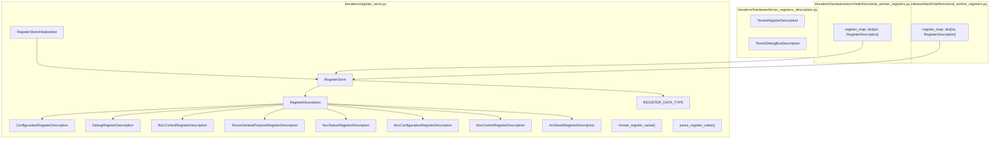

Sources: [ttexalens/register_store.py:1-20](), [ttexalens/hardware/tensix_registers_description.py](), [ttexalens/hardware/wormhole/functional_worker_registers.py:1-15](), [ttexalens/hardware/blackhole/functional_worker_registers.py:1-15]()

---
```


This page provides a comprehensive reference for the TTExaLens Python library API, which enables programmatic access to Tenstorrent AI accelerator hardware for debugging, memory inspection, firmware loading, and runtime analysis. The API is designed for use in Python scripts and Jupyter notebooks.

For interactive command-line usage, see [Command Line Interface](https://deepwiki.com/tenstorrent/tt-exalens/4-command-line-interface). For details on the underlying device architecture, see [Device Architecture](https://deepwiki.com/tenstorrent/tt-exalens/5-device-architecture). For advanced debugging features, see [Advanced Features](https://deepwiki.com/tenstorrent/tt-exalens/7-advanced-features).

## API Structure and Organization

The TTExaLens Python library is organized around a set of public functions exported from the `ttexalens` module. All functions follow consistent parameter conventions and can operate with automatic context initialization.

**Key Module:** The primary user-facing API is defined in [ttexalens/tt_exalens_lib.py 1-856](https://github.com/tenstorrent/tt-exalens/blob/046c35eb/ttexalens/tt_exalens_lib.py#L1-L856) and exported through [ttexalens/__init__.py 1-78](https://github.com/tenstorrent/tt-exalens/blob/046c35eb/ttexalens/__init__.py#L1-L78)

### Function Categories

```mermaid
graph TB
    subgraph "Context Management"
        init["init_ttexalens()"]
        init_remote["init_ttexalens_remote()"]
        check["check_context()"]
        set_ctx["set_active_context()"]
    end
    
    subgraph "Coordinate Operations"
        convert["convert_coordinate()"]
    end
    
    subgraph "Memory Access"
        read_word["read_word_from_device()"]
        read_words["read_words_from_device()"]
        read_bytes["read_from_device()"]
        write_word["write_words_to_device()"]
        write_bytes["write_to_device()"]
    end
    
    subgraph "Register Access"
        read_reg["read_register()"]
        write_reg["write_register()"]
    end
    
    subgraph "RISC-V Memory"
        read_risc["read_riscv_memory()"]
        write_risc["write_riscv_memory()"]
    end
    
    subgraph "ELF Operations"
        parse["parse_elf()"]
        load["load_elf()"]
        run["run_elf()"]
    end
    
    subgraph "Debugging"
        callstack_func["callstack()"]
        top_callstack_func["top_callstack()"]
        tensix["TensixState"]
    end
    
    subgraph "ARC Communication"
        arc["arc_msg()"]
        telemetry["read_arc_telemetry_entry()"]
    end
    
    subgraph "Code Coverage"
        cov["coverage()"]
    end
    
    init --> check
    init_remote --> check
    check --> Memory Access
    check --> Register Access
    check --> RISC-V Memory
    check --> ELF Operations
    check --> Debugging
    check --> ARC Communication
    check --> Code Coverage
```

Sources: [ttexalens/__init__.py:6-27](), [ttexalens/tt_exalens_lib.py:1-856]()
```


Sources: [ttexalens/__init__.py 6-27](https://github.com/tenstorrent/tt-exalens/blob/046c35eb/ttexalens/__init__.py#L6-L27)[ttexalens/tt_exalens_lib.py 1-856](https://github.com/tenstorrent/tt-exalens/blob/046c35eb/ttexalens/tt_exalens_lib.py#L1-L856)

## Core Data Types

The API operates on three fundamental types that users interact with directly:

### Context

The `Context` object manages the TTExaLens session, including device connections, caching, and state tracking. Users can explicitly create a context via `init_ttexalens()` or `init_ttexalens_remote()`, or let functions auto-initialize one via `check_context()`.

| Function | Purpose |
| --- | --- |
| `init_ttexalens()` | Create local context with PCIe access |
| `init_ttexalens_remote()` | Create remote context via TTExaLensServer |
| `set_active_context()` | Set global context for auto-initialization |
| `check_context()` | Get active context or auto-initialize |

Sources: [ttexalens/tt_exalens_init.py 1-148](https://github.com/tenstorrent/tt-exalens/blob/046c35eb/ttexalens/tt_exalens_init.py#L1-L148)[ttexalens/tt_exalens_lib.py 50-63](https://github.com/tenstorrent/tt-exalens/blob/046c35eb/ttexalens/tt_exalens_lib.py#L50-L63)

### Device

The `Device` object represents a Tenstorrent chip and provides architecture-specific functionality. Devices are accessed through the context and identified by integer device IDs.

`context = ttexalens.init_ttexalens()device = context.devices[0]  # Access first device`
Sources: [ttexalens/device.py 1-1000](https://github.com/tenstorrent/tt-exalens/blob/046c35eb/ttexalens/device.py#L1-L1000)[ttexalens/context.py 1-200](https://github.com/tenstorrent/tt-exalens/blob/046c35eb/ttexalens/context.py#L1-L200)

### OnChipCoordinate

The `OnChipCoordinate` class abstracts chip locations across five coordinate systems (noc0, noc1, die, logical, translated). Most API functions accept either coordinate strings or `OnChipCoordinate` objects.

**String Formats:**

*   `"X-Y"` - NOC0/translated coordinates (e.g., `"1-2"`)
*   `"X,Y"` - Logical tensix coordinates (e.g., `"0,0"`)
*   `"tX,Y"`, `"eX,Y"`, `"dX,Y"` - Logical coordinates with explicit type (tensix/eth/dram)
*   `"chN"` or `"dX,Y"` - DRAM channel notation

`# String conversion to OnChipCoordinatecoord = ttexalens.convert_coordinate("1-2")  # NOC0 coordinatecoord = ttexalens.convert_coordinate("0,0")  # Logical tensix coordinatecoord = ttexalens.convert_coordinate("ch0")  # DRAM channel 0`
Sources: [ttexalens/coordinate.py 78-354](https://github.com/tenstorrent/tt-exalens/blob/046c35eb/ttexalens/coordinate.py#L78-L354)[ttexalens/tt_exalens_lib.py 87-107](https://github.com/tenstorrent/tt-exalens/blob/046c35eb/ttexalens/tt_exalens_lib.py#L87-L107)

## API Design Patterns

### Parameter Conventions

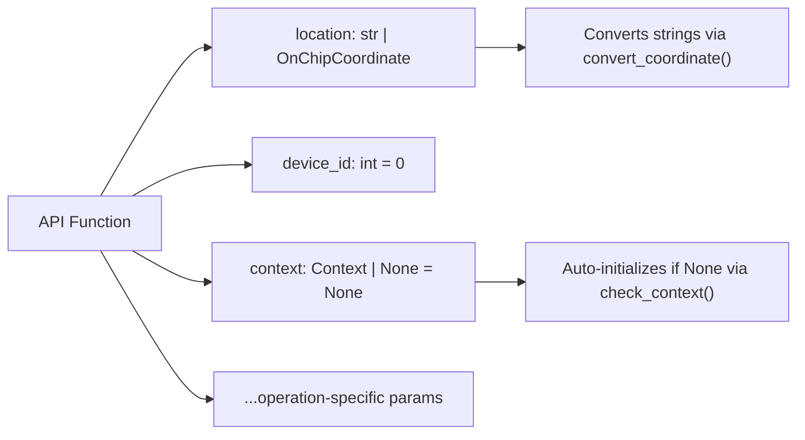

| Parameter | Type | Purpose |
|-----------|------|---------|
| `location` | `str \| OnChipCoordinate` | Target chip location |
| `device_id` | `int` | Device ID (default: 0) |
| `context` | `Context \| None` | Session context (auto-initializes if None) |
| `noc_id` | `int \| None` | NOC selection (0 or 1, None uses context default) |
| `safe_mode` | `bool \| None` | Memory access validation (None uses context default) |

Sources: [ttexalens/tt_exalens_lib.py:110-292]()
```


All API functions follow consistent parameter patterns:

| Parameter | Type | Purpose |
| --- | --- | --- |
| `location` | `str | OnChipCoordinate` | Target chip location |
| `device_id` | `int` | Device ID (default: 0) |
| `context` | `Context | None` | Session context (auto-initializes if None) |
| `noc_id` | `int | None` | NOC selection (0 or 1, None uses context default) |
| `safe_mode` | `bool | None` | Memory access validation (None uses context default) |

Sources: [ttexalens/tt_exalens_lib.py 110-292](https://github.com/tenstorrent/tt-exalens/blob/046c35eb/ttexalens/tt_exalens_lib.py#L110-L292)

### Automatic Context Initialization

Functions automatically initialize a context if none is provided, enabling simple one-line operations:

`# No explicit context needed - auto-initializesdata = ttexalens.read_words_from_device("0,0", 0x100, word_count=4)`
The global context is stored in `GLOBAL_CONTEXT` and reused across function calls.

Sources: [ttexalens/tt_exalens_lib.py 50-63](https://github.com/tenstorrent/tt-exalens/blob/046c35eb/ttexalens/tt_exalens_lib.py#L50-L63)[ttexalens/tt_exalens_init.py 1-148](https://github.com/tenstorrent/tt-exalens/blob/046c35eb/ttexalens/tt_exalens_init.py#L1-L148)

### Error Handling

API functions raise `TTException` for operational errors and standard Python exceptions for invalid parameters:

`from ttexalens import TTException try:    data = ttexalens.read_from_device("invalid-location", 0x100)except TTException as e:    print(f"Operation failed: {e}")except ValueError as e:    print(f"Invalid parameter: {e}")`
Sources: [ttexalens/util.py 1-200](https://github.com/tenstorrent/tt-exalens/blob/046c35eb/ttexalens/util.py#L1-L200)[ttexalens/tt_exalens_lib.py 78-292](https://github.com/tenstorrent/tt-exalens/blob/046c35eb/ttexalens/tt_exalens_lib.py#L78-L292)

## API Function Reference by Category

### Memory Access Operations

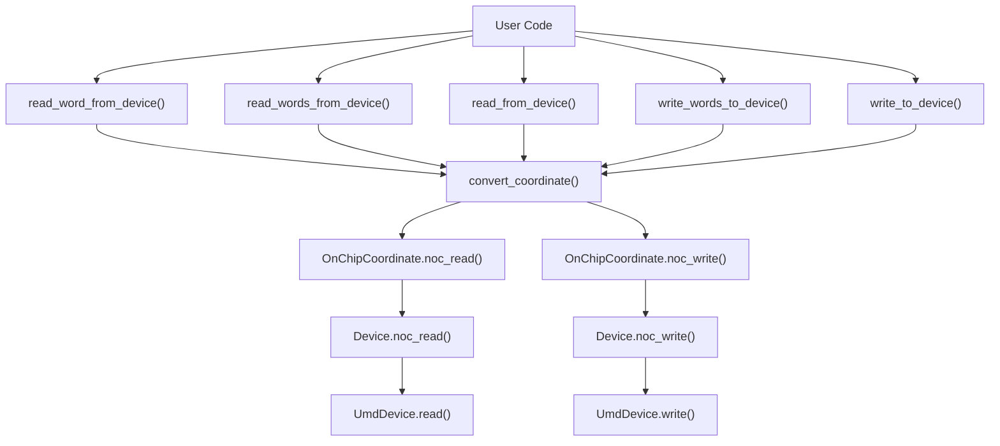

| Function | Purpose | Returns |
|----------|---------|---------|
| `read_word_from_device()` | Read single 4-byte word | `int` |
| `read_words_from_device()` | Read multiple 4-byte words | `list[int]` |
| `read_from_device()` | Read arbitrary byte count | `bytes` |
| `write_words_to_device()` | Write one or more 4-byte words | `None` |
| `write_to_device()` | Write arbitrary bytes | `None` |

**Example:**
```python
```


Memory access functions provide byte-level and word-level read/write operations with automatic NOC failover and DMA threshold management.

| Function | Purpose | Returns |
| --- | --- | --- |
| `read_word_from_device()` | Read single 4-byte word | `int` |
| `read_words_from_device()` | Read multiple 4-byte words | `list[int]` |
| `read_from_device()` | Read arbitrary byte count | `bytes` |
| `write_words_to_device()` | Write one or more 4-byte words | `None` |
| `write_to_device()` | Write arbitrary bytes | `None` |

**Example:**

`# Read 16 words from L1 memorydata = ttexalens.read_words_from_device("0,0", 0x1000, word_count=16) # Write bytes to DRAMttexalens.write_to_device("ch0", 0x0, b"test_data")`
For detailed documentation, see [Memory Access Operations](https://deepwiki.com/tenstorrent/tt-exalens/3.3-memory-access-operations).

Sources: [ttexalens/tt_exalens_lib.py 110-292](https://github.com/tenstorrent/tt-exalens/blob/046c35eb/ttexalens/tt_exalens_lib.py#L110-L292)[test/ttexalens/unit_tests/test_lib.py 80-360](https://github.com/tenstorrent/tt-exalens/blob/046c35eb/test/ttexalens/unit_tests/test_lib.py#L80-L360)

### Register Access Operations

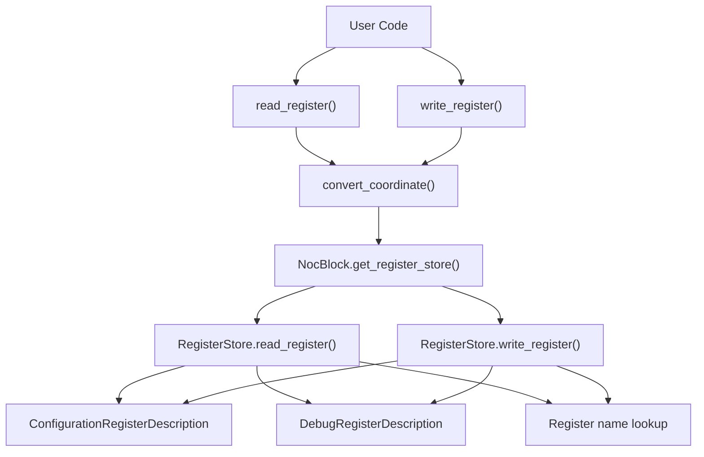

| Function | Purpose | Returns |
|----------|---------|---------|
| `read_register()` | Read configuration or debug register | `int` |
| `write_register()` | Write configuration or debug register | `None` |

**Register Description Types:**
- `ConfigurationRegisterDescription(index, mask, shift)` - Configuration space register
- `DebugRegisterDescription(offset)` - Debug space register  
- `str` - Named register (e.g., `"ALU_FORMAT_SPEC_REG2_Dstacc"`)

**Example:**
```python
```


Register access functions support both configuration registers (indexed with mask/shift) and debug registers (addressed by offset).

| Function | Purpose | Returns |
| --- | --- | --- |
| `read_register()` | Read configuration or debug register | `int` |
| `write_register()` | Write configuration or debug register | `None` |

**Register Description Types:**

*   `ConfigurationRegisterDescription(index, mask, shift)` - Configuration space register
*   `DebugRegisterDescription(offset)` - Debug space register
*   `str` - Named register (e.g., `"ALU_FORMAT_SPEC_REG2_Dstacc"`)

**Example:**

`# Read by namevalue = ttexalens.read_register("0,0", "ALU_FORMAT_SPEC_REG2_Dstacc") # Write by descriptionfrom ttexalens.register_store import DebugRegisterDescriptionttexalens.write_register("0,0", DebugRegisterDescription(offset=0x54), 0x123)`
For detailed documentation, see [Register Access](https://deepwiki.com/tenstorrent/tt-exalens/3.4-register-access).

Sources: [ttexalens/tt_exalens_lib.py 497-572](https://github.com/tenstorrent/tt-exalens/blob/046c35eb/ttexalens/tt_exalens_lib.py#L497-L572)[test/ttexalens/unit_tests/test_lib.py 361-522](https://github.com/tenstorrent/tt-exalens/blob/046c35eb/test/ttexalens/unit_tests/test_lib.py#L361-L522)

### ELF Management Operations

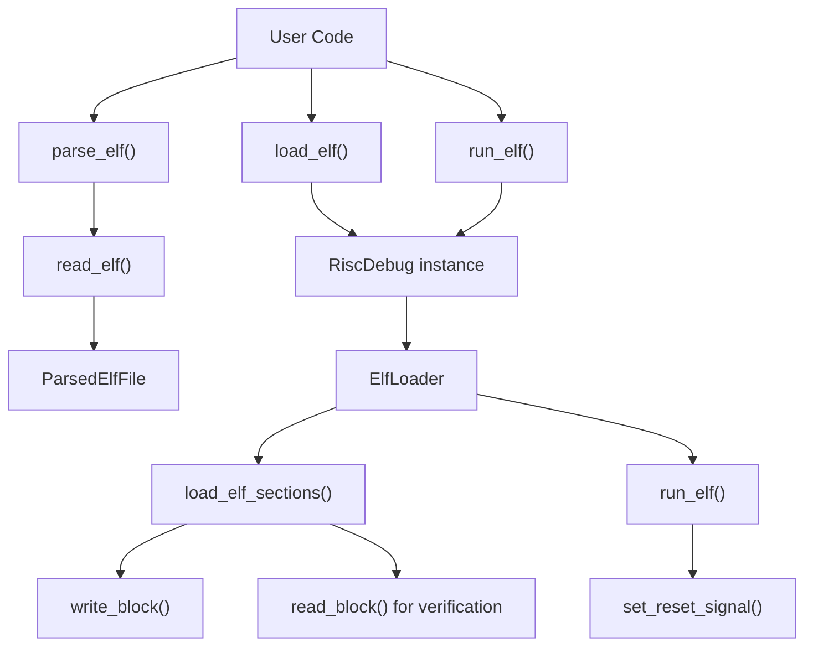

| Function | Purpose | Parameters | Returns |
|----------|---------|------------|---------|
| `parse_elf()` | Parse ELF file and DWARF symbols | `elf_path: str` | `ParsedElfFile` |
| `load_elf()` | Load ELF to RISC core (core in reset) | `elf_file, location, risc_name` | `None \| int \| list[int]` |
| `run_elf()` | Load and execute ELF (takes core out of reset) | `elf_file, location, risc_name` | `None` |

**Location Formats:**
- `"all"` - All functional worker cores
- `"X,Y"` - Single core
- `["X,Y", "X2,Y2", ...]` - List of cores
- `OnChipCoordinate` - Single coordinate object

**Example:**
```python
```


ELF functions handle firmware loading, parsing, and execution on RISC-V cores.

| Function | Purpose | Parameters | Returns |
| --- | --- | --- | --- |
| `parse_elf()` | Parse ELF file and DWARF symbols | `elf_path: str` | `ParsedElfFile` |
| `load_elf()` | Load ELF to RISC core (core in reset) | `elf_file, location, risc_name` | `None | int | list[int]` |
| `run_elf()` | Load and execute ELF (takes core out of reset) | `elf_file, location, risc_name` | `None` |

**Location Formats:**

*   `"all"` - All functional worker cores
*   `"X,Y"` - Single core
*   `["X,Y", "X2,Y2", ...]` - List of cores
*   `OnChipCoordinate` - Single coordinate object

**Example:**

`# Parse ELF with debug symbolself = ttexalens.parse_elf("firmware.elf") # Load to specific core (core must be in reset)ttexalens.load_elf(elf, "0,0", "brisc") # Run on all coresttexalens.run_elf("firmware.elf", "all", "trisc0")`
For detailed documentation, see [ELF Management](https://deepwiki.com/tenstorrent/tt-exalens/3.5-elf-management).

Sources: [ttexalens/tt_exalens_lib.py 294-421](https://github.com/tenstorrent/tt-exalens/blob/046c35eb/ttexalens/tt_exalens_lib.py#L294-L421)[ttexalens/elf_loader.py 1-233](https://github.com/tenstorrent/tt-exalens/blob/046c35eb/ttexalens/elf_loader.py#L1-L233)[test/ttexalens/unit_tests/test_lib.py 821-932](https://github.com/tenstorrent/tt-exalens/blob/046c35eb/test/ttexalens/unit_tests/test_lib.py#L821-L932)

### RISC-V Core Control Operations

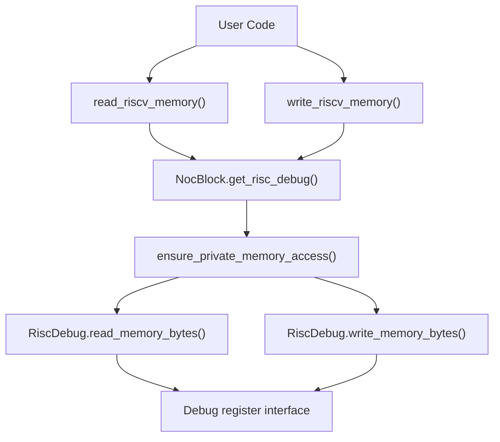

| Function | Purpose | Returns |
|----------|---------|---------|
| `read_riscv_memory()` | Read from RISC-V private memory via debug interface | `int` |
| `write_riscv_memory()` | Write to RISC-V private memory via debug interface | `None` |

**Private Memory Regions:**
- Data Private: `0xFFB00000` - `0xFFB0FFFF` (varies by architecture)
- Code Private: `0xFFC00000` - `0xFFC3FFFF` (varies by architecture)

**Example:**
```python
```


RISC-V memory access functions provide direct access to private memory regions not accessible via NOC.

| Function | Purpose | Returns |
| --- | --- | --- |
| `read_riscv_memory()` | Read from RISC-V private memory via debug interface | `int` |
| `write_riscv_memory()` | Write to RISC-V private memory via debug interface | `None` |

**Private Memory Regions:**

*   Data Private: `0xFFB00000` - `0xFFB0FFFF` (varies by architecture)
*   Code Private: `0xFFC00000` - `0xFFC3FFFF` (varies by architecture)

**Example:**

`# Read from BRISC private data memoryvalue = ttexalens.read_riscv_memory("0,0", 0xFFB00000, "brisc") # Write to TRISC0 private memoryttexalens.write_riscv_memory("0,0", 0xFFB00100, 0x12345678, "trisc0")`
For detailed documentation, see [RISC-V Core Control](https://deepwiki.com/tenstorrent/tt-exalens/3.6-risc-v-core-control).

Sources: [ttexalens/tt_exalens_lib.py 712-770](https://github.com/tenstorrent/tt-exalens/blob/046c35eb/ttexalens/tt_exalens_lib.py#L712-L770)[test/ttexalens/unit_tests/test_lib.py 554-778](https://github.com/tenstorrent/tt-exalens/blob/046c35eb/test/ttexalens/unit_tests/test_lib.py#L554-L778)

### Debugging and Callstack Operations

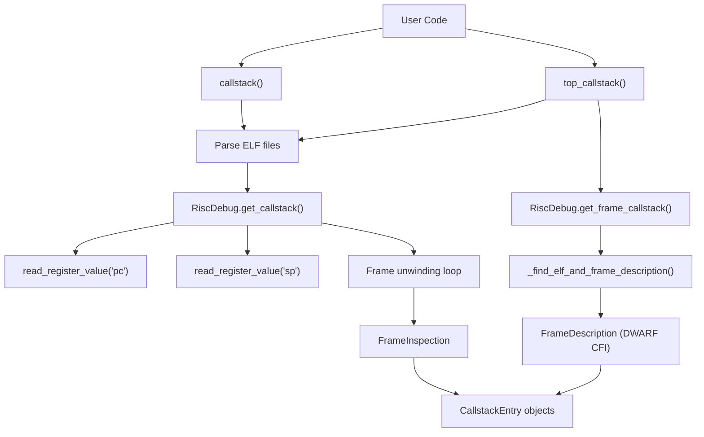

| Function | Purpose | Returns |
|----------|---------|---------|
| `callstack()` | Full callstack with frame unwinding | `list[CallstackEntry]` |
| `top_callstack()` | Top frame only (no stack walking) | `list[CallstackEntry]` |

**CallstackEntry Fields:**
- `function_name` - Function name from symbols
- `file_name` - Source file path
- `line_number` - Source line number
- `pc` - Program counter value
- `inlined` - Whether function is inlined

**Example:**
```python
```


Debugging functions enable call stack inspection and frame unwinding using DWARF debug information.

| Function | Purpose | Returns |
| --- | --- | --- |
| `callstack()` | Full callstack with frame unwinding | `list[CallstackEntry]` |
| `top_callstack()` | Top frame only (no stack walking) | `list[CallstackEntry]` |

**CallstackEntry Fields:**

*   `function_name` - Function name from symbols
*   `file_name` - Source file path
*   `line_number` - Source line number
*   `pc` - Program counter value
*   `inlined` - Whether function is inlined

**Example:**

`# Get full callstack for BRISC on core 0,0stack = ttexalens.callstack("0,0", "firmware.elf", risc_name="brisc")for entry in stack:    print(f"{entry.function_name} at {entry.file_name}:{entry.line_number}") # Get top frame only (fast, no unwinding)top = ttexalens.top_callstack(pc=0x1000, elfs="firmware.elf")`
For detailed documentation, see [Debugging and Callstacks](https://deepwiki.com/tenstorrent/tt-exalens/3.7-debugging-and-callstacks).

Sources: [ttexalens/tt_exalens_lib.py 587-690](https://github.com/tenstorrent/tt-exalens/blob/046c35eb/ttexalens/tt_exalens_lib.py#L587-L690)[test/ttexalens/unit_tests/test_lib.py 933-1082](https://github.com/tenstorrent/tt-exalens/blob/046c35eb/test/ttexalens/unit_tests/test_lib.py#L933-L1082)

### ARC Communication Operations

ARC functions provide communication with the ARC processor for device management and telemetry.

| Function | Purpose | Returns |
| --- | --- | --- |
| `arc_msg()` | Send message to ARC processor | `list[int]` (return code, reply0, reply1) |
| `read_arc_telemetry_entry()` | Read telemetry value by tag | `int` |

**Example:**

`# Send ARC messageresult = ttexalens.arc_msg(    device_id=0,    msg_code=0x55,  # Message code    wait_for_done=True,    args=[0, 0, 0],    timeout=datetime.timedelta(seconds=5)) # Read telemetry by nametemp = ttexalens.read_arc_telemetry_entry(0, "ASIC_TEMPERATURE")`
For detailed documentation, see [ARC Communication](https://deepwiki.com/tenstorrent/tt-exalens/3.9-arc-communication).

Sources: [ttexalens/tt_exalens_lib.py 423-495](https://github.com/tenstorrent/tt-exalens/blob/046c35eb/ttexalens/tt_exalens_lib.py#L423-L495)[test/ttexalens/unit_tests/test_lib.py 1380-1444](https://github.com/tenstorrent/tt-exalens/blob/046c35eb/test/ttexalens/unit_tests/test_lib.py#L1380-L1444)

### Code Coverage Operations

Coverage functions extract GCOV data from device memory and generate coverage reports.

| Function | Purpose | Returns |
| --- | --- | --- |
| `coverage()` | Extract coverage data and generate .gcda file | `None` |

**Example:**

`# Extract coverage data for BRISC on core 0,0ttexalens.coverage(    location="0,0",    elf="firmware.elf",    gcda_path="output.gcda",    risc_name="brisc")`
For detailed documentation, see [Code Coverage](https://deepwiki.com/tenstorrent/tt-exalens/3.10-code-coverage).

Sources: [ttexalens/tt_exalens_lib.py 692-710](https://github.com/tenstorrent/tt-exalens/blob/046c35eb/ttexalens/tt_exalens_lib.py#L692-L710)[test/ttexalens/unit_tests/test_lib.py 1083-1133](https://github.com/tenstorrent/tt-exalens/blob/046c35eb/test/ttexalens/unit_tests/test_lib.py#L1083-L1133)

### Tensix Debug Operations

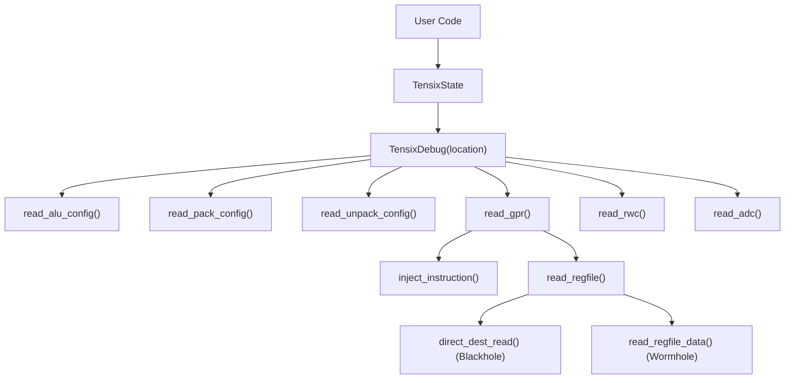

**TensixState Methods:**
- `read_alu_config()` - ALU format configuration
- `read_pack_config()` - Packer configuration
- `read_unpack_config()` - Unpacker configuration  
- `read_gpr(thread_id)` - General purpose registers
- `read_rwc(thread_id)` - Register window counters
- `read_adc(l1_address)` - ADC state (requires L1 sampling)

**Example:**
```python
from ttexalens import TensixState

state = TensixState("0,0")
alu_config = state.read_alu_config()
gpr = state.read_gpr(thread_id=0)
```

For detailed documentation, see [Tensix Core Debugging](#7.6).

Sources: [ttexalens/tt_exalens_lib.py:772-856](), [ttexalens/debug_tensix.py:1-356](), [test/ttexalens/unit_tests/test_tensix_debug.py:1-215]()
```


The `TensixState` class provides access to Tensix core state including ALU configuration, register files, and RWC counters.

**TensixState Methods:**

*   `read_alu_config()` - ALU format configuration
*   `read_pack_config()` - Packer configuration
*   `read_unpack_config()` - Unpacker configuration
*   `read_gpr(thread_id)` - General purpose registers
*   `read_rwc(thread_id)` - Register window counters
*   `read_adc(l1_address)` - ADC state (requires L1 sampling)

**Example:**

`from ttexalens import TensixState state = TensixState("0,0")alu_config = state.read_alu_config()gpr = state.read_gpr(thread_id=0)`
For detailed documentation, see [Tensix Core Debugging](https://deepwiki.com/tenstorrent/tt-exalens/7.6-tensix-core-debugging).

Sources: [ttexalens/tt_exalens_lib.py 772-856](https://github.com/tenstorrent/tt-exalens/blob/046c35eb/ttexalens/tt_exalens_lib.py#L772-L856)[ttexalens/debug_tensix.py 1-356](https://github.com/tenstorrent/tt-exalens/blob/046c35eb/ttexalens/debug_tensix.py#L1-L356)[test/ttexalens/unit_tests/test_tensix_debug.py 1-215](https://github.com/tenstorrent/tt-exalens/blob/046c35eb/test/ttexalens/unit_tests/test_tensix_debug.py#L1-L215)

## Common Usage Patterns

### Basic Memory Inspection

`import ttexalens as tt # Auto-initialize contextdata = tt.read_words_from_device("0,0", 0x0, word_count=16)print(f"L1 memory at 0x0: {[hex(x) for x in data]}")`
### Firmware Loading and Debugging

`import ttexalens as tt # Initialize contextctx = tt.init_ttexalens() # Parse ELF fileelf = tt.parse_elf("firmware.elf", context=ctx) # Load to all corestt.load_elf(elf, "all", "brisc", context=ctx) # Get callstack from one corestack = tt.callstack("0,0", elf, risc_name="brisc", context=ctx)for frame in stack:    print(f"{frame.function_name} at {frame.file_name}:{frame.line_number}")`
### Multi-Device Access

`import ttexalens as tt ctx = tt.init_ttexalens() # Access different devicesfor device_id in ctx.device_ids:    device = ctx.devices[device_id]    print(f"Device {device_id}: {device.arch_name}")        # Read from first worker core    location = device.get_block_locations(block_type="functional_workers")[0]    data = tt.read_word_from_device(location, 0x0, device_id=device_id, context=ctx)    print(f"  Data at 0x0: {hex(data)}")`
### Remote Device Access

`import ttexalens as tt # Connect to remote TTExaLens serverctx = tt.init_ttexalens_remote(ip_address="192.168.1.100", port=5555) # API usage is identical to local accessdata = tt.read_words_from_device("0,0", 0x1000, word_count=8, context=ctx)`
Sources: [test/ttexalens/unit_tests/test_lib.py 45-1444](https://github.com/tenstorrent/tt-exalens/blob/046c35eb/test/ttexalens/unit_tests/test_lib.py#L45-L1444)[docs/ttexalens-lib-docs.md 1-650](https://github.com/tenstorrent/tt-exalens/blob/046c35eb/docs/ttexalens-lib-docs.md?plain=1#L1-L650)

## API Tracing and Debugging

API calls can be traced by setting verbosity to `TRACE` level:

`from ttexalens import Verbosity Verbosity.set_verbosity(Verbosity.TRACE) # All API calls will now be logged with parametersdata = ttexalens.read_words_from_device("0,0", 0x100, word_count=4)# Output: [API] read_words_from_device(location='0,0', addr=0x100, device_id=0, word_count=4, ...)`
The `trace_api` decorator automatically formats function calls with parameter values for debugging.

Sources: [ttexalens/tt_exalens_lib.py 22-48](https://github.com/tenstorrent/tt-exalens/blob/046c35eb/ttexalens/tt_exalens_lib.py#L22-L48)[ttexalens/util.py 1-200](https://github.com/tenstorrent/tt-exalens/blob/046c35eb/ttexalens/util.py#L1-L200)

This wiki is featured in the [repository](https://github.com/tenstorrent/tt-exalens/blob/main/README.md)

Dismiss
Refresh this wiki

Enter email to refresh

## Get program counter


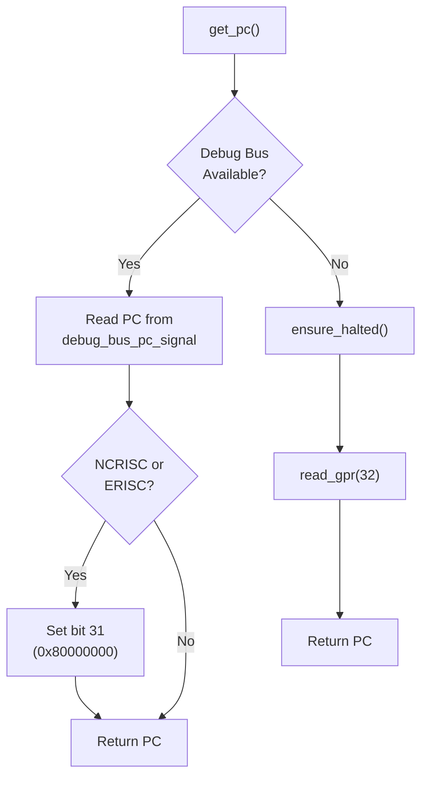

**Note:** NCRISC and ERISC cores lose the topmost PC bit on the debug bus, requiring a correction by setting bit 31.
```


#### Function: `arc_msg()`


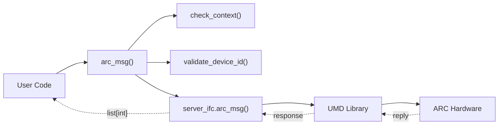


#### Function: `read_arc_telemetry_entry()`


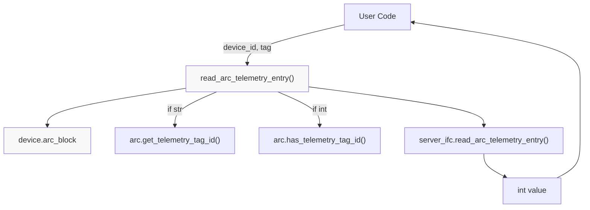


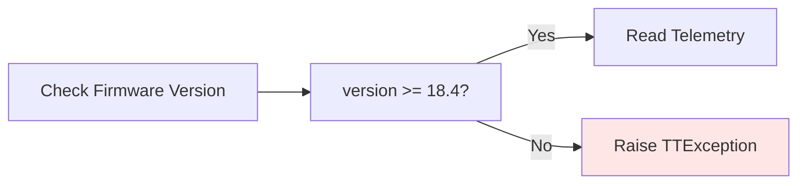


#### Register Window Counters (RWC)


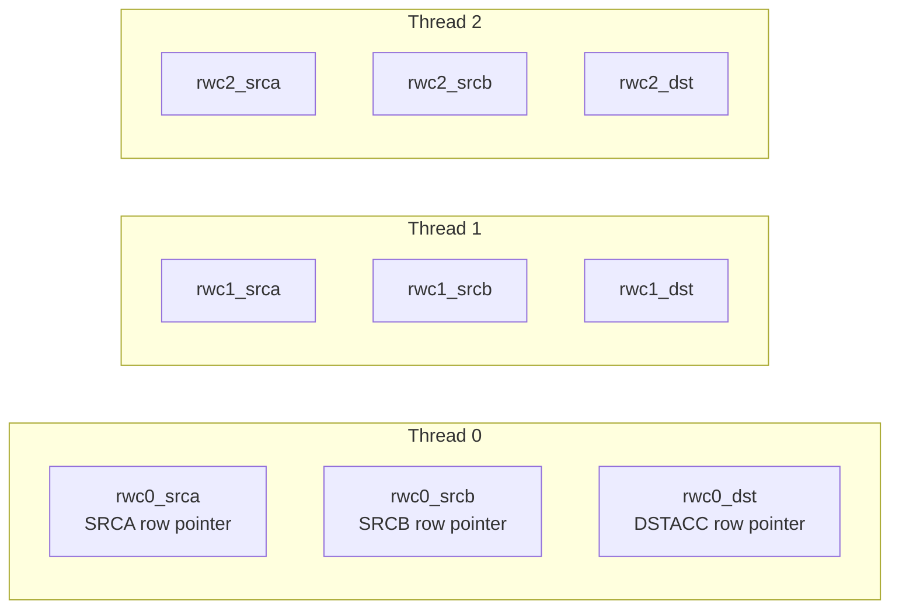

**Reading RWC Values:**

RWC values can be read via debug bus signals:
```python
```


### Address Space Organization


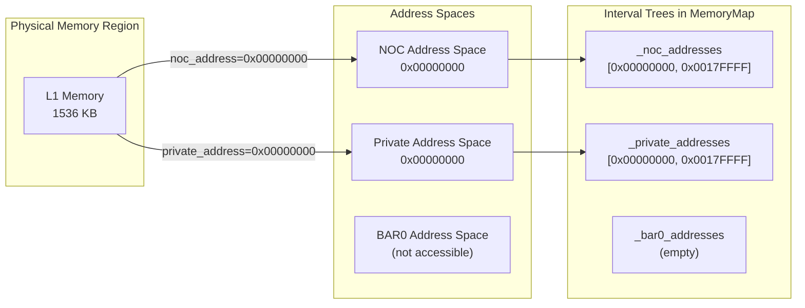

**Address Space Usage by Access Method:**

| Access Method | Address Space | Use Case |
|---------------|---------------|----------|
| NOC read/write | noc_address | General-purpose memory access across the chip |
| RISC debug memory access | private_address | Accessing memory from a RISC core's perspective |
| PCIe BAR0 | bar0_address | Direct host access (limited regions) |

Some memory regions are intentionally accessible only through specific address spaces. For example, Tensix register files may only have private addresses.

Sources: [ttexalens/hardware/blackhole/functional_worker_block.py:66-68](), [ttexalens/memory_map.py:40-69]()
```


#### Access Path Selection


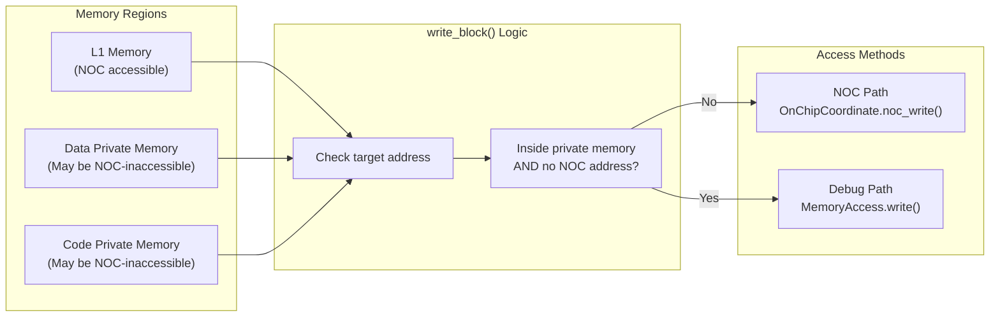


### Module Structure


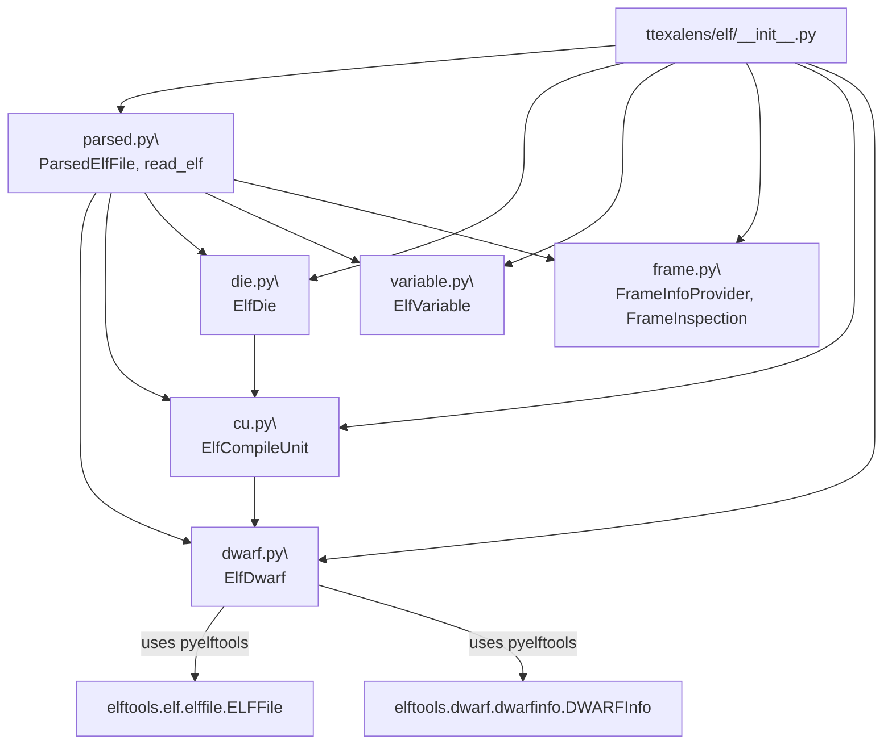

Sources: [ttexalens/elf/__init__.py:1-21](), [ttexalens/elf/parsed.py:1-30](), [ttexalens/elf/die.py:1-25]()

---
```


### Handling Inlined Functions


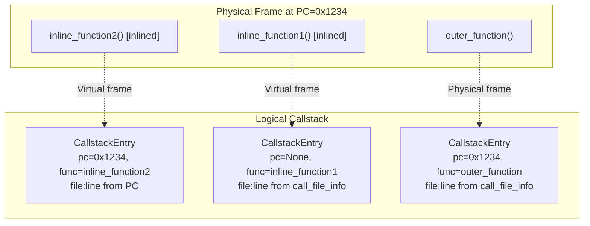


### Indirect Register File Access


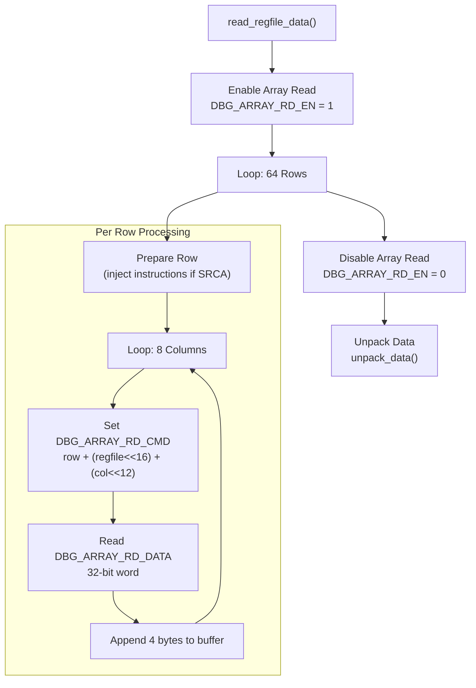

**Diagram: Indirect Access Flow**
```


### Direct Register File Access (Blackhole Only)


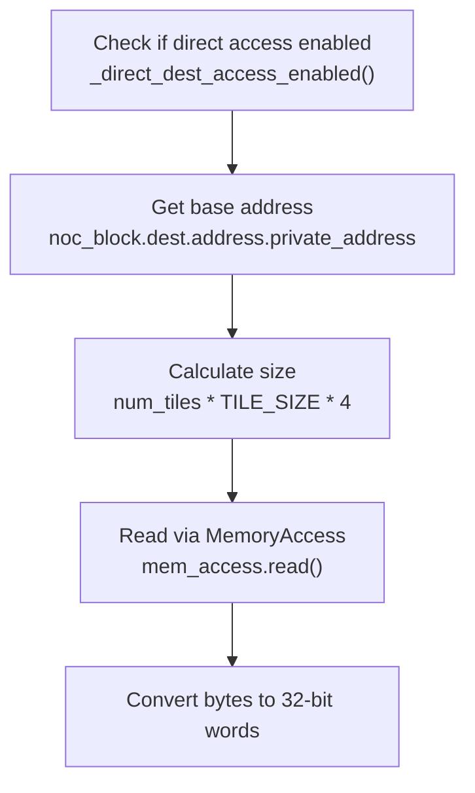

**Diagram: Direct Access Read Flow**
```

