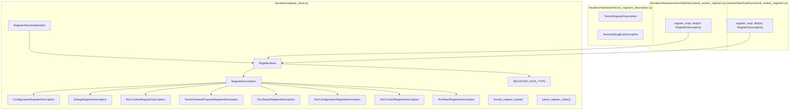
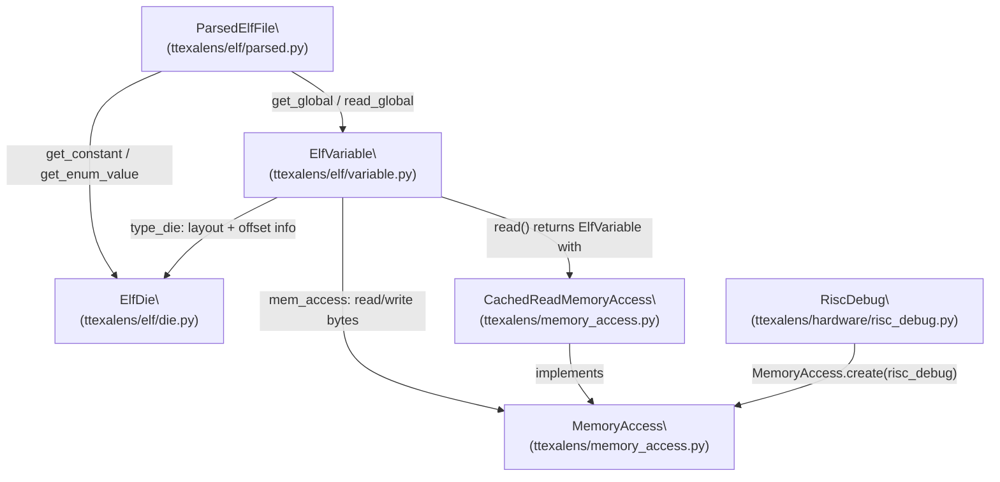
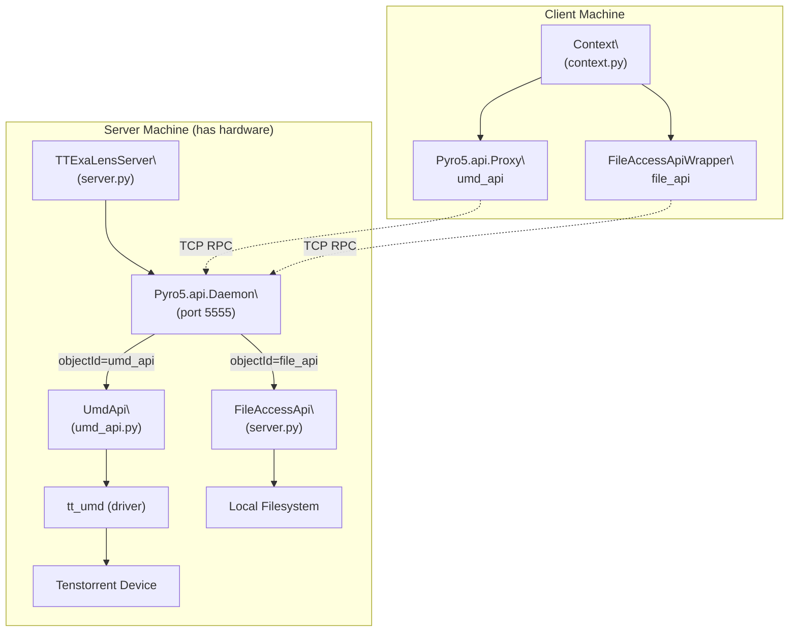
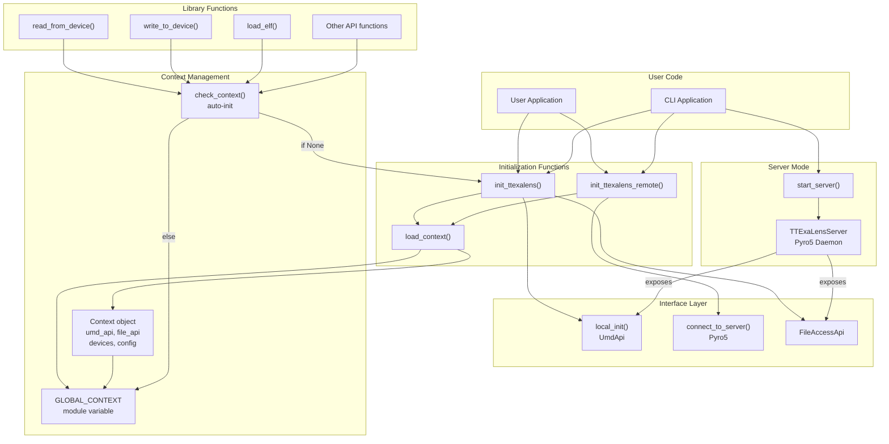
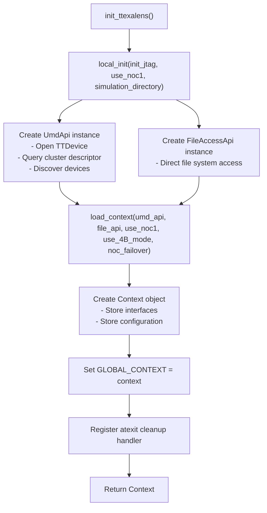
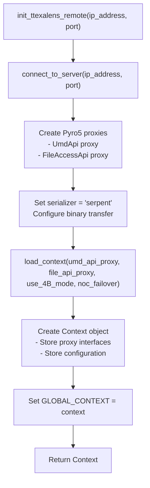
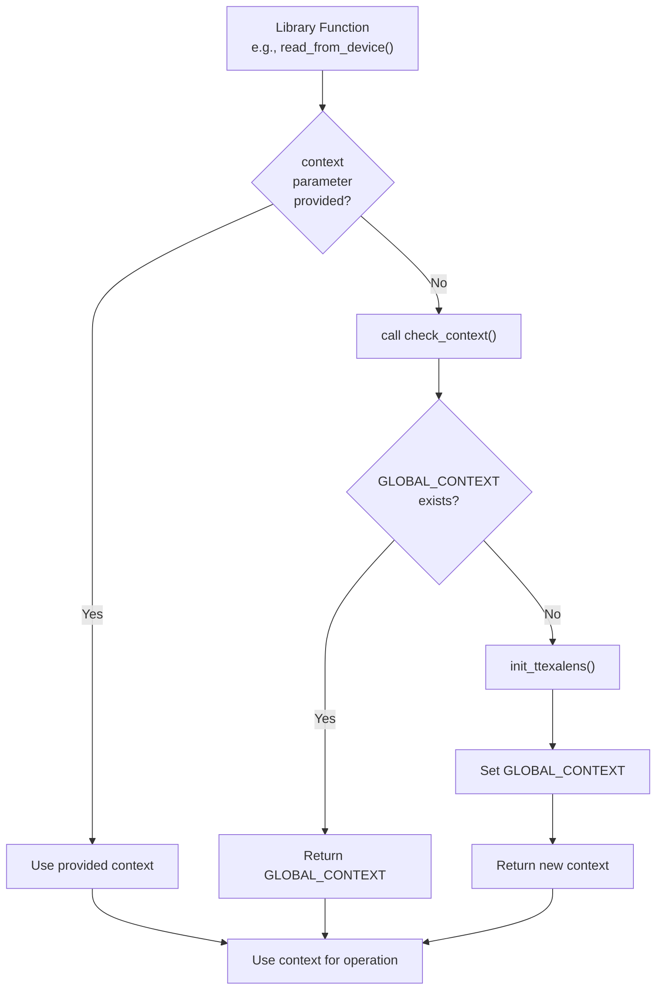
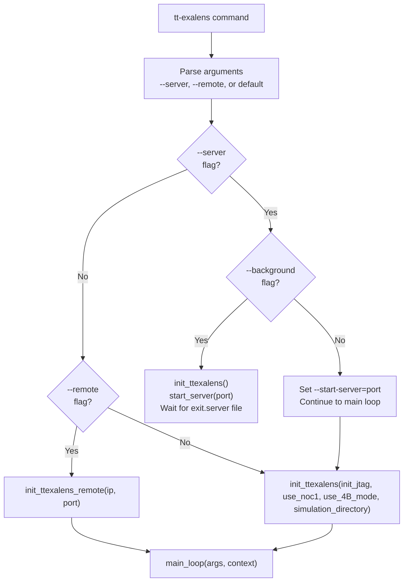
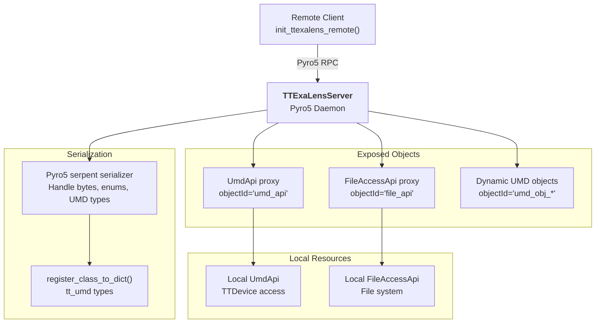

# Context and Initialization

Relevant source files
*   [VERSION](https://github.com/tenstorrent/tt-exalens/blob/046c35eb/VERSION)
*   [test/app/test_umd_ttexalens.py](https://github.com/tenstorrent/tt-exalens/blob/046c35eb/test/app/test_umd_ttexalens.py)
*   [test/ttexalens/unit_tests/program_writer.py](https://github.com/tenstorrent/tt-exalens/blob/046c35eb/test/ttexalens/unit_tests/program_writer.py)
*   [test/ttexalens/unit_tests/test_base.py](https://github.com/tenstorrent/tt-exalens/blob/046c35eb/test/ttexalens/unit_tests/test_base.py)
*   [test/ttexalens/unit_tests/test_l1_mem_access.py](https://github.com/tenstorrent/tt-exalens/blob/046c35eb/test/ttexalens/unit_tests/test_l1_mem_access.py)
*   [test/ttexalens/unit_tests/test_noc_failover.py](https://github.com/tenstorrent/tt-exalens/blob/046c35eb/test/ttexalens/unit_tests/test_noc_failover.py)
*   [test/ttexalens/unit_tests/test_remote_communication.py](https://github.com/tenstorrent/tt-exalens/blob/046c35eb/test/ttexalens/unit_tests/test_remote_communication.py)
*   [ttexalens/cli_commands/interfaces.py](https://github.com/tenstorrent/tt-exalens/blob/046c35eb/ttexalens/cli_commands/interfaces.py)
*   [ttexalens/context.py](https://github.com/tenstorrent/tt-exalens/blob/046c35eb/ttexalens/context.py)
*   [ttexalens/requirements.txt](https://github.com/tenstorrent/tt-exalens/blob/046c35eb/ttexalens/requirements.txt)
*   [ttexalens/server.py](https://github.com/tenstorrent/tt-exalens/blob/046c35eb/ttexalens/server.py)
*   [ttexalens/tt_exalens_init.py](https://github.com/tenstorrent/tt-exalens/blob/046c35eb/ttexalens/tt_exalens_init.py)
*   [ttexalens/umd_api.py](https://github.com/tenstorrent/tt-exalens/blob/046c35eb/ttexalens/umd_api.py)
*   [ttexalens/umd_device.py](https://github.com/tenstorrent/tt-exalens/blob/046c35eb/ttexalens/umd_device.py)

## Purpose and Scope

This page documents the initialization and context management system in TTExaLens. It covers how to create and manage TTExaLens sessions in both local and remote modes, the `Context` object that manages global state, and how library functions access this context. For information about device discovery and hardware access, see [Device Factory and Architecture Detection](https://deepwiki.com/tenstorrent/tt-exalens/5.1-device-factory-and-architecture-detection). For remote server infrastructure details, see [Remote Device Access](https://deepwiki.com/tenstorrent/tt-exalens/7.2-remote-device-access).




Sources: [ttexalens/register_store.py:1-20](), [ttexalens/hardware/tensix_registers_description.py](), [ttexalens/hardware/wormhole/functional_worker_registers.py:1-15](), [ttexalens/hardware/blackhole/functional_worker_registers.py:1-15]()

---
```
## Overview

TTExaLens provides two initialization modes: **local** and **remote**. Local mode directly accesses hardware via PCIe or JTAG, while remote mode connects to a TTExaLens server running on another machine. Both modes produce a `Context` object that encapsulates all session state, including device interfaces, configuration parameters, and loaded resources.

A global fallback context (`GLOBAL_CONTEXT`) enables convenient usage where library functions automatically initialize TTExaLens if no explicit context is provided.




Sources: [ttexalens/elf/variable.py:1-25](), [ttexalens/elf/parsed.py:1-30](), [ttexalens/elf/__init__.py:1-21]()

---
```




Sources: [ttexalens/server.py:41-80](), [ttexalens/umd_api.py:44-146](), [ttexalens/cli.py:7-43]()

---
```
## Initialization Architecture

**Sources:**[ttexalens/tt_exalens_init.py 1-110](https://github.com/tenstorrent/tt-exalens/blob/046c35eb/ttexalens/tt_exalens_init.py#L1-L110)[ttexalens/tt_exalens_lib.py 48-60](https://github.com/tenstorrent/tt-exalens/blob/046c35eb/ttexalens/tt_exalens_lib.py#L48-L60)[ttexalens/server.py 221-278](https://github.com/tenstorrent/tt-exalens/blob/046c35eb/ttexalens/server.py#L221-L278)[ttexalens/cli.py 349-433](https://github.com/tenstorrent/tt-exalens/blob/046c35eb/ttexalens/cli.py#L349-L433)



## Context Object Structure

The `Context` class serves as the central state manager for a TTExaLens session. It holds references to device interfaces, configuration parameters, discovered devices, and session resources.

**Sources:**[ttexalens/context.py 23-101](https://github.com/tenstorrent/tt-exalens/blob/046c35eb/ttexalens/context.py#L23-L101)


```mermaid
graph TB
    subgraph "Context Class"
        Context["<b>Context</b><br/>ttexalens/context.py"]
        
        subgraph "Device Interfaces"
            UmdApi["umd_api: UmdApi<br/>Device communication"]
            FileApi["file_api: FileAccessApi<br/>File system access"]
        end
        
        subgraph "Configuration"
            ShortName["short_name: str<br/>'default'"]
            UseNoc1["use_noc1: bool<br/>NOC selection"]
            Use4B["use_4B_mode: bool<br/>4-byte transfer mode"]
            DmaReadThresh["dma_read_threshold: int<br/>24 bytes"]
            DmaWriteThresh["dma_write_threshold: int<br/>56 bytes"]
            NocFailover["noc_failover: bool<br/>Auto NOC0/NOC1 switch"]
            SafeMode["safe_mode: bool<br/>Restrict unsafe memory access"]
        end
</thinking>
        
        subgraph "Cached Resources"
            Devices["devices: dict[int, Device]<br/>@cached_property"]
            DeviceIds["device_ids: SortedSet[int]<br/>@cached_property"]
            ClusterDesc["cluster_descriptor<br/>@cached_property"]
            DeviceByUID["device_by_unique_id<br/>@cached_property"]
            ElfObj["elf: ELF<br/>@cached_property"]
        end
        
        subgraph "Session State"
            Commands["commands: list[CommandMetadata]<br/>Available commands"]
            LoadedElfs["loaded_elfs: dict[RiscLocation, str]<br/>Tracking loaded ELFs"]
        end
    end
    
    Context --> UmdApi
    Context --> FileApi
    Context --> UseNoc1
    Context --> Use4B
    Context --> DmaReadThresh
    Context --> DmaWriteThresh
    Context --> NocFailover
    Context --> Devices
    Context --> DeviceIds
    Context --> Commands
    Context --> LoadedElfs
```
### Context Fields

| Field | Type | Purpose |
| --- | --- | --- |
| `umd_api` | `UmdApi` | Interface to UMD (Unified Memory Driver) for hardware communication |
| `file_api` | `FileAccessApi` | Abstraction for file system access (local or remote) |
| `short_name` | `str` | Context identifier, default is `"default"` |
| `use_noc1` | `bool` | Whether to use NOC1 instead of NOC0 for communication |
| `use_4B_mode` | `bool` | Enable 4-byte transfer mode for NOC operations |
| `dma_read_threshold` | `int` | Minimum size (bytes) to use DMA for reads (default: 24) |
| `dma_write_threshold` | `int` | Minimum size (bytes) to use DMA for writes (default: 56) |
| `noc_failover` | `bool` | Enable automatic NOC0/NOC1 failover on timeout |
| `safe_mode` | `bool` | Restrict memory access to known-safe regions; raises `UnsafeAccessException` on violation |
| `devices` | `dict[int, Device]` | Cached mapping of device IDs to Device objects |
| `device_ids` | `SortedSet[int]` | Set of all discovered device IDs |
| `commands` | `list[CommandMetadata]` | Available CLI commands for this context |
| `loaded_elfs` | `dict[RiscLocation, str]` | Tracks which ELF files are loaded on which RISC cores |

**Sources:**[ttexalens/context.py 23-46](https://github.com/tenstorrent/tt-exalens/blob/046c35eb/ttexalens/context.py#L23-L46)[ttexalens/context.py 69-116](https://github.com/tenstorrent/tt-exalens/blob/046c35eb/ttexalens/context.py#L69-L116)

## Local Initialization

Local initialization establishes a direct connection to hardware through PCIe or JTAG interfaces. This is the primary mode for single-machine debugging.

### Function: `init_ttexalens()`

**Parameters:**

| Parameter | Type | Default | Description |
| --- | --- | --- | --- |
| `init_jtag` | `bool` | `False` | Initialize JTAG interface instead of PCIe |
| `use_noc1` | `bool` | `False` | Use NOC1 for communication (default is NOC0) |
| `use_4B_mode` | `bool` | `True` | Enable 4-byte transfer mode for better performance |
| `simulation_directory` | `str | None` | `None` | Path to simulator build directory (enables simulation mode) |
| `noc_failover` | `bool` | `True` | Enable automatic NOC0/NOC1 failover on errors |
| `safe_mode` | `bool` | `True` | Restrict memory access to known-safe regions; raises `UnsafeAccessException` on violations |

**Returns:**`Context` object ready for use

**Sources:**[ttexalens/tt_exalens_init.py 21-45](https://github.com/tenstorrent/tt-exalens/blob/046c35eb/ttexalens/tt_exalens_init.py#L21-L45)

### Local Initialization Flow

**Sources:**[ttexalens/tt_exalens_init.py 21-43](https://github.com/tenstorrent/tt-exalens/blob/046c35eb/ttexalens/tt_exalens_init.py#L21-L43)[ttexalens/tt_exalens_init.py 69-82](https://github.com/tenstorrent/tt-exalens/blob/046c35eb/ttexalens/tt_exalens_init.py#L69-L82)[ttexalens/umd_api.py](https://github.com/tenstorrent/tt-exalens/blob/046c35eb/ttexalens/umd_api.py) (referenced)



### Example Usage

**Sources:**[test/ttexalens/unit_tests/test_ttexalens_init.py 22-26](https://github.com/tenstorrent/tt-exalens/blob/046c35eb/test/ttexalens/unit_tests/test_ttexalens_init.py#L22-L26)

## Remote Initialization

Remote initialization connects to a TTExaLens server running on another machine, enabling distributed debugging where the hardware is physically located elsewhere.

### Function: `init_ttexalens_remote()`

**Parameters:**

| Parameter | Type | Default | Description |
| --- | --- | --- | --- |
| `ip_address` | `str` | `"localhost"` | IP address of TTExaLens server |
| `port` | `int` | `5555` | Port number of TTExaLens server |
| `use_4B_mode` | `bool` | `True` | Enable 4-byte transfer mode |
| `noc_failover` | `bool` | `True` | Enable automatic NOC0/NOC1 failover |
| `safe_mode` | `bool` | `True` | Restrict memory access to known-safe regions; raises `UnsafeAccessException` on violations |

**Returns:**`Context` object with remote interfaces

**Sources:**[ttexalens/tt_exalens_init.py 48-70](https://github.com/tenstorrent/tt-exalens/blob/046c35eb/ttexalens/tt_exalens_init.py#L48-L70)

### Remote Initialization Flow

**Sources:**[ttexalens/tt_exalens_init.py 46-66](https://github.com/tenstorrent/tt-exalens/blob/046c35eb/ttexalens/tt_exalens_init.py#L46-L66)[ttexalens/server.py 254-278](https://github.com/tenstorrent/tt-exalens/blob/046c35eb/ttexalens/server.py#L254-L278)



### Example Usage

**Sources:**[test/ttexalens/unit_tests/test_ttexalens_init.py 41-86](https://github.com/tenstorrent/tt-exalens/blob/046c35eb/test/ttexalens/unit_tests/test_ttexalens_init.py#L41-L86)

## Global Context Management

TTExaLens provides a global context mechanism that simplifies library usage by automatically initializing a session when needed.

### Global Context Variable: `GLOBAL_CONTEXT`

The `GLOBAL_CONTEXT` module variable in `ttexalens/tt_exalens_init.py` stores a fallback context instance. It is automatically set when calling `init_ttexalens()`, `init_ttexalens_remote()`, or `load_context()`.

**Sources:**[ttexalens/tt_exalens_init.py 18](https://github.com/tenstorrent/tt-exalens/blob/046c35eb/ttexalens/tt_exalens_init.py#L18-L18)

### Function: `check_context()`

The `check_context()` function provides automatic context initialization for library functions. If no context is provided, it returns the global context, creating one via `init_ttexalens()` if necessary.

**Sources:**[ttexalens/tt_exalens_lib.py 48-60](https://github.com/tenstorrent/tt-exalens/blob/046c35eb/ttexalens/tt_exalens_lib.py#L48-L60)

### Function: `set_active_context()`

Explicitly sets or clears the global context.

**Sources:**[ttexalens/tt_exalens_init.py 85-96](https://github.com/tenstorrent/tt-exalens/blob/046c35eb/ttexalens/tt_exalens_init.py#L85-L96)

### Context Usage Pattern in Library Functions

**Sources:**[ttexalens/tt_exalens_lib.py 48-60](https://github.com/tenstorrent/tt-exalens/blob/046c35eb/ttexalens/tt_exalens_lib.py#L48-L60)[ttexalens/tt_exalens_lib.py 174-206](https://github.com/tenstorrent/tt-exalens/blob/046c35eb/ttexalens/tt_exalens_lib.py#L174-L206)



### Example: Using Global Context

**Sources:**[test/ttexalens/unit_tests/test_lib.py 46-79](https://github.com/tenstorrent/tt-exalens/blob/046c35eb/test/ttexalens/unit_tests/test_lib.py#L46-L79)

## Context Lifecycle and Cleanup

### Automatic Cleanup

TTExaLens registers an `atexit` handler to clean up the global context before program termination. This ensures C++ destructors run before the nanobind runtime shuts down.

**Sources:**[ttexalens/tt_exalens_init.py 99-109](https://github.com/tenstorrent/tt-exalens/blob/046c35eb/ttexalens/tt_exalens_init.py#L99-L109)

### Manual Context Management

For applications that need multiple contexts or explicit control:

## Configuration Parameters Deep Dive

### NOC Selection: `use_noc1`

Tenstorrent chips have two Network-on-Chip (NOC) interconnects: NOC0 and NOC1. The `use_noc1` parameter selects which one to use for communication.

*   **Default:**`False` (use NOC0)
*   **When to use NOC1:** If NOC0 is experiencing issues or for testing purposes
*   **Note:** Both CLI and library functions respect this setting

**Sources:**[ttexalens/context.py 29](https://github.com/tenstorrent/tt-exalens/blob/046c35eb/ttexalens/context.py#L29-L29)[ttexalens/cli.py 29](https://github.com/tenstorrent/tt-exalens/blob/046c35eb/ttexalens/cli.py#L29-L29)

### 4-Byte Mode: `use_4B_mode`

Controls whether NOC transfers use 4-byte alignment mode. This can improve performance on certain operations.

*   **Default:**`True`
*   **Disabling:** Set to `False` for maximum compatibility (slower)
*   **Implementation:** Used in [ttexalens/umd_device.py 189-194](https://github.com/tenstorrent/tt-exalens/blob/046c35eb/ttexalens/umd_device.py#L189-L194) for read operations

**Sources:**[ttexalens/context.py 39](https://github.com/tenstorrent/tt-exalens/blob/046c35eb/ttexalens/context.py#L39-L39)[ttexalens/umd_device.py 169-217](https://github.com/tenstorrent/tt-exalens/blob/046c35eb/ttexalens/umd_device.py#L169-L217)

### DMA Thresholds

Determines when to use DMA transfers vs. NOC register access:

| Parameter | Default | Purpose |
| --- | --- | --- |
| `dma_read_threshold` | 24 bytes | Minimum size for DMA reads |
| `dma_write_threshold` | 56 bytes | Minimum size for DMA writes |

These thresholds were empirically determined for Wormhole architecture. Transfers smaller than the threshold use NOC register access, while larger transfers use DMA for better performance.

**Sources:**[ttexalens/context.py 31-32](https://github.com/tenstorrent/tt-exalens/blob/046c35eb/ttexalens/context.py#L31-L32)[ttexalens/umd_device.py 117-142](https://github.com/tenstorrent/tt-exalens/blob/046c35eb/ttexalens/umd_device.py#L117-L142)

### NOC Failover: `noc_failover`

When enabled, TTExaLens automatically switches between NOC0 and NOC1 if timeouts are detected. This provides resilience against NOC communication issues.

*   **Default:**`True`
*   **Implementation:** Timeout detection happens in `UmdDevice` at [ttexalens/umd_device.py 113-167](https://github.com/tenstorrent/tt-exalens/blob/046c35eb/ttexalens/umd_device.py#L113-L167); the failover logic responding to `TimeoutDeviceRegisterError` is handled in `Device` and exercises the `_noc_to_use` ordering

**Sources:**[ttexalens/context.py 33](https://github.com/tenstorrent/tt-exalens/blob/046c35eb/ttexalens/context.py#L33-L33)[ttexalens/umd_device.py 113-167](https://github.com/tenstorrent/tt-exalens/blob/046c35eb/ttexalens/umd_device.py#L113-L167)

### Safe Mode: `safe_mode`

When `safe_mode=True`, all memory reads and writes are validated against each block's `MemoryMap` before execution. If the target address falls outside a known-safe region, the operation raises `UnsafeAccessException`. Individual library calls can pass an explicit `safe_mode` override to bypass the context default.

*   **Default:**`True`
*   **When to disable:** Tests and low-level debug scripts that need to probe arbitrary addresses. Tests in [test/ttexalens/unit_tests/test_base.py 51](https://github.com/tenstorrent/tt-exalens/blob/046c35eb/test/ttexalens/unit_tests/test_base.py#L51-L51) explicitly set `safe_mode=False`.
*   **Exception type:**`UnsafeAccessException` (exported from `ttexalens/__init__.py`)
*   **Per-call override:** Most library functions accept a `safe_mode: bool | None` parameter; `None` means "use context default".

**Sources:**[ttexalens/context.py 44-45](https://github.com/tenstorrent/tt-exalens/blob/046c35eb/ttexalens/context.py#L44-L45)[ttexalens/tt_exalens_init.py 21-45](https://github.com/tenstorrent/tt-exalens/blob/046c35eb/ttexalens/tt_exalens_init.py#L21-L45)[ttexalens/tt_exalens_lib.py 109-138](https://github.com/tenstorrent/tt-exalens/blob/046c35eb/ttexalens/tt_exalens_lib.py#L109-L138)[ttexalens/__init__.py 33](https://github.com/tenstorrent/tt-exalens/blob/046c35eb/ttexalens/__init__.py#L33-L33)

## CLI Initialization

The CLI application (`tt-exalens`) initializes context based on command-line arguments:

### CLI Modes

**Sources:**[ttexalens/cli.py 360-433](https://github.com/tenstorrent/tt-exalens/blob/046c35eb/ttexalens/cli.py#L360-L433)



### CLI Usage Examples

**Sources:**[ttexalens/cli.py 6-42](https://github.com/tenstorrent/tt-exalens/blob/046c35eb/ttexalens/cli.py#L6-L42)

## Server Infrastructure

For remote access, TTExaLens provides a server that exposes device interfaces over the network using Pyro5.

### Starting a Server

**Sources:**[ttexalens/server.py 221-230](https://github.com/tenstorrent/tt-exalens/blob/046c35eb/ttexalens/server.py#L221-L230)[test/ttexalens/unit_tests/test_ttexalens_init.py 29-39](https://github.com/tenstorrent/tt-exalens/blob/046c35eb/test/ttexalens/unit_tests/test_ttexalens_init.py#L29-L39)

### TTExaLensServer Architecture

**Sources:**[ttexalens/server.py 41-278](https://github.com/tenstorrent/tt-exalens/blob/046c35eb/ttexalens/server.py#L41-L278)



### Remote Communication Flow

**Sources:**[ttexalens/server.py 254-278](https://github.com/tenstorrent/tt-exalens/blob/046c35eb/ttexalens/server.py#L254-L278)[test/ttexalens/unit_tests/test_ttexalens_init.py 70-86](https://github.com/tenstorrent/tt-exalens/blob/046c35eb/test/ttexalens/unit_tests/test_ttexalens_init.py#L70-L86)

## Complete Initialization Flow Comparison

### Local vs Remote Side-by-Side

| Aspect | Local Mode | Remote Mode |
| --- | --- | --- |
| **Function** | `init_ttexalens()` | `init_ttexalens_remote()` |
| **UmdApi** | Direct `TTDevice` access via pybind | Pyro5 proxy to remote UmdApi |
| **FileAccessApi** | Direct file system access | Pyro5 proxy with binary serialization |
| **Hardware Access** | PCIe/JTAG to local hardware | RPC to server, server accesses hardware |
| **Performance** | Fastest (direct) | Network latency overhead |
| **Use Case** | Single machine debugging | Distributed/remote debugging |
| **Setup** | Requires local hardware | Requires running server |

**Sources:**[ttexalens/tt_exalens_init.py 21-66](https://github.com/tenstorrent/tt-exalens/blob/046c35eb/ttexalens/tt_exalens_init.py#L21-L66)

Dismiss
Refresh this wiki

Enter email to refresh
