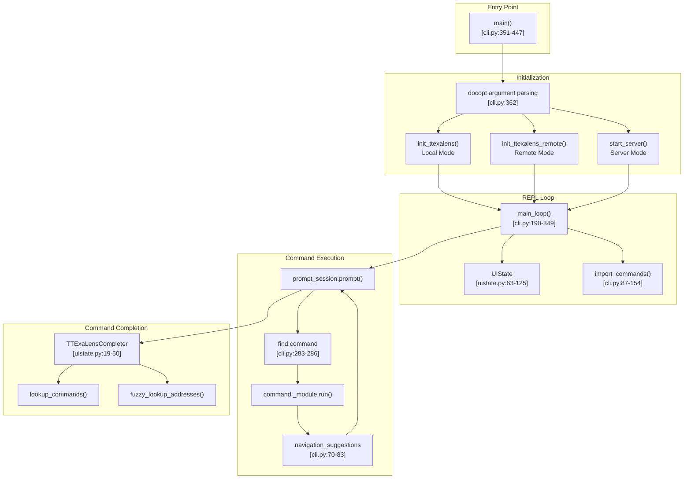
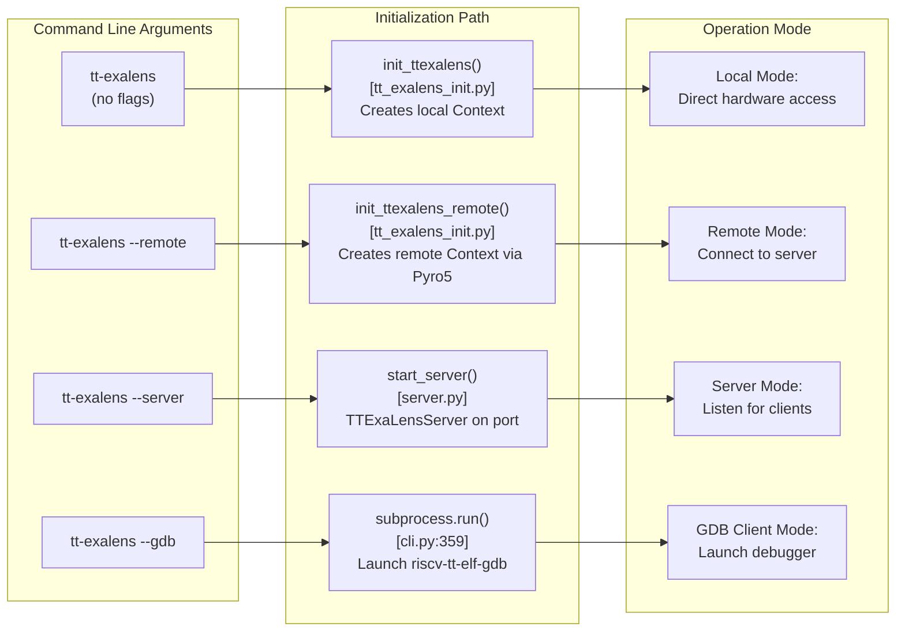
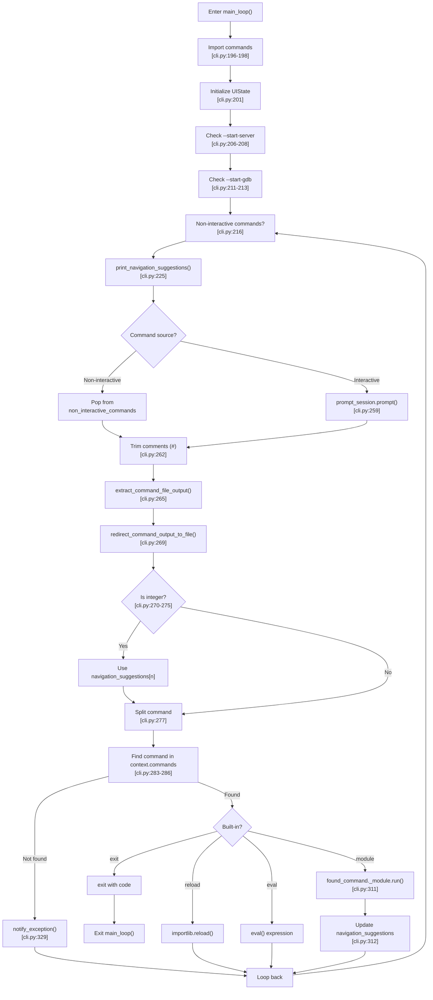
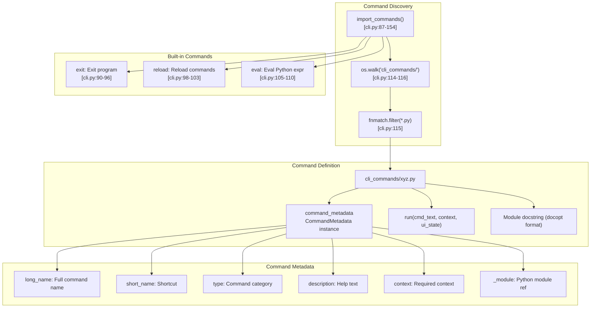

# Command Line Interface

Relevant source files
*   [docs/ttexalens-app-docs.md](https://github.com/tenstorrent/tt-exalens/blob/046c35eb/docs/ttexalens-app-docs.md?plain=1)
*   [docs/ttexalens-lib-docs.md](https://github.com/tenstorrent/tt-exalens/blob/046c35eb/docs/ttexalens-lib-docs.md?plain=1)
*   [test/ttexalens/unit_tests/test_ttexalens_init.py](https://github.com/tenstorrent/tt-exalens/blob/046c35eb/test/ttexalens/unit_tests/test_ttexalens_init.py)
*   [ttexalens/__init__.py](https://github.com/tenstorrent/tt-exalens/blob/046c35eb/ttexalens/__init__.py)
*   [ttexalens/cli.py](https://github.com/tenstorrent/tt-exalens/blob/046c35eb/ttexalens/cli.py)
*   [ttexalens/cli_commands/gdb.py](https://github.com/tenstorrent/tt-exalens/blob/046c35eb/ttexalens/cli_commands/gdb.py)
*   [ttexalens/coordinate.py](https://github.com/tenstorrent/tt-exalens/blob/046c35eb/ttexalens/coordinate.py)
*   [ttexalens/gdb/gdb_client.py](https://github.com/tenstorrent/tt-exalens/blob/046c35eb/ttexalens/gdb/gdb_client.py)
*   [ttexalens/gdb/gdb_communication.py](https://github.com/tenstorrent/tt-exalens/blob/046c35eb/ttexalens/gdb/gdb_communication.py)
*   [ttexalens/gdb/gdb_server.py](https://github.com/tenstorrent/tt-exalens/blob/046c35eb/ttexalens/gdb/gdb_server.py)
*   [ttexalens/uistate.py](https://github.com/tenstorrent/tt-exalens/blob/046c35eb/ttexalens/uistate.py)

This document describes the `tt-exalens` command-line application, its operational modes, interactive shell features, and command system architecture. The CLI provides a read-eval-print loop (REPL) interface for inspecting and debugging Tenstorrent hardware.

For programmatic access to TTExaLens functionality, see the Python Library API ([#3](https://github.com/tenstorrent/tt-exalens/blob/046c35eb/#3)). For documentation on individual CLI commands, see the command-specific subsections ([#4.1](https://github.com/tenstorrent/tt-exalens/blob/046c35eb/#4.1) through [#4.6](https://github.com/tenstorrent/tt-exalens/blob/046c35eb/#4.6)).

* * *

## CLI Application Architecture

The CLI application is implemented in [ttexalens/cli.py](https://github.com/tenstorrent/tt-exalens/blob/046c35eb/ttexalens/cli.py) and serves as the primary user-facing interface to TTExaLens. It initializes a `Context` object, manages UI state, and provides an interactive shell for executing commands.

### System Structure

**Sources:**[ttexalens/cli.py 1-452](https://github.com/tenstorrent/tt-exalens/blob/046c35eb/ttexalens/cli.py#L1-L452)[ttexalens/uistate.py 1-125](https://github.com/tenstorrent/tt-exalens/blob/046c35eb/ttexalens/uistate.py#L1-L125)

* * *



## Invocation and Operational Modes

The CLI supports three primary modes of operation: **local**, **remote**, and **server**. The mode is determined by command-line arguments passed to `tt-exalens`.

### Mode Selection

**Sources:**[ttexalens/cli.py 351-447](https://github.com/tenstorrent/tt-exalens/blob/046c35eb/ttexalens/cli.py#L351-L447)[ttexalens/cli.py 7-44](https://github.com/tenstorrent/tt-exalens/blob/046c35eb/ttexalens/cli.py#L7-L44)



### Command-Line Arguments

The CLI accepts the following arguments (from [ttexalens/cli.py 7-33](https://github.com/tenstorrent/tt-exalens/blob/046c35eb/ttexalens/cli.py#L7-L33)):

| Argument | Description | Default |
| --- | --- | --- |
| `--server` | Start a TTExaLens server | - |
| `--remote` | Attach to remote TTExaLens server | - |
| `--port=<port>` | Port for server mode | 5555 |
| `--remote-address=<ip:port>` | Server address for remote mode | localhost:5555 |
| `--commands=<cmds>` | Execute semicolon-separated commands | - |
| `--start-gdb=<gdb_port>` | Start GDB server on specified port | - |
| `--start-server=<server_port>` | Start tt-exalens server on specified port | - |
| `--background` | Run server in background | - |
| `-s=<simulation_directory>` | Simulator build output directory | - |
| `--verbosity=<level>` | Output verbosity (1-5) | 3 (INFO) |
| `--test` | Exit with non-zero on any exception | - |
| `--jtag` | Initialize JTAG interface | - |
| `--use-noc1` | Use NOC1 for communication | - |
| `--disable-4B-mode` | Disable 4-byte mode | - |
| `--unsafe-mode` | Disable safe mode | - |
| `--disable-noc-failover` | Disable automatic NOC failover | - |
| `--gdb [args...]` | Start RISC-V GDB client | - |
| `--version` | Show version and exit | - |
| `-h, --help` | Show help message and exit | - |

**Sources:**[ttexalens/cli.py 7-44](https://github.com/tenstorrent/tt-exalens/blob/046c35eb/ttexalens/cli.py#L7-L44)

### Mode Details

#### Local Mode

In local mode, TTExaLens:

*   Initializes direct hardware access via `init_ttexalens()`[ttexalens/cli.py 434-441](https://github.com/tenstorrent/tt-exalens/blob/046c35eb/ttexalens/cli.py#L434-L441)
*   Creates local `UmdApi` and `UmdDevice` objects
*   Communicates with hardware through tt-umd library
*   Supports both PCIe MMIO and Ethernet tunneling for remote chips

**Sources:**[ttexalens/cli.py 434-441](https://github.com/tenstorrent/tt-exalens/blob/046c35eb/ttexalens/cli.py#L434-L441)

#### Remote Mode

In remote mode, TTExaLens:

*   Connects to a TTExaLens server via `init_ttexalens_remote()`[ttexalens/cli.py 425-432](https://github.com/tenstorrent/tt-exalens/blob/046c35eb/ttexalens/cli.py#L425-L432)
*   Uses Pyro5 RPC for all device operations
*   Proxies all UmdApi calls to the server
*   Shares server-side Context state

**Sources:**[ttexalens/cli.py 425-432](https://github.com/tenstorrent/tt-exalens/blob/046c35eb/ttexalens/cli.py#L425-L432)

#### Server Mode

In server mode, TTExaLens:

*   Starts `TTExaLensServer` on specified port [ttexalens/cli.py 394-423](https://github.com/tenstorrent/tt-exalens/blob/046c35eb/ttexalens/cli.py#L394-L423)
*   Exposes `UmdApi` through Pyro5 with auto-serialization
*   Allows multiple remote clients to connect
*   In background mode, waits for `exit.server` file to terminate

**Sources:**[ttexalens/cli.py 394-423](https://github.com/tenstorrent/tt-exalens/blob/046c35eb/ttexalens/cli.py#L394-L423)

* * *

## Interactive Shell (REPL)

The main loop implements a read-eval-print loop that reads user commands, executes them, and displays results. The loop is implemented in `main_loop()`[ttexalens/cli.py 190-349](https://github.com/tenstorrent/tt-exalens/blob/046c35eb/ttexalens/cli.py#L190-L349)

### Main Loop Flow

**Sources:**[ttexalens/cli.py 190-349](https://github.com/tenstorrent/tt-exalens/blob/046c35eb/ttexalens/cli.py#L190-L349)



### Prompt System

The prompt dynamically displays current state information:

```
server:5555 gdb:6767(connected) noc:noc0 device:0 loc:1-2 (0,0)>
```

The prompt is generated by `get_dynamic_prompt()`[ttexalens/cli.py 234-257](https://github.com/tenstorrent/tt-exalens/blob/046c35eb/ttexalens/cli.py#L234-L257) and includes:

| Component | Description | Example |
| --- | --- | --- |
| `server:<port>` | Active TTExaLens server port | `server:5555` |
| `gdb:<port>(connected)` | Active GDB server port and connection status | `gdb:6767(connected)` |
| `[4B MODE]` | 4-byte mode enabled | `[4B MODE]` |
| `noc:<id>` | Active NOC (0 or 1) | `noc:noc0` |
| `JTAG` | JTAG interface active | `JTAG` |
| `device:<id>` | Current device ID | `device:0` |
| `loc:<coord>` | Current location in noc0-logical format | `loc:1-2 (0,0)` |

**Sources:**[ttexalens/cli.py 234-257](https://github.com/tenstorrent/tt-exalens/blob/046c35eb/ttexalens/cli.py#L234-L257)

### Command Completion

The `TTExaLensCompleter` class [ttexalens/uistate.py 19-50](https://github.com/tenstorrent/tt-exalens/blob/046c35eb/ttexalens/uistate.py#L19-L50) provides intelligent command completion:

1.   **First word**: Completes command names (short and long forms)

 
2.   **Address lookup (with `@` prefix)**: Fuzzy searches ELF symbols

 

The completion uses `context.elf.fuzzy_find_multiple()` with a limit of 30 matches.

**Sources:**[ttexalens/uistate.py 19-50](https://github.com/tenstorrent/tt-exalens/blob/046c35eb/ttexalens/uistate.py#L19-L50)

* * *

## Command System

Commands are loaded dynamically from the `cli_commands/` directory as Python modules. Each command is a "plugin" with metadata describing its invocation, options, and behavior.

### Command Loading Architecture

**Sources:**[ttexalens/cli.py 87-154](https://github.com/tenstorrent/tt-exalens/blob/046c35eb/ttexalens/cli.py#L87-L154)



### Command Execution Flow

When a user enters a command, the following occurs [ttexalens/cli.py 277-312](https://github.com/tenstorrent/tt-exalens/blob/046c35eb/ttexalens/cli.py#L277-L312):

1.   **Command parsing**: Split input into tokens
2.   **Command lookup**: Search `context.commands` for matching `short_name` or `long_name`
3.   **Suggestion**: If not found, use `difflib.get_close_matches()` to suggest similar commands
4.   **Execution**: 
    *   Built-in commands (`exit`, `reload`, `eval`) handled directly in `main_loop()`
    *   Plugin commands: Call `found_command._module.run(cmd_text, context, ui_state)`

5.   **Navigation suggestions**: Commands may return a list of suggested next steps ("speed dial")

**Sources:**[ttexalens/cli.py 277-312](https://github.com/tenstorrent/tt-exalens/blob/046c35eb/ttexalens/cli.py#L277-L312)

### Command Metadata Structure

The `CommandMetadata` class [ttexalens/command_parser.py](https://github.com/tenstorrent/tt-exalens/blob/046c35eb/ttexalens/command_parser.py) contains:

*   `long_name`: Full command name (e.g., "device")
*   `short_name`: Single-letter or abbreviated shortcut (e.g., "d")
*   `type`: Category ("housekeeping", "high-level", "dev", etc.)
*   `description`: Docopt-formatted help text
*   `context`: List of required context items
*   `_module`: Reference to Python module (set by `import_commands()`)

**Sources:**[ttexalens/cli.py 87-154](https://github.com/tenstorrent/tt-exalens/blob/046c35eb/ttexalens/cli.py#L87-L154)[ttexalens/cli_commands/gdb.py 1-51](https://github.com/tenstorrent/tt-exalens/blob/046c35eb/ttexalens/cli_commands/gdb.py#L1-L51)

* * *

## Navigation Features

The CLI includes several features to streamline navigation and repeated operations.

### Speed Dial

After executing certain commands, TTExaLens displays a "speed dial" menu of suggested next steps. Users can type the number instead of the full command.

```
Speed dial:
#  Description                     Command
0  Read memory at 0x1000           brxy 0,0 0x1000 16
1  Show device topology            device
2  Get callstack                   bt elf.elf -r brisc
```

To use speed dial, simply type the number:

```
device:0 loc:1-2 (0,0)> 0
Executing command: brxy 0,0 0x1000 16
```

**Implementation**: [ttexalens/cli.py 70-83](https://github.com/tenstorrent/tt-exalens/blob/046c35eb/ttexalens/cli.py#L70-L83) formats suggestions as a table. Speed dial is checked before command parsing [ttexalens/cli.py 270-275](https://github.com/tenstorrent/tt-exalens/blob/046c35eb/ttexalens/cli.py#L270-L275)

**Sources:**[ttexalens/cli.py 70-83](https://github.com/tenstorrent/tt-exalens/blob/046c35eb/ttexalens/cli.py#L70-L83)[ttexalens/cli.py 270-275](https://github.com/tenstorrent/tt-exalens/blob/046c35eb/ttexalens/cli.py#L270-L275)

### Current Location and Device

The `UIState` object [ttexalens/uistate.py 63-125](https://github.com/tenstorrent/tt-exalens/blob/046c35eb/ttexalens/uistate.py#L63-L125) tracks:

*   `current_device_id`: Currently selected device (int)
*   `current_location`: Currently selected core (`OnChipCoordinate`)
*   `current_prompt`: Additional prompt text

Many commands use these as defaults when device/location arguments are omitted. Commands can update the current location to focus subsequent operations.

**Sources:**[ttexalens/uistate.py 63-125](https://github.com/tenstorrent/tt-exalens/blob/046c35eb/ttexalens/uistate.py#L63-L125)

### Coordinate Input

Commands accept multiple coordinate formats (see [#1.2](https://github.com/tenstorrent/tt-exalens/blob/046c35eb/#1.2) for details):

| Format | Example | Description |
| --- | --- | --- |
| `X-Y` | `1-2` | NOC0 or translated coordinates |
| `X,Y` | `0,0` | Logical coordinates (tensix) |
| `qX,Y` | `e0,0` | Logical coordinates with core type (e=eth, d=dram, t=tensix) |
| `CHn` | `ch3` | DRAM channel |
| `dX,Y` | `d0,0` | DRAM logical coordinate |

The CLI automatically parses these formats using `OnChipCoordinate.create()`[ttexalens/coordinate.py 269-325](https://github.com/tenstorrent/tt-exalens/blob/046c35eb/ttexalens/coordinate.py#L269-L325)

**Sources:**[ttexalens/coordinate.py 269-325](https://github.com/tenstorrent/tt-exalens/blob/046c35eb/ttexalens/coordinate.py#L269-L325)

* * *

## Output Redirection

Commands support file output redirection using shell-like syntax [ttexalens/cli.py 157-188](https://github.com/tenstorrent/tt-exalens/blob/046c35eb/ttexalens/cli.py#L157-L188)

### Redirection Syntax

| Syntax | Description | Terminal Output |
| --- | --- | --- |
| `>file` | Write to file, truncate if exists | Yes (also shown) |
| `>>file` | Append to file | Yes (also shown) |
| `|>file` | Write to file only | No |
| `|>>file` | Append to file only | No |

Examples:

**Implementation**:

1.   `extract_command_file_output()`[ttexalens/cli.py 157-165](https://github.com/tenstorrent/tt-exalens/blob/046c35eb/ttexalens/cli.py#L157-L165) uses regex to extract redirection syntax
2.   `redirect_command_output_to_file()`[ttexalens/cli.py 168-187](https://github.com/tenstorrent/tt-exalens/blob/046c35eb/ttexalens/cli.py#L168-L187) sets up output redirection context
3.   `util.redirect_output_to_file_and_terminal()` manages actual file I/O

**Sources:**[ttexalens/cli.py 157-188](https://github.com/tenstorrent/tt-exalens/blob/046c35eb/ttexalens/cli.py#L157-L188)

* * *

## Common Commands Overview

TTExaLens includes several categories of commands. This section provides a brief overview; see subsections [#4.2](https://github.com/tenstorrent/tt-exalens/blob/046c35eb/#4.2) through [#4.6](https://github.com/tenstorrent/tt-exalens/blob/046c35eb/#4.6) for detailed documentation.

### Device Inspection

*   **`device` / `d`**[#4.2](https://github.com/tenstorrent/tt-exalens/blob/046c35eb/#4.2): Display chip topology, RISC status, block layouts

### Memory Access

*   **`brxy`**[#4.3](https://github.com/tenstorrent/tt-exalens/blob/046c35eb/#4.3): Burst read memory at specified coordinates
*   Register access commands [#4.3](https://github.com/tenstorrent/tt-exalens/blob/046c35eb/#4.3)

### RISC-V Debugging

*   **`bt`**[#4.4](https://github.com/tenstorrent/tt-exalens/blob/046c35eb/#4.4): Display callstack for RISC-V core
*   **`dump-gpr`**[#4.4](https://github.com/tenstorrent/tt-exalens/blob/046c35eb/#4.4): Dump general-purpose registers

### Tensix Debugging

*   **`tensix`**[#4.5](https://github.com/tenstorrent/tt-exalens/blob/046c35eb/#4.5): Dump Tensix core state (ALU, pack, unpack, GPR, RWC, ADC)

### Debug Bus

*   **`debug-bus` / `dbus`**[#4.6](https://github.com/tenstorrent/tt-exalens/blob/046c35eb/#4.6): Access debug bus signals, L1 sampling

### High-Level Operations

*   **`gdb`**: Start/stop GDB server [ttexalens/cli_commands/gdb.py 1-51](https://github.com/tenstorrent/tt-exalens/blob/046c35eb/ttexalens/cli_commands/gdb.py#L1-L51)
*   **`help`**: Display command help
*   **`exit` / `x`**: Exit TTExaLens

**Sources:**[docs/ttexalens-app-docs.md 1-1280](https://github.com/tenstorrent/tt-exalens/blob/046c35eb/docs/ttexalens-app-docs.md?plain=1#L1-L1280)[ttexalens/cli.py 89-110](https://github.com/tenstorrent/tt-exalens/blob/046c35eb/ttexalens/cli.py#L89-L110)

* * *

## Exception Handling and Test Mode

The main loop includes comprehensive exception handling [ttexalens/cli.py 314-338](https://github.com/tenstorrent/tt-exalens/blob/046c35eb/ttexalens/cli.py#L314-L338):

### Normal Mode

*   **`CommandParsingException`**: Displays parsing error or help message
*   **`Exception`**: Calls `util.notify_exception()` to display stack trace
*   **`TTFatalException`**: Re-raises to exit program

### Test Mode (`--test` flag)

*   All exceptions are re-raised to ensure non-zero exit code
*   Used in automated testing to detect failures

**Sources:**[ttexalens/cli.py 314-338](https://github.com/tenstorrent/tt-exalens/blob/046c35eb/ttexalens/cli.py#L314-L338)

* * *

## GDB Integration

The CLI supports starting an embedded GDB server for RISC-V debugging.

### Starting GDB Server

The GDB server [ttexalens/gdb/gdb_server.py 55-1040](https://github.com/tenstorrent/tt-exalens/blob/046c35eb/ttexalens/gdb/gdb_server.py#L55-L1040):

*   Implements the GDB Remote Serial Protocol
*   Exposes all active RISC-V cores as separate processes
*   Supports breakpoints, watchpoints, memory access, and register operations
*   See [#7.1](https://github.com/tenstorrent/tt-exalens/blob/046c35eb/#7.1) for detailed GDB server documentation

### Launching GDB Client

This invokes the bundled RISC-V GDB client [ttexalens/cli.py 352-360](https://github.com/tenstorrent/tt-exalens/blob/046c35eb/ttexalens/cli.py#L352-L360) which can connect to the GDB server:

**Sources:**[ttexalens/cli.py 352-360](https://github.com/tenstorrent/tt-exalens/blob/046c35eb/ttexalens/cli.py#L352-L360)[ttexalens/gdb/gdb_server.py 55-1040](https://github.com/tenstorrent/tt-exalens/blob/046c35eb/ttexalens/gdb/gdb_server.py#L55-L1040)[ttexalens/cli_commands/gdb.py 1-51](https://github.com/tenstorrent/tt-exalens/blob/046c35eb/ttexalens/cli_commands/gdb.py#L1-L51)

* * *

## Command History and Session Management

The CLI maintains command history across the session:

*   **Interactive mode**: Uses `prompt_toolkit.history.InMemoryHistory`[ttexalens/uistate.py 54](https://github.com/tenstorrent/tt-exalens/blob/046c35eb/ttexalens/uistate.py#L54-L54)
*   **Non-interactive mode**: History tracked but not persisted
*   **Navigation**: Use Up/Down arrows to recall previous commands

Commands are stored in the `prompt_session.history` object and can be navigated during interactive use.

**Sources:**[ttexalens/uistate.py 52-61](https://github.com/tenstorrent/tt-exalens/blob/046c35eb/ttexalens/uistate.py#L52-L61)

* * *

## Cleanup and Shutdown

The main loop includes cleanup handlers [ttexalens/cli.py 339-348](https://github.com/tenstorrent/tt-exalens/blob/046c35eb/ttexalens/cli.py#L339-L348):

This ensures:

*   TTExaLens server is stopped if running
*   GDB server is stopped if running
*   File handles are closed
*   Background threads are terminated

**Sources:**[ttexalens/cli.py 339-348](https://github.com/tenstorrent/tt-exalens/blob/046c35eb/ttexalens/cli.py#L339-L348)

Dismiss
Refresh this wiki

Enter email to refresh
