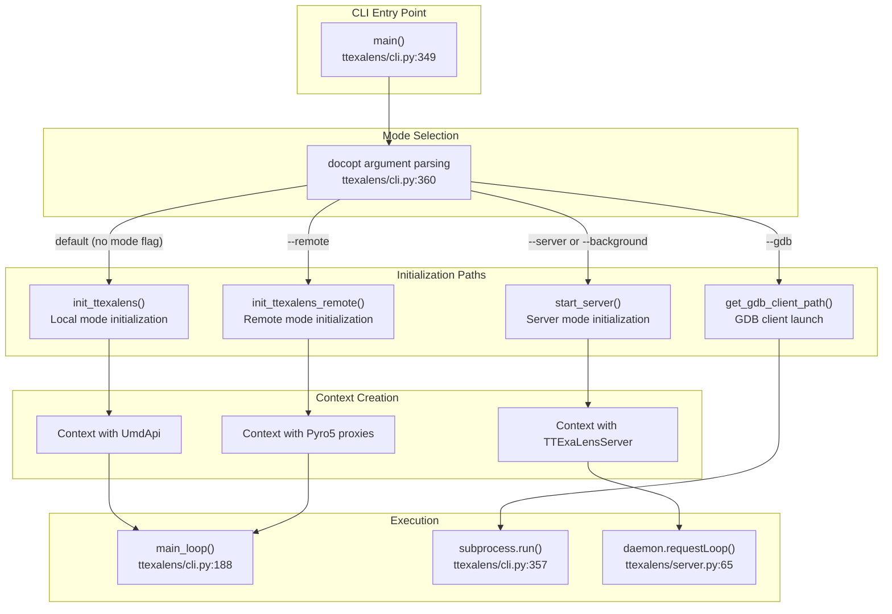
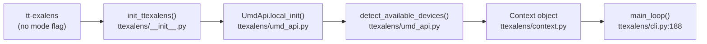
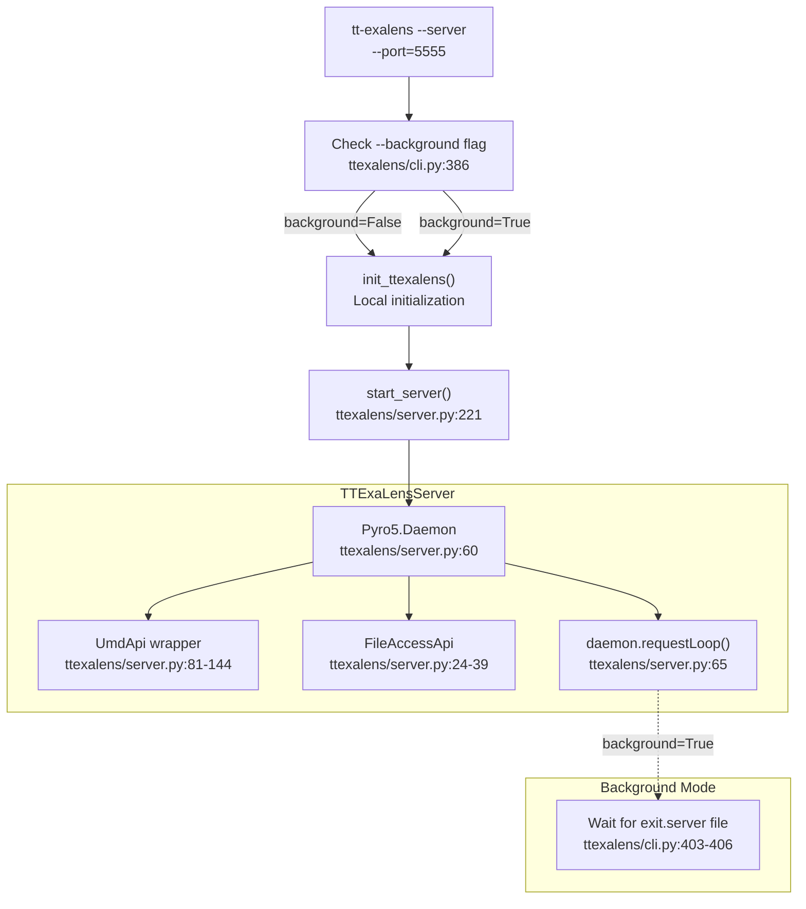
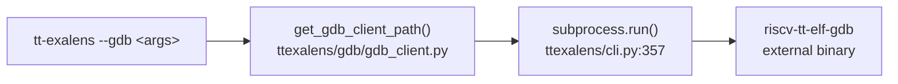
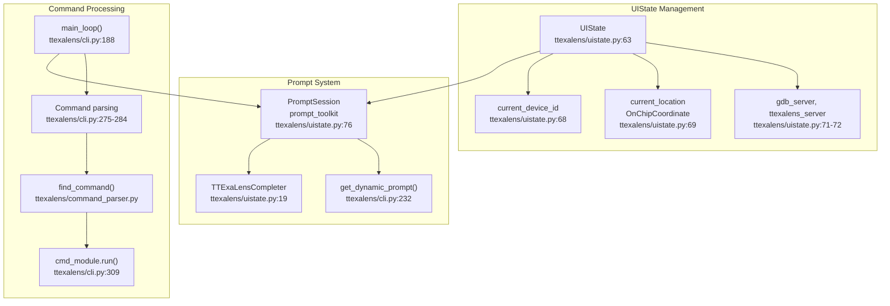
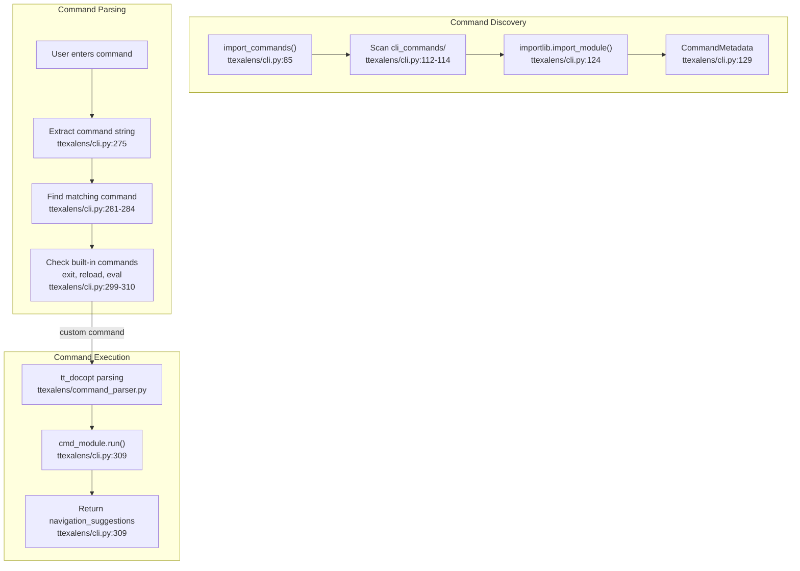
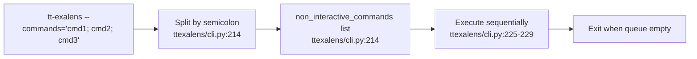

# CLI Modes and Navigation

Relevant source files
*   [test/ttexalens/unit_tests/test_ttexalens_init.py](https://github.com/tenstorrent/tt-exalens/blob/046c35eb/test/ttexalens/unit_tests/test_ttexalens_init.py)
*   [ttexalens/cli.py](https://github.com/tenstorrent/tt-exalens/blob/046c35eb/ttexalens/cli.py)
*   [ttexalens/cli_commands/gdb.py](https://github.com/tenstorrent/tt-exalens/blob/046c35eb/ttexalens/cli_commands/gdb.py)
*   [ttexalens/gdb/gdb_client.py](https://github.com/tenstorrent/tt-exalens/blob/046c35eb/ttexalens/gdb/gdb_client.py)
*   [ttexalens/gdb/gdb_communication.py](https://github.com/tenstorrent/tt-exalens/blob/046c35eb/ttexalens/gdb/gdb_communication.py)
*   [ttexalens/gdb/gdb_server.py](https://github.com/tenstorrent/tt-exalens/blob/046c35eb/ttexalens/gdb/gdb_server.py)
*   [ttexalens/uistate.py](https://github.com/tenstorrent/tt-exalens/blob/046c35eb/ttexalens/uistate.py)

This document describes the command-line interface (CLI) operation modes, initialization procedures, and navigation mechanisms in TTExaLens. It covers how the CLI application (`tt-exalens`) operates in different modes (local, remote, server, GDB client), how the interactive shell functions, and how users navigate between devices and cores.

For information about the underlying device abstraction and coordinate systems used by the CLI, see [System Architecture and Layers](https://deepwiki.com/tenstorrent/tt-exalens/1.1-system-architecture-and-layers) and [Coordinate Systems and Memory Addressing](https://deepwiki.com/tenstorrent/tt-exalens/1.2-coordinate-systems-and-memory-addressing). For details about specific CLI commands available in the shell, see [Device Inspection Commands](https://deepwiki.com/tenstorrent/tt-exalens/4.2-device-inspection-commands), [Memory and Register Commands](https://deepwiki.com/tenstorrent/tt-exalens/4.3-memory-and-register-commands), and other command-specific sections.

* * *

## CLI Modes Overview

TTExaLens CLI supports four primary operation modes, each serving different use cases:

**CLI Mode Dispatch Architecture**

Sources: [ttexalens/cli.py 349-437](https://github.com/tenstorrent/tt-exalens/blob/046c35eb/ttexalens/cli.py#L349-L437)[ttexalens/cli.py 1-42](https://github.com/tenstorrent/tt-exalens/blob/046c35eb/ttexalens/cli.py#L1-L42)

| Mode | Flag | Description | Use Case |
| --- | --- | --- | --- |
| **Local** | (default) | Direct hardware access via PCIe/JTAG | Single-machine debugging |
| **Remote** | `--remote` | Connect to remote TTExaLensServer | Debug hardware on remote machine |
| **Server** | `--server` | Start TTExaLensServer daemon | Expose hardware to remote clients |
| **GDB Client** | `--gdb` | Launch RISC-V GDB client | Connect to GDB server for source-level debugging |

* * *




**CLI Mode Dispatch Architecture**

Sources: [ttexalens/cli.py:349-437](), [ttexalens/cli.py:1-42]()

| Mode | Flag | Description | Use Case |
|------|------|-------------|----------|
| **Local** | (default) | Direct hardware access via PCIe/JTAG | Single-machine debugging |
| **Remote** | `--remote` | Connect to remote TTExaLensServer | Debug hardware on remote machine |
| **Server** | `--server` | Start TTExaLensServer daemon | Expose hardware to remote clients |
| **GDB Client** | `--gdb` | Launch RISC-V GDB client | Connect to GDB server for source-level debugging |

---
```
## Local Mode

Local mode provides direct access to Tenstorrent hardware through the Unified Memory Device (UMD) layer. This is the default mode when no mode flags are specified.

### Initialization

**Local Mode Initialization Flow**

The initialization process in [ttexalens/cli.py 422-427](https://github.com/tenstorrent/tt-exalens/blob/046c35eb/ttexalens/cli.py#L422-L427) creates a `Context` object with direct UMD access:

`context = init_ttexalens(    init_jtag=args["--jtag"],    use_noc1=args["--use-noc1"],    use_4B_mode=False if args["--disable-4B-mode"] else True,    simulation_directory=args["-s"],)`

```mermaid
graph LR
    CLI["tt-exalens --remote"]
    ParseAddr["Parse --remote-address<br/>ttexalens/cli.py:415-417"]
    InitRemote["init_ttexalens_remote()<br/>ttexalens/__init__.py"]
    ConnectServer["connect_to_server()<br/>ttexalens/server.py:254"]
    Pyro5["Pyro5 proxy objects<br/>UmdApi, FileAccessApi"]
    Context["Context with remote APIs"]
    MainLoop["main_loop()<br/>ttexalens/cli.py:188"]
    
    CLI --> ParseAddr
    ParseAddr --> InitRemote
    InitRemote --> ConnectServer
    ConnectServer --> Pyro5
    Pyro5 --> Context
    Context --> MainLoop
```




**Remote Mode Initialization Flow**

The remote initialization in [ttexalens/cli.py:414-420]() establishes RPC connections:

```python
address = args["--remote-address"].split(":")
server_ip = address[0] if address[0] != "" else "localhost"
server_port = address[-1]
context = init_ttexalens_remote(server_ip, int(server_port), use_4B_mode)
```




**Local Mode Initialization Flow**

The initialization process in [ttexalens/cli.py:422-427]() creates a `Context` object with direct UMD access:

```python
context = init_ttexalens(
    init_jtag=args["--jtag"],
    use_noc1=args["--use-noc1"],
    use_4B_mode=False if args["--disable-4B-mode"] else True,
    simulation_directory=args["-s"],
)
```
### Command Line Options

| Option | Default | Description |
| --- | --- | --- |
| `--jtag` | False | Initialize JTAG interface for hardware access |
| `--use-noc1` | False | Use NOC1 instead of NOC0 for communication |
| `--disable-4B-mode` | False | Disable 4-byte addressing mode |
| `-s=<simulation_directory>` | None | Specify simulator build output directory |
| `--verbosity=<level>` | 3 (INFO) | Set logging verbosity (1=ERROR, 2=WARN, 3=INFO, 4=VERBOSE, 5=DEBUG) |

Sources: [ttexalens/cli.py 1-42](https://github.com/tenstorrent/tt-exalens/blob/046c35eb/ttexalens/cli.py#L1-L42)[ttexalens/cli.py 422-427](https://github.com/tenstorrent/tt-exalens/blob/046c35eb/ttexalens/cli.py#L422-L427)

* * *

## Remote Mode

Remote mode allows the CLI to connect to a `TTExaLensServer` running on another machine, enabling distributed debugging scenarios.

### Initialization

**Remote Mode Initialization Flow**

The remote initialization in [ttexalens/cli.py 414-420](https://github.com/tenstorrent/tt-exalens/blob/046c35eb/ttexalens/cli.py#L414-L420) establishes RPC connections:

`address = args["--remote-address"].split(":")server_ip = address[0] if address[0] != "" else "localhost"server_port = address[-1]context = init_ttexalens_remote(server_ip, int(server_port), use_4B_mode)`
### Remote Architecture Components

The remote connection uses Pyro5 for RPC communication. Two proxy objects are created:

1.   **UmdApi Proxy**: Wraps all UMD device operations and forwards them to the server
2.   **FileAccessApi Proxy**: Provides remote file system access for reading ELF files and other artifacts

The proxies are transparent to the rest of the application - the same `Context` interface is used regardless of local or remote operation.

Sources: [ttexalens/cli.py 414-420](https://github.com/tenstorrent/tt-exalens/blob/046c35eb/ttexalens/cli.py#L414-L420)[ttexalens/server.py 254-278](https://github.com/tenstorrent/tt-exalens/blob/046c35eb/ttexalens/server.py#L254-L278)[ttexalens/server.py 232-252](https://github.com/tenstorrent/tt-exalens/blob/046c35eb/ttexalens/server.py#L232-L252)

* * *

## Server Mode

Server mode starts a `TTExaLensServer` that exposes device access to remote clients via Pyro5 RPC.

### Server Initialization

**Server Mode Architecture**




**Server Mode Architecture**
```
### Background vs Foreground

The server can run in two modes:

**Foreground Mode** (default): Server runs and enters the interactive shell. Useful for debugging or when you need both server and interactive access.

**Background Mode** (`--background`): Server runs detached from the terminal. Exit by creating an `exit.server` file:

`touch exit.server`
The background server implementation is in [ttexalens/cli.py 386-410](https://github.com/tenstorrent/tt-exalens/blob/046c35eb/ttexalens/cli.py#L386-L410)

### Server Components

The `TTExaLensServer` class wraps and exposes:

1.   **UmdApi**: Device operations (NOC read/write, device discovery)
2.   **FileAccessApi**: Remote file system access (ELF files, logs)

The wrapper in [ttexalens/server.py 81-144](https://github.com/tenstorrent/tt-exalens/blob/046c35eb/ttexalens/server.py#L81-L144) automatically creates Pyro5 proxies for complex return types, enabling seamless remote object access.

Sources: [ttexalens/cli.py 385-412](https://github.com/tenstorrent/tt-exalens/blob/046c35eb/ttexalens/cli.py#L385-L412)[ttexalens/server.py 41-145](https://github.com/tenstorrent/tt-exalens/blob/046c35eb/ttexalens/server.py#L41-L145)[ttexalens/server.py 221-230](https://github.com/tenstorrent/tt-exalens/blob/046c35eb/ttexalens/server.py#L221-L230)

* * *

## GDB Client Mode

The `--gdb` flag launches the RISC-V GDB client, which can connect to a GDB server started from another TTExaLens instance.

**GDB Client Launch Flow**

This mode simply locates and launches the RISC-V GDB binary with the provided arguments:

`if len(sys.argv) > 1 and sys.argv[1] == "--gdb":    gdb_client_path = get_gdb_client_path()    gdb_client_args = sys.argv[2:]    subprocess.run([gdb_client_path] + gdb_client_args)    return`
Example usage:

`tt-exalens --gdb -ex "target remote localhost:9999"`
Sources: [ttexalens/cli.py 350-358](https://github.com/tenstorrent/tt-exalens/blob/046c35eb/ttexalens/cli.py#L350-L358)

* * *




**GDB Client Launch Flow**

This mode simply locates and launches the RISC-V GDB binary with the provided arguments:

```python
if len(sys.argv) > 1 and sys.argv[1] == "--gdb":
    gdb_client_path = get_gdb_client_path()
    gdb_client_args = sys.argv[2:]
    subprocess.run([gdb_client_path] + gdb_client_args)
    return
```

Example usage:
```bash
tt-exalens --gdb -ex "target remote localhost:9999"
```

Sources: [ttexalens/cli.py:350-358]()

---
```
## Interactive Shell

The interactive shell provides a REPL (Read-Eval-Print Loop) for executing commands and navigating the device.

### Shell Components

**Interactive Shell Architecture**




**Interactive Shell Architecture**
```
### Dynamic Prompt

The prompt displays current state information and updates dynamically:

```
server:5555 gdb:9999(connected) [4B MODE] noc:0 device:0 loc:1-2 (0,0) >
```

Components shown in the prompt (from [ttexalens/cli.py 232-255](https://github.com/tenstorrent/tt-exalens/blob/046c35eb/ttexalens/cli.py#L232-L255)):

| Component | Description | Source Variable |
| --- | --- | --- |
| `server:<port>` | TTExaLens server running on this instance | `ui_state.ttexalens_server.port` |
| `gdb:<port>` | GDB server status and connection state | `ui_state.gdb_server.server.port` |
| `[4B MODE]` | 4-byte addressing mode enabled | `ui_state.context.use_4B_mode` |
| `noc:<id>` | Current NOC being used (0 or 1) | `ui_state.context.use_noc1` |
| `device:<id>` | Current device ID | `ui_state.current_device_id` |
| `loc:<coord>` | Current core location | `ui_state.current_location` |

### Command Completion

The `TTExaLensCompleter` class provides tab-completion for:

1.   **Command names**: All registered command long and short names
2.   **Address symbols**: Variables/functions from loaded ELF files (prefix with `@`)

The completion logic is implemented in [ttexalens/uistate.py 37-49](https://github.com/tenstorrent/tt-exalens/blob/046c35eb/ttexalens/uistate.py#L37-L49):

`def get_completions(self, document, complete_event):    prompt_current_word = document.get_word_before_cursor(...)    prompt_text = document.text_before_cursor    # 1. Complete command names if first word    if " " not in prompt_text:        for command in self.lookup_commands(prompt_current_word):            yield Completion(command, start_position=-len(prompt_current_word))    # 2. Complete @symbol addresses from ELF    elif prompt_current_word.startswith("@"):        for address in self.fuzzy_lookup_addresses(addr_part):            yield Completion(f"@{address}", start_position=-len(prompt_current_word))`
Sources: [ttexalens/uistate.py 63-122](https://github.com/tenstorrent/tt-exalens/blob/046c35eb/ttexalens/uistate.py#L63-L122)[ttexalens/cli.py 188-347](https://github.com/tenstorrent/tt-exalens/blob/046c35eb/ttexalens/cli.py#L188-L347)[ttexalens/uistate.py 19-50](https://github.com/tenstorrent/tt-exalens/blob/046c35eb/ttexalens/uistate.py#L19-L50)

* * *

## Command Execution Flow

Commands are discovered, parsed, and executed through a plugin-like architecture.

**Command Execution Flow**




**Command Execution Flow**
```
### Command Discovery

Commands are loaded from the `cli_commands/` directory at startup. Each command file exports a `command_metadata` object:

`commands = import_commands()context.assign_commands(commands)`
The discovery process in [ttexalens/cli.py 85-152](https://github.com/tenstorrent/tt-exalens/blob/046c35eb/ttexalens/cli.py#L85-L152):

1.   Walk `cli_commands/` directory
2.   Import each `.py` file as a module
3.   Extract `command_metadata` from module
4.   Register command by `long_name` and `short_name`
5.   Check for naming conflicts

### Built-in Commands

Three commands are hard-coded in [ttexalens/cli.py 87-109](https://github.com/tenstorrent/tt-exalens/blob/046c35eb/ttexalens/cli.py#L87-L109):

| Command | Short | Purpose |
| --- | --- | --- |
| `exit` | `x` | Exit the program with optional exit code |
| `reload` | `rl` | Hot-reload command modules (development) |
| `eval` | `ev` | Evaluate Python expression |

### Command Execution

When a command is executed:

1.   Match user input to registered command (long or short name)
2.   Parse arguments using `tt_docopt`
3.   Call `cmd_module.run(cmd_raw, context, ui_state)`
4.   Return navigation suggestions (if any)

Sources: [ttexalens/cli.py 85-152](https://github.com/tenstorrent/tt-exalens/blob/046c35eb/ttexalens/cli.py#L85-L152)[ttexalens/cli.py 188-347](https://github.com/tenstorrent/tt-exalens/blob/046c35eb/ttexalens/cli.py#L188-L347)

* * *

## Navigation System

The navigation system helps users move between devices and cores efficiently.

### Speed Dial Navigation

Commands can return navigation suggestions that appear as a numbered menu:

```
Speed dial:
#  Description                   Command
0  View RISC status on core 0,0  device
1  Read memory at core 0,1       brxy 0,1 0x1000
2  Check callstack              bt sample.elf
```

Users can type the number instead of the full command:

`if type(cmd_int) == int:    if navigation_suggestions and cmd_int >= 0 and cmd_int < len(navigation_suggestions):        cmd_raw = navigation_suggestions[cmd_int]["cmd"]`
Implementation in [ttexalens/cli.py 268-273](https://github.com/tenstorrent/tt-exalens/blob/046c35eb/ttexalens/cli.py#L268-L273)

### Location Tracking

The `UIState` class maintains:

*   **current_device_id**: Active device (integer ID)
*   **current_location**: Active core (`OnChipCoordinate` object)

Commands that operate on specific locations use these defaults when location is not specified.

`class UIState:    def __init__(self, context: Context) -> None:        self.current_device_id: int = context.device_ids[0]        self.current_location = OnChipCoordinate.create("0,0", self.current_device)`
Commands can modify these values to change the context for subsequent commands.

### Navigation Suggestions Format

Navigation suggestions are dictionaries with:

`{    'description': 'Human-readable description',    'cmd': 'Command to execute'}`
Sources: [ttexalens/cli.py 68-81](https://github.com/tenstorrent/tt-exalens/blob/046c35eb/ttexalens/cli.py#L68-L81)[ttexalens/cli.py 268-273](https://github.com/tenstorrent/tt-exalens/blob/046c35eb/ttexalens/cli.py#L268-L273)[ttexalens/uistate.py 64-72](https://github.com/tenstorrent/tt-exalens/blob/046c35eb/ttexalens/uistate.py#L64-L72)

* * *

## Non-Interactive Usage

Commands can be executed non-interactively using the `--commands` flag.

### Batch Command Execution

**Non-Interactive Command Execution**




**Non-Interactive Command Execution**
```
### Command Format

`tt-exalens --commands="device; brxy 0,0 0x1000 16; x"`
Commands are separated by semicolons and executed in order. The session exits when all commands complete.

### Output Redirection

Commands support output redirection to files:

| Syntax | Behavior |
| --- | --- |
| `cmd > file` | Write output to file (overwrite) |
| `cmd >> file` | Append output to file |
| `cmd |> file` | Write output to file only (no terminal) |
| `cmd |>> file` | Append output to file only (no terminal) |

Implementation in [ttexalens/cli.py 155-186](https://github.com/tenstorrent/tt-exalens/blob/046c35eb/ttexalens/cli.py#L155-L186):

`file_output = extract_command_file_output(cmd_raw)with redirect_command_output_to_file(file_output) as terminal_override:    # Execute command`
### Error Handling

The `--test` flag changes error behavior:

*   **Default**: Exceptions are caught and displayed, execution continues
*   **With `--test`**: Exceptions cause immediate exit with non-zero exit code

This is useful for CI/CD pipelines that need to detect failures.

Sources: [ttexalens/cli.py 214-230](https://github.com/tenstorrent/tt-exalens/blob/046c35eb/ttexalens/cli.py#L214-L230)[ttexalens/cli.py 155-186](https://github.com/tenstorrent/tt-exalens/blob/046c35eb/ttexalens/cli.py#L155-L186)[ttexalens/cli.py 322-330](https://github.com/tenstorrent/tt-exalens/blob/046c35eb/ttexalens/cli.py#L322-L330)

* * *

## Command Import and Reload

The command system supports hot-reloading for development.

### Command Module Structure

Each command in `cli_commands/` exports:

`command_metadata = CommandMetadata(    long_name="device",    short_name="d",    type="inspection",    description="...",  # Docopt string    context=["limited"]) def run(cmd_raw: str, context: Context, ui_state: UIState):    # Command implementation    return navigation_suggestions`
### Reload Mechanism

The `reload` command hot-reloads all command modules:

`if found_command.long_name == "reload":    import_commands(reload=True)`
This calls `importlib.reload()` on each command module, allowing developers to modify commands without restarting the CLI.

The reload implementation in [ttexalens/cli.py 302-303](https://github.com/tenstorrent/tt-exalens/blob/046c35eb/ttexalens/cli.py#L302-L303) uses the same `import_commands()` function with `reload=True`, which triggers `importlib.reload(cmd_module)` in [ttexalens/cli.py 138](https://github.com/tenstorrent/tt-exalens/blob/046c35eb/ttexalens/cli.py#L138-L138)

Sources: [ttexalens/cli.py 85-152](https://github.com/tenstorrent/tt-exalens/blob/046c35eb/ttexalens/cli.py#L85-L152)[ttexalens/cli.py 302-303](https://github.com/tenstorrent/tt-exalens/blob/046c35eb/ttexalens/cli.py#L302-L303)

This wiki is featured in the [repository](https://github.com/tenstorrent/tt-exalens/blob/main/README.md)

Dismiss
Refresh this wiki

Enter email to refresh
