# Memory and Register Commands

Relevant source files
*   [docs/ttexalens-app-docs.md](https://github.com/tenstorrent/tt-exalens/blob/046c35eb/docs/ttexalens-app-docs.md?plain=1)
*   [docs/ttexalens-lib-docs.md](https://github.com/tenstorrent/tt-exalens/blob/046c35eb/docs/ttexalens-lib-docs.md?plain=1)
*   [test/ttexalens/unit_tests/test_device.py](https://github.com/tenstorrent/tt-exalens/blob/046c35eb/test/ttexalens/unit_tests/test_device.py)
*   [test/ttexalens/unit_tests/test_lib.py](https://github.com/tenstorrent/tt-exalens/blob/046c35eb/test/ttexalens/unit_tests/test_lib.py)
*   [test/ttexalens/unit_tests/test_tensix_debug.py](https://github.com/tenstorrent/tt-exalens/blob/046c35eb/test/ttexalens/unit_tests/test_tensix_debug.py)
*   [ttexalens/__init__.py](https://github.com/tenstorrent/tt-exalens/blob/046c35eb/ttexalens/__init__.py)
*   [ttexalens/coordinate.py](https://github.com/tenstorrent/tt-exalens/blob/046c35eb/ttexalens/coordinate.py)
*   [ttexalens/debug_tensix.py](https://github.com/tenstorrent/tt-exalens/blob/046c35eb/ttexalens/debug_tensix.py)
*   [ttexalens/elf_loader.py](https://github.com/tenstorrent/tt-exalens/blob/046c35eb/ttexalens/elf_loader.py)
*   [ttexalens/tt_exalens_lib.py](https://github.com/tenstorrent/tt-exalens/blob/046c35eb/ttexalens/tt_exalens_lib.py)

## Purpose and Scope

This page documents the CLI commands and underlying API for memory and register access operations in TTExaLens. These commands allow users to read and write memory locations and configuration/debug registers on Tenstorrent devices.

For information about RISC-V debug commands (callstacks, GPR dumps), see [4.4](https://deepwiki.com/tenstorrent/tt-exalens/4.4-risc-v-debug-commands). For Tensix-specific debugging commands, see [4.5](https://deepwiki.com/tenstorrent/tt-exalens/4.5-tensix-debug-commands). For the Python library API for these operations, see [3.3](https://deepwiki.com/tenstorrent/tt-exalens/3.3-memory-access-operations) (Memory Access) and [3.4](https://deepwiki.com/tenstorrent/tt-exalens/3.4-register-access) (Register Access).

* * *


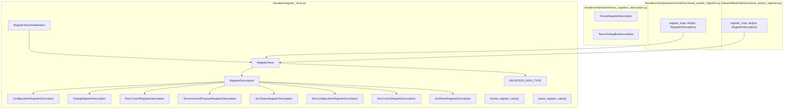

Sources: [ttexalens/register_store.py:1-20](), [ttexalens/hardware/tensix_registers_description.py](), [ttexalens/hardware/wormhole/functional_worker_registers.py:1-15](), [ttexalens/hardware/blackhole/functional_worker_registers.py:1-15]()

---
```
## Memory Access: The `brxy` Command

### Command Overview

The `brxy` (burst-read-xy) command reads blocks of memory data from specified core locations on the device. It is the primary CLI tool for inspecting memory contents.

**Usage:**

```
brxy <core-loc> <addr> [<word-count>] [--format=<F>] [--sample <N>] [-o <O>...] [-d <D>...]
```

**Arguments:**

*   `core-loc`: Core location in X-Y (noc0/translated), R,C (logical), or channel format (e.g., `ch3`, `d0,0`)
*   `addr`: Memory address to read from (hexadecimal or decimal)
*   `word-count`: Number of 4-byte words to read (default: 1)

**Options:**

*   `--format=<F>`: Output format - `i8`, `i16`, `i32`, `hex8`, `hex16`, `hex32` (default: `hex32`)
*   `--sample <N>`: Sample mode - continuously read for N seconds (default: 0, single read)
*   `-o <O>`: Address offset(s) - repeatable for multiple offsets
*   `-d <D>`: Device ID (default: current device)

Sources: [docs/ttexalens-app-docs.md 1-112](https://github.com/tenstorrent/tt-exalens/blob/046c35eb/docs/ttexalens-app-docs.md?plain=1#L1-L112)

* * *

### Memory Access Flow Diagram

Sources: [ttexalens/tt_exalens_lib.py 87-107](https://github.com/tenstorrent/tt-exalens/blob/046c35eb/ttexalens/tt_exalens_lib.py#L87-L107)[ttexalens/coordinate.py 327-336](https://github.com/tenstorrent/tt-exalens/blob/046c35eb/ttexalens/coordinate.py#L327-L336)

* * *


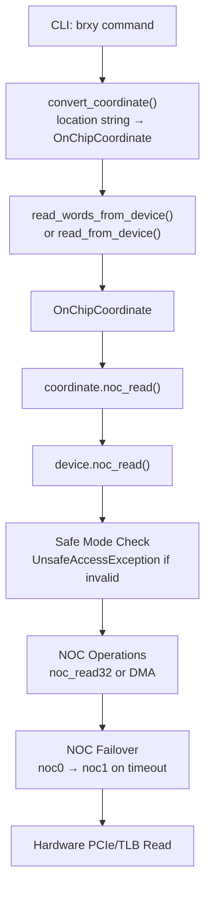

Sources: [ttexalens/tt_exalens_lib.py:87-107](), [ttexalens/coordinate.py:327-336]()

---
```
## Memory Read Operations

### Core API Functions

The Python API provides three primary memory read functions:

| Function | Purpose | Returns |
| --- | --- | --- |
| `read_word_from_device()` | Read single 4-byte word | `int` |
| `read_words_from_device()` | Read multiple 4-byte words | `list[int]` |
| `read_from_device()` | Read arbitrary byte count | `bytes` |

All functions support:

*   **NOC selection**: `noc_id` parameter (0 or 1)
*   **Safe mode**: `safe_mode` parameter validates memory map access
*   **DMA optimization**: Automatic DMA for large transfers
*   **Unaligned access**: Read from non-4-byte-aligned addresses

Sources: [ttexalens/tt_exalens_lib.py 109-216](https://github.com/tenstorrent/tt-exalens/blob/046c35eb/ttexalens/tt_exalens_lib.py#L109-L216)

* * *

### Memory Read Architecture

Sources: [ttexalens/tt_exalens_lib.py 109-216](https://github.com/tenstorrent/tt-exalens/blob/046c35eb/ttexalens/tt_exalens_lib.py#L109-L216)[ttexalens/coordinate.py 327-339](https://github.com/tenstorrent/tt-exalens/blob/046c35eb/ttexalens/coordinate.py#L327-L339)

* * *


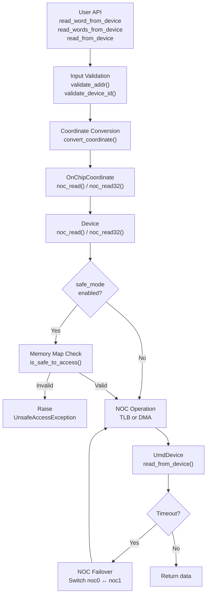

Sources: [ttexalens/tt_exalens_lib.py:109-216](), [ttexalens/coordinate.py:327-339]()

---
```
## Memory Write Operations

### Core API Functions

Memory write operations mirror the read operations:

| Function | Purpose | Input Data Type |
| --- | --- | --- |
| `write_words_to_device()` | Write word(s) | `int` or `list[int]` |
| `write_to_device()` | Write arbitrary bytes | `bytes` or `list[int]` |

Both functions support:

*   **Single or batch writes**: Single word or multiple words/bytes
*   **NOC selection**: Choose between noc0 and noc1
*   **Safe mode**: Optional memory map validation
*   **Unaligned writes**: Write to non-4-byte-aligned addresses

Sources: [ttexalens/tt_exalens_lib.py 218-292](https://github.com/tenstorrent/tt-exalens/blob/046c35eb/ttexalens/tt_exalens_lib.py#L218-L292)

* * *

### Unaligned Memory Access

TTExaLens supports unaligned memory reads and writes through a read-modify-write mechanism:

For writes:

Sources: [test/ttexalens/unit_tests/test_lib.py 284-360](https://github.com/tenstorrent/tt-exalens/blob/046c35eb/test/ttexalens/unit_tests/test_lib.py#L284-L360)

* * *


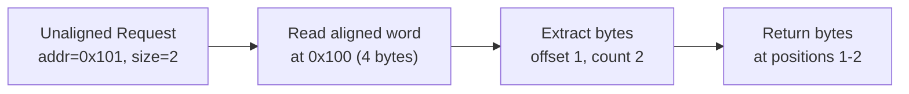

For writes:
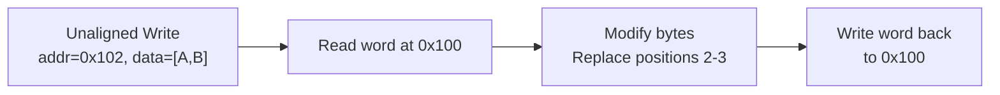

Sources: [test/ttexalens/unit_tests/test_lib.py:284-360]()

---
```
## Register Access Commands

### Register Types

TTExaLens supports two types of registers:

1.   **Configuration Registers**: Indexed registers with mask and shift for bit field access

    *   Class: `ConfigurationRegisterDescription(index, mask, shift)`
    *   Example: `ALU_FORMAT_SPEC_REG2_Dstacc`

2.   **Debug Registers**: Direct address-based registers

    *   Class: `DebugRegisterDescription(offset)`
    *   Example: `RISCV_DEBUG_REG_DBG_BUS_CNTL_REG`

Both register types can be accessed by name (string) or by description object.

Sources: [ttexalens/tt_exalens_lib.py 498-572](https://github.com/tenstorrent/tt-exalens/blob/046c35eb/ttexalens/tt_exalens_lib.py#L498-L572)[test/ttexalens/unit_tests/test_lib.py 361-466](https://github.com/tenstorrent/tt-exalens/blob/046c35eb/test/ttexalens/unit_tests/test_lib.py#L361-L466)

* * *

### Register Access API

Sources: [ttexalens/tt_exalens_lib.py 498-572](https://github.com/tenstorrent/tt-exalens/blob/046c35eb/ttexalens/tt_exalens_lib.py#L498-L572)

* * *


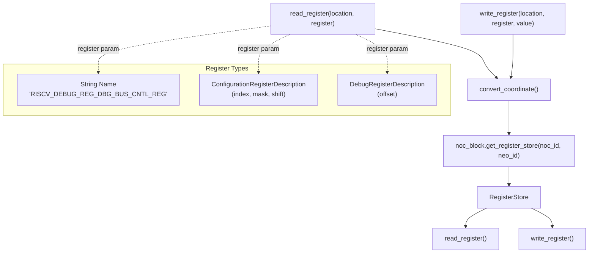

Sources: [ttexalens/tt_exalens_lib.py:498-572]()

---
```
### Configuration Register Access

Configuration registers use an indexed addressing scheme with bit masking:

For writes, the process includes read-modify-write:

Sources: [test/ttexalens/unit_tests/test_lib.py 361-396](https://github.com/tenstorrent/tt-exalens/blob/046c35eb/test/ttexalens/unit_tests/test_lib.py#L361-L396)[test/ttexalens/unit_tests/test_lib.py 467-521](https://github.com/tenstorrent/tt-exalens/blob/046c35eb/test/ttexalens/unit_tests/test_lib.py#L467-L521)

* * *


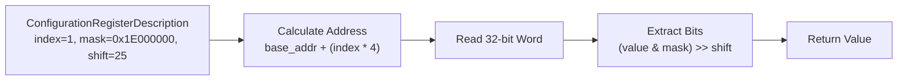

For writes, the process includes read-modify-write:
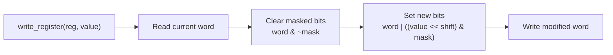

Sources: [test/ttexalens/unit_tests/test_lib.py:361-396](), [test/ttexalens/unit_tests/test_lib.py:467-521]()

---
```
### Debug Register Access

Debug registers use direct address-based access:

Sources: [test/ttexalens/unit_tests/test_lib.py 397-438](https://github.com/tenstorrent/tt-exalens/blob/046c35eb/test/ttexalens/unit_tests/test_lib.py#L397-L438)

* * *


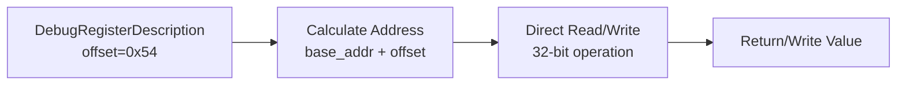

Sources: [test/ttexalens/unit_tests/test_lib.py:397-438]()

---
```
## Safe Mode Memory Protection

### Memory Map Validation

Safe mode provides protection against accidental writes to critical memory regions:

Safe regions typically include:

*   **L1 memory**: General-purpose L1 data
*   **Private memory**: Core-specific private regions (when accessible)
*   **DRAM banks**: DRAM channel memory

Unsafe regions (blocked in safe mode):

*   **Configuration registers**: Critical system configuration
*   **Debug registers**: Debug and control registers
*   **Unknown regions**: Unmapped or reserved areas

Sources: [ttexalens/tt_exalens_lib.py 109-216](https://github.com/tenstorrent/tt-exalens/blob/046c35eb/ttexalens/tt_exalens_lib.py#L109-L216)[ttexalens/device.py (inferred from safe_mode usage)](https://github.com/tenstorrent/tt-exalens/blob/046c35eb/ttexalens/device.py%20(inferred%20from%20safe_mode%20usage))

* * *


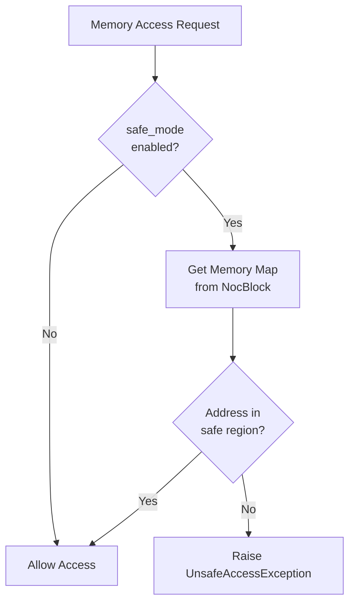

Safe regions typically include:
- **L1 memory**: General-purpose L1 data
- **Private memory**: Core-specific private regions (when accessible)
- **DRAM banks**: DRAM channel memory

Unsafe regions (blocked in safe mode):
- **Configuration registers**: Critical system configuration
- **Debug registers**: Debug and control registers
- **Unknown regions**: Unmapped or reserved areas

Sources: [ttexalens/tt_exalens_lib.py:109-216](), [ttexalens/device.py (inferred from safe_mode usage)]()

---
```
## DMA and Performance Optimization

### Automatic DMA Threshold

TTExaLens automatically switches to DMA for large transfers:

**Default DMA Threshold**: Configured per context, typically optimized for 1KB+ transfers

**Benefits:**

*   **TLB Mode**: Low latency for small reads (< 256 bytes)
*   **DMA Mode**: High throughput for bulk transfers (> 1KB)

Sources: [test/ttexalens/unit_tests/test_lib.py 127-145](https://github.com/tenstorrent/tt-exalens/blob/046c35eb/test/ttexalens/unit_tests/test_lib.py#L127-L145)

* * *


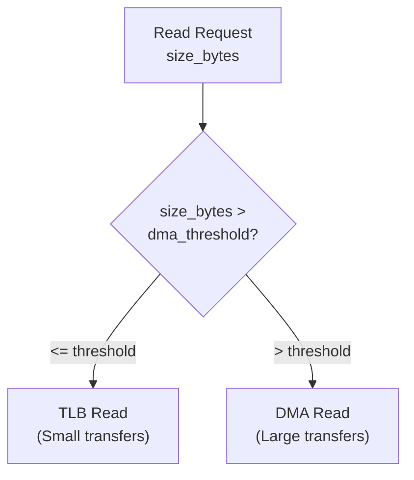

**Default DMA Threshold**: Configured per context, typically optimized for 1KB+ transfers

**Benefits:**
- **TLB Mode**: Low latency for small reads (< 256 bytes)
- **DMA Mode**: High throughput for bulk transfers (> 1KB)

Sources: [test/ttexalens/unit_tests/test_lib.py:127-145]()

---
```
## NOC Failover Mechanism

### Automatic NOC Switching

TTExaLens implements automatic failover between NOC0 and NOC1 on timeout:

**Use Cases:**

*   **Network congestion**: NOC0 saturated, NOC1 available
*   **Hardware issues**: NOC path blocked, alternate route succeeds
*   **Debugging**: Force alternate NOC path for testing

Sources: [ttexalens/tt_exalens_lib.py 65-69](https://github.com/tenstorrent/tt-exalens/blob/046c35eb/ttexalens/tt_exalens_lib.py#L65-L69) (noc_id handling)

* * *

## Sampling Mode

### Continuous Memory Monitoring

The `brxy` command supports continuous sampling for monitoring changing memory values:

`brxy 0,0 0x100 1 --sample 5`
This reads the specified address repeatedly for 5 seconds, reporting:

*   **Sample count**: Number of times the value was read
*   **Value stability**: Whether the value changed during sampling
*   **Frequency**: Effective sampling rate

**Output Example:**

```
Sampling for 0.15625 seconds...
1-2 (0,0) (l1) 0x00000100 => 0xffb00537 (4289725751) - 20274 times
```

Sources: [docs/ttexalens-app-docs.md 71-97](https://github.com/tenstorrent/tt-exalens/blob/046c35eb/docs/ttexalens-app-docs.md?plain=1#L71-L97)

* * *

## Command Examples

### Basic Memory Reads

**Read single word:**

`brxy 0,0 0x100`
Output:

```
1-1 (0,0) : 0x00000100 (4 total bytes)
(l1) : 0x00000100 (4 bytes)
0x00000100:  ffb00537
```

**Read 16 words:**

`brxy 0,0 0x100 16`
Output:

```
1-1 (0,0) : 0x00000100 (64 total bytes)
(l1) : 0x00000100 (64 bytes)
0x00000100:  ffb00537  ffb00637  01860613  00052703
0x00000110:  00060793  00e62023  0007a703  ffc78793
0x00000120:  00e7a023  fea79ae3  fe5ff06f  00000000
0x00000130:  00000000  00000000  00000000  00000000
```

Sources: [docs/ttexalens-app-docs.md 31-53](https://github.com/tenstorrent/tt-exalens/blob/046c35eb/docs/ttexalens-app-docs.md?plain=1#L31-L53)

* * *

### Format Options

**Integer 8-bit format:**

`brxy 0,0 0x100 8 --format i8`
**Hexadecimal 16-bit format:**

`brxy 0,0 0x100 8 --format hex16`
Sources: [docs/ttexalens-app-docs.md 54-70](https://github.com/tenstorrent/tt-exalens/blob/046c35eb/docs/ttexalens-app-docs.md?plain=1#L54-L70)

* * *

### DRAM Channel Access

**Read from DRAM channel 0:**

`brxy ch0 0x100 16`
Output:

```
0-0 (d0,0) : 0x00000100 (64 total bytes)
(dram_bank) : 0x00000100 (64 bytes)
0x00000100:  000000fb  55555555  55555555  55555555
0x00000110:  55555555  55555555  55555555  55555555
```

Sources: [docs/ttexalens-app-docs.md 99-111](https://github.com/tenstorrent/tt-exalens/blob/046c35eb/docs/ttexalens-app-docs.md?plain=1#L99-L111)

* * *

## Python API Usage Examples

### Memory Operations

**Read words:**

`import ttexalens as tt # Read single wordvalue = tt.read_word_from_device("0,0", 0x100) # Read multiple wordsvalues = tt.read_words_from_device("0,0", 0x100, word_count=16) # Read bytesdata = tt.read_from_device("0,0", 0x100, num_bytes=64)`
**Write operations:**

`# Write single wordtt.write_words_to_device("0,0", 0x100, 0xDEADBEEF) # Write multiple wordstt.write_words_to_device("0,0", 0x100, [0x12345678, 0x90ABCDEF]) # Write bytestt.write_to_device("0,0", 0x100, b"Hello")`
Sources: [test/ttexalens/unit_tests/test_lib.py 91-220](https://github.com/tenstorrent/tt-exalens/blob/046c35eb/test/ttexalens/unit_tests/test_lib.py#L91-L220)

* * *


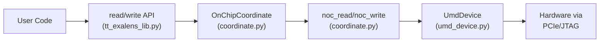

**Core Functions:**
- `read_word_from_device()` / `read_words_from_device()` / `read_from_device()` - memory reads
- `write_words_to_device()` / `write_to_device()` - memory writes
- `read_register()` / `write_register()` - configuration and debug register access
```
### Register Operations

**Read register by name:**

`# Configuration registervalue = tt.read_register("0,0", "ALU_FORMAT_SPEC_REG2_Dstacc") # Debug registervalue = tt.read_register("0,0", "RISCV_DEBUG_REG_DBG_BUS_CNTL_REG")`
**Read register by description:**

`from ttexalens.register_store import ConfigurationRegisterDescription reg_desc = ConfigurationRegisterDescription(index=1, mask=0x1E000000, shift=25)value = tt.read_register("0,0", reg_desc)`
**Write register:**

`tt.write_register("0,0", "ALU_FORMAT_SPEC_REG2_Dstacc", 10)`
Sources: [test/ttexalens/unit_tests/test_lib.py 377-437](https://github.com/tenstorrent/tt-exalens/blob/046c35eb/test/ttexalens/unit_tests/test_lib.py#L377-L437)[test/ttexalens/unit_tests/test_lib.py 467-521](https://github.com/tenstorrent/tt-exalens/blob/046c35eb/test/ttexalens/unit_tests/test_lib.py#L467-L521)

* * *

## Advanced Features

### Context Parameters

Memory and register operations respect context-level parameters:

| Parameter | Purpose | Default |
| --- | --- | --- |
| `use_noc1` | Use NOC1 instead of NOC0 | `False` |
| `use_4B_mode` | Use 4-byte TLB mode | `True` |
| `safe_mode` | Enable memory map validation | `True` |
| `noc_failover` | Enable automatic NOC failover | `True` |

These can be overridden per-operation via function parameters.

Sources: [ttexalens/tt_exalens_lib.py 65-76](https://github.com/tenstorrent/tt-exalens/blob/046c35eb/ttexalens/tt_exalens_lib.py#L65-L76)

* * *

### Multiple Device Support

All commands support multi-device systems via the `-d` / `--device` flag:

`# Read from device 0brxy -d 0 0,0 0x100 # Read from device 1brxy -d 1 0,0 0x100`
Sources: [docs/ttexalens-app-docs.md 116-117](https://github.com/tenstorrent/tt-exalens/blob/046c35eb/docs/ttexalens-app-docs.md?plain=1#L116-L117)

* * *

## Related Subsystems

### Memory Access Pipeline


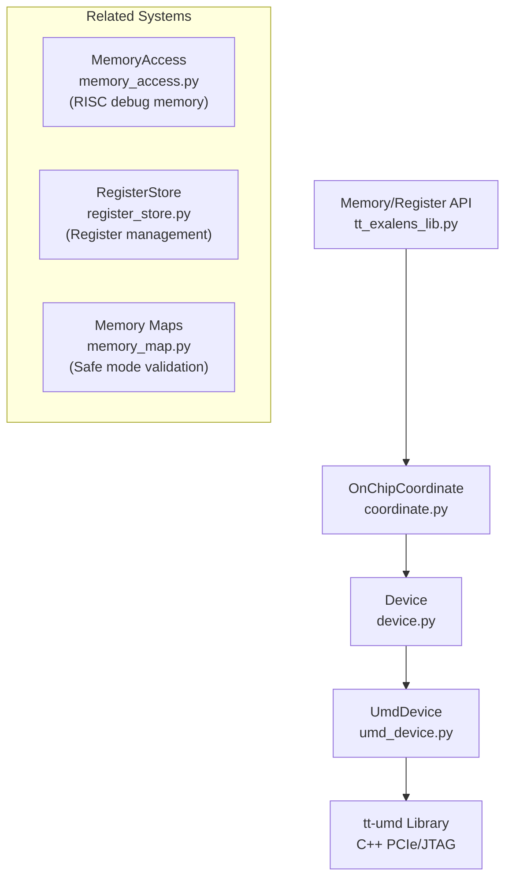

Sources: [ttexalens/tt_exalens_lib.py:1-700](), [ttexalens/coordinate.py:1-354]()
2d:T585f,
```

Sources: [ttexalens/tt_exalens_lib.py 1-700](https://github.com/tenstorrent/tt-exalens/blob/046c35eb/ttexalens/tt_exalens_lib.py#L1-L700)[ttexalens/coordinate.py 1-354](https://github.com/tenstorrent/tt-exalens/blob/046c35eb/ttexalens/coordinate.py#L1-L354)

This wiki is featured in the [repository](https://github.com/tenstorrent/tt-exalens/blob/main/README.md)

Dismiss
Refresh this wiki

Enter email to refresh
