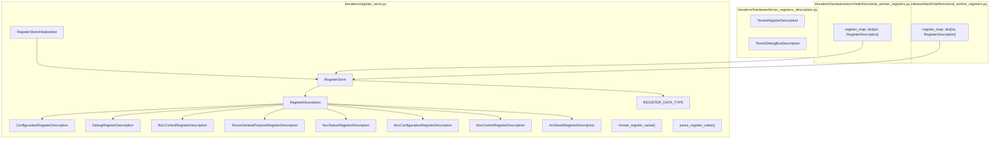
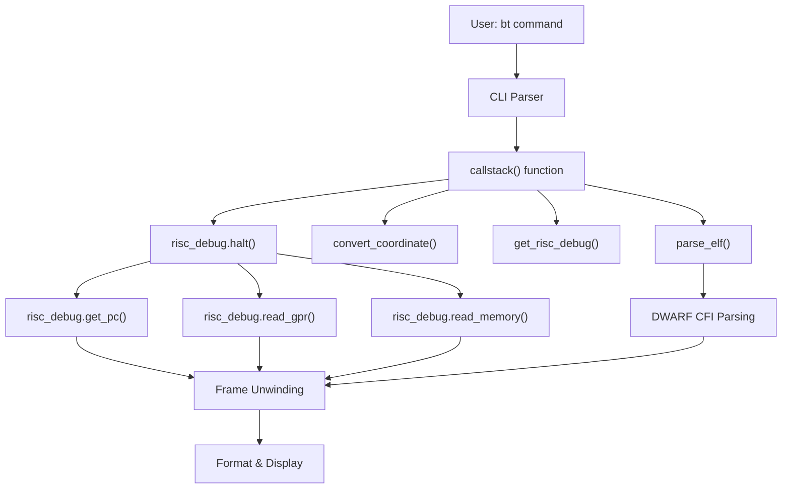
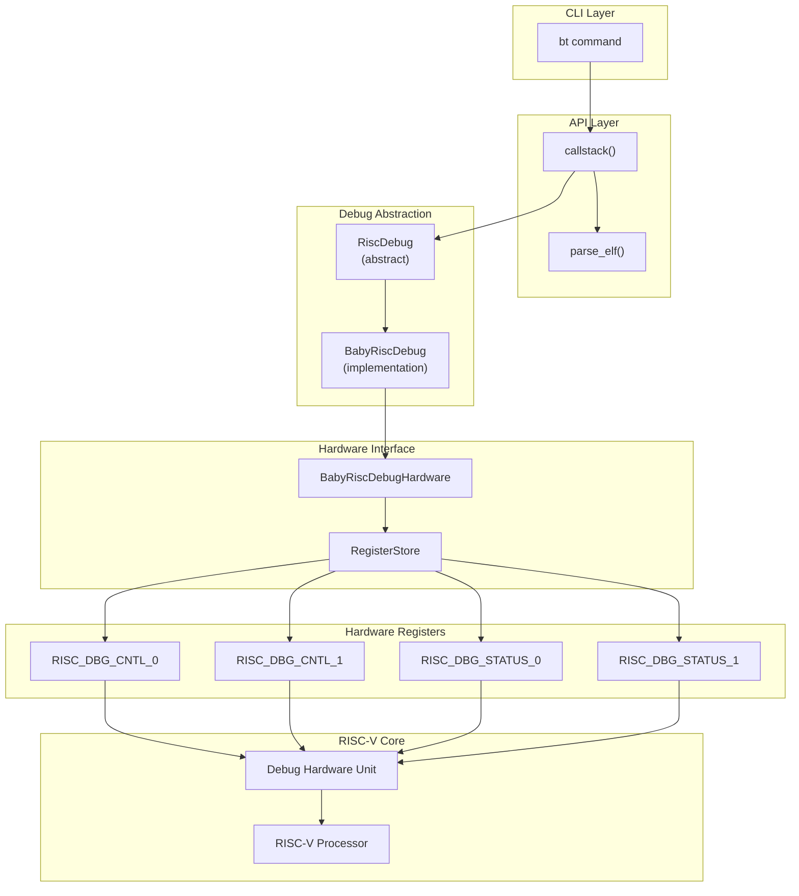
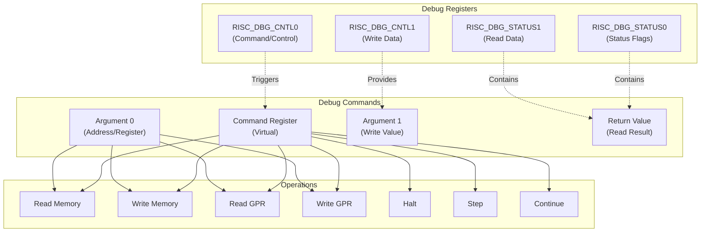
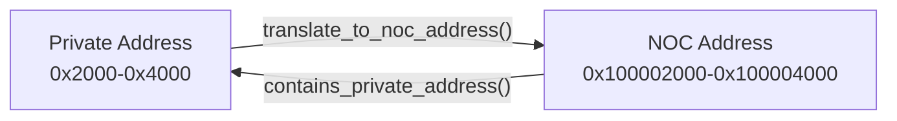
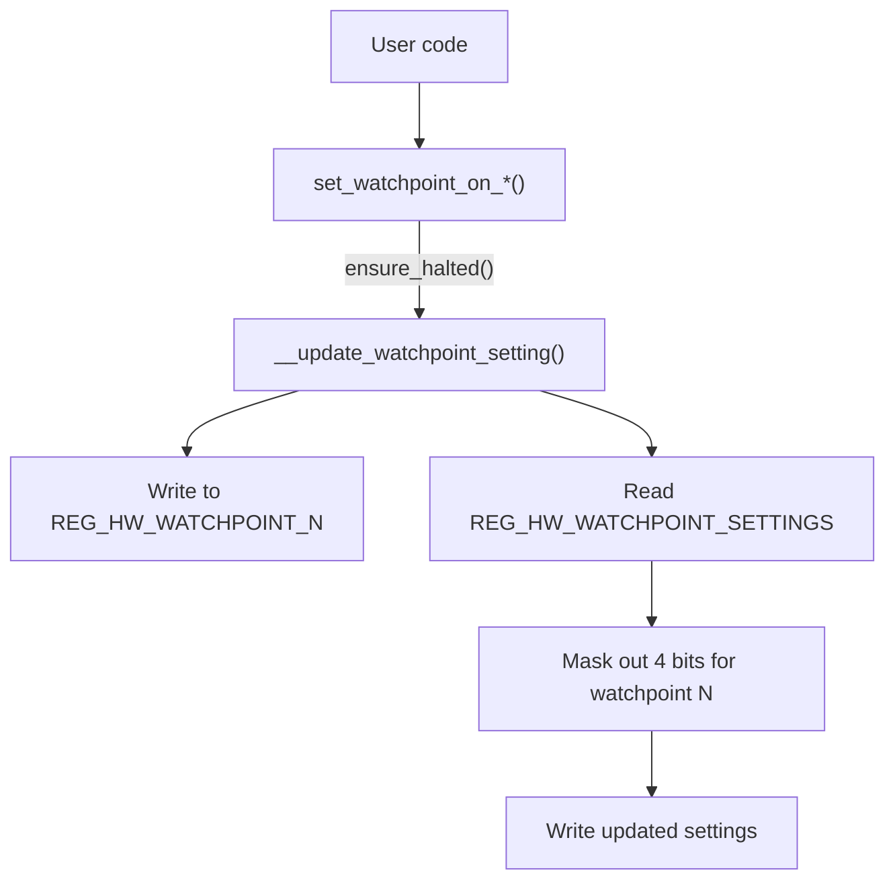
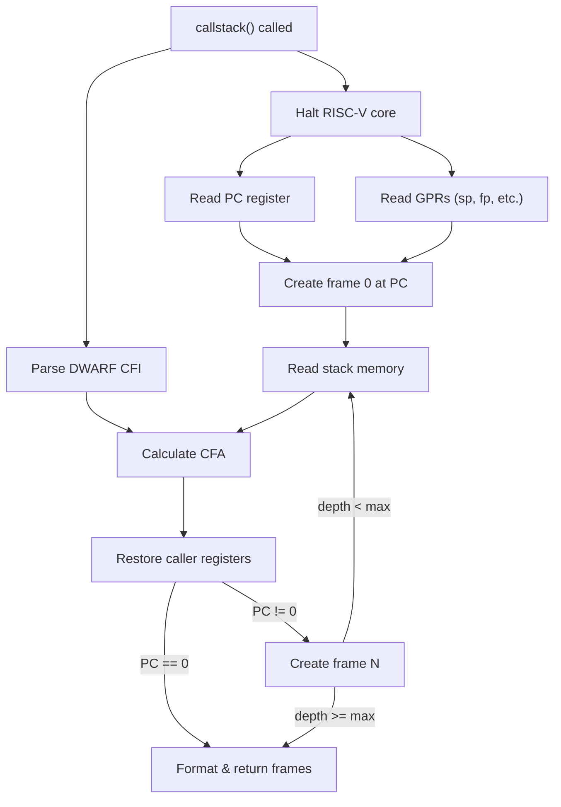

# RISC-V Debug Commands

Relevant source files
*   [docs/ttexalens-app-docs.md](https://github.com/tenstorrent/tt-exalens/blob/046c35eb/docs/ttexalens-app-docs.md?plain=1)
*   [docs/ttexalens-lib-docs.md](https://github.com/tenstorrent/tt-exalens/blob/046c35eb/docs/ttexalens-lib-docs.md?plain=1)
*   [test/ttexalens/unit_tests/test_multicore.py](https://github.com/tenstorrent/tt-exalens/blob/046c35eb/test/ttexalens/unit_tests/test_multicore.py)
*   [ttexalens/__init__.py](https://github.com/tenstorrent/tt-exalens/blob/046c35eb/ttexalens/__init__.py)
*   [ttexalens/cli_commands/callstack.py](https://github.com/tenstorrent/tt-exalens/blob/046c35eb/ttexalens/cli_commands/callstack.py)
*   [ttexalens/coordinate.py](https://github.com/tenstorrent/tt-exalens/blob/046c35eb/ttexalens/coordinate.py)
*   [ttexalens/firmware.py](https://github.com/tenstorrent/tt-exalens/blob/046c35eb/ttexalens/firmware.py)
*   [ttexalens/hardware/baby_risc_info.py](https://github.com/tenstorrent/tt-exalens/blob/046c35eb/ttexalens/hardware/baby_risc_info.py)

## Purpose and Scope

This page documents the CLI commands for debugging RISC-V cores on Tenstorrent devices. Two primary commands are covered:

1.   **`bt`/`callstack`**: Retrieves and displays call stacks with symbolic information from ELF files
2.   **`debug-bus`/`dbus`**: Samples internal hardware signals for low-level debugging

The page covers command usage, the underlying RISC-V debug protocol (Baby RISC Debug), and integration with hardware debug features.

For general device inspection commands, see [Device Inspection Commands](https://deepwiki.com/tenstorrent/tt-exalens/4.2-device-inspection-commands). For memory and register access commands, see [Memory and Register Commands](https://deepwiki.com/tenstorrent/tt-exalens/4.3-memory-and-register-commands). For ELF loading and code coverage extraction, see [ELF and Coverage Commands](https://deepwiki.com/tenstorrent/tt-exalens/4.6-debug-bus-and-signal-sampling).

**Sources:**[docs/ttexalens-app-docs.md 123-165](https://github.com/tenstorrent/tt-exalens/blob/046c35eb/docs/ttexalens-app-docs.md?plain=1#L123-L165)[docs/ttexalens-app-docs.md 171-396](https://github.com/tenstorrent/tt-exalens/blob/046c35eb/docs/ttexalens-app-docs.md?plain=1#L171-L396)




Sources: [ttexalens/register_store.py:1-20](), [ttexalens/hardware/tensix_registers_description.py](), [ttexalens/hardware/wormhole/functional_worker_registers.py:1-15](), [ttexalens/hardware/blackhole/functional_worker_registers.py:1-15]()

---
```
## The `bt`/`callstack` Command

The `bt` (backtrace) command prints the call stack for a specified RISC-V core using DWARF debug information from ELF files. This is the primary CLI interface for RISC-V debugging.

### Usage

```
callstack <elf-files> [-o <offsets>] [-r <risc>] [-m <max-depth>] [-d <device>] [-l <loc>]
```

### Arguments and Options

| Argument/Option | Description |
| --- | --- |
| `<elf-files>` | Paths to ELF files (comma-separated) containing debug symbols |
| `-o <offsets>` | Address offsets for each ELF file (comma-separated) |
| `-r <risc>` | RISC-V core name: `brisc`, `trisc0`, `trisc1`, `trisc2`, `ncrisc`, `erisc`, etc. [default: brisc] |
| `-m <max-depth>` | Maximum call stack depth to display [default: 100] |
| `-d <device>` | Device ID [default: current device] |
| `-l <loc>` | Core location in noc0 (X-Y) or logical (X,Y) format [default: current location] |

### Command Flow Diagram

**Sources:**[docs/ttexalens-app-docs.md 123-165](https://github.com/tenstorrent/tt-exalens/blob/046c35eb/docs/ttexalens-app-docs.md?plain=1#L123-L165)[docs/ttexalens-lib-docs.md 478-502](https://github.com/tenstorrent/tt-exalens/blob/046c35eb/docs/ttexalens-lib-docs.md?plain=1#L478-L502)



### Example Usage

Basic call stack retrieval:

Multiple ELF files with offsets:

The command halts the specified RISC-V core, reads the program counter and stack pointer, and walks the call stack using DWARF Call Frame Information (CFI). Each frame displays the function name, source file, line number, and local variables if available.

**Sources:**[docs/ttexalens-app-docs.md 150-158](https://github.com/tenstorrent/tt-exalens/blob/046c35eb/docs/ttexalens-app-docs.md?plain=1#L150-L158)

## RISC-V Debug Protocol Architecture

The RISC-V debugging system uses a custom "Baby RISC Debug" protocol implemented in hardware. The protocol provides non-intrusive debugging capabilities without requiring Debug Module Interface (DMI) from the RISC-V debug specification.

### Protocol Layer Diagram

**Sources:**[ttexalens/hardware/baby_risc_debug.py 218-467](https://github.com/tenstorrent/tt-exalens/blob/046c35eb/ttexalens/hardware/baby_risc_debug.py#L218-L467)



### Debug Register Protocol

The Baby RISC Debug protocol uses a set of debug registers to communicate with the RISC-V core:

| Register | Address | Purpose |
| --- | --- | --- |
| `REG_STATUS` | 0 | Core status (halted, ebreak, watchpoint hits) |
| `REG_COMMAND` | 1 | Command register (halt, step, continue, etc.) |
| `REG_COMMAND_ARG_0` | 2 | First command argument |
| `REG_COMMAND_ARG_1` | 3 | Second command argument |
| `REG_COMMAND_RETURN_VALUE` | 4 | Command return value |
| `REG_HW_WATCHPOINT_SETTINGS` | 5 | Watchpoint configuration |
| `REG_HW_WATCHPOINT_0-7` | 10-17 | Individual watchpoint addresses |

Commands are issued by writing to these registers through NOC. The protocol sequence is:

1.   Write command arguments to `REG_COMMAND_ARG_0/1`
2.   Write command code to `REG_COMMAND` with `COMMAND_DEBUG_MODE` flag
3.   For reads, retrieve result from `REG_COMMAND_RETURN_VALUE`

**Sources:**[ttexalens/hardware/baby_risc_debug.py 25-40](https://github.com/tenstorrent/tt-exalens/blob/046c35eb/ttexalens/hardware/baby_risc_debug.py#L25-L40)[ttexalens/hardware/baby_risc_debug.py 48-58](https://github.com/tenstorrent/tt-exalens/blob/046c35eb/ttexalens/hardware/baby_risc_debug.py#L48-L58)



## BabyRiscDebug Implementation

The `BabyRiscDebug` class provides the main interface for RISC-V core debugging. It wraps the hardware protocol and provides high-level operations.

### Class Structure

**Sources:**[ttexalens/hardware/baby_risc_debug.py 468-805](https://github.com/tenstorrent/tt-exalens/blob/046c35eb/ttexalens/hardware/baby_risc_debug.py#L468-L805)[ttexalens/hardware/wormhole/baby_risc_debug.py 9-38](https://github.com/tenstorrent/tt-exalens/blob/046c35eb/ttexalens/hardware/wormhole/baby_risc_debug.py#L9-L38)[ttexalens/hardware/blackhole/baby_risc_debug.py 11-54](https://github.com/tenstorrent/tt-exalens/blob/046c35eb/ttexalens/hardware/blackhole/baby_risc_debug.py#L11-L54)[ttexalens/hardware/quasar/baby_risc_debug.py 9-35](https://github.com/tenstorrent/tt-exalens/blob/046c35eb/ttexalens/hardware/quasar/baby_risc_debug.py#L9-L35)

### Core Initialization

Each RISC-V core is represented by a `BabyRiscInfo` structure containing:

*   Core identification (`risc_name`, `risc_id`, `neo_id`)
*   Memory layout (L1, private data/code memory blocks)
*   Debug hardware configuration (register addresses, masks, shifts)
*   Reset and watchpoint limits
*   Branch prediction control registers
*   Code start address configuration

**Sources:**[ttexalens/hardware/baby_risc_debug.py 469-478](https://github.com/tenstorrent/tt-exalens/blob/046c35eb/ttexalens/hardware/baby_risc_debug.py#L469-L478)

## Execution Control Operations

The debug protocol supports precise control over RISC-V core execution.

### Halt, Step, and Continue

**Sources:**[ttexalens/hardware/baby_risc_debug.py 299-348](https://github.com/tenstorrent/tt-exalens/blob/046c35eb/ttexalens/hardware/baby_risc_debug.py#L299-L348)[ttexalens/hardware/baby_risc_debug.py 629-648](https://github.com/tenstorrent/tt-exalens/blob/046c35eb/ttexalens/hardware/baby_risc_debug.py#L629-L648)

### Status Register Format

The `REG_STATUS` register provides core state information:

| Bit/Mask | Constant | Description |
| --- | --- | --- |
| 0x1 | `STATUS_HALTED` | Core is halted in debug mode |
| 0x2 | `STATUS_PC_WATCHPOINT_HIT` | PC watchpoint (breakpoint) triggered |
| 0x4 | `STATUS_MEMORY_WATCHPOINT_HIT` | Memory watchpoint triggered |
| 0x8 | `STATUS_EBREAK_HIT` | EBREAK instruction executed |
| 0x100 << N | `STATUS_WATCHPOINT_N_HIT` | Specific watchpoint N triggered |

**Sources:**[ttexalens/hardware/baby_risc_debug.py 41-46](https://github.com/tenstorrent/tt-exalens/blob/046c35eb/ttexalens/hardware/baby_risc_debug.py#L41-L46)

### Reset Control

Each RISC-V core has a dedicated reset signal controlled via the `RISCV_DEBUG_REG_SOFT_RESET_0` register. The `set_reset_signal()` method manipulates the appropriate bit (determined by `reset_flag_shift`) to assert or deassert reset.

**Sources:**[ttexalens/hardware/baby_risc_debug.py 505-528](https://github.com/tenstorrent/tt-exalens/blob/046c35eb/ttexalens/hardware/baby_risc_debug.py#L505-L528)

## Register and Memory Access

The debug protocol provides access to general-purpose registers (GPRs) and memory while the core is halted.

### GPR Access Protocol

**Sources:**[ttexalens/hardware/baby_risc_debug.py 397-409](https://github.com/tenstorrent/tt-exalens/blob/046c35eb/ttexalens/hardware/baby_risc_debug.py#L397-L409)[ttexalens/hardware/baby_risc_debug.py 659-671](https://github.com/tenstorrent/tt-exalens/blob/046c35eb/ttexalens/hardware/baby_risc_debug.py#L659-L671)

### RISC-V Register Names

The debug system supports both numeric indices (x0-x31, pc=32) and ABI names:

| Index | ABI Name | Purpose |
| --- | --- | --- |
| 0 | zero | Constant zero |
| 1 | ra | Return address |
| 2 | sp | Stack pointer |
| 8 | s0/fp | Saved register / frame pointer |
| 10-11 | a0-a1 | Function arguments / return values |
| 32 | pc | Program counter |

The `get_register_index()` function converts names to indices, and `get_register_name()` does the reverse.

**Sources:**[ttexalens/hardware/baby_risc_debug.py 69-189](https://github.com/tenstorrent/tt-exalens/blob/046c35eb/ttexalens/hardware/baby_risc_debug.py#L69-L189)

### Memory Access Methods

The debug protocol provides word-aligned and byte-aligned memory access:

| Method | Purpose | Alignment |
| --- | --- | --- |
| `read_memory(addr)` | Read 4-byte word | Word-aligned |
| `write_memory(addr, value)` | Write 4-byte word | Word-aligned |
| `read_memory_bytes(addr, size)` | Read arbitrary bytes | Any |
| `write_memory_bytes(addr, data)` | Write arbitrary bytes | Any |

For unaligned accesses, the byte methods automatically:

1.   Read encompassing aligned words
2.   Extract/merge the requested bytes
3.   Write back aligned words with modifications

**Sources:**[ttexalens/hardware/baby_risc_debug.py 693-748](https://github.com/tenstorrent/tt-exalens/blob/046c35eb/ttexalens/hardware/baby_risc_debug.py#L693-L748)

### Memory Address Translation

RISC-V cores have both NOC-accessible (L1) and private memory regions. The debug protocol uses private addresses, while NOC operations use NOC addresses. The `MemoryBlock` class handles translation:

For memory outside L1 (e.g., TRISC private data), NOC access is not possible and the debug protocol must be used.

**Sources:**[ttexalens/hardware/memory_block.py 8-43](https://github.com/tenstorrent/tt-exalens/blob/046c35eb/ttexalens/hardware/memory_block.py#L8-L43)[ttexalens/hardware/baby_risc_debug.py 699-716](https://github.com/tenstorrent/tt-exalens/blob/046c35eb/ttexalens/hardware/baby_risc_debug.py#L699-L716)




For memory outside L1 (e.g., TRISC private data), NOC access is not possible and the debug protocol must be used.
```
## Watchpoints and Breakpoints

The Baby RISC Debug protocol supports up to 8 hardware watchpoints per core. Watchpoints can monitor:

*   Program counter (breakpoints)
*   Memory reads
*   Memory writes
*   Memory access (read or write)

### Watchpoint Configuration

**Sources:**[ttexalens/hardware/baby_risc_debug.py 429-465](https://github.com/tenstorrent/tt-exalens/blob/046c35eb/ttexalens/hardware/baby_risc_debug.py#L429-L465)



### Watchpoint Settings Format

Each watchpoint occupies 4 bits in `REG_HW_WATCHPOINT_SETTINGS`:

| Bit Mask | Flag | Description |
| --- | --- | --- |
| 0x0 | `HW_WATCHPOINT_BREAKPOINT` | PC watchpoint (breakpoint) |
| 0x1 | `HW_WATCHPOINT_READ` | Trigger on memory read |
| 0x2 | `HW_WATCHPOINT_WRITE` | Trigger on memory write |
| 0x3 | `HW_WATCHPOINT_ACCESS` | Trigger on any access (read or write) |
| 0x8 | `HW_WATCHPOINT_ENABLED` | Watchpoint enabled |

Watchpoint N uses bits `(N*4)` through `(N*4+3)` in the settings register.

**Sources:**[ttexalens/hardware/baby_risc_debug.py 60-66](https://github.com/tenstorrent/tt-exalens/blob/046c35eb/ttexalens/hardware/baby_risc_debug.py#L60-L66)

### Setting Breakpoints

Example: Set a breakpoint at address 0x10000:

This:

1.   Halts the core if running (`ensure_halted()`)
2.   Writes 0x10000 to `REG_HW_WATCHPOINT_0`
3.   Updates watchpoint 0's settings to `HW_WATCHPOINT_ENABLED | HW_WATCHPOINT_BREAKPOINT`

When the core's PC reaches 0x10000, execution halts and `STATUS_PC_WATCHPOINT_HIT` is set.

**Sources:**[ttexalens/hardware/baby_risc_debug.py 442-443](https://github.com/tenstorrent/tt-exalens/blob/046c35eb/ttexalens/hardware/baby_risc_debug.py#L442-L443)

## Platform-Specific Debug Implementations

Different Tenstorrent architectures require platform-specific workarounds for hardware bugs and quirks.

### Wormhole Workarounds

**Branch Prediction Disable:** Wormhole cores exhibit unreliable stepping/continue behavior with branch prediction enabled. The workaround disables branch prediction before step/continue operations:

**PC Reading via Debug Bus:** For ERISC cores, PC must be read from the debug bus instead of GPR 32 due to hardware limitations.

**Sources:**[ttexalens/hardware/wormhole/baby_risc_debug.py 9-38](https://github.com/tenstorrent/tt-exalens/blob/046c35eb/ttexalens/hardware/wormhole/baby_risc_debug.py#L9-L38)

### Blackhole Workarounds

**Double-Step Requirement:** Blackhole requires executing step twice due to a hardware bug:

**PC Reading from Debug Bus:** Similar to Wormhole, PC reads must use the debug bus to avoid incorrect values.

**Memory Access via NOC:** For accessible memory regions, Blackhole bypasses the debug protocol and uses direct NOC access when the core is not in reset, providing better reliability.

**TRISC2 Private Memory Limitation:** Addresses in TRISC2 private memory with offset % 16 > 4 are inaccessible due to a hardware bug. Attempts to access these addresses raise an exception.

**Sources:**[ttexalens/hardware/blackhole/baby_risc_debug.py 11-54](https://github.com/tenstorrent/tt-exalens/blob/046c35eb/ttexalens/hardware/blackhole/baby_risc_debug.py#L11-L54)

### Quasar Workarounds

**Instruction Cache Flush:** Quasar requires an explicit PC flush after invalidating the instruction cache:

**Sources:**[ttexalens/hardware/quasar/baby_risc_debug.py 9-35](https://github.com/tenstorrent/tt-exalens/blob/046c35eb/ttexalens/hardware/quasar/baby_risc_debug.py#L9-L35)

### Platform Comparison Table

| Feature | Wormhole | Blackhole | Quasar |
| --- | --- | --- | --- |
| Step operations | Single (with BP disable) | Double-step required | Single |
| PC reading | Debug bus for ERISC | Debug bus | Debug bus |
| Memory access | Debug protocol | NOC preferred when possible | Debug protocol |
| Cache invalidation | Register write | Register write | Register write + PC flush |
| Known bugs | Branch prediction issues | Double-step, TRISC2 memory | None documented |

**Sources:**[ttexalens/hardware/wormhole/baby_risc_debug.py 9-38](https://github.com/tenstorrent/tt-exalens/blob/046c35eb/ttexalens/hardware/wormhole/baby_risc_debug.py#L9-L38)[ttexalens/hardware/blackhole/baby_risc_debug.py 11-54](https://github.com/tenstorrent/tt-exalens/blob/046c35eb/ttexalens/hardware/blackhole/baby_risc_debug.py#L11-L54)[ttexalens/hardware/quasar/baby_risc_debug.py 9-35](https://github.com/tenstorrent/tt-exalens/blob/046c35eb/ttexalens/hardware/quasar/baby_risc_debug.py#L9-L35)

## Integration with Call Stack Reconstruction

The `bt` command uses the RISC-V debug operations to reconstruct call stacks. The process:

### Call Stack Reconstruction Flow

**Sources:**[test/ttexalens/unit_tests/test_risc_debug.py 1-216](https://github.com/tenstorrent/tt-exalens/blob/046c35eb/test/ttexalens/unit_tests/test_risc_debug.py#L1-L216)

Key operations:

1.   **Halt the core:**`risc_debug.halt()` stops execution
2.   **Read PC:** Identifies current function via `read_gpr(32)` or debug bus
3.   **Read GPRs:** Stack pointer (sp), frame pointer (fp) for unwinding
4.   **Read stack memory:** Via `read_memory_bytes()` for frame data
5.   **Parse CFI:** DWARF Call Frame Information describes stack layout
6.   **Calculate CFA:** Canonical Frame Address = base for frame
7.   **Unwind registers:** Reconstruct caller's register values
8.   **Repeat:** Until reaching main() or max depth

**Sources:**[docs/ttexalens-lib-docs.md 478-502](https://github.com/tenstorrent/tt-exalens/blob/046c35eb/docs/ttexalens-lib-docs.md?plain=1#L478-L502)



## Testing and Validation

The RISC-V debug system has extensive test coverage across all supported platforms.

### Test Matrix

The test suite (`test/ttexalens/unit_tests/test_risc_debug.py`) runs parameterized tests across:

*   **Core types:** ETH (ERISC0/1), FW (BRISC, TRISC0-2), DRAM (DRISC)
*   **NEO IDs:** 0-3 for NEO-enabled platforms (Quasar)
*   **Operations:** GPR read/write, memory access, execution control, watchpoints

Tests automatically skip unsupported configurations (e.g., NEO on non-Quasar platforms, DRISC on platforms without DRAM cores).

**Sources:**[test/ttexalens/unit_tests/test_risc_debug.py 16-79](https://github.com/tenstorrent/tt-exalens/blob/046c35eb/test/ttexalens/unit_tests/test_risc_debug.py#L16-L79)

### Core Simulator

The `RiscvCoreSimulator` class provides test infrastructure:

This allows tests to:

*   Load small programs into L1
*   Set/clear reset
*   Single-step execution
*   Verify register and memory state

**Sources:**[test/ttexalens/unit_tests/core_simulator.py 17-216](https://github.com/tenstorrent/tt-exalens/blob/046c35eb/test/ttexalens/unit_tests/core_simulator.py#L17-L216)

### Example Test: Halt and Step

```
Test sequence:
1. Write program with ebreak at address 0
2. Take core out of reset
3. Core hits ebreak, enters debug mode
4. Verify core is halted at PC=4 (after ebreak)
5. Single-step to PC=8
6. Verify memory unchanged (still in loop)
7. Continue execution
8. Verify memory updated
```

This validates the complete halt → step → continue sequence.

**Sources:**[test/ttexalens/unit_tests/test_risc_debug.py 459-503](https://github.com/tenstorrent/tt-exalens/blob/046c35eb/test/ttexalens/unit_tests/test_risc_debug.py#L459-L503)

Dismiss
Refresh this wiki

Enter email to refresh
