# Tensix Debug Commands

Relevant source files
*   [docs/ttexalens-app-docs.md](https://github.com/tenstorrent/tt-exalens/blob/046c35eb/docs/ttexalens-app-docs.md?plain=1)
*   [docs/ttexalens-lib-docs.md](https://github.com/tenstorrent/tt-exalens/blob/046c35eb/docs/ttexalens-lib-docs.md?plain=1)
*   [test/ttexalens/unit_tests/test_device.py](https://github.com/tenstorrent/tt-exalens/blob/046c35eb/test/ttexalens/unit_tests/test_device.py)
*   [test/ttexalens/unit_tests/test_lib.py](https://github.com/tenstorrent/tt-exalens/blob/046c35eb/test/ttexalens/unit_tests/test_lib.py)
*   [test/ttexalens/unit_tests/test_tensix_debug.py](https://github.com/tenstorrent/tt-exalens/blob/046c35eb/test/ttexalens/unit_tests/test_tensix_debug.py)
*   [ttexalens/__init__.py](https://github.com/tenstorrent/tt-exalens/blob/046c35eb/ttexalens/__init__.py)
*   [ttexalens/coordinate.py](https://github.com/tenstorrent/tt-exalens/blob/046c35eb/ttexalens/coordinate.py)
*   [ttexalens/debug_tensix.py](https://github.com/tenstorrent/tt-exalens/blob/046c35eb/ttexalens/debug_tensix.py)
*   [ttexalens/elf_loader.py](https://github.com/tenstorrent/tt-exalens/blob/046c35eb/ttexalens/elf_loader.py)
*   [ttexalens/tt_exalens_lib.py](https://github.com/tenstorrent/tt-exalens/blob/046c35eb/ttexalens/tt_exalens_lib.py)

## Overview

This page documents the `tensix` CLI command for dumping Tensix core state, including ALU registers, packer/unpacker state, general-purpose registers (GPR), register window counters (RWC), and ADC state. The command provides visibility into the compute pipeline of Tensix cores.

**Key Capabilities:**

*   Dump register files: SRCA, SRCB, DSTACC
*   Inspect register window counters (RWC)
*   Read ALU format specifications
*   Access packer and unpacker state
*   View thread-specific state

For RISC-V core debugging (halt, step, continue), see [RISC-V Debug Commands](https://deepwiki.com/tenstorrent/tt-exalens/4.4-risc-v-debug-commands). For general register access, see [Memory and Register Commands](https://deepwiki.com/tenstorrent/tt-exalens/4.3-memory-and-register-commands). For hardware signal inspection, see [Debug Bus Commands](https://deepwiki.com/tenstorrent/tt-exalens/4.6-debug-bus-and-signal-sampling).

Sources: [ttexalens/debug_tensix.py 1-356](https://github.com/tenstorrent/tt-exalens/blob/046c35eb/ttexalens/debug_tensix.py#L1-L356)

* * *


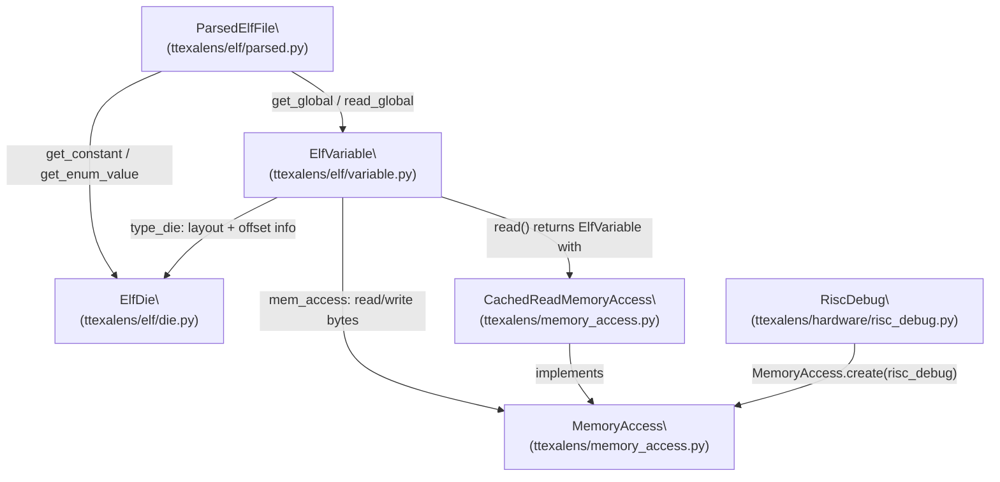

Sources: [ttexalens/elf/variable.py:1-25](), [ttexalens/elf/parsed.py:1-30](), [ttexalens/elf/__init__.py:1-21]()

---
```


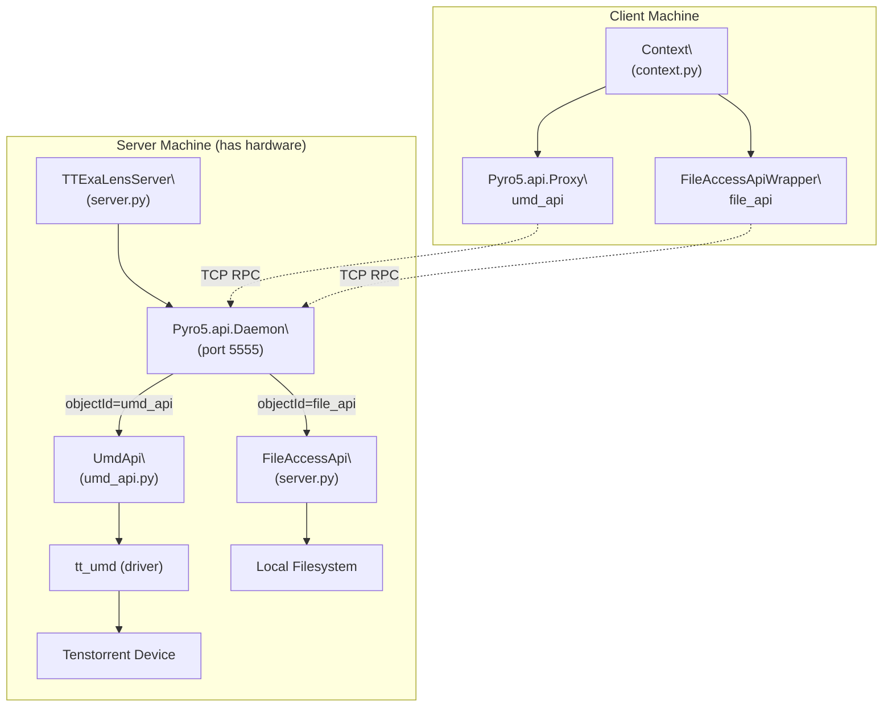

Sources: [ttexalens/server.py:41-80](), [ttexalens/umd_api.py:44-146](), [ttexalens/cli.py:7-43]()

---
```
## CLI Command Usage

### tensix Command

**Purpose:** Dump Tensix core state including register files, RWC counters, and configuration registers.

**Usage:**

```
tensix <location> [--regfile <RF>] [--format <FMT>] [--tiles <N>] [-d <device>]
```

**Arguments:**

*   `<location>` - Core location in logical (e.g., `0,0`) or NOC coordinates (e.g., `1-2`)

**Options:**

*   `--regfile <RF>` - Register file to dump: `srca`, `srcb`, `dstacc` [default: dstacc]
*   `--format <FMT>` - Data format: `auto`, `fp32`, `fp16`, `int32`, `int8` [default: auto]
*   `--tiles <N>` - Number of tiles to read (Blackhole only) [default: all]
*   `-d, --device <ID>` - Device ID [default: 0]

**Common Options:**

*   `--device, -d <device-id>` - Device ID [default: 0]
*   `--loc, -l <loc>` - Grid location [default: current location]

Sources: [ttexalens/debug_tensix.py 57-71](https://github.com/tenstorrent/tt-exalens/blob/046c35eb/ttexalens/debug_tensix.py#L57-L71)[ttexalens/debug_tensix.py 267-321](https://github.com/tenstorrent/tt-exalens/blob/046c35eb/ttexalens/debug_tensix.py#L267-L321)

* * *

## Core State Components

### Register Files

Tensix cores contain three main register files used during computation:

**Register File Overview:**

| Component | CLI Flag | Read | Write | Description |
| --- | --- | --- | --- | --- |
| SRCA | `--regfile srca` | ✓ | ✗ | Source A input (last 2 faces visible) |
| SRCB | `--regfile srcb` | ✗ | ✗ | Source B input (not supported) |
| DSTACC | `--regfile dstacc` | ✓ | ✓ (BH) | Destination/accumulator |

Sources: [ttexalens/debug_tensix.py 31-54](https://github.com/tenstorrent/tt-exalens/blob/046c35eb/ttexalens/debug_tensix.py#L31-L54)[ttexalens/debug_tensix.py 202-265](https://github.com/tenstorrent/tt-exalens/blob/046c35eb/ttexalens/debug_tensix.py#L202-L265)


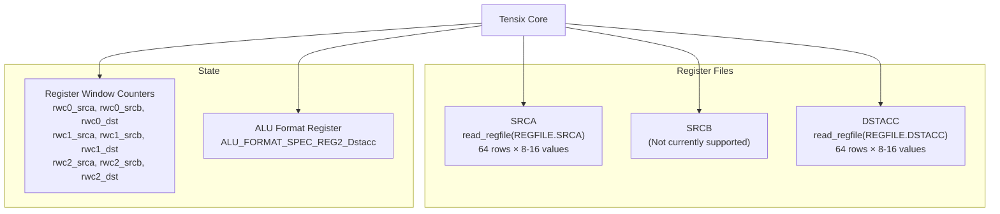

**Register File Overview:**

| Component | CLI Flag | Read | Write | Description |
|-----------|----------|------|-------|-------------|
| SRCA | `--regfile srca` | ✓ | ✗ | Source A input (last 2 faces visible) |
| SRCB | `--regfile srcb` | ✗ | ✗ | Source B input (not supported) |
| DSTACC | `--regfile dstacc` | ✓ | ✓ (BH) | Destination/accumulator |

Sources: [ttexalens/debug_tensix.py:31-54](), [ttexalens/debug_tensix.py:202-265]()
```
### Register Window Counters (RWC)

Each thread (0-2) has three register window counters controlling which register file rows are active:

**Reading RWC Values:**

RWC values can be read via debug bus signals:

**Setting RWC Values:**

RWC values are set via instruction injection using `TT_OP_SETRWC`:

Sources: [ttexalens/debug_tensix.py 209-214](https://github.com/tenstorrent/tt-exalens/blob/046c35eb/ttexalens/debug_tensix.py#L209-L214)[test/ttexalens/unit_tests/test_tensix_debug.py 199-215](https://github.com/tenstorrent/tt-exalens/blob/046c35eb/test/ttexalens/unit_tests/test_tensix_debug.py#L199-L215)


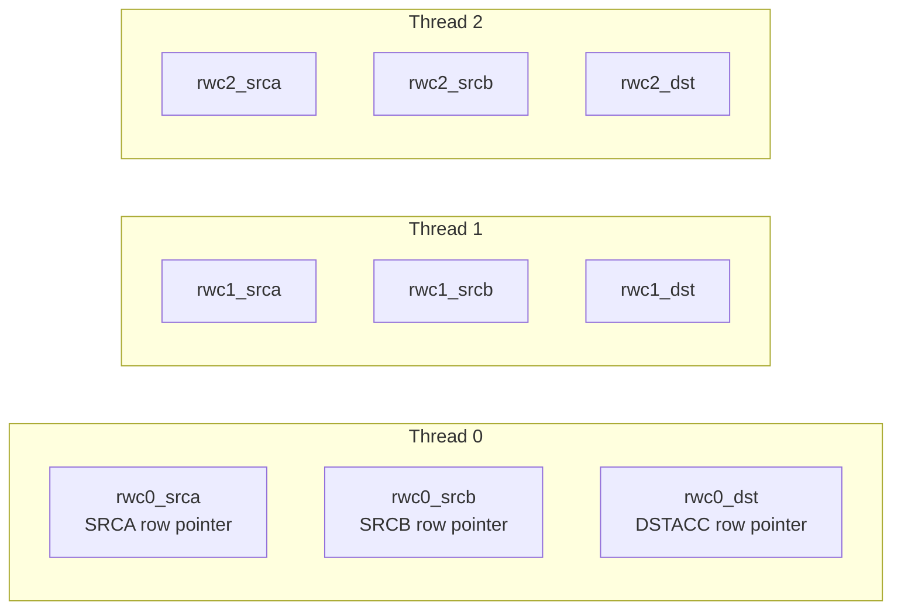

**Reading RWC Values:**

RWC values can be read via debug bus signals:
```python
```
### ALU Format Register

The ALU format specification register (`ALU_FORMAT_SPEC_REG2_Dstacc`) controls the data format used in the destination register file:

**Reading Current Format:**

Sources: [ttexalens/debug_tensix.py 280](https://github.com/tenstorrent/tt-exalens/blob/046c35eb/ttexalens/debug_tensix.py#L280-L280)[ttexalens/pack_unpack_regfile.py 1-50](https://github.com/tenstorrent/tt-exalens/blob/046c35eb/ttexalens/pack_unpack_regfile.py#L1-L50)


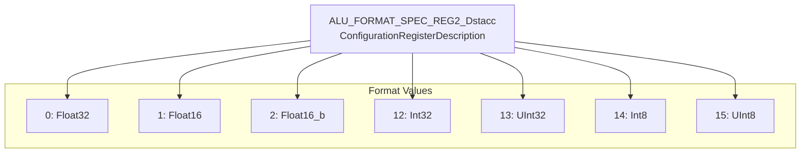

**Reading Current Format:**
```python
format_value = read_register(location, "ALU_FORMAT_SPEC_REG2_Dstacc")
data_format = TensixDataFormat(format_value)
```

Sources: [ttexalens/debug_tensix.py:280](), [ttexalens/pack_unpack_regfile.py:1-50]()
```
### Packer and Unpacker State

Packer and unpacker configurations can be read via configuration registers:

**Unpacker Registers:**

*   `UNPACK_CONFIG0_out_data_format` - Output data format
*   Additional unpacker control registers

**Packer Registers:**

*   Packer configuration and control registers

These are accessed using the standard register read commands. See [Memory and Register Commands](https://deepwiki.com/tenstorrent/tt-exalens/4.3-memory-and-register-commands) for details.

Sources: [test/ttexalens/unit_tests/test_lib.py 369-376](https://github.com/tenstorrent/tt-exalens/blob/046c35eb/test/ttexalens/unit_tests/test_lib.py#L369-L376)

* * *

## System Architecture


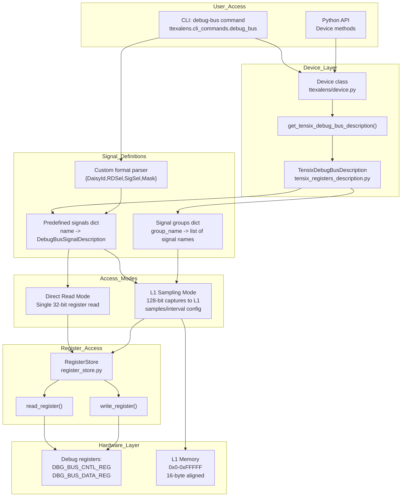

**Debug Bus System Architecture**

The system is accessed through the `Device` class hierarchy which provides `get_tensix_debug_bus_description()` method [ttexalens/device.py:396-398](). This returns a `TensixDebugBusDescription` object containing predefined signal mappings and signal group definitions. Signals are specified by routing parameters (daisy_id, rd_sel, sig_sel, mask) and accessed through the `RegisterStore` abstraction [ttexalens/register_store.py:169-362](). Access can be direct (single 32-bit read) or through L1 sampling (multiple 128-bit captures to memory).

Sources: [ttexalens/device.py:19,396-398](), [ttexalens/register_store.py:169-362](), [docs/ttexalens-app-docs.md:171-396]()
```


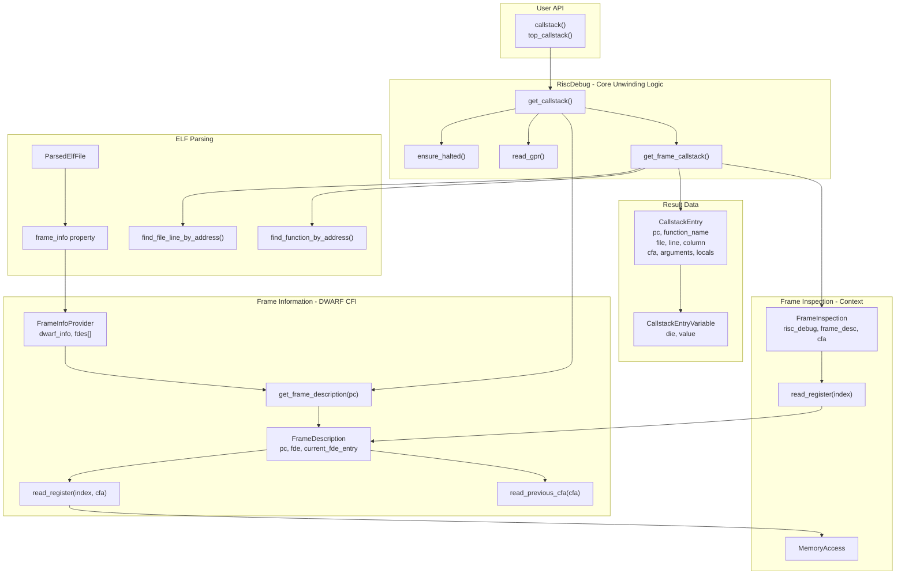
### TensixDebug Class Overview

The `TensixDebug` class provides the core functionality for Tensix-specific debugging operations. It operates through the TRISC0 debug hardware to access Tensix state that is not directly accessible via NOC.

**Key Components:**

| Component | Purpose | File Reference |
| --- | --- | --- |
| `TensixDebug` | Main class for Tensix operations | [ttexalens/debug_tensix.py 57-356](https://github.com/tenstorrent/tt-exalens/blob/046c35eb/ttexalens/debug_tensix.py#L57-L356) |
| `MemoryAccess` | Memory read/write via TRISC0 | [ttexalens/debug_tensix.py 69-71](https://github.com/tenstorrent/tt-exalens/blob/046c35eb/ttexalens/debug_tensix.py#L69-L71) |
| `RegisterStore` | Configuration/debug register access | [ttexalens/debug_tensix.py 65-66](https://github.com/tenstorrent/tt-exalens/blob/046c35eb/ttexalens/debug_tensix.py#L65-L66) |
| `inject_instruction()` | Inject instructions into Tensix FIFOs | [ttexalens/debug_tensix.py 118-139](https://github.com/tenstorrent/tt-exalens/blob/046c35eb/ttexalens/debug_tensix.py#L118-L139) |
| `read_regfile()` | Read register file with format conversion | [ttexalens/debug_tensix.py 267-321](https://github.com/tenstorrent/tt-exalens/blob/046c35eb/ttexalens/debug_tensix.py#L267-L321) |
| `write_regfile()` | Write register file with format conversion | [ttexalens/debug_tensix.py 343-355](https://github.com/tenstorrent/tt-exalens/blob/046c35eb/ttexalens/debug_tensix.py#L343-L355) |

Sources: [ttexalens/debug_tensix.py 57-71](https://github.com/tenstorrent/tt-exalens/blob/046c35eb/ttexalens/debug_tensix.py#L57-L71)[ttexalens/debug_tensix.py 118-356](https://github.com/tenstorrent/tt-exalens/blob/046c35eb/ttexalens/debug_tensix.py#L118-L356)

* * *


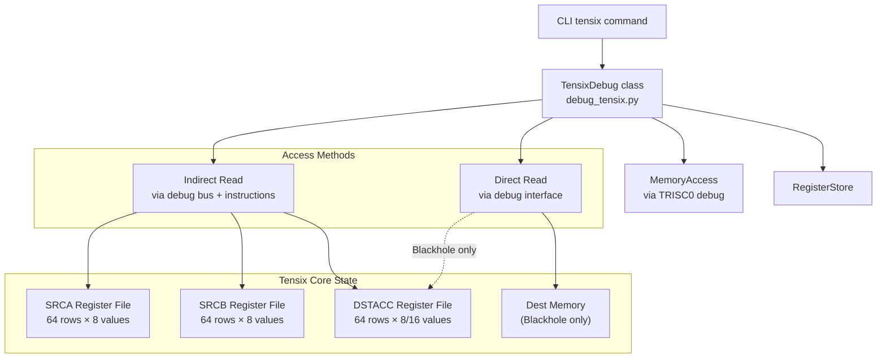

**Key Components:**

| Component | Purpose | File Reference |
|-----------|---------|----------------|
| `TensixDebug` | Main class for Tensix operations | [ttexalens/debug_tensix.py:57-356]() |
| `MemoryAccess` | Memory read/write via TRISC0 | [ttexalens/debug_tensix.py:69-71]() |
| `RegisterStore` | Configuration/debug register access | [ttexalens/debug_tensix.py:65-66]() |
| `inject_instruction()` | Inject instructions into Tensix FIFOs | [ttexalens/debug_tensix.py:118-139]() |
| `read_regfile()` | Read register file with format conversion | [ttexalens/debug_tensix.py:267-321]() |
| `write_regfile()` | Write register file with format conversion | [ttexalens/debug_tensix.py:343-355]() |

Sources: [ttexalens/debug_tensix.py:57-71](), [ttexalens/debug_tensix.py:118-356]()

---
```
## Register Files

### Overview

Tensix cores contain three main register files used during computation:

**Register File Characteristics:**

| Register File | Enum Value | Rows | Values per Row | Read Support | Write Support | Notes |
| --- | --- | --- | --- | --- | --- | --- |
| SRCA | `REGFILE.SRCA = 0` | 64 | 8 or 16 | ✓ | ✗ | Only last 2 faces visible |
| SRCB | `REGFILE.SRCB = 1` | 64 | 8 or 16 | ✗ | ✗ | Currently not supported |
| DSTACC | `REGFILE.DSTACC = 2` | 64 | 8 or 16 | ✓ | ✓ (BH only) | Full access on Blackhole |

Sources: [ttexalens/debug_tensix.py 31-54](https://github.com/tenstorrent/tt-exalens/blob/046c35eb/ttexalens/debug_tensix.py#L31-L54)[ttexalens/debug_tensix.py 202-265](https://github.com/tenstorrent/tt-exalens/blob/046c35eb/ttexalens/debug_tensix.py#L202-L265)


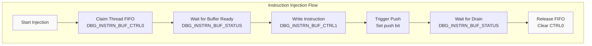


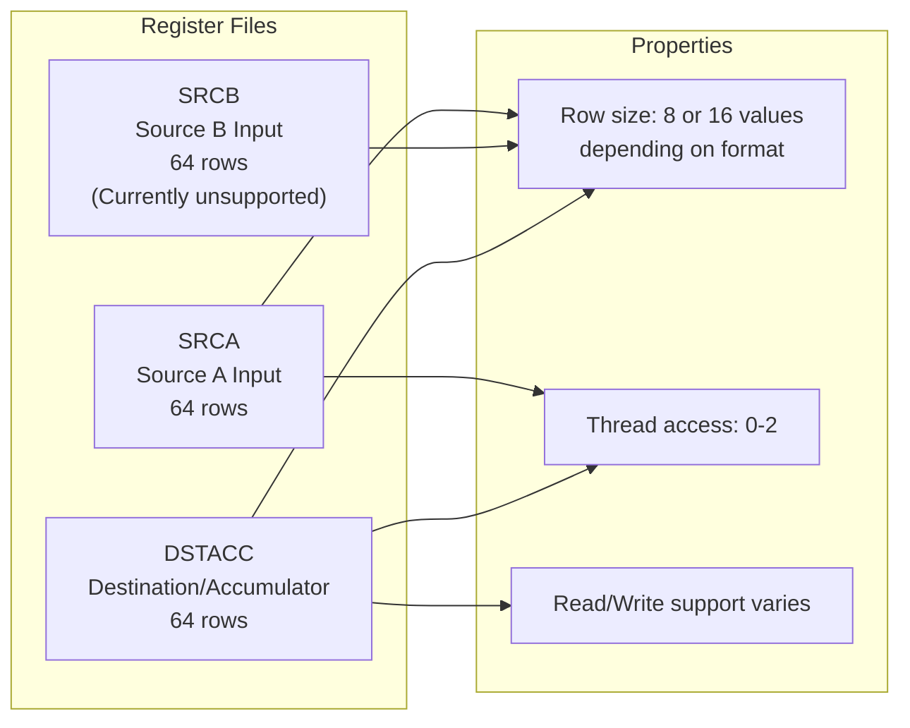

**Register File Characteristics:**

| Register File | Enum Value | Rows | Values per Row | Read Support | Write Support | Notes |
|---------------|------------|------|----------------|--------------|---------------|-------|
| SRCA | `REGFILE.SRCA = 0` | 64 | 8 or 16 | ✓ | ✗ | Only last 2 faces visible |
| SRCB | `REGFILE.SRCB = 1` | 64 | 8 or 16 | ✗ | ✗ | Currently not supported |
| DSTACC | `REGFILE.DSTACC = 2` | 64 | 8 or 16 | ✓ | ✓ (BH only) | Full access on Blackhole |

Sources: [ttexalens/debug_tensix.py:31-54](), [ttexalens/debug_tensix.py:202-265]()
```
### SRCA Register File

The SRCA register file serves as one of the primary input sources for Tensix operations. Due to architectural limitations, only the last two "faces" (groups of rows) written to SRCA are visible during debug reads.

**Reading SRCA:**

1.   Uses indirect access via debug bus
2.   Injects `TT_OP_SFPLOAD` and `TT_OP_MOVDBGA2D` instructions
3.   Reads data through debug bus registers
4.   Limited to viewing last 2 faces written

Sources: [ttexalens/debug_tensix.py 236-241](https://github.com/tenstorrent/tt-exalens/blob/046c35eb/ttexalens/debug_tensix.py#L236-L241)[ttexalens/debug_tensix.py 256-260](https://github.com/tenstorrent/tt-exalens/blob/046c35eb/ttexalens/debug_tensix.py#L256-L260)

### DSTACC Register File

The DSTACC (destination/accumulator) register file stores computation results. On Blackhole, it supports both reading and writing with direct memory access.

**Reading DSTACC:**

*   **Wormhole:** Indirect access via debug bus with special FP32 handling
*   **Blackhole:** Direct memory access for 32-bit formats

**Writing DSTACC:**

*   Only supported on Blackhole architecture
*   Requires 32-bit compatible formats (Float32, Int32, UInt32, Int8, UInt8)
*   Uses direct destination memory access

Sources: [ttexalens/debug_tensix.py 164-200](https://github.com/tenstorrent/tt-exalens/blob/046c35eb/ttexalens/debug_tensix.py#L164-L200)[ttexalens/debug_tensix.py 323-355](https://github.com/tenstorrent/tt-exalens/blob/046c35eb/ttexalens/debug_tensix.py#L323-L355)

* * *

## Data Formats

### Supported Formats

The `TensixDataFormat` enum defines the data formats that Tensix cores can process:

**Format Properties:**

| Format | Value | Bits | Direct R/W | Indirect R/W | Notes |
| --- | --- | --- | --- | --- | --- |
| `Float32` | 0 | 32 | ✓ (BH) | ✓ | Special handling on WH |
| `Float16` | 1 | 16 | ✗ | ✓ | Standard 16-bit float |
| `Float16_b` | 2 | 16 | ✗ | ✓ | bfloat16 format |
| `Bfp8` | 3 | 8 | ✗ | ✓ | Block floating point |
| `Bfp8_b` | 4 | 8 | ✗ | ✓ | Block float variant |
| `Bfp4` | 5 | 4 | ✗ | ✓ | Block float 4-bit |
| `Bfp4_b` | 6 | 4 | ✗ | ✓ | Block float 4-bit variant |
| `Bfp2` | 7 | 2 | ✗ | ✓ | Block float 2-bit |
| `Bfp2_b` | 8 | 2 | ✗ | ✓ | Block float 2-bit variant |
| `UInt16` | 11 | 16 | ✗ | ✓ | Unsigned 16-bit |
| `Int32` | 12 | 32 | ✓ (BH) | ✓ | Signed 32-bit |
| `UInt32` | 13 | 32 | ✓ (BH) | ✓ | Unsigned 32-bit |
| `Int8` | 14 | 8 | ✓ (BH) | ✓ | Signed 8-bit (32-bit mode) |
| `UInt8` | 15 | 8 | ✓ (BH) | ✓ | Unsigned 8-bit (32-bit mode) |

Sources: [ttexalens/pack_unpack_regfile.py 1-200](https://github.com/tenstorrent/tt-exalens/blob/046c35eb/ttexalens/pack_unpack_regfile.py#L1-L200)[ttexalens/debug_tensix.py 156-170](https://github.com/tenstorrent/tt-exalens/blob/046c35eb/ttexalens/debug_tensix.py#L156-L170)


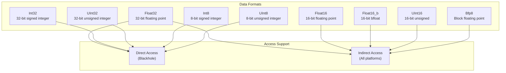

**Format Properties:**

| Format | Value | Bits | Direct R/W | Indirect R/W | Notes |
|--------|-------|------|------------|--------------|-------|
| `Float32` | 0 | 32 | ✓ (BH) | ✓ | Special handling on WH |
| `Float16` | 1 | 16 | ✗ | ✓ | Standard 16-bit float |
| `Float16_b` | 2 | 16 | ✗ | ✓ | bfloat16 format |
| `Bfp8` | 3 | 8 | ✗ | ✓ | Block floating point |
| `Bfp8_b` | 4 | 8 | ✗ | ✓ | Block float variant |
| `Bfp4` | 5 | 4 | ✗ | ✓ | Block float 4-bit |
| `Bfp4_b` | 6 | 4 | ✗ | ✓ | Block float 4-bit variant |
| `Bfp2` | 7 | 2 | ✗ | ✓ | Block float 2-bit |
| `Bfp2_b` | 8 | 2 | ✗ | ✓ | Block float 2-bit variant |
| `UInt16` | 11 | 16 | ✗ | ✓ | Unsigned 16-bit |
| `Int32` | 12 | 32 | ✓ (BH) | ✓ | Signed 32-bit |
| `UInt32` | 13 | 32 | ✓ (BH) | ✓ | Unsigned 32-bit |
| `Int8` | 14 | 8 | ✓ (BH) | ✓ | Signed 8-bit (32-bit mode) |
| `UInt8` | 15 | 8 | ✓ (BH) | ✓ | Unsigned 8-bit (32-bit mode) |

Sources: [ttexalens/pack_unpack_regfile.py:1-200](), [ttexalens/debug_tensix.py:156-170]()
```
### Format Detection

The current data format is stored in the ALU format register and automatically detected when reading register files:

Sources: [ttexalens/debug_tensix.py 280](https://github.com/tenstorrent/tt-exalens/blob/046c35eb/ttexalens/debug_tensix.py#L280-L280)

* * *

## Access Methods

### Indirect Access (All Platforms)

Indirect access uses the debug bus and instruction injection to expose register file contents:

**Indirect Read Process:**

1.   **Enable debug array read mode:**

    *   Set `RISCV_DEBUG_REG_DBG_ARRAY_RD_EN = 1`

2.   **For each row in the register file:**

    *   Inject preparation instructions (e.g., `TT_OP_SFPLOAD`, `TT_OP_MOVDBGA2D`)
    *   Set read command: `row_addr + (regfile_id << 16) + (segment << 12)`
    *   Read 8 segments × 4 bytes = 32 bytes per row
    *   Inject cleanup instructions (e.g., `TT_OP_SFPSTORE`)

3.   **Disable debug array read mode:**

    *   Set `RISCV_DEBUG_REG_DBG_ARRAY_RD_EN = 0`

Sources: [ttexalens/debug_tensix.py 202-265](https://github.com/tenstorrent/tt-exalens/blob/046c35eb/ttexalens/debug_tensix.py#L202-L265)

### Direct Access (Blackhole Only)

On Blackhole architecture, the destination register file can be accessed directly through memory-mapped destination memory:

**Direct Access Advantages:**

| Feature | Indirect Access | Direct Access |
| --- | --- | --- |
| Platforms | All | Blackhole only |
| Speed | Slower (instruction injection) | Faster (memory read) |
| Format support | All formats | 32-bit formats only |
| Write support | None | Full |
| Tile count control | Fixed | Configurable |

**Requirements for Direct Access:**

*   Architecture must be Blackhole
*   Register file must be DSTACC
*   Format must be: Float32, Int32, UInt32, Int8, or UInt8

Sources: [ttexalens/debug_tensix.py 164-200](https://github.com/tenstorrent/tt-exalens/blob/046c35eb/ttexalens/debug_tensix.py#L164-L200)[ttexalens/hardware/blackhole/functional_worker_block.py 1-100](https://github.com/tenstorrent/tt-exalens/blob/046c35eb/ttexalens/hardware/blackhole/functional_worker_block.py#L1-L100)

* * *

## Instruction Injection

### Overview

The instruction injection system allows pushing Tensix instructions directly into thread execution FIFOs, bypassing the RISC cores. This is used for both debug operations and register file access.

### Injection Process

**1. Claim Thread FIFO (`_start_insn_push`):**

**2. Push Instruction (`_insn_push`):**

**3. Release FIFO (`_end_insn_push`):**

Sources: [ttexalens/debug_tensix.py 76-116](https://github.com/tenstorrent/tt-exalens/blob/046c35eb/ttexalens/debug_tensix.py#L76-L116)[ttexalens/debug_tensix.py 118-139](https://github.com/tenstorrent/tt-exalens/blob/046c35eb/ttexalens/debug_tensix.py#L118-L139)

### Common Instruction Sequences

**SRCA Row Selection:**

**SRCB Access (example pattern):**

Sources: [ttexalens/debug_tensix.py 236-247](https://github.com/tenstorrent/tt-exalens/blob/046c35eb/ttexalens/debug_tensix.py#L236-L247)

* * *

## Platform-Specific Considerations

### Wormhole Specifics

**Float32 DSTACC Reading:**

On Wormhole, reading DSTACC as Float32 returns zeros in the lower 16 bits of each datum due to an architectural quirk. The workaround involves:

1.   Read upper 16 bits normally
2.   Execute in-place bit-shift kernel to expose lower 16 bits
3.   Read lower 16 bits from upper position
4.   Combine both halves

**⚠️ Warning:** This process clobbers DSTACC contents.

Sources: [ttexalens/debug_tensix.py 286-308](https://github.com/tenstorrent/tt-exalens/blob/046c35eb/ttexalens/debug_tensix.py#L286-L308)

### Blackhole Specifics

**Direct Destination Memory Access:**

Blackhole architecture exposes the destination register file as a directly accessible memory region:

| Feature | Value |
| --- | --- |
| Base Address | `dest.address.private_address` |
| Size | Variable (sufficient for max tiles) |
| Access Method | Via TRISC0 debug interface |
| Format Support | 32-bit formats (Float32, Int32, UInt32, Int8, UInt8) |

**Tile Size Validation:**

Where `TILE_SIZE = 32 × 32 = 1024` elements.

**UInt32/UInt8 Write Workaround:**

Due to ALU register format limitations (4 bits, max value 15), UInt32 and UInt8 cannot be written directly. Instead:

*   UInt32 → write as Int32
*   UInt8 → write as Int8

Sources: [ttexalens/debug_tensix.py 172-200](https://github.com/tenstorrent/tt-exalens/blob/046c35eb/ttexalens/debug_tensix.py#L172-L200)[ttexalens/debug_tensix.py 323-341](https://github.com/tenstorrent/tt-exalens/blob/046c35eb/ttexalens/debug_tensix.py#L323-L341)

* * *

## Usage Examples

### Reading Register Files

**Read DSTACC with automatic format detection:**

**Read specific number of tiles (Blackhole only):**

**Read SRCA (last 2 faces only):**

Sources: [ttexalens/debug_tensix.py 267-321](https://github.com/tenstorrent/tt-exalens/blob/046c35eb/ttexalens/debug_tensix.py#L267-L321)[test/ttexalens/unit_tests/test_tensix_debug.py 60-82](https://github.com/tenstorrent/tt-exalens/blob/046c35eb/test/ttexalens/unit_tests/test_tensix_debug.py#L60-L82)

### Writing Register Files

**Write Float32 data (Blackhole only):**

**Write Int32 data:**

**Write UInt32 data:**

Sources: [ttexalens/debug_tensix.py 343-355](https://github.com/tenstorrent/tt-exalens/blob/046c35eb/ttexalens/debug_tensix.py#L343-L355)[test/ttexalens/unit_tests/test_tensix_debug.py 91-122](https://github.com/tenstorrent/tt-exalens/blob/046c35eb/test/ttexalens/unit_tests/test_tensix_debug.py#L91-L122)

### Injecting Instructions

**Inject single instruction:**

**Inject instruction sequence:**

Sources: [ttexalens/debug_tensix.py 118-139](https://github.com/tenstorrent/tt-exalens/blob/046c35eb/ttexalens/debug_tensix.py#L118-L139)[ttexalens/debug_tensix.py 236-260](https://github.com/tenstorrent/tt-exalens/blob/046c35eb/ttexalens/debug_tensix.py#L236-L260)

### Direct Memory Access

**Read directly from destination memory (Blackhole):**

**Write directly to destination memory (Blackhole):**

Sources: [ttexalens/debug_tensix.py 172-200](https://github.com/tenstorrent/tt-exalens/blob/046c35eb/ttexalens/debug_tensix.py#L172-L200)

* * *

## Error Handling

### Common Errors

**1. Unsupported Architecture:**

**Solution:** Use indirect access or upgrade to Blackhole.

**2. Unsupported Data Format:**

**Solution:** Use indirect access for non-32-bit formats.

**3. SRCB Access:**

**Solution:** SRCB reading is not yet implemented.

**4. Value Out of Range:**

**Solution:** Ensure values fit within format bounds.

**5. Invalid Thread ID:**

**Solution:** Use thread_id in range [0, 1, 2].

Sources: [ttexalens/debug_tensix.py 21-28](https://github.com/tenstorrent/tt-exalens/blob/046c35eb/ttexalens/debug_tensix.py#L21-L28)[ttexalens/debug_tensix.py 218-219](https://github.com/tenstorrent/tt-exalens/blob/046c35eb/ttexalens/debug_tensix.py#L218-L219)[ttexalens/debug_tensix.py 325-329](https://github.com/tenstorrent/tt-exalens/blob/046c35eb/ttexalens/debug_tensix.py#L325-L329)

* * *

## Implementation Details

### Memory Layout

**Register File Memory Structure:**

**Destination Memory (Blackhole):**

| Property | Value |
| --- | --- |
| Tile Size | 32 × 32 = 1024 elements |
| Bytes per Element | 4 (for 32-bit formats) |
| Bytes per Tile | 1024 × 4 = 4096 bytes |
| Max Tiles | `dest.size / 4096` |

Sources: [ttexalens/debug_tensix.py 37-38](https://github.com/tenstorrent/tt-exalens/blob/046c35eb/ttexalens/debug_tensix.py#L37-L38)[ttexalens/debug_tensix.py 141-154](https://github.com/tenstorrent/tt-exalens/blob/046c35eb/ttexalens/debug_tensix.py#L141-L154)


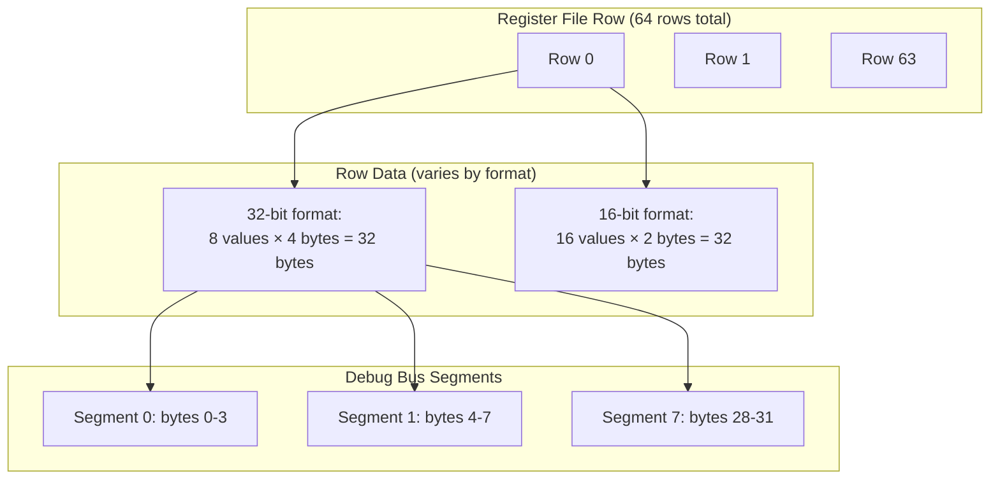

**Destination Memory (Blackhole):**

| Property | Value |
|----------|-------|
| Tile Size | 32 × 32 = 1024 elements |
| Bytes per Element | 4 (for 32-bit formats) |
| Bytes per Tile | 1024 × 4 = 4096 bytes |
| Max Tiles | `dest.size / 4096` |

Sources: [ttexalens/debug_tensix.py:37-38](), [ttexalens/debug_tensix.py:141-154]()
```
### Register References

**Key Debug Registers:**

| Register Name | Purpose |
| --- | --- |
| `RISCV_DEBUG_REG_DBG_INSTRN_BUF_STATUS` | FIFO status and ready flags |
| `RISCV_DEBUG_REG_DBG_INSTRN_BUF_CTRL0` | FIFO control and thread selection |
| `RISCV_DEBUG_REG_DBG_INSTRN_BUF_CTRL1` | Instruction data |
| `RISCV_DEBUG_REG_DBG_ARRAY_RD_EN` | Enable debug array read mode |
| `RISCV_DEBUG_REG_DBG_ARRAY_RD_CMD` | Read command (row + regfile + segment) |
| `RISCV_DEBUG_REG_DBG_ARRAY_RD_DATA` | Read data output |
| `ALU_FORMAT_SPEC_REG2_Dstacc` | Current data format in DSTACC |

Sources: [ttexalens/debug_tensix.py 74-117](https://github.com/tenstorrent/tt-exalens/blob/046c35eb/ttexalens/debug_tensix.py#L74-L117)[ttexalens/debug_tensix.py 231-262](https://github.com/tenstorrent/tt-exalens/blob/046c35eb/ttexalens/debug_tensix.py#L231-L262)

* * *

## Related Systems

This page documents Tensix-specific debug operations. For related functionality:

*   **RISC-V Core Control:**[RISC-V Debug Commands](https://deepwiki.com/tenstorrent/tt-exalens/4.4-risc-v-debug-commands) - halt, step, continue, PC access
*   **General Register Access:**[Memory and Register Commands](https://deepwiki.com/tenstorrent/tt-exalens/4.3-memory-and-register-commands) - configuration and debug register R/W
*   **Debug Bus Signals:** See debug-bus command documentation for signal-level inspection
*   **ELF Symbol Access:**[Symbolic Variable Access](https://deepwiki.com/tenstorrent/tt-exalens/3.8-symbolic-variable-access) - type-aware variable inspection

Sources: [ttexalens/debug_tensix.py 1-356](https://github.com/tenstorrent/tt-exalens/blob/046c35eb/ttexalens/debug_tensix.py#L1-L356)[ttexalens/hardware/risc_debug.py 1-100](https://github.com/tenstorrent/tt-exalens/blob/046c35eb/ttexalens/hardware/risc_debug.py#L1-L100)

Dismiss
Refresh this wiki

Enter email to refresh
