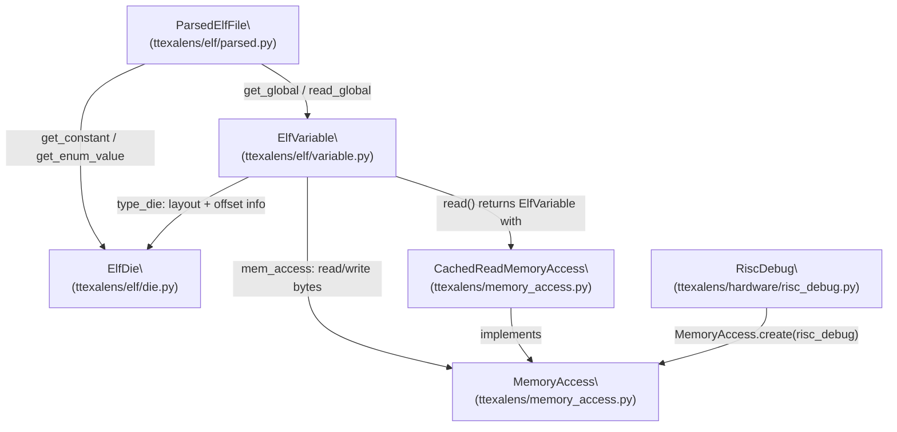
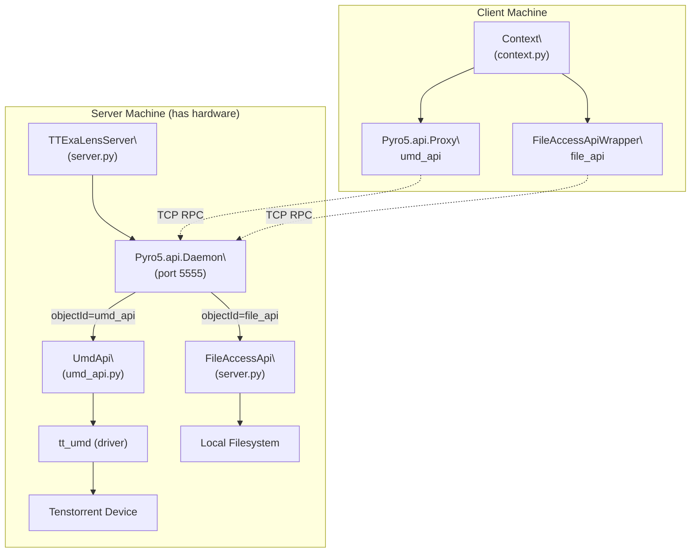

# Debug Bus and Signal Sampling

Relevant source files
*   [docs/ttexalens-app-docs.md](https://github.com/tenstorrent/tt-exalens/blob/046c35eb/docs/ttexalens-app-docs.md?plain=1)
*   [docs/ttexalens-lib-docs.md](https://github.com/tenstorrent/tt-exalens/blob/046c35eb/docs/ttexalens-lib-docs.md?plain=1)
*   [test/wheel/run-wheel.sh](https://github.com/tenstorrent/tt-exalens/blob/046c35eb/test/wheel/run-wheel.sh)
*   [ttexalens/__init__.py](https://github.com/tenstorrent/tt-exalens/blob/046c35eb/ttexalens/__init__.py)
*   [ttexalens/coordinate.py](https://github.com/tenstorrent/tt-exalens/blob/046c35eb/ttexalens/coordinate.py)
*   [ttexalens/device.py](https://github.com/tenstorrent/tt-exalens/blob/046c35eb/ttexalens/device.py)
*   [ttexalens/util.py](https://github.com/tenstorrent/tt-exalens/blob/046c35eb/ttexalens/util.py)

This page covers the debug bus infrastructure in TTExaLens: the data model for hardware signal descriptions, the two reading modes (direct register read and L1 memory sampling), the `DebugBusSignalStore` class, and the `debug-bus` CLI command.

The debug bus is a hardware daisy-chain that exposes internal microarchitectural signals on Tensix functional worker blocks. For the related topic of Tensix state dumping that also uses debug bus data, see [4.5](https://deepwiki.com/tenstorrent/tt-exalens/4.5-tensix-debug-commands). For the underlying register system that provides debug bus register addresses, see [5.4](https://deepwiki.com/tenstorrent/tt-exalens/5.4-register-system).

* * *

## Overview

Each functional worker core has a hardware debug daisy-chain. Signals are routed through it and can be read externally via NOC. Each signal is selected by three parameters: `daisy_sel` (which chain), `sig_sel` (which 128-bit register within the chain), and `rd_sel` (which 32-bit word within that register).

There are two ways to read signals:

| Mode | Method | Width | Atomicity |
| --- | --- | --- | --- |
| Direct register read | `read_signal()` | 32-bit per call | Non-atomic for full 128-bit groups |
| L1 memory sampling | `read_signal_group()` / `sample_signal_group()` | 128-bit per sample | Atomic capture of entire group |

Sources: [ttexalens/debug_bus_signal_store.py 1-50](https://github.com/tenstorrent/tt-exalens/blob/046c35eb/ttexalens/debug_bus_signal_store.py#L1-L50)

* * *




Sources: [ttexalens/elf/variable.py:1-25](), [ttexalens/elf/parsed.py:1-30](), [ttexalens/elf/__init__.py:1-21]()

---
```




Sources: [ttexalens/server.py:41-80](), [ttexalens/umd_api.py:44-146](), [ttexalens/cli.py:7-43]()

---
```
## Data Model

**Signal/group model flow:**

Sources: [ttexalens/debug_bus_signal_store.py 24-108](https://github.com/tenstorrent/tt-exalens/blob/046c35eb/ttexalens/debug_bus_signal_store.py#L24-L108)

### `DebugBusSignalDescription`

[ttexalens/debug_bus_signal_store.py 24-31](https://github.com/tenstorrent/tt-exalens/blob/046c35eb/ttexalens/debug_bus_signal_store.py#L24-L31)

| Field | Type | Range | Description |
| --- | --- | --- | --- |
| `rd_sel` | int | 0–3 | Selects one 32-bit word from the 128-bit register |
| `daisy_sel` | int | 0–255 | Selects the daisy chain |
| `sig_sel` | int | 0–65535 | Selects which 128-bit register |
| `mask` | int | 32-bit | Bitmask applied to the 32-bit word |
| `across_groups` | bool | — | `True` if the signal spans two consecutive groups (cannot be read atomically) |

### `L1MemReg2`

[ttexalens/debug_bus_signal_store.py 34-61](https://github.com/tenstorrent/tt-exalens/blob/046c35eb/ttexalens/debug_bus_signal_store.py#L34-L61)

Encodes the value written to `RISCV_DEBUG_REG_DBG_L1_MEM_REG2` to control L1 sampling. Bit layout:

| Bits | Field | Description |
| --- | --- | --- |
| 12 | `write_trigger` | Pulsed high to start sampling |
| 11:4 | `sampling_interval` | Cycles between samples (stored as `interval - 1`) |
| 3:0 | `write_mode` | `1` = increment address; `4` = hardware multi-sample mode |

### `ShiftMask` and `SignalGroupSample`

`ShiftMask` holds the precomputed `shift` and `mask` for a signal within a 128-bit sample. `SignalGroupSample` wraps a single 128-bit `raw_data` integer and its associated group mapping, providing dict-like access: `sample["signal_name"]` returns the extracted integer value.

[ttexalens/debug_bus_signal_store.py 64-98](https://github.com/tenstorrent/tt-exalens/blob/046c35eb/ttexalens/debug_bus_signal_store.py#L64-L98)

### `DebugBusSignalStoreInitialization`

[ttexalens/debug_bus_signal_store.py 100-108](https://github.com/tenstorrent/tt-exalens/blob/046c35eb/ttexalens/debug_bus_signal_store.py#L100-L108)

| Field | Type | Description |
| --- | --- | --- |
| `group_map` | `dict[str, tuple[int, int]]` | Group name → `(daisy_sel, sig_sel)` |
| `signals` | `dict[str, DebugBusSignalDescription]` | All signal definitions |
| `signal_groups` | `dict[str, dict[str, ShiftMask]]` | For each group, each signal's shift and mask in the 128-bit word |
| `combined_signals` | `dict[str, list[str]]` | Base name → list of `/suffix` part names |

* * *

## `DebugBusSignalStore`

The central class. One instance is created per `NocBlock` (and per `neo_id` on Quasar). It is obtained via `NocBlock.get_debug_bus(neo_id)`.

**Class relationships:**

Sources: [ttexalens/debug_bus_signal_store.py 110-522](https://github.com/tenstorrent/tt-exalens/blob/046c35eb/ttexalens/debug_bus_signal_store.py#L110-L522)

### Creating an Initialization Object

`DebugBusSignalStore.create_initialization(group_map, signals)` is a static method that processes the flat signal map and computes `signal_groups` and `combined_signals`. It should be called once per block type and the result reused across many `DebugBusSignalStore` instances.

[ttexalens/debug_bus_signal_store.py 474-521](https://github.com/tenstorrent/tt-exalens/blob/046c35eb/ttexalens/debug_bus_signal_store.py#L474-L521)

* * *

## Reading Modes

### Direct Register Read (`read_signal`)

[ttexalens/debug_bus_signal_store.py 247-294](https://github.com/tenstorrent/tt-exalens/blob/046c35eb/ttexalens/debug_bus_signal_store.py#L247-L294)

1.   Constructs a config word: `(1 << 29) | (rd_sel << 25) | (daisy_sel << 16) | sig_sel` and writes it to `RISCV_DEBUG_REG_DBG_BUS_CNTL_REG`.
2.   Reads the 32-bit value from `RISCV_DEBUG_REG_DBG_RD_DATA`.
3.   Applies the signal's `mask` and shifts out trailing zeros.

This is non-atomic for signals that span multiple `rd_sel` values. Combined signals (with `/suffix` in their name) can each be read independently but not simultaneously.

Sources: [ttexalens/debug_bus_signal_store.py 247-295](https://github.com/tenstorrent/tt-exalens/blob/046c35eb/ttexalens/debug_bus_signal_store.py#L247-L295)

### L1 Memory Sampling (`read_signal_group`, `sample_signal_group`)

[ttexalens/debug_bus_signal_store.py 296-436](https://github.com/tenstorrent/tt-exalens/blob/046c35eb/ttexalens/debug_bus_signal_store.py#L296-L436)

Captures a 128-bit group atomically by having hardware write it directly to L1 memory.

**Constraints:**

*   `l1_address` must be 16-byte aligned.
*   `l1_address` and all samples must fit within the first 1 MiB (address range `0x0`–`0xFFFFF`).
*   `samples >= 1`; `sampling_interval >= 2` when `samples > 1` (hardware bug can produce extra samples if interval is 1).
*   Not supported on Quasar devices.

**Process:**

Sources: [ttexalens/debug_bus_signal_store.py 296-402](https://github.com/tenstorrent/tt-exalens/blob/046c35eb/ttexalens/debug_bus_signal_store.py#L296-L402)

#### L1 Write Modes

| `write_mode` | Behavior |
| --- | --- |
| `0xF` | Initial setup mode |
| `1` | Increment L1 address by 16 bytes after each sample |
| `4` | Hardware multi-sample mode (used when `samples > 1`) |

### Unsafe Group Read (`read_signal_group_unsafe`)

[ttexalens/debug_bus_signal_store.py 465-472](https://github.com/tenstorrent/tt-exalens/blob/046c35eb/ttexalens/debug_bus_signal_store.py#L465-L472)

Performs four sequential 32-bit reads (one per `rd_sel` value) and assembles them into a 128-bit integer. This is **not atomic**: the hardware state may change between reads. Used in the `dump-tensix-state` command when no L1 address is provided.

* * *

## Signal Types

| Type | Description | Example |
| --- | --- | --- |
| Simple | Single `rd_sel`, single signal | `brisc_pc` |
| Combined | Multiple `/suffix` parts spanning multiple `rd_sel` values in the same group | `brisc_if_ex_deco/0`, `brisc_if_ex_deco/1` |
| Across-groups | `across_groups=True`; spans different `sig_sel` values; cannot be read atomically | `trisc0_pc_buffer_next_cmd_fifo_data` |

Combined signals are assembled automatically when reading via a group. The base name (without `/suffix`) appears as a single key in `SignalGroupSample`. Across-groups signals are **excluded** from all group samples; each part can only be read individually via `read_signal`.

Sources: [ttexalens/debug_bus_signal_store.py 164-183](https://github.com/tenstorrent/tt-exalens/blob/046c35eb/ttexalens/debug_bus_signal_store.py#L164-L183)[ttexalens/hardware/wormhole/functional_worker_debug_bus_signals.py 141-146](https://github.com/tenstorrent/tt-exalens/blob/046c35eb/ttexalens/hardware/wormhole/functional_worker_debug_bus_signals.py#L141-L146)

* * *

## Hardware Signal Maps

Signal definitions are per-architecture and per-block-type. They are `dict[str, DebugBusSignalDescription]` named `debug_bus_signal_map`.

| Architecture | File |
| --- | --- |
| Wormhole | [ttexalens/hardware/wormhole/functional_worker_debug_bus_signals.py](https://github.com/tenstorrent/tt-exalens/blob/046c35eb/ttexalens/hardware/wormhole/functional_worker_debug_bus_signals.py) |
| Blackhole | [ttexalens/hardware/blackhole/functional_worker_debug_bus_signals.py](https://github.com/tenstorrent/tt-exalens/blob/046c35eb/ttexalens/hardware/blackhole/functional_worker_debug_bus_signals.py) |

Both files follow the same structure. Examples:

```
"brisc_pc":   DebugBusSignalDescription(rd_sel=0, daisy_sel=7, sig_sel=10, mask=0x7FFFFFFF)
"trisc0_pc":  DebugBusSignalDescription(rd_sel=0, daisy_sel=7, sig_sel=12, mask=0x7FFFFFFF)
```

Wormhole PC signals use `daisy_sel=7` and even `sig_sel` multiples. Blackhole uses `daisy_sel=7` with odd `sig_sel` values (`2*N+1`) and a narrower 30-bit mask.

The `TensixDebugBusDescription` dataclass in [ttexalens/hardware/tensix_registers_description.py 29-36](https://github.com/tenstorrent/tt-exalens/blob/046c35eb/ttexalens/hardware/tensix_registers_description.py#L29-L36) defines which group names are used for specific debug state categories (RWC, ADC, etc.), separate from the signal map.

* * *

## Debug Bus Registers

`DebugBusSignalStore` resolves these register names via `RegisterStore.get_register_noc_address()`:

| Register Name | Role |
| --- | --- |
| `RISCV_DEBUG_REG_DBG_BUS_CNTL_REG` | Write bus configuration (enable, rd_sel, daisy_sel, sig_sel) |
| `RISCV_DEBUG_REG_DBG_RD_DATA` | Read 32-bit signal output |
| `RISCV_DEBUG_REG_DBG_L1_MEM_REG0` | L1 start address for sampling (bits `[addr >> 4]`) |
| `RISCV_DEBUG_REG_DBG_L1_MEM_REG1` | L1 end address (used when samples > 1) |
| `RISCV_DEBUG_REG_DBG_L1_MEM_REG2` | Sampling control (write trigger, interval, write mode) |

Sources: [ttexalens/debug_bus_signal_store.py 139-163](https://github.com/tenstorrent/tt-exalens/blob/046c35eb/ttexalens/debug_bus_signal_store.py#L139-L163)

* * *

## CLI Command: `debug-bus`

Short name: `dbus`. Defined in [ttexalens/cli_commands/debug_bus.py](https://github.com/tenstorrent/tt-exalens/blob/046c35eb/ttexalens/cli_commands/debug_bus.py)

### Subcommands

| Subcommand | Description |
| --- | --- |
| `list-signals` | List known signal names (with optional `--search` pattern and `--max` limit) |
| `list-groups` | List known group names |
| `group <group-name> <l1-address>` | Read all signals in a group via L1 sampling |
| `<signals>` | Read one or more signals by name or inline description |

### Signal Specification Syntax for `<signals>`

The `parse_string()` function [ttexalens/cli_commands/debug_bus.py 103-127](https://github.com/tenstorrent/tt-exalens/blob/046c35eb/ttexalens/cli_commands/debug_bus.py#L103-L127) parses a comma-separated list of signal names and inline signal descriptions:

| Format | Example | Meaning |
| --- | --- | --- |
| Signal name | `brisc_pc` | Read named signal |
| Inline description | `{7,0,12,0x3ffffff}` | `{daisy_sel, rd_sel, sig_sel[, mask]}` |
| Mixed | `trisc0_pc,{7,0,12,0x3ffffff}` | Both together |

When mask is omitted in the inline form, it defaults to `0xFFFFFFFF`.

### Group Sampling Options

| Option | Default | Description |
| --- | --- | --- |
| `--samples <N>` | `1` | Number of 128-bit samples to capture |
| `--sampling-interval <cycles>` | `2` | Clock cycles between samples (must be 2–256 when samples > 1) |
| `--search <pattern>` | none | Wildcard filter on signal names within the group output |
| `--max <N>` | `10` | Limit search output |

### Signal Value Formatting

[ttexalens/cli_commands/debug_bus.py 75-100](https://github.com/tenstorrent/tt-exalens/blob/046c35eb/ttexalens/cli_commands/debug_bus.py#L75-L100)

*   1-bit signals (single-bit mask): displayed as `True` / `False`.
*   Multi-bit signals: displayed as `0x<hex>`.
*   When multiple samples are collected, all values are shown in a list.

### CLI Flow

Sources: [ttexalens/cli_commands/debug_bus.py 130-280](https://github.com/tenstorrent/tt-exalens/blob/046c35eb/ttexalens/cli_commands/debug_bus.py#L130-L280)

### Examples

**List up to 10 predefined signals (default max):**

```
debug-bus list-signals
```

Output shows a table with Group, Name, and Value columns for the first 10 matches.

**List all predefined signals:**

```
debug-bus list-signals --max all
```

**List up to 5 signals whose names contain 'pc':**

```
debug-bus list-signals --search *pc* --max 5
```

Example output:

```
Signals
╭────────────────┬───────────────────────┬────────╮
│ Group          │ Name                  │ Value  │
├────────────────┼───────────────────────┼────────┤
│ brisc_group_a  │ brisc_dbg_obs_cmt_pc  │ 0x0    │
│ brisc_group_b  │ brisc_id_ex_pc        │ 0x2c   │
│ brisc_group_b  │ brisc_pc              │ 0x2c   │
│ ncrisc_group_a │ ncrisc_dbg_obs_cmt_pc │ 0x0    │
│ ncrisc_group_b │ ncrisc_id_ex_pc       │ 0x5c90 │
╰────────────────┴───────────────────────┴────────╯
```

**List all debug bus signal groups:**

```
debug-bus list-groups
```

**List groups whose names match pattern 'brisc':**

```
debug-bus list-groups --search brisc*
```

Example output:

```
Groups
╭───────────────╮
│ Group Name    │
├───────────────┤
│ brisc_group_a │
│ brisc_group_b │
│ brisc_group_c │
╰───────────────╯
```

**Read two signals by name:**

```
debug-bus trisc0_pc,trisc1_pc
```

Example output:

```
device:0 loc:1-2 (0,0)  trisc0_pc: 0x66b0
device:0 loc:1-2 (0,0)  trisc1_pc: 0x7084
```

**Read signal by inline description (daisy_sel=7, rd_sel=0, sig_sel=12, mask=0x3FFFFFF):**

```
debug-bus {7,0,12,0x3ffffff},trisc2_pc
```

Example output:

```
device:0 loc:1-2 (0,0)  Daisy:7; Rd Sel:0; Sig Sel:12; Mask:0x3ffffff: 0x0
device:0 loc:1-2 (0,0)  trisc2_pc: 0x7aa0
```

**Sample a group into L1 at address 0x1000 (4 samples, 10-cycle interval):**

```
debug-bus group brisc_group_a 0x1000 --samples 4 --sampling-interval 10
```

Example output:

```
=== Device 0 - location 0,0 - Group: brisc_group_a ===
                                brisc_group_a
╭────────────────────────┬──────────────────────────────────────────────────╮
│ Name                   │ Value                                            │
├────────────────────────┼──────────────────────────────────────────────────┤
│ brisc_dbg_obs_cmt_pc   │ [0x0, 0x0, 0x0, 0x0]                             │
│ brisc_dbg_obs_cmt_vld  │ [False, False, False, False]                     │
│ brisc_dbg_obs_mem_addr │ [0x3fb00008, 0x3fb00008, 0x3fb00008, 0x3fb00008] │
│ brisc_dbg_obs_mem_rden │ [False, False, False, False]                     │
│ brisc_dbg_obs_mem_wren │ [False, False, False, False]                     │
│ brisc_i_instrn         │ [0x0, 0x0, 0x0, 0x0]                             │
│ brisc_i_instrn_req_rtr │ [True, True, True, True]                         │
│ brisc_i_instrn_vld     │ [False, False, False, False]                     │
│ brisc_o_instrn_addr    │ [0x0, 0x0, 0x0, 0x0]                             │
│ brisc_o_instrn_req     │ [False, False, False, False]                     │
╰────────────────────────┴──────────────────────────────────────────────────╯
```

**Sample a group and filter output to signals ending with 'pc':**

```
debug-bus group brisc_group_a 0x1000 --search *pc
```

Example output:

```
=== Device 0 - location 0,0 - Group: brisc_group_a ===
         brisc_group_a
╭──────────────────────┬───────╮
│ Name                 │ Value │
├──────────────────────┼───────┤
│ brisc_dbg_obs_cmt_pc │ 0x0   │
│ brisc_pc             │ 0x0   │
╰──────────────────────┴───────╯
```

Sources: [docs/ttexalens-app-docs.md 171-397](https://github.com/tenstorrent/tt-exalens/blob/046c35eb/docs/ttexalens-app-docs.md?plain=1#L171-L397)

* * *

## Validation and Error Conditions

[ttexalens/debug_bus_signal_store.py 215-245](https://github.com/tenstorrent/tt-exalens/blob/046c35eb/ttexalens/debug_bus_signal_store.py#L215-L245)

`_validate_signal_parameters()` checks:

*   `rd_sel` in 0–3
*   `daisy_sel` in 0–255
*   `sig_sel` in 0–65535
*   `mask` is a valid 32-bit unsigned integer

`_validate_l1_parameters()` checks:

*   `samples >= 1`
*   `l1_address` is 16-byte aligned
*   All samples fit within the first 1 MiB (`end_address < 0x100000`)
*   If `samples > 1`: `sampling_interval` in 2–256

Group sampling raises `NotImplementedError` on Quasar devices.

* * *

## Relationship to Other Systems

Sources: [ttexalens/cli_commands/debug_bus.py 59-72](https://github.com/tenstorrent/tt-exalens/blob/046c35eb/ttexalens/cli_commands/debug_bus.py#L59-L72)[ttexalens/cli_commands/dump-tensix-state.py 39-40](https://github.com/tenstorrent/tt-exalens/blob/046c35eb/ttexalens/cli_commands/dump-tensix-state.py#L39-L40)[ttexalens/debug_bus_signal_store.py 110-138](https://github.com/tenstorrent/tt-exalens/blob/046c35eb/ttexalens/debug_bus_signal_store.py#L110-L138)

This wiki is featured in the [repository](https://github.com/tenstorrent/tt-exalens/blob/main/README.md)

Dismiss
Refresh this wiki

Enter email to refresh
