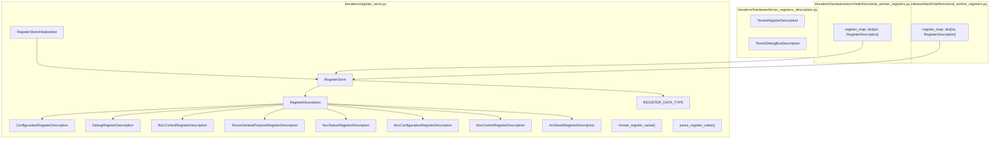
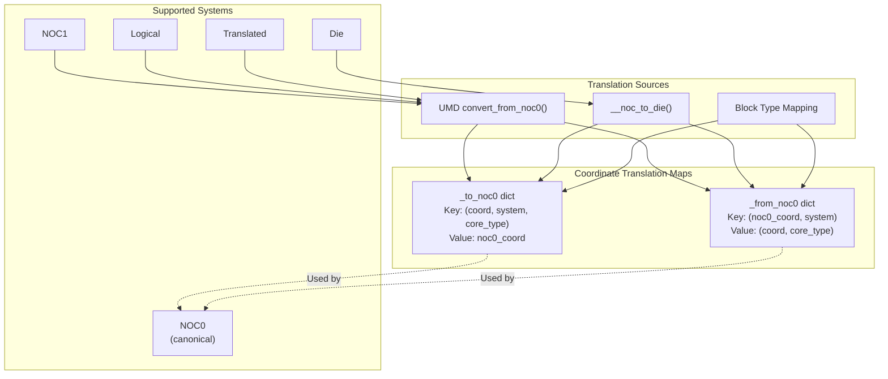
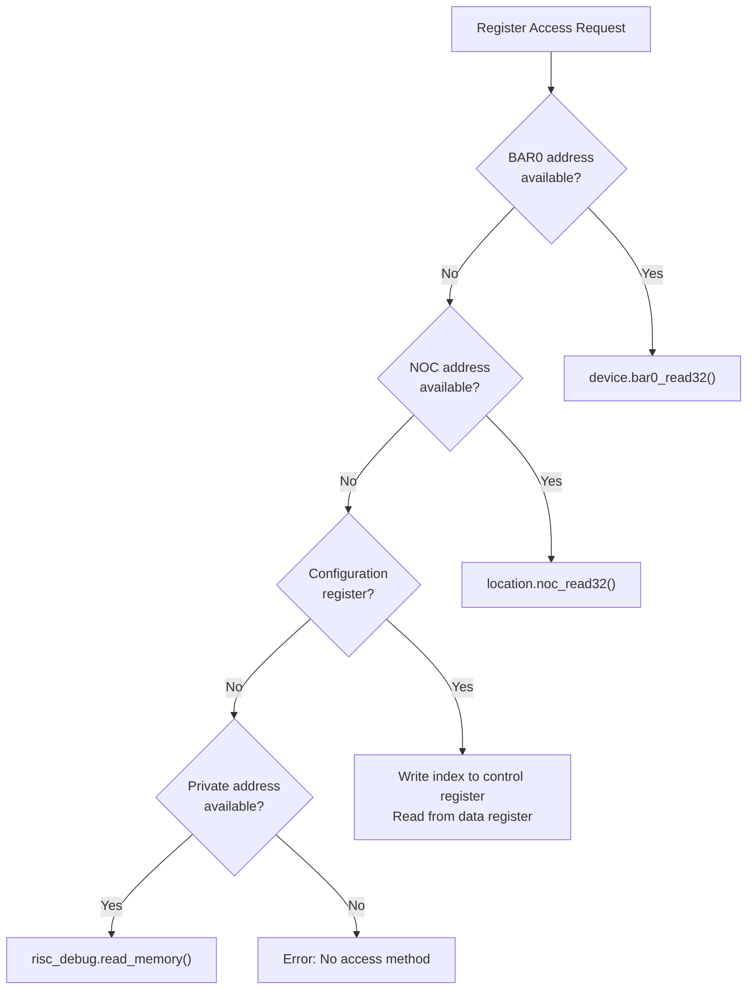
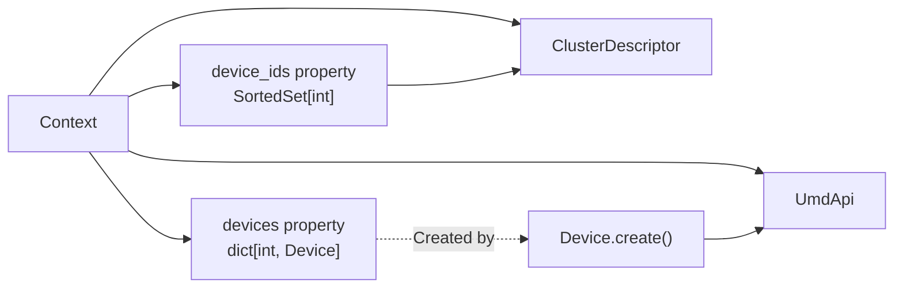

# Device Architecture

Relevant source files
*   [VERSION](https://github.com/tenstorrent/tt-exalens/blob/046c35eb/VERSION)
*   [test/ttexalens/unit_tests/test_remote_communication.py](https://github.com/tenstorrent/tt-exalens/blob/046c35eb/test/ttexalens/unit_tests/test_remote_communication.py)
*   [test/wheel/run-wheel.sh](https://github.com/tenstorrent/tt-exalens/blob/046c35eb/test/wheel/run-wheel.sh)
*   [ttexalens/cli_commands/interfaces.py](https://github.com/tenstorrent/tt-exalens/blob/046c35eb/ttexalens/cli_commands/interfaces.py)
*   [ttexalens/device.py](https://github.com/tenstorrent/tt-exalens/blob/046c35eb/ttexalens/device.py)
*   [ttexalens/requirements.txt](https://github.com/tenstorrent/tt-exalens/blob/046c35eb/ttexalens/requirements.txt)
*   [ttexalens/server.py](https://github.com/tenstorrent/tt-exalens/blob/046c35eb/ttexalens/server.py)
*   [ttexalens/umd_api.py](https://github.com/tenstorrent/tt-exalens/blob/046c35eb/ttexalens/umd_api.py)
*   [ttexalens/umd_device.py](https://github.com/tenstorrent/tt-exalens/blob/046c35eb/ttexalens/umd_device.py)
*   [ttexalens/util.py](https://github.com/tenstorrent/tt-exalens/blob/046c35eb/ttexalens/util.py)

This document describes the Device abstraction layer, which provides a unified, platform-independent interface for interacting with Tenstorrent hardware. The `Device` class serves as the central abstraction, managing hardware blocks, coordinate systems, memory operations, and platform-specific behaviors. For information about specific RISC-V debugging capabilities, see [RISC-V Debugging System](https://deepwiki.com/tenstorrent/tt-exalens/6-risc-v-debugging-system). For details on the ELF/DWARF symbolic debugging system, see [Advanced Features](https://deepwiki.com/tenstorrent/tt-exalens/7-advanced-features).

## Purpose and Scope

The Device Architecture layer provides:

*   **Platform-agnostic device interface**: Unified API across Wormhole, Blackhole, and Quasar architectures
*   **Hardware block management**: Discovery and access to on-chip blocks (Tensix cores, DRAM, Ethernet, ARC)
*   **Coordinate system integration**: Translation between multiple coordinate systems (NOC0, NOC1, logical, translated, die)
*   **NOC operation management**: Read/write operations with automatic failover and timeout detection
*   **Register access abstraction**: Unified interface for BAR0, NOC, and configuration register access




Sources: [ttexalens/register_store.py:1-20](), [ttexalens/hardware/tensix_registers_description.py](), [ttexalens/hardware/wormhole/functional_worker_registers.py:1-15](), [ttexalens/hardware/blackhole/functional_worker_registers.py:1-15]()

---
```
## Device Class Hierarchy

The `Device` class is an abstract base class that defines the common interface. Platform-specific implementations inherit from it and override behavior where necessary.

**Sources:**[ttexalens/device.py 72-553](https://github.com/tenstorrent/tt-exalens/blob/046c35eb/ttexalens/device.py#L72-L553)[ttexalens/context.py 23-101](https://github.com/tenstorrent/tt-exalens/blob/046c35eb/ttexalens/context.py#L23-L101)

## Device Factory and Platform Detection

The `Device.create()` factory method instantiates the correct device type based on the UMD architecture enum. This allows the rest of the system to work with a generic `Device` interface while getting platform-specific behavior automatically.

**Architecture Detection Process:**

| Step | Code Entity | Purpose |
| --- | --- | --- |
| 1. Request device | `context.umd_api.get_device(device_id)` | Get UMD device wrapper |
| 2. Query architecture | `umd_device.arch` | Get `tt_umd.ARCH` enum value |
| 3. Match architecture | `match arch:` | Pattern match on architecture |
| 4. Import platform module | `from ttexalens.hardware.wormhole.device` | Dynamic import |
| 5. Instantiate device | `WormholeDevice(device_id, umd_device, context)` | Create platform-specific instance |

**Sources:**[ttexalens/device.py 104-126](https://github.com/tenstorrent/tt-exalens/blob/046c35eb/ttexalens/device.py#L104-L126)[ttexalens/context.py 54-62](https://github.com/tenstorrent/tt-exalens/blob/046c35eb/ttexalens/context.py#L54-L62)

## Block Type System

The Device manages multiple types of hardware blocks, each identified by a block type string. The `block_types` dictionary defines the characteristics of each block type.

**Block Type Definitions:**

**Block Discovery and Access:**

**Sources:**[ttexalens/device.py 425-457](https://github.com/tenstorrent/tt-exalens/blob/046c35eb/ttexalens/device.py#L425-L457)[ttexalens/device.py 400-423](https://github.com/tenstorrent/tt-exalens/blob/046c35eb/ttexalens/device.py#L400-L423)[ttexalens/device.py 346-354](https://github.com/tenstorrent/tt-exalens/blob/046c35eb/ttexalens/device.py#L346-L354)

## Coordinate System Integration

The Device class maintains cached coordinate translation dictionaries for fast conversion between coordinate systems. All coordinates are internally normalized to NOC0 format.

**Translation Methods:**

| Method | Signature | Purpose |
| --- | --- | --- |
| `to_noc0()` | `(coord_tuple, coord_system, core_type) -> tuple[int, int]` | Convert any coordinate to NOC0 |
| `from_noc0()` | `(noc0_tuple, coord_system) -> tuple[tuple[int, int], str]` | Convert NOC0 to any system |
| `_init_coordinate_systems()` | `() -> None` | Build translation caches at initialization |

**Sources:**[ttexalens/device.py 273-333](https://github.com/tenstorrent/tt-exalens/blob/046c35eb/ttexalens/device.py#L273-L333)[ttexalens/coordinate.py](https://github.com/tenstorrent/tt-exalens/blob/046c35eb/ttexalens/coordinate.py)




**Translation Methods:**

| Method | Signature | Purpose |
|--------|-----------|---------|
| `to_noc0()` | `(coord_tuple, coord_system, core_type) -> tuple[int, int]` | Convert any coordinate to NOC0 |
| `from_noc0()` | `(noc0_tuple, coord_system) -> tuple[tuple[int, int], str]` | Convert NOC0 to any system |
| `_init_coordinate_systems()` | `() -> None` | Build translation caches at initialization |
```
## NOC Operations and Failover

The Device provides `noc_read()` and `noc_write()` methods for memory access. These operations support automatic NOC failover when timeout errors are detected.

### NOC Failover Mechanism

**Failover Configuration:**

| Context Property | Default | Purpose |
| --- | --- | --- |
| `noc_failover` | `True` | Enable/disable automatic NOC failover |
| `use_noc1` | `False` | Start with NOC1 as primary |
| `_noc_to_use` | `[0, 1]` or `[1, 0]` | Dynamic NOC priority queue |

**Sources:**[ttexalens/device.py 143-168](https://github.com/tenstorrent/tt-exalens/blob/046c35eb/ttexalens/device.py#L143-L168)[ttexalens/device.py 199-247](https://github.com/tenstorrent/tt-exalens/blob/046c35eb/ttexalens/device.py#L199-L247)[ttexalens/umd_device.py 13-29](https://github.com/tenstorrent/tt-exalens/blob/046c35eb/ttexalens/umd_device.py#L13-L29)

## Memory Operations

The Device class provides high-level NOC read/write operations that integrate coordinate translation, alignment handling, DMA optimization, and failover.

### Read/Write Flow

**Key Features:**

| Feature | Implementation | Location |
| --- | --- | --- |
| Coordinate conversion | `location._noc0_coord` | [device.py 208](https://github.com/tenstorrent/tt-exalens/blob/046c35eb/device.py#L208-L208) |
| NOC failover | `_with_noc_failover()` wrapper | [device.py 143-168](https://github.com/tenstorrent/tt-exalens/blob/046c35eb/device.py#L143-L168) |
| Alignment handling | `__read_from_device_reg_unaligned()` | [umd_device.py 169-217](https://github.com/tenstorrent/tt-exalens/blob/046c35eb/umd_device.py#L169-L217) |
| DMA optimization | Threshold-based selection | [umd_device.py 117-120](https://github.com/tenstorrent/tt-exalens/blob/046c35eb/umd_device.py#L117-L120) |
| Timeout detection | Duration + 0xFFFFFFFF check | [umd_device.py 127-136](https://github.com/tenstorrent/tt-exalens/blob/046c35eb/umd_device.py#L127-L136) |
| 4B mode | Single-word vs block reads | [umd_device.py 189](https://github.com/tenstorrent/tt-exalens/blob/046c35eb/umd_device.py#L189-L189) |

**Sources:**[ttexalens/device.py 199-247](https://github.com/tenstorrent/tt-exalens/blob/046c35eb/ttexalens/device.py#L199-L247)[ttexalens/umd_device.py 117-217](https://github.com/tenstorrent/tt-exalens/blob/046c35eb/ttexalens/umd_device.py#L117-L217)[ttexalens/umd_device.py 276-288](https://github.com/tenstorrent/tt-exalens/blob/046c35eb/ttexalens/umd_device.py#L276-L288)

## Register Access Methods

The Device supports multiple register access mechanisms depending on the register type and location.

### Register Access Hierarchy

**Register Types:**

| Register Type | Access Method | Use Case |
| --- | --- | --- |
| `DebugRegisterDescription` | Direct NOC or Private | Debug interface registers |
| `ConfigurationRegisterDescription` | Indexed (control + data registers) | Configuration space |
| `RiscControlRegisterDescription` | NOC or Private | RISC-V control registers |
| `NocStatusRegisterDescription` | NOC read | NOC status monitoring |
| `NocConfigurationRegisterDescription` | NOC read/write | NOC configuration |
| `ArcResetRegisterDescription` | BAR0 | ARC reset control |

**Sources:**[ttexalens/register_store.py 63-103](https://github.com/tenstorrent/tt-exalens/blob/046c35eb/ttexalens/register_store.py#L63-L103)[ttexalens/register_store.py 286-318](https://github.com/tenstorrent/tt-exalens/blob/046c35eb/ttexalens/register_store.py#L286-L318)[ttexalens/device.py 248-263](https://github.com/tenstorrent/tt-exalens/blob/046c35eb/ttexalens/device.py#L248-L263)




**Register Types:**

| Register Type | Access Method | Use Case |
|--------------|---------------|----------|
| `DebugRegisterDescription` | Direct NOC or Private | Debug interface registers |
| `ConfigurationRegisterDescription` | Indexed (control + data registers) | Configuration space |
| `RiscControlRegisterDescription` | NOC or Private | RISC-V control registers |
| `NocStatusRegisterDescription` | NOC read | NOC status monitoring |
| `NocConfigurationRegisterDescription` | NOC read/write | NOC configuration |
| `ArcResetRegisterDescription` | BAR0 | ARC reset control |
```
## Device Properties and Metadata

The Device class exposes several cached properties for device metadata and capabilities.

**Device Properties Table:**

| Property | Type | Description |
| --- | --- | --- |
| `id` | `int` | Logical device ID in cluster |
| `unique_id` | `int` | Hardware wafer ID |
| `is_local` | `bool` | True if MMIO-capable (PCIe or JTAG) |
| `board_type` | `tt_umd.BoardType` | Physical board type |
| `firmware_version` | `FirmwareVersion` | ARC firmware version |
| `local_device` | `Device` | MMIO device for this chip (self or parent) |
| `remote_devices` | `list[Device]` | Remote devices behind this MMIO device |
| `debuggable_cores` | `list[RiscDebug]` | All RISC-V cores that support debugging |
| `arc_block` | `ArcBlock` | The ARC management block |
| `active_eth_blocks` | `list[NocBlock]` | Ethernet blocks with active connections |
| `idle_eth_blocks` | `list[NocBlock]` | Ethernet blocks without connections |

**Sources:**[ttexalens/device.py 127-198](https://github.com/tenstorrent/tt-exalens/blob/046c35eb/ttexalens/device.py#L127-L198)[ttexalens/device.py 356-390](https://github.com/tenstorrent/tt-exalens/blob/046c35eb/ttexalens/device.py#L356-L390)[ttexalens/device.py 85-92](https://github.com/tenstorrent/tt-exalens/blob/046c35eb/ttexalens/device.py#L85-L92)

## UMD Integration Layer

The `UmdDevice` class wraps the C++ `tt_umd.TTDevice` to provide Python-friendly interface with additional features like timeout detection and remote Ethernet failover.

### UMD Device Wrapper Architecture

**Timeout Detection Logic:**

The UmdDevice measures operation duration and detects timeouts by checking:

1.   Duration exceeds threshold (`READ_TIMEOUT` or `WRITE_TIMEOUT`)
2.   For reads: last 4 bytes are `0xFFFFFFFF` (NOC timeout indicator)
3.   For writes: consecutive timeout count reaches threshold

**Remote Ethernet Failover:**

When a remote read/write fails and the device is remote (not MMIO-capable), the UmdDevice attempts to reconfigure to use a different active Ethernet core for the remote transfer path.

**Sources:**[ttexalens/umd_device.py 31-90](https://github.com/tenstorrent/tt-exalens/blob/046c35eb/ttexalens/umd_device.py#L31-L90)[ttexalens/umd_device.py 113-168](https://github.com/tenstorrent/tt-exalens/blob/046c35eb/ttexalens/umd_device.py#L113-L168)[ttexalens/umd_device.py 96-106](https://github.com/tenstorrent/tt-exalens/blob/046c35eb/ttexalens/umd_device.py#L96-L106)[ttexalens/umd_device.py 204-217](https://github.com/tenstorrent/tt-exalens/blob/046c35eb/ttexalens/umd_device.py#L204-L217)

## Device Rendering and Visualization

The Device class provides a `render()` method that generates an ASCII visualization of the device grid showing block types.

**Rendering Components:**

| Component | Purpose | Implementation |
| --- | --- | --- |
| Axis selection | Choose coordinate system for axes | `axis_coordinate` parameter |
| Cell renderer | Custom rendering per cell | `cell_renderer` callback |
| Legend | Additional information per row | `legend` parameter |
| Color coding | Block type colors | `block_types[type].color` |

**Sources:**[ttexalens/device.py 470-541](https://github.com/tenstorrent/tt-exalens/blob/046c35eb/ttexalens/device.py#L470-L541)

## Platform-Specific Implementations

Each supported architecture (Wormhole, Blackhole, Quasar) has a dedicated implementation that inherits from `Device`:

**Platform Modules:**

| Platform | Module Path | Key Differences |
| --- | --- | --- |
| Wormhole | `ttexalens/hardware/wormhole/device.py` | Original architecture, baseline implementation |
| Blackhole | `ttexalens/hardware/blackhole/device.py` | Enhanced features, different die mapping |
| Quasar | `ttexalens/hardware/quasar/device.py` | Specialized compute architecture |

Each platform-specific device must implement:

*   `get_tensix_registers_description()`: Return `TensixRegisterDescription` for platform
*   `get_tensix_debug_bus_description()`: Return `TensixDebugBusDescription` for platform
*   `get_block(location)`: Return appropriate `NocBlock` subclass
*   Die coordinate mappings: `DIE_X_TO_NOC_0_X`, `DIE_Y_TO_NOC_0_Y`, etc.

**Sources:**[ttexalens/device.py 104-126](https://github.com/tenstorrent/tt-exalens/blob/046c35eb/ttexalens/device.py#L104-L126)[ttexalens/device.py 392-398](https://github.com/tenstorrent/tt-exalens/blob/046c35eb/ttexalens/device.py#L392-L398)

## Context Integration




**Context Configuration Affecting Device Operations:**

| Context Property | Effect on Device |
|-----------------|------------------|
| `use_noc1` | Initial NOC priority: `[1, 0]` vs `[0, 1]` |
| `use_4B_mode` | Single-word vs block transfers |
| `dma_read_threshold` | When to use DMA vs NOC for reads |
| `dma_write_threshold` | When to use DMA vs NOC for writes |
| `noc_failover` | Enable/disable automatic NOC failover |
```

The Device is always associated with a `Context` object that provides global configuration and manages the device collection.

**Context-Device Relationship:**

**Context Configuration Affecting Device Operations:**

| Context Property | Effect on Device |
| --- | --- |
| `use_noc1` | Initial NOC priority: `[1, 0]` vs `[0, 1]` |
| `use_4B_mode` | Single-word vs block transfers |
| `dma_read_threshold` | When to use DMA vs NOC for reads |
| `dma_write_threshold` | When to use DMA vs NOC for writes |
| `noc_failover` | Enable/disable automatic NOC failover |

**Sources:**[ttexalens/context.py 23-101](https://github.com/tenstorrent/tt-exalens/blob/046c35eb/ttexalens/context.py#L23-L101)[ttexalens/device.py 127-142](https://github.com/tenstorrent/tt-exalens/blob/046c35eb/ttexalens/device.py#L127-L142)

Dismiss
Refresh this wiki

Enter email to refresh
