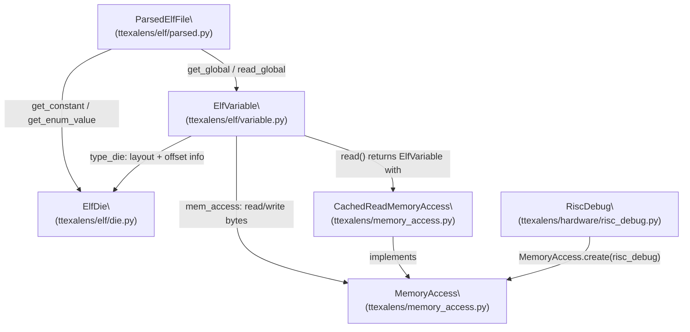
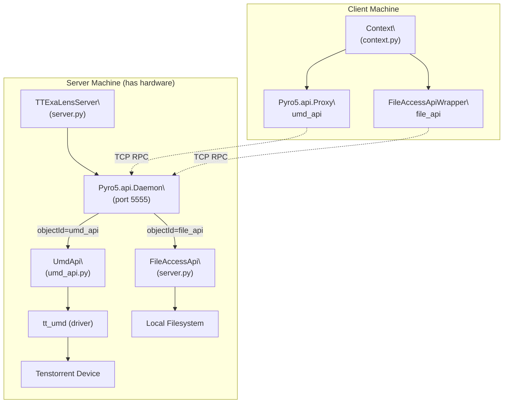
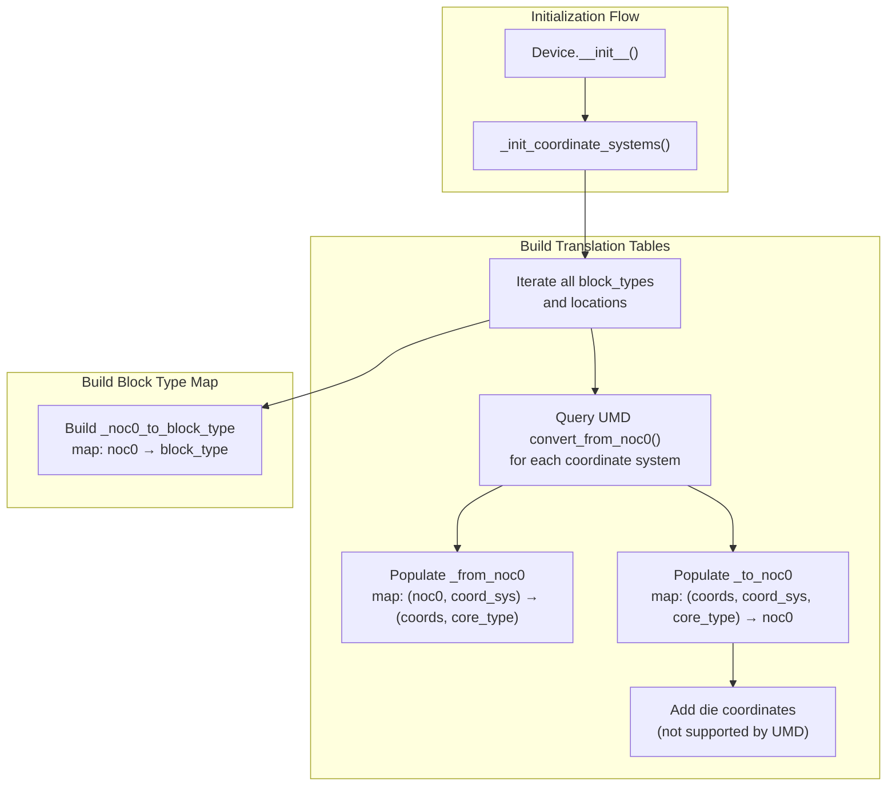

# Device Factory and Architecture Detection

Relevant source files
*   [test/wheel/run-wheel.sh](https://github.com/tenstorrent/tt-exalens/blob/046c35eb/test/wheel/run-wheel.sh)
*   [ttexalens/device.py](https://github.com/tenstorrent/tt-exalens/blob/046c35eb/ttexalens/device.py)
*   [ttexalens/util.py](https://github.com/tenstorrent/tt-exalens/blob/046c35eb/ttexalens/util.py)

This page covers how TTExaLens instantiates hardware-specific `Device` objects at runtime, how it detects the underlying chip architecture, how it handles NOC failover between redundant network-on-chip paths, and how it validates memory accesses in safe mode. For documentation on the abstract block abstraction layered on top of the device, see [Hardware Block Abstraction](https://deepwiki.com/tenstorrent/tt-exalens/5.2-hardware-block-abstraction). For UMD integration details (the driver layer beneath `Device`), see [UMD Integration Layer](https://deepwiki.com/tenstorrent/tt-exalens/5.6-umd-integration-layer).

* * *

## Overview

The `Device` class ([ttexalens/device.py 101-681](https://github.com/tenstorrent/tt-exalens/blob/046c35eb/ttexalens/device.py#L101-L681)) is the central abstraction for all hardware interaction. It is never instantiated directly. Instead, calling `Device.create()` queries the underlying UMD driver for the chip's architecture and returns an architecture-specific subclass. Once created, the device exposes NOC read/write, BAR0 access, coordinate conversion, and block layout APIs, all of which are shared across Wormhole, Blackhole, and Quasar.

**Supported architectures:**

| `tt_umd.ARCH` value | Subclass created | Source module |
| --- | --- | --- |
| `WORMHOLE_B0` | `WormholeDevice` | `ttexalens/hardware/wormhole/device.py` |
| `BLACKHOLE` | `BlackholeDevice` | `ttexalens/hardware/blackhole/device.py` |
| `QUASAR` | `QuasarDevice` | `ttexalens/hardware/quasar/device.py` |

* * *




Sources: [ttexalens/elf/variable.py:1-25](), [ttexalens/elf/parsed.py:1-30](), [ttexalens/elf/__init__.py:1-21]()

---
```




Sources: [ttexalens/server.py:41-80](), [ttexalens/umd_api.py:44-146](), [ttexalens/cli.py:7-43]()

---
```
## Device Factory: `Device.create()`

**Device instantiation flow**

Sources: [ttexalens/device.py 133-154](https://github.com/tenstorrent/tt-exalens/blob/046c35eb/ttexalens/device.py#L133-L154)

`Device.create()` is a `@staticmethod`. It calls `context.umd_api.get_device(device_id)` to retrieve the `UmdDevice` wrapper for the chip. The `arch` property on `UmdDevice` returns a `tt_umd.ARCH` enum value determined at UMD initialization time. A `match` statement selects the concrete subclass:

* * *

## Device Initialization (`__init__`)

After the subclass is selected, `Device.__init__` ([ttexalens/device.py 156-170](https://github.com/tenstorrent/tt-exalens/blob/046c35eb/ttexalens/device.py#L156-L170)) stores key state:

| Attribute | Source | Purpose |
| --- | --- | --- |
| `self.id` | `device_id` argument | Numeric chip ID |
| `self.unique_id` | `umd_device.unique_id` | Globally unique hardware ID |
| `self._arch` | `umd_device.arch` | `tt_umd.ARCH` enum value |
| `self._umd_device` | `umd_device` | UMD driver wrapper |
| `self._soc_descriptor` | `umd_device.soc_descriptor` | SOC layout info from UMD |
| `self._has_jtag` | `umd_device.is_jtag_capable` | JTAG communication flag |
| `self.is_local` | `umd_device.is_mmio_capable` | True if directly PCIe-attached |
| `self._noc_to_use` | `context.use_noc1` | Ordered NOC preference list |

The `_noc_to_use` list is initialized as `[1, 0]` if `context.use_noc1` is `True`, otherwise `[0, 1]`. This ordering drives the NOC failover mechanism. `_init_coordinate_systems()` is called immediately to populate coordinate translation tables.

Sources: [ttexalens/device.py 156-170](https://github.com/tenstorrent/tt-exalens/blob/046c35eb/ttexalens/device.py#L156-L170)

* * *

## Architecture Identity Methods

The base `Device` class provides three identity predicates, each returning `False` by default. Concrete subclasses override exactly one:

| Method | Returns `True` in |
| --- | --- |
| `is_wormhole()` | `WormholeDevice` |
| `is_blackhole()` | `BlackholeDevice` |
| `is_quasar()` | `QuasarDevice` |

These are used throughout the codebase for architecture-specific branches, for example in `_validate_noc_access_is_safe` ([ttexalens/device.py 288-296](https://github.com/tenstorrent/tt-exalens/blob/046c35eb/ttexalens/device.py#L288-L296)) where a Blackhole-specific safety note is appended when private memory access is flagged.

Sources: [ttexalens/device.py 123-130](https://github.com/tenstorrent/tt-exalens/blob/046c35eb/ttexalens/device.py#L123-L130)

* * *

## NOC Failover: `_with_noc_failover()`

Tenstorrent devices have two independent NOC networks (NOC0 and NOC1). If a NOC hangs, the device becomes unreachable via that network. `_with_noc_failover` implements an automatic retry policy that rotates through available NOCs.

**NOC failover state machine**

Sources: [ttexalens/device.py 186-216](https://github.com/tenstorrent/tt-exalens/blob/046c35eb/ttexalens/device.py#L186-L216)

**Behavior summary:**

*   If `noc_id` is explicitly provided (not `None`), or if `context.noc_failover` is `False`, no rotation happens — the operation is attempted on the specified NOC only.
*   If failover is enabled and `noc_id` is `None`, the method tries each NOC in `_noc_to_use` order.
*   On a `TimeoutDeviceRegisterError`, the failed NOC is appended to the end of the queue and the next NOC is tried.
*   If the queue exhausts all NOCs (detected by `noc_queue[0] == first_used` after rotating), the original exception is re-raised.
*   On a successful retry with a different NOC, `_noc_to_use` is updated so that subsequent calls prefer the working NOC. The `on_noc_switch` callback (if set) is invoked.

The `switch_noc()` method ([ttexalens/device.py 177-184](https://github.com/tenstorrent/tt-exalens/blob/046c35eb/ttexalens/device.py#L177-L184)) can be used externally to manually set a preferred NOC. The `active_noc` property ([ttexalens/device.py 174-175](https://github.com/tenstorrent/tt-exalens/blob/046c35eb/ttexalens/device.py#L174-L175)) returns the currently preferred NOC.

Sources: [ttexalens/device.py 174-216](https://github.com/tenstorrent/tt-exalens/blob/046c35eb/ttexalens/device.py#L174-L216)

* * *

## Safe Mode Access Validation: `_validate_noc_access_is_safe()`

When `context.safe_mode` is `True` (or overridden per-call), every `noc_read` and `noc_write` call invokes `_validate_noc_access_is_safe()` before touching hardware. This protects against accidental access to undefined or dangerous memory regions.

**Validation logic**

Sources: [ttexalens/device.py 248-300](https://github.com/tenstorrent/tt-exalens/blob/046c35eb/ttexalens/device.py#L248-L300)

The validation iterates through the address range in chunks, one `MemoryBlock` at a time. Each iteration:

1.   Looks up the current address in the block's `noc_memory_map` using `find_by_noc_address`.
2.   Raises `UnsafeAccessException` if the address is unmapped or the block is marked inaccessible.
3.   Calls `is_safe_to_read` or `is_safe_to_write` on the found `MemoryMapBlockInfo`.
4.   Advances `bytes_checked` by the size of the region covered in this iteration.

**`UnsafeAccessException`** ([ttexalens/device.py 26-52](https://github.com/tenstorrent/tt-exalens/blob/046c35eb/ttexalens/device.py#L26-L52)) stores the full context of the violation: `location`, `original_addr`, `num_bytes`, `violating_addr`, `is_write`, and an optional `reason` string. Its `__str__` generates the message lazily on first conversion.

For information on how `MemoryMap` and `MemoryMapBlockInfo` define safe/unsafe regions, see [Memory Maps and Block Layout](https://deepwiki.com/tenstorrent/tt-exalens/5.3-memory-maps-and-block-layout).

Sources: [ttexalens/device.py 26-52](https://github.com/tenstorrent/tt-exalens/blob/046c35eb/ttexalens/device.py#L26-L52)[ttexalens/device.py 248-300](https://github.com/tenstorrent/tt-exalens/blob/046c35eb/ttexalens/device.py#L248-L300)

* * *

## NOC Read and Write Methods

The `Device` class exposes four NOC access methods that all funnel through `_with_noc_failover`:

| Method | Description |
| --- | --- |
| `noc_read(location, address, size_bytes, ...)` | Read `size_bytes` bytes via NOC |
| `noc_read32(location, address, ...)` | Read 4 bytes, return as `int` (little-endian) |
| `noc_write(location, address, data, ...)` | Write `bytes` via NOC |
| `noc_write32(location, address, data, ...)` | Write `int` as 4 bytes (little-endian) via NOC |

**Common optional parameters** for `noc_read` and `noc_write`:

| Parameter | Default source | Purpose |
| --- | --- | --- |
| `noc_id` | `None` (uses failover) | Override NOC selection |
| `use_4B_mode` | `context.use_4B_mode` | Force 4-byte-aligned reads |
| `dma_threshold` | `context.dma_read_threshold` / `context.dma_write_threshold` | Min size for DMA transfer |
| `safe_mode` | `context.safe_mode` | Enable address validation |

The NOC X/Y coordinates passed to `UmdDevice.noc_read/noc_write` are always NOC0 coordinates, extracted from `location._noc0_coord`.

Sources: [ttexalens/device.py 302-372](https://github.com/tenstorrent/tt-exalens/blob/046c35eb/ttexalens/device.py#L302-L372)

* * *

## BAR0 Access Methods

For MMIO-capable (locally attached) devices, BAR0 register access bypasses the NOC entirely:

| Method | Description |
| --- | --- |
| `bar0_read32(address)` | Read 4 bytes from PCI BAR0 address space |
| `bar0_write32(address, data)` | Write 4 bytes to PCI BAR0 address space |

These delegate directly to `UmdDevice.bar0_read32` / `UmdDevice.bar0_write32` ([ttexalens/umd_device.py 290-300](https://github.com/tenstorrent/tt-exalens/blob/046c35eb/ttexalens/umd_device.py#L290-L300)). Calling them on a non-MMIO device raises `RuntimeError: Device is not mmio capable.`

BAR0 access is used primarily by `RegisterStore.read_register` and `RegisterStore.write_register` when a `RegisterDescription` has a `bar0_address` set, bypassing the NOC for registers that are in the PCI address window.

Sources: [ttexalens/device.py 374-378](https://github.com/tenstorrent/tt-exalens/blob/046c35eb/ttexalens/device.py#L374-L378)[ttexalens/umd_device.py 290-300](https://github.com/tenstorrent/tt-exalens/blob/046c35eb/ttexalens/umd_device.py#L290-L300)

* * *

## Block Type Registry

`Device` defines a class-level `block_types` dictionary ([ttexalens/device.py 559-583](https://github.com/tenstorrent/tt-exalens/blob/046c35eb/ttexalens/device.py#L559-L583)) that maps string block type names to `BlockType` dataclass instances. This drives coordinate system initialization and block location queries.

| Block type key | Symbol | Core type | Harvested? |
| --- | --- | --- | --- |
| `functional_workers` | `.` | `tensix` | No |
| `eth` | `E` | `eth` | No |
| `harvested_eth` | `e` | `eth` | Yes |
| `arc` | `A` | `arc` | No |
| `dram` | `D` | `dram` | No |
| `harvested_dram` | `d` | `dram` | Yes |
| `pcie` | `P` | `pcie` | No |
| `router_only` | `` | `router_only` | No |
| `harvested_workers` | `-` | `tensix` | Yes |
| `security` | `S` | `security` | No |
| `l2cpu` | `C` | `l2cpu` | No |

Block locations are computed lazily via the `_block_locations` cached property ([ttexalens/device.py 533-549](https://github.com/tenstorrent/tt-exalens/blob/046c35eb/ttexalens/device.py#L533-L549)), which calls `soc_descriptor.get_cores()` or `get_harvested_cores()` depending on the `core_harvesting` flag.

Sources: [ttexalens/device.py 551-583](https://github.com/tenstorrent/tt-exalens/blob/046c35eb/ttexalens/device.py#L551-L583)[ttexalens/device.py 533-549](https://github.com/tenstorrent/tt-exalens/blob/046c35eb/ttexalens/device.py#L533-L549)

* * *

## Coordinate System Initialization

`_init_coordinate_systems()` ([ttexalens/device.py 405-437](https://github.com/tenstorrent/tt-exalens/blob/046c35eb/ttexalens/device.py#L405-L437)) is called during `__init__`. It builds two dictionaries:

*   `_noc0_to_block_type`: maps `(noc0_x, noc0_y)` → block type string
*   `_from_noc0`: maps `((noc0_x, noc0_y), coord_system)` → `((x, y), core_type)`
*   `_to_noc0`: maps `((x, y), coord_system, core_type)` → `(noc0_x, noc0_y)`

**Coordinate systems populated:**

| System | Source |
| --- | --- |
| `noc1` | `UmdDevice.convert_from_noc0()` |
| `logical` | `UmdDevice.convert_from_noc0()` |
| `translated` | `UmdDevice.convert_from_noc0()` |
| `die` | `Device.__noc_to_die()` (uses `NOC_0_X_TO_DIE_X` / `NOC_0_Y_TO_DIE_Y` tables) |

The `to_noc0()` and `from_noc0()` methods ([ttexalens/device.py 439-458](https://github.com/tenstorrent/tt-exalens/blob/046c35eb/ttexalens/device.py#L439-L458)) are the public API used by `OnChipCoordinate` for conversions. `from_noc0` has a fallback that tries `convert_from_noc0` with `core_type="router_only"` for coordinates not in the primary map.

For a full description of coordinate systems and the `OnChipCoordinate` class, see [Coordinate Systems and Memory Addressing](https://deepwiki.com/tenstorrent/tt-exalens/1.2-coordinate-systems-and-memory-addressing).

Sources: [ttexalens/device.py 399-458](https://github.com/tenstorrent/tt-exalens/blob/046c35eb/ttexalens/device.py#L399-L458)

* * *




The initialization process:

1. **Populate `_noc0_to_block_type`**: Map each NOC0 coordinate to its block type by iterating `_block_locations`

2. **Build conversion tables**: For each NOC0 location and block type:
   - Query UMD's coordinate manager for conversions to `noc1`, `logical`, `translated`
   - Store bidirectional mappings in `_from_noc0` and `_to_noc0` dictionaries
   - Add `die` coordinate mappings (not supported by UMD, computed using `DIE_X_TO_NOC_0_X` and similar lookup tables)

3. **Handle multiple core types**: `logical` and `die` coordinates include core type as a third dimension. `translated` and `noc1` are unique per coordinate (no ambiguity), so they map with `core_type="any"`

**Lookup table structures:**

```python
```
## Class Relationship Diagram

**Key classes in device factory and access path**

Sources: [ttexalens/device.py 101-681](https://github.com/tenstorrent/tt-exalens/blob/046c35eb/ttexalens/device.py#L101-L681)[ttexalens/umd_device.py 31-379](https://github.com/tenstorrent/tt-exalens/blob/046c35eb/ttexalens/umd_device.py#L31-L379)[ttexalens/umd_api.py 45-146](https://github.com/tenstorrent/tt-exalens/blob/046c35eb/ttexalens/umd_api.py#L45-L146)

Dismiss
Refresh this wiki

Enter email to refresh
