# Hardware Block Abstraction

Relevant source files
*   [test/wheel/run-wheel.sh](https://github.com/tenstorrent/tt-exalens/blob/046c35eb/test/wheel/run-wheel.sh)
*   [ttexalens/device.py](https://github.com/tenstorrent/tt-exalens/blob/046c35eb/ttexalens/device.py)
*   [ttexalens/util.py](https://github.com/tenstorrent/tt-exalens/blob/046c35eb/ttexalens/util.py)

## Purpose and Scope

This document describes the hardware block abstraction layer in TTExaLens, which models individual on-chip components (blocks) connected via the Network-on-Chip (NOC) fabric. Each hardware block represents a physical unit such as a Tensix compute core, DRAM controller, or Ethernet interface. This abstraction provides a unified interface for accessing block-specific resources including memory regions, register stores, and RISC processors.

For information about coordinate systems used to locate blocks on chip, see [Coordinate Systems and Memory Addressing](https://deepwiki.com/tenstorrent/tt-exalens/1.2-coordinate-systems-and-memory-addressing). For details on memory organization within blocks, see [Memory Maps and Block Layout](https://deepwiki.com/tenstorrent/tt-exalens/5.3-memory-maps-and-block-layout). For register access patterns, see [Register System](https://deepwiki.com/tenstorrent/tt-exalens/5.4-register-system).

* * *


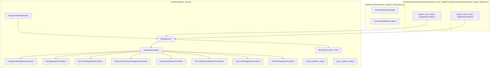

Sources: [ttexalens/register_store.py:1-20](), [ttexalens/hardware/tensix_registers_description.py](), [ttexalens/hardware/wormhole/functional_worker_registers.py:1-15](), [ttexalens/hardware/blackhole/functional_worker_registers.py:1-15]()

---
```
## NocBlock Base Class

The `NocBlock` class at [ttexalens/hardware/noc_block.py 21-76](https://github.com/tenstorrent/tt-exalens/blob/046c35eb/ttexalens/hardware/noc_block.py#L21-L76) serves as the abstract base for all hardware block types. Every block instance represents a physical component on the chip with a specific NOC coordinate, maintains its own memory map, and provides access to embedded RISC cores and register stores.

**NocBlock Class Structure:**

**Core Interface Methods:**

| Method/Property | Return Type | Purpose |
| --- | --- | --- |
| `location` | `OnChipCoordinate` | Block position in NOC0 coordinates |
| `block_type` | `str` | Type identifier ("functional_workers", "eth", "dram", "arc") |
| `device` | `Device` | Parent device reference |
| `noc_memory_map` | `MemoryMap` | NOC-addressable memory regions |
| `get_register_store(noc_id, neo_id)` | `RegisterStore` | Register accessor for specified NOC |
| `get_risc_debug(risc_name, neo_id)` | `RiscDebug` | Debug interface for named RISC core |
| `debuggable_riscs` | `list[RiscDebug]` | RISC cores with functional debug hardware |
| `all_riscs` | `list[RiscDebug]` | All RISC cores present in block |

**Sources:**[ttexalens/hardware/noc_block.py 21-76](https://github.com/tenstorrent/tt-exalens/blob/046c35eb/ttexalens/hardware/noc_block.py#L21-L76)

* * *

## Block Type System

The `Device.block_types` dictionary at [ttexalens/device.py 559-583](https://github.com/tenstorrent/tt-exalens/blob/046c35eb/ttexalens/device.py#L559-L583) defines all recognized hardware block categories. Each entry maps a block type string to a `Device.BlockType` dataclass instance containing display properties and core type information.

**BlockType Dataclass:**

**Sources:**[ttexalens/device.py 551-558](https://github.com/tenstorrent/tt-exalens/blob/046c35eb/ttexalens/device.py#L551-L558)[ttexalens/device.py 559-583](https://github.com/tenstorrent/tt-exalens/blob/046c35eb/ttexalens/device.py#L559-L583)

**Block Type Registry:**

| Block Type Key | Symbol | Description | Core Type | Harvesting |
| --- | --- | --- | --- | --- |
| `"functional_workers"` | `.` | Functional worker | `"tensix"` | No |
| `"eth"` | `E` | Ethernet | `"eth"` | No |
| `"harvested_eth"` | `e` | Harvested Ethernet | `"eth"` | Yes |
| `"arc"` | `A` | ARC | `"arc"` | No |
| `"dram"` | `D` | DRAM | `"dram"` | No |
| `"harvested_dram"` | `d` | Harvested DRAM | `"dram"` | Yes |
| `"harvested_workers"` | `-` | Harvested | `"tensix"` | Yes |
| `"pcie"` | `P` | PCIE | `"pcie"` | No |
| `"router_only"` | `` | Router only | `"router_only"` | No |
| `"security"` | `S` | Security | `"security"` | No |
| `"l2cpu"` | `C` | L2CPU | `"l2cpu"` | No |

**Sources:**[ttexalens/device.py 559-583](https://github.com/tenstorrent/tt-exalens/blob/046c35eb/ttexalens/device.py#L559-L583)

**BlockType Properties:**

The `Device.BlockType` dataclass at [ttexalens/device.py 551-558](https://github.com/tenstorrent/tt-exalens/blob/046c35eb/ttexalens/device.py#L551-L558) contains:

*   `symbol`: ASCII character for chip visualization using `Device.render()`
*   `desc`: Human-readable description displayed in legends
*   `core_type`: UMD `CoreType` enum value for coordinate conversion
*   `core_harvesting`: Whether this block type can be harvested (disabled/removed)
*   `color`: Terminal ANSI color code for display formatting

**Sources:**[ttexalens/device.py 551-558](https://github.com/tenstorrent/tt-exalens/blob/046c35eb/ttexalens/device.py#L551-L558)

* * *

## Block Hierarchy by Architecture

Different Tenstorrent architectures implement blocks with varying structures. The hierarchy reflects platform-specific memory layouts and RISC core configurations.

### Class Hierarchy

**Sources:**

*   [ttexalens/hardware/noc_block.py 21-76](https://github.com/tenstorrent/tt-exalens/blob/046c35eb/ttexalens/hardware/noc_block.py#L21-L76)
*   [ttexalens/hardware/wormhole/functional_worker_block.py 58-232](https://github.com/tenstorrent/tt-exalens/blob/046c35eb/ttexalens/hardware/wormhole/functional_worker_block.py#L58-L232)
*   [ttexalens/hardware/wormhole/eth_block.py 128-244](https://github.com/tenstorrent/tt-exalens/blob/046c35eb/ttexalens/hardware/wormhole/eth_block.py#L128-L244)
*   [ttexalens/hardware/wormhole/dram_block.py 33-94](https://github.com/tenstorrent/tt-exalens/blob/046c35eb/ttexalens/hardware/wormhole/dram_block.py#L33-L94)
*   [ttexalens/hardware/blackhole/functional_worker_block.py 58-232](https://github.com/tenstorrent/tt-exalens/blob/046c35eb/ttexalens/hardware/blackhole/functional_worker_block.py#L58-L232)
*   [ttexalens/hardware/blackhole/eth_block.py 169-382](https://github.com/tenstorrent/tt-exalens/blob/046c35eb/ttexalens/hardware/blackhole/eth_block.py#L169-L382)
*   [ttexalens/hardware/blackhole/dram_block.py 181-213](https://github.com/tenstorrent/tt-exalens/blob/046c35eb/ttexalens/hardware/blackhole/dram_block.py#L181-L213)
*   [ttexalens/hardware/blackhole/dram_block.py 215-382](https://github.com/tenstorrent/tt-exalens/blob/046c35eb/ttexalens/hardware/blackhole/dram_block.py#L215-L382)
*   [ttexalens/hardware/quasar/functional_worker_block.py 17-119](https://github.com/tenstorrent/tt-exalens/blob/046c35eb/ttexalens/hardware/quasar/functional_worker_block.py#L17-L119)


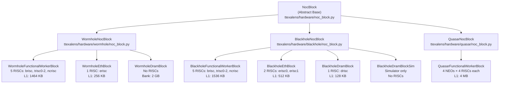
### Platform-Specific Base Classes

Each architecture defines platform-specific base classes that inherit from `NocBlock`:

| Architecture | Base Class | Register Stores | Notable Features |
| --- | --- | --- | --- |
| Wormhole | `WormholeNocBlock` | `register_store_noc0` `register_store_noc1` | Standard debug bus, separate stores per NOC |
| Blackhole | `BlackholeNocBlock` | `register_store_noc0` `register_store_noc1` | Enhanced debug features, dual RISCs on ETH |
| Quasar | `QuasarNocBlock` | NEO-specific stores | NEO-based architecture with 4 sub-blocks per core |

The base classes provide the `get_register_store(noc_id, neo_id)` method that returns the appropriate `RegisterStore` instance for the specified NOC interface and optional NEO ID.

* * *

## Common Block Properties

All block implementations provide access to standardized resources through their base class interface.

### Memory Resources

Every block defines its NOC-accessible memory regions in the `noc_memory_map`:

**Sources:**[ttexalens/hardware/blackhole/functional_worker_block.py 234-250](https://github.com/tenstorrent/tt-exalens/blob/046c35eb/ttexalens/hardware/blackhole/functional_worker_block.py#L234-L250)

Example from Blackhole functional worker block:

Each `MemoryMapBlockInfo` contains:

*   Name identifier for lookup
*   `MemoryBlock` with size and address
*   Safety flags (`safe_to_read`, `safe_to_write`)
*   Optional access check callback

**Sources:**[ttexalens/memory_map.py 12-35](https://github.com/tenstorrent/tt-exalens/blob/046c35eb/ttexalens/memory_map.py#L12-L35)


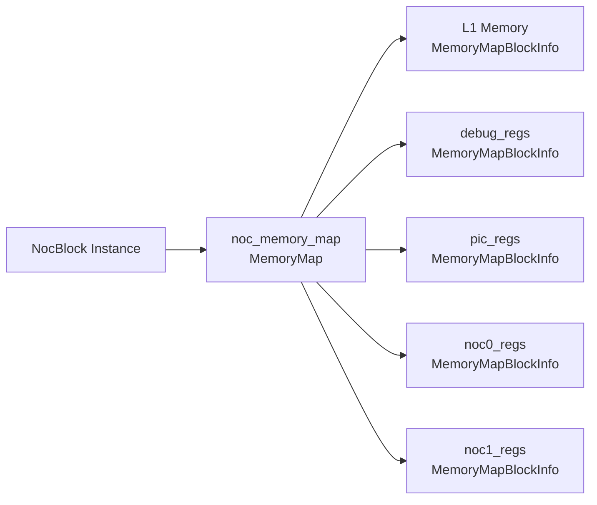
### Register Stores

Blocks maintain separate `RegisterStore` instances for each NOC interface, enabling independent access to NOC0 and NOC1 register spaces. Register stores are initialized using a pre-computed initialization object to avoid repeated setup costs.

#### Initialization Pattern

**Example from Blackhole functional worker:**

**Sources:**

*   [ttexalens/hardware/blackhole/functional_worker_block.py 49-54](https://github.com/tenstorrent/tt-exalens/blob/046c35eb/ttexalens/hardware/blackhole/functional_worker_block.py#L49-L54)
*   [ttexalens/hardware/blackhole/functional_worker_block.py 199-200](https://github.com/tenstorrent/tt-exalens/blob/046c35eb/ttexalens/hardware/blackhole/functional_worker_block.py#L199-L200)
*   [ttexalens/register_store.py 363-382](https://github.com/tenstorrent/tt-exalens/blob/046c35eb/ttexalens/register_store.py#L363-L382)

The initialization pattern creates a shared `RegisterStoreInitialization` object containing:

*   Combined register map from multiple sources (`register_map`, `niu_register_map`)
*   Base address resolver function specific to the NOC ID
*   Pre-computed register descriptions with resolved base addresses

This approach significantly reduces memory usage and initialization time when multiple blocks of the same type exist on chip.

#### Register Access

The `get_register_store()` method returns the appropriate store:

Quasar blocks override this to support NEO-specific register access with the `neo_id` parameter.

**Sources:**[ttexalens/hardware/noc_block.py 32-34](https://github.com/tenstorrent/tt-exalens/blob/046c35eb/ttexalens/hardware/noc_block.py#L32-L34)

* * *


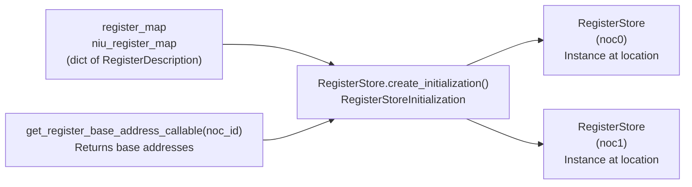

**Example from Blackhole functional worker:**

```python
```
## RISC Core Management

Blocks with computational capabilities contain one or more RISC-V processors. The `NocBlock` interface provides standardized access to these cores.

### RISC Core Properties

**Sources:**

*   [ttexalens/hardware/blackhole/functional_worker_block.py 92-197](https://github.com/tenstorrent/tt-exalens/blob/046c35eb/ttexalens/hardware/blackhole/functional_worker_block.py#L92-L197)
*   [ttexalens/hardware/blackhole/functional_worker_block.py 204-232](https://github.com/tenstorrent/tt-exalens/blob/046c35eb/ttexalens/hardware/blackhole/functional_worker_block.py#L204-L232)

Each RISC core is described by a `BabyRiscInfo` structure containing:

| Field | Purpose |
| --- | --- |
| `risc_name` | Identifier string ("brisc", "trisc0", etc.) |
| `risc_id` | Hardware ID for debug register access |
| `reset_flag_shift` | Bit position in soft reset register |
| `l1` | Shared L1 memory block |
| `data_private_memory` | Core-specific data memory |
| `code_private_memory` | Core-specific code memory (if separate) |
| `max_watchpoints` | Number of hardware breakpoints available |
| `branch_prediction_register` | Register name for BP disable (if applicable) |
| `debug_hardware_present` | Whether debug interface is available |


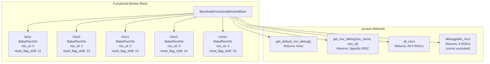
### RISC Core Access Patterns

The `get_risc_debug()` method returns a `RiscDebug` instance wrapping the platform-specific debug implementation:

**Sources:**[ttexalens/hardware/blackhole/functional_worker_block.py 218-232](https://github.com/tenstorrent/tt-exalens/blob/046c35eb/ttexalens/hardware/blackhole/functional_worker_block.py#L218-L232)

The `debuggable_riscs` property filters cores based on whether they have functional debug hardware:

**Sources:**[ttexalens/hardware/noc_block.py 45-47](https://github.com/tenstorrent/tt-exalens/blob/046c35eb/ttexalens/hardware/noc_block.py#L45-L47)

* * *

## Block Instantiation and Lookup

The `Device` class manages block creation and caching. Blocks are instantiated lazily on first access via `get_block()`, with the `@cache` decorator ensuring each block is created only once.

### Block Creation Flow

## Block Locations and Type Resolution

The `Device._block_locations` property at [ttexalens/device.py 532-549](https://github.com/tenstorrent/tt-exalens/blob/046c35eb/ttexalens/device.py#L532-L549) builds a cached dictionary mapping block type strings to lists of `OnChipCoordinate` instances. This property reads the UMD SOC descriptor to determine which cores exist on the chip.

**Block Location Initialization Flow:**

**Sources:**[ttexalens/device.py 532-549](https://github.com/tenstorrent/tt-exalens/blob/046c35eb/ttexalens/device.py#L532-L549)[ttexalens/device.py 405-410](https://github.com/tenstorrent/tt-exalens/blob/046c35eb/ttexalens/device.py#L405-L410)

**_block_locations Property Implementation:**

The property at [ttexalens/device.py 532-549](https://github.com/tenstorrent/tt-exalens/blob/046c35eb/ttexalens/device.py#L532-L549) iterates through each block type in `Device.block_types` and queries the UMD SOC descriptor:

1.   Determines the `CoreType` enum value from `block_type.core_type`
2.   Calls `soc_descriptor.get_cores()` or `get_harvested_cores()` based on `core_harvesting` flag
3.   Converts each UMD core coordinate to `OnChipCoordinate` in NOC0 space
4.   Stores the list of coordinates under the block type key

**Sources:**[ttexalens/device.py 532-549](https://github.com/tenstorrent/tt-exalens/blob/046c35eb/ttexalens/device.py#L532-L549)

**Block Type Lookup:**

The `get_block_type()` method at [ttexalens/device.py 587-591](https://github.com/tenstorrent/tt-exalens/blob/046c35eb/ttexalens/device.py#L587-L591) provides reverse lookup from coordinate to block type:

The `_noc0_to_block_type` mapping is built during `_init_coordinate_systems()` at [ttexalens/device.py 405-410](https://github.com/tenstorrent/tt-exalens/blob/046c35eb/ttexalens/device.py#L405-L410) by inverting the `_block_locations` dictionary.

**Sources:**[ttexalens/device.py 587-591](https://github.com/tenstorrent/tt-exalens/blob/046c35eb/ttexalens/device.py#L587-L591)[ttexalens/device.py 405-410](https://github.com/tenstorrent/tt-exalens/blob/046c35eb/ttexalens/device.py#L405-L410)

**get_block_locations() Method:**

The public `get_block_locations()` method at [ttexalens/device.py 526-530](https://github.com/tenstorrent/tt-exalens/blob/046c35eb/ttexalens/device.py#L526-L530) returns all coordinates for a given block type:

**Sources:**[ttexalens/device.py 526-530](https://github.com/tenstorrent/tt-exalens/blob/046c35eb/ttexalens/device.py#L526-L530)


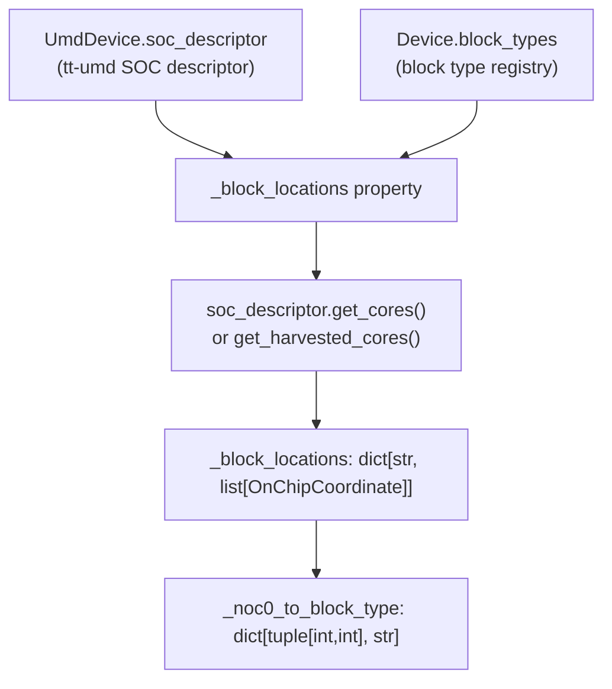
## get_block() System

The `Device.get_block()` method at [ttexalens/device.py 464-470](https://github.com/tenstorrent/tt-exalens/blob/046c35eb/ttexalens/device.py#L464-L470) provides the primary interface for obtaining `NocBlock` instances. It is marked `@abstractmethod` in the base `Device` class and must be implemented by each architecture-specific device subclass.

**get_block() Declaration:**

**Sources:**[ttexalens/device.py 464-470](https://github.com/tenstorrent/tt-exalens/blob/046c35eb/ttexalens/device.py#L464-L470)

**Base Class Signature:**

The abstract method at [ttexalens/device.py 464-470](https://github.com/tenstorrent/tt-exalens/blob/046c35eb/ttexalens/device.py#L464-L470) enforces the contract:

The `@cache` decorator from `functools` ensures each block is instantiated only once per device. Subsequent calls with the same location return the cached instance.

**Sources:**[ttexalens/device.py 464-470](https://github.com/tenstorrent/tt-exalens/blob/046c35eb/ttexalens/device.py#L464-L470)

**Architecture-Specific Implementations:**

Each device subclass implements `get_block()` with a switch statement on block type:

**Example from WormholeDevice:**

The implementation:

1.   Calls `self.get_block_type(location)` to determine block type
2.   Instantiates the appropriate platform-specific `NocBlock` subclass
3.   Returns the instance, which is cached by the decorator

**Sources:** Architecture-specific device implementations in `ttexalens/hardware/*/device.py`

**get_blocks() Bulk Access:**

The `Device.get_blocks()` method at [ttexalens/device.py 472-481](https://github.com/tenstorrent/tt-exalens/blob/046c35eb/ttexalens/device.py#L472-L481) provides bulk access to all blocks of a given type:

The method:

1.   Retrieves all coordinates for the block type via `get_block_locations()`
2.   Calls `get_block()` for each location (leveraging the cache)
3.   Returns the aggregated list
4.   Caches the result list for subsequent calls

**Sources:**[ttexalens/device.py 472-481](https://github.com/tenstorrent/tt-exalens/blob/046c35eb/ttexalens/device.py#L472-L481)

**Caching Strategy:**

**Sources:**[ttexalens/device.py 472-481](https://github.com/tenstorrent/tt-exalens/blob/046c35eb/ttexalens/device.py#L472-L481)[ttexalens/device.py 464-470](https://github.com/tenstorrent/tt-exalens/blob/046c35eb/ttexalens/device.py#L464-L470)

* * *


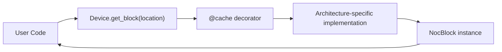
## Platform-Specific Block Implementations

### Wormhole Functional Worker

The Wormhole functional worker contains 5 RISC cores with distinct memory configurations:

**Sources:**[ttexalens/hardware/wormhole/functional_worker_block.py 66-197](https://github.com/tenstorrent/tt-exalens/blob/046c35eb/ttexalens/hardware/wormhole/functional_worker_block.py#L66-L197)

Notable characteristics:

*   TRISC cores share the same private memory base address but access different regions
*   NCRISC has separate code memory (16 KB) for firmware
*   All cores share L1 for data communication
*   Branch prediction can be disabled per core via configuration registers


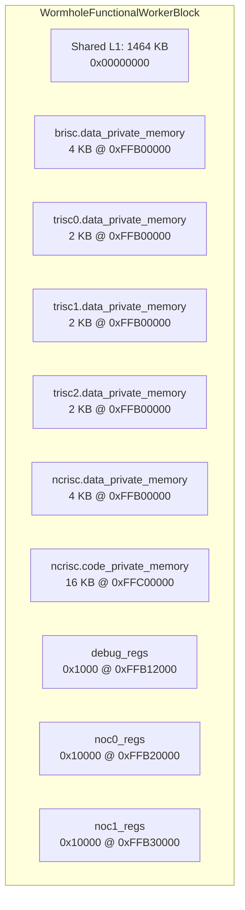
### Blackhole Functional Worker

Blackhole increases L1 size and TRISC private memory:

| Resource | Wormhole | Blackhole |
| --- | --- | --- |
| L1 Size | 1464 KB | 1536 KB |
| BRISC Data | 4 KB | 8 KB |
| TRISC Data | 2 KB each | 4 KB each |
| NCRISC Data | 4 KB | 8 KB |
| NCRISC Code | 16 KB | None (uses L1) |

**Sources:**[ttexalens/hardware/blackhole/functional_worker_block.py 66-197](https://github.com/tenstorrent/tt-exalens/blob/046c35eb/ttexalens/hardware/blackhole/functional_worker_block.py#L66-L197)

### Blackhole Ethernet Block

Blackhole Ethernet blocks contain dual RISC cores for packet processing. The block structure includes separate register stores and control registers for each RISC:

**RISC core configuration:**

Each RISC has independent code and data memory regions, allowing parallel packet processing. The control registers include separate reset PC registers for each core.

**Sources:**

*   [ttexalens/hardware/blackhole/eth_block.py 177-212](https://github.com/tenstorrent/tt-exalens/blob/046c35eb/ttexalens/hardware/blackhole/eth_block.py#L177-L212)
*   [ttexalens/hardware/blackhole/eth_block.py 245-298](https://github.com/tenstorrent/tt-exalens/blob/046c35eb/ttexalens/hardware/blackhole/eth_block.py#L245-L298)


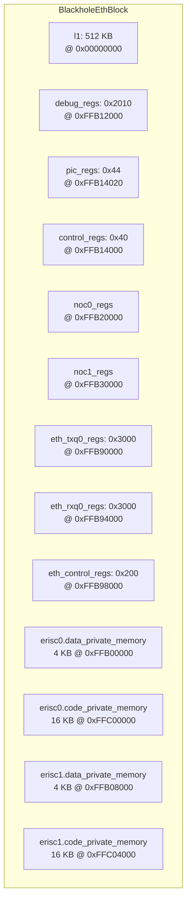

**RISC core configuration:**

```python
self.erisc0 = BabyRiscInfo(
    risc_name="erisc0",
    risc_id=0,
    reset_flag_shift=11,
    code_start_address_register="RISC_CTRL_REG_RESET_PC_0",
    # ...
)

self.erisc1 = BabyRiscInfo(
    risc_name="erisc1",
    risc_id=1,
    reset_flag_shift=12,
    code_start_address_register="RISC_CTRL_REG_RESET_PC_1",
    # ...
)
```

Each RISC has independent code and data memory regions, allowing parallel packet processing. The control registers include separate reset PC registers for each core.
```
### Blackhole DRAM Block

Unlike Wormhole, Blackhole DRAM blocks include a RISC core (drisc) for memory control:

**Sources:**[ttexalens/hardware/blackhole/dram_block.py 297-315](https://github.com/tenstorrent/tt-exalens/blob/046c35eb/ttexalens/hardware/blackhole/dram_block.py#L297-L315)

The drisc manages GDDR memory and has access to extensive control registers:

| Register Block | Purpose |
| --- | --- |
| `gddr_mc_regs` | GDDR memory controller configuration |
| `gddr_phy_regs` | PHY layer settings (unsafe to read) |
| `tx_control_regs` | DMA transfer control |
| `debug_regs` | Debug and performance counters |

**Sources:**[ttexalens/hardware/blackhole/dram_block.py 223-295](https://github.com/tenstorrent/tt-exalens/blob/046c35eb/ttexalens/hardware/blackhole/dram_block.py#L223-L295)

### Quasar NEO Architecture

Quasar uses a hierarchical NEO (Neural Engine Operator) structure where each functional worker contains 4 NEO sub-blocks, and each NEO contains 4 TRISC cores:

**Sources:**[ttexalens/hardware/quasar/functional_worker_block.py 17-52](https://github.com/tenstorrent/tt-exalens/blob/046c35eb/ttexalens/hardware/quasar/functional_worker_block.py#L17-L52)

RISC access in Quasar requires specifying the NEO ID:

**Sources:**[ttexalens/hardware/quasar/functional_worker_block.py 107-119](https://github.com/tenstorrent/tt-exalens/blob/046c35eb/ttexalens/hardware/quasar/functional_worker_block.py#L107-L119)

* * *


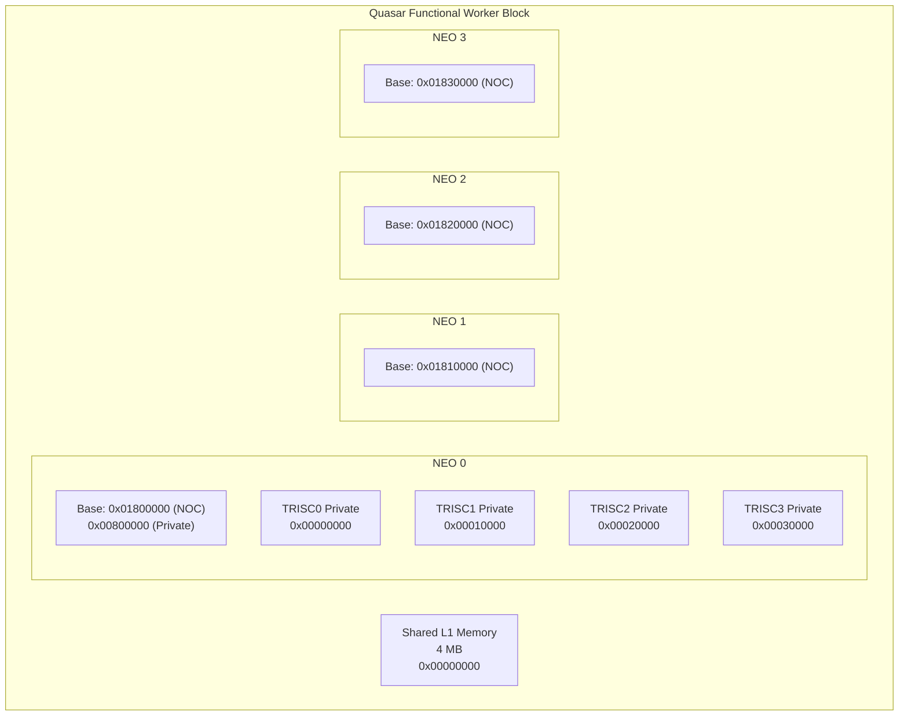

**Key Characteristics:**
- **Large Shared L1**: 4 MB shared across all NEO units
- **NEO Multiplexing**: Each NEO has 4 TRISC cores
- **Separate Memory Maps**: Each NEO maintains its own register store and memory map
- **Address Offsetting**: NEO base addresses distinguish between units

**Example: NEO Private Memory in NOC Map**

[ttexalens/hardware/quasar/functional_worker_block.py:53-73]()

```python
self.noc_memory_map.add_blocks([
    MemoryMapBlockInfo("l1", self.l1, safe_to_write=True),
    MemoryMapBlockInfo("neo0.trisc0.data_private_memory", 
                      self.neo0.trisc0.data_private_memory, 
                      safe_to_write=True),
    # ... for all 16 TRISC cores across 4 NEOs
])
```

Sources: [ttexalens/hardware/quasar/functional_worker_block.py:17-119]()
```


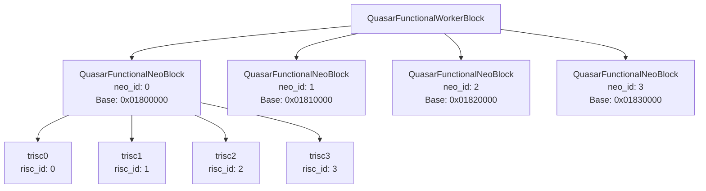
## Debug Bus Support

Blocks with debug capabilities maintain a `DebugBusSignalStore` for non-intrusive signal sampling:

**Sources:**[ttexalens/hardware/blackhole/functional_worker_block.py 60-64](https://github.com/tenstorrent/tt-exalens/blob/046c35eb/ttexalens/hardware/blackhole/functional_worker_block.py#L60-L64)

The debug bus maps signal names to hardware control parameters:

| Parameter | Purpose |
| --- | --- |
| `rd_sel` | Read selector (0-3) |
| `daisy_sel` | Daisy chain selector |
| `sig_sel` | Signal group selector |
| `mask` | Bit mask for signal extraction |

Example signal definitions from Blackhole DRAM block:

**Sources:**[ttexalens/hardware/blackhole/dram_block.py 25-58](https://github.com/tenstorrent/tt-exalens/blob/046c35eb/ttexalens/hardware/blackhole/dram_block.py#L25-L58)

Signal groups organize related signals for efficient sampling:

**Sources:**[ttexalens/hardware/blackhole/dram_block.py 61-64](https://github.com/tenstorrent/tt-exalens/blob/046c35eb/ttexalens/hardware/blackhole/dram_block.py#L61-L64)

The `get_debug_bus()` method returns the debug bus instance, supporting NEO-specific access in Quasar:

**Sources:**[ttexalens/hardware/quasar/functional_worker_block.py 75-84](https://github.com/tenstorrent/tt-exalens/blob/046c35eb/ttexalens/hardware/quasar/functional_worker_block.py#L75-L84)

Dismiss
Refresh this wiki

Enter email to refresh
