# Memory Maps and Block Layout

Relevant source files
*   [test/ttexalens/unit_tests/test_device.py](https://github.com/tenstorrent/tt-exalens/blob/046c35eb/test/ttexalens/unit_tests/test_device.py)
*   [test/ttexalens/unit_tests/test_lib.py](https://github.com/tenstorrent/tt-exalens/blob/046c35eb/test/ttexalens/unit_tests/test_lib.py)
*   [test/ttexalens/unit_tests/test_tensix_debug.py](https://github.com/tenstorrent/tt-exalens/blob/046c35eb/test/ttexalens/unit_tests/test_tensix_debug.py)
*   [test/wheel/run-wheel.sh](https://github.com/tenstorrent/tt-exalens/blob/046c35eb/test/wheel/run-wheel.sh)
*   [ttexalens/debug_tensix.py](https://github.com/tenstorrent/tt-exalens/blob/046c35eb/ttexalens/debug_tensix.py)
*   [ttexalens/device.py](https://github.com/tenstorrent/tt-exalens/blob/046c35eb/ttexalens/device.py)
*   [ttexalens/elf_loader.py](https://github.com/tenstorrent/tt-exalens/blob/046c35eb/ttexalens/elf_loader.py)
*   [ttexalens/tt_exalens_lib.py](https://github.com/tenstorrent/tt-exalens/blob/046c35eb/ttexalens/tt_exalens_lib.py)
*   [ttexalens/util.py](https://github.com/tenstorrent/tt-exalens/blob/046c35eb/ttexalens/util.py)

## Purpose and Scope

This document describes the memory map system that catalogs and validates access to memory regions within hardware blocks. It covers the `MemoryMap` class, which uses interval trees for efficient address-based lookups, the `MemoryBlock` and `DeviceAddress` structures that define memory regions, and how different block types populate their memory maps with region metadata and safety constraints.

For information about the hardware block abstraction layer, see [Hardware Block Abstraction](https://deepwiki.com/tenstorrent/tt-exalens/5.2-hardware-block-abstraction). For details on the register system built on top of memory maps, see [Register System](https://deepwiki.com/tenstorrent/tt-exalens/5.4-register-system). For platform-specific memory layouts, see [Platform-Specific Implementations](https://deepwiki.com/tenstorrent/tt-exalens/5.5-platform-specific-implementations).


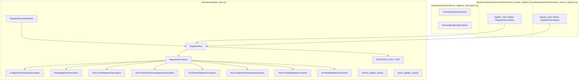

Sources: [ttexalens/register_store.py:1-20](), [ttexalens/hardware/tensix_registers_description.py](), [ttexalens/hardware/wormhole/functional_worker_registers.py:1-15](), [ttexalens/hardware/blackhole/functional_worker_registers.py:1-15]()

---
```
## Core Data Structures

### MemoryBlock and DeviceAddress

The `MemoryBlock` structure represents a contiguous region of memory with a size and a `DeviceAddress`. The `DeviceAddress` class encapsulates up to three different address representations for the same memory region:

*   **noc_address**: Address for NOC (Network-on-Chip) access
*   **private_address**: Address for RISC core private memory access (from core's perspective)
*   **bar0_address**: Address for PCIe BAR0 access (host-accessible regions)
*   **noc_id**: Optional NOC identifier (0 or 1) for the address

**Diagram: MemoryBlock and DeviceAddress Structure**

The `just_*_address()` methods are used when crossing address space boundaries. For example, when accessing another RISC core's private memory via NOC, use `just_noc_address()` to keep only the NOC address representation:

Sources: [ttexalens/hardware/blackhole/functional_worker_block.py 66-68](https://github.com/tenstorrent/tt-exalens/blob/046c35eb/ttexalens/hardware/blackhole/functional_worker_block.py#L66-L68)[ttexalens/hardware/blackhole/functional_worker_block.py 241-245](https://github.com/tenstorrent/tt-exalens/blob/046c35eb/ttexalens/hardware/blackhole/functional_worker_block.py#L241-L245)


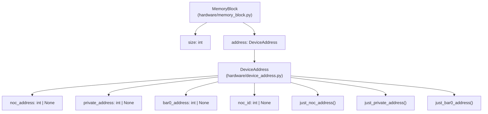

**Diagram: MemoryBlock and DeviceAddress Structure**

The `just_*_address()` methods are used when crossing address space boundaries. For example, when accessing another RISC core's private memory via NOC, use `just_noc_address()` to keep only the NOC address representation:

```python
```
### MemoryMapBlockInfo

`MemoryMapBlockInfo` wraps a `MemoryBlock` with metadata for validation and access control. It is defined in [ttexalens/memory_map.py 12-35](https://github.com/tenstorrent/tt-exalens/blob/046c35eb/ttexalens/memory_map.py#L12-L35)

| Field | Type | Default | Purpose |
| --- | --- | --- | --- |
| `name` | `str` | - | Human-readable identifier for the memory region |
| `memory_block` | `MemoryBlock` | - | The actual memory region with size and addresses |
| `safe_to_read` | `Callable[[int, int], bool] | bool | None` | `True` | Whether reads are safe; can be static bool or validation function |
| `safe_to_write` | `Callable[[int, int], bool] | bool | None` | `False` | Whether writes are safe; can be static bool or validation function |
| `access_check` | `Callable[[], bool] | None` | `None` | Dynamic check for accessibility (e.g., RISC not in reset) |

**Safety Validation Methods:**

The class provides methods to evaluate safety based on the configured flags:

*   `is_safe_to_read(address: int, num_bytes: int) -> bool` - Evaluates if read operation is safe
*   `is_safe_to_write(address: int, num_bytes: int) -> bool` - Evaluates if write operation is safe
*   `is_accessible` property - Checks if `access_check()` returns `True` (or `True` if no check defined)

**Safety Flag Types:**

**Diagram: Safety Flag Options**

**Common Safety Patterns:**

The `access_check` lambda is evaluated dynamically - it must return `True` for the region to be considered accessible. This prevents access to offline cores or hardware in unstable states.

Sources: [ttexalens/memory_map.py 12-35](https://github.com/tenstorrent/tt-exalens/blob/046c35eb/ttexalens/memory_map.py#L12-L35)[ttexalens/hardware/blackhole/functional_worker_block.py 241-245](https://github.com/tenstorrent/tt-exalens/blob/046c35eb/ttexalens/hardware/blackhole/functional_worker_block.py#L241-L245)[ttexalens/hardware/blackhole/dram_block.py 288](https://github.com/tenstorrent/tt-exalens/blob/046c35eb/ttexalens/hardware/blackhole/dram_block.py#L288-L288)


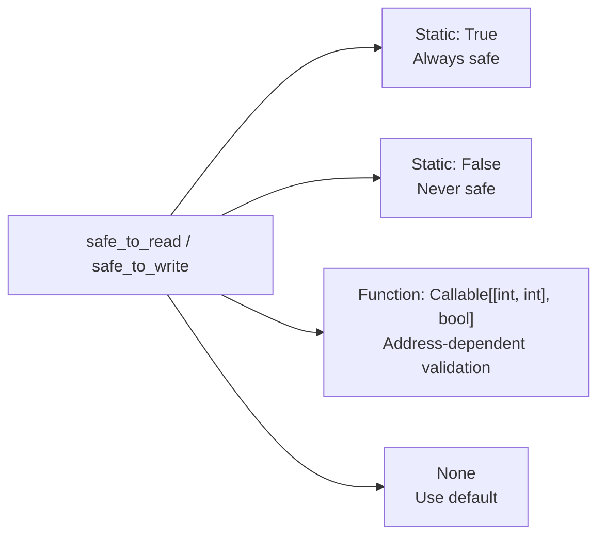

**Diagram: Safety Flag Options**

**Common Safety Patterns:**

```python
```
### MemoryMap

The `MemoryMap` class provides efficient address-based and name-based lookup of memory blocks using interval trees:

**Key Methods:**

*   `add_block(block_info: MemoryMapBlockInfo)` - Registers a memory block in all applicable interval trees
*   `find_by_noc_address(noc_address: int) -> MemoryMapBlockInfo | None` - Finds block containing NOC address
*   `find_by_private_address(private_address: int) -> MemoryMapBlockInfo | None` - Finds block containing private address
*   `find_by_bar0_address(bar0_address: int) -> MemoryMapBlockInfo | None` - Finds block containing BAR0 address
*   `find_by_name(name: str) -> MemoryMapBlockInfo | None` - Finds block by name
*   `find_next_by_*_address(address: int)` - Finds next block after given address

The interval trees enable O(log n) lookup by address range, critical for validating memory accesses during debugging operations.

Sources: [ttexalens/memory_map.py 37-128](https://github.com/tenstorrent/tt-exalens/blob/046c35eb/ttexalens/memory_map.py#L37-L128)


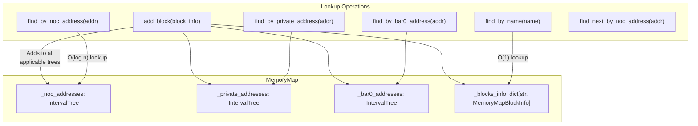

**Key Methods:**

- `add_block(block_info: MemoryMapBlockInfo)` - Registers a memory block in all applicable interval trees
- `find_by_noc_address(noc_address: int) -> MemoryMapBlockInfo | None` - Finds block containing NOC address
- `find_by_private_address(private_address: int) -> MemoryMapBlockInfo | None` - Finds block containing private address
- `find_by_bar0_address(bar0_address: int) -> MemoryMapBlockInfo | None` - Finds block containing BAR0 address
- `find_by_name(name: str) -> MemoryMapBlockInfo | None` - Finds block by name
- `find_next_by_*_address(address: int)` - Finds next block after given address

The interval trees enable O(log n) lookup by address range, critical for validating memory accesses during debugging operations.

Sources: [ttexalens/memory_map.py:37-128]()
```
## Address Space Organization

Each hardware block maintains separate interval trees for the three address spaces. A single memory region may be accessible through multiple address spaces:

**Address Space Usage by Access Method:**

| Access Method | Address Space | Use Case |
| --- | --- | --- |
| NOC read/write | noc_address | General-purpose memory access across the chip |
| RISC debug memory access | private_address | Accessing memory from a RISC core's perspective |
| PCIe BAR0 | bar0_address | Direct host access (limited regions) |

Some memory regions are intentionally accessible only through specific address spaces. For example, Tensix register files may only have private addresses.

Sources: [ttexalens/hardware/blackhole/functional_worker_block.py 66-68](https://github.com/tenstorrent/tt-exalens/blob/046c35eb/ttexalens/hardware/blackhole/functional_worker_block.py#L66-L68)[ttexalens/memory_map.py 40-69](https://github.com/tenstorrent/tt-exalens/blob/046c35eb/ttexalens/memory_map.py#L40-L69)


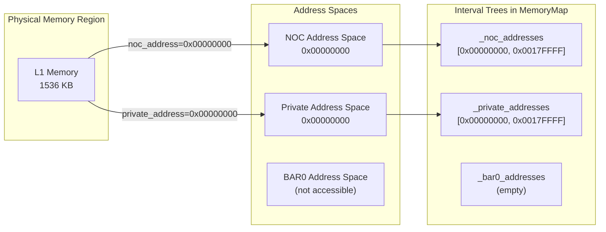

**Address Space Usage by Access Method:**

| Access Method | Address Space | Use Case |
|---------------|---------------|----------|
| NOC read/write | noc_address | General-purpose memory access across the chip |
| RISC debug memory access | private_address | Accessing memory from a RISC core's perspective |
| PCIe BAR0 | bar0_address | Direct host access (limited regions) |

Some memory regions are intentionally accessible only through specific address spaces. For example, Tensix register files may only have private addresses.

Sources: [ttexalens/hardware/blackhole/functional_worker_block.py:66-68](), [ttexalens/memory_map.py:40-69]()
```
## Memory Map Construction

Each hardware block class inherits from `NocBlock` and constructs its memory map during initialization. The process follows this pattern:

**Construction Steps:**

1.   **Define MemoryBlock objects** - Create blocks for each memory region (L1, registers, private memory, etc.)
2.   **Create MemoryMapBlockInfo wrappers** - Add safety flags and access checks
3.   **Populate NOC memory map** - Add blocks accessible via NOC
4.   **Populate per-RISC memory maps** - Add blocks visible to each RISC core

**Example: Blackhole Functional Worker Block**

[ttexalens/hardware/blackhole/functional_worker_block.py 234-531](https://github.com/tenstorrent/tt-exalens/blob/046c35eb/ttexalens/hardware/blackhole/functional_worker_block.py#L234-L531)

Note the use of `just_noc_address()` for cross-RISC access - when accessing another core's private memory via NOC, only the NOC address is relevant.

Sources: [ttexalens/hardware/blackhole/functional_worker_block.py 234-531](https://github.com/tenstorrent/tt-exalens/blob/046c35eb/ttexalens/hardware/blackhole/functional_worker_block.py#L234-L531)[ttexalens/hardware/wormhole/functional_worker_block.py 234-500](https://github.com/tenstorrent/tt-exalens/blob/046c35eb/ttexalens/hardware/wormhole/functional_worker_block.py#L234-L500)


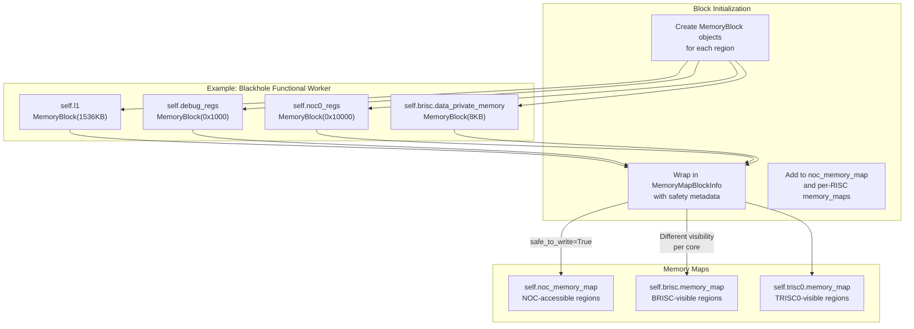

**Construction Steps:**

1. **Define MemoryBlock objects** - Create blocks for each memory region (L1, registers, private memory, etc.)
2. **Create MemoryMapBlockInfo wrappers** - Add safety flags and access checks
3. **Populate NOC memory map** - Add blocks accessible via NOC
4. **Populate per-RISC memory maps** - Add blocks visible to each RISC core

**Example: Blackhole Functional Worker Block**

[ttexalens/hardware/blackhole/functional_worker_block.py:234-531]()

```python
def _update_memory_maps(self):
    # NOC-accessible blocks
    self.noc_memory_map.add_blocks([
        MemoryMapBlockInfo("l1", self.l1, safe_to_write=True),
        MemoryMapBlockInfo("debug_regs", self.debug_regs),
        MemoryMapBlockInfo("brisc.data_private_memory", 
                          self.brisc.data_private_memory.just_noc_address(), 
                          safe_to_write=True, 
                          access_check=lambda: not self.get_risc_debug("brisc").is_in_reset()),
        # ... more blocks
    ])
    
    # BRISC-specific view
    self.brisc.memory_map.add_blocks([
        MemoryMapBlockInfo("l1", self.l1, safe_to_write=True),
        MemoryMapBlockInfo("data_private_memory", self.brisc.data_private_memory, safe_to_write=True),
        MemoryMapBlockInfo("tdma_regs", self.tdma_regs, safe_to_read=False),
        # ... more blocks including Tensix registers
    ])
```

Note the use of `just_noc_address()` for cross-RISC access - when accessing another core's private memory via NOC, only the NOC address is relevant.

Sources: [ttexalens/hardware/blackhole/functional_worker_block.py:234-531](), [ttexalens/hardware/wormhole/functional_worker_block.py:234-500]()
```
## Block-Specific Memory Layouts

### Functional Worker Block Layout

Functional worker blocks contain compute cores with the most complex memory maps:

**Key Characteristics:**

*   **L1 Memory**: Large shared memory (1.5 MB Blackhole, 1.4 MB Wormhole) accessible to all cores
*   **Private Memory**: Each RISC core has dedicated data private memory with different NOC addresses
*   **Tensix Resources**: Only visible in BRISC's memory map, not in NOC memory map
*   **Safety Flags**: L1 and private memory marked `safe_to_write=True`, TDMA registers marked `safe_to_read=False`

Sources: [ttexalens/hardware/blackhole/functional_worker_block.py 58-531](https://github.com/tenstorrent/tt-exalens/blob/046c35eb/ttexalens/hardware/blackhole/functional_worker_block.py#L58-L531)[ttexalens/hardware/wormhole/functional_worker_block.py 58-500](https://github.com/tenstorrent/tt-exalens/blob/046c35eb/ttexalens/hardware/wormhole/functional_worker_block.py#L58-L500)


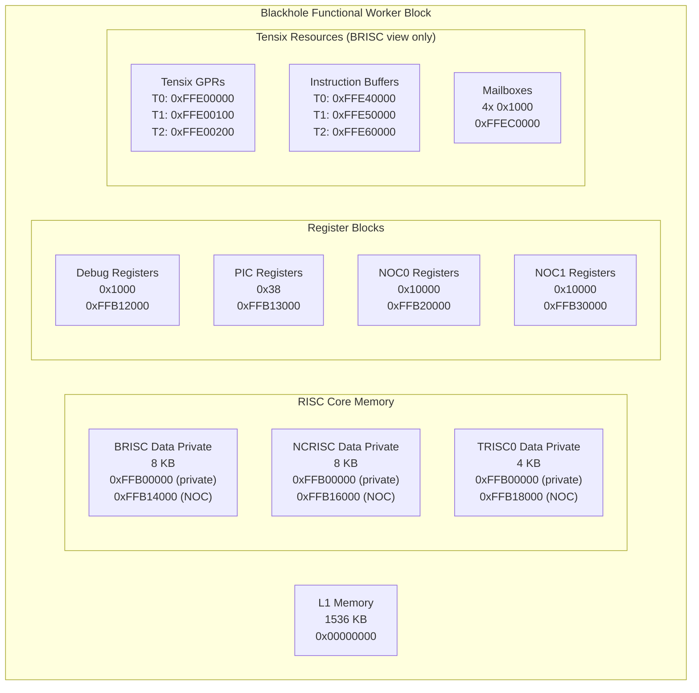

**Key Characteristics:**
- **L1 Memory**: Large shared memory (1.5 MB Blackhole, 1.4 MB Wormhole) accessible to all cores
- **Private Memory**: Each RISC core has dedicated data private memory with different NOC addresses
- **Tensix Resources**: Only visible in BRISC's memory map, not in NOC memory map
- **Safety Flags**: L1 and private memory marked `safe_to_write=True`, TDMA registers marked `safe_to_read=False`

Sources: [ttexalens/hardware/blackhole/functional_worker_block.py:58-531](), [ttexalens/hardware/wormhole/functional_worker_block.py:58-500]()
```
### DRAM Block Layout

DRAM blocks have simpler memory maps focused on the DRAM bank and control registers:

**Key Characteristics:**

*   **Large DRAM Bank**: 4 GB (Blackhole) or 2 GB (Wormhole) marked as safe to write
*   **Memory Controller**: GDDR PHY registers marked `safe_to_read=False` to prevent hangs
*   **Single RISC Core**: Only DRISC present, with simplified memory map
*   **NOC Address Prefix**: DRAM blocks use high-order bits (0x100...) to distinguish from L1

**Example: Wormhole DRAM Bank**

[ttexalens/hardware/wormhole/dram_block.py 37-39](https://github.com/tenstorrent/tt-exalens/blob/046c35eb/ttexalens/hardware/wormhole/dram_block.py#L37-L39)

Sources: [ttexalens/hardware/blackhole/dram_block.py 215-382](https://github.com/tenstorrent/tt-exalens/blob/046c35eb/ttexalens/hardware/blackhole/dram_block.py#L215-L382)[ttexalens/hardware/wormhole/dram_block.py 33-94](https://github.com/tenstorrent/tt-exalens/blob/046c35eb/ttexalens/hardware/wormhole/dram_block.py#L33-L94)


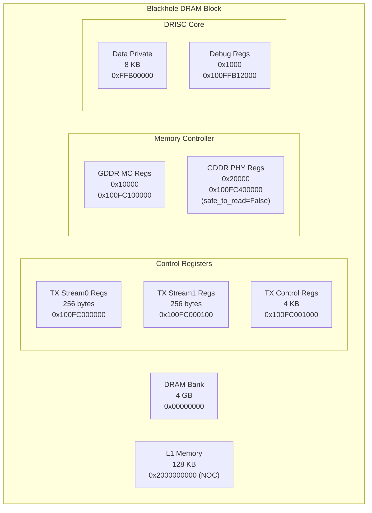

**Key Characteristics:**
- **Large DRAM Bank**: 4 GB (Blackhole) or 2 GB (Wormhole) marked as safe to write
- **Memory Controller**: GDDR PHY registers marked `safe_to_read=False` to prevent hangs
- **Single RISC Core**: Only DRISC present, with simplified memory map
- **NOC Address Prefix**: DRAM blocks use high-order bits (0x100...) to distinguish from L1

**Example: Wormhole DRAM Bank**

[ttexalens/hardware/wormhole/dram_block.py:37-39]()

```python
self.dram_bank = MemoryBlock(
    size=2 * 1024 * 1024 * 1024, 
    address=DeviceAddress(private_address=0x00000000, noc_address=0x00000000)
)
```

Sources: [ttexalens/hardware/blackhole/dram_block.py:215-382](), [ttexalens/hardware/wormhole/dram_block.py:33-94]()
```
### Ethernet Block Layout

Ethernet blocks contain specialized hardware for inter-chip communication:

**Key Characteristics:**

*   **Dual RISC Cores**: Blackhole has ERISC0 and ERISC1; Wormhole has single ERISC
*   **Ethernet Hardware**: Specialized registers for packet transmission/reception
*   **MAC/PCS Registers**: Marked `safe_to_read=False` to prevent hardware state corruption
*   **Medium L1**: 512 KB (Blackhole) or 256 KB (Wormhole)

Sources: [ttexalens/hardware/blackhole/eth_block.py 169-342](https://github.com/tenstorrent/tt-exalens/blob/046c35eb/ttexalens/hardware/blackhole/eth_block.py#L169-L342)[ttexalens/hardware/wormhole/eth_block.py 128-244](https://github.com/tenstorrent/tt-exalens/blob/046c35eb/ttexalens/hardware/wormhole/eth_block.py#L128-L244)


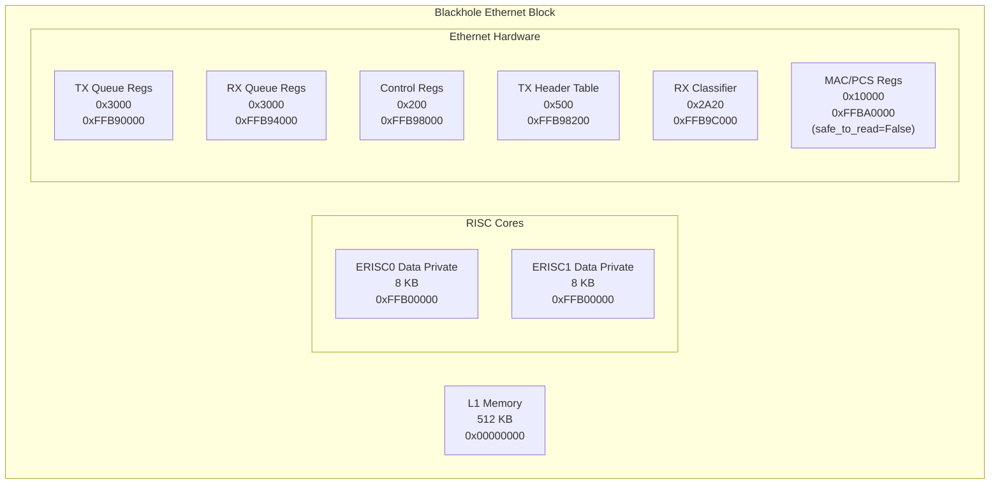

**Key Characteristics:**
- **Dual RISC Cores**: Blackhole has ERISC0 and ERISC1; Wormhole has single ERISC
- **Ethernet Hardware**: Specialized registers for packet transmission/reception
- **MAC/PCS Registers**: Marked `safe_to_read=False` to prevent hardware state corruption
- **Medium L1**: 512 KB (Blackhole) or 256 KB (Wormhole)

Sources: [ttexalens/hardware/blackhole/eth_block.py:169-342](), [ttexalens/hardware/wormhole/eth_block.py:128-244]()
```
### Quasar NEO Architecture

Quasar functional workers use a NEO-based architecture with multiple compute units per block:

**Key Characteristics:**

*   **Large Shared L1**: 4 MB shared across all NEO units
*   **NEO Multiplexing**: Each NEO has 4 TRISC cores
*   **Separate Memory Maps**: Each NEO maintains its own register store and memory map
*   **Address Offsetting**: NEO base addresses distinguish between units

**Example: NEO Private Memory in NOC Map**

[ttexalens/hardware/quasar/functional_worker_block.py 53-73](https://github.com/tenstorrent/tt-exalens/blob/046c35eb/ttexalens/hardware/quasar/functional_worker_block.py#L53-L73)

Sources: [ttexalens/hardware/quasar/functional_worker_block.py 17-119](https://github.com/tenstorrent/tt-exalens/blob/046c35eb/ttexalens/hardware/quasar/functional_worker_block.py#L17-L119)


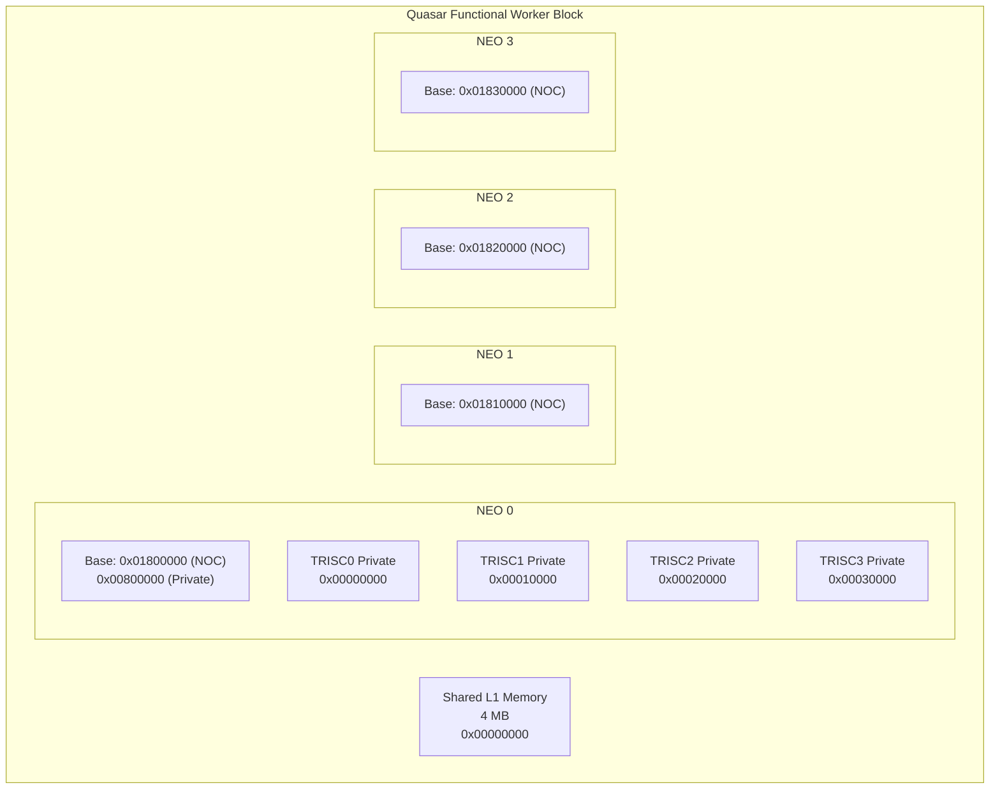

**Key Characteristics:**
- **Large Shared L1**: 4 MB shared across all NEO units
- **NEO Multiplexing**: Each NEO has 4 TRISC cores
- **Separate Memory Maps**: Each NEO maintains its own register store and memory map
- **Address Offsetting**: NEO base addresses distinguish between units

**Example: NEO Private Memory in NOC Map**

[ttexalens/hardware/quasar/functional_worker_block.py:53-73]()

```python
self.noc_memory_map.add_blocks([
    MemoryMapBlockInfo("l1", self.l1, safe_to_write=True),
    MemoryMapBlockInfo("neo0.trisc0.data_private_memory", 
                      self.neo0.trisc0.data_private_memory, 
                      safe_to_write=True),
    # ... for all 16 TRISC cores across 4 NEOs
])
```

Sources: [ttexalens/hardware/quasar/functional_worker_block.py:17-119]()
```


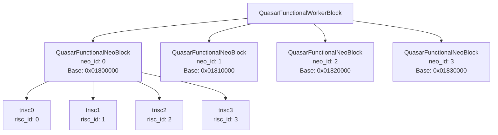
## Address Lookup and Safety Validation

The interval tree-based lookup enables efficient validation of memory accesses. The validation flow is implemented in [ttexalens/tt_exalens_lib.py 131-172](https://github.com/tenstorrent/tt-exalens/blob/046c35eb/ttexalens/tt_exalens_lib.py#L131-L172):

**Diagram: Safety Validation Flow**


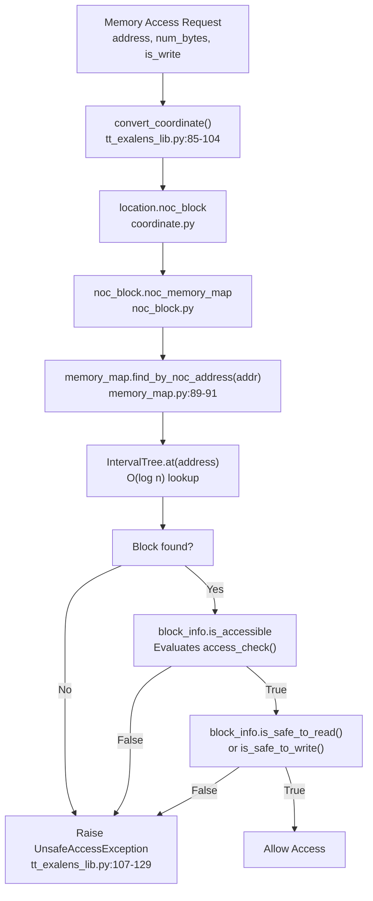

**Diagram: Safety Validation Flow**
```
### validate_noc_access_is_safe() Implementation

The core validation function is [ttexalens/tt_exalens_lib.py 131-172](https://github.com/tenstorrent/tt-exalens/blob/046c35eb/ttexalens/tt_exalens_lib.py#L131-L172):

The function handles multi-block accesses by iterating through memory regions until all bytes are validated.

### Integration with Read/Write Operations

Memory access functions check safe_mode and call validation:

**safe_mode Parameter:**

| Value | Behavior |
| --- | --- |
| `True` (default) | Validates all accesses against memory map; raises `UnsafeAccessException` on violation |
| `False` | Bypasses validation; allows unrestricted hardware access (dangerous) |

### UnsafeAccessException Details

Raised when validation fails, providing detailed context [ttexalens/tt_exalens_lib.py 107-129](https://github.com/tenstorrent/tt-exalens/blob/046c35eb/ttexalens/tt_exalens_lib.py#L107-L129):

### MemoryMap Lookup Methods

The `MemoryMap` class provides lookups for all address spaces [ttexalens/memory_map.py 89-127](https://github.com/tenstorrent/tt-exalens/blob/046c35eb/ttexalens/memory_map.py#L89-L127):

The assertion ensures memory maps are well-formed without overlapping regions.

### Finding Next Block

Used for memory exploration and helpful error messages [ttexalens/memory_map.py 120-127](https://github.com/tenstorrent/tt-exalens/blob/046c35eb/ttexalens/memory_map.py#L120-L127):

This enables CLI features like suggesting nearby memory regions when an access fails.

Sources: [ttexalens/tt_exalens_lib.py 107-172](https://github.com/tenstorrent/tt-exalens/blob/046c35eb/ttexalens/tt_exalens_lib.py#L107-L172)[ttexalens/tt_exalens_lib.py 252-289](https://github.com/tenstorrent/tt-exalens/blob/046c35eb/ttexalens/tt_exalens_lib.py#L252-L289)[ttexalens/memory_map.py 89-127](https://github.com/tenstorrent/tt-exalens/blob/046c35eb/ttexalens/memory_map.py#L89-L127)

## Summary of Key Classes

| Class | File | Purpose |
| --- | --- | --- |
| `MemoryBlock` | (hardware/memory_block.py) | Represents a contiguous memory region with size and address(es) |
| `DeviceAddress` | (hardware/device_address.py) | Encapsulates NOC, private, and BAR0 addresses for the same region |
| `MemoryMapBlockInfo` | ttexalens/memory_map.py:12-35 | Wraps MemoryBlock with name and safety metadata |
| `MemoryMap` | ttexalens/memory_map.py:37-128 | Interval tree-based catalog with address and name lookup |
| `NocBlock` | ttexalens/hardware/noc_block.py | Base class that maintains `noc_memory_map` |
| `BabyRiscInfo` | (hardware/baby_risc_info.py) | Maintains per-RISC `memory_map` for core-specific views |

Sources: [ttexalens/memory_map.py 1-128](https://github.com/tenstorrent/tt-exalens/blob/046c35eb/ttexalens/memory_map.py#L1-L128)[ttexalens/hardware/noc_block.py 1-76](https://github.com/tenstorrent/tt-exalens/blob/046c35eb/ttexalens/hardware/noc_block.py#L1-L76)

Dismiss
Refresh this wiki

Enter email to refresh
