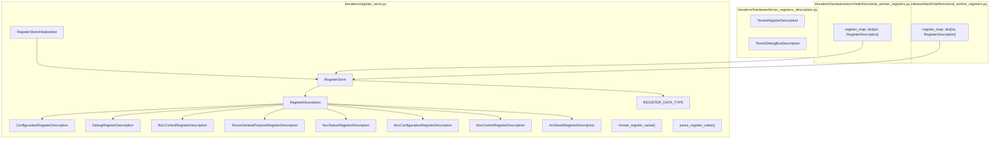
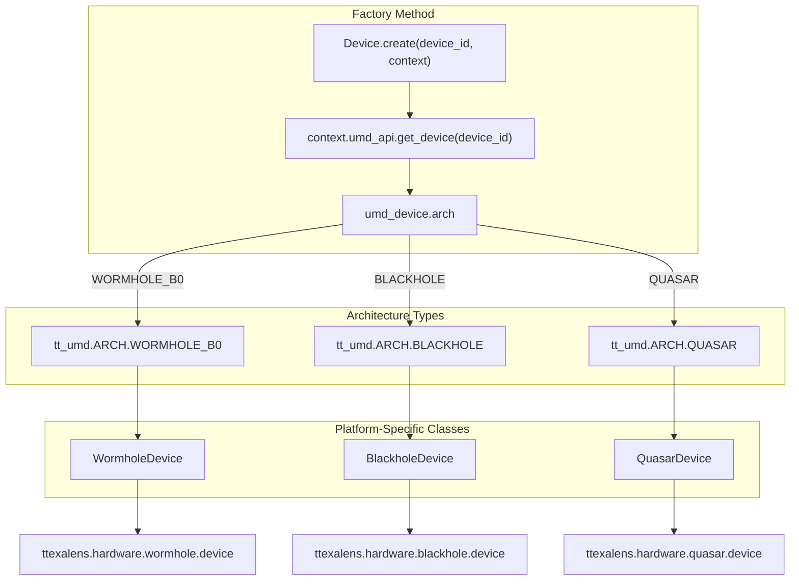
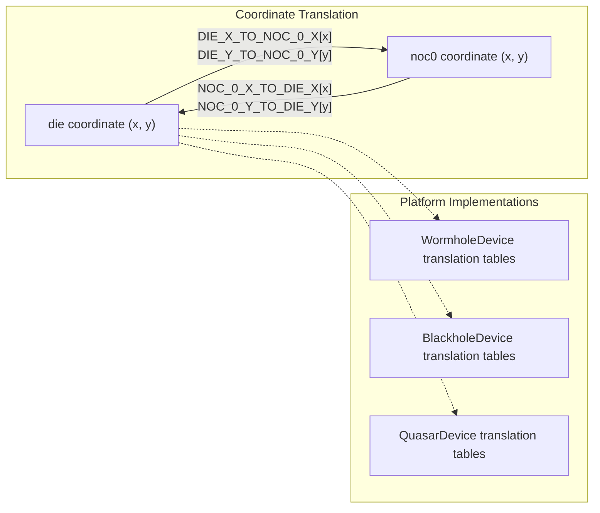
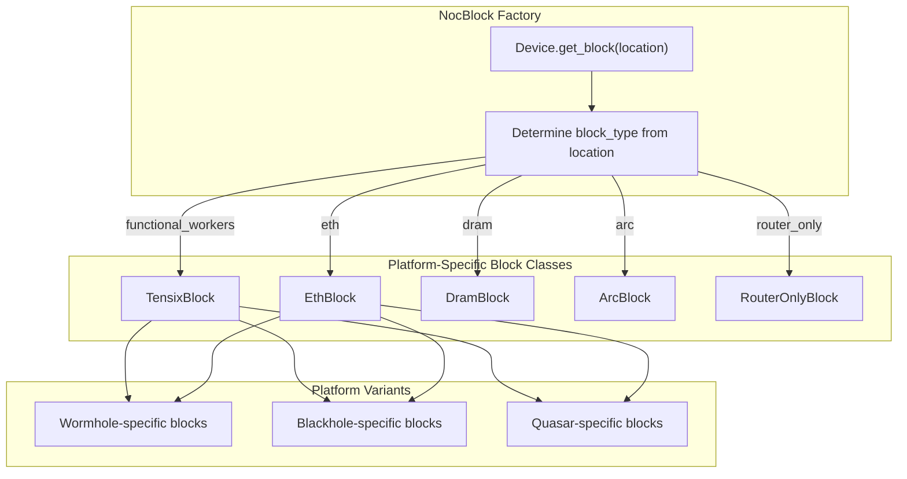
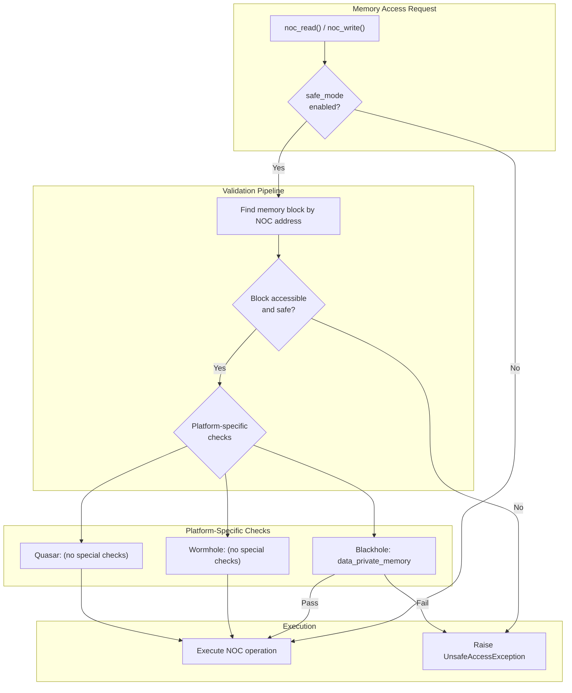
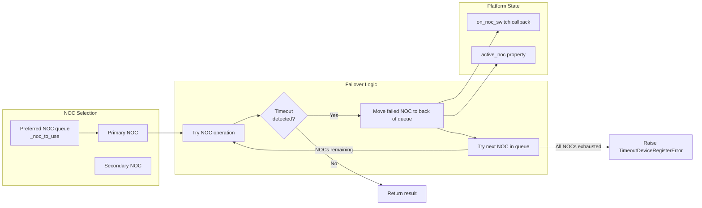

# Platform-Specific Implementations

Relevant source files
*   [test/wheel/run-wheel.sh](https://github.com/tenstorrent/tt-exalens/blob/046c35eb/test/wheel/run-wheel.sh)
*   [ttexalens/device.py](https://github.com/tenstorrent/tt-exalens/blob/046c35eb/ttexalens/device.py)
*   [ttexalens/util.py](https://github.com/tenstorrent/tt-exalens/blob/046c35eb/ttexalens/util.py)

## Purpose and Scope

This document details the platform-specific device implementations for Wormhole B0, Blackhole, and Quasar architectures. It explains how the abstract `Device` class is specialized for each hardware platform, including coordinate system translations, block type configurations, memory maps, and architecture-specific workarounds.

For information about the Device factory pattern and architecture detection mechanism, see [Device Factory and Architecture Detection](https://deepwiki.com/tenstorrent/tt-exalens/5.1-device-factory-and-architecture-detection). For details on memory maps and block layouts, see [Memory Maps and Block Layout](https://deepwiki.com/tenstorrent/tt-exalens/5.3-memory-maps-and-block-layout). For platform-specific RISC-V debugging implementations, see [Platform-Specific Debug Implementations](https://deepwiki.com/tenstorrent/tt-exalens/6.5-platform-specific-debug-implementations).




Sources: [ttexalens/register_store.py:1-20](), [ttexalens/hardware/tensix_registers_description.py](), [ttexalens/hardware/wormhole/functional_worker_registers.py:1-15](), [ttexalens/hardware/blackhole/functional_worker_registers.py:1-15]()

---
```
## Architecture Detection and Instantiation

The `Device` class uses a factory pattern to instantiate the correct platform-specific device implementation. Architecture detection is performed through the UMD layer, which reports the architecture type from hardware.

Sources: [ttexalens/device.py 133-154](https://github.com/tenstorrent/tt-exalens/blob/046c35eb/ttexalens/device.py#L133-L154)

The factory method pattern allows the codebase to maintain a unified interface while supporting multiple hardware architectures:

`@staticmethoddef create(device_id: int, context: Context):    umd_device = context.umd_api.get_device(device_id)    arch = umd_device.arch    match arch:        case tt_umd.ARCH.WORMHOLE_B0:            from ttexalens.hardware.wormhole.device import WormholeDevice            return WormholeDevice(device_id, umd_device, context)                case tt_umd.ARCH.BLACKHOLE:            from ttexalens.hardware.blackhole.device import BlackholeDevice            return BlackholeDevice(device_id, umd_device, context)                case tt_umd.ARCH.QUASAR:            from ttexalens.hardware.quasar.device import QuasarDevice            return QuasarDevice(device_id, umd_device, context)                case _:            raise RuntimeError(f"Architecture {arch} is not supported")`
Sources: [ttexalens/device.py 133-154](https://github.com/tenstorrent/tt-exalens/blob/046c35eb/ttexalens/device.py#L133-L154)




Sources: [ttexalens/device.py:133-154]()

The factory method pattern allows the codebase to maintain a unified interface while supporting multiple hardware architectures:

```python
@staticmethod
def create(device_id: int, context: Context):
    umd_device = context.umd_api.get_device(device_id)
    arch = umd_device.arch
    match arch:
        case tt_umd.ARCH.WORMHOLE_B0:
            from ttexalens.hardware.wormhole.device import WormholeDevice
            return WormholeDevice(device_id, umd_device, context)
        
        case tt_umd.ARCH.BLACKHOLE:
            from ttexalens.hardware.blackhole.device import BlackholeDevice
            return BlackholeDevice(device_id, umd_device, context)
        
        case tt_umd.ARCH.QUASAR:
            from ttexalens.hardware.quasar.device import QuasarDevice
            return QuasarDevice(device_id, umd_device, context)
        
        case _:
            raise RuntimeError(f"Architecture {arch} is not supported")
```

Sources: [ttexalens/device.py:133-154]()
```
## Device Class Hierarchy and Abstract Methods

Each platform-specific device class must implement the following abstract methods defined in the base `Device` class:

| Abstract Method | Purpose | Return Type |
| --- | --- | --- |
| `get_block()` | Returns the `NocBlock` at a given `OnChipCoordinate` | `NocBlock` |
| `get_tensix_registers_description()` | Returns platform-specific Tensix register definitions | `TensixRegisterDescription` |
| `get_tensix_debug_bus_description()` | Returns platform-specific debug bus signal definitions | `TensixDebugBusDescription` |

Sources: [ttexalens/device.py 464-524](https://github.com/tenstorrent/tt-exalens/blob/046c35eb/ttexalens/device.py#L464-L524)

Additionally, platform-specific classes override the following identification methods:

`def is_wormhole(self) -> bool:    return False  # Overridden to True in WormholeDevice def is_blackhole(self) -> bool:    return False  # Overridden to True in BlackholeDevice def is_quasar(self) -> bool:    return False  # Overridden to True in QuasarDevice`
Sources: [ttexalens/device.py 123-130](https://github.com/tenstorrent/tt-exalens/blob/046c35eb/ttexalens/device.py#L123-L130)

## Coordinate System Translation Tables

Each platform must define coordinate translation tables that map between different coordinate systems. The base `Device` class defines these as class variables that platform implementations must populate:

`DIE_X_TO_NOC_0_X: list[int] = []DIE_Y_TO_NOC_0_Y: list[int] = []NOC_0_X_TO_DIE_X: list[int] = []NOC_0_Y_TO_DIE_Y: list[int] = []`
Sources: [ttexalens/device.py 103-106](https://github.com/tenstorrent/tt-exalens/blob/046c35eb/ttexalens/device.py#L103-L106)

These translation tables are used by the coordinate conversion infrastructure to translate between the `die` coordinate system (geographic layout) and the `noc0` coordinate system (network routing). The conversion process is illustrated below:

Sources: [ttexalens/device.py 103-106](https://github.com/tenstorrent/tt-exalens/blob/046c35eb/ttexalens/device.py#L103-L106)[ttexalens/device.py 400-437](https://github.com/tenstorrent/tt-exalens/blob/046c35eb/ttexalens/device.py#L400-L437)

The `__noc_to_die()` method uses these translation tables:

`def __noc_to_die(self, noc_loc, noc_id=0):    noc_x, noc_y = noc_loc    assert noc_id == 0    return (self.NOC_0_X_TO_DIE_X[noc_x], self.NOC_0_Y_TO_DIE_Y[noc_y])`
Sources: [ttexalens/device.py 400-403](https://github.com/tenstorrent/tt-exalens/blob/046c35eb/ttexalens/device.py#L400-L403)

The coordinate system initialization process (`_init_coordinate_systems()`) populates the internal translation dictionaries that enable conversion between all five coordinate systems: `noc0`, `noc1`, `die`, `logical`, and `translated`.

Sources: [ttexalens/device.py 405-437](https://github.com/tenstorrent/tt-exalens/blob/046c35eb/ttexalens/device.py#L405-L437)




Sources: [ttexalens/device.py:103-106](), [ttexalens/device.py:400-437]()

The `__noc_to_die()` method uses these translation tables:

```python
def __noc_to_die(self, noc_loc, noc_id=0):
    noc_x, noc_y = noc_loc
    assert noc_id == 0
    return (self.NOC_0_X_TO_DIE_X[noc_x], self.NOC_0_Y_TO_DIE_Y[noc_y])
```

Sources: [ttexalens/device.py:400-403]()

The coordinate system initialization process (`_init_coordinate_systems()`) populates the internal translation dictionaries that enable conversion between all five coordinate systems: `noc0`, `noc1`, `die`, `logical`, and `translated`.

Sources: [ttexalens/device.py:405-437]()
```
## Block Type Configuration

The base `Device` class defines a comprehensive set of block types that represent different functional units on the chip. Each platform may support a subset of these block types:

| Block Type | Symbol | Description | Core Type | Harvesting |
| --- | --- | --- | --- | --- |
| `functional_workers` | `.` | Functional worker (Tensix) | `tensix` | No |
| `eth` | `E` | Ethernet core | `eth` | No |
| `harvested_eth` | `e` | Harvested Ethernet | `eth` | Yes |
| `arc` | `A` | ARC processor | `arc` | No |
| `dram` | `D` | DRAM controller | `dram` | No |
| `harvested_dram` | `d` | Harvested DRAM | `dram` | Yes |
| `pcie` | `P` | PCIe interface | `pcie` | No |
| `router_only` | `` | Router-only (no compute) | `router_only` | No |
| `harvested_workers` | `-` | Harvested Tensix | `tensix` | Yes |
| `security` | `S` | Security processor | `security` | No |
| `l2cpu` | `C` | L2 CPU | `l2cpu` | No |

Sources: [ttexalens/device.py 559-583](https://github.com/tenstorrent/tt-exalens/blob/046c35eb/ttexalens/device.py#L559-L583)

Block locations are retrieved from the SOC descriptor via UMD based on core type and harvesting status:

`@cached_propertydef _block_locations(self) -> dict[str, list[OnChipCoordinate]]:    result: dict[str, list[OnChipCoordinate]] = {}    for block_name, block_type in self.block_types.items():        locs = []        core_type = tt_umd.CoreType[block_type.core_type.upper()]        if block_type.core_harvesting:            core_coords = self._soc_descriptor.get_harvested_cores(core_type, tt_umd.CoordSystem.NOC0)        else:            core_coords = self._soc_descriptor.get_cores(core_type, tt_umd.CoordSystem.NOC0)                for core_coord in core_coords:            locs.append(OnChipCoordinate(core_coord.x, core_coord.y, "noc0", self, block_type.core_type))        result[block_name] = locs    return result`
Sources: [ttexalens/device.py 532-549](https://github.com/tenstorrent/tt-exalens/blob/046c35eb/ttexalens/device.py#L532-L549)

Platform-specific implementations may have different block configurations based on their chip architecture. The actual block locations and types are determined at runtime from the SOC descriptor provided by UMD.

## Platform-Specific NocBlock Instantiation

Each platform implements the `get_block()` method to instantiate the appropriate `NocBlock` subclass for a given location. This is where platform-specific block implementations are selected based on block type and hardware capabilities.

Sources: [ttexalens/device.py 464-480](https://github.com/tenstorrent/tt-exalens/blob/046c35eb/ttexalens/device.py#L464-L480)

The `get_block()` method is cached to avoid redundant instantiation:

`@abstractmethod@cachedef get_block(self, location: OnChipCoordinate) -> NocBlock:    """    Returns the NOC block at the given location    """    pass`
Sources: [ttexalens/device.py 464-470](https://github.com/tenstorrent/tt-exalens/blob/046c35eb/ttexalens/device.py#L464-L470)




Sources: [ttexalens/device.py:464-480]()

The `get_block()` method is cached to avoid redundant instantiation:

```python
@abstractmethod
@cache
def get_block(self, location: OnChipCoordinate) -> NocBlock:
    """
    Returns the NOC block at the given location
    """
    pass
```

Sources: [ttexalens/device.py:464-470]()
```
## Tensix Instructions Interface

The `Device` class provides a `TensixInstructions` interface that exposes Tensix instruction opcodes for direct instruction injection. This interface is populated from platform-specific instruction definitions:

`class TensixInstructions:    def __init__(self, ops):        for func_name in dir(ops):            func = getattr(ops, func_name)            if callable(func):                static_method = staticmethod(func)                setattr(self.__class__, func_name, static_method)`
Sources: [ttexalens/device.py 55-61](https://github.com/tenstorrent/tt-exalens/blob/046c35eb/ttexalens/device.py#L55-L61)

Key Tensix instruction stubs defined in the base class include:

| Instruction | Parameters | Purpose |
| --- | --- | --- |
| `TT_OP_SFPLOAD` | `lreg_ind, instr_mod0, sfpu_addr_mode, dest_reg_addr` | Load SFPU register |
| `TT_OP_STALLWAIT` | `stall_res, wait_res` | Stall and wait for resources |
| `TT_OP_MOVDBGA2D` | `dest_32b_lo, src, addr_mode, instr_mod, dst` | Move debug data |
| `TT_OP_SFPSTORE` | `lreg_ind, instr_mod0, sfpu_addr_mode, dest_reg_addr` | Store SFPU register |
| `TT_OP_SETRWC` | `clear_ab_vld, rwc_cr, rwc_d, rwc_b, rwc_a, BitMask` | Set read/write counters |
| `TT_OP_ZEROACC` | `clear_mode, AddrMode, dst` | Zero accumulator |
| `TT_OP_SFPSHFT` | `Imm12, VC, VD, Mod1` | SFPU shift operation |
| `TT_OP_INCRWC` | `cr, DstInc, SrcBInc, SrcAInc` | Increment read/write counters |

Sources: [ttexalens/device.py 63-94](https://github.com/tenstorrent/tt-exalens/blob/046c35eb/ttexalens/device.py#L63-L94)

Platform-specific implementations provide actual instruction encoding through the `instructions` class attribute. These are used by the Tensix debugging system for instruction injection (see [Tensix Core Debugging](https://deepwiki.com/tenstorrent/tt-exalens/7.6-tensix-core-debugging)).

## Platform-Specific Memory Access and Safety

Platform implementations must handle architecture-specific memory access patterns and safety constraints. The `Device` class provides safe mode validation that checks memory accesses against known memory maps.

### Blackhole Hardware Workarounds

Blackhole has a known hardware issue affecting RISC data private memory access. The safe mode validator includes a platform-specific check:

`if self.is_blackhole() and "data_private_memory" in memory_block_info.name:    raise UnsafeAccessException(        location,        addr,        num_bytes,        curr_addr,        is_write,        reason="Risc data private memory is marked unsafe due to potential blackhole hardware bug, see tt-exalens:#907/#908.",    )`
Sources: [ttexalens/device.py 288-296](https://github.com/tenstorrent/tt-exalens/blob/046c35eb/ttexalens/device.py#L288-L296)

This workaround prevents unsafe access to RISC private memory regions on Blackhole chips where hardware bugs can cause data corruption.

### Platform-Specific Safe Mode Validation

Sources: [ttexalens/device.py 248-300](https://github.com/tenstorrent/tt-exalens/blob/046c35eb/ttexalens/device.py#L248-L300)[ttexalens/device.py 302-327](https://github.com/tenstorrent/tt-exalens/blob/046c35eb/ttexalens/device.py#L302-L327)[ttexalens/device.py 335-360](https://github.com/tenstorrent/tt-exalens/blob/046c35eb/ttexalens/device.py#L335-L360)




Sources: [ttexalens/device.py:248-300](), [ttexalens/device.py:302-327](), [ttexalens/device.py:335-360]()
```
## NOC Failover and Platform Resilience

The `Device` class implements NOC failover logic that is architecture-agnostic but critical for platform reliability. Each chip has two independent NOC (Network-on-Chip) routers that can be used for memory access.

Sources: [ttexalens/device.py 167-217](https://github.com/tenstorrent/tt-exalens/blob/046c35eb/ttexalens/device.py#L167-L217)

The NOC queue is initialized based on context preferences:

`# NOC queue used for failover, initialized based on context preference# When an operation is attempted, the first NOC in the list is used. If it fails, it is moved to the back of the list# and the next NOC is tried. When all NOCs are exhausted, an exception is raised.self._noc_to_use: list[int] = [1, 0] if context.use_noc1 else [0, 1]self.on_noc_switch: Callable[[], None] | None = None  # callback that is called when NOC is switched`
Sources: [ttexalens/device.py 167-171](https://github.com/tenstorrent/tt-exalens/blob/046c35eb/ttexalens/device.py#L167-L171)

The `_with_noc_failover()` wrapper method handles the retry logic:

`def _with_noc_failover(self, noc_operation: Callable[[int], T], noc_id: int | None = None) -> T:    if noc_id is not None or not self._context.noc_failover:        selected_noc = noc_id if noc_id is not None else self._noc_to_use[0]        return noc_operation(selected_noc)        noc_queue = self._noc_to_use  # reference, not a copy    first_used = noc_queue[0]        while True:        try:            selected_noc = noc_queue[0]            result = noc_operation(selected_noc)            if selected_noc != first_used:                self._noc_to_use = noc_queue                if self.on_noc_switch:                    self.on_noc_switch()            return result        except TimeoutDeviceRegisterError as e:            # ... failover logic ...`
Sources: [ttexalens/device.py 186-217](https://github.com/tenstorrent/tt-exalens/blob/046c35eb/ttexalens/device.py#L186-L217)

This mechanism is platform-independent but essential for reliable operation across all supported architectures.




Sources: [ttexalens/device.py:167-217]()

The NOC queue is initialized based on context preferences:

```python
```
## Platform-Specific Device Properties

Each platform provides architecture-specific properties and capabilities:

### Firmware Version Detection

`@cached_propertydef firmware_version(self):    def noc_operation(noc_id: int) -> util.FirmwareVersion:        fw = self._umd_device.get_firmware_version(noc_id)        return util.FirmwareVersion(fw.major, fw.minor, fw.patch)        return self._with_noc_failover(noc_operation)`
Sources: [ttexalens/device.py 232-238](https://github.com/tenstorrent/tt-exalens/blob/046c35eb/ttexalens/device.py#L232-L238)

### Board Type Information

`@propertydef board_type(self) -> tt_umd.BoardType:    return self._context.cluster_descriptor.get_board_type(self.id)`
Sources: [ttexalens/device.py 218-220](https://github.com/tenstorrent/tt-exalens/blob/046c35eb/ttexalens/device.py#L218-L220)

### Local vs Remote Device Handling

`@cached_propertydef local_device(self) -> Device:    if self.is_local:        return self    local_tt_device = self._umd_device.get_local_tt_device()    for device in self._context.devices.values():        if device.is_local and device._umd_device.get_local_tt_device() == local_tt_device:            return device    raise RuntimeError("Local device not found in context devices")`
Sources: [ttexalens/device.py 222-230](https://github.com/tenstorrent/tt-exalens/blob/046c35eb/ttexalens/device.py#L222-L230)

### Remote Device Discovery

`@cached_propertydef remote_devices(self) -> list[Device]:    assert self.is_local, "Only local devices can get remote devices"    return [        device for device in self._context.devices.values() if not device.is_local and device.local_device == self    ]`
Sources: [ttexalens/device.py 240-246](https://github.com/tenstorrent/tt-exalens/blob/046c35eb/ttexalens/device.py#L240-L246)

## Device Rendering and Visualization

The `Device` class provides a rendering system that can display chip topology in various coordinate systems. Platform implementations inherit this functionality:

`def render(self, axis_coordinate="die", cell_renderer=None, legend=None):    rows: list[list[str]] = []        # Retrieve all block locations    all_block_locs = dict()    hor_axis = OnChipCoordinate.horizontal_axis(axis_coordinate)    ver_axis = OnChipCoordinate.vertical_axis(axis_coordinate)        # Compute extents(range) of all coordinates in the UI    ui_hor_range = (9999, -1)    ui_ver_range = (9999, -1)    for bt in self.block_types:        b_locs = self.get_block_locations(block_type=bt)        for loc in b_locs:            try:                grid_loc = loc.to(axis_coordinate)                ui_hor = grid_loc[hor_axis]                ui_hor_range = (                    min(ui_hor_range[0], ui_hor),                    max(ui_hor_range[1], ui_hor),                )                ui_ver = grid_loc[ver_axis]                ui_ver_range = (                    min(ui_ver_range[0], ui_ver),                    max(ui_ver_range[1], ui_ver),                )                all_block_locs[(ui_hor, ui_ver)] = loc            except:                pass    # ... rendering logic ...`
Sources: [ttexalens/device.py 596-670](https://github.com/tenstorrent/tt-exalens/blob/046c35eb/ttexalens/device.py#L596-L670)

The rendering system adapts to different coordinate systems and can display blocks with custom cell renderers, making it useful for visualizing platform-specific chip layouts.

## Summary of Platform Implementation Requirements

To implement support for a new hardware platform, the following components must be provided:

| Component | Location | Purpose |
| --- | --- | --- |
| Platform Device Class | `ttexalens/hardware/{platform}/device.py` | Main device implementation |
| Coordinate Translation Tables | Device class variables | `DIE_X_TO_NOC_0_X`, `DIE_Y_TO_NOC_0_Y`, etc. |
| `get_block()` Implementation | Platform Device Class | NocBlock instantiation logic |
| `get_tensix_registers_description()` | Platform Device Class | Platform-specific register definitions |
| `get_tensix_debug_bus_description()` | Platform Device Class | Platform-specific debug bus signals |
| Architecture Detection | Update `Device.create()` | Add new architecture case |
| Platform-specific NocBlocks | `ttexalens/hardware/{platform}/` | Block implementations with memory maps |
| Debug Implementations | `ttexalens/hardware/{platform}/` | RiscDebug specializations if needed |

Sources: [ttexalens/device.py 133-154](https://github.com/tenstorrent/tt-exalens/blob/046c35eb/ttexalens/device.py#L133-L154)[ttexalens/device.py 103-106](https://github.com/tenstorrent/tt-exalens/blob/046c35eb/ttexalens/device.py#L103-L106)[ttexalens/device.py 464-524](https://github.com/tenstorrent/tt-exalens/blob/046c35eb/ttexalens/device.py#L464-L524)

This wiki is featured in the [repository](https://github.com/tenstorrent/tt-exalens/blob/main/README.md)

Dismiss
Refresh this wiki

Enter email to refresh
