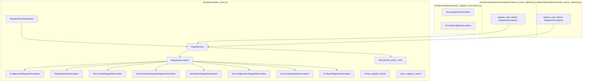
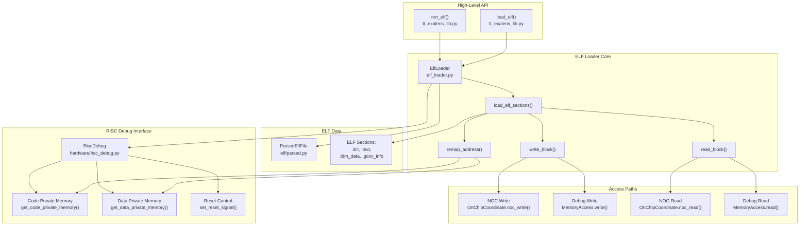
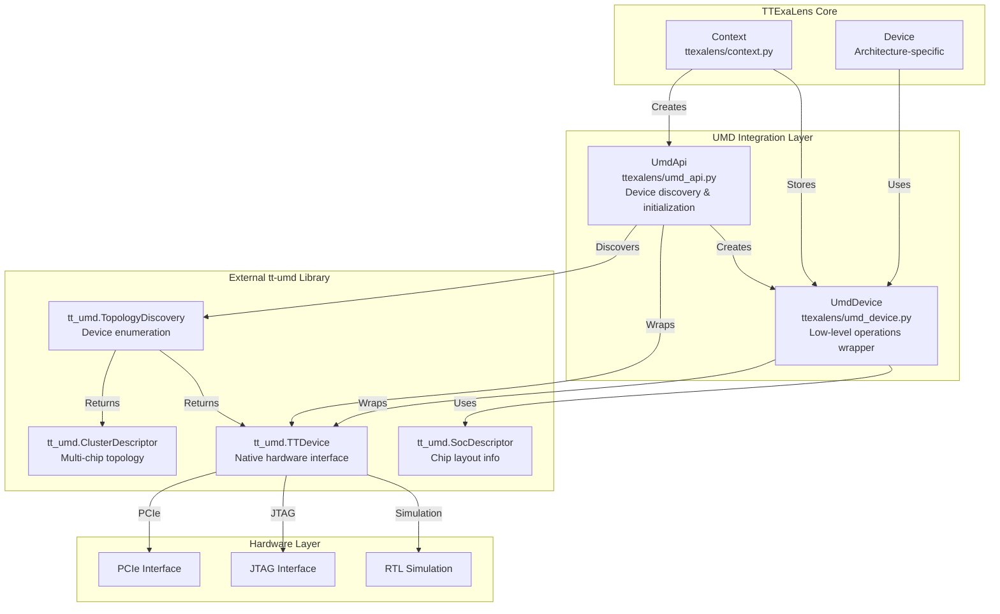
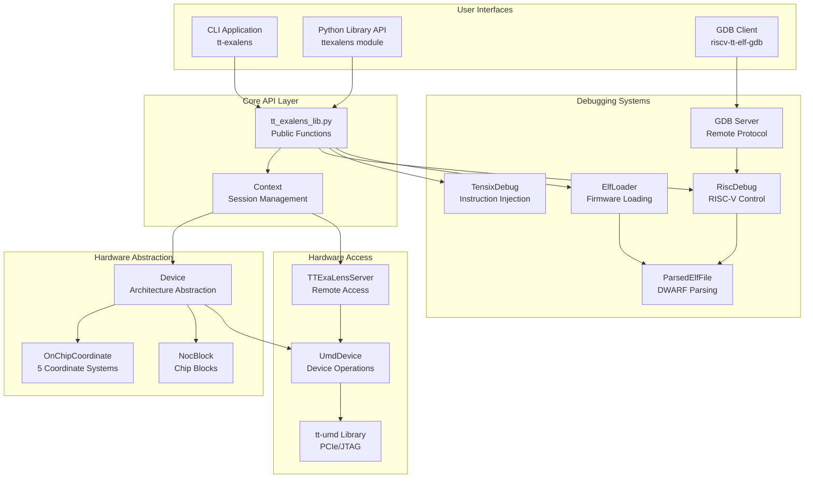
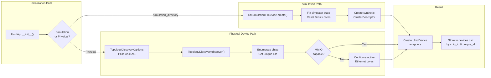
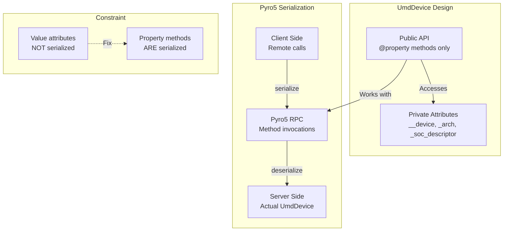
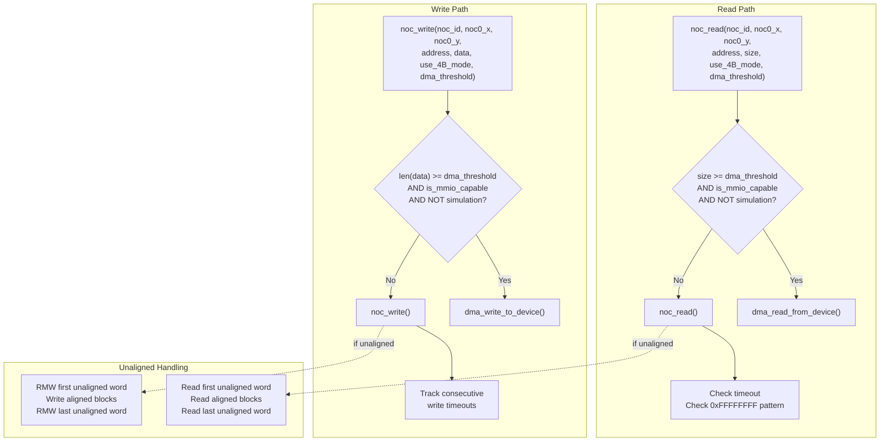
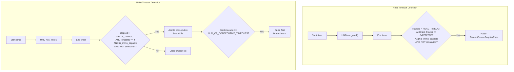
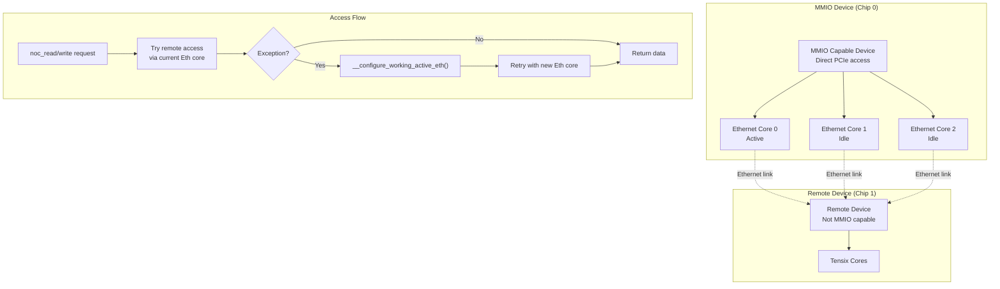
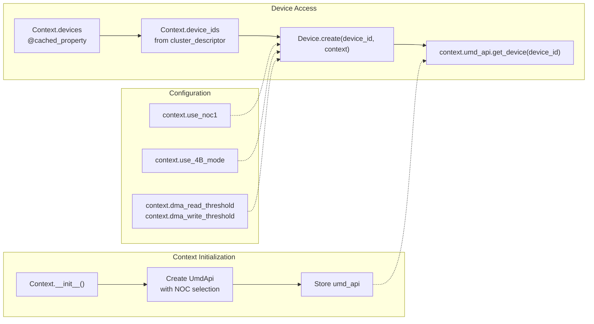

# UMD Integration Layer

Relevant source files
*   [VERSION](https://github.com/tenstorrent/tt-exalens/blob/046c35eb/VERSION)
*   [test/ttexalens/unit_tests/test_remote_communication.py](https://github.com/tenstorrent/tt-exalens/blob/046c35eb/test/ttexalens/unit_tests/test_remote_communication.py)
*   [test/wheel/run-wheel.sh](https://github.com/tenstorrent/tt-exalens/blob/046c35eb/test/wheel/run-wheel.sh)
*   [ttexalens/cli_commands/interfaces.py](https://github.com/tenstorrent/tt-exalens/blob/046c35eb/ttexalens/cli_commands/interfaces.py)
*   [ttexalens/device.py](https://github.com/tenstorrent/tt-exalens/blob/046c35eb/ttexalens/device.py)
*   [ttexalens/requirements.txt](https://github.com/tenstorrent/tt-exalens/blob/046c35eb/ttexalens/requirements.txt)
*   [ttexalens/server.py](https://github.com/tenstorrent/tt-exalens/blob/046c35eb/ttexalens/server.py)
*   [ttexalens/umd_api.py](https://github.com/tenstorrent/tt-exalens/blob/046c35eb/ttexalens/umd_api.py)
*   [ttexalens/umd_device.py](https://github.com/tenstorrent/tt-exalens/blob/046c35eb/ttexalens/umd_device.py)
*   [ttexalens/util.py](https://github.com/tenstorrent/tt-exalens/blob/046c35eb/ttexalens/util.py)

## Purpose and Scope

The UMD Integration Layer provides a wrapper around the external `tt-umd` library (User Mode Driver), which is the low-level interface for communicating with Tenstorrent hardware. This layer serves three primary purposes:

1.   **Pyro5 Compatibility**: Enable remote device access by wrapping `tt_umd.TTDevice` in a serializable interface
2.   **Timeout Detection**: Implement timeout monitoring for hung device operations until UMD provides native support
3.   **Configuration Management**: Centralize DMA threshold settings, NOC selection, and access mode parameters

This layer handles all direct hardware communication, including NOC reads/writes, DMA transfers, BAR0 MMIO operations, and ARC processor communication. For higher-level device abstraction and coordinate systems, see [Device Architecture](https://deepwiki.com/tenstorrent/tt-exalens/5-device-architecture). For memory access validation, see [Memory Maps and Block Layout](https://deepwiki.com/tenstorrent/tt-exalens/5.3-memory-maps-and-block-layout).

**Sources:**[ttexalens/umd_device.py 1-393](https://github.com/tenstorrent/tt-exalens/blob/046c35eb/ttexalens/umd_device.py#L1-L393)[ttexalens/umd_api.py 1-146](https://github.com/tenstorrent/tt-exalens/blob/046c35eb/ttexalens/umd_api.py#L1-L146)[ttexalens/requirements.txt 1-17](https://github.com/tenstorrent/tt-exalens/blob/046c35eb/ttexalens/requirements.txt#L1-L17)




Sources: [ttexalens/register_store.py:1-20](), [ttexalens/hardware/tensix_registers_description.py](), [ttexalens/hardware/wormhole/functional_worker_registers.py:1-15](), [ttexalens/hardware/blackhole/functional_worker_registers.py:1-15]()

---
```
## Architecture Overview

**Sources:**[ttexalens/context.py 23-98](https://github.com/tenstorrent/tt-exalens/blob/046c35eb/ttexalens/context.py#L23-L98)[ttexalens/umd_api.py 45-146](https://github.com/tenstorrent/tt-exalens/blob/046c35eb/ttexalens/umd_api.py#L45-L146)[ttexalens/umd_device.py 31-90](https://github.com/tenstorrent/tt-exalens/blob/046c35eb/ttexalens/umd_device.py#L31-L90)










This architecture enables:
- **Multiple interfaces** (CLI, API, GDB) sharing common implementation
- **Clean abstraction layers** from user interface down to hardware
- **Flexible deployment** (local or remote access)
- **Platform independence** through Device abstraction
- **Comprehensive debugging** via multiple subsystems
```
## UmdApi: Device Discovery and Initialization

The `UmdApi` class handles device discovery and initialization, wrapping the `tt_umd` topology discovery process. It is responsible for:

*   Enumerating all Tenstorrent devices on the system
*   Selecting the appropriate interface (PCIe, JTAG, or simulation)
*   Creating `UmdDevice` wrappers for each discovered device
*   Managing cluster topology and unique device IDs

### Device Discovery Process

**Key Methods:**

| Method | Purpose |
| --- | --- |
| `__init__(init_jtag, initialize_with_noc1, simulation_directory)` | Initialize and discover devices [ttexalens/umd_api.py 60-119](https://github.com/tenstorrent/tt-exalens/blob/046c35eb/ttexalens/umd_api.py#L60-L119) |
| `select_noc_id(noc_id, arch)` | Set thread-local NOC selection for UMD [ttexalens/umd_api.py 46-58](https://github.com/tenstorrent/tt-exalens/blob/046c35eb/ttexalens/umd_api.py#L46-L58) |
| `get_device(chip_id)` | Retrieve wrapped device by ID [ttexalens/umd_api.py 120-123](https://github.com/tenstorrent/tt-exalens/blob/046c35eb/ttexalens/umd_api.py#L120-L123) |
| `get_cluster_descriptor()` | Get topology information [ttexalens/umd_api.py 125-126](https://github.com/tenstorrent/tt-exalens/blob/046c35eb/ttexalens/umd_api.py#L125-L126) |
| `warm_reset(noc_id, is_galaxy_configuration)` | Perform device reset [ttexalens/umd_api.py 128-133](https://github.com/tenstorrent/tt-exalens/blob/046c35eb/ttexalens/umd_api.py#L128-L133) |




**Key Methods:**

| Method | Purpose |
|--------|---------|
| `__init__(init_jtag, initialize_with_noc1, simulation_directory)` | Initialize and discover devices [ttexalens/umd_api.py:60-119]() |
| `select_noc_id(noc_id, arch)` | Set thread-local NOC selection for UMD [ttexalens/umd_api.py:46-58]() |
| `get_device(chip_id)` | Retrieve wrapped device by ID [ttexalens/umd_api.py:120-123]() |
| `get_cluster_descriptor()` | Get topology information [ttexalens/umd_api.py:125-126]() |
| `warm_reset(noc_id, is_galaxy_configuration)` | Perform device reset [ttexalens/umd_api.py:128-133]() |
```
### Interface Selection

The discovery process supports three communication interfaces:

**PCIe (Default):**

**JTAG:**

**Simulation:**

**Sources:**[ttexalens/umd_api.py 60-119](https://github.com/tenstorrent/tt-exalens/blob/046c35eb/ttexalens/umd_api.py#L60-L119)[ttexalens/umd_api.py 14-41](https://github.com/tenstorrent/tt-exalens/blob/046c35eb/ttexalens/umd_api.py#L14-L41)

## UmdDevice: Low-Level Operations Wrapper

The `UmdDevice` class wraps `tt_umd.TTDevice` to provide Pyro5-compatible remote access and timeout detection. A critical design constraint is that **all public members must be properties** (not value attributes) because Pyro5 only serializes methods, not attributes.

### Architecture Constraints



### Key Properties

| Property | Return Type | Description |
| --- | --- | --- |
| `device_id` | `int` | Chip ID in cluster topology [ttexalens/umd_device.py 63-65](https://github.com/tenstorrent/tt-exalens/blob/046c35eb/ttexalens/umd_device.py#L63-L65) |
| `unique_id` | `int` | Hardware unique identifier [ttexalens/umd_device.py 67-69](https://github.com/tenstorrent/tt-exalens/blob/046c35eb/ttexalens/umd_device.py#L67-L69) |
| `arch` | `tt_umd.ARCH` | Architecture (WORMHOLE, BLACKHOLE, QUASAR) [ttexalens/umd_device.py 71-73](https://github.com/tenstorrent/tt-exalens/blob/046c35eb/ttexalens/umd_device.py#L71-L73) |
| `soc_descriptor` | `tt_umd.SocDescriptor` | Chip layout information [ttexalens/umd_device.py 75-77](https://github.com/tenstorrent/tt-exalens/blob/046c35eb/ttexalens/umd_device.py#L75-L77) |
| `is_mmio_capable` | `bool` | Direct PCIe/JTAG access available [ttexalens/umd_device.py 79-81](https://github.com/tenstorrent/tt-exalens/blob/046c35eb/ttexalens/umd_device.py#L79-L81) |
| `is_jtag_capable` | `bool` | JTAG interface available [ttexalens/umd_device.py 83-85](https://github.com/tenstorrent/tt-exalens/blob/046c35eb/ttexalens/umd_device.py#L83-L85) |
| `is_simulation` | `bool` | Running in simulation mode [ttexalens/umd_device.py 87-89](https://github.com/tenstorrent/tt-exalens/blob/046c35eb/ttexalens/umd_device.py#L87-L89) |

**Sources:**[ttexalens/umd_device.py 31-90](https://github.com/tenstorrent/tt-exalens/blob/046c35eb/ttexalens/umd_device.py#L31-L90)

## Memory Access Methods

The `UmdDevice` provides four primary memory access methods, each optimized for different scenarios:

### NOC Read/Write

Standard Network-on-Chip access for arbitrary addresses and sizes. Supports unaligned access by performing read-modify-write operations:

**Unaligned Access Algorithm:**

For reads at unaligned addresses [ttexalens/umd_device.py 169-202](https://github.com/tenstorrent/tt-exalens/blob/046c35eb/ttexalens/umd_device.py#L169-L202):

1.   Read first partial 4-byte word (if address % 4 != 0)
2.   Read all aligned 4-byte blocks
3.   Read last partial 4-byte word (if size % 4 != 0)

For writes at unaligned addresses [ttexalens/umd_device.py 218-260](https://github.com/tenstorrent/tt-exalens/blob/046c35eb/ttexalens/umd_device.py#L218-L260):

1.   Read-Modify-Write first partial word
2.   Write all aligned 4-byte blocks
3.   Read-Modify-Write last partial word




**Unaligned Access Algorithm:**

For reads at unaligned addresses [ttexalens/umd_device.py:169-202]():
1. Read first partial 4-byte word (if address % 4 != 0)
2. Read all aligned 4-byte blocks
3. Read last partial 4-byte word (if size % 4 != 0)

For writes at unaligned addresses [ttexalens/umd_device.py:218-260]():
1. Read-Modify-Write first partial word
2. Write all aligned 4-byte blocks
3. Read-Modify-Write last partial word
```
### DMA Transfers

High-throughput transfers for large blocks, bypassing the NOC when possible:

| Method | Threshold Check | Fallback |
| --- | --- | --- |
| `dma_read_from_device()` | `size >= dma_threshold AND is_mmio_capable` | `noc_read()` |
| `dma_write_to_device()` | `len(data) >= dma_threshold AND is_mmio_capable` | `noc_write()` |

Default thresholds configured in `Context`[ttexalens/context.py 31-32](https://github.com/tenstorrent/tt-exalens/blob/046c35eb/ttexalens/context.py#L31-L32):

*   `dma_read_threshold: int = 24` bytes
*   `dma_write_threshold: int = 56` bytes

**Sources:**[ttexalens/umd_device.py 117-301](https://github.com/tenstorrent/tt-exalens/blob/046c35eb/ttexalens/umd_device.py#L117-L301)[ttexalens/context.py 31-40](https://github.com/tenstorrent/tt-exalens/blob/046c35eb/ttexalens/context.py#L31-L40)

### BAR0 MMIO Access

Direct PCI Base Address Register 0 access for registers on MMIO-capable devices:

**Sources:**[ttexalens/umd_device.py 303-313](https://github.com/tenstorrent/tt-exalens/blob/046c35eb/ttexalens/umd_device.py#L303-L313)

### Coordinate System Conversion

Convert between coordinate systems using the SoC descriptor:

**Sources:**[ttexalens/umd_device.py 315-321](https://github.com/tenstorrent/tt-exalens/blob/046c35eb/ttexalens/umd_device.py#L315-L321)

## Timeout Detection and Error Handling

UMD does not currently provide native timeout exceptions, so `UmdDevice` implements timeout detection through timing measurements and heuristics.

### TimeoutDeviceRegisterError



### Configuration via Environment Variables

| Environment Variable | Default | Purpose |
| --- | --- | --- |
| `TT_EXALENS_READ_TIMEOUT_MS` | 2 ms | Read operation timeout threshold [ttexalens/umd_device.py 113](https://github.com/tenstorrent/tt-exalens/blob/046c35eb/ttexalens/umd_device.py#L113-L113) |
| `TT_EXALENS_WRITE_TIMEOUT_MS` | 2 ms | Write operation timeout threshold [ttexalens/umd_device.py 114](https://github.com/tenstorrent/tt-exalens/blob/046c35eb/ttexalens/umd_device.py#L114-L114) |
| `TT_EXALENS_NUM_OF_CONSECUTIVE_TIMEOUTS` | 5 | Consecutive write timeouts before exception [ttexalens/umd_device.py 115](https://github.com/tenstorrent/tt-exalens/blob/046c35eb/ttexalens/umd_device.py#L115-L115) |

### TimeoutDeviceRegisterError Structure

Error message format:

```
TimeoutDeviceRegisterError: Timeout during read operation on device 0, 
coord (1, 2, TENSIX), address 0x1000, size 4 bytes after 0.0025 seconds.
```

**Sources:**[ttexalens/umd_device.py 13-28](https://github.com/tenstorrent/tt-exalens/blob/046c35eb/ttexalens/umd_device.py#L13-L28)[ttexalens/umd_device.py 113-167](https://github.com/tenstorrent/tt-exalens/blob/046c35eb/ttexalens/umd_device.py#L113-L167)

## Remote Device Communication

For multi-chip systems, non-MMIO devices require remote communication through Ethernet cores on the nearest MMIO-capable device. `UmdDevice` implements automatic fallback and recovery mechanisms.

### Remote Access Architecture



### Active Ethernet Core Configuration

The `__configure_working_active_eth()` method tests each active Ethernet core to find one that works:

1.   UMD provides list of active Ethernet cores on MMIO chip [ttexalens/umd_api.py 104-113](https://github.com/tenstorrent/tt-exalens/blob/046c35eb/ttexalens/umd_api.py#L104-L113)
2.   For each core in the list [ttexalens/umd_device.py 96-106](https://github.com/tenstorrent/tt-exalens/blob/046c35eb/ttexalens/umd_device.py#L96-L106): 
    *   Configure UMD to use that core: `set_remote_transfer_ethernet_cores([translated_coord])`
    *   Attempt a test read to Tensix (0,0) at address 0, size 4
    *   If successful, keep this core active
    *   If exception, try next core

3.   If all cores fail, raise `RuntimeError`

### Fallback Mechanism

Remote access operations automatically retry with a different Ethernet core on failure:

**Test Coverage:**[test/ttexalens/unit_tests/test_remote_communication.py 32-60](https://github.com/tenstorrent/tt-exalens/blob/046c35eb/test/ttexalens/unit_tests/test_remote_communication.py#L32-L60) verifies that when the active Ethernet core is halted, the system automatically switches to a different core and continues operation.

**Sources:**[ttexalens/umd_device.py 96-106](https://github.com/tenstorrent/tt-exalens/blob/046c35eb/ttexalens/umd_device.py#L96-L106)[ttexalens/umd_device.py 204-216](https://github.com/tenstorrent/tt-exalens/blob/046c35eb/ttexalens/umd_device.py#L204-L216)[ttexalens/umd_device.py 262-274](https://github.com/tenstorrent/tt-exalens/blob/046c35eb/ttexalens/umd_device.py#L262-L274)[test/ttexalens/unit_tests/test_remote_communication.py 1-61](https://github.com/tenstorrent/tt-exalens/blob/046c35eb/test/ttexalens/unit_tests/test_remote_communication.py#L1-L61)

## ARC Communication

The ARC (Accelerated RISC-V Compute) processor is the control processor on Tenstorrent devices. `UmdDevice` provides methods for sending messages to ARC and reading telemetry data.

### ARC Message Protocol

**Parameters:**

*   `msg_code`: ARC message type identifier
*   `wait_for_done`: Block until ARC completes the operation
*   `args`: Message-specific argument sequence
*   `timeout`: Maximum wait time (timedelta or seconds as float)

**Returns:**`(return_code, arg0, arg1)` - ARC response values

**Sources:**[ttexalens/umd_device.py 323-334](https://github.com/tenstorrent/tt-exalens/blob/046c35eb/ttexalens/umd_device.py#L323-L334)

### Telemetry Reading

This method includes automatic retry logic for remote devices [ttexalens/umd_device.py 336-353](https://github.com/tenstorrent/tt-exalens/blob/046c35eb/ttexalens/umd_device.py#L336-L353):

1.   Attempt to read telemetry entry
2.   On exception (if MMIO capable), reconfigure Ethernet core and retry
3.   Raise exception if not MMIO capable or retry fails

### Firmware Version Query

Also includes automatic retry with Ethernet reconfiguration [ttexalens/umd_device.py 355-371](https://github.com/tenstorrent/tt-exalens/blob/046c35eb/ttexalens/umd_device.py#L355-L371)

**Sources:**[ttexalens/umd_device.py 323-371](https://github.com/tenstorrent/tt-exalens/blob/046c35eb/ttexalens/umd_device.py#L323-L371)

## Remote Device Access Query

For debugging remote communication issues, `UmdDevice` provides methods to query which Ethernet core is currently active:

**Usage Example:**

**Sources:**[ttexalens/umd_device.py 373-386](https://github.com/tenstorrent/tt-exalens/blob/046c35eb/ttexalens/umd_device.py#L373-L386)

## Local TTDevice Access

For operations that require direct access to the underlying UMD device (bypassing the wrapper), use:

This returns:

*   The wrapped `TTDevice` for MMIO-capable devices
*   The local MMIO device for remote devices (the one with direct PCIe/JTAG access)

**Sources:**[ttexalens/umd_device.py 388-392](https://github.com/tenstorrent/tt-exalens/blob/046c35eb/ttexalens/umd_device.py#L388-L392)

## Usage in Context




**Configuration Parameters in Context:**

| Parameter | Default | Purpose |
|-----------|---------|---------|
| `use_noc1` | `False` | Use NOC1 instead of NOC0 [ttexalens/context.py:29]() |
| `use_4B_mode` | `True` | Read/write 4 bytes at a time for unaligned access [ttexalens/context.py:30]() |
| `dma_read_threshold` | 24 | Minimum bytes for DMA read [ttexalens/context.py:31]() |
| `dma_write_threshold` | 56 | Minimum bytes for DMA write [ttexalens/context.py:32]() |
```

The `Context` object creates and stores `UmdDevice` instances during initialization:

**Configuration Parameters in Context:**

| Parameter | Default | Purpose |
| --- | --- | --- |
| `use_noc1` | `False` | Use NOC1 instead of NOC0 [ttexalens/context.py 29](https://github.com/tenstorrent/tt-exalens/blob/046c35eb/ttexalens/context.py#L29-L29) |
| `use_4B_mode` | `True` | Read/write 4 bytes at a time for unaligned access [ttexalens/context.py 30](https://github.com/tenstorrent/tt-exalens/blob/046c35eb/ttexalens/context.py#L30-L30) |
| `dma_read_threshold` | 24 | Minimum bytes for DMA read [ttexalens/context.py 31](https://github.com/tenstorrent/tt-exalens/blob/046c35eb/ttexalens/context.py#L31-L31) |
| `dma_write_threshold` | 56 | Minimum bytes for DMA write [ttexalens/context.py 32](https://github.com/tenstorrent/tt-exalens/blob/046c35eb/ttexalens/context.py#L32-L32) |

**Sources:**[ttexalens/context.py 23-43](https://github.com/tenstorrent/tt-exalens/blob/046c35eb/ttexalens/context.py#L23-L43)[ttexalens/context.py 50-59](https://github.com/tenstorrent/tt-exalens/blob/046c35eb/ttexalens/context.py#L50-L59)

Dismiss
Refresh this wiki

Enter email to refresh
