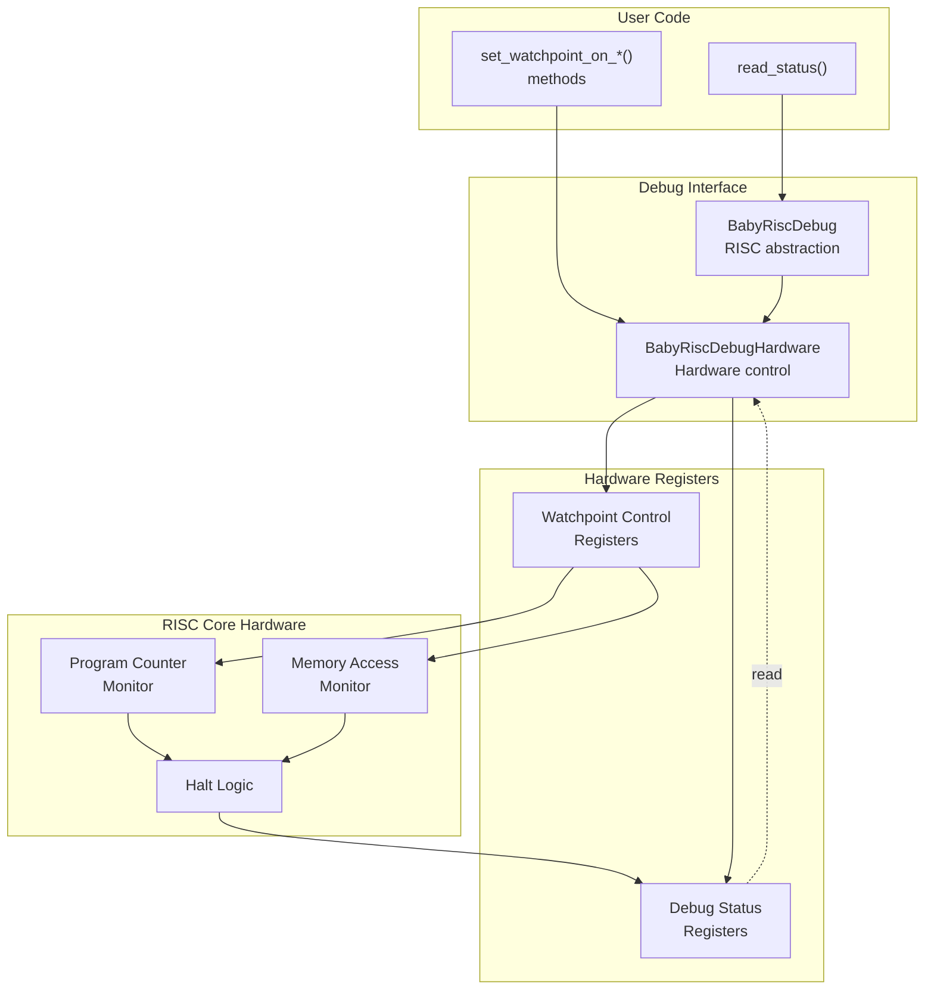
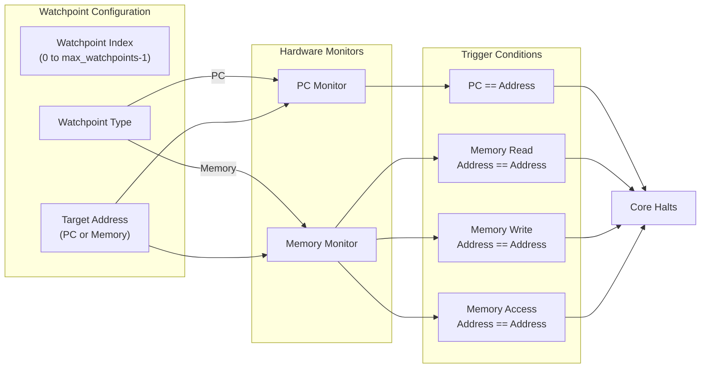
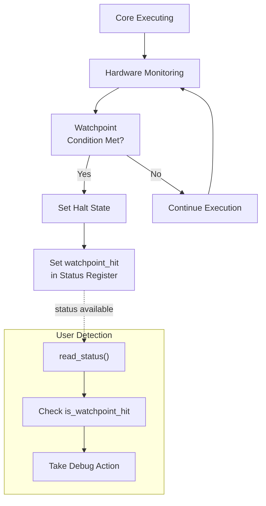

# Watchpoints and Breakpoints

Relevant source files
*   [test/ttexalens/unit_tests/core_simulator.py](https://github.com/tenstorrent/tt-exalens/blob/046c35eb/test/ttexalens/unit_tests/core_simulator.py)
*   [test/ttexalens/unit_tests/test_risc_debug.py](https://github.com/tenstorrent/tt-exalens/blob/046c35eb/test/ttexalens/unit_tests/test_risc_debug.py)
*   [ttexalens/hardware/baby_risc_debug.py](https://github.com/tenstorrent/tt-exalens/blob/046c35eb/ttexalens/hardware/baby_risc_debug.py)
*   [ttexalens/hardware/blackhole/baby_risc_debug.py](https://github.com/tenstorrent/tt-exalens/blob/046c35eb/ttexalens/hardware/blackhole/baby_risc_debug.py)
*   [ttexalens/hardware/memory_block.py](https://github.com/tenstorrent/tt-exalens/blob/046c35eb/ttexalens/hardware/memory_block.py)
*   [ttexalens/hardware/quasar/baby_risc_debug.py](https://github.com/tenstorrent/tt-exalens/blob/046c35eb/ttexalens/hardware/quasar/baby_risc_debug.py)
*   [ttexalens/hardware/quasar/functional_neo_block.py](https://github.com/tenstorrent/tt-exalens/blob/046c35eb/ttexalens/hardware/quasar/functional_neo_block.py)
*   [ttexalens/hardware/risc_debug.py](https://github.com/tenstorrent/tt-exalens/blob/046c35eb/ttexalens/hardware/risc_debug.py)
*   [ttexalens/hardware/wormhole/baby_risc_debug.py](https://github.com/tenstorrent/tt-exalens/blob/046c35eb/ttexalens/hardware/wormhole/baby_risc_debug.py)

This page documents the hardware watchpoint system provided by tt-exalens for debugging RISC-V cores on Tenstorrent hardware. Watchpoints enable automated halting of core execution when specific conditions are met, such as reaching a particular program counter address or accessing a memory location. The system provides hardware-based watchpoints rather than software breakpoints (no instruction injection), allowing non-intrusive debugging.

For general RISC-V execution control (halt, step, continue), see [Execution Control](https://deepwiki.com/tenstorrent/tt-exalens/6.2-execution-control). For reading core state after halting, see [Memory and Register Access](https://deepwiki.com/tenstorrent/tt-exalens/6.3-memory-and-register-access).

## Watchpoint System Overview

The watchpoint system is implemented through the `BabyRiscDebugHardware` interface, which provides hardware-level control over RISC-V debug registers. Each RISC core supports a limited number of simultaneous watchpoints, determined by the architecture and core type. Watchpoints are configured by writing to hardware debug registers and trigger automatic halting when their conditions are satisfied.

**Sources:**[test/ttexalens/unit_tests/test_risc_debug.py 840-851](https://github.com/tenstorrent/tt-exalens/blob/046c35eb/test/ttexalens/unit_tests/test_risc_debug.py#L840-L851)[test/ttexalens/unit_tests/core_simulator.py 48-51](https://github.com/tenstorrent/tt-exalens/blob/046c35eb/test/ttexalens/unit_tests/core_simulator.py#L48-L51)[test/ttexalens/unit_tests/core_simulator.py 187-188](https://github.com/tenstorrent/tt-exalens/blob/046c35eb/test/ttexalens/unit_tests/core_simulator.py#L187-L188)

## Watchpoint Types

The system supports four types of hardware watchpoints, each monitoring different execution conditions:

| Watchpoint Type | Method | Trigger Condition | Use Case |
| --- | --- | --- | --- |
| **PC Watchpoint** | `set_watchpoint_on_pc_address()` | Program counter reaches specified address | Function entry, loop iterations, code coverage |
| **Memory Access** | `set_watchpoint_on_memory_access()` | Any read or write to specified address | General data inspection, I/O monitoring |
| **Memory Read** | `set_watchpoint_on_memory_read()` | Read operation from specified address | Track data consumers, input validation |
| **Memory Write** | `set_watchpoint_on_memory_write()` | Write operation to specified address | Track data producers, corruption detection |

**Sources:**[test/ttexalens/unit_tests/test_risc_debug.py 840-851](https://github.com/tenstorrent/tt-exalens/blob/046c35eb/test/ttexalens/unit_tests/test_risc_debug.py#L840-L851)[test/ttexalens/unit_tests/test_risc_debug.py 853-891](https://github.com/tenstorrent/tt-exalens/blob/046c35eb/test/ttexalens/unit_tests/test_risc_debug.py#L853-L891)

## Setting and Clearing Watchpoints

### Setting Watchpoints

Watchpoints are configured through the `BabyRiscDebugHardware` interface, which is accessed via `BabyRiscDebug.debug_hardware`. Each watchpoint requires an index (0 to `max_watchpoints-1`) and a target address.

**API Methods:**

*   `set_watchpoint_on_pc_address(watchpoint_index: int, address: int)` - Halt when PC reaches address
*   `set_watchpoint_on_memory_access(watchpoint_index: int, address: int)` - Halt on any access to address
*   `set_watchpoint_on_memory_read(watchpoint_index: int, address: int)` - Halt on read from address
*   `set_watchpoint_on_memory_write(watchpoint_index: int, address: int)` - Halt on write to address

**Watchpoint Index Management:**

Each core has a fixed number of hardware watchpoint slots (`risc_info.max_watchpoints`). Multiple watchpoints can be active simultaneously by using different indices. If `max_watchpoints` is 0, the core does not support hardware watchpoints.

**Sources:**[test/ttexalens/unit_tests/test_risc_debug.py 853-891](https://github.com/tenstorrent/tt-exalens/blob/046c35eb/test/ttexalens/unit_tests/test_risc_debug.py#L853-L891)[test/ttexalens/unit_tests/test_risc_debug.py 1058-1150](https://github.com/tenstorrent/tt-exalens/blob/046c35eb/test/ttexalens/unit_tests/test_risc_debug.py#L1058-L1150)

### Clearing Watchpoints

Watchpoints persist until explicitly cleared or the core is reset. To clear a specific watchpoint, use the corresponding clear method with the same index used to set it.

**API Methods:**

*   `clear_watchpoint(watchpoint_index: int)` - Clear the watchpoint at the specified index

After clearing, the watchpoint slot becomes available for reuse with a different configuration.

**Sources:**[test/ttexalens/unit_tests/test_risc_debug.py 1217-1255](https://github.com/tenstorrent/tt-exalens/blob/046c35eb/test/ttexalens/unit_tests/test_risc_debug.py#L1217-L1255)

## Watchpoint Status Detection

### Reading Watchpoint Status

When a watchpoint triggers, the core enters a halted state and updates its debug status registers. The status can be read through the `BabyRiscDebugHardware.read_status()` method, which returns a `BabyRiscDebugWatchpointState` object.

**Key Status Fields:**

| Field | Type | Description |
| --- | --- | --- |
| `is_halted` | `bool` | Core is in halted state |
| `is_watchpoint_hit` | `bool` | Halt was caused by a watchpoint |
| `is_ebreak_hit` | `bool` | Halt was caused by an ebreak instruction |
| `watchpoint_index` | `int` | Index of the watchpoint that triggered (if multiple active) |

The `is_watchpoint_hit` field distinguishes watchpoint-triggered halts from other halt causes (manual halt, ebreak instructions, etc.).

**Sources:**[test/ttexalens/unit_tests/test_risc_debug.py 898-915](https://github.com/tenstorrent/tt-exalens/blob/046c35eb/test/ttexalens/unit_tests/test_risc_debug.py#L898-L915)[test/ttexalens/unit_tests/core_simulator.py 187-188](https://github.com/tenstorrent/tt-exalens/blob/046c35eb/test/ttexalens/unit_tests/core_simulator.py#L187-L188)

### Distinguishing Halt Causes

Multiple conditions can cause a core to halt. After detecting a halt (via `is_halted()`), examine the status to determine the specific cause:

*   `is_watchpoint_hit == True` - Triggered by a hardware watchpoint
*   `is_ebreak_hit == True` - Triggered by an `ebreak` instruction
*   Both `False` - Manual halt via `halt()` call

This distinction is important for automated debugging scripts that need to respond differently to different halt causes.

**Sources:**[test/ttexalens/unit_tests/test_risc_debug.py 607-646](https://github.com/tenstorrent/tt-exalens/blob/046c35eb/test/ttexalens/unit_tests/test_risc_debug.py#L607-L646)[test/ttexalens/unit_tests/test_risc_debug.py 898-915](https://github.com/tenstorrent/tt-exalens/blob/046c35eb/test/ttexalens/unit_tests/test_risc_debug.py#L898-L915)

## Hardware Limitations and Architecture Considerations

### Maximum Watchpoint Count

The number of simultaneous watchpoints varies by RISC core type and hardware architecture. The limit is available through `risc_info.max_watchpoints`:

`max_wp = risc_debug.risc_info.max_watchpointsif max_wp == 0:    # Watchpoints not supported on this core    print("No watchpoint support")elif max_wp > 0:    # Can use watchpoint indices 0 to max_wp-1    print(f"Supports {max_wp} simultaneous watchpoints")`
**Common Configurations:**

*   Some RISC cores (particularly older or specialized cores) may have `max_watchpoints = 0`
*   Most cores support at least 2-4 simultaneous watchpoints
*   Watchpoint availability is independent of other debug features

**Sources:**[test/ttexalens/unit_tests/test_risc_debug.py 856-857](https://github.com/tenstorrent/tt-exalens/blob/046c35eb/test/ttexalens/unit_tests/test_risc_debug.py#L856-L857)

### Platform-Specific Behavior

Certain platform and core combinations exhibit specific watchpoint behaviors:

**Wormhole Ethernet Cores:**

*   Some watchpoint tests may fail intermittently on Ethernet cores (ERISC) on Wormhole architecture
*   This is a known issue tracked in the codebase

**Multiple Watchpoints:**

*   When multiple watchpoints are active, the `watchpoint_index` field in the status indicates which triggered
*   If multiple watchpoints trigger simultaneously (rare), the lowest index typically takes precedence

**Sources:**[test/ttexalens/unit_tests/test_risc_debug.py 859-860](https://github.com/tenstorrent/tt-exalens/blob/046c35eb/test/ttexalens/unit_tests/test_risc_debug.py#L859-L860)[test/ttexalens/unit_tests/test_risc_debug.py 1257-1336](https://github.com/tenstorrent/tt-exalens/blob/046c35eb/test/ttexalens/unit_tests/test_risc_debug.py#L1257-L1336)

## Usage Examples from Test Suite

### Example 1: PC Watchpoint for Function Entry

Set a watchpoint at a specific program counter address and verify execution halts when reached:

`# Set watchpoint at PC offset 20 from program baserisc_debug = core_sim.risc_debugdebug_hw = risc_debug.debug_hardware # Configure watchpointwatchpoint_index = 0target_pc = core_sim.program_base_address + 20debug_hw.set_watchpoint_on_pc_address(watchpoint_index, target_pc) # Start executioncore_sim.set_reset(False)core_sim.continue_execution() # Check if watchpoint was hitstatus = debug_hw.read_status()assert status.is_watchpoint_hitassert status.is_halted`
**Sources:**[test/ttexalens/unit_tests/test_risc_debug.py 853-915](https://github.com/tenstorrent/tt-exalens/blob/046c35eb/test/ttexalens/unit_tests/test_risc_debug.py#L853-L915)

### Example 2: Memory Write Watchpoint

Monitor when a specific memory location is written to:

`# Memory address to monitordata_addr = 0x10000 # Set watchpoint on memory writedebug_hw.set_watchpoint_on_memory_write(0, data_addr) # Start executioncore_sim.set_reset(False)core_sim.continue_execution() # Wait for haltwhile not risc_debug.is_halted():    time.sleep(0.001) # Verify watchpoint triggeredstatus = debug_hw.read_status()assert status.is_watchpoint_hit # Read the written valuewritten_value = risc_debug.read_memory(data_addr)`
**Sources:**[test/ttexalens/unit_tests/test_risc_debug.py 1152-1215](https://github.com/tenstorrent/tt-exalens/blob/046c35eb/test/ttexalens/unit_tests/test_risc_debug.py#L1152-L1215)

### Example 3: Multiple Simultaneous Watchpoints

Use multiple watchpoints to monitor different conditions:

`# Check how many watchpoints are supportedmax_wp = risc_debug.risc_info.max_watchpointsif max_wp < 2:    print("Need at least 2 watchpoints")    return # Set PC watchpointdebug_hw.set_watchpoint_on_pc_address(0, 0x1000) # Set memory watchpointdebug_hw.set_watchpoint_on_memory_write(1, 0x10000) # Start executioncore_sim.continue_execution() # When halted, check which watchpoint triggeredstatus = debug_hw.read_status()if status.is_watchpoint_hit:    triggered_index = status.watchpoint_index    print(f"Watchpoint {triggered_index} triggered")`
**Sources:**[test/ttexalens/unit_tests/test_risc_debug.py 1257-1336](https://github.com/tenstorrent/tt-exalens/blob/046c35eb/test/ttexalens/unit_tests/test_risc_debug.py#L1257-L1336)

## Code Entity Reference

The following table maps conceptual components to their implementation in the codebase:

| Concept | Code Entity | Location |
| --- | --- | --- |
| Watchpoint hardware control | `BabyRiscDebugHardware` | `ttexalens/hardware/baby_risc_debug.py` |
| RISC debug interface | `BabyRiscDebug` | `ttexalens/hardware/baby_risc_debug.py` |
| Watchpoint status | `BabyRiscDebugWatchpointState` | `ttexalens/hardware/baby_risc_debug.py` |
| Core metadata | `RiscInfo.max_watchpoints` | `ttexalens/hardware/baby_risc_debug.py` |
| Test utilities | `RiscvCoreSimulator` | `test/ttexalens/unit_tests/core_simulator.py` |
| Set PC watchpoint | `set_watchpoint_on_pc_address()` | `BabyRiscDebugHardware` |
| Set memory access watchpoint | `set_watchpoint_on_memory_access()` | `BabyRiscDebugHardware` |
| Set memory read watchpoint | `set_watchpoint_on_memory_read()` | `BabyRiscDebugHardware` |
| Set memory write watchpoint | `set_watchpoint_on_memory_write()` | `BabyRiscDebugHardware` |
| Clear watchpoint | `clear_watchpoint()` | `BabyRiscDebugHardware` |
| Read status | `read_status()` | `BabyRiscDebugHardware` |

**Sources:**[test/ttexalens/unit_tests/test_risc_debug.py 1-13](https://github.com/tenstorrent/tt-exalens/blob/046c35eb/test/ttexalens/unit_tests/test_risc_debug.py#L1-L13)[test/ttexalens/unit_tests/core_simulator.py 11-12](https://github.com/tenstorrent/tt-exalens/blob/046c35eb/test/ttexalens/unit_tests/core_simulator.py#L11-L12)[test/ttexalens/unit_tests/test_risc_debug.py 840-851](https://github.com/tenstorrent/tt-exalens/blob/046c35eb/test/ttexalens/unit_tests/test_risc_debug.py#L840-L851)

This wiki is featured in the [repository](https://github.com/tenstorrent/tt-exalens/blob/main/README.md)

Dismiss
Refresh this wiki

Enter email to refresh
