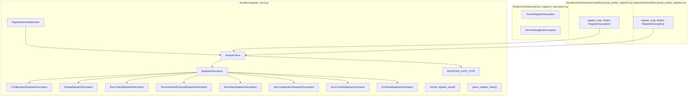
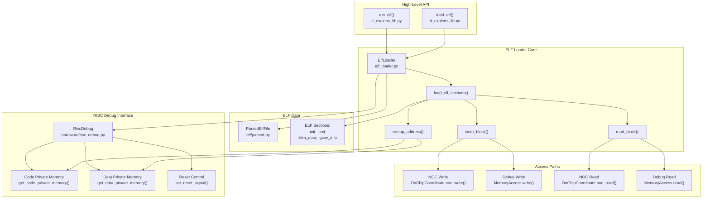
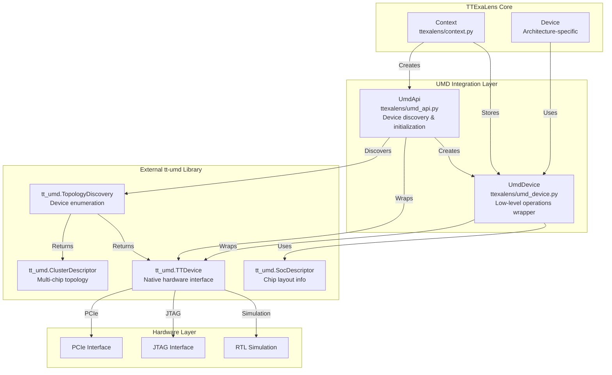
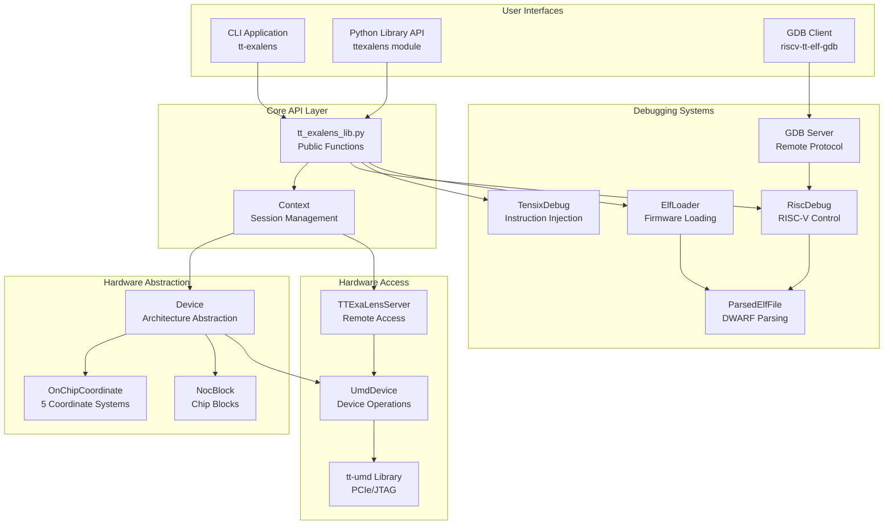
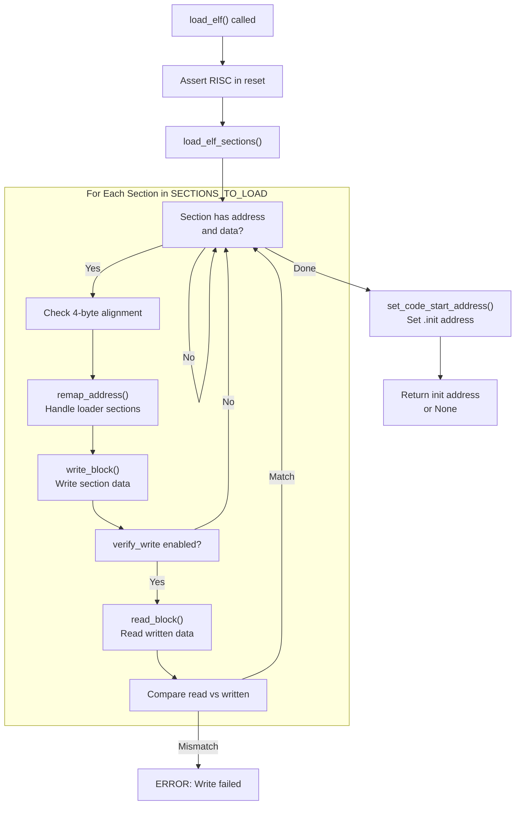
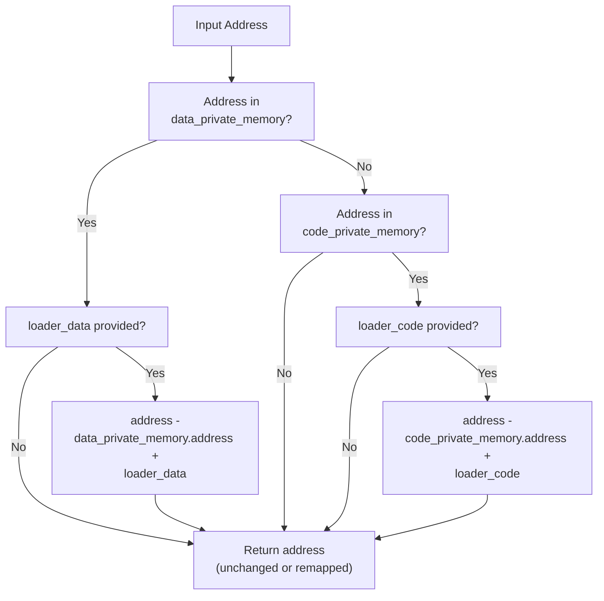
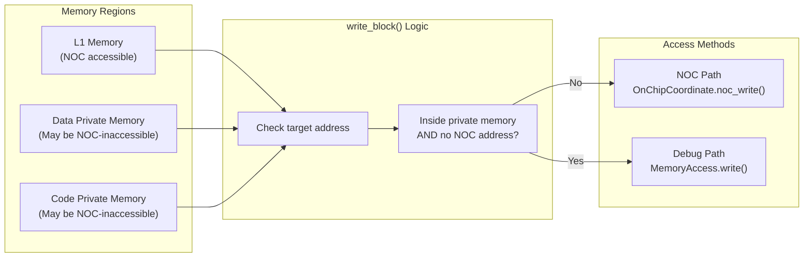
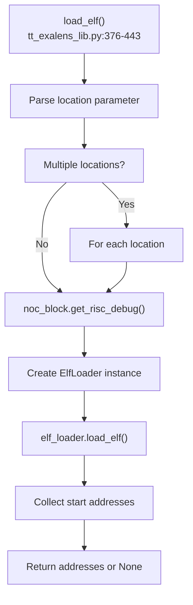

# ELF Loader Implementation

Relevant source files
*   [test/ttexalens/unit_tests/test_device.py](https://github.com/tenstorrent/tt-exalens/blob/046c35eb/test/ttexalens/unit_tests/test_device.py)
*   [test/ttexalens/unit_tests/test_lib.py](https://github.com/tenstorrent/tt-exalens/blob/046c35eb/test/ttexalens/unit_tests/test_lib.py)
*   [test/ttexalens/unit_tests/test_tensix_debug.py](https://github.com/tenstorrent/tt-exalens/blob/046c35eb/test/ttexalens/unit_tests/test_tensix_debug.py)
*   [ttexalens/debug_tensix.py](https://github.com/tenstorrent/tt-exalens/blob/046c35eb/ttexalens/debug_tensix.py)
*   [ttexalens/elf_loader.py](https://github.com/tenstorrent/tt-exalens/blob/046c35eb/ttexalens/elf_loader.py)
*   [ttexalens/hardware/baby_risc_debug.py](https://github.com/tenstorrent/tt-exalens/blob/046c35eb/ttexalens/hardware/baby_risc_debug.py)
*   [ttexalens/hardware/blackhole/baby_risc_debug.py](https://github.com/tenstorrent/tt-exalens/blob/046c35eb/ttexalens/hardware/blackhole/baby_risc_debug.py)
*   [ttexalens/hardware/memory_block.py](https://github.com/tenstorrent/tt-exalens/blob/046c35eb/ttexalens/hardware/memory_block.py)
*   [ttexalens/hardware/quasar/baby_risc_debug.py](https://github.com/tenstorrent/tt-exalens/blob/046c35eb/ttexalens/hardware/quasar/baby_risc_debug.py)
*   [ttexalens/hardware/quasar/functional_neo_block.py](https://github.com/tenstorrent/tt-exalens/blob/046c35eb/ttexalens/hardware/quasar/functional_neo_block.py)
*   [ttexalens/hardware/risc_debug.py](https://github.com/tenstorrent/tt-exalens/blob/046c35eb/ttexalens/hardware/risc_debug.py)
*   [ttexalens/hardware/wormhole/baby_risc_debug.py](https://github.com/tenstorrent/tt-exalens/blob/046c35eb/ttexalens/hardware/wormhole/baby_risc_debug.py)
*   [ttexalens/tt_exalens_lib.py](https://github.com/tenstorrent/tt-exalens/blob/046c35eb/ttexalens/tt_exalens_lib.py)

## Purpose and Scope

The ELF Loader system is responsible for loading compiled ELF (Executable and Linkable Format) files onto RISC-V cores within Tenstorrent devices. This page documents the `ElfLoader` class implementation, including section loading, address remapping for loader sections, write verification mechanisms, and the dual access paths (NOC vs debug interface) used to write to different memory regions.

For high-level ELF management functions (`load_elf`, `run_elf`), see [ELF Management](https://deepwiki.com/tenstorrent/tt-exalens/3.5-elf-management). For RISC core control operations, see [RISC-V Core Control](https://deepwiki.com/tenstorrent/tt-exalens/3.6-risc-v-core-control). For debug interface details, see [Debug Architecture Overview](https://deepwiki.com/tenstorrent/tt-exalens/6.1-debug-architecture-overview).




Sources: [ttexalens/register_store.py:1-20](), [ttexalens/hardware/tensix_registers_description.py](), [ttexalens/hardware/wormhole/functional_worker_registers.py:1-15](), [ttexalens/hardware/blackhole/functional_worker_registers.py:1-15]()

---
```
## Architecture Overview

The ELF loader bridges the gap between parsed ELF file data and physical RISC-V core memory. It coordinates between multiple subsystems to ensure correct program loading while handling architecture-specific memory layouts.

**Sources:**[ttexalens/elf_loader.py 1-233](https://github.com/tenstorrent/tt-exalens/blob/046c35eb/ttexalens/elf_loader.py#L1-L233)[ttexalens/tt_exalens_lib.py 376-502](https://github.com/tenstorrent/tt-exalens/blob/046c35eb/ttexalens/tt_exalens_lib.py#L376-L502)










This architecture enables:
- **Multiple interfaces** (CLI, API, GDB) sharing common implementation
- **Clean abstraction layers** from user interface down to hardware
- **Flexible deployment** (local or remote access)
- **Platform independence** through Device abstraction
- **Comprehensive debugging** via multiple subsystems
```
## ElfLoader Class Structure

The `ElfLoader` class encapsulates all ELF loading functionality and maintains references to the necessary subsystems.

| Component | Type | Purpose |
| --- | --- | --- |
| `risc_debug` | `RiscDebug` | RISC core debug interface for reset control and memory access |
| `location` | `OnChipCoordinate` | On-chip location of the target core |
| `context` | `Context` | Global context for device interaction |
| `mem_access` | `MemoryAccess` | Memory access abstraction for debug interface |
| `SECTIONS_TO_LOAD` | `list[str]` | Static list of section names to load: `[".init", ".text", ".ldm_data", ".gcov_info"]` |

**Sources:**[ttexalens/elf_loader.py 12-23](https://github.com/tenstorrent/tt-exalens/blob/046c35eb/ttexalens/elf_loader.py#L12-L23)

## ELF Section Loading Process

The section loading process involves parsing the ELF file, determining target addresses, and writing data to the appropriate memory regions.

**Sources:**[ttexalens/elf_loader.py 143-199](https://github.com/tenstorrent/tt-exalens/blob/046c35eb/ttexalens/elf_loader.py#L143-L199)[ttexalens/elf_loader.py 201-217](https://github.com/tenstorrent/tt-exalens/blob/046c35eb/ttexalens/elf_loader.py#L201-L217)



### Section Alignment Validation

All ELF sections must be 32-bit (4-byte) aligned. This is enforced at [ttexalens/elf_loader.py 170-173](https://github.com/tenstorrent/tt-exalens/blob/046c35eb/ttexalens/elf_loader.py#L170-L173):

`if section.address % 4 != 0:    raise ValueError(        f"{elf_path}: section {section.name} (0x{section.address:08x}) is not 32-bit aligned"    )`
## Address Remapping for Loader Sections

The ELF loader supports special "loader sections" that allow code and data to be loaded at different addresses than where they will execute. This is implemented through the `remap_address()` method.

### Remapping Logic

**Sources:**[ttexalens/elf_loader.py 124-141](https://github.com/tenstorrent/tt-exalens/blob/046c35eb/ttexalens/elf_loader.py#L124-L141)



### Loader Section Resolution

The loader sections are typically specified as either string section names or integer addresses:

*   **`loader_data`**: Can be `.loader_init` section name or an integer address
*   **`loader_code`**: Can be `.loader_code` section name or an integer address

The resolution process at [ttexalens/elf_loader.py 161-165](https://github.com/tenstorrent/tt-exalens/blob/046c35eb/ttexalens/elf_loader.py#L161-L165):

`for section in elf.sections:    if section.name == loader_data:        loader_data_address = section.address    elif section.name == loader_code:        loader_code_address = section.address`
## Dual Access Paths: NOC vs Debug Interface

The ELF loader intelligently selects between two access paths based on the target memory region's characteristics.

### Access Path Selection

**Sources:**[ttexalens/elf_loader.py 82-101](https://github.com/tenstorrent/tt-exalens/blob/046c35eb/ttexalens/elf_loader.py#L82-L101)[ttexalens/elf_loader.py 103-122](https://github.com/tenstorrent/tt-exalens/blob/046c35eb/ttexalens/elf_loader.py#L103-L122)



### Implementation Details

The `write_block()` method at [ttexalens/elf_loader.py 82-101](https://github.com/tenstorrent/tt-exalens/blob/046c35eb/ttexalens/elf_loader.py#L82-L101):

| Condition | Access Path | Implementation |
| --- | --- | --- |
| Address in data private memory with no NOC address | Debug Interface | `self.write_block_through_debug()` |
| Address in code private memory with no NOC address | Debug Interface | `self.write_block_through_debug()` |
| All other addresses | NOC | `self.location.noc_write()` |

The helper method `__inside_private_memory()` at [ttexalens/elf_loader.py 73-80](https://github.com/tenstorrent/tt-exalens/blob/046c35eb/ttexalens/elf_loader.py#L73-L80) checks if an address falls within a memory block's range.

### Debug Path Implementation

The debug path uses `MemoryAccess.write()` at [ttexalens/elf_loader.py 60-64](https://github.com/tenstorrent/tt-exalens/blob/046c35eb/ttexalens/elf_loader.py#L60-L64):

`def write_block_through_debug(self, address, data):    """    Writes a block of data to a given address through the debug interface.    """    self.mem_access.write(address, data)`
This enables writing to private memory regions that are not accessible through the NOC, such as:

*   RISC-V data private memory at `0xFFB00000` (typical address)
*   RISC-V instruction cache/code private memory at `0xFFC00000` (typical address)

**Sources:**[ttexalens/elf_loader.py 60-70](https://github.com/tenstorrent/tt-exalens/blob/046c35eb/ttexalens/elf_loader.py#L60-L70)

## Write Verification

Write verification ensures that data loaded into memory matches the expected content. This is controlled by the `verify_write` parameter.

### Verification Process

**Sources:**[ttexalens/elf_loader.py 185-193](https://github.com/tenstorrent/tt-exalens/blob/046c35eb/ttexalens/elf_loader.py#L185-L193)

### Verification Code

At [ttexalens/elf_loader.py 185-193](https://github.com/tenstorrent/tt-exalens/blob/046c35eb/ttexalens/elf_loader.py#L185-L193):

`if verify_write:    read_data = self.read_block(address, len(section.data))    if read_data != section.data:        util.ERROR(f"Error writing section {section.name} to address 0x{address:08x}.")        continue    else:        util.VERBOSE(            f"Section {section.name} loaded successfully to address 0x{address:08x}. Size: {len(section.data)} bytes"        )`
## JAL Instruction Generation

The `get_jump_to_offset_instruction()` static method generates RISC-V JAL (Jump and Link) instructions for jumping to the entry point. This is defined at [ttexalens/elf_loader.py 25-58](https://github.com/tenstorrent/tt-exalens/blob/046c35eb/ttexalens/elf_loader.py#L25-L58)

### JAL Instruction Format

The JAL instruction encoding:

| Field | Bits | Description |
| --- | --- | --- |
| Opcode | [6:0] | `0x6F` (JAL opcode) |
| rd | [11:7] | Destination register |
| imm[20] | [31] | Bit 20 of immediate |
| imm[10:1] | [30:21] | Bits 10-1 of immediate |
| imm[11] | [20] | Bit 11 of immediate |
| imm[19:12] | [19:12] | Bits 19-12 of immediate |

**Sources:**[ttexalens/elf_loader.py 25-58](https://github.com/tenstorrent/tt-exalens/blob/046c35eb/ttexalens/elf_loader.py#L25-L58)

## High-Level API Integration

The `ElfLoader` is used by high-level API functions in `tt_exalens_lib.py`.

### load_elf() Function

The API supports loading to:

1.   A single location (`str` or `OnChipCoordinate`)
2.   Multiple locations (`list[str | OnChipCoordinate]`)
3.   All cores (`location="all"`)

**Sources:**[ttexalens/tt_exalens_lib.py 376-443](https://github.com/tenstorrent/tt-exalens/blob/046c35eb/ttexalens/tt_exalens_lib.py#L376-L443)




The API supports loading to:
1. A single location (`str` or `OnChipCoordinate`)
2. Multiple locations (`list[str | OnChipCoordinate]`)
3. All cores (`location="all"`)
```
### run_elf() Function

The `run_elf()` function extends `load_elf()` by taking the core out of reset after loading at [ttexalens/elf_loader.py 219-232](https://github.com/tenstorrent/tt-exalens/blob/046c35eb/ttexalens/elf_loader.py#L219-L232):

`def run_elf(self, elf_file: ParsedElfFile, verify_write: bool = True):    # Make sure risc is in reset    if not self.risc_debug.is_in_reset():        self.risc_debug.set_reset_signal(True)     self.load_elf(elf_file, verify_write=verify_write)     # Take risc out of reset    self.risc_debug.set_reset_signal(False)    assert not self.risc_debug.is_in_reset()    if self.risc_debug.can_debug():        assert (            not self.risc_debug.is_halted() or self.risc_debug.is_ebreak_hit()        )`
**Sources:**[ttexalens/elf_loader.py 219-232](https://github.com/tenstorrent/tt-exalens/blob/046c35eb/ttexalens/elf_loader.py#L219-L232)[ttexalens/tt_exalens_lib.py 447-502](https://github.com/tenstorrent/tt-exalens/blob/046c35eb/ttexalens/tt_exalens_lib.py#L447-L502)

## Memory Access Abstraction

The `ElfLoader` uses the `MemoryAccess` abstraction to interact with RISC-V private memory regions. This abstraction is created at [ttexalens/elf_loader.py 21](https://github.com/tenstorrent/tt-exalens/blob/046c35eb/ttexalens/elf_loader.py#L21-L21):

`self.mem_access = MemoryAccess.create(risc_debug)`
The `MemoryAccess.create()` factory method returns the appropriate implementation based on the RISC debug interface capabilities. See [Memory and Register Access](https://deepwiki.com/tenstorrent/tt-exalens/6.3-memory-and-register-access) for details on the memory access abstraction layers.

**Sources:**[ttexalens/elf_loader.py 17-21](https://github.com/tenstorrent/tt-exalens/blob/046c35eb/ttexalens/elf_loader.py#L17-L21)[ttexalens/memory_access.py](https://github.com/tenstorrent/tt-exalens/blob/046c35eb/ttexalens/memory_access.py)

## Usage Examples

### Loading an ELF File

From [test/ttexalens/unit_tests/test_lib.py](https://github.com/tenstorrent/tt-exalens/blob/046c35eb/test/ttexalens/unit_tests/test_lib.py):

`# Load ELF to a specific corelib.load_elf(    elf_file="path/to/program.elf",    location="0,0",    risc_name="brisc",    device_id=0,    verify_write=True) # Load to multiple coreslib.load_elf(    elf_file="path/to/program.elf",    location=["0,0", "1,0", "2,0"],    risc_name="trisc0",    device_id=0) # Load to all coreslib.load_elf(    elf_file="path/to/program.elf",    location="all",    risc_name="ncrisc",    device_id=0)`
### Running an ELF File

`# Load and executelib.run_elf(    elf_file="path/to/program.elf",    location="0,0",    risc_name="brisc",    device_id=0)`
**Sources:**[ttexalens/tt_exalens_lib.py 376-502](https://github.com/tenstorrent/tt-exalens/blob/046c35eb/ttexalens/tt_exalens_lib.py#L376-L502)[test/ttexalens/unit_tests/test_lib.py](https://github.com/tenstorrent/tt-exalens/blob/046c35eb/test/ttexalens/unit_tests/test_lib.py)

## Error Handling

The ELF loader includes several error checks:

| Error Condition | Exception/Action | Location |
| --- | --- | --- |
| RISC not in reset | `AssertionError` | [ttexalens/elf_loader.py 205](https://github.com/tenstorrent/tt-exalens/blob/046c35eb/ttexalens/elf_loader.py#L205-L205) |
| Section not 4-byte aligned | `ValueError` | [ttexalens/elf_loader.py 170-173](https://github.com/tenstorrent/tt-exalens/blob/046c35eb/ttexalens/elf_loader.py#L170-L173) |
| No `.init` section | `AssertionError` | [ttexalens/elf_loader.py 211](https://github.com/tenstorrent/tt-exalens/blob/046c35eb/ttexalens/elf_loader.py#L211-L211) |
| Write verification failure | `util.ERROR()` (continues) | [ttexalens/elf_loader.py 188](https://github.com/tenstorrent/tt-exalens/blob/046c35eb/ttexalens/elf_loader.py#L188-L188) |
| General loading error | `util.TTException` | [ttexalens/elf_loader.py 196](https://github.com/tenstorrent/tt-exalens/blob/046c35eb/ttexalens/elf_loader.py#L196-L196) |

**Sources:**[ttexalens/elf_loader.py 143-232](https://github.com/tenstorrent/tt-exalens/blob/046c35eb/ttexalens/elf_loader.py#L143-L232)

This wiki is featured in the [repository](https://github.com/tenstorrent/tt-exalens/blob/main/README.md)

Dismiss
Refresh this wiki

Enter email to refresh
