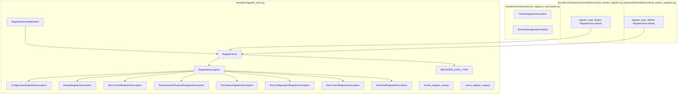
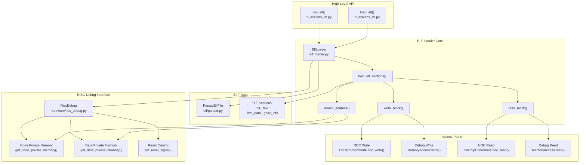
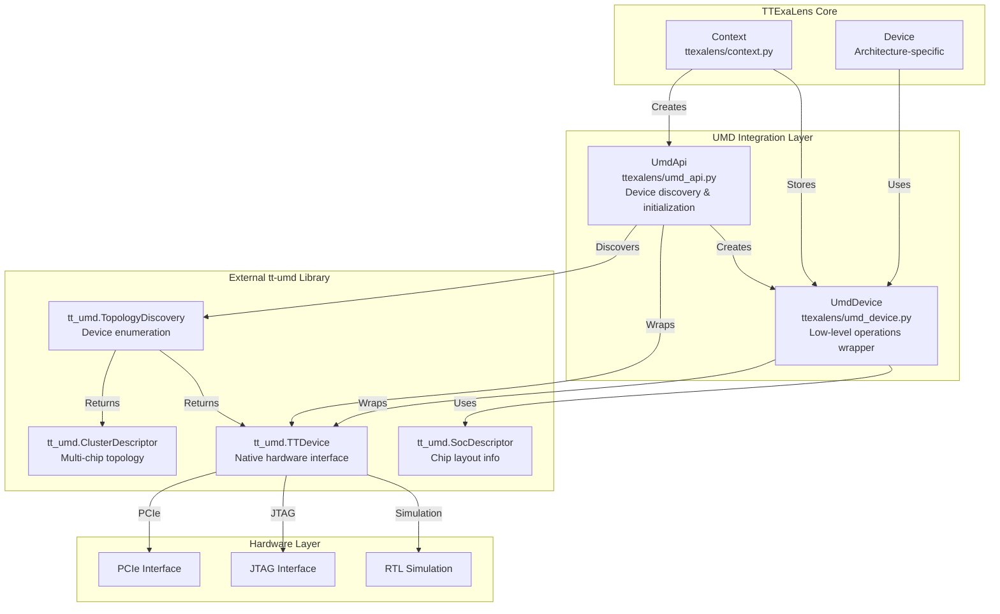
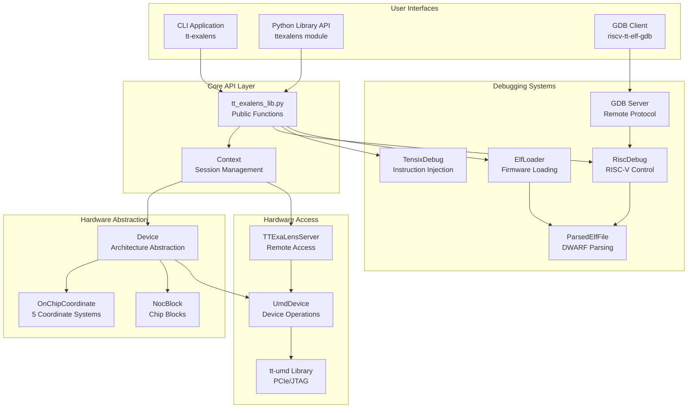

# GDB Server Integration

Relevant source files
*   [.gitignore](https://github.com/tenstorrent/tt-exalens/blob/046c35eb/.gitignore)
*   [CMakeLists.txt](https://github.com/tenstorrent/tt-exalens/blob/046c35eb/CMakeLists.txt)
*   [cmake/sfpi_release.cmake](https://github.com/tenstorrent/tt-exalens/blob/046c35eb/cmake/sfpi_release.cmake)
*   [docs/gdb.md](https://github.com/tenstorrent/tt-exalens/blob/046c35eb/docs/gdb.md?plain=1)
*   [riscv-src/CMakeLists.txt](https://github.com/tenstorrent/tt-exalens/blob/046c35eb/riscv-src/CMakeLists.txt)
*   [test/ttexalens/unit_tests/test_ttexalens_init.py](https://github.com/tenstorrent/tt-exalens/blob/046c35eb/test/ttexalens/unit_tests/test_ttexalens_init.py)
*   [ttexalens/cli.py](https://github.com/tenstorrent/tt-exalens/blob/046c35eb/ttexalens/cli.py)
*   [ttexalens/cli_commands/gdb.py](https://github.com/tenstorrent/tt-exalens/blob/046c35eb/ttexalens/cli_commands/gdb.py)
*   [ttexalens/gdb/gdb_client.py](https://github.com/tenstorrent/tt-exalens/blob/046c35eb/ttexalens/gdb/gdb_client.py)
*   [ttexalens/gdb/gdb_communication.py](https://github.com/tenstorrent/tt-exalens/blob/046c35eb/ttexalens/gdb/gdb_communication.py)
*   [ttexalens/gdb/gdb_server.py](https://github.com/tenstorrent/tt-exalens/blob/046c35eb/ttexalens/gdb/gdb_server.py)
*   [ttexalens/uistate.py](https://github.com/tenstorrent/tt-exalens/blob/046c35eb/ttexalens/uistate.py)

## Purpose and Scope

This page documents the GDB remote serial protocol (RSP) server built into TTExaLens. It covers the `GdbServer` class, the communication layer classes (`ServerSocket`, `ClientSocket`, `GdbInputStream`, `GdbMessageParser`, `GdbMessageWriter`), the data structures (`GdbProcess`, `GdbThreadId`), and the process model that exposes RISC-V cores as GDB-debuggable processes.

For RISC-V core control primitives (halt, step, continue, watchpoints) that this server builds on, see [RISC-V Debugging System](https://deepwiki.com/tenstorrent/tt-exalens/6-risc-v-debugging-system). For callstack unwinding driven via GDB, see [Callstack Unwinding](https://deepwiki.com/tenstorrent/tt-exalens/7.5-callstack-unwinding). For the CLI command that launches the server, see [CLI Modes and Navigation](https://deepwiki.com/tenstorrent/tt-exalens/4.1-cli-modes-and-navigation).

* * *




Sources: [ttexalens/register_store.py:1-20](), [ttexalens/hardware/tensix_registers_description.py](), [ttexalens/hardware/wormhole/functional_worker_registers.py:1-15](), [ttexalens/hardware/blackhole/functional_worker_registers.py:1-15]()

---
```
## Architecture Overview

The GDB server implements the [GDB Remote Serial Protocol (RSP)](https://sourceware.org/gdb/current/onlinedocs/gdb.html/Remote-Protocol.html) over TCP. Each non-reset RISC-V core on all connected devices is exposed as a separate GDB process using GDB's multiprocess extension. A single GDB client in `extended-remote` mode can attach to and debug multiple cores simultaneously.

The implementation lives in four files:

| File | Responsibility |
| --- | --- |
| `ttexalens/gdb/gdb_communication.py` | TCP socket wrappers, RSP packet framing, checksum, parsing |
| `ttexalens/gdb/gdb_data.py` | `GdbProcess` and `GdbThreadId` data structures |
| `ttexalens/gdb/gdb_server.py` | Server loop, RSP message dispatch, process management |
| `ttexalens/gdb/gdb_client.py` | Client-side utilities: scripted callstack extraction |

Sources: [ttexalens/gdb/gdb_server.py 1-25](https://github.com/tenstorrent/tt-exalens/blob/046c35eb/ttexalens/gdb/gdb_server.py#L1-L25)[ttexalens/gdb/gdb_communication.py 1-20](https://github.com/tenstorrent/tt-exalens/blob/046c35eb/ttexalens/gdb/gdb_communication.py#L1-L20)[ttexalens/gdb/gdb_data.py 1-10](https://github.com/tenstorrent/tt-exalens/blob/046c35eb/ttexalens/gdb/gdb_data.py#L1-L10)[ttexalens/gdb/gdb_client.py 1-15](https://github.com/tenstorrent/tt-exalens/blob/046c35eb/ttexalens/gdb/gdb_client.py#L1-L15)

* * *

**Diagram: GDB subsystem component relationships (file and class names)**

Sources: [ttexalens/gdb/gdb_server.py 55-93](https://github.com/tenstorrent/tt-exalens/blob/046c35eb/ttexalens/gdb/gdb_server.py#L55-L93)[ttexalens/gdb/gdb_communication.py 34-108](https://github.com/tenstorrent/tt-exalens/blob/046c35eb/ttexalens/gdb/gdb_communication.py#L34-L108)[ttexalens/gdb/gdb_data.py 10-42](https://github.com/tenstorrent/tt-exalens/blob/046c35eb/ttexalens/gdb/gdb_data.py#L10-L42)

* * *










This architecture enables:
- **Multiple interfaces** (CLI, API, GDB) sharing common implementation
- **Clean abstraction layers** from user interface down to hardware
- **Flexible deployment** (local or remote access)
- **Platform independence** through Device abstraction
- **Comprehensive debugging** via multiple subsystems
```
## Data Structures

### `GdbThreadId`

Defined in [ttexalens/gdb/gdb_data.py 11-16](https://github.com/tenstorrent/tt-exalens/blob/046c35eb/ttexalens/gdb/gdb_data.py#L11-L16)

```
GdbThreadId
  process_id: int
  thread_id:  int
```

Represents a GDB multiprocess thread identifier in the `pPID.TID` format. The `to_gdb_string()` method produces the hex-encoded string used in RSP messages (e.g. `p1.1`).

In TTExaLens's model, each `GdbProcess` has exactly one thread, so `thread_id` equals `virtual_core_id`.

### `GdbProcess`

Defined in [ttexalens/gdb/gdb_data.py 19-41](https://github.com/tenstorrent/tt-exalens/blob/046c35eb/ttexalens/gdb/gdb_data.py#L19-L41)

```
GdbProcess
  process_id:     int           — sequential integer assigned by GdbServer.next_pid
  elf_path:       str | None    — path to ELF running on this core, if known
  risc_debug:     RiscDebug     — hardware debug interface for this core
  virtual_core_id: int          — mirrors process_id; used as thread_id
  core_type:      str           — e.g. "worker", "dram", "eth"
  mem_access:     MemoryAccess  — created via MemoryAccess.create(risc_debug)
  thread_id:      GdbThreadId   — cached property
```

`mem_access` is initialized in `__post_init__` via `MemoryAccess.create(self.risc_debug)` and is the path for all GDB memory reads/writes to the core.

* * *

## Communication Layer

All classes are in `ttexalens/gdb/gdb_communication.py`.

### `ServerSocket`

[ttexalens/gdb/gdb_communication.py 75-106](https://github.com/tenstorrent/tt-exalens/blob/046c35eb/ttexalens/gdb/gdb_communication.py#L75-L106)

Wraps a Python `socket.socket` in server mode. Key methods:

| Method | Description |
| --- | --- |
| `start()` | Binds and begins listening. If `port=None`, `find_available_port()` picks a free OS port. |
| `accept(timeout)` | Blocks up to `timeout` seconds for a connection; returns a `ClientSocket` or `None`. |
| `close()` | Closes the server socket. |

### `ClientSocket`

[ttexalens/gdb/gdb_communication.py 34-71](https://github.com/tenstorrent/tt-exalens/blob/046c35eb/ttexalens/gdb/gdb_communication.py#L34-L71)

Wraps a connected `socket.socket`. Provides `read()`, `write(data)`, `peek()`, `input_ready(timeout)`, and `close()`. Carries a `packet_size` (default 2048) used by `GdbMessageWriter` to size paged responses.

### `GdbInputStream`

[ttexalens/gdb/gdb_communication.py 121-218](https://github.com/tenstorrent/tt-exalens/blob/046c35eb/ttexalens/gdb/gdb_communication.py#L121-L218)

Reads raw bytes from a `ClientSocket` and produces `GdbMessageParser` objects. It handles:

*   ACK (`+`) and NACK (`-`) detection
*   RSP packet framing: `$<data>#<checksum>`
*   Escape sequences (XOR with `0x20`)
*   Checksum verification; sends `+` or `-` to the client accordingly

`read()` returns a `GdbMessageParser` for each complete message or `None` on connection close.

### `GdbMessageParser`

[ttexalens/gdb/gdb_communication.py 221-330](https://github.com/tenstorrent/tt-exalens/blob/046c35eb/ttexalens/gdb/gdb_communication.py#L221-L330)

A cursor-based parser for the payload of a single RSP message. Key methods:

| Method | Description |
| --- | --- |
| `parse(value: bytes)` | Matches and advances if the next bytes equal `value`. |
| `parse_hex()` | Reads a variable-length hex integer. |
| `read_hex(length)` | Reads exactly `length` hex digits. |
| `read_register_hex()` | Reads 8 hex digits in little-endian byte order (used for RISC-V registers). |
| `parse_thread_id()` | Parses `pPID.TID` or bare hex, returning a `GdbThreadId`. |
| `read_char()` | Reads one byte as an integer. |
| `read_until(char)` | Reads until a delimiter byte. |
| `read_rest()` | Returns the remaining bytes. |

### `GdbMessageWriter`

[ttexalens/gdb/gdb_communication.py 333-425](https://github.com/tenstorrent/tt-exalens/blob/046c35eb/ttexalens/gdb/gdb_communication.py#L333-L425)

Builds a single RSP message in a `bytearray`, computing a running checksum. `send()` appends `#<checksum>` and writes to the `ClientSocket`. Key methods:

| Method | Description |
| --- | --- |
| `append(data: bytes)` | Appends bytes with RSP escape encoding. |
| `append_hex(number, min_digits)` | Appends a hex-encoded integer. |
| `append_register_hex(value)` | Appends 32-bit register value in little-endian hex. |
| `append_string_as_hex(value)` | Appends each character as a two-digit hex byte (used for `qThreadExtraInfo`). |
| `append_thread_id(thread_id)` | Appends `pPID.TID` in hex. |
| `send()` | Finalizes and transmits the message. |
| `clear()` | Resets for the next message. |

* * *

## GdbServer

`GdbServer` is defined in [ttexalens/gdb/gdb_server.py 55-93](https://github.com/tenstorrent/tt-exalens/blob/046c35eb/ttexalens/gdb/gdb_server.py#L55-L93) and extends `threading.Thread`. It runs as a daemon thread.

### Constructor Parameters

| Parameter | Type | Description |
| --- | --- | --- |
| `context` | `Context` | TTExaLens context providing access to all devices |
| `server` | `ServerSocket` | Pre-started server socket |
| `error_stream` | `IO[str] | None` | Optional stream for error output |

Key instance state:

| Attribute | Description |
| --- | --- |
| `current_process` | The `GdbProcess` selected via `H` packet (target for `g`, `m`, etc.) |
| `debugging_threads` | `dict[int, GdbThreadId]` — processes currently attached (via `vAttach`) |
| `next_pid` | Monotonically increasing counter for assigning process IDs |
| `_last_available_processes` | `dict[RiscLocation, GdbProcess]` — cache for process ID reuse |
| `should_ack` | Whether to send `+` ACKs (disabled by `QStartNoAckMode`) |
| `vCont_pending_statuses` | Queue of stop-reply strings when multiple cores halt simultaneously |
| `file_server` | `GdbFileServer` for remote file operations |
| `paged_thread_list` | `GdbThreadListPaged` for `qfThreadInfo`/`qsThreadInfo` |
| `prepared_responses_for_paging` | Pre-built strings for `qXfer` responses |

### Server Run Loop

[ttexalens/gdb/gdb_server.py 143-160](https://github.com/tenstorrent/tt-exalens/blob/046c35eb/ttexalens/gdb/gdb_server.py#L143-L160)

`run()` loops until `stop_event` is set, calling `server.accept(0.5)` with a 0.5-second timeout. On each accepted connection:

1.   Sets `is_connected = True` and calls `on_connected()` if set.
2.   Calls `process_client(client)`.
3.   On disconnect, calls `on_disconnected()` and `file_server.close_all()`.

### Message Processing

[ttexalens/gdb/gdb_server.py 162-188](https://github.com/tenstorrent/tt-exalens/blob/046c35eb/ttexalens/gdb/gdb_server.py#L162-L188)

`process_client()` drives a read loop: `GdbInputStream.read()` → `process_message()` → `GdbMessageWriter.send()`. If `should_ack` is `True`, a `+` is written before the response.

`process_message()` dispatches on the message prefix using sequential `parser.parse()` calls. Unknown messages return an empty response (per RSP spec).

* * *

## Process Discovery: `available_processes`

[ttexalens/gdb/gdb_server.py 95-130](https://github.com/tenstorrent/tt-exalens/blob/046c35eb/ttexalens/gdb/gdb_server.py#L95-L130)

This is a computed property that is evaluated fresh on each access. It:

1.   Iterates over all `context.device_ids`.
2.   For each device, iterates over `device.debuggable_cores` (all non-abstract RISC-V cores).
3.   Skips cores where `risc_debug.is_in_reset()` returns `True`.
4.   Looks up the ELF path via `context.get_risc_elf_path(risc_debug.risc_location)`.
5.   Checks `_last_available_processes` for the same `RiscLocation`; if the ELF path matches, **reuses the existing `GdbProcess`** (preserving the process ID). Otherwise creates a new `GdbProcess` with `next_pid`.

This means process IDs remain stable as long as a core stays out of reset and runs the same ELF.

* * *

**Diagram: RISC-V core → GdbProcess mapping**

Sources: [ttexalens/gdb/gdb_server.py 95-130](https://github.com/tenstorrent/tt-exalens/blob/046c35eb/ttexalens/gdb/gdb_server.py#L95-L130)[ttexalens/gdb/gdb_data.py 19-42](https://github.com/tenstorrent/tt-exalens/blob/046c35eb/ttexalens/gdb/gdb_data.py#L19-L42)

* * *

## Supported RSP Packets

**Diagram: RSP session lifecycle with method names**

Sources: [ttexalens/gdb/gdb_server.py 190-780](https://github.com/tenstorrent/tt-exalens/blob/046c35eb/ttexalens/gdb/gdb_server.py#L190-L780)

### Packet Reference

| Packet | Description | Implementation Notes |
| --- | --- | --- |
| `!` | Enable extended mode | Always returns `OK` |
| `?` | Query halt reason | Returns `W00` if `current_process` is `None`, else `S05` |
| `g` | Read all GPRs (0–32) | PC (reg 32) rewound by 4 if `is_ebreak_hit`. Uses `read_gpr()` |
| `G XX...` | Write all GPRs | `xxxxxxxx` pattern skips a register. Uses `write_gpr()` |
| `p n` | Read single GPR `n` | Direct call to `read_gpr(n)` |
| `P n=r` | Write single GPR `n` | Direct call to `write_gpr(n, value)` |
| `m addr,len` | Read `len` bytes at `addr` | Uses `mem_access.read()`, returns `E04` on `RestrictedMemoryAccessError` |
| `M addr,len:XX...` | Write `len` bytes at `addr` | Uses `mem_access.write()`, returns `E04` on `RestrictedMemoryAccessError` |
| `H op thread-id` | Set current thread for ops | Updates `current_process` from `available_processes` |
| `T thread-id` | Check thread is alive | Checks if `thread-id.process_id` is in `available_processes` |
| `D;pid` | Detach from process | Iterates watchpoints, calls `disable_watchpoint()`, calls `cont()` if halted |
| `D` | Detach from all processes | Same as above for all processes in `debugging_threads` |
| `vAttach;pid` | Attach to process | Calls `halt()`, adds to `debugging_threads`, returns `T00` stop-reply |
| `vCont?` | Query supported actions | Returns `vCont;c;C;s;S;t` (continue, step, stop) |
| `vCont;action[:tid]...` | Multi-thread continue/step/stop | See [vCont Operations](https://github.com/tenstorrent/tt-exalens/blob/046c35eb/vCont%20Operations) section |
| `Z0,addr,kind` | Insert software breakpoint | Maps to `enable_watchpoint(PC_MATCH)` |
| `z0,addr,kind` | Remove software breakpoint | Maps to `disable_watchpoint()` |
| `Z2,addr,kind` | Insert write watchpoint | Maps to `enable_watchpoint(WRITE)` |
| `z2,addr,kind` | Remove write watchpoint | Maps to `disable_watchpoint()` |
| `Z3,addr,kind` | Insert read watchpoint | Maps to `enable_watchpoint(READ)` |
| `z3,addr,kind` | Remove read watchpoint | Maps to `disable_watchpoint()` |
| `Z4,addr,kind` | Insert access watchpoint | Maps to `enable_watchpoint(READ_WRITE)` |
| `z4,addr,kind` | Remove access watchpoint | Maps to `disable_watchpoint()` |
| `qSupported` | Feature negotiation | Advertises `multiprocess+`, `swbreak+`, `QStartNoAckMode+`, `qXfer` types |
| `QStartNoAckMode` | Disable `+`/`-` ACKs | Sets `should_ack = False` |
| `qfThreadInfo` | Start paged thread list | Creates `GdbThreadListPaged` from `debugging_threads` |
| `qsThreadInfo` | Continue paged thread list | Continues paging via `GdbThreadListPaged.next()` |
| `qC` | Return current thread ID | Returns `current_process.thread_id` |
| `qAttached` | Report attach mode | Always returns `1` (attached to existing process) |
| `qThreadExtraInfo,tid` | Thread description | Returns `"Runnable"` encoded as hex string |
| `qXfer:osdata:read::` | List OS data types | Calls `create_osdata_types_response()` |
| `qXfer:osdata:read::processes` | List debuggable processes | Calls `create_osdata_processes_response()`, returns XML |
| `qXfer:features:read:target.xml` | Target register description | Calls `create_features_target_response()`, returns RISC-V feature XML |
| `qXfer:exec-file:read:pid` | ELF path for process | Returns `available_processes[pid].elf_path` |
| `qTStatus` | Trace experiment status | Returns empty (not supported) |
| `qSymbol` | Symbol lookup | Returns empty (not needed) |
| `qOffsets` | Section offsets | Returns empty (ELF addresses are absolute) |
| `vMustReplyEmpty` | Protocol probe | Returns empty |

Sources: [ttexalens/gdb/gdb_server.py 206-780](https://github.com/tenstorrent/tt-exalens/blob/046c35eb/ttexalens/gdb/gdb_server.py#L206-L780)

* * *

## vCont Operations

[ttexalens/gdb/gdb_server.py 637-765](https://github.com/tenstorrent/tt-exalens/blob/046c35eb/ttexalens/gdb/gdb_server.py#L637-L765)

The `vCont` (vector continue) packet allows the GDB client to specify different actions for multiple threads simultaneously. This is the primary mechanism for multiprocess debugging.

### Supported Actions

| Action | Description | RiscDebug Call |
| --- | --- | --- |
| `c` | Continue | `risc_debug.cont()` |
| `C sig` | Continue with signal | `risc_debug.cont()` (signal ignored) |
| `s` | Single step | `risc_debug.step()` |
| `S sig` | Step with signal | `risc_debug.step()` (signal ignored) |
| `t` | Stop | `risc_debug.halt()` |

### Action Parsing

The packet format is `vCont;action[:thread-id];action[:thread-id]...`. The implementation:

1.   Parses each `;action[:thread-id]` clause
2.   If no `thread-id` is specified, the action applies to all threads in `debugging_threads`
3.   Otherwise, the action applies to the specific thread
4.   Actions are stored in `thread_actions: dict[int, str | None]` (keyed by PID)

### Execution and Status Reporting

After parsing, the server:

1.   Applies actions to each thread's `RiscDebug` instance
2.   Waits for all threads to complete (up to a timeout)
3.   Collects status from each thread via `read_status()`
4.   Builds stop-reply packets (e.g., `T05;thread:p1.1;`)
5.   Returns **one** stop-reply immediately
6.   Stores remaining replies in `vCont_pending_statuses` (in **reverse order** for efficient popping)

On the next `vCont` invocation, if `vCont_pending_statuses` is non-empty, the server immediately returns the next queued status without executing any actions.

### Stop Signal Codes

| Signal | Meaning | Condition |
| --- | --- | --- |
| `T05` | `SIGTRAP` | Breakpoint hit, watchpoint triggered, or step completed |
| `T02` | `SIGINT` | User requested halt (`t` action) |

Sources: [ttexalens/gdb/gdb_server.py 637-765](https://github.com/tenstorrent/tt-exalens/blob/046c35eb/ttexalens/gdb/gdb_server.py#L637-L765)[ttexalens/gdb/gdb_server.py 79-83](https://github.com/tenstorrent/tt-exalens/blob/046c35eb/ttexalens/gdb/gdb_server.py#L79-L83)

* * *

## Watchpoints and Breakpoints

[ttexalens/gdb/gdb_server.py 766-858](https://github.com/tenstorrent/tt-exalens/blob/046c35eb/ttexalens/gdb/gdb_server.py#L766-L858)

GDB breakpoints and watchpoints map directly to the hardware watchpoint system provided by `RiscDebug`. The GDB `Z`/`z` packets insert/remove watchpoints:

| GDB Packet | Watchpoint Type | RiscDebug Call |
| --- | --- | --- |
| `Z0,addr,kind` | Software breakpoint (PC match) | `enable_watchpoint(bid, PC_MATCH, addr)` |
| `Z2,addr,kind` | Write watchpoint | `enable_watchpoint(bid, WRITE, addr)` |
| `Z3,addr,kind` | Read watchpoint | `enable_watchpoint(bid, READ, addr)` |
| `Z4,addr,kind` | Access watchpoint (read or write) | `enable_watchpoint(bid, READ_WRITE, addr)` |
| `z0/z2/z3/z4` | Remove watchpoint | `disable_watchpoint(bid)` |

The server tracks which watchpoint IDs are in use and allocates the first available ID for new watchpoints. When a watchpoint triggers, the core halts and the next `vCont` or status query returns a `T05` stop-reply.

**Diagram: Watchpoint data flow**

Sources: [ttexalens/gdb/gdb_server.py 766-858](https://github.com/tenstorrent/tt-exalens/blob/046c35eb/ttexalens/gdb/gdb_server.py#L766-L858)[ttexalens/hardware/risc_debug.py 300-450](https://github.com/tenstorrent/tt-exalens/blob/046c35eb/ttexalens/hardware/risc_debug.py#L300-L450)

* * *

## Memory Access and Restrictions

Memory reads (`m`) and writes (`M`) go through `GdbProcess.mem_access`, which is a `MemoryAccess` instance created from the core's `RiscDebug`. If the requested address range falls outside safe-to-access memory (e.g., past L1 boundaries), `MemoryAccess.read()`/`write()` raises `RestrictedMemoryAccessError`. The server catches this and returns `E04` to the GDB client.

[ttexalens/gdb/gdb_server.py 363-416](https://github.com/tenstorrent/tt-exalens/blob/046c35eb/ttexalens/gdb/gdb_server.py#L363-L416)

From the GDB client's perspective, `E04` surfaces as `"Cannot access memory at address"` or `"Remote failure reply: E04"`.

**L1 boundaries enforced:**

| Architecture | L1 range |
| --- | --- |
| Wormhole | `<FileRef file-url="https://github.com/tenstorrent/tt-exalens/blob/046c35eb/0x00000000, 0x0016E000)` |

### `GdbThreadListPaged`

[ttexalens/gdb/gdb_server.py 27-50](https://github.com/tenstorrent/tt-exalens/blob/046c35eb/ttexalens/gdb/gdb_server.py#L27-L50)

A helper class that holds a snapshot of `debugging_threads` and serves it in pages. `next(writer, max_length)` appends thread IDs to the writer, tracking how many have been returned. Returns `l` (last) when the list is exhausted or `m<list>` for intermediate pages. Used for `qfThreadInfo`/`qsThreadInfo`.

* * *

## Starting and Stopping the GDB Server

### Via the CLI

[ttexalens/cli_commands/gdb.py 1-50](https://github.com/tenstorrent/tt-exalens/blob/046c35eb/ttexalens/cli_commands/gdb.py#L1-L50)

```
gdb start [<port>]    # Start on a specific port, or let OS choose one
gdb stop              # Stop the running server
```

The `gdb` command delegates to `UIState.start_gdb(port)` / `UIState.stop_gdb()`. The server can also be started at launch with the `--start-gdb=<port>` flag.

### Programmatically

The `GdbServer` thread is a daemon thread, so it will not block process exit.

Sources: [ttexalens/gdb/gdb_server.py 55-68](https://github.com/tenstorrent/tt-exalens/blob/046c35eb/ttexalens/gdb/gdb_server.py#L55-L68)[ttexalens/gdb/gdb_server.py 135-160](https://github.com/tenstorrent/tt-exalens/blob/046c35eb/ttexalens/gdb/gdb_server.py#L135-L160)[ttexalens/gdb/gdb_communication.py 75-106](https://github.com/tenstorrent/tt-exalens/blob/046c35eb/ttexalens/gdb/gdb_communication.py#L75-L106)[ttexalens/cli_commands/gdb.py 33-50](https://github.com/tenstorrent/tt-exalens/blob/046c35eb/ttexalens/cli_commands/gdb.py#L33-L50)

* * *

## GDB Client Binary

The expected GDB client is `riscv-tt-elf-gdb`, part of the SFPI toolchain downloaded during the build. `get_gdb_client_path()` in `ttexalens/gdb/gdb_client.py` searches for it at:

1.   `<application_path>/sfpi/compiler/bin/riscv-tt-elf-gdb`
2.   `<application_path>/../build/sfpi/compiler/bin/riscv-tt-elf-gdb`

The binary can also be invoked via `tt-exalens --gdb`.

Sources: [ttexalens/gdb/gdb_client.py 16-21](https://github.com/tenstorrent/tt-exalens/blob/046c35eb/ttexalens/gdb/gdb_client.py#L16-L21)[docs/gdb.md 18-21](https://github.com/tenstorrent/tt-exalens/blob/046c35eb/docs/gdb.md?plain=1#L18-L21)

* * *

## GDB Client Utilities (`gdb_client.py`)

[ttexalens/gdb/gdb_client.py 1-180](https://github.com/tenstorrent/tt-exalens/blob/046c35eb/ttexalens/gdb/gdb_client.py#L1-L180)

These functions are used internally by TTExaLens to extract callstacks via GDB rather than DWARF-only unwinding (see [Callstack Unwinding](https://deepwiki.com/tenstorrent/tt-exalens/7.5-callstack-unwinding)):

| Function | Description |
| --- | --- |
| `get_gdb_client_path()` | Returns path to `riscv-tt-elf-gdb` binary |
| `get_process_ids(gdb_server)` | Maps `OnChipCoordinate` + `risc_name` → PID using `gdb_server.available_processes` |
| `make_gdb_script_for_callstack(pid, elf_paths, offsets, port, ...)` | Generates a GDB command script: connects, attaches, loads symbols, runs `backtrace` |
| `get_gdb_callstack(location, risc_name, elf_paths, offsets, ...)` | Spawns a GDB subprocess, runs the script, returns `list[CallstackEntry]` |
| `extract_callstack_from_gdb_output(output, start_label, end_label)` | Parses GDB `backtrace` text output into `CallstackEntry` objects |
| `get_callstack_entry(line)` | Parses a single `#N 0xADDR in func at file:line` string |

`get_gdb_callstack()` optionally accepts an already-running `GdbServer`. If none is provided, it creates a temporary one, uses it, and shuts it down.

Sources: [ttexalens/gdb/gdb_client.py 16-180](https://github.com/tenstorrent/tt-exalens/blob/046c35eb/ttexalens/gdb/gdb_client.py#L16-L180)

* * *

## Usage Example

After starting the GDB server (e.g., `gdb start 6767` in the TTExaLens CLI):

```
# Connect in extended-remote mode
target extended-remote localhost:6767

# List available RISC-V cores as processes
info os processes

# Attach to BRISC on core 0,0 (pid from info os processes)
attach 1

# Load ELF symbols (with optional load address offset)
add-symbol-file build/riscv-src/wormhole/sample.brisc.elf

# Display call stack
bt

# Set a breakpoint at a function
break decrement_mailbox

# Resume execution
continue

# Inspect a variable
print/x g_MAILBOX

# Set a memory watchpoint
watch g_TESTBYTEACCESS.bytes[3]
```

Sources: [docs/gdb.md 1-99](https://github.com/tenstorrent/tt-exalens/blob/046c35eb/docs/gdb.md?plain=1#L1-L99)

Dismiss
Refresh this wiki

Enter email to refresh
