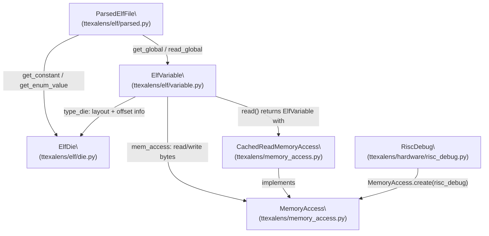
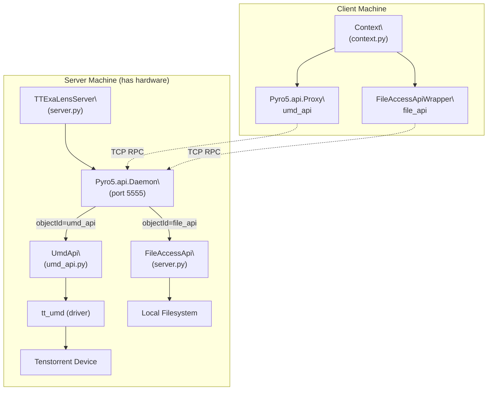
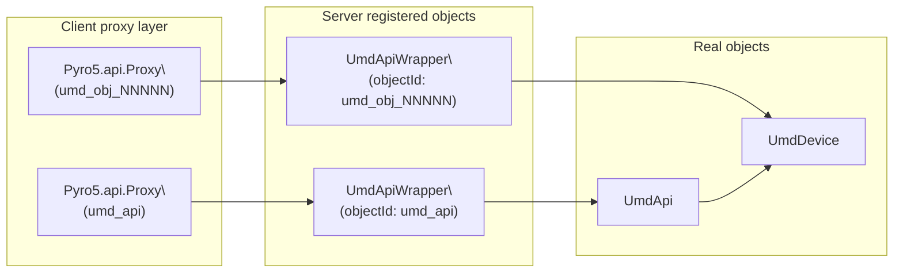

# Remote Device Access

Relevant source files
*   [VERSION](https://github.com/tenstorrent/tt-exalens/blob/046c35eb/VERSION)
*   [test/app/test_umd_ttexalens.py](https://github.com/tenstorrent/tt-exalens/blob/046c35eb/test/app/test_umd_ttexalens.py)
*   [test/ttexalens/unit_tests/program_writer.py](https://github.com/tenstorrent/tt-exalens/blob/046c35eb/test/ttexalens/unit_tests/program_writer.py)
*   [test/ttexalens/unit_tests/test_base.py](https://github.com/tenstorrent/tt-exalens/blob/046c35eb/test/ttexalens/unit_tests/test_base.py)
*   [test/ttexalens/unit_tests/test_l1_mem_access.py](https://github.com/tenstorrent/tt-exalens/blob/046c35eb/test/ttexalens/unit_tests/test_l1_mem_access.py)
*   [test/ttexalens/unit_tests/test_noc_failover.py](https://github.com/tenstorrent/tt-exalens/blob/046c35eb/test/ttexalens/unit_tests/test_noc_failover.py)
*   [test/ttexalens/unit_tests/test_remote_communication.py](https://github.com/tenstorrent/tt-exalens/blob/046c35eb/test/ttexalens/unit_tests/test_remote_communication.py)
*   [ttexalens/cli_commands/interfaces.py](https://github.com/tenstorrent/tt-exalens/blob/046c35eb/ttexalens/cli_commands/interfaces.py)
*   [ttexalens/context.py](https://github.com/tenstorrent/tt-exalens/blob/046c35eb/ttexalens/context.py)
*   [ttexalens/requirements.txt](https://github.com/tenstorrent/tt-exalens/blob/046c35eb/ttexalens/requirements.txt)
*   [ttexalens/server.py](https://github.com/tenstorrent/tt-exalens/blob/046c35eb/ttexalens/server.py)
*   [ttexalens/tt_exalens_init.py](https://github.com/tenstorrent/tt-exalens/blob/046c35eb/ttexalens/tt_exalens_init.py)
*   [ttexalens/umd_api.py](https://github.com/tenstorrent/tt-exalens/blob/046c35eb/ttexalens/umd_api.py)
*   [ttexalens/umd_device.py](https://github.com/tenstorrent/tt-exalens/blob/046c35eb/ttexalens/umd_device.py)

This page documents the TTExaLens remote access system: how a server exposes hardware device APIs over the network using Pyro5 RPC, and how clients connect to interact with hardware on a remote machine. This covers `TTExaLensServer`, `FileAccessApi`, `start_server`, `connect_to_server`, and the CLI modes that invoke them.

For the underlying hardware access layer (`UmdApi`, `UmdDevice`) that the server wraps, see [UMD Integration Layer](https://deepwiki.com/tenstorrent/tt-exalens/5.6-umd-integration-layer). For context initialization using a remote connection, see [Context and Initialization](https://deepwiki.com/tenstorrent/tt-exalens/3.1-context-and-initialization).

* * *

## Overview

TTExaLens supports a client/server topology in which a server process runs on a machine with physical access to Tenstorrent hardware, and one or more clients connect over the network. The server exposes two APIs:

| API | Object ID | Purpose |
| --- | --- | --- |
| `UmdApi` | `umd_api` | NOC reads/writes, device enumeration, ARC messaging |
| `FileAccessApi` | `file_api` | Reading ELF and other files on the server's filesystem |

Both are served over a single Pyro5 daemon bound to a configurable TCP port (default: `5555`). The client receives transparent proxy objects that behave like local instances.

**Remote access system diagram:**

Sources: [ttexalens/server.py 41-80](https://github.com/tenstorrent/tt-exalens/blob/046c35eb/ttexalens/server.py#L41-L80)[ttexalens/umd_api.py 44-146](https://github.com/tenstorrent/tt-exalens/blob/046c35eb/ttexalens/umd_api.py#L44-L146)[ttexalens/cli.py 7-43](https://github.com/tenstorrent/tt-exalens/blob/046c35eb/ttexalens/cli.py#L7-L43)

* * *




Sources: [ttexalens/elf/variable.py:1-25](), [ttexalens/elf/parsed.py:1-30](), [ttexalens/elf/__init__.py:1-21]()

---
```




Sources: [ttexalens/server.py:41-80](), [ttexalens/umd_api.py:44-146](), [ttexalens/cli.py:7-43]()

---
```
## TTExaLensServer

`TTExaLensServer`[ttexalens/server.py 41-79](https://github.com/tenstorrent/tt-exalens/blob/046c35eb/ttexalens/server.py#L41-L79) manages the Pyro5 daemon lifetime and object registration.

### Constructor

```
TTExaLensServer(port: int, umd_api: UmdApi, file_api: FileAccessApi)
```

Called by `start_server()`, which reads these from the active `Context`.

### Lifecycle methods

| Method | Behavior |
| --- | --- |
| `start()` | Creates a `Pyro5.api.Daemon`, registers wrapped `UmdApi` as `"umd_api"`, registers `FileAccessApi` as `"file_api"`, and launches the request loop in a daemon thread |
| `stop()` | Unregisters all objects, calls `daemon.shutdown()`, joins the thread |

### Dynamic object wrapping (`_wrap_object`)

`UmdApi` returns complex UMD objects (e.g., `UmdDevice`, `SocDescriptor`) from some of its methods. These cannot be trivially serialized by Pyro5. `TTExaLensServer._wrap_object()`[ttexalens/server.py 81-144](https://github.com/tenstorrent/tt-exalens/blob/046c35eb/ttexalens/server.py#L81-L144) handles this by:

1.   Generating an `UmdApiWrapper` class at runtime for the given object.
2.   Wrapping each public method so that the return value is inspected: 
    *   **Primitive types** (`int`, `float`, `str`, `bool`, `None`, `list`, `dict`, `set`, `tuple`, `bytes`): returned directly.
    *   **Known serializable UMD types** (see `UMD_SERIALIZABLE_TYPES` below): returned directly via registered serializers.
    *   **All other types**: registered as a new Pyro5 object with ID `umd_obj_{object_id}`, and a proxy to it is returned to the caller.

This allows the client to call methods on returned objects (e.g., a `UmdDevice` returned by `get_device()`) as if they were local.

Sources: [ttexalens/server.py 81-144](https://github.com/tenstorrent/tt-exalens/blob/046c35eb/ttexalens/server.py#L81-L144)[ttexalens/server.py 147-160](https://github.com/tenstorrent/tt-exalens/blob/046c35eb/ttexalens/server.py#L147-L160)

* * *

## Serializable UMD Types

The following `tt_umd` types have custom `serpent` serializers registered via `umd_type_to_dict` / `umd_type_from_dict`[ttexalens/server.py 163-230](https://github.com/tenstorrent/tt-exalens/blob/046c35eb/ttexalens/server.py#L163-L230):

| Type | Fields serialized |
| --- | --- |
| `tt_umd.ARCH` | `value` (enum name) |
| `tt_umd.BoardType` | `value` |
| `tt_umd.IODeviceType` | `value` |
| `tt_umd.CoreType` | `value` |
| `tt_umd.CoordSystem` | `value` |
| `tt_umd.tt_xy_pair` | `x`, `y` |
| `tt_umd.CoreCoord` | `x`, `y`, `core_type`, `coord_system` |
| `tt_umd.SemVer` | `major`, `minor`, `patch` |
| `tt_umd.FirmwareBundleVersion` | `major`, `minor`, `patch` |
| `tt_umd.TelemetryTag` | `value` |
| `tt_umd.DramTrainingStatus` | `value` |

The global config `Pyro5.configure.global_config.SERPENT_BYTES_REPR = True` ensures `bytes` objects are transmitted correctly [ttexalens/server.py 231](https://github.com/tenstorrent/tt-exalens/blob/046c35eb/ttexalens/server.py#L231-L231)

Sources: [ttexalens/server.py 147-231](https://github.com/tenstorrent/tt-exalens/blob/046c35eb/ttexalens/server.py#L147-L231)

* * *

## FileAccessApi

`FileAccessApi`[ttexalens/server.py 23-38](https://github.com/tenstorrent/tt-exalens/blob/046c35eb/ttexalens/server.py#L23-L38) is a simple Pyro5-exposed class that reads files from the **server's** local filesystem and returns their contents to the client. This lets a remote client load ELF files stored on the machine with hardware access.

| Method | Signature | Returns |
| --- | --- | --- |
| `get_file` | `(file_path: str) -> str` | Full text content of the file |
| `get_binary` | `(binary_path: str) -> io.BufferedIOBase` | Open binary file handle |
| `get_binary_content` | `(binary_path: str) -> bytes` | Raw bytes (used for remote transport) |

Because `io.BufferedIOBase` streams are not serializable over Pyro5, the client side uses `FileAccessApiWrapper`[ttexalens/server.py 245-264](https://github.com/tenstorrent/tt-exalens/blob/046c35eb/ttexalens/server.py#L245-L264) instead of a direct proxy. `FileAccessApiWrapper.get_binary()` calls `get_binary_content()` and wraps the received `bytes` in an `io.BytesIO`. The `serpent.tobytes()` call decodes the base64 representation Pyro5 sends.

Sources: [ttexalens/server.py 23-38](https://github.com/tenstorrent/tt-exalens/blob/046c35eb/ttexalens/server.py#L23-L38)[ttexalens/server.py 245-264](https://github.com/tenstorrent/tt-exalens/blob/046c35eb/ttexalens/server.py#L245-L264)

* * *

## `start_server` and `connect_to_server`

### `start_server`

[ttexalens/server.py 234-242](https://github.com/tenstorrent/tt-exalens/blob/046c35eb/ttexalens/server.py#L234-L242)

```
start_server(port: int, context: Context) -> TTExaLensServer
```

Extracts `umd_api` and `file_api` from the `Context`, constructs a `TTExaLensServer`, calls `.start()`, and returns the server object. Raises `TTFatalException` on failure.

Called from:

*   `ttexalens/cli.py` in `--server` and `--start-server` modes [ttexalens/cli.py 394-424](https://github.com/tenstorrent/tt-exalens/blob/046c35eb/ttexalens/cli.py#L394-L424)
*   `UIState.start_server()`[ttexalens/uistate.py 114-119](https://github.com/tenstorrent/tt-exalens/blob/046c35eb/ttexalens/uistate.py#L114-L119)

### `connect_to_server`

[ttexalens/server.py 267-290](https://github.com/tenstorrent/tt-exalens/blob/046c35eb/ttexalens/server.py#L267-L290)

```
connect_to_server(server_host="localhost", port=5555) -> tuple[UmdApi, FileAccessApi]
```

Creates two Pyro5 proxies:

*   `PYRO:umd_api@{server_host}:{port}` → returned as `UmdApi` (type-ignored, behaves identically)
*   `PYRO:file_api@{server_host}:{port}` → wrapped in `FileAccessApiWrapper`

Both proxies use the `"serpent"` serializer. The returned tuple is consumed by `init_ttexalens_remote()` to build a `Context`.

* * *

## UmdApi and Pyro5 Exposure

`UmdApi` in [ttexalens/umd_api.py 44-146](https://github.com/tenstorrent/tt-exalens/blob/046c35eb/ttexalens/umd_api.py#L44-L146) is decorated with `@Pyro5.api.expose` at the class level, making all public methods remotely callable. It owns a dictionary of `UmdDevice` instances and exposes:

| Method | Purpose |
| --- | --- |
| `get_device(chip_id)` | Returns a `UmdDevice` for a given chip |
| `get_cluster_descriptor()` | Returns the `ClusterDescriptor` |
| `warm_reset(noc_id, is_galaxy)` | Performs a warm reset |
| `select_noc_id(noc_id, arch)` | Selects active NOC on the server thread |

`UmdDevice`[ttexalens/umd_device.py 31-380](https://github.com/tenstorrent/tt-exalens/blob/046c35eb/ttexalens/umd_device.py#L31-L380) has a design constraint noted in its docstring: it must not have public value attributes (only properties), because Pyro5 does not serialize attribute state—only method calls cross the wire.

Sources: [ttexalens/umd_api.py 44-65](https://github.com/tenstorrent/tt-exalens/blob/046c35eb/ttexalens/umd_api.py#L44-L65)[ttexalens/umd_device.py 31-58](https://github.com/tenstorrent/tt-exalens/blob/046c35eb/ttexalens/umd_device.py#L31-L58)

* * *




Sources: [ttexalens/umd_api.py:44-65](), [ttexalens/umd_device.py:31-58]()

---
```
## CLI Integration

The CLI (`ttexalens/cli.py`) supports three remote-related startup modes:

### `--server` mode

[ttexalens/cli.py 394-424](https://github.com/tenstorrent/tt-exalens/blob/046c35eb/ttexalens/cli.py#L394-L424)

Initializes a local `Context` (with hardware access), then either:

*   **`--background`**: Calls `start_server()` and blocks until an `exit.server` sentinel file appears.
*   **Without `--background`**: Sets `args["--start-server"]` so the interactive loop starts the server via `UIState.start_server()`.

### `--remote` mode

[ttexalens/cli.py 425-432](https://github.com/tenstorrent/tt-exalens/blob/046c35eb/ttexalens/cli.py#L425-L432)

Parses `--remote-address` (format `ip:port` or `:port`), then calls `init_ttexalens_remote(server_ip, port, use_4B_mode, safe_mode, noc_failover)`. This builds a `Context` backed by remote proxies instead of local hardware.

### `--start-server` flag (interactive)

Within the interactive loop, `UIState.start_server(port)` can be called at runtime to expose the current session to remote clients without restarting.

| CLI Flag | Default Value | Description |
| --- | --- | --- |
| `--port` | `5555` | Server listen port |
| `--remote-address` | `localhost:5555` | Server address for client |
| `--background` | — | Detach server from console |
| `--start-server` | — | Start server inside interactive loop |

Sources: [ttexalens/cli.py 7-44](https://github.com/tenstorrent/tt-exalens/blob/046c35eb/ttexalens/cli.py#L7-L44)[ttexalens/cli.py 394-447](https://github.com/tenstorrent/tt-exalens/blob/046c35eb/ttexalens/cli.py#L394-L447)[ttexalens/uistate.py 114-124](https://github.com/tenstorrent/tt-exalens/blob/046c35eb/ttexalens/uistate.py#L114-L124)

* * *

## Testing Remote Access

The unit test `TestRemoteTTExaLens`[test/ttexalens/unit_tests/test_ttexalens_init.py 29-87](https://github.com/tenstorrent/tt-exalens/blob/046c35eb/test/ttexalens/unit_tests/test_ttexalens_init.py#L29-L87) demonstrates the expected behavior:

1.   `start_server(5555, init_default_test_context())` starts a server in `setUpClass`.
2.   `init_ttexalens_remote()` connects a client.
3.   `context.file_api.get_file(path)` reads a text file on the server.
4.   `context.file_api.get_binary(path)` returns an `io.BytesIO` on the client.
5.   `read_from_device` / `write_to_device` work transparently over the proxy.

* * *

## Dependencies

The remote access system requires `Pyro5>=5.15` and `serpent` (pulled in by Pyro5), both listed in [ttexalens/requirements.txt 11](https://github.com/tenstorrent/tt-exalens/blob/046c35eb/ttexalens/requirements.txt#L11-L11)

This wiki is featured in the [repository](https://github.com/tenstorrent/tt-exalens/blob/main/README.md)

Dismiss
Refresh this wiki

Enter email to refresh
