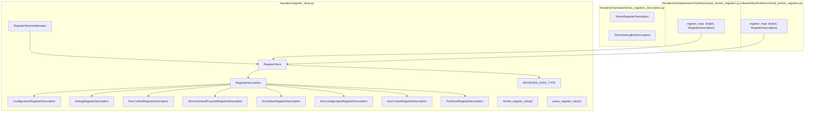
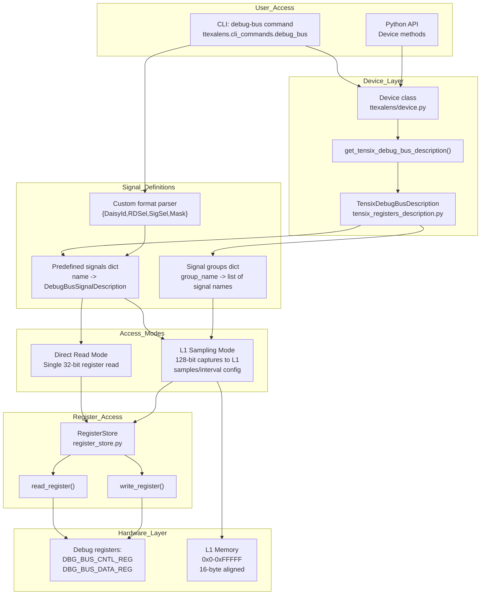
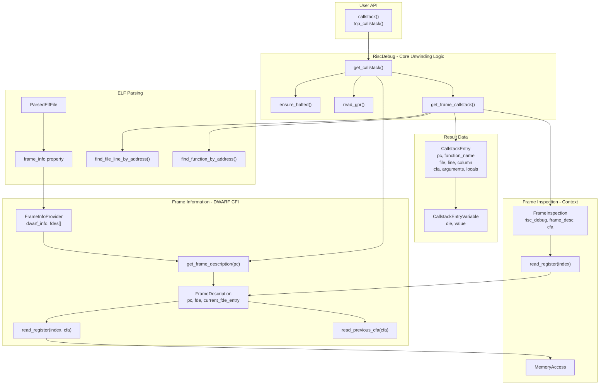
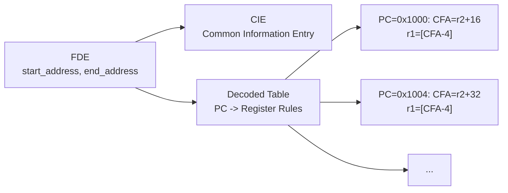
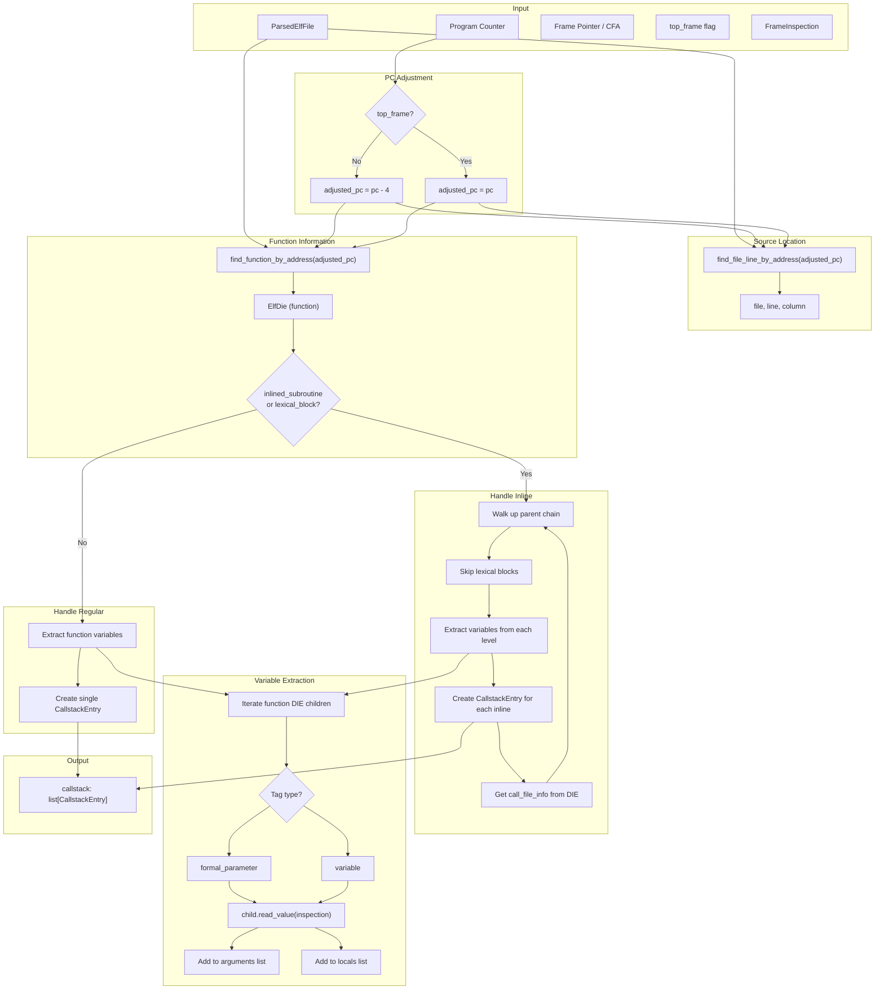
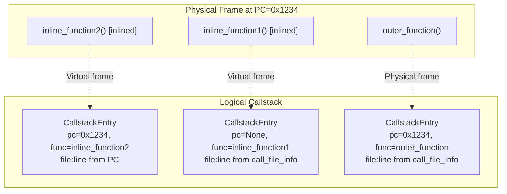
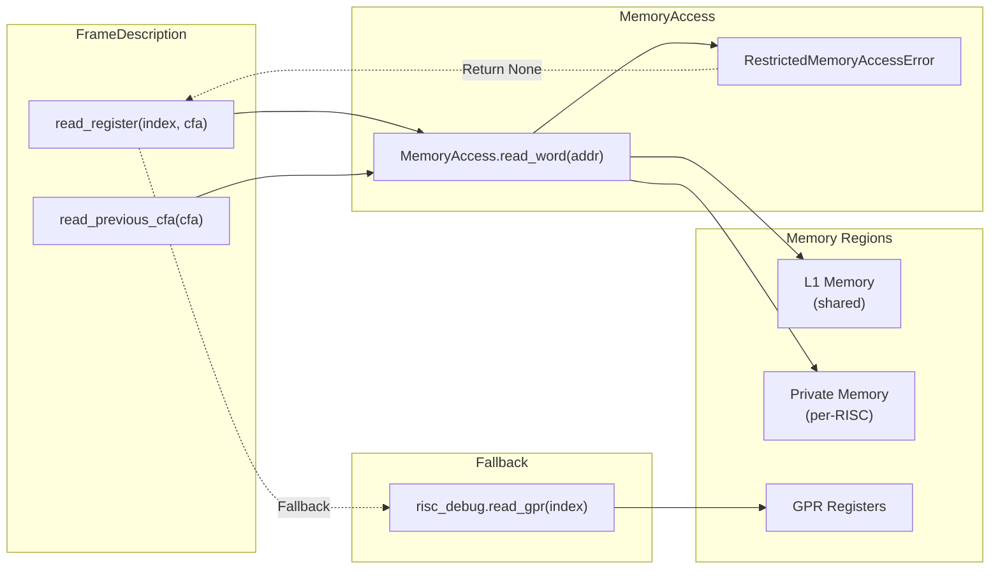
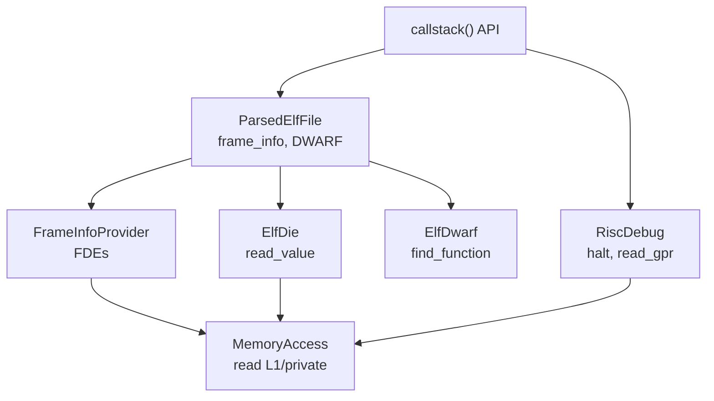

# Callstack Unwinding

Relevant source files
*   [riscv-src/globals_test.cc](https://github.com/tenstorrent/tt-exalens/blob/046c35eb/riscv-src/globals_test.cc)
*   [test/ttexalens/unit_tests/test_debug_symbols.py](https://github.com/tenstorrent/tt-exalens/blob/046c35eb/test/ttexalens/unit_tests/test_debug_symbols.py)
*   [test/ttexalens/unit_tests/test_multicore.py](https://github.com/tenstorrent/tt-exalens/blob/046c35eb/test/ttexalens/unit_tests/test_multicore.py)
*   [ttexalens/cli_commands/callstack.py](https://github.com/tenstorrent/tt-exalens/blob/046c35eb/ttexalens/cli_commands/callstack.py)
*   [ttexalens/elf/__init__.py](https://github.com/tenstorrent/tt-exalens/blob/046c35eb/ttexalens/elf/__init__.py)
*   [ttexalens/elf/die.py](https://github.com/tenstorrent/tt-exalens/blob/046c35eb/ttexalens/elf/die.py)
*   [ttexalens/elf/frame.py](https://github.com/tenstorrent/tt-exalens/blob/046c35eb/ttexalens/elf/frame.py)
*   [ttexalens/elf/parsed.py](https://github.com/tenstorrent/tt-exalens/blob/046c35eb/ttexalens/elf/parsed.py)
*   [ttexalens/elf/variable.py](https://github.com/tenstorrent/tt-exalens/blob/046c35eb/ttexalens/elf/variable.py)
*   [ttexalens/firmware.py](https://github.com/tenstorrent/tt-exalens/blob/046c35eb/ttexalens/firmware.py)
*   [ttexalens/hardware/baby_risc_info.py](https://github.com/tenstorrent/tt-exalens/blob/046c35eb/ttexalens/hardware/baby_risc_info.py)

## Purpose and Scope

Callstack unwinding is the process of reconstructing the complete call stack of a halted RISC-V core by walking backwards through stack frames using DWARF Call Frame Information (CFI). This system produces a list of `CallstackEntry` objects containing function names, source file locations, program counters, and local variable information for each frame in the call hierarchy.

This page covers the frame unwinding implementation, DWARF CFI parsing, and the algorithms used to traverse stack frames. For information about ELF file parsing and DWARF debug information extraction, see [ELF and DWARF Parsing](https://deepwiki.com/tenstorrent/tt-exalens/7.3-elf-and-dwarf-parsing). For symbolic variable access within stack frames, see [Symbolic Variable System](https://deepwiki.com/tenstorrent/tt-exalens/7.4-symbolic-variable-system). For RISC-V core debugging operations, see [RISC-V Debugging System](https://deepwiki.com/tenstorrent/tt-exalens/6-risc-v-debugging-system).

* * *




Sources: [ttexalens/register_store.py:1-20](), [ttexalens/hardware/tensix_registers_description.py](), [ttexalens/hardware/wormhole/functional_worker_registers.py:1-15](), [ttexalens/hardware/blackhole/functional_worker_registers.py:1-15]()

---
```
## System Architecture

The callstack unwinding system consists of several interconnected components that work together to reconstruct the call stack from a halted RISC-V core:

**Sources:**

*   [ttexalens/hardware/risc_debug.py 93-532](https://github.com/tenstorrent/tt-exalens/blob/046c35eb/ttexalens/hardware/risc_debug.py#L93-L532)
*   [ttexalens/elf/frame.py 1-133](https://github.com/tenstorrent/tt-exalens/blob/046c35eb/ttexalens/elf/frame.py#L1-L133)
*   [ttexalens/elf/parsed.py 202-204](https://github.com/tenstorrent/tt-exalens/blob/046c35eb/ttexalens/elf/parsed.py#L202-L204)

* * *




**Debug Bus System Architecture**

The system is accessed through the `Device` class hierarchy which provides `get_tensix_debug_bus_description()` method [ttexalens/device.py:396-398](). This returns a `TensixDebugBusDescription` object containing predefined signal mappings and signal group definitions. Signals are specified by routing parameters (daisy_id, rd_sel, sig_sel, mask) and accessed through the `RegisterStore` abstraction [ttexalens/register_store.py:169-362](). Access can be direct (single 32-bit read) or through L1 sampling (multiple 128-bit captures to memory).

Sources: [ttexalens/device.py:19,396-398](), [ttexalens/register_store.py:169-362](), [docs/ttexalens-app-docs.md:171-396]()
```



## Core Data Structures

The unwinding system uses several key data structures to represent frames and their contents:

### CallstackEntry

Represents a single frame in the unwound call stack:

| Field | Type | Description |
| --- | --- | --- |
| `pc` | `int | None` | Program counter for this frame (None for inlined frames) |
| `function_name` | `str | None` | Name of the function |
| `file` | `str | None` | Source file path |
| `line` | `int | None` | Source line number |
| `column` | `int | None` | Source column number |
| `cfa` | `int | None` | Canonical Frame Address |
| `arguments` | `list[CallstackEntryVariable]` | Function parameters |
| `locals` | `list[CallstackEntryVariable]` | Local variables |

### CallstackEntryVariable

Represents a variable (parameter or local) within a frame:

| Field | Type | Description |
| --- | --- | --- |
| `die` | `ElfDie` | DWARF Debug Information Entry for the variable |
| `value` | `ElfVariable | None` | Memory accessor for the variable value |

### FrameDescription

Encapsulates the unwinding rules from a DWARF FDE (Frame Description Entry):

| Field | Type | Description |
| --- | --- | --- |
| `pc` | `int` | Program counter this description applies to |
| `fde` | `FDE` | Frame Description Entry from DWARF |
| `current_fde_entry` | `dict` | Current row in the FDE table for this PC |
| `risc_debug` | `RiscDebug` | RISC debug interface |
| `mem_access` | `MemoryAccess` | Memory access interface |

### FrameInspection

Provides context for reading registers and variables within a specific frame:

| Field | Type | Description |
| --- | --- | --- |
| `risc_debug` | `RiscDebug` | RISC debug interface |
| `loaded_offset` | `int` | ELF load offset |
| `frame_description` | `FrameDescription | None` | Frame unwinding rules (None for top frame) |
| `cfa` | `int | None` | Current frame's CFA |
| `mem_access` | `MemoryAccess` | Memory access interface |

**Sources:**

*   [ttexalens/hardware/risc_debug.py 64-91](https://github.com/tenstorrent/tt-exalens/blob/046c35eb/ttexalens/hardware/risc_debug.py#L64-L91)
*   [ttexalens/elf/frame.py 16-100](https://github.com/tenstorrent/tt-exalens/blob/046c35eb/ttexalens/elf/frame.py#L16-L100)

* * *

## DWARF CFI Fundamentals

DWARF Call Frame Information (CFI) provides the rules needed to unwind stack frames. The system uses two key DWARF structures:

### Frame Description Entries (FDEs)

Each FDE describes how to unwind a specific address range (typically a function):



### Register Rules

For each PC value, the FDE table specifies how to restore each register:

| Rule Type | Description | Example |
| --- | --- | --- |
| `OFFSET` | Register saved at `CFA + offset` | `r1 = *[CFA - 4]` |
| `REGISTER` | Register value in another register | `r2 = r8` |
| `UNDEFINED` | Register was not saved | - |
| `SAME_VALUE` | Register unchanged from caller | `r3 = r3` |

### Canonical Frame Address (CFA)

The CFA is the value of the stack pointer in the previous frame. It serves as the anchor for locating saved registers and computing the previous frame's CFA.

**Example unwinding**:

```
Frame N:   CFA = r2 + 16      # Stack pointer + offset
           r1 (return addr) = *[CFA - 4]
           r8 (frame ptr) = *[CFA - 8]

Frame N-1: CFA = r8 + 0       # Previous frame's stack pointer
           r1 (return addr) = *[CFA - 4]
           ...
```

**Sources:**

*   [ttexalens/elf/frame.py 16-71](https://github.com/tenstorrent/tt-exalens/blob/046c35eb/ttexalens/elf/frame.py#L16-L71)
*   [ttexalens/elf/frame.py 102-121](https://github.com/tenstorrent/tt-exalens/blob/046c35eb/ttexalens/elf/frame.py#L102-L121)

* * *

## Frame Unwinding Algorithm

The main unwinding algorithm is implemented in `RiscDebug.get_callstack()`:

### Key Steps

1.   **Halt Core**: Ensure the RISC core is halted using `ensure_halted()` context manager
2.   **Read PC**: Read program counter from GPR[32]
3.   **Handle ebreak**: If ebreak was hit, rewind PC by 4 bytes
4.   **Find FDE**: Locate the FDE covering the current PC
5.   **Initialize CFA**: Calculate initial CFA using FDE rules and current register values
6.   **Walk Frames**: 
    *   For each frame: 
        *   Call `get_frame_callstack()` to extract frame information
        *   Read return address from saved register 1
        *   Read previous CFA
        *   Update PC and CFA for next iteration
        *   Find FDE for new PC

    *   Stop when: 
        *   Reached maximum depth
        *   Reached `main()` function (if `stop_on_main=True`)
        *   CFA is 0 or None (end of stack)
        *   No FDE found for PC

**Sources:**

*   [ttexalens/hardware/risc_debug.py 466-532](https://github.com/tenstorrent/tt-exalens/blob/046c35eb/ttexalens/hardware/risc_debug.py#L466-L532)
*   [ttexalens/elf/frame.py 51-70](https://github.com/tenstorrent/tt-exalens/blob/046c35eb/ttexalens/elf/frame.py#L51-L70)

* * *

## Frame Information Extraction

For each frame, `get_frame_callstack()` extracts detailed information:



### PC Adjustment for Non-Top Frames

For frames below the top of the stack, the PC points to the instruction **after** the call instruction. The code adjusts by subtracting 4 bytes to get the actual call site:

`adjusted_pc = pc if top_frame else pc - 4`
This adjustment is critical for:

*   Finding the correct source line (the call site, not the return point)
*   Locating the correct inline function chain
*   Determining which variables are in scope

### Variable Extraction

Variables are extracted by iterating through the function DIE's children:

`for child in function_die.iter_children():    if child.tag_is("formal_parameter"):        arguments.append(CallstackEntryVariable(child, child.read_value(frame_inspection)))    elif child.tag_is("variable"):        locals.append(CallstackEntryVariable(child, child.read_value(frame_inspection)))`
The `read_value()` method uses the `FrameInspection` context to evaluate location expressions and read variable values from appropriate registers or memory locations.

**Sources:**

*   [ttexalens/hardware/risc_debug.py 390-464](https://github.com/tenstorrent/tt-exalens/blob/046c35eb/ttexalens/hardware/risc_debug.py#L390-L464)
*   [ttexalens/elf/die.py 240-299](https://github.com/tenstorrent/tt-exalens/blob/046c35eb/ttexalens/elf/die.py#L240-L299)

* * *

## Handling Inlined Functions

Inlined functions create "virtual frames" that don't correspond to physical stack frames but must be represented in the callstack:



### Inline Detection Algorithm

When a PC resolves to an `inlined_subroutine` DIE:

1.   **Create entry for innermost inline**: Use PC and current source location
2.   **Walk parent chain**: Skip lexical blocks, process each inline parent
3.   **Extract call sites**: Use `call_file_info` attribute for each inline's call location
4.   **Create virtual entries**: Each inline gets a `CallstackEntry` with `pc=None`
5.   **Stop at subprogram**: When reaching non-inline parent, create final physical frame entry

### Lexical Block Handling

Lexical blocks (`DW_TAG_lexical_block`) represent scope blocks like `{ ... }` in source code. They are processed for variable extraction but don't generate separate callstack entries:

`while function_die.category == "lexical_block" and function_die.parent is not None:    extract_variables(function_die, arguments, locals)    function_die = function_die.parent`
**Sources:**

*   [ttexalens/hardware/risc_debug.py 425-456](https://github.com/tenstorrent/tt-exalens/blob/046c35eb/ttexalens/hardware/risc_debug.py#L425-L456)
*   [ttexalens/elf/die.py 368-400](https://github.com/tenstorrent/tt-exalens/blob/046c35eb/ttexalens/elf/die.py#L368-L400)

* * *

## Memory Access During Unwinding

Frame unwinding requires reading from multiple memory regions:



### Safe Memory Access

The system handles restricted memory access gracefully:

`try:    return self.mem_access.read_word(address)except RestrictedMemoryAccessError:    # If access was restricted (outside L1/data_private_memory), return None    return None`
This allows unwinding to continue even when saved registers are in inaccessible memory regions, falling back to reading current register values when needed.

**Sources:**

*   [ttexalens/elf/frame.py 36-49](https://github.com/tenstorrent/tt-exalens/blob/046c35eb/ttexalens/elf/frame.py#L36-L49)
*   [ttexalens/memory_access.py 1-100](https://github.com/tenstorrent/tt-exalens/blob/046c35eb/ttexalens/memory_access.py#L1-L100) (interface)

* * *

## API Usage Examples

### Python Library API

**Basic callstack retrieval**:

`from ttexalens import callstack, parse_elf # Parse ELF fileelf = parse_elf("firmware.elf") # Get callstack for a specific corestack = callstack(    location="0,0",          # Logical tensix coordinate    elfs=elf,                # Can be list of ELFs    risc_name="brisc",       # RISC core name    max_depth=100,           # Maximum frames to unwind    stop_on_main=True,       # Stop at main()    device_id=0) # Iterate through framesfor entry in stack:    print(f"{entry.function_name} at {entry.file}:{entry.line}")    print(f"  PC: {hex(entry.pc) if entry.pc else 'inlined'}")    for arg in entry.arguments:        print(f"  arg: {arg.name} = {arg.value}")`
**Top frame only** (no stack walking):

`from ttexalens import top_callstack # Get current frame without unwindingpc = 0x1234frames = top_callstack(pc=pc, elfs=elf) # Returns inlined function chain at this PCfor frame in frames:    print(f"{frame.function_name} at {frame.file}:{frame.line}")`
**Multiple ELFs with offsets**:

`# When code is loaded at different addressesstack = callstack(    location="0,0",    elfs=["firmware1.elf", "firmware2.elf"],    offsets=[0x0, 0x10000],  # Load offsets    risc_name="brisc")`
### CLI Command

The `bt` (backtrace) command provides callstack functionality:

`# Basic usagebt firmware.elf -r brisc -l 0,0 # With load offsetsbt firmware1.elf,firmware2.elf -o 0,0x10000 -r brisc # Limit depthbt firmware.elf -r brisc -m 50`
**Sources:**

*   [docs/ttexalens-lib-docs.md 451-506](https://github.com/tenstorrent/tt-exalens/blob/046c35eb/docs/ttexalens-lib-docs.md?plain=1#L451-L506)
*   [docs/ttexalens-app-docs.md 123-165](https://github.com/tenstorrent/tt-exalens/blob/046c35eb/docs/ttexalens-app-docs.md?plain=1#L123-L165)

* * *

## Integration with Other Systems




The callstack unwinding system integrates with several other TTExaLens subsystems:

| System | Integration Point | Purpose |
| --- | --- | --- |
| **ELF Parsing** | `ParsedElfFile.frame_info` | Provides DWARF CFI data via `FrameInfoProvider` |
| **RISC Debug** | `RiscDebug` interface | Reads GPRs, halts core, accesses memory |
| **Memory Access** | `MemoryAccess` | Reads saved registers from L1/private memory |
| **DWARF Parser** | `ElfDwarf.find_function_by_address()` | Locates function DIEs for each PC |
| **Symbolic Variables** | `ElfDie.read_value()` | Evaluates location expressions to read variables |

**Sources:**

*   [ttexalens/hardware/risc_debug.py 466-532](https://github.com/tenstorrent/tt-exalens/blob/046c35eb/ttexalens/hardware/risc_debug.py#L466-L532)
*   [ttexalens/elf/parsed.py 202-204](https://github.com/tenstorrent/tt-exalens/blob/046c35eb/ttexalens/elf/parsed.py#L202-L204)
*   [ttexalens/elf/frame.py 102-121](https://github.com/tenstorrent/tt-exalens/blob/046c35eb/ttexalens/elf/frame.py#L102-L121)
*   [ttexalens/elf/die.py 368-500](https://github.com/tenstorrent/tt-exalens/blob/046c35eb/ttexalens/elf/die.py#L368-L500)

This wiki is featured in the [repository](https://github.com/tenstorrent/tt-exalens/blob/main/README.md)

Dismiss
Refresh this wiki

Enter email to refresh
