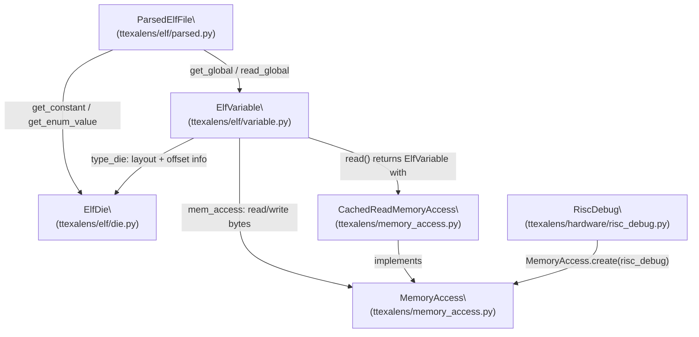
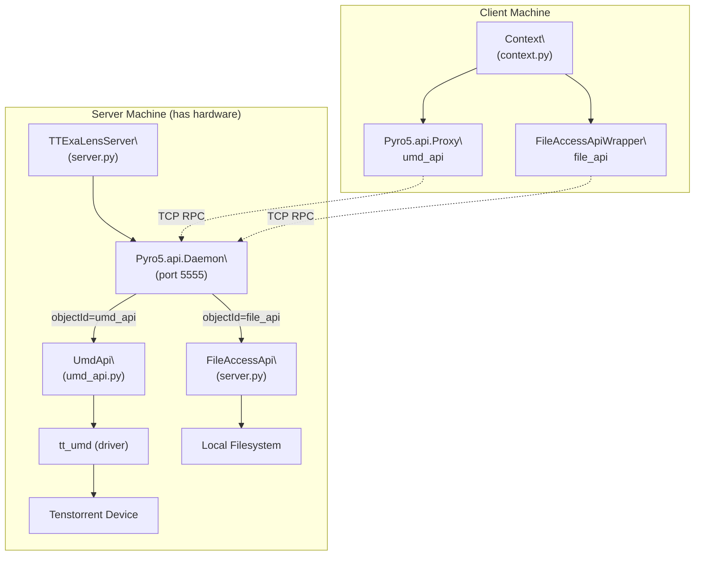
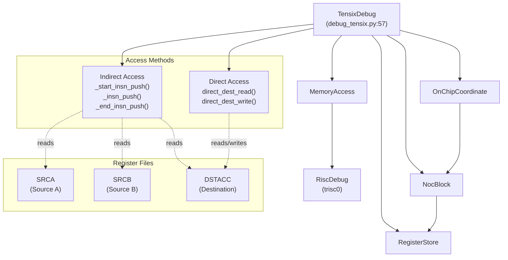
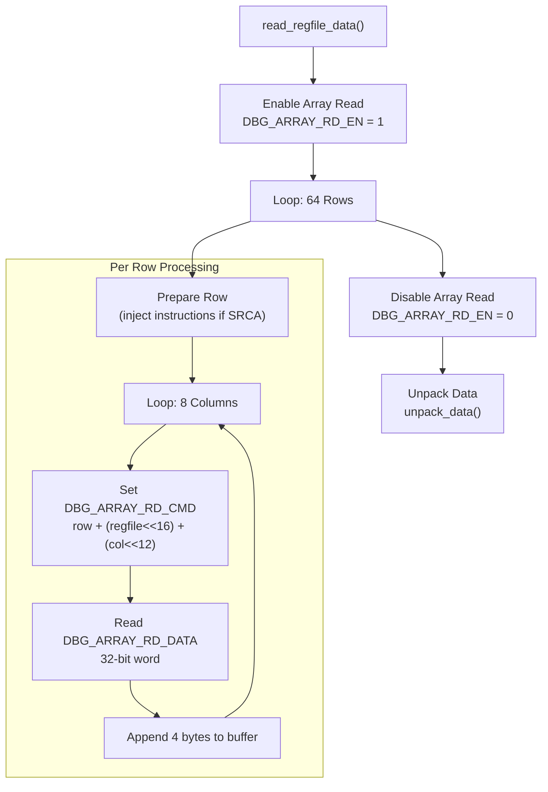
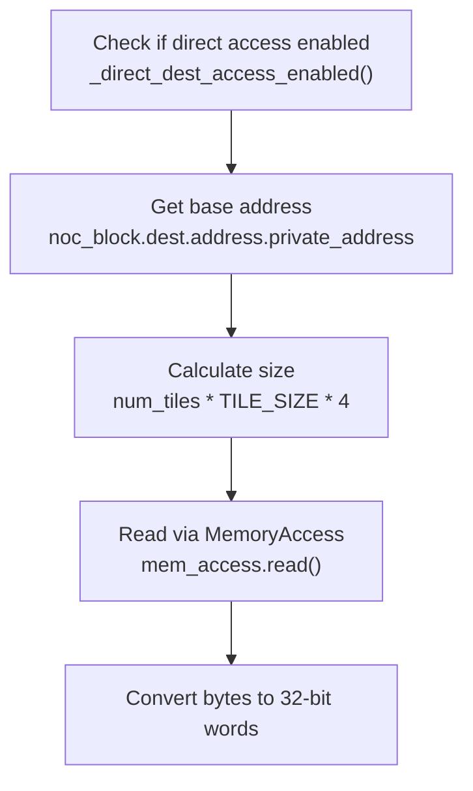

```mermaid
graph LR
    Start["Start Injection"]
    WaitReady1["Wait for Buffer Ready<br/>Poll DBG_INSTRN_BUF_STATUS[thread_id]"]
    TakeControl["Take Control<br/>Set DBG_INSTRN_BUF_CTRL0[thread_id]"]
    WaitReady2["Wait for Buffer Ready<br/>Poll STATUS[thread_id]"]
    WriteInsn["Write Instruction<br/>DBG_INSTRN_BUF_CTRL1"]
    TriggerPush["Trigger Push<br/>Set CTRL0[4+thread_id]"]
    WaitDrain["Wait for Drain<br/>Poll STATUS[4+thread_id]"]
    Release["Release Control<br/>Clear DBG_INSTRN_BUF_CTRL0"]
    
    Start --> WaitReady1
    WaitReady1 --> TakeControl
    TakeControl --> WaitReady2
    WaitReady2 --> WriteInsn
    WriteInsn --> TriggerPush
    TriggerPush --> WaitDrain
    WaitDrain --> Release
```

# Tensix Core Debugging

Relevant source files
*   [test/ttexalens/unit_tests/test_device.py](https://github.com/tenstorrent/tt-exalens/blob/046c35eb/test/ttexalens/unit_tests/test_device.py)
*   [test/ttexalens/unit_tests/test_lib.py](https://github.com/tenstorrent/tt-exalens/blob/046c35eb/test/ttexalens/unit_tests/test_lib.py)
*   [test/ttexalens/unit_tests/test_tensix_debug.py](https://github.com/tenstorrent/tt-exalens/blob/046c35eb/test/ttexalens/unit_tests/test_tensix_debug.py)
*   [ttexalens/debug_tensix.py](https://github.com/tenstorrent/tt-exalens/blob/046c35eb/ttexalens/debug_tensix.py)
*   [ttexalens/elf_loader.py](https://github.com/tenstorrent/tt-exalens/blob/046c35eb/ttexalens/elf_loader.py)
*   [ttexalens/tt_exalens_lib.py](https://github.com/tenstorrent/tt-exalens/blob/046c35eb/ttexalens/tt_exalens_lib.py)

This document describes the `TensixDebug` class, which provides low-level access to Tensix core register files (SRCA, SRCB, DSTACC) and instruction injection capabilities. This is distinct from RISC-V debugging (see [RISC-V Debugging System](https://deepwiki.com/tenstorrent/tt-exalens/6-risc-v-debugging-system)) and focuses specifically on accessing the Tensix compute unit's internal state.

For general Tensix debug commands in the CLI, see [Tensix Debug Commands](https://deepwiki.com/tenstorrent/tt-exalens/4.5-tensix-debug-commands). For ELF-based debugging and symbolic variable access, see [Symbolic Variable System](https://deepwiki.com/tenstorrent/tt-exalens/7.4-symbolic-variable-system).

* * *

## Overview

The `TensixDebug` class enables direct inspection and manipulation of Tensix core state by:

1.   **Reading register files** - Extract data from SRCA, SRCB, and DSTACC register files
2.   **Writing register files** - Write data to DSTACC (destination accumulator) on Blackhole
3.   **Injecting instructions** - Execute individual Tensix instructions outside of normal program flow
4.   **Direct memory access** - Read/write destination register memory directly on Blackhole

The class supports two access methods:

*   **Indirect access** (Wormhole and Blackhole) - Uses debug bus registers and instruction injection to expose register file contents
*   **Direct access** (Blackhole only, 32-bit formats) - Reads destination register memory directly via TRISC0 debug hardware

Sources: [ttexalens/debug_tensix.py 1-356](https://github.com/tenstorrent/tt-exalens/blob/046c35eb/ttexalens/debug_tensix.py#L1-L356)

* * *




Sources: [ttexalens/elf/variable.py:1-25](), [ttexalens/elf/parsed.py:1-30](), [ttexalens/elf/__init__.py:1-21]()

---
```




Sources: [ttexalens/server.py:41-80](), [ttexalens/umd_api.py:44-146](), [ttexalens/cli.py:7-43]()

---
```
## Architecture and Class Structure

**Diagram: TensixDebug Class Architecture**

The `TensixDebug` class is initialized with an `OnChipCoordinate` and obtains:

*   `noc_block` - Hardware block representing the Tensix core
*   `register_store` - Access to configuration and debug registers
*   `mem_access` - Memory access through TRISC0 debug hardware with `restricted_access=False` to access destination register memory

Sources: [ttexalens/debug_tensix.py 57-71](https://github.com/tenstorrent/tt-exalens/blob/046c35eb/ttexalens/debug_tensix.py#L57-L71)

* * *




**Diagram: TensixDebug Class Architecture**

The `TensixDebug` class is initialized with an `OnChipCoordinate` and obtains:
- `noc_block` - Hardware block representing the Tensix core
- `register_store` - Access to configuration and debug registers
- `mem_access` - Memory access through TRISC0 debug hardware with `restricted_access=False` to access destination register memory

Sources: [ttexalens/debug_tensix.py:57-71]()

---
```
## Register File Types

The Tensix core contains three register files, represented by the `REGFILE` enum:

| Register File | Enum Value | Description | Read Support | Write Support |
| --- | --- | --- | --- | --- |
| SRCA | 0 | Source A input register | Yes (last 2 faces only) | No |
| SRCB | 1 | Source B input register | No (architecture limitation) | No |
| DSTACC | 2 | Destination accumulator | Yes | Yes (Blackhole only, 32-bit formats) |

**Key Constraints:**

*   SRCA can only show the last two faces written (architectural limitation)
*   SRCB is not currently supported due to hardware constraints
*   Writing is only supported for DSTACC on Blackhole with 32-bit formats (Float32, Int32, UInt32, Int8, UInt8)

Sources: [ttexalens/debug_tensix.py 31-54](https://github.com/tenstorrent/tt-exalens/blob/046c35eb/ttexalens/debug_tensix.py#L31-L54)

* * *

## Instruction Injection Mechanism

**Diagram: Instruction Injection Flow**

The instruction injection mechanism allows pushing individual Tensix instructions directly to the compute unit's instruction FIFO, bypassing the normal RISC-V execution path. This is used internally for register file access.

**Key Methods:**

1.   **`_start_insn_push(thread_id)`** - Take control of thread's FIFO

    *   Polls `RISCV_DEBUG_REG_DBG_INSTRN_BUF_STATUS` bit [thread_id] until ready
    *   Sets `RISCV_DEBUG_REG_DBG_INSTRN_BUF_CTRL0` bit [thread_id] to claim control

2.   **`_insn_push(insn, thread_id)`** - Push one instruction

    *   Waits for buffer ready
    *   Writes instruction to `RISCV_DEBUG_REG_DBG_INSTRN_BUF_CTRL1`
    *   Sets push bit (4 + thread_id) in CTRL0
    *   Waits for instruction to drain

3.   **`_end_insn_push(thread_id)`** - Release control

    *   Clears `RISCV_DEBUG_REG_DBG_INSTRN_BUF_CTRL0`

**Public API:**

`inject_instruction(instruction: bytes | bytearray | int, thread_id: int) -> None`
Executes a single 32-bit Tensix instruction on the specified thread (0-2). The instruction is passed directly to Tensix, not to the baby RISCs.

Sources: [ttexalens/debug_tensix.py 76-139](https://github.com/tenstorrent/tt-exalens/blob/046c35eb/ttexalens/debug_tensix.py#L76-L139)

* * *




**Diagram: Instruction Injection Flow**

The instruction injection mechanism allows pushing individual Tensix instructions directly to the compute unit's instruction FIFO, bypassing the normal RISC-V execution path. This is used internally for register file access.

**Key Methods:**

1. **`_start_insn_push(thread_id)`** - Take control of thread's FIFO
   - Polls `RISCV_DEBUG_REG_DBG_INSTRN_BUF_STATUS` bit [thread_id] until ready
   - Sets `RISCV_DEBUG_REG_DBG_INSTRN_BUF_CTRL0` bit [thread_id] to claim control

2. **`_insn_push(insn, thread_id)`** - Push one instruction
   - Waits for buffer ready
   - Writes instruction to `RISCV_DEBUG_REG_DBG_INSTRN_BUF_CTRL1`
   - Sets push bit (4 + thread_id) in CTRL0
   - Waits for instruction to drain

3. **`_end_insn_push(thread_id)`** - Release control
   - Clears `RISCV_DEBUG_REG_DBG_INSTRN_BUF_CTRL0`

**Public API:**

```python
inject_instruction(instruction: bytes | bytearray | int, thread_id: int) -> None
```

Executes a single 32-bit Tensix instruction on the specified thread (0-2). The instruction is passed directly to Tensix, not to the baby RISCs.

Sources: [ttexalens/debug_tensix.py:76-139]()

---
```
## Indirect Register File Access

Indirect access uses the debug bus and instruction injection to expose register file contents. This method works on both Wormhole and Blackhole architectures.

**Diagram: Indirect Access Flow**




**Diagram: Indirect Access Flow**
```
### SRCA-Specific Instructions

Reading SRCA requires special handling due to architecture constraints. For each row, the following instructions are injected (thread 2):

1.   `TT_OP_SFPLOAD(3, 0, 0, 0)` - Load data
2.   `TT_OP_SFPLOAD(3, 0, 0, 2)` - Load data (second face)
3.   `TT_OP_STALLWAIT(0x40, 0x4000)` - Wait for operation
4.   `TT_OP_MOVDBGA2D(0, row & 0xF, 0, 0, 0)` - Move data to debug array

After reading:

*   `TT_OP_SFPSTORE(3, 0, 0, 0)` - Restore data
*   `TT_OP_SFPSTORE(3, 0, 0, 2)` - Restore data (second face)
*   Every 16 rows: `TT_OP_SETRWC(3, 0, 0, 0, 0, 0xF)` - Reset window counter

Sources: [ttexalens/debug_tensix.py 202-265](https://github.com/tenstorrent/tt-exalens/blob/046c35eb/ttexalens/debug_tensix.py#L202-L265)

* * *

## Direct Register File Access (Blackhole Only)

Direct access reads destination register memory directly through TRISC0's debug hardware, bypassing the debug array mechanism. This is significantly faster but only works for:

*   **Architecture:** Blackhole only
*   **Register file:** DSTACC only
*   **Data formats:** 32-bit formats (Float32, Int32, UInt32, Int8, UInt8)

**Diagram: Direct Access Read Flow**




**Diagram: Direct Access Read Flow**
```
### Direct Access Implementation

**Reading:**

`def direct_dest_read(df: TensixDataFormat, num_tiles: int) -> list[int]`
1.   Validates architecture is Blackhole
2.   Gets destination memory base address from `noc_block.dest.address.private_address`
3.   Reads `num_tiles * TILE_SIZE * 4` bytes via `mem_access.read()`
4.   Converts raw bytes to 32-bit integers

**Writing:**

`def direct_dest_write(data: list[int], df: TensixDataFormat) -> None`
1.   Validates architecture and data size
2.   Converts 32-bit integers to bytes (little-endian)
3.   Writes via `mem_access.write()` to destination memory base address
4.   Sets data format in `ALU_FORMAT_SPEC_REG2_Dstacc` register (with UInt32→Int32, UInt8→Int8 workaround for register constraints)

Sources: [ttexalens/debug_tensix.py 164-201](https://github.com/tenstorrent/tt-exalens/blob/046c35eb/ttexalens/debug_tensix.py#L164-L201)

* * *

## Data Format Support

The following data formats are supported for register file operations:

| Format | Direct Access | Indirect Access | Size per Value | Notes |
| --- | --- | --- | --- | --- |
| Float32 | ✓ (BH) | ✓ (WH/BH) | 4 bytes | Wormhole requires special handling |
| Int32 | ✓ (BH) | ✓ (WH/BH) | 4 bytes | Wormhole returns zeros in lower 16 bits |
| UInt32 | ✓ (BH) | ✓ (WH/BH) | 4 bytes | Stored as Int32 due to register constraints |
| Int8 | ✓ (BH) | ✓ (WH/BH) | 1 byte (stored as 4) | Written in 32-bit mode |
| UInt8 | ✓ (BH) | ✓ (WH/BH) | 1 byte (stored as 4) | Stored as Int8 due to register constraints |
| Float16 | ✗ | ✓ (WH/BH) | 2 bytes | Returns raw hex values |
| Float16_b | ✗ | ✓ (WH/BH) | 2 bytes | Returns raw hex values |
| UInt16 | ✗ | ✓ (WH/BH) | 2 bytes | Returns raw hex values |
| Bfp8 | ✗ | Partial | 1 byte | Returns raw hex values |

**Format Selection:**

Data format is determined by reading the `ALU_FORMAT_SPEC_REG2_Dstacc` configuration register, which returns a `TensixDataFormat` enum value.

Sources: [ttexalens/debug_tensix.py 156-170](https://github.com/tenstorrent/tt-exalens/blob/046c35eb/ttexalens/debug_tensix.py#L156-L170)[ttexalens/pack_unpack_regfile.py](https://github.com/tenstorrent/tt-exalens/blob/046c35eb/ttexalens/pack_unpack_regfile.py)

* * *

## Platform-Specific Considerations

### Wormhole

**Float32 Read Workaround:**

When reading DSTACC as Float32 on Wormhole, the hardware returns zeros in the lower 16 bits of each datum. The implementation performs a two-pass read:

1.   **First pass:** Read upper 16 bits normally
2.   **Inject kernel:** Execute instructions to shift lower 16 bits to upper position: 
    *   `TT_OP_SFPLOAD(2, 3, 0, 0)` - Load from dest
    *   `TT_OP_SFPSHFT(0x010, 2, 2, 1)` - Shift to expose lower bits
    *   `TT_OP_SFPSTORE(2, 3, 0, 0)` - Store back
    *   `TT_OP_INCRWC(0, 16, 0, 0)` - Increment window counter

3.   **Second pass:** Read lower 16 bits from upper position
4.   **Combine:** Merge upper and lower halves

**Warning:** This clobbers the destination register contents.

Sources: [ttexalens/debug_tensix.py 286-308](https://github.com/tenstorrent/tt-exalens/blob/046c35eb/ttexalens/debug_tensix.py#L286-L308)

### Blackhole

**Direct Memory Access:**

Blackhole includes a dedicated destination register memory block that is accessible through the TRISC0 debug hardware:

`# Access destination register memorydest = noc_block.dest  # BlackholeFunctionalWorkerBlock onlybase_address = dest.address.private_addresssize = dest.size`
The destination register is exposed as a `MemoryBlock` with:

*   Private address (accessible via debug interface)
*   Size typically sufficient for 8 tiles (8 * 32 * 32 * 4 bytes = 32KB)

Sources: [ttexalens/debug_tensix.py 172-200](https://github.com/tenstorrent/tt-exalens/blob/046c35eb/ttexalens/debug_tensix.py#L172-L200)[ttexalens/hardware/blackhole/functional_worker_block.py](https://github.com/tenstorrent/tt-exalens/blob/046c35eb/ttexalens/hardware/blackhole/functional_worker_block.py)

* * *

## Public API Usage

### Reading Register Files

`from ttexalens.debug_tensix import TensixDebug, REGFILEfrom ttexalens.pack_unpack_regfile import TensixDataFormat # Initializelocation = OnChipCoordinate.create("0,0", device)tensix_debug = TensixDebug(location) # Read DSTACC register file (parsed values)data = tensix_debug.read_regfile(REGFILE.DSTACC, num_tiles=4)# Returns list[int | float] depending on data format # Read raw register file data (bytes)raw_data = tensix_debug.read_regfile_data(REGFILE.DSTACC, TensixDataFormat.Float32, num_tiles=4)# Returns list[int] - raw 32-bit words`
### Writing Register Files (Blackhole Only)

`# Write to DSTACC (Float32)data = [1.0, 2.0, 3.0, ...]  # 1024 values for 1 tiletensix_debug.write_regfile(REGFILE.DSTACC, data, TensixDataFormat.Float32) # Write raw dataraw_data = [0x3F800000, 0x40000000, ...]  # IEEE 754 float valuestensix_debug.write_regfile_data(REGFILE.DSTACC, raw_data, TensixDataFormat.Float32)`
### Injecting Instructions

`# Execute a single Tensix instruction on thread 2instruction = ops.TT_OP_SETRWC(0, 0, 5, 3, 2, 0x7)tensix_debug.inject_instruction(instruction, thread_id=2) # Inject as raw bytesinstruction_bytes = b'\x12\x34\x56\x78'tensix_debug.inject_instruction(instruction_bytes, thread_id=0)`
Sources: [ttexalens/debug_tensix.py 202-355](https://github.com/tenstorrent/tt-exalens/blob/046c35eb/ttexalens/debug_tensix.py#L202-L355)

* * *

## Register Access Details

The `TensixDebug` class relies on the following debug registers for control:

| Register Name | Purpose |
| --- | --- |
| `RISCV_DEBUG_REG_DBG_ARRAY_RD_EN` | Enable/disable debug array read mode |
| `RISCV_DEBUG_REG_DBG_ARRAY_RD_CMD` | Command register: row + (regfile << 16) + (column << 12) |
| `RISCV_DEBUG_REG_DBG_ARRAY_RD_DATA` | Data register: returns 32-bit word |
| `RISCV_DEBUG_REG_DBG_INSTRN_BUF_STATUS` | Instruction buffer status (ready/drain bits) |
| `RISCV_DEBUG_REG_DBG_INSTRN_BUF_CTRL0` | Control register: thread claim and push bits |
| `RISCV_DEBUG_REG_DBG_INSTRN_BUF_CTRL1` | Instruction data register: 32-bit instruction |
| `ALU_FORMAT_SPEC_REG2_Dstacc` | Data format configuration for destination register |

These registers are accessed through the `RegisterStore` obtained from the hardware block.

Sources: [ttexalens/debug_tensix.py 65-116](https://github.com/tenstorrent/tt-exalens/blob/046c35eb/ttexalens/debug_tensix.py#L65-L116)[ttexalens/register_store.py](https://github.com/tenstorrent/tt-exalens/blob/046c35eb/ttexalens/register_store.py)

* * *

## Memory Access Configuration

The `TensixDebug` class uses `MemoryAccess` with special configuration:

`self.mem_access = MemoryAccess.create(    self.noc_block.get_risc_debug(risc_name="trisc0"),    restricted_access=False  # Allow access outside L1/data_private)`
**Why `restricted_access=False`?**

The Tensix destination register memory block is outside the normal L1 and private memory regions that TRISC0 can typically access. Setting `restricted_access=False` allows the memory access layer to read/write this special region via the debug hardware.

Sources: [ttexalens/debug_tensix.py 67-71](https://github.com/tenstorrent/tt-exalens/blob/046c35eb/ttexalens/debug_tensix.py#L67-L71)[ttexalens/memory_access.py](https://github.com/tenstorrent/tt-exalens/blob/046c35eb/ttexalens/memory_access.py)

* * *

## Testing and Validation

The test suite validates TensixDebug functionality across multiple cores and data formats:

**Test Coverage:**

*   Read/write operations for all 32-bit formats (Float32, Int32, UInt32, Int8, UInt8)
*   Multiple tile counts (1, 2, 4, 8 tiles)
*   Special float values (0.0, -0.0, inf, -inf, nan)
*   Error handling for unsupported formats and invalid parameters
*   Register window counter manipulation via instruction injection

**Example Test:**

`def test_read_write_regfile_fp32(self, num_tiles: int):    data = [0.01 * i - 0.01 * num_tiles * TILE_SIZE / 2             for i in range(num_tiles * TILE_SIZE)]        tensix_debug.write_regfile(REGFILE.DSTACC, data, TensixDataFormat.Float32)    ret = tensix_debug.read_regfile(REGFILE.DSTACC, num_tiles)        assert len(ret) == len(data)    assert all(abs(a - b) < 1e-4 for a, b in zip(ret, data))`
Sources: [test/ttexalens/unit_tests/test_tensix_debug.py 1-215](https://github.com/tenstorrent/tt-exalens/blob/046c35eb/test/ttexalens/unit_tests/test_tensix_debug.py#L1-L215)

* * *

## Limitations and Constraints

1.   **SRCB Not Supported** - Hardware does not expose SRCB through debug array
2.   **SRCA Limited** - Only shows last 2 faces written (architectural constraint)
3.   **Write Support** - Only DSTACC can be written, only on Blackhole, only 32-bit formats
4.   **Wormhole Float32** - Reading DSTACC as Float32 clobbers register contents
5.   **Direct Access** - Only available on Blackhole for 32-bit formats
6.   **Tile Limit** - Direct access limited by destination memory size (typically 8 tiles on Blackhole)
7.   **Format Support** - Some formats (16-bit types, Bfp8) return raw hex values without parsing

Sources: [ttexalens/debug_tensix.py 218-220](https://github.com/tenstorrent/tt-exalens/blob/046c35eb/ttexalens/debug_tensix.py#L218-L220)[ttexalens/debug_tensix.py 286-308](https://github.com/tenstorrent/tt-exalens/blob/046c35eb/ttexalens/debug_tensix.py#L286-L308)[ttexalens/debug_tensix.py 325-329](https://github.com/tenstorrent/tt-exalens/blob/046c35eb/ttexalens/debug_tensix.py#L325-L329)

Dismiss
Refresh this wiki

Enter email to refresh
