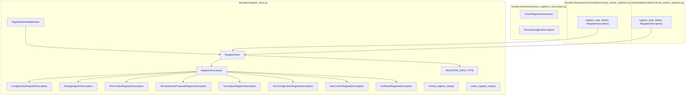
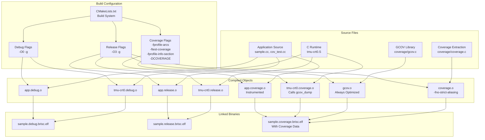
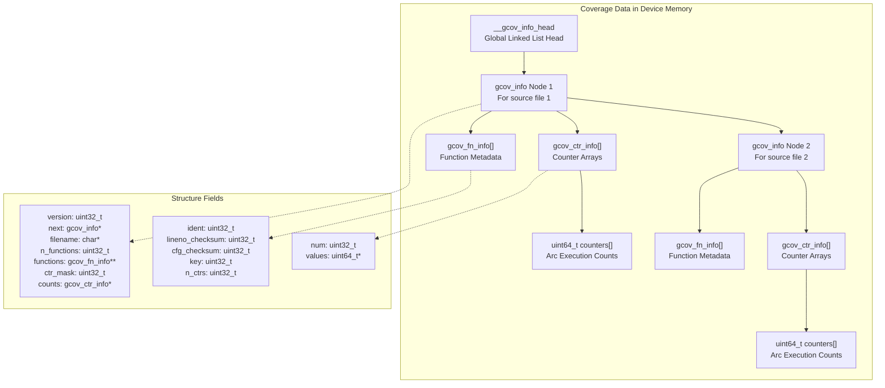
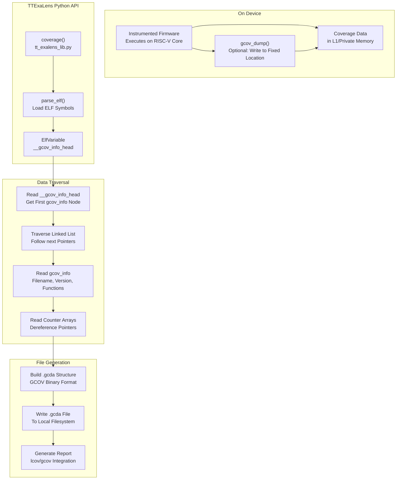
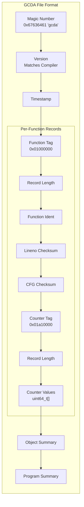
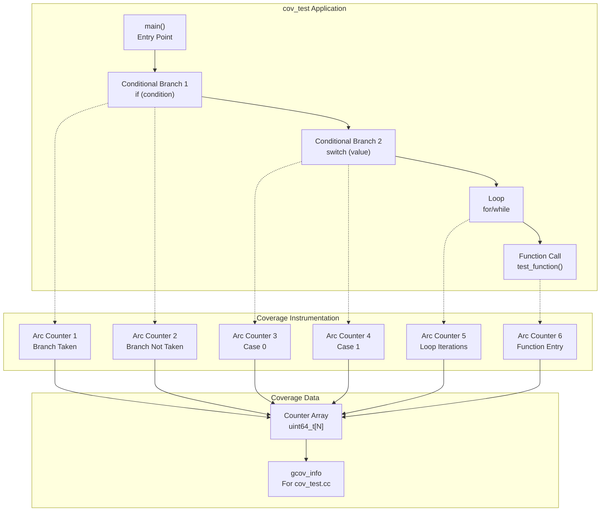

# Code Coverage Extraction

Relevant source files
*   [.gitignore](https://github.com/tenstorrent/tt-exalens/blob/046c35eb/.gitignore)
*   [CMakeLists.txt](https://github.com/tenstorrent/tt-exalens/blob/046c35eb/CMakeLists.txt)
*   [cmake/sfpi_release.cmake](https://github.com/tenstorrent/tt-exalens/blob/046c35eb/cmake/sfpi_release.cmake)
*   [docs/gdb.md](https://github.com/tenstorrent/tt-exalens/blob/046c35eb/docs/gdb.md?plain=1)
*   [riscv-src/CMakeLists.txt](https://github.com/tenstorrent/tt-exalens/blob/046c35eb/riscv-src/CMakeLists.txt)
*   [test/ttexalens/unit_tests/test_multicore.py](https://github.com/tenstorrent/tt-exalens/blob/046c35eb/test/ttexalens/unit_tests/test_multicore.py)
*   [ttexalens/cli_commands/callstack.py](https://github.com/tenstorrent/tt-exalens/blob/046c35eb/ttexalens/cli_commands/callstack.py)
*   [ttexalens/firmware.py](https://github.com/tenstorrent/tt-exalens/blob/046c35eb/ttexalens/firmware.py)
*   [ttexalens/hardware/baby_risc_info.py](https://github.com/tenstorrent/tt-exalens/blob/046c35eb/ttexalens/hardware/baby_risc_info.py)

## Purpose and Scope

This page documents TTExaLens's code coverage extraction system, which enables developers to generate GCOV-compatible coverage reports from firmware running on Tenstorrent RISC-V cores. The system instruments firmware during compilation, extracts coverage data from device memory after execution, and generates `.gcda` files for analysis with standard coverage tools like `lcov` and `gcov`.

For information about loading and executing firmware on RISC-V cores, see [ELF Management](https://deepwiki.com/tenstorrent/tt-exalens/3.5-elf-management) and [RISC-V Core Control](https://deepwiki.com/tenstorrent/tt-exalens/3.6-risc-v-core-control). For general debugging capabilities, see [RISC-V Debugging System](https://deepwiki.com/tenstorrent/tt-exalens/6-risc-v-debugging-system).




Sources: [ttexalens/register_store.py:1-20](), [ttexalens/hardware/tensix_registers_description.py](), [ttexalens/hardware/wormhole/functional_worker_registers.py:1-15](), [ttexalens/hardware/blackhole/functional_worker_registers.py:1-15]()

---
```
## Coverage Infrastructure Overview

TTExaLens integrates GCC's code coverage instrumentation with on-device firmware execution. The build system compiles special coverage-enabled firmware binaries that track execution paths, and the extraction system reads this data back from device memory without requiring runtime library support.

### Build System Integration

The CMake build system produces three variants of each firmware binary:

*   **debug**: Unoptimized with full debug symbols
*   **release**: Optimized without coverage instrumentation
*   **coverage**: Optimized with coverage instrumentation and extraction support

Sources: [riscv-src/CMakeLists.txt 1-170](https://github.com/tenstorrent/tt-exalens/blob/046c35eb/riscv-src/CMakeLists.txt#L1-L170)

**Diagram: Coverage Build Pipeline**

The key compilation flag `-fprofile-info-section` instructs GCC to provide a pointer to raw coverage data structures rather than generating calls to unavailable runtime library functions. This enables coverage collection without libc or complete C runtime support.

Sources: [riscv-src/CMakeLists.txt 27-28](https://github.com/tenstorrent/tt-exalens/blob/046c35eb/riscv-src/CMakeLists.txt#L27-L28)[riscv-src/CMakeLists.txt 47-51](https://github.com/tenstorrent/tt-exalens/blob/046c35eb/riscv-src/CMakeLists.txt#L47-L51)[riscv-src/CMakeLists.txt 62-76](https://github.com/tenstorrent/tt-exalens/blob/046c35eb/riscv-src/CMakeLists.txt#L62-L76)[riscv-src/CMakeLists.txt 111-115](https://github.com/tenstorrent/tt-exalens/blob/046c35eb/riscv-src/CMakeLists.txt#L111-L115)




**Diagram: Coverage Build Pipeline**

The key compilation flag `-fprofile-info-section` instructs GCC to provide a pointer to raw coverage data structures rather than generating calls to unavailable runtime library functions. This enables coverage collection without libc or complete C runtime support.

Sources: [riscv-src/CMakeLists.txt:27-28](), [riscv-src/CMakeLists.txt:47-51](), [riscv-src/CMakeLists.txt:62-76](), [riscv-src/CMakeLists.txt:111-115]()
```
### Coverage-Specific Compilation

The coverage build process involves several specialized compilation steps:

1.   **Application Code**: Compiled with full GCOV instrumentation flags, which insert arc counting code at branch points
2.   **C Runtime (tmu-crt0.S)**: Coverage variant includes a call to `gcov_dump()` to write coverage data at program termination
3.   **GCOV Library (gcov.c)**: Compiled optimized without instrumentation to avoid circular dependencies
4.   **Coverage Extraction (coverage.c)**: Compiled with `-fno-strict-aliasing` due to type-punning techniques used to access coverage data structures

Sources: [riscv-src/CMakeLists.txt 64-76](https://github.com/tenstorrent/tt-exalens/blob/046c35eb/riscv-src/CMakeLists.txt#L64-L76)[riscv-src/CMakeLists.txt 80-82](https://github.com/tenstorrent/tt-exalens/blob/046c35eb/riscv-src/CMakeLists.txt#L80-L82)[riscv-src/CMakeLists.txt 86-89](https://github.com/tenstorrent/tt-exalens/blob/046c35eb/riscv-src/CMakeLists.txt#L86-L89)

## On-Device Coverage Data Structures

When GCC instruments code with `-fprofile-arcs`, it creates in-memory data structures to track execution counts. These structures are embedded in the firmware binary and updated during execution as the instrumented code runs.

### GCOV Data Format

GCC maintains coverage information through several key data structures:

**Diagram: GCOV Data Structure Layout in Device Memory**

The `__gcov_info_head` symbol provides the entry point to a linked list of `gcov_info` structures, one per source file. Each structure contains:

*   **version**: GCOV file format version
*   **filename**: Path to the source file
*   **functions**: Array of function metadata with checksums
*   **counts**: Array of counter arrays, one per counter type (arcs, branches, etc.)

Sources: Based on GCC GCOV implementation conventions




**Diagram: GCOV Data Structure Layout in Device Memory**

The `__gcov_info_head` symbol provides the entry point to a linked list of `gcov_info` structures, one per source file. Each structure contains:
- **version**: GCOV file format version
- **filename**: Path to the source file
- **functions**: Array of function metadata with checksums
- **counts**: Array of counter arrays, one per counter type (arcs, branches, etc.)

Sources: Based on GCC GCOV implementation conventions
```
## Coverage Extraction Process

The coverage extraction pipeline reads GCOV data structures from device memory, reconstructs the coverage information, and writes it to `.gcda` files compatible with standard coverage analysis tools.

**Diagram: Coverage Extraction Pipeline**

Sources: Based on the architecture described in [Diagram 6](https://github.com/tenstorrent/tt-exalens/blob/046c35eb/Diagram%206#LNaN-LNaN) from the system overview




**Diagram: Coverage Extraction Pipeline**

Sources: Based on the architecture described in [Diagram 6: ELF Loading and Firmware Execution Pipeline]() from the system overview
```
### Python API for Coverage Extraction

The primary interface for coverage extraction is the `coverage()` function referenced in the table of contents. This function:

1.   Loads the ELF file to obtain symbol information
2.   Locates the `__gcov_info_head` symbol using the symbolic variable system
3.   Traverses the linked list of `gcov_info` structures
4.   Reads all counter arrays by dereferencing pointers through device memory
5.   Reconstructs the `.gcda` file format from the extracted data
6.   Writes `.gcda` files to the local filesystem

The extraction process leverages TTExaLens's symbolic memory access system (see [Symbolic Variable System](https://deepwiki.com/tenstorrent/tt-exalens/7.4-symbolic-variable-system)) to transparently handle pointer dereferencing and structure member access across the device memory space.

Sources: Table of contents [section 3.10](https://github.com/tenstorrent/tt-exalens/blob/046c35eb/section%203.10)[section 7.4](https://github.com/tenstorrent/tt-exalens/blob/046c35eb/section%207.4)

### Memory Access Patterns

Coverage data may be located in different memory regions depending on the RISC core:

*   **L1 Memory**: Shared memory accessible via NOC addressing
*   **Private Memory**: Core-private memory for NCRISC/ERISC

The extraction system uses the device's memory translation layer (see [Memory Access Operations](https://deepwiki.com/tenstorrent/tt-exalens/3.3-memory-access-operations)) to transparently access data regardless of location. The `translate_to_noc_address()` method handles mapping from RISC virtual addresses to NOC physical addresses.

Sources: [ttexalens/hardware/baby_risc_info.py 90-98](https://github.com/tenstorrent/tt-exalens/blob/046c35eb/ttexalens/hardware/baby_risc_info.py#L90-L98)

## GCDA File Format and Reporting

The extracted coverage data is written in the standard GCOV `.gcda` file format, which consists of:

### File Structure

**Diagram: GCDA File Format Structure**

The `.gcda` files generated by TTExaLens are binary-compatible with standard GCOV tools, enabling integration with existing coverage workflows:

*   **gcov**: Generate text-based coverage reports
*   **lcov**: Generate HTML coverage reports
*   **gcovr**: Generate XML/JSON coverage reports for CI integration

Sources: Based on GCC GCOV file format specification




**Diagram: GCDA File Format Structure**

The `.gcda` files generated by TTExaLens are binary-compatible with standard GCOV tools, enabling integration with existing coverage workflows:

- **gcov**: Generate text-based coverage reports
- **lcov**: Generate HTML coverage reports
- **gcovr**: Generate XML/JSON coverage reports for CI integration

Sources: Based on GCC GCOV file format specification
```
### Usage Example

A typical coverage extraction workflow:

1.   Build coverage-instrumented firmware: `cmake --build build --target wormhole_cov_test_brisc_coverage_target`
2.   Load and execute firmware on device using [ELF Management](https://deepwiki.com/tenstorrent/tt-exalens/3.5-elf-management) functions
3.   Extract coverage data: `lib.coverage(location, elf, risc_name, output_dir)`
4.   Generate HTML report: `lcov --capture --directory output_dir --output-file coverage.info && genhtml coverage.info --output-directory html_report`

The extracted `.gcda` files must be co-located with the corresponding `.gcno` files (compiler-generated graph notes) for tools like `lcov` to generate complete coverage reports.

Sources: [riscv-src/CMakeLists.txt 38](https://github.com/tenstorrent/tt-exalens/blob/046c35eb/riscv-src/CMakeLists.txt#L38-L38) (cov_test application)

## Coverage Test Application

The `cov_test` application in the RISC-V source tree serves as both a test case and example for coverage extraction:

**Diagram: Coverage Test Application Structure**

The test application exercises various code coverage scenarios including conditional branches, switch statements, loops, and function calls. Each control flow arc is instrumented with a counter that tracks execution frequency.

Sources: [riscv-src/CMakeLists.txt 37](https://github.com/tenstorrent/tt-exalens/blob/046c35eb/riscv-src/CMakeLists.txt#L37-L37) (cov_test in RISCV_APPS list), [riscv-src/CMakeLists.txt 164](https://github.com/tenstorrent/tt-exalens/blob/046c35eb/riscv-src/CMakeLists.txt#L164-L164) (coverage build type)




**Diagram: Coverage Test Application Structure**

The test application exercises various code coverage scenarios including conditional branches, switch statements, loops, and function calls. Each control flow arc is instrumented with a counter that tracks execution frequency.

Sources: [riscv-src/CMakeLists.txt:37]() (cov_test in RISCV_APPS list), [riscv-src/CMakeLists.txt:164]() (coverage build type)
```
## Integration with Debugging Workflow

Coverage extraction integrates seamlessly with other TTExaLens debugging features:

1.   **Load Coverage ELF**: Use `load_elf()` or `run_elf()` with coverage-instrumented binary
2.   **Execute to Completion**: Let firmware run, potentially with breakpoints for staged collection
3.   **Extract Coverage**: Call `coverage()` to read data from device
4.   **Continue Debugging**: Use callstack analysis, variable inspection, etc. with the same ELF
5.   **Iterative Testing**: Modify code, rebuild, re-execute, compare coverage

The coverage system works alongside GDB integration (see [GDB Server Integration](https://deepwiki.com/tenstorrent/tt-exalens/7.1-gdb-server-integration)), allowing developers to set breakpoints at specific coverage thresholds or inspect coverage data structures directly through GDB.

Sources: [docs/gdb.md 1-100](https://github.com/tenstorrent/tt-exalens/blob/046c35eb/docs/gdb.md?plain=1#L1-L100) (GDB integration overview), table of contents [section 7.1](https://github.com/tenstorrent/tt-exalens/blob/046c35eb/section%207.1)

## Technical Considerations

### Pointer Dereferencing and Type Safety

The coverage extraction code must carefully handle pointer dereferencing across device memory boundaries. The `coverage.c` file uses type-punning techniques that require `-fno-strict-aliasing` to function correctly with optimizations enabled.

Sources: [riscv-src/CMakeLists.txt 66-76](https://github.com/tenstorrent/tt-exalens/blob/046c35eb/riscv-src/CMakeLists.txt#L66-L76) (coverage.c compilation with -fno-strict-aliasing)

### Memory Region Access

Coverage counters may reside in various memory regions:

*   **L1**: Accessible via NOC, translation required
*   **Private Memory**: Core-specific addressing

The `translate_to_noc_address()` method in `BabyRiscInfo` handles the address translation, trying data-private memory first, then falling back to L1.

Sources: [ttexalens/hardware/baby_risc_info.py 90-98](https://github.com/tenstorrent/tt-exalens/blob/046c35eb/ttexalens/hardware/baby_risc_info.py#L90-L98)

### Build System Variants

The build system generates 648 ELF variants (2 architectures × 6 applications × 6 cores × 3 build types), including coverage-instrumented versions for comprehensive testing across all core types and platforms.

Sources: From [Diagram 5](https://github.com/tenstorrent/tt-exalens/blob/046c35eb/Diagram%205#LNaN-LNaN) in system overview, [riscv-src/CMakeLists.txt 35-37](https://github.com/tenstorrent/tt-exalens/blob/046c35eb/riscv-src/CMakeLists.txt#L35-L37) (architectures, cores, apps)

### Runtime Overhead

Coverage instrumentation adds overhead:

*   **Code Size**: Arc counting code at each branch point
*   **Execution Time**: Counter increments on every arc traversal
*   **Memory**: Counter arrays proportional to code complexity

The `-O3` optimization in coverage builds helps mitigate performance impact while maintaining accurate coverage tracking.

Sources: [riscv-src/CMakeLists.txt 16](https://github.com/tenstorrent/tt-exalens/blob/046c35eb/riscv-src/CMakeLists.txt#L16-L16) (OPTIMIZED_OPTIONS_ALL with -O3), [riscv-src/CMakeLists.txt 27](https://github.com/tenstorrent/tt-exalens/blob/046c35eb/riscv-src/CMakeLists.txt#L27-L27) (GCOV_FLAGS)

This wiki is featured in the [repository](https://github.com/tenstorrent/tt-exalens/blob/main/README.md)

Dismiss
Refresh this wiki

Enter email to refresh
