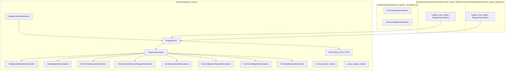
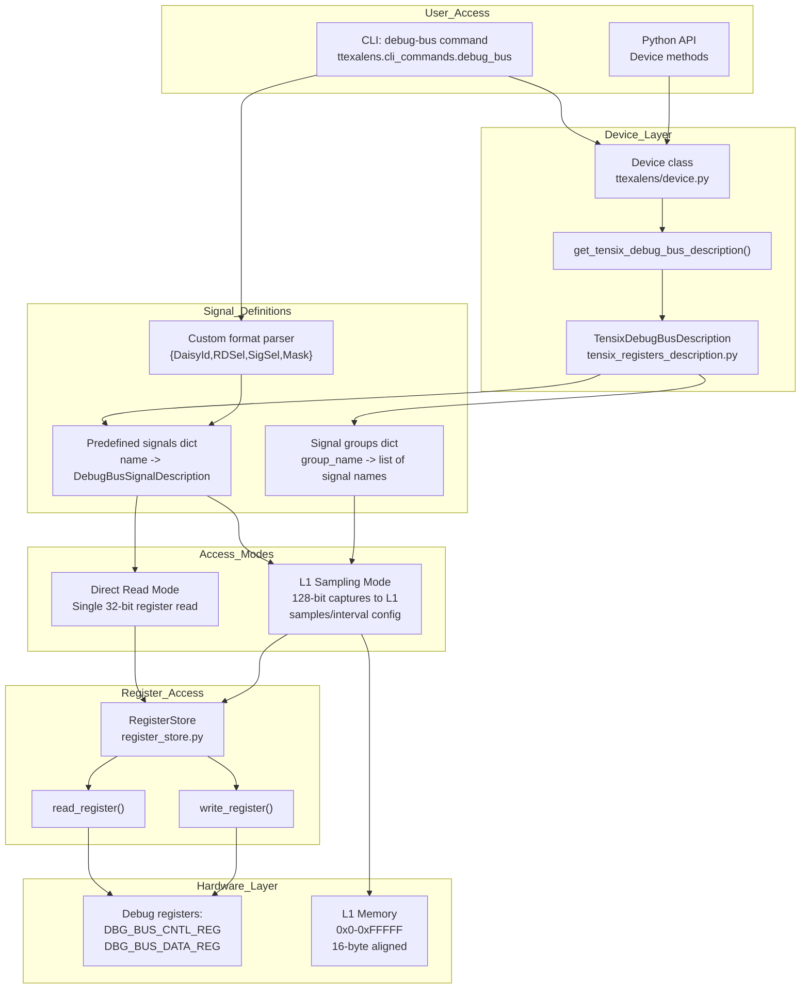
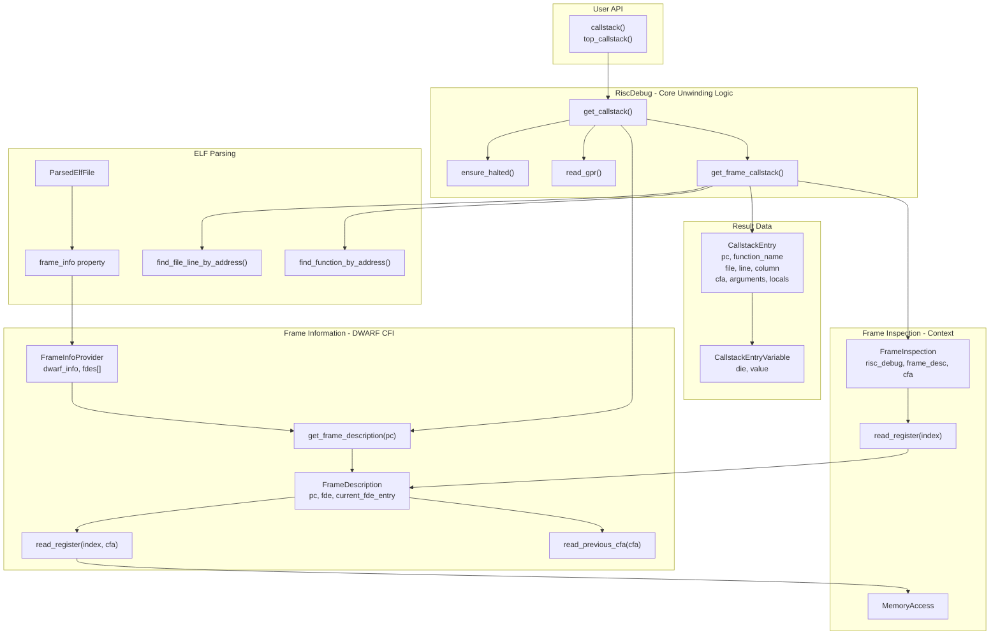
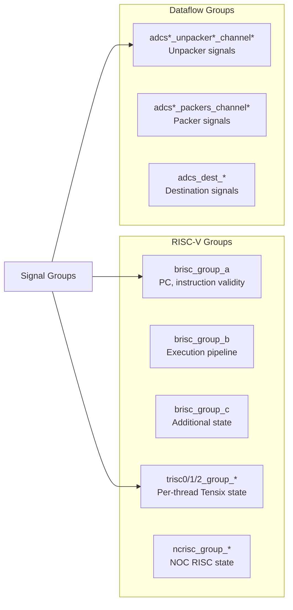
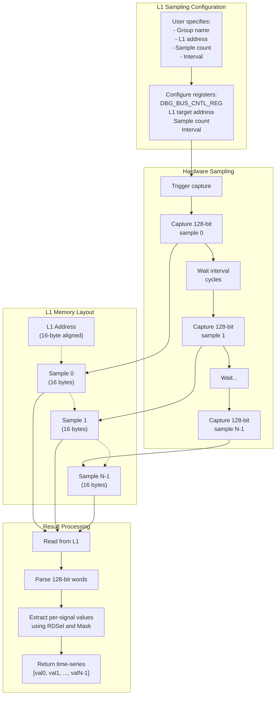

# Debug Bus System

Relevant source files
*   [docs/ttexalens-app-docs.md](https://github.com/tenstorrent/tt-exalens/blob/046c35eb/docs/ttexalens-app-docs.md?plain=1)
*   [docs/ttexalens-lib-docs.md](https://github.com/tenstorrent/tt-exalens/blob/046c35eb/docs/ttexalens-lib-docs.md?plain=1)
*   [test/wheel/run-wheel.sh](https://github.com/tenstorrent/tt-exalens/blob/046c35eb/test/wheel/run-wheel.sh)
*   [ttexalens/__init__.py](https://github.com/tenstorrent/tt-exalens/blob/046c35eb/ttexalens/__init__.py)
*   [ttexalens/coordinate.py](https://github.com/tenstorrent/tt-exalens/blob/046c35eb/ttexalens/coordinate.py)
*   [ttexalens/device.py](https://github.com/tenstorrent/tt-exalens/blob/046c35eb/ttexalens/device.py)
*   [ttexalens/util.py](https://github.com/tenstorrent/tt-exalens/blob/046c35eb/ttexalens/util.py)

## Purpose and Scope

The Debug Bus System provides real-time access to internal hardware signals on Tenstorrent devices, enabling low-level debugging and performance analysis. This system allows inspection of RISC-V core state, memory controller activity, dataflow operations, and other hardware subsystems without requiring firmware modifications or invasive probes.

This page covers signal definitions, signal groups, access modes (direct and L1 sampling), and the API/CLI interfaces. For Tensix-specific debugging features like register file inspection, see [Tensix Core Debugging](https://deepwiki.com/tenstorrent/tt-exalens/7.6-tensix-core-debugging). For RISC-V execution control, see [RISC-V Debugging System](https://deepwiki.com/tenstorrent/tt-exalens/6-risc-v-debugging-system).

Sources: [docs/ttexalens-app-docs.md 171-396](https://github.com/tenstorrent/tt-exalens/blob/046c35eb/docs/ttexalens-app-docs.md?plain=1#L171-L396)[ttexalens/debug_tensix.py 1-356](https://github.com/tenstorrent/tt-exalens/blob/046c35eb/ttexalens/debug_tensix.py#L1-L356)




Sources: [ttexalens/register_store.py:1-20](), [ttexalens/hardware/tensix_registers_description.py](), [ttexalens/hardware/wormhole/functional_worker_registers.py:1-15](), [ttexalens/hardware/blackhole/functional_worker_registers.py:1-15]()

---
```
## System Architecture

The Debug Bus System consists of signal descriptions managed through device-specific implementations, accessed via CLI commands or Python API calls. The system provides two access modes: direct register reads and L1 memory sampling.

**Debug Bus System Architecture**

The system is accessed through the `Device` class hierarchy which provides `get_tensix_debug_bus_description()` method [ttexalens/device.py 396-398](https://github.com/tenstorrent/tt-exalens/blob/046c35eb/ttexalens/device.py#L396-L398) This returns a `TensixDebugBusDescription` object containing predefined signal mappings and signal group definitions. Signals are specified by routing parameters (daisy_id, rd_sel, sig_sel, mask) and accessed through the `RegisterStore` abstraction [ttexalens/register_store.py 169-362](https://github.com/tenstorrent/tt-exalens/blob/046c35eb/ttexalens/register_store.py#L169-L362) Access can be direct (single 32-bit read) or through L1 sampling (multiple 128-bit captures to memory).

Sources: [ttexalens/device.py 19-398](https://github.com/tenstorrent/tt-exalens/blob/046c35eb/ttexalens/device.py#L19-L398)[ttexalens/register_store.py 169-362](https://github.com/tenstorrent/tt-exalens/blob/046c35eb/ttexalens/register_store.py#L169-L362)[docs/ttexalens-app-docs.md 171-396](https://github.com/tenstorrent/tt-exalens/blob/046c35eb/docs/ttexalens-app-docs.md?plain=1#L171-L396)




**Debug Bus System Architecture**

The system is accessed through the `Device` class hierarchy which provides `get_tensix_debug_bus_description()` method [ttexalens/device.py:396-398](). This returns a `TensixDebugBusDescription` object containing predefined signal mappings and signal group definitions. Signals are specified by routing parameters (daisy_id, rd_sel, sig_sel, mask) and accessed through the `RegisterStore` abstraction [ttexalens/register_store.py:169-362](). Access can be direct (single 32-bit read) or through L1 sampling (multiple 128-bit captures to memory).

Sources: [ttexalens/device.py:19,396-398](), [ttexalens/register_store.py:169-362](), [docs/ttexalens-app-docs.md:171-396]()
```



## Signal Descriptions

### Signal Description Format

Each debug bus signal is identified by a hardware routing descriptor with four components:

| Component | Description | Range |
| --- | --- | --- |
| `DaisyId` | Daisy chain identifier routing to specific hardware block | Hardware-specific |
| `RDSel` | Selects which 32-bit slice of a 128-bit register to read | 0-3 |
| `SigSel` | Selects which 128-bit register within the block | Hardware-specific |
| `Mask` | 32-bit mask for extracting significant bits (optional) | 0x0 - 0xFFFFFFFF |

Custom signals can be specified in CLI using the format `{DaisyId,RDSel,SigSel,Mask}` where the mask component is optional (defaults to 0xFFFFFFFF).

**Example Custom Signal:**

Sources: [docs/ttexalens-app-docs.md 200-389](https://github.com/tenstorrent/tt-exalens/blob/046c35eb/docs/ttexalens-app-docs.md?plain=1#L200-L389)

### Predefined Signals

The system includes hundreds of predefined signals with human-readable names covering:

*   **RISC-V Core State**: `brisc_pc`, `trisc0_pc`, `ncrisc_id_ex_pc`, etc.
*   **Memory Activity**: `brisc_dbg_obs_mem_addr`, `brisc_dbg_obs_mem_rden`, etc.
*   **Instruction Flow**: `brisc_i_instrn`, `trisc0_i_instrn_vld`, etc.
*   **Register Window Counters**: `rwc0_srca`, `rwc1_srcb`, `rwc2_dst`, etc.
*   **Dataflow Signals**: Various unpacker, packer, and compute pipeline signals

Predefined signal names can be discovered using `debug-bus list-signals` with optional wildcard search patterns.

Sources: [docs/ttexalens-app-docs.md 218-289](https://github.com/tenstorrent/tt-exalens/blob/046c35eb/docs/ttexalens-app-docs.md?plain=1#L218-L289)[test/ttexalens/unit_tests/test_tensix_debug.py 185-214](https://github.com/tenstorrent/tt-exalens/blob/046c35eb/test/ttexalens/unit_tests/test_tensix_debug.py#L185-L214)

### Signal Groups

Related signals are organized into predefined groups for convenient monitoring:

**Signal Group Organization**

Groups provide logical organization of related signals for common debugging tasks. For example, `brisc_group_a` contains signals for monitoring BRISC execution state, while `adcs0_unpacker0_channel0` contains signals for the first unpacker channel.

Sources: [docs/ttexalens-app-docs.md 291-332](https://github.com/tenstorrent/tt-exalens/blob/046c35eb/docs/ttexalens-app-docs.md?plain=1#L291-L332)[docs/ttexalens-app-docs.md 186-191](https://github.com/tenstorrent/tt-exalens/blob/046c35eb/docs/ttexalens-app-docs.md?plain=1#L186-L191)




**Signal Group Organization**

Groups provide logical organization of related signals for common debugging tasks. For example, `brisc_group_a` contains signals for monitoring BRISC execution state, while `adcs0_unpacker0_channel0` contains signals for the first unpacker channel.

Sources: [docs/ttexalens-app-docs.md:291-332](), [docs/ttexalens-app-docs.md:186-191]()
```
## Reading Signals

### Direct Read Mode

Direct read mode performs immediate 32-bit register reads for single-sample signal inspection:

**Direct Read Sequence**

Direct reads are suitable for occasional signal checks and interactive debugging. The routing configuration (DaisyId, SigSel, RDSel) is written to the debug bus control register, then the result is read from the data register. The `RegisterStore` class [ttexalens/register_store.py 286-317](https://github.com/tenstorrent/tt-exalens/blob/046c35eb/ttexalens/register_store.py#L286-L317) handles the low-level register access, automatically managing NOC routing and register protocols.

Sources: [ttexalens/register_store.py 286-317](https://github.com/tenstorrent/tt-exalens/blob/046c35eb/ttexalens/register_store.py#L286-L317)[docs/ttexalens-app-docs.md 372-389](https://github.com/tenstorrent/tt-exalens/blob/046c35eb/docs/ttexalens-app-docs.md?plain=1#L372-L389)

### L1 Sampling Mode

L1 sampling mode captures multiple 128-bit signal snapshots to L1 memory, enabling time-series analysis:

**Key Features:**

*   **128-bit Capture**: Each sample captures all four 32-bit slices (RDSel 0-3) simultaneously
*   **Multiple Samples**: Configurable sample count via `--samples` option (default: 1)
*   **Sample Interval**: Delay between samples in clock cycles via `--sampling-interval` (range: 2-256, default: 2)
*   **L1 Storage**: Samples written to specified L1 address (must be 16-byte aligned)
*   **Address Range**: 0x0 - 0xFFFFF (first 1 MiB of L1)
*   **Sample Size**: 16 bytes per sample

**L1 Sampling Mode Data Flow**

L1 sampling is essential for observing signal changes over time, detecting transient conditions, and analyzing temporal relationships between signals. The hardware automatically captures samples at the configured interval and stores them sequentially in L1 memory.

**Example:** Monitoring BRISC program counter evolution:

```
debug-bus group brisc_group_a 0x1000 --samples 4 --sampling-interval 10
```

This captures 4 snapshots of all signals in `brisc_group_a`, spaced 10 clock cycles apart, starting at L1 address 0x1000 (using 64 bytes total).

Sources: [docs/ttexalens-app-docs.md 192-370](https://github.com/tenstorrent/tt-exalens/blob/046c35eb/docs/ttexalens-app-docs.md?plain=1#L192-L370)




**L1 Sampling Mode Data Flow**

L1 sampling is essential for observing signal changes over time, detecting transient conditions, and analyzing temporal relationships between signals. The hardware automatically captures samples at the configured interval and stores them sequentially in L1 memory.

**Example:** Monitoring BRISC program counter evolution:
```
debug-bus group brisc_group_a 0x1000 --samples 4 --sampling-interval 10
```

This captures 4 snapshots of all signals in `brisc_group_a`, spaced 10 clock cycles apart, starting at L1 address 0x1000 (using 64 bytes total).

Sources: [docs/ttexalens-app-docs.md:192-199,333-370]()
```
### Comparison: Direct vs L1 Sampling

| Aspect | Direct Read | L1 Sampling |
| --- | --- | --- |
| Data captured | Single 32-bit value | Multiple 128-bit snapshots |
| Use case | Instant state check | Time-series analysis |
| Hardware access | Immediate register read | Configured capture to memory |
| Overhead | Minimal | Setup + memory read |
| Time resolution | None | Configurable (2-256 cycles) |
| Signal width | 32 bits (one RDSel) | 128 bits (all four RDSels) |
| Memory usage | None | 16 bytes × sample count |

Sources: [docs/ttexalens-app-docs.md 171-396](https://github.com/tenstorrent/tt-exalens/blob/046c35eb/docs/ttexalens-app-docs.md?plain=1#L171-L396)

## CLI Interface

### Command Structure

The `debug-bus` (alias `dbus`) command provides four subcommands:

```
debug-bus list-signals [options]
debug-bus list-groups [options]
debug-bus group <group-name> <l1-address> [options]
debug-bus <signals> [options]
```

**Common Options:**

*   `--device, -d <device-id>`: Target device (default: current device)
*   `--loc, -l <loc>`: Grid location (default: current location)
*   `-s, --simple`: Print simplified output without tables
*   `--search <pattern>`: Filter by wildcard pattern
*   `--max <count>`: Limit search results (default: 10, use "all" for unlimited)

Sources: [docs/ttexalens-app-docs.md 171-395](https://github.com/tenstorrent/tt-exalens/blob/046c35eb/docs/ttexalens-app-docs.md?plain=1#L171-L395)

### Usage Examples

**List signals matching pattern:**

**List all signal groups:**

**Sample signal group to L1:**

**Read specific signals directly:**

**Read custom signal:**

Sources: [docs/ttexalens-app-docs.md 218-389](https://github.com/tenstorrent/tt-exalens/blob/046c35eb/docs/ttexalens-app-docs.md?plain=1#L218-L389)

### Output Formats

**Table format (default):**

```
=== Device 0 - location 0,0)
                      Signals
╭────────────────┬───────────────────────┬─────────╮
│ Group          │ Name                  │ Value   │
├────────────────┼───────────────────────┼─────────┤
│ brisc_group_a  │ brisc_dbg_obs_cmt_pc  │ 0x0     │
│ brisc_group_b  │ brisc_id_ex_pc        │ 0x8     │
│ brisc_group_b  │ brisc_pc              │ 0x8     │
╰────────────────┴───────────────────────┴─────────╯
```

**Simple format (`-s` flag):**

```
device:0 loc:1-2 (0,0)  trisc0_pc: 0x6008
device:0 loc:1-2 (0,0)  trisc1_pc: 0xa000
```

**L1 sampling format (time-series):**

```
╭────────────────────────┬──────────────────────────────────────╮
│ Name                   │ Value                                │
├────────────────────────┼──────────────────────────────────────┤
│ brisc_dbg_obs_cmt_pc   │ [0x0, 0x0, 0x0, 0x0]                 │
│ brisc_dbg_obs_mem_addr │ [0x10000, 0x10000, 0x10000, 0x10000] │
│ brisc_i_instrn_vld     │ [False, False, False, False]         │
╰────────────────────────┴──────────────────────────────────────╯
```

Sources: [docs/ttexalens-app-docs.md 223-370](https://github.com/tenstorrent/tt-exalens/blob/046c35eb/docs/ttexalens-app-docs.md?plain=1#L223-L370)

## Python API

### Accessing Debug Bus

Debug bus functionality is accessed through the `Device` class methods:

Note: The `get_tensix_debug_bus_description()` method is defined as an abstract method in `Device`[ttexalens/device.py 396-398](https://github.com/tenstorrent/tt-exalens/blob/046c35eb/ttexalens/device.py#L396-L398) and implemented by architecture-specific subclasses (`WormholeDevice`, `BlackholeDevice`, `QuasarDevice`).

Sources: [ttexalens/device.py 19-398](https://github.com/tenstorrent/tt-exalens/blob/046c35eb/ttexalens/device.py#L19-L398)

### Reading Signals via RegisterStore

Signal values are read through the `RegisterStore` class which handles low-level register access:

**Key Methods:**

*   `read_register(register_name_or_description)`: Read register value [ttexalens/register_store.py 286-317](https://github.com/tenstorrent/tt-exalens/blob/046c35eb/ttexalens/register_store.py#L286-L317)
*   `write_register(register_name_or_description, value)`: Write register value [ttexalens/register_store.py 319-362](https://github.com/tenstorrent/tt-exalens/blob/046c35eb/ttexalens/register_store.py#L319-L362)
*   `get_register_description(register_name)`: Retrieve register configuration [ttexalens/register_store.py 215-225](https://github.com/tenstorrent/tt-exalens/blob/046c35eb/ttexalens/register_store.py#L215-L225)

**Access Mechanism:**

The `RegisterStore` supports multiple register types [ttexalens/register_store.py 63-160](https://github.com/tenstorrent/tt-exalens/blob/046c35eb/ttexalens/register_store.py#L63-L160):

*   `DebugRegisterDescription`: Direct NOC-accessible debug registers
*   `ConfigurationRegisterDescription`: Indexed configuration registers
*   `RiscControlRegisterDescription`: RISC-V control registers
*   `NocStatusRegisterDescription`: NOC status registers
*   `ArcResetRegisterDescription`: ARC reset registers

For debug bus signals, the control and data registers are accessed via NOC reads/writes to configure signal routing and read values.

Sources: [ttexalens/register_store.py 169-362](https://github.com/tenstorrent/tt-exalens/blob/046c35eb/ttexalens/register_store.py#L169-L362)

### Integration with Tensix Instructions

The debug bus can be used to verify Tensix instruction execution. The `Device` class provides `TensixInstructions` for constructing Tensix operations [ttexalens/device.py 26-65](https://github.com/tenstorrent/tt-exalens/blob/046c35eb/ttexalens/device.py#L26-L65):

The `TensixInstructions` class [ttexalens/device.py 26-65](https://github.com/tenstorrent/tt-exalens/blob/046c35eb/ttexalens/device.py#L26-L65) provides static methods for all supported Tensix operations, which can be executed and verified using debug bus signal monitoring.

Sources: [ttexalens/device.py 26-65](https://github.com/tenstorrent/tt-exalens/blob/046c35eb/ttexalens/device.py#L26-L65)

## Use Cases and Applications

### 1. Execution Monitoring

Monitor RISC-V program counter and instruction flow to verify expected execution paths or detect stalls:

### 2. Memory Access Debugging

Observe memory read/write activity and addresses:

### 3. Dataflow Analysis

Inspect unpacker/packer channel activity and data format configurations:

### 4. Register Window Tracking

Verify Tensix register window counter behavior after instruction injection:

Sources: [test/ttexalens/unit_tests/test_tensix_debug.py 199-214](https://github.com/tenstorrent/tt-exalens/blob/046c35eb/test/ttexalens/unit_tests/test_tensix_debug.py#L199-L214)[docs/ttexalens-app-docs.md 171-396](https://github.com/tenstorrent/tt-exalens/blob/046c35eb/docs/ttexalens-app-docs.md?plain=1#L171-L396)

## Hardware Constraints and Limitations

### Address Alignment

*   L1 sampling addresses must be 16-byte aligned
*   Samples must fit within the first 1 MiB of L1 (0x0 - 0xFFFFF)
*   Each sample consumes 16 bytes (128 bits)

### Sampling Interval

*   Minimum interval: 2 clock cycles
*   Maximum interval: 256 clock cycles
*   Actual timing depends on hardware clock frequency

### Signal Availability

*   Not all signals are available on all architectures (Wormhole, Blackhole, Quasar)
*   Signal definitions are architecture-specific
*   Predefined signal lists vary by device type

### Concurrent Access

*   Debug bus access is per-location (per `NocBlock`)
*   Multiple signals can be read from the same location
*   L1 sampling temporarily uses L1 memory which must not be overwritten by firmware

Sources: [docs/ttexalens-app-docs.md 192-214](https://github.com/tenstorrent/tt-exalens/blob/046c35eb/docs/ttexalens-app-docs.md?plain=1#L192-L214)

## Implementation Notes

### DebugBusSignalDescription Class

Referenced in [test/ttexalens/unit_tests/test_lib.py 23-447](https://github.com/tenstorrent/tt-exalens/blob/046c35eb/test/ttexalens/unit_tests/test_lib.py#L23-L447) this class encapsulates:

*   `daisy_id`: Hardware block routing
*   `rd_sel`: 32-bit slice selector (0-3)
*   `sig_sel`: Register selector
*   `mask`: Bit extraction mask

Invalid signal descriptions raise `TTException` when used with register access functions.

### Register Access

Debug bus signals are accessed through debug registers:

*   `RISCV_DEBUG_REG_DBG_BUS_CNTL_REG`: Control/routing register
*   `RISCV_DEBUG_REG_DBG_BUS_DATA_REG`: Data read register (implied)

These are accessed via the `RegisterStore` abstraction, which handles NOC routing and register protocol.

### Architecture-Specific Behavior

The debug bus implementation may vary across Tenstorrent architectures. The system abstracts these differences through device-specific classes (`WormholeDevice`, `BlackholeDevice`, `QuasarDevice`) which provide appropriate signal definitions.

Sources: [test/ttexalens/unit_tests/test_lib.py 23-447](https://github.com/tenstorrent/tt-exalens/blob/046c35eb/test/ttexalens/unit_tests/test_lib.py#L23-L447)[ttexalens/debug_tensix.py 12-71](https://github.com/tenstorrent/tt-exalens/blob/046c35eb/ttexalens/debug_tensix.py#L12-L71)

Dismiss
Refresh this wiki

Enter email to refresh
