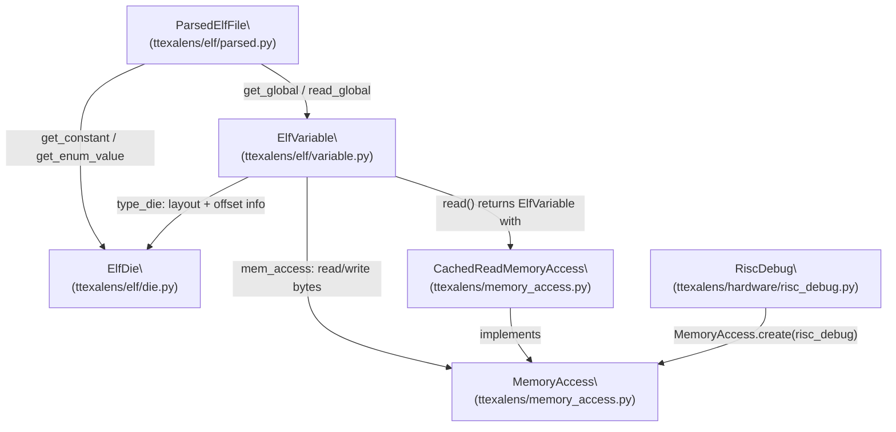
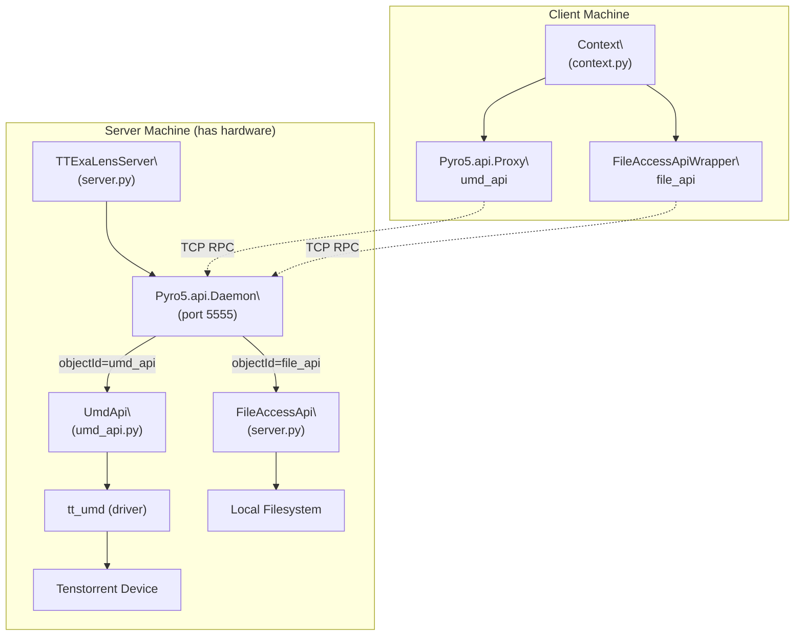

# Build System Architecture

Relevant source files
*   [.gitignore](https://github.com/tenstorrent/tt-exalens/blob/046c35eb/.gitignore)
*   [CMakeLists.txt](https://github.com/tenstorrent/tt-exalens/blob/046c35eb/CMakeLists.txt)
*   [cmake/sfpi_release.cmake](https://github.com/tenstorrent/tt-exalens/blob/046c35eb/cmake/sfpi_release.cmake)
*   [docs/gdb.md](https://github.com/tenstorrent/tt-exalens/blob/046c35eb/docs/gdb.md?plain=1)
*   [riscv-src/CMakeLists.txt](https://github.com/tenstorrent/tt-exalens/blob/046c35eb/riscv-src/CMakeLists.txt)

This page documents the build system for TTExaLens, covering the CMake configuration, Makefile targets, Python wheel packaging, and the dependency management chain. The build system has two distinct modes: a **development build** that compiles RISC-V kernels used by tests, and a **wheel build** that packages the Python library and the GDB binary for distribution.

For information on the CI/CD pipeline that consumes these build artifacts, see [8.4](https://deepwiki.com/tenstorrent/tt-exalens/8.4-cicd-pipeline). For instructions on actually building from source as a developer, see [2.2](https://deepwiki.com/tenstorrent/tt-exalens/2.2-building-from-source).

* * *

## Overview

The build system layers three tools:

| Layer | File | Role |
| --- | --- | --- |
| CMake | `CMakeLists.txt` | Kernel compilation, SFPI download, GDB staging |
| Makefile | `Makefile` | Developer-facing targets wrapping CMake and pip |
| scikit-build-core | `pyproject.toml` | Python wheel packaging driving CMake |

The version number is stored in a single `VERSION` file and read by both CMake [CMakeLists.txt 5-6](https://github.com/tenstorrent/tt-exalens/blob/046c35eb/CMakeLists.txt#L5-L6) and scikit-build-core [pyproject.toml 49-52](https://github.com/tenstorrent/tt-exalens/blob/046c35eb/pyproject.toml#L49-L52)

Sources: `CMakeLists.txt`, `Makefile`, `pyproject.toml`

* * *




Sources: [ttexalens/elf/variable.py:1-25](), [ttexalens/elf/parsed.py:1-30](), [ttexalens/elf/__init__.py:1-21]()

---
```




Sources: [ttexalens/server.py:41-80](), [ttexalens/umd_api.py:44-146](), [ttexalens/cli.py:7-43]()

---
```
## CMake Build System

**Build system entry point:**`CMakeLists.txt`

Requires CMake ≥ 3.22. The project is named `ttexalens` and its version is read directly from the `VERSION` file at configure time [CMakeLists.txt 5-8](https://github.com/tenstorrent/tt-exalens/blob/046c35eb/CMakeLists.txt#L5-L8)

### CMake Options

| Option | Default | Effect |
| --- | --- | --- |
| `BUILD_PYTHON_WHEEL` | `OFF` | When `ON`, skips RISC-V kernel compilation and only downloads SFPI and stages the GDB binary |
| `STRIP_SYMBOLS` | `OFF` | When `ON`, strips debug symbols from the GDB binary after copying it to `build/stripped/` |
| `DUMP_ELFS` | `OFF` | Passed through the Makefile; controls ELF dump output during kernel builds |

Sources: `CMakeLists.txt:12-13`, `Makefile:2`

### SFPI Toolchain

The SFPI toolchain provides the RISC-V cross-compiler (`riscv-tt-elf-gdb`) used for GDB integration. It is downloaded via `cmake/sfpi_release.cmake`, which is included unconditionally [CMakeLists.txt 16](https://github.com/tenstorrent/tt-exalens/blob/046c35eb/CMakeLists.txt#L16-L16)

`SFPI_RELEASE_PATH` is set by `sfpi_release.cmake` and points to the downloaded toolchain directory. The GDB binary path is derived from it [CMakeLists.txt 24](https://github.com/tenstorrent/tt-exalens/blob/046c35eb/CMakeLists.txt#L24-L24)

### RISC-V Kernel Compilation

When `BUILD_PYTHON_WHEEL` is `OFF` (the default for development builds), CMake descends into the `riscv-src/` subdirectory to compile the RISC-V kernels needed by tests [CMakeLists.txt 19-21](https://github.com/tenstorrent/tt-exalens/blob/046c35eb/CMakeLists.txt#L19-L21)

### GDB Binary Staging

Regardless of build mode, the `install-gdb-for-wheel` custom target copies the GDB binary from the SFPI toolchain to `build/stripped/riscv-tt-elf-gdb`[CMakeLists.txt 27-31](https://github.com/tenstorrent/tt-exalens/blob/046c35eb/CMakeLists.txt#L27-L31) When `STRIP_SYMBOLS=ON`, a `strip` command is appended as a post-build step [CMakeLists.txt 34-38](https://github.com/tenstorrent/tt-exalens/blob/046c35eb/CMakeLists.txt#L34-L38)

**Build flow diagram (development mode):**

Sources: `CMakeLists.txt`

### `python_wheel` CMake Component

When `BUILD_PYTHON_WHEEL=ON`, an `install()` rule places the staged GDB binary into `sfpi/compiler/bin` as part of the `python_wheel` component [CMakeLists.txt 42-46](https://github.com/tenstorrent/tt-exalens/blob/046c35eb/CMakeLists.txt#L42-L46) scikit-build-core references this component name in `pyproject.toml` to know which CMake install artifacts to include in the wheel [pyproject.toml 47](https://github.com/tenstorrent/tt-exalens/blob/046c35eb/pyproject.toml#L47-L47)

* * *

## Makefile Targets

The `Makefile` provides developer-facing targets. The build directory defaults to `build` and can be overridden with `BUILD_DIR`.

| Target | Command | Description |
| --- | --- | --- |
| `build` | `make build` | Configures with CMake (using Ninja) and builds all targets |
| `dump_elfs` | `make dump_elfs` | Same as `build` but sets `DUMP_ELFS=ON` |
| `clean` | `make clean` | Removes the `build/` directory entirely |
| `test` | `make test` | Installs all deps, then runs `./test/run_all.sh` |
| `mypy` | `make mypy` | Runs `python3 -m mypy` for static type checking |
| `wheel` | `make wheel` | Builds a Python wheel via `pip wheel --no-deps --no-cache-dir .` into `build/ttexalens_wheel/` |
| `docs` | `make docs` | Included from `docs/module.mk`; regenerates library documentation |

The `build` target detects `ccache` and passes it as a compiler launcher if available [Makefile 6-16](https://github.com/tenstorrent/tt-exalens/blob/046c35eb/Makefile#L6-L16)

Sources: `Makefile`

**Makefile target relationship:**

Sources: `Makefile`

* * *

## Python Packaging: scikit-build-core

The wheel is defined in `pyproject.toml` using `scikit-build-core` as the build backend [pyproject.toml 1-3](https://github.com/tenstorrent/tt-exalens/blob/046c35eb/pyproject.toml#L1-L3)

### scikit-build-core Configuration

```
[tool.scikit-build]
cmake.build-type = "Release"
cmake.args = ["-DBUILD_PYTHON_WHEEL=ON", "-DSTRIP_SYMBOLS=ON"]
wheel.install-dir = "ttexalens"
wheel.packages = ["ttexalens"]
wheel.py-api = "py3"
wheel.platlib = false
experimental = true
install.components = ["python_wheel"]
```

[pyproject.toml 38-47](https://github.com/tenstorrent/tt-exalens/blob/046c35eb/pyproject.toml#L38-L47)

Key points:

*   `cmake.args` always passes `BUILD_PYTHON_WHEEL=ON` and `STRIP_SYMBOLS=ON` when building via `pip wheel` or `pip install`, which skips kernel compilation and strips the GDB binary.
*   `install.components = ["python_wheel"]` tells scikit-build-core to only install the `python_wheel` CMake component (i.e., just the stripped GDB binary, not all installed files).
*   `wheel.platlib = false` produces a pure-Python-tagged wheel despite driving a CMake build (the GDB binary is a bundled resource, not a compiled extension).
*   `wheel.install-dir = "ttexalens"` places CMake-installed files under the `ttexalens/` package directory inside the wheel.

### Version and Dependency Resolution

| Metadata field | Provider |
| --- | --- |
| `version` | `scikit_build_core.metadata.regex` reading `VERSION` file |
| `dependencies` | `pyproject_toml_parse_requirements` reading `ttexalens/requirements.txt` |

[pyproject.toml 49-57](https://github.com/tenstorrent/tt-exalens/blob/046c35eb/pyproject.toml#L49-L57)

### Entry Point

The `tt-exalens` console script is registered at [pyproject.toml 35-36](https://github.com/tenstorrent/tt-exalens/blob/046c35eb/pyproject.toml#L35-L36) and maps to `ttexalens.cli:main`.

Sources: `pyproject.toml`

* * *

## Dependency Management

Three separate requirements files are used:

| File | Scope |
| --- | --- |
| `ttexalens/requirements.txt` | Runtime dependencies (installed with wheel) |
| `ttexalens/dev-requirements.txt` | Development tools (mypy, pre-commit, etc.) |
| `test/test_requirements.txt` | Test-only dependencies (pytest, etc.) |

`scripts/install-deps.sh` installs all three, plus `wheel`, `build`, and `setuptools`. It prefers `uv` over `pip` if available [scripts/install-deps.sh 17-23](https://github.com/tenstorrent/tt-exalens/blob/046c35eb/scripts/install-deps.sh#L17-L23)

The `make test` target calls this script with `TTEXALENS_INSTALL=true TEST_INSTALL=true` before running tests [Makefile 28-30](https://github.com/tenstorrent/tt-exalens/blob/046c35eb/Makefile#L28-L30)

Sources: `scripts/install-deps.sh`, `Makefile`

* * *

## Build Artifact Layout

Sources: `CMakeLists.txt`, `pyproject.toml`, `Makefile`

* * *

## Build Mode Comparison

| Aspect | Development build (`make build`) | Wheel build (`make wheel` / `pip wheel`) |
| --- | --- | --- |
| `BUILD_PYTHON_WHEEL` | `OFF` | `ON` |
| `STRIP_SYMBOLS` | `OFF` | `ON` |
| RISC-V kernels compiled | Yes (`riscv-src/`) | No |
| GDB binary staged | Yes | Yes |
| GDB binary stripped | No | Yes |
| Output | `build/` (kernels + GDB) | `build/ttexalens_wheel/*.whl` |
| Driven by | Makefile → CMake + Ninja | `pip wheel` → scikit-build-core → CMake |

Sources: `CMakeLists.txt`, `Makefile`, `pyproject.toml`

* * *

## System Dependencies

Required system packages for a full development build (as reflected in the CI Dockerfile [.github/Dockerfile.ci 27-35](https://github.com/tenstorrent/tt-exalens/blob/046c35eb/.github/Dockerfile.ci#L27-L35)):

*   `git`
*   `python3`, `python3-pip`
*   `ninja-build`
*   `cmake`

Optional:

*   `ccache` — detected automatically by the Makefile for faster rebuilds [Makefile 6-9](https://github.com/tenstorrent/tt-exalens/blob/046c35eb/Makefile#L6-L9)
*   `rsync`, `gdb`, `libyaml-cpp-dev` — listed in `scripts/setup-dev-env.sh` for additional dev tools [scripts/setup-dev-env.sh 6](https://github.com/tenstorrent/tt-exalens/blob/046c35eb/scripts/setup-dev-env.sh#L6-L6)

Sources: `.github/Dockerfile.ci`, `scripts/setup-dev-env.sh`, `Makefile`

Dismiss
Refresh this wiki

Enter email to refresh
