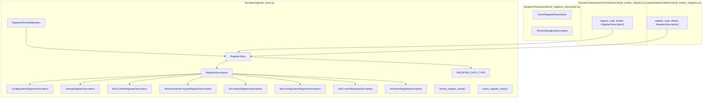
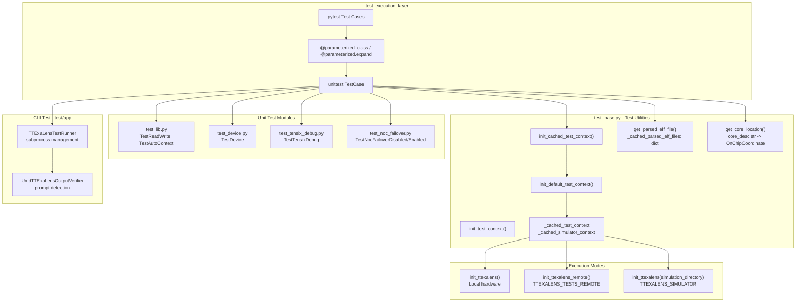
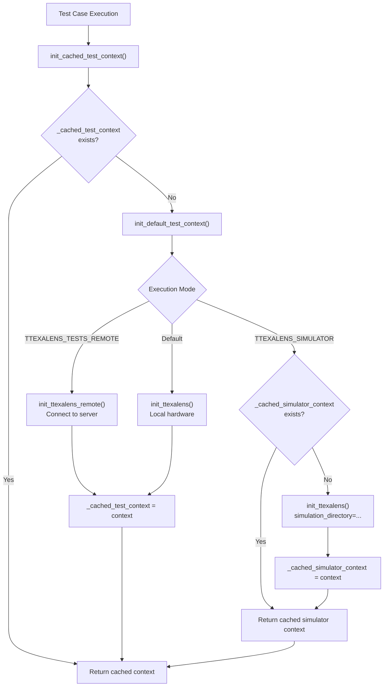
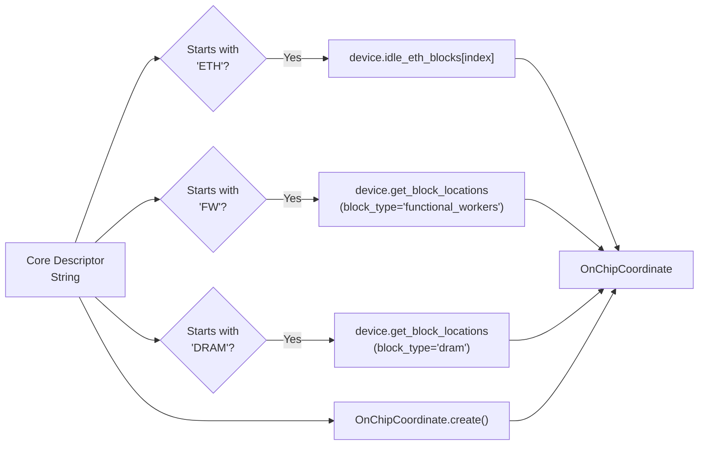
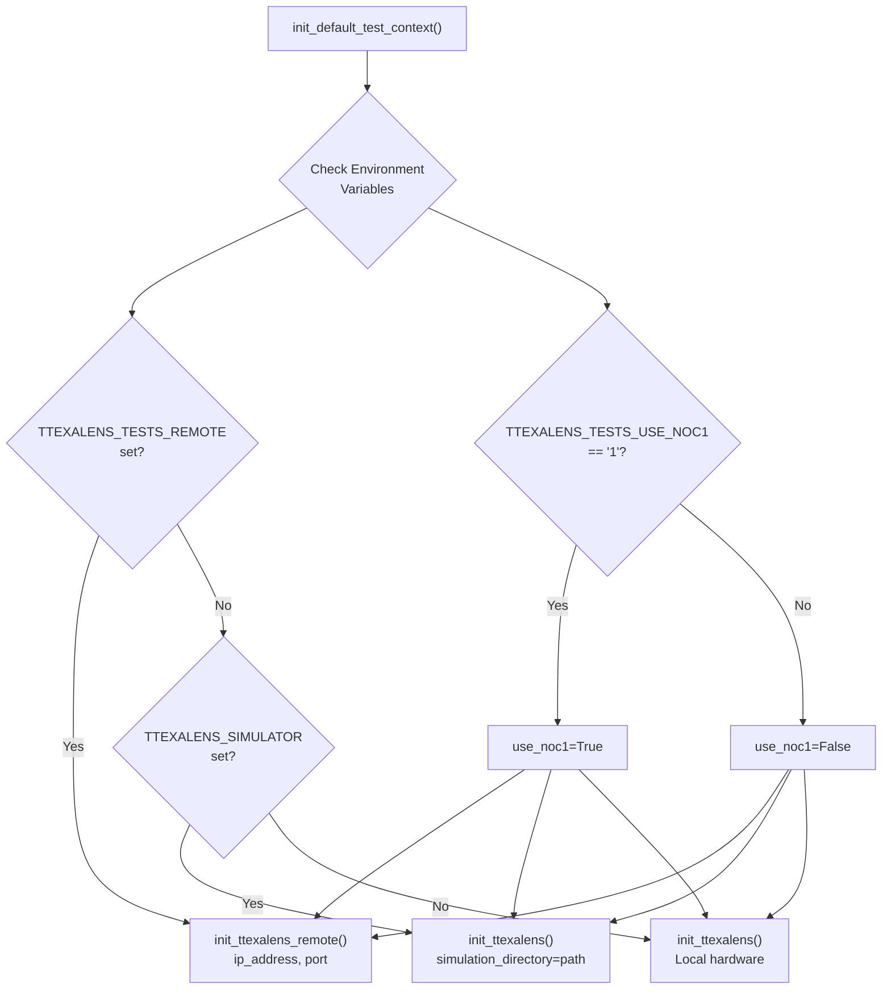
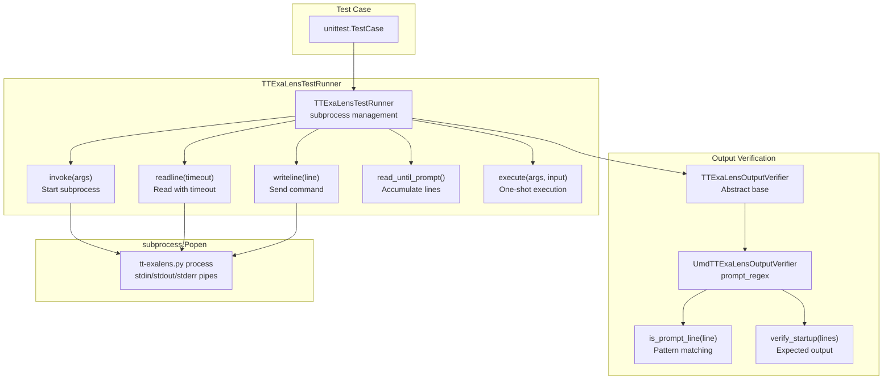
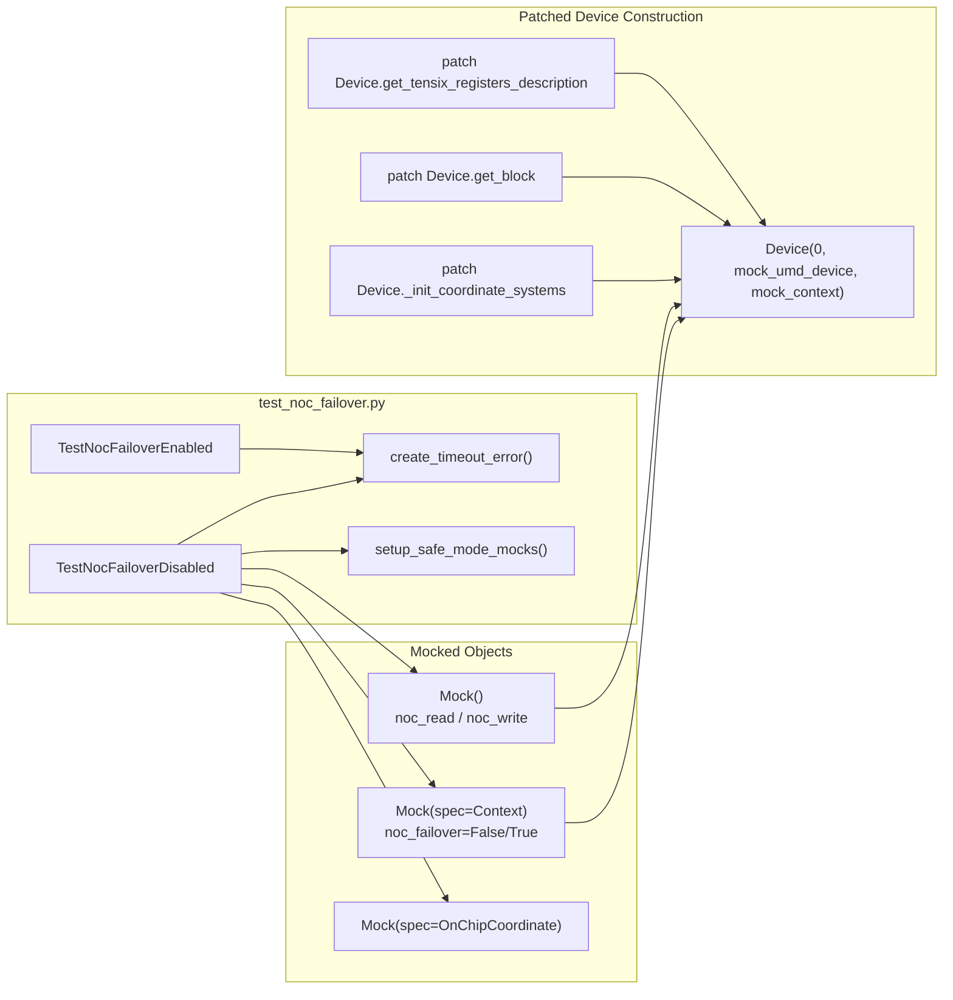
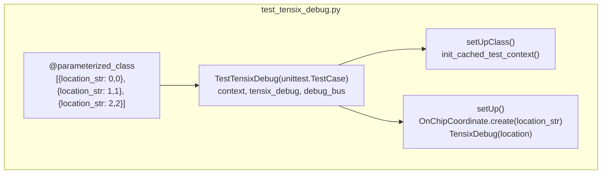
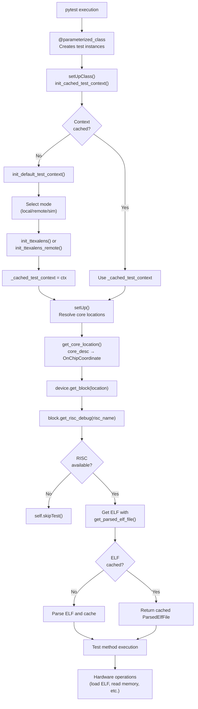

# Testing Framework

Relevant source files
*   [test/app/test_umd_ttexalens.py](https://github.com/tenstorrent/tt-exalens/blob/046c35eb/test/app/test_umd_ttexalens.py)
*   [test/ttexalens/unit_tests/core_simulator.py](https://github.com/tenstorrent/tt-exalens/blob/046c35eb/test/ttexalens/unit_tests/core_simulator.py)
*   [test/ttexalens/unit_tests/program_writer.py](https://github.com/tenstorrent/tt-exalens/blob/046c35eb/test/ttexalens/unit_tests/program_writer.py)
*   [test/ttexalens/unit_tests/test_base.py](https://github.com/tenstorrent/tt-exalens/blob/046c35eb/test/ttexalens/unit_tests/test_base.py)
*   [test/ttexalens/unit_tests/test_l1_mem_access.py](https://github.com/tenstorrent/tt-exalens/blob/046c35eb/test/ttexalens/unit_tests/test_l1_mem_access.py)
*   [test/ttexalens/unit_tests/test_noc_failover.py](https://github.com/tenstorrent/tt-exalens/blob/046c35eb/test/ttexalens/unit_tests/test_noc_failover.py)
*   [test/ttexalens/unit_tests/test_risc_debug.py](https://github.com/tenstorrent/tt-exalens/blob/046c35eb/test/ttexalens/unit_tests/test_risc_debug.py)
*   [ttexalens/context.py](https://github.com/tenstorrent/tt-exalens/blob/046c35eb/ttexalens/context.py)
*   [ttexalens/tt_exalens_init.py](https://github.com/tenstorrent/tt-exalens/blob/046c35eb/ttexalens/tt_exalens_init.py)

## Purpose and Scope

This document describes the testing infrastructure for TTExaLens, including utilities for context initialization, resource caching, test parameterization, and CLI application testing. The testing framework is designed to minimize test execution time through aggressive caching while supporting multiple execution modes (local hardware, remote devices, simulator) and hardware configurations.

For information about the CI/CD pipeline that executes these tests, see [CI/CD Pipeline](https://deepwiki.com/tenstorrent/tt-exalens/8.4-cicd-pipeline). For details on test categories and coverage strategies, see [Test Categories and Coverage](https://deepwiki.com/tenstorrent/tt-exalens/8.3-test-categories-and-coverage).




Sources: [ttexalens/register_store.py:1-20](), [ttexalens/hardware/tensix_registers_description.py](), [ttexalens/hardware/wormhole/functional_worker_registers.py:1-15](), [ttexalens/hardware/blackhole/functional_worker_registers.py:1-15]()

---
```
## Testing Infrastructure Architecture

The testing framework consists of three primary layers: test utilities (context and resource management), test execution modes (local/remote/simulator), and the individual test modules targeting specific subsystems.

**Test infrastructure map**

Sources: [test/ttexalens/unit_tests/test_base.py 1-108](https://github.com/tenstorrent/tt-exalens/blob/046c35eb/test/ttexalens/unit_tests/test_base.py#L1-L108)[test/app/test_umd_ttexalens.py 1-177](https://github.com/tenstorrent/tt-exalens/blob/046c35eb/test/app/test_umd_ttexalens.py#L1-L177)[test/ttexalens/unit_tests/test_lib.py 1-50](https://github.com/tenstorrent/tt-exalens/blob/046c35eb/test/ttexalens/unit_tests/test_lib.py#L1-L50)[test/ttexalens/unit_tests/test_noc_failover.py 1-50](https://github.com/tenstorrent/tt-exalens/blob/046c35eb/test/ttexalens/unit_tests/test_noc_failover.py#L1-L50)




Sources: [test/ttexalens/unit_tests/test_base.py:1-108](), [test/app/test_umd_ttexalens.py:1-177](), [test/ttexalens/unit_tests/test_lib.py:1-50](), [test/ttexalens/unit_tests/test_noc_failover.py:1-50]()
```
## Context Initialization and Caching

The testing framework provides two levels of context initialization: cached and uncached. Context initialization is expensive (device discovery, UMD initialization), so tests share a single cached context when possible.

### Context Caching Mechanism

Sources: [test/ttexalens/unit_tests/test_base.py 9-62](https://github.com/tenstorrent/tt-exalens/blob/046c35eb/test/ttexalens/unit_tests/test_base.py#L9-L62)




Sources: [test/ttexalens/unit_tests/test_base.py:9-62]()
```
### Context Initialization Functions

| Function | Purpose | Caching | Use Case |
| --- | --- | --- | --- |
| `init_cached_test_context()` | Get or create cached context | Global cache | Most unit tests |
| `init_default_test_context()` | Create context based on environment | Stores in cache | Called by `init_cached_test_context()` |
| `init_test_context(use_noc1=False)` | Create context with specific NOC | None (fresh each call) | Tests requiring explicit NOC setting |

The caching strategy prevents multiple expensive UMD initializations when using `@parameterized_class`, which creates separate test class instances for each parameter combination.

**Key implementation details:**

*   **Global cache variables:**`_cached_test_context` and `_cached_simulator_context`[test/ttexalens/unit_tests/test_base.py 12-17](https://github.com/tenstorrent/tt-exalens/blob/046c35eb/test/ttexalens/unit_tests/test_base.py#L12-L17)
*   **Simulator special case:** Simulator contexts are cached separately (`_cached_simulator_context`) to prevent spawning multiple simulator processes [test/ttexalens/unit_tests/test_base.py 36-43](https://github.com/tenstorrent/tt-exalens/blob/046c35eb/test/ttexalens/unit_tests/test_base.py#L36-L43)
*   **NOC1 restriction:** Remote testing with NOC1 is not supported; `init_test_context` asserts against it [test/ttexalens/unit_tests/test_base.py 63-65](https://github.com/tenstorrent/tt-exalens/blob/046c35eb/test/ttexalens/unit_tests/test_base.py#L63-L65)
*   **Initialization parameters:** All test contexts are created with `use_4B_mode=False`, `noc_failover=False`, `safe_mode=False` to minimize interference in tests [test/ttexalens/unit_tests/test_base.py 36-51](https://github.com/tenstorrent/tt-exalens/blob/046c35eb/test/ttexalens/unit_tests/test_base.py#L36-L51)

Sources: [test/ttexalens/unit_tests/test_base.py 24-67](https://github.com/tenstorrent/tt-exalens/blob/046c35eb/test/ttexalens/unit_tests/test_base.py#L24-L67)

## Test Utilities

### Core Location Resolution

The `get_core_location()` function converts human-readable core descriptions to `OnChipCoordinate` objects, abstracting architecture differences.

**Supported Core Descriptors:**

| Descriptor Pattern | Example | Resolution Strategy |
| --- | --- | --- |
| `ETH{index}` | `ETH0` | Query `device.idle_eth_blocks[index].location` |
| `FW{index}` | `FW0`, `FW3` | Query `device.get_block_locations(block_type="functional_workers")[index]` |
| `DRAM{index}` | `DRAM0` | Query `device.get_block_locations(block_type="dram")[index]` |
| Coordinate string | `"1-2"`, `"e1,0"` | Parse via `OnChipCoordinate.create()` |

Sources: [test/ttexalens/unit_tests/test_base.py 70-95](https://github.com/tenstorrent/tt-exalens/blob/046c35eb/test/ttexalens/unit_tests/test_base.py#L70-L95)




Sources: [test/ttexalens/unit_tests/test_base.py:70-95]()
```
### ELF File Caching

The `get_parsed_elf_file()` function provides cached access to `ParsedElfFile` objects, avoiding redundant parsing of the same ELF during test execution.

**Caching Strategy:**

*   Cache key: Absolute ELF file path (string)
*   Cache lifetime: Entire pytest session
*   Invalidation: None (assumes ELF files don't change during test run)

Sources: [test/ttexalens/unit_tests/test_base.py 19-22](https://github.com/tenstorrent/tt-exalens/blob/046c35eb/test/ttexalens/unit_tests/test_base.py#L19-L22)[test/ttexalens/unit_tests/test_base.py 98-108](https://github.com/tenstorrent/tt-exalens/blob/046c35eb/test/ttexalens/unit_tests/test_base.py#L98-L108)

## Test Execution Modes

The testing framework supports three execution modes controlled by environment variables:

### Environment Variable Configuration

| Variable | Values | Effect |
| --- | --- | --- |
| `TTEXALENS_TESTS_REMOTE` | `"1"` | Enable remote testing via Pyro5 |
| `TTEXALENS_TESTS_REMOTE_ADDRESS` | IP address | Remote server address (default: `"localhost"`) |
| `TTEXALENS_TESTS_REMOTE_PORT` | Port number | Remote server port (default: `5555`) |
| `TTEXALENS_SIMULATOR` | Directory path | Enable RTL simulator mode |
| `TTEXALENS_TESTS_USE_NOC1` | `"1"` | Use NOC1 instead of NOC0 |

### Execution Mode Selection Logic

Sources: [test/ttexalens/unit_tests/test_base.py 28-51](https://github.com/tenstorrent/tt-exalens/blob/046c35eb/test/ttexalens/unit_tests/test_base.py#L28-L51)[test/app/test_umd_ttexalens.py 94-101](https://github.com/tenstorrent/tt-exalens/blob/046c35eb/test/app/test_umd_ttexalens.py#L94-L101)




Sources: [test/ttexalens/unit_tests/test_base.py:28-51](), [test/app/test_umd_ttexalens.py:94-101]()
```
## CLI Application Testing

The `TTExaLensTestRunner` class provides infrastructure for testing the `tt-exalens` CLI application by spawning it as a subprocess and interacting with its stdin/stdout.

### TTExaLensTestRunner Architecture

Sources: [test/app/test_umd_ttexalens.py 14-177](https://github.com/tenstorrent/tt-exalens/blob/046c35eb/test/app/test_umd_ttexalens.py#L14-L177)




Sources: [test/app/test_umd_ttexalens.py:14-177]()
```
### Key Methods

**`TTExaLensTestRunner` Methods:**

| Method | Purpose | Parameters | Returns |
| --- | --- | --- | --- |
| `invoke(args)` | Start subprocess | Optional CLI arguments | `subprocess.Popen` |
| `start(tester, args)` | Start and verify startup | Test case, optional args | None (raises on failure) |
| `readline(timeout)` | Read single line | Timeout in seconds | Line string or `None` |
| `writeline(line)` | Send command | Command string | None |
| `read_until_prompt(timeout)` | Read until prompt detected | Readline timeout | `(lines, prompt_or_None)` |
| `execute(args, input, timeout)` | One-shot execution | Args, stdin, timeout | `(stdout_lines, stderr_lines)` |

**`UmdTTExaLensOutputVerifier` properties:**

*   **Prompt pattern:**`r"^(gdb:[^ ]+ )?([[]4B MODE[\]] )?noc:\d+ device:\d+ loc:\d+-\d+ \(\d+,\d+\) > $"`[test/app/test_umd_ttexalens.py 33](https://github.com/tenstorrent/tt-exalens/blob/046c35eb/test/app/test_umd_ttexalens.py#L33-L33)
*   **Startup validation:** Checks for expected output patterns via regex, silently skips known informational messages [test/app/test_umd_ttexalens.py 41-71](https://github.com/tenstorrent/tt-exalens/blob/046c35eb/test/app/test_umd_ttexalens.py#L41-L71)

**Example test:**

The test in `TestUmdTTExaLens.test_startup_and_exit_just_return_code` starts the CLI, sends the exit command (`"x"`), waits for process termination, and asserts a zero return code [test/app/test_umd_ttexalens.py 166-172](https://github.com/tenstorrent/tt-exalens/blob/046c35eb/test/app/test_umd_ttexalens.py#L166-L172)

Sources: [test/app/test_umd_ttexalens.py 73-177](https://github.com/tenstorrent/tt-exalens/blob/046c35eb/test/app/test_umd_ttexalens.py#L73-L177)

## Mock-Based Unit Tests

Some tests do not require real hardware and instead use Python's `unittest.mock` to isolate specific behaviors. The `test_noc_failover.py` module demonstrates this pattern for testing NOC failover logic.

**Mock-based test structure in `TestNocFailoverDisabled` and `TestNocFailoverEnabled`:**

The `create_timeout_error()` helper constructs a `TimeoutDeviceRegisterError` with a valid `tt_umd.CoreCoord` to simulate hardware timeout. The `setup_safe_mode_mocks()` helper configures the `noc_block` attribute chain so that safe-mode validation passes without touching real hardware [test/ttexalens/unit_tests/test_noc_failover.py 14-31](https://github.com/tenstorrent/tt-exalens/blob/046c35eb/test/ttexalens/unit_tests/test_noc_failover.py#L14-L31)

**Test assertions for failover behavior:**

| Test Class | `noc_failover` | Expected behavior |
| --- | --- | --- |
| `TestNocFailoverDisabled` | `False` | `TimeoutDeviceRegisterError` propagates immediately; `noc_read` called exactly once |
| `TestNocFailoverEnabled` | `True` | First call times out, second call on alternate NOC succeeds; `_noc_to_use` rotated |

Sources: [test/ttexalens/unit_tests/test_noc_failover.py 1-175](https://github.com/tenstorrent/tt-exalens/blob/046c35eb/test/ttexalens/unit_tests/test_noc_failover.py#L1-L175)




The `create_timeout_error()` helper constructs a `TimeoutDeviceRegisterError` with a valid `tt_umd.CoreCoord` to simulate hardware timeout. The `setup_safe_mode_mocks()` helper configures the `noc_block` attribute chain so that safe-mode validation passes without touching real hardware [test/ttexalens/unit_tests/test_noc_failover.py:14-31]().

**Test assertions for failover behavior:**

| Test Class | `noc_failover` | Expected behavior |
|------------|----------------|-------------------|
| `TestNocFailoverDisabled` | `False` | `TimeoutDeviceRegisterError` propagates immediately; `noc_read` called exactly once |
| `TestNocFailoverEnabled` | `True` | First call times out, second call on alternate NOC succeeds; `_noc_to_use` rotated |

Sources: [test/ttexalens/unit_tests/test_noc_failover.py:1-175]()
```
## Parameterized Testing Patterns

The testing framework uses the `parameterized` library to run the same test logic across multiple hardware configurations.

### Class-Level Parameterization

The `@parameterized_class` decorator creates separate test class instances for each parameter combination. `TestTensixDebug` uses this to run the same register-file and debug-bus tests at three different core locations:

Each class instance calls `setUpClass()` once per location, but `_cached_test_context` ensures only one UMD initialization occurs across all instances [test/ttexalens/unit_tests/test_base.py 15-17](https://github.com/tenstorrent/tt-exalens/blob/046c35eb/test/ttexalens/unit_tests/test_base.py#L15-L17)

`TestDevice` similarly parameterizes over `device_id` values `[0, 1, 2, 3]`, with `setUp()` calling `self.skipTest()` when the requested device is not present [test/ttexalens/unit_tests/test_device.py 12-33](https://github.com/tenstorrent/tt-exalens/blob/046c35eb/test/ttexalens/unit_tests/test_device.py#L12-L33)

Sources: [test/ttexalens/unit_tests/test_tensix_debug.py 18-43](https://github.com/tenstorrent/tt-exalens/blob/046c35eb/test/ttexalens/unit_tests/test_tensix_debug.py#L18-L43)[test/ttexalens/unit_tests/test_device.py 12-33](https://github.com/tenstorrent/tt-exalens/blob/046c35eb/test/ttexalens/unit_tests/test_device.py#L12-L33)




Each class instance calls `setUpClass()` once per location, but `_cached_test_context` ensures only one UMD initialization occurs across all instances [test/ttexalens/unit_tests/test_base.py:15-17]().

`TestDevice` similarly parameterizes over `device_id` values `[0, 1, 2, 3]`, with `setUp()` calling `self.skipTest()` when the requested device is not present [test/ttexalens/unit_tests/test_device.py:12-33]().

Sources: [test/ttexalens/unit_tests/test_tensix_debug.py:18-43](), [test/ttexalens/unit_tests/test_device.py:12-33]()
```
### Method-Level Parameterization

The `@parameterized.expand` decorator generates individual test methods for each set of arguments. `TestReadWrite` in `test_lib.py` makes heavy use of this pattern:

**Example — read/write buffer sizes and device IDs:**

The `test_write_read_bytes_buffer` method is expanded over 16 combinations of `(location, size, address, device_id)`. Tests that reference an unavailable `device_id` call `self.skipTest()`[test/ttexalens/unit_tests/test_lib.py 147-189](https://github.com/tenstorrent/tt-exalens/blob/046c35eb/test/ttexalens/unit_tests/test_lib.py#L147-L189)

**Example — invalid input validation:**

`test_invalid_inputs_read` is expanded over 7 invalid argument combinations (bad location strings, negative addresses, out-of-range device IDs). Each asserts that `read_words_from_device` and `read_from_device` raise `TTException` or `ValueError`[test/ttexalens/unit_tests/test_lib.py 235-249](https://github.com/tenstorrent/tt-exalens/blob/046c35eb/test/ttexalens/unit_tests/test_lib.py#L235-L249)

**Example — register read/write:**

`test_write_read_tensix_register` is expanded over 8 `(location, register, value)` tuples that cover both `ConfigurationRegisterDescription` and `DebugRegisterDescription` objects as well as string register names [test/ttexalens/unit_tests/test_lib.py 361-395](https://github.com/tenstorrent/tt-exalens/blob/046c35eb/test/ttexalens/unit_tests/test_lib.py#L361-L395)

Sources: [test/ttexalens/unit_tests/test_lib.py 147-249](https://github.com/tenstorrent/tt-exalens/blob/046c35eb/test/ttexalens/unit_tests/test_lib.py#L147-L249)[test/ttexalens/unit_tests/test_lib.py 361-466](https://github.com/tenstorrent/tt-exalens/blob/046c35eb/test/ttexalens/unit_tests/test_lib.py#L361-L466)

### Architecture-Aware Skipping

Test `setUp()` methods can conditionally skip when the current hardware does not support the tested feature. For example, `TestTensixDebug` skips direct register-file read/write tests on non-Blackhole hardware:

```
if not self.is_blackhole():
    self.skipTest("Direct read/write is supported only on Blackhole.")
```

Similarly, `test_unaligned_read_private_memory` skips on Blackhole when `risc_name == "trisc2"` due to a known hardware bug [test/ttexalens/unit_tests/test_lib.py 636-638](https://github.com/tenstorrent/tt-exalens/blob/046c35eb/test/ttexalens/unit_tests/test_lib.py#L636-L638)

Sources: [test/ttexalens/unit_tests/test_tensix_debug.py 44-67](https://github.com/tenstorrent/tt-exalens/blob/046c35eb/test/ttexalens/unit_tests/test_tensix_debug.py#L44-L67)[test/ttexalens/unit_tests/test_lib.py 635-641](https://github.com/tenstorrent/tt-exalens/blob/046c35eb/test/ttexalens/unit_tests/test_lib.py#L635-L641)

## Test Execution Flow




Complete flow from test invocation to hardware interaction:

**Sources:**[test/ttexalens/unit_tests/test_base.py 1-102](https://github.com/tenstorrent/tt-exalens/blob/046c35eb/test/ttexalens/unit_tests/test_base.py#L1-L102)[test/ttexalens/unit_tests/test_coverage.py 31-145](https://github.com/tenstorrent/tt-exalens/blob/046c35eb/test/ttexalens/unit_tests/test_coverage.py#L31-L145)

Dismiss
Refresh this wiki

Enter email to refresh
