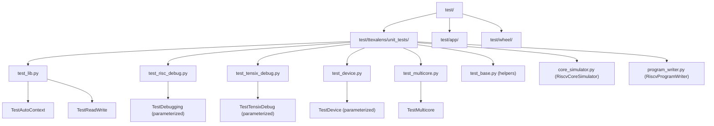
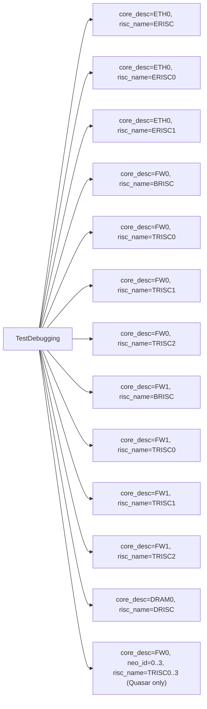
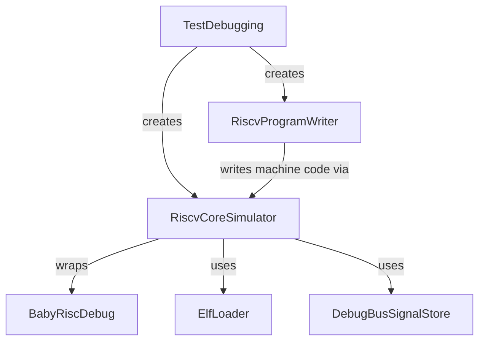
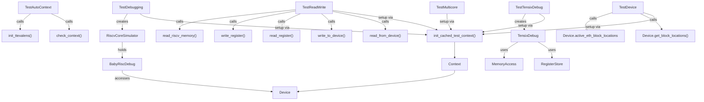

# Test Categories and Coverage

Relevant source files
*   [.github/Dockerfile.ci](https://github.com/tenstorrent/tt-exalens/blob/046c35eb/.github/Dockerfile.ci)
*   [Makefile](https://github.com/tenstorrent/tt-exalens/blob/046c35eb/Makefile)
*   [README.md](https://github.com/tenstorrent/tt-exalens/blob/046c35eb/README.md?plain=1)
*   [scripts/create-venv.sh](https://github.com/tenstorrent/tt-exalens/blob/046c35eb/scripts/create-venv.sh)
*   [scripts/install-deps.sh](https://github.com/tenstorrent/tt-exalens/blob/046c35eb/scripts/install-deps.sh)
*   [scripts/setup-dev-env.sh](https://github.com/tenstorrent/tt-exalens/blob/046c35eb/scripts/setup-dev-env.sh)
*   [test/ttexalens/unit_tests/core_simulator.py](https://github.com/tenstorrent/tt-exalens/blob/046c35eb/test/ttexalens/unit_tests/core_simulator.py)
*   [test/ttexalens/unit_tests/test_risc_debug.py](https://github.com/tenstorrent/tt-exalens/blob/046c35eb/test/ttexalens/unit_tests/test_risc_debug.py)

This page enumerates the test categories in the tt-exalens repository, describes what each covers, identifies which hardware configurations are required, and explains how to run each suite. For information about the test infrastructure utilities (`RiscvCoreSimulator`, `init_cached_test_context`, etc.), see [8.2](https://deepwiki.com/tenstorrent/tt-exalens/8.2-testing-framework). For CI/CD pipeline details, see [8.4](https://deepwiki.com/tenstorrent/tt-exalens/8.4-cicd-pipeline).

* * *

## Test Suite Overview

Tests are organized under the `test/` directory and are discovered by Python's `unittest` discovery mechanism. There are three top-level discovery roots:

| Suite | Discovery Path | Pattern | Description |
| --- | --- | --- | --- |
| Library unit tests | `test/ttexalens/` | `*test*.py` | Tests for the Python library API and hardware interaction |
| CLI app tests | `test/app/` | `*test*.py` | Tests for the `tt-exalens` CLI command interface |
| Wheel tests | `test/wheel/` | (script-driven) | Smoke tests against the installed wheel package |

All library and app tests run twice per hardware target: once using NOC0, and once using NOC1 (controlled by `TTEXALENS_TESTS_USE_NOC1=1`). NOC1 runs are skipped on n300 boards due to a known reboot-triggering bug ([.github/workflows/build-and-test.yml 147-158](https://github.com/tenstorrent/tt-exalens/blob/046c35eb/.github/workflows/build-and-test.yml#L147-L158)).

* * *

## Hardware Configurations

Tests run on three hardware configurations in CI:

| Architecture | Board | Runner Label |
| --- | --- | --- |
| `blackhole` | `p150b` | `tt-ubuntu-2204-p150b-stable` |
| `wormhole_b0` | `n150` | `tt-ubuntu-2204-n150-stable` |
| `wormhole_b0` | `n300` | `tt-ubuntu-2204-n300-stable` |

Each test class uses `self.skipTest()` when the required hardware or core type is not available, so the same test code runs on all three configurations with automatic skipping.

Sources: [.github/workflows/build-and-test.yml 88-108](https://github.com/tenstorrent/tt-exalens/blob/046c35eb/.github/workflows/build-and-test.yml#L88-L108)

* * *

## Test File Map

**Test file and class structure:**

Sources: [test/ttexalens/unit_tests/test_lib.py 1-100](https://github.com/tenstorrent/tt-exalens/blob/046c35eb/test/ttexalens/unit_tests/test_lib.py#L1-L100)[test/ttexalens/unit_tests/test_risc_debug.py 1-80](https://github.com/tenstorrent/tt-exalens/blob/046c35eb/test/ttexalens/unit_tests/test_risc_debug.py#L1-L80)[test/ttexalens/unit_tests/test_tensix_debug.py 1-50](https://github.com/tenstorrent/tt-exalens/blob/046c35eb/test/ttexalens/unit_tests/test_tensix_debug.py#L1-L50)[test/ttexalens/unit_tests/test_device.py 1-52](https://github.com/tenstorrent/tt-exalens/blob/046c35eb/test/ttexalens/unit_tests/test_device.py#L1-L52)[test/ttexalens/unit_tests/test_multicore.py 1-30](https://github.com/tenstorrent/tt-exalens/blob/046c35eb/test/ttexalens/unit_tests/test_multicore.py#L1-L30)

* * *




Sources: [test/ttexalens/unit_tests/test_lib.py:1-100](), [test/ttexalens/unit_tests/test_risc_debug.py:1-80](), [test/ttexalens/unit_tests/test_tensix_debug.py:1-50](), [test/ttexalens/unit_tests/test_device.py:1-52](), [test/ttexalens/unit_tests/test_multicore.py:1-30]()

---
```
## Category 1: Library API Tests (`test_lib.py`)

**File:**`test/ttexalens/unit_tests/test_lib.py`

This category tests the public-facing Python library (`ttexalens.tt_exalens_lib`) and the underlying device interaction layer.

### `TestAutoContext`

Tests global context initialization and reuse through the `check_context` and `init_ttexalens` functions.

| Test | What It Checks |
| --- | --- |
| `test_auto_context` | `check_context()` creates a `Context` when none exists |
| `test_set_global_context` | `init_ttexalens()` sets `GLOBAL_CONTEXT` |
| `test_existing_context` | `check_context()` returns existing `GLOBAL_CONTEXT` instead of creating a new one |

Sources: [test/ttexalens/unit_tests/test_lib.py 45-77](https://github.com/tenstorrent/tt-exalens/blob/046c35eb/test/ttexalens/unit_tests/test_lib.py#L45-L77)

### `TestReadWrite`

Tests the full memory and register access surface of the library. Uses `init_cached_test_context()` for setup. All tests use live hardware.

**Memory read/write tests:**

| Test | Function(s) Exercised | Notes |
| --- | --- | --- |
| `test_write_read` | `write_to_device`, `read_from_device` | Basic byte round-trip |
| `test_write_read_bytes` | `write_to_device`, `read_from_device` | Bytes literal round-trip |
| `test_write_read_data_integrity` | `write_words_to_device`, `read_words_from_device` | Partial-overlap write pattern |
| `test_write_read_bytes_over_dma` | `noc_write`, `noc_read` | DMA path via `dma_threshold=0` vs TLB path |
| `test_write_read_bytes_buffer` (parameterized) | `write_to_device`, `read_words_from_device` | 1–8 KB buffers; tensix and DRAM channel locations; device IDs 0 and 1 |
| `test_write_read_words` | `write_words_to_device`, `read_words_from_device` | Single and multi-word operations |
| `test_write_bytes_read_words` | `write_to_device`, `read_words_from_device` | Cross-mode read consistency |
| `test_unaligned_read` | `read_from_device` | All 1–8 byte sub-word alignments |
| `test_unaligned_write` | `write_to_device` | All 1–6 byte sub-word alignments with surrounding byte verification |

**Register tests:**

| Test | What It Checks |
| --- | --- |
| `test_write_read_tensix_register` (parameterized) | `read_register`/`write_register` with `ConfigurationRegisterDescription`, `DebugRegisterDescription`, and string names |
| `test_write_read_tensix_register_with_name` (parameterized) | Consistency between description-based and name-based register access |
| `test_invalid_write_read_tensix_register` (parameterized) | Error cases: bad location, bad device_id, invalid register type, out-of-range indices/masks/shifts |
| `test_read_write_cfg_register` (parameterized, locations 0,0 / 1,1 / 2,2) | Round-trip writes on `ALU_FORMAT_SPEC_REG2_Dstacc` |
| `test_read_write_dbg_register` (parameterized) | Round-trip writes on `RISCV_DEBUG_REG_CFGREG_RD_CNTL` |
| `test_cfg_register_index_out_of_bounds` (parameterized) | `ValueError` for index above `_max_config_register_index` or negative |

**RISC-V private memory tests:**

| Test | What It Checks |
| --- | --- |
| `test_write_read_private_memory` (parameterized) | `read_riscv_memory`/`write_riscv_memory` inside `ensure_private_memory_access` context; covers brisc, trisc0–2 at multiple locations |
| `test_invalid_read_private_memory` (parameterized) | Error cases: bad location, out-of-range address, invalid `risc_name`, bad `device_id` |
| `test_unaligned_read_private_memory` (parameterized) | All 1–6 byte sub-word alignments in private memory via `read_memory_bytes` |
| `test_unaligned_write_private_memory` (parameterized) | All 1–6 byte sub-word alignments in private memory via `write_memory_bytes` |

> **Note:** Blackhole `trisc2` is skipped for unaligned private memory tests due to a known hardware bug ([test/ttexalens/unit_tests/test_lib.py 637-638](https://github.com/tenstorrent/tt-exalens/blob/046c35eb/test/ttexalens/unit_tests/test_lib.py#L637-L638)).

The file also contains ELF loading tests, callstack tests, GDB server tests, and debug bus signal tests — see the sections below.

Sources: [test/ttexalens/unit_tests/test_lib.py 80-760](https://github.com/tenstorrent/tt-exalens/blob/046c35eb/test/ttexalens/unit_tests/test_lib.py#L80-L760)

* * *

## Category 2: RISC-V Debug Tests (`test_risc_debug.py`)

**File:**`test/ttexalens/unit_tests/test_risc_debug.py`

`TestDebugging` is a `@parameterized_class` that runs every test against every core type on the connected device. Unsupported combinations are gracefully skipped.

### Core Matrix

Sources: [test/ttexalens/unit_tests/test_risc_debug.py 16-47](https://github.com/tenstorrent/tt-exalens/blob/046c35eb/test/ttexalens/unit_tests/test_risc_debug.py#L16-L47)




Sources: [test/ttexalens/unit_tests/test_risc_debug.py:16-47]()
```
### `RiscvCoreSimulator`

Each test case uses a `RiscvCoreSimulator` instance (from `test/ttexalens/unit_tests/core_simulator.py`) and a `RiscvProgramWriter` to generate inline machine code. The simulator wraps `BabyRiscDebug` and provides convenience methods to halt, step, continue, read registers, and verify memory.

Sources: [test/ttexalens/unit_tests/core_simulator.py 17-216](https://github.com/tenstorrent/tt-exalens/blob/046c35eb/test/ttexalens/unit_tests/core_simulator.py#L17-L216)[test/ttexalens/unit_tests/test_risc_debug.py 48-80](https://github.com/tenstorrent/tt-exalens/blob/046c35eb/test/ttexalens/unit_tests/test_risc_debug.py#L48-L80)




Sources: [test/ttexalens/unit_tests/core_simulator.py:17-216](), [test/ttexalens/unit_tests/test_risc_debug.py:48-80]()
```
### Tests in `TestDebugging`

| Test | What It Checks |
| --- | --- |
| `test_default_start_address` | Core starts at `default_code_start_address` when no override is set; fills L1 with `ebreak` instructions and confirms PC landing |
| `test_read_write_gpr` | Write/read all 31 writable GPRs while halted; confirms `zero` register is always 0 |
| `test_read_write_l1_memory` | `read_memory`/`write_memory` at L1 address `0x10000` while core is halted |
| `test_read_write_private_memory` | `read_memory`/`write_memory` in private data memory region; cross-checks via NOC address where available |
| `test_read_write_memory_bytes_aligned` | `read_memory_bytes`/`write_memory_bytes` on word-aligned ranges |
| `test_read_write_memory_bytes_unaligned` (27 parameter combos) | All 1–7 byte sizes at offsets 0–3 within a word; verifies surrounding bytes are not corrupted |
| `test_minimal_run_generated_code` | Runs a generated `store + infinite loop` program and verifies the memory write occurred |
| `test_ebreak` | Core halts at `ebreak`; confirms `is_ebreak_hit()`, PC at instruction after ebreak |
| `test_ebreak_and_step` | Steps through `ebreak`, store, and loop instructions; verifies PC advancement and memory changes |
| `test_continue` | `cont()` resumes after `ebreak` and executes the pending store |
| `test_core_lockup` | Wormhole-specific: confirms that repeated halt/continue on a memory-stalled core eventually raises an exception |
| `test_halt_continue` | Iterative halt/continue loop; verifies memory counter increments between halts |
| `test_halt_status` | Confirms `is_halted()` / `is_ebreak_hit()` transitions correctly across ebreak → continue → halt |
| `test_invalidate_cache` | Writes new instructions after core starts, invalidates instruction cache, confirms new code runs |

Sources: [test/ttexalens/unit_tests/test_risc_debug.py 105-700](https://github.com/tenstorrent/tt-exalens/blob/046c35eb/test/ttexalens/unit_tests/test_risc_debug.py#L105-L700)

* * *

## Category 3: Tensix Debug Tests (`test_tensix_debug.py`)

**File:**`test/ttexalens/unit_tests/test_tensix_debug.py`

`TestTensixDebug` is parameterized over logical core locations `0,0`, `1,1`, and `2,2`. It tests the `TensixDebug` class and the `inject_instruction` / `read_regfile` / `write_regfile` pipeline.

### Tests in `TestTensixDebug`

| Test | What It Checks | Platform |
| --- | --- | --- |
| `test_read_write_regfile_fp32` (parameterized: 1,2,4,8 tiles + special floats) | Round-trip write/read of `DSTACC` in `Float32` format; checks NaN, ±inf, ±0.0 | Blackhole only |
| `test_read_write_regfile_int32` (parameterized: 1,2,4,8 tiles) | Round-trip for `Int32` including min/max boundary values | Blackhole only |
| `test_read_write_regfile_uint32` (parameterized: 1,2,4,8 tiles) | Round-trip for `UInt32` up to `2^32 - 1` | Blackhole only |
| `test_read_write_regfile_int8` (parameterized: 1,2,4,8 tiles) | Round-trip for `Int8` with wrapping values | Blackhole only |
| `test_read_write_regfile_uint8` (parameterized: 1,2,4,8 tiles) | Round-trip for `UInt8` | Blackhole only |
| `test_invalid_write_regfile` (parameterized) | Rejects unsupported formats (`UInt16`, `Float16`, etc.), out-of-range values, and unsupported register files (`SRCA`, `SRCB`) | Blackhole only |
| `test_register_window_counters` (3 value sets) | `inject_instruction(TT_OP_SETRWC)` and reads back `rwc_srca`/`rwc_srcb`/`rwc_dst` signals from `DebugBusSignalStore` | All |

Sources: [test/ttexalens/unit_tests/test_tensix_debug.py 1-215](https://github.com/tenstorrent/tt-exalens/blob/046c35eb/test/ttexalens/unit_tests/test_tensix_debug.py#L1-L215)

* * *

## Category 4: Device Tests (`test_device.py`)

**File:**`test/ttexalens/unit_tests/test_device.py`

`TestDevice` is parameterized over device IDs 0–3. Tests that require an unavailable device ID are skipped.

| Test | What It Checks |
| --- | --- |
| `test_get_active_idle_eth_block_locations` | `active_eth_block_locations` ∪ `idle_eth_block_locations` == `get_block_locations(block_type="eth")`; sets are disjoint |
| `test_get_active_idle_eth_blocks` | Same check but for block objects via `active_eth_blocks` / `idle_eth_blocks` / `get_blocks(block_type="eth")` |

Sources: [test/ttexalens/unit_tests/test_device.py 1-52](https://github.com/tenstorrent/tt-exalens/blob/046c35eb/test/ttexalens/unit_tests/test_device.py#L1-L52)

* * *

## Category 5: Multi-core Tests (`test_multicore.py`)

**File:**`test/ttexalens/unit_tests/test_multicore.py`

`TestMulticore` exercises scenarios involving two RISC cores simultaneously: BRISC and TRISC0 on `FW0`.

| Test | What It Checks |
| --- | --- |
| `test_mailbox_communication_lockup` | BRISC reads a mailbox address in a tight loop while TRISC0 writes to it; verifies that attempting to halt a core waiting on a hardware mailbox raises an exception rather than hanging indefinitely |

The test uses hand-assembled RISC-V machine code written via `RiscvCoreSimulator.write_program()` and `ElfLoader.get_jump_to_offset_instruction()`.

Sources: [test/ttexalens/unit_tests/test_multicore.py 1-102](https://github.com/tenstorrent/tt-exalens/blob/046c35eb/test/ttexalens/unit_tests/test_multicore.py#L1-L102)

* * *

## Category 6: ELF, Callstack, and GDB Tests (in `test_lib.py`)

In addition to memory and register tests, `test_lib.py` contains tests for ELF loading, callstack unwinding, and GDB integration. These appear in `TestReadWrite` and extend into the truncated portion of the file. Imports confirm the coverage:

| Import | Feature Tested |
| --- | --- |
| `from ttexalens.elf.parsed import ParsedElfFile` | ELF parsing and symbolic variable access |
| `from ttexalens.hardware.risc_debug import CallstackEntry, RiscDebug` | Callstack unwinding |
| `from ttexalens.gdb.gdb_client import get_gdb_callstack` | GDB client callstack retrieval |
| `from ttexalens.gdb.gdb_communication import ServerSocket` | GDB server socket |
| `from ttexalens.gdb.gdb_server import GdbServer` | GDB server integration |

Sources: [test/ttexalens/unit_tests/test_lib.py 1-35](https://github.com/tenstorrent/tt-exalens/blob/046c35eb/test/ttexalens/unit_tests/test_lib.py#L1-L35)

* * *

## Category 7: CLI App Tests (`test/app/`)

Discovered via `python3 -m unittest discover -v -t . -s test/app -p *test*.py`. These tests exercise the `tt-exalens` CLI command layer. They run after the library tests on the same hardware targets and also run under `TTEXALENS_TESTS_USE_NOC1=1`.

Sources: [.github/workflows/build-and-test.yml 142-158](https://github.com/tenstorrent/tt-exalens/blob/046c35eb/.github/workflows/build-and-test.yml#L142-L158)

* * *

## Category 8: Wheel Tests (`test/wheel/`)

Run via `test/wheel/run-wheel.sh` after the wheel is installed with `pip install build/ttexalens_wheel/*.whl`. These ensure the installed package works correctly outside the development source tree, confirming the wheel packaging is complete and importable.

Sources: [.github/workflows/build-and-test.yml 160-167](https://github.com/tenstorrent/tt-exalens/blob/046c35eb/.github/workflows/build-and-test.yml#L160-L167)

* * *

## Running the Tests

`# All library unit tests (NOC0)python3 -m xmlrunner discover -v -t . -s test/ttexalens -p '*test*.py' \    --output-file report.xml # All library unit tests (NOC1)TTEXALENS_TESTS_USE_NOC1=1 python3 -m unittest discover -v -t . -s test/ttexalens -p '*test*.py' # CLI app testspython3 -m unittest discover -v -t . -s test/app -p '*test*.py' # Specific test filepython3 -m unittest test.ttexalens.unit_tests.test_risc_debug # Specific test classpython3 -m unittest test.ttexalens.unit_tests.test_tensix_debug.TestTensixDebug # Specific test methodpython3 -m unittest test.ttexalens.unit_tests.test_lib.TestReadWrite.test_unaligned_read`

* * *

## Test Dependencies

From `test/test_requirements.txt`:

| Package | Version | Purpose |
| --- | --- | --- |
| `coverage` | ≥7.5.0 | Python code coverage measurement |
| `pytest` | ≥8.0.1 | Test runner (used alongside `unittest`) |
| `parameterized` | ≥0.9.0 | `@parameterized` and `@parameterized_class` decorators |
| `unittest-xml-reporting` | — | XML report generation for CI (`xmlrunner`) |

Sources: [test/test_requirements.txt 1-4](https://github.com/tenstorrent/tt-exalens/blob/046c35eb/test/test_requirements.txt#L1-L4)

* * *

## Test Infrastructure Diagram




Sources: [test/ttexalens/unit_tests/test_lib.py:80-90](), [test/ttexalens/unit_tests/test_risc_debug.py:56-79](), [test/ttexalens/unit_tests/test_tensix_debug.py:33-43](), [test/ttexalens/unit_tests/test_device.py:27-33](), [test/ttexalens/unit_tests/core_simulator.py:17-51]()
4b:T38b8,
```

**How test classes relate to library and hardware:**

Sources: [test/ttexalens/unit_tests/test_lib.py 80-90](https://github.com/tenstorrent/tt-exalens/blob/046c35eb/test/ttexalens/unit_tests/test_lib.py#L80-L90)[test/ttexalens/unit_tests/test_risc_debug.py 56-79](https://github.com/tenstorrent/tt-exalens/blob/046c35eb/test/ttexalens/unit_tests/test_risc_debug.py#L56-L79)[test/ttexalens/unit_tests/test_tensix_debug.py 33-43](https://github.com/tenstorrent/tt-exalens/blob/046c35eb/test/ttexalens/unit_tests/test_tensix_debug.py#L33-L43)[test/ttexalens/unit_tests/test_device.py 27-33](https://github.com/tenstorrent/tt-exalens/blob/046c35eb/test/ttexalens/unit_tests/test_device.py#L27-L33)[test/ttexalens/unit_tests/core_simulator.py 17-51](https://github.com/tenstorrent/tt-exalens/blob/046c35eb/test/ttexalens/unit_tests/core_simulator.py#L17-L51)

This wiki is featured in the [repository](https://github.com/tenstorrent/tt-exalens/blob/main/README.md)

Dismiss
Refresh this wiki

Enter email to refresh
