# Overview

Relevant source files
*   [.github/workflows/claude-code-review.yml](https://github.com/tenstorrent/tt-forge/blob/6f2d9645/.github/workflows/claude-code-review.yml)
*   [.github/workflows/claude.yml](https://github.com/tenstorrent/tt-forge/blob/6f2d9645/.github/workflows/claude.yml)
*   [CLAUDE.md](https://github.com/tenstorrent/tt-forge/blob/6f2d9645/CLAUDE.md?plain=1)
*   [CONTRIBUTING.md](https://github.com/tenstorrent/tt-forge/blob/6f2d9645/CONTRIBUTING.md?plain=1)
*   [README.md](https://github.com/tenstorrent/tt-forge/blob/6f2d9645/README.md?plain=1)
*   [demos/README.md](https://github.com/tenstorrent/tt-forge/blob/6f2d9645/demos/README.md?plain=1)
*   [docs/src/getting_started.md](https://github.com/tenstorrent/tt-forge/blob/6f2d9645/docs/src/getting_started.md?plain=1)

## Purpose and Scope

TT-Forge is Tenstorrent's open-source AI compiler stack, built on [TT-Metalium](https://github.com/tenstorrent/tt-forge/blob/6f2d9645/TT-Metalium) It serves as the central hub for integrating various AI/ML frameworks (PyTorch, JAX, ONNX) with Tenstorrent hardware. The repository coordinates multiple sub-projects including frontends (TT-XLA, TT-Forge-ONNX), the TT-MLIR compiler, a kernel DSL (TT-Lang), and a model library (TT-Forge-Models) to enable seamless execution of AI workloads on Tenstorrent hardware. [README.md 15-32](https://github.com/tenstorrent/tt-forge/blob/6f2d9645/README.md?plain=1#L15-L32)

This document provides a high-level overview of the TT-Forge repository structure, its major components, and how they interact.

**Sources:**[README.md 15-42](https://github.com/tenstorrent/tt-forge/blob/6f2d9645/README.md?plain=1#L15-L42)[CONTRIBUTING.md 1-12](https://github.com/tenstorrent/tt-forge/blob/6f2d9645/CONTRIBUTING.md?plain=1#L1-L12)

## Repository Role and Architecture

### Central Hub Repository

TT-Forge functions as a meta-repository that orchestrates the development, testing, and release of multiple interconnected projects. It integrates various compiler technologies to enable both model execution and custom kernel generation. [CONTRIBUTING.md 3-11](https://github.com/tenstorrent/tt-forge/blob/6f2d9645/CONTRIBUTING.md?plain=1#L3-L11)

| Sub-Project | Purpose | Key Links |
| --- | --- | --- |
| **TT-XLA** | Primary frontend for PyTorch and JAX using PJRT interface. | [README.md 27](https://github.com/tenstorrent/tt-forge/blob/6f2d9645/README.md?plain=1#L27-L27) |
| **TT-Forge-ONNX** | TVM-based frontend for ONNX, TensorFlow, and PaddlePaddle. | [README.md 28](https://github.com/tenstorrent/tt-forge/blob/6f2d9645/README.md?plain=1#L28-L28) |
| **TT-MLIR** | Core MLIR-based compiler defining TTIR, TTNN, and TTKernel dialects. | [README.md 29](https://github.com/tenstorrent/tt-forge/blob/6f2d9645/README.md?plain=1#L29-L29) |
| **TT-Lang** | Python DSL for high-performance custom kernels. | [README.md 30](https://github.com/tenstorrent/tt-forge/blob/6f2d9645/README.md?plain=1#L30-L30) |
| **TT-Blacksmith** | Optimized training recipes and experiments. | [README.md 31](https://github.com/tenstorrent/tt-forge/blob/6f2d9645/README.md?plain=1#L31-L31) |
| **TT-Forge-Models** | Collection of 800+ validated model variants. | [README.md 32](https://github.com/tenstorrent/tt-forge/blob/6f2d9645/README.md?plain=1#L32-L32) |

**Sources:**[README.md 23-32](https://github.com/tenstorrent/tt-forge/blob/6f2d9645/README.md?plain=1#L23-L32)[CONTRIBUTING.md 3-11](https://github.com/tenstorrent/tt-forge/blob/6f2d9645/CONTRIBUTING.md?plain=1#L3-L11)

### Code Entity Space Mapping

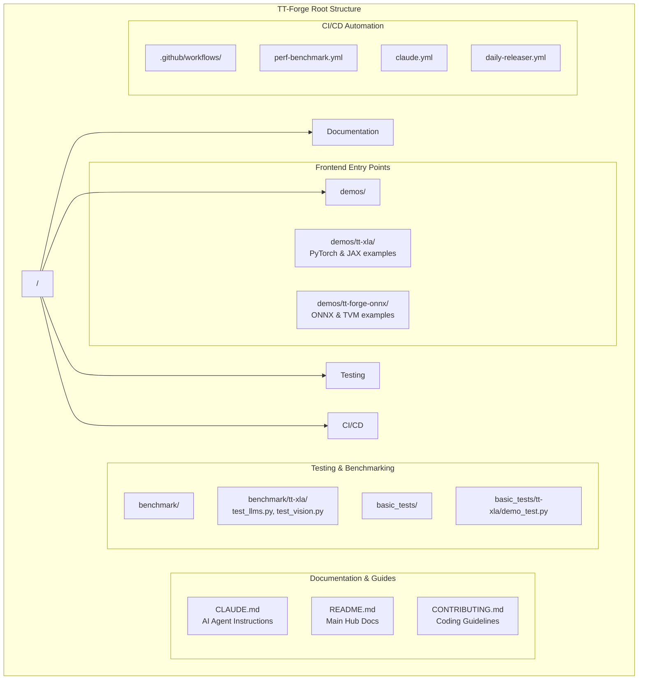


The following diagram maps high-level system components to their specific code entities and directory structures within the TT-Forge ecosystem.

**Sources:**[README.md 23-32](https://github.com/tenstorrent/tt-forge/blob/6f2d9645/README.md?plain=1#L23-L32)[CLAUDE.md 15-55](https://github.com/tenstorrent/tt-forge/blob/6f2d9645/CLAUDE.md?plain=1#L15-L55)[demos/README.md 1-21](https://github.com/tenstorrent/tt-forge/blob/6f2d9645/demos/README.md?plain=1#L1-L21)

## Software Stack Overview

### Multi-Layer Architecture

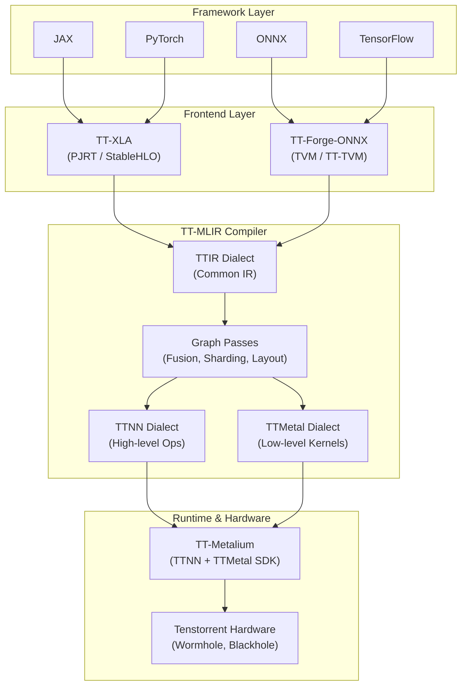


TT-Forge implements a compiler stack architecture that lowers high-level framework code into hardware-specific instructions:

**Sources:**[CLAUDE.md 64-84](https://github.com/tenstorrent/tt-forge/blob/6f2d9645/CLAUDE.md?plain=1#L64-L84)[README.md 27-30](https://github.com/tenstorrent/tt-forge/blob/6f2d9645/README.md?plain=1#L27-L30)[demos/README.md 7-17](https://github.com/tenstorrent/tt-forge/blob/6f2d9645/demos/README.md?plain=1#L7-L17)

### Component Roles

*   **Frontend Layer**: Ingests models. TT-XLA uses PJRT to compile models into StableHLO graphs for JAX and PyTorch. TT-Forge-ONNX uses TVM to optimize graphs for ONNX and TensorFlow. [CLAUDE.md 70-72](https://github.com/tenstorrent/tt-forge/blob/6f2d9645/CLAUDE.md?plain=1#L70-L72)
*   **TT-MLIR Compiler**: Applies optimization passes such as op fusion, sharding, and layout transformation. It lowers code through various dialects: TTIR (Common IR), TTNN (entry to TTNN library), and TTMetal (direct kernel access). [CLAUDE.md 74-79](https://github.com/tenstorrent/tt-forge/blob/6f2d9645/CLAUDE.md?plain=1#L74-L79)
*   **TT-Metalium Layer**: Consists of the TTNN library for neural network operations and the TTMetal SDK for low-level programming. [CLAUDE.md 81](https://github.com/tenstorrent/tt-forge/blob/6f2d9645/CLAUDE.md?plain=1#L81-L81)
*   **Hardware Layer**: Supports Wormhole (N150, N300) and Blackhole (P150B) architectures. [CLAUDE.md 83](https://github.com/tenstorrent/tt-forge/blob/6f2d9645/CLAUDE.md?plain=1#L83-L83)

## AI-Assisted Development

TT-Forge integrates advanced AI automation via Claude Code to assist in model onboarding and code review.

*   **Claude Code Action**: A generic action (`.github/workflows/claude.yml`) triggered by manual prompts or GitHub events (issues, PR comments) to perform tasks using the `anthropic/claude-code-action`. [.github/workflows/claude.yml 1-34](https://github.com/tenstorrent/tt-forge/blob/6f2d9645/.github/workflows/claude.yml#L1-L34)
*   **Authorization**: Access is restricted to organization members, owners, or collaborators. [.github/workflows/claude.yml 64-71](https://github.com/tenstorrent/tt-forge/blob/6f2d9645/.github/workflows/claude.yml#L64-L71)
*   **PR Review**: Automated analysis of PRs for bugs, correctness, and performance using `claude-review`. [.github/workflows/claude-code-review.yml 1-41](https://github.com/tenstorrent/tt-forge/blob/6f2d9645/.github/workflows/claude-code-review.yml#L1-L41)
*   **Tooling**: The agent has access to the GitHub CLI (`gh`) to create issues, view PRs, and monitor CI runs. [.github/workflows/claude.yml 109-123](https://github.com/tenstorrent/tt-forge/blob/6f2d9645/.github/workflows/claude.yml#L109-L123)

**Sources:**[.github/workflows/claude.yml 1-128](https://github.com/tenstorrent/tt-forge/blob/6f2d9645/.github/workflows/claude.yml#L1-L128)[.github/workflows/claude-code-review.yml 1-48](https://github.com/tenstorrent/tt-forge/blob/6f2d9645/.github/workflows/claude-code-review.yml#L1-L48)

## Testing and Validation Infrastructure

### Execution Model

The repository supports multiple testing tiers to ensure stability and performance:

1.   **Basic Tests**: Quick validation for frontends (e.g., `python basic_tests/tt-xla/demo_test.py`). [CLAUDE.md 19-23](https://github.com/tenstorrent/tt-forge/blob/6f2d9645/CLAUDE.md?plain=1#L19-L23)
2.   **Demos**: Real-world examples like ResNet-50 showing end-to-end execution. [README.md 37-71](https://github.com/tenstorrent/tt-forge/blob/6f2d9645/README.md?plain=1#L37-L71)[docs/src/getting_started.md 60-70](https://github.com/tenstorrent/tt-forge/blob/6f2d9645/docs/src/getting_started.md?plain=1#L60-L70)
3.   **Benchmarks**: Comprehensive performance measurement for LLMs and Vision models using `pytest`. [CLAUDE.md 25-46](https://github.com/tenstorrent/tt-forge/blob/6f2d9645/CLAUDE.md?plain=1#L25-L46)
4.   **Performance Workflow**: CI-based performance tracking triggered via `gh workflow run "Performance benchmark"`. [CLAUDE.md 50-55](https://github.com/tenstorrent/tt-forge/blob/6f2d9645/CLAUDE.md?plain=1#L50-L55)

### Hardware Management

For developers working locally, hardware state can be managed via the `tt-smi` tool. If a device hangs (e.g., "Timeout waiting for Ethernet"), it can be reset using `tt-smi --reset 0`. [CLAUDE.md 57-61](https://github.com/tenstorrent/tt-forge/blob/6f2d9645/CLAUDE.md?plain=1#L57-L61)

**Sources:**[CLAUDE.md 15-61](https://github.com/tenstorrent/tt-forge/blob/6f2d9645/CLAUDE.md?plain=1#L15-L61)[docs/src/getting_started.md 40-70](https://github.com/tenstorrent/tt-forge/blob/6f2d9645/docs/src/getting_started.md?plain=1#L40-L70)

Dismiss
Refresh this wiki

Enter email to refresh


### Related: Frontend Layer Architecture

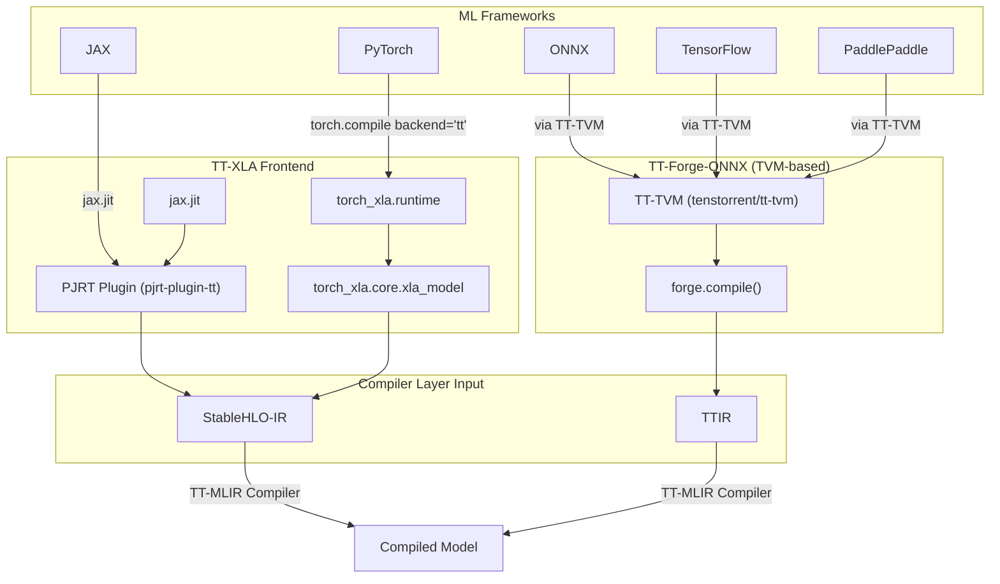

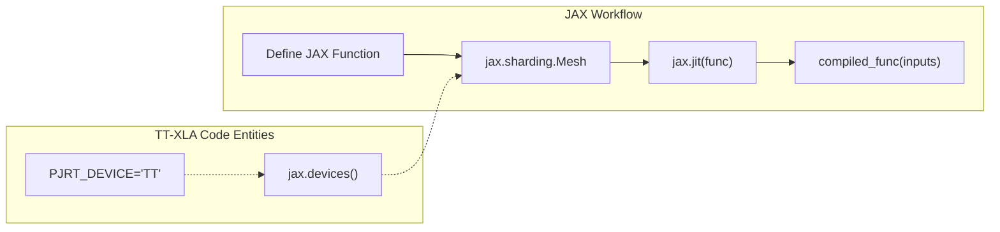

### Related: Compiler Architecture Overview

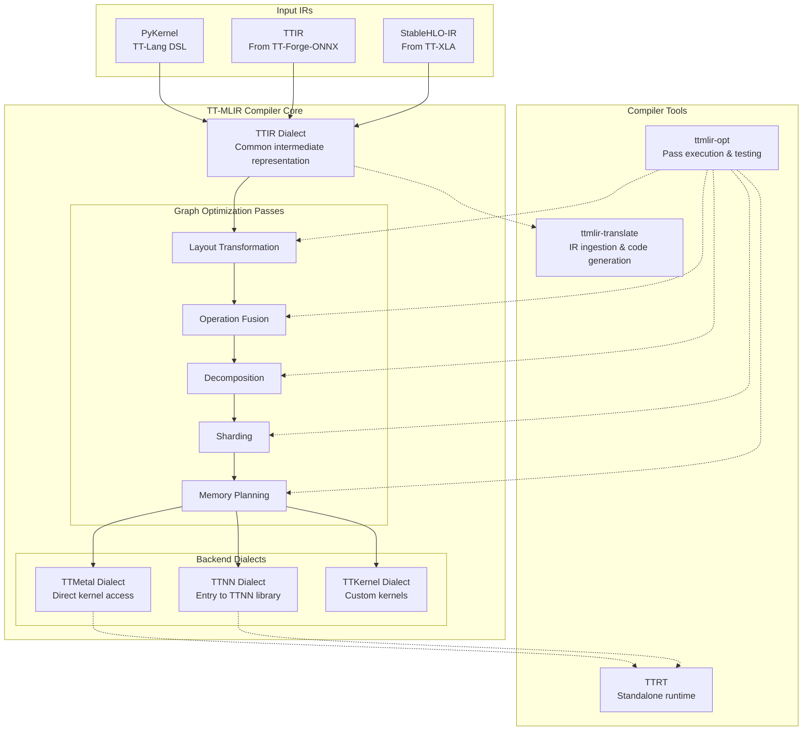

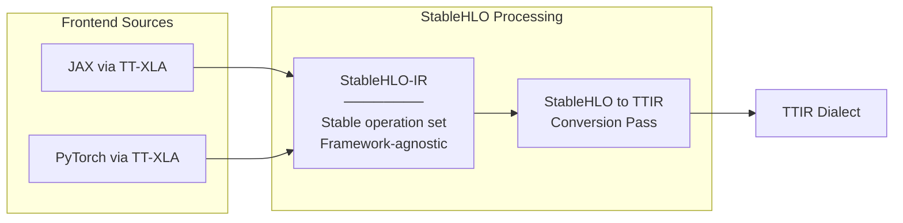

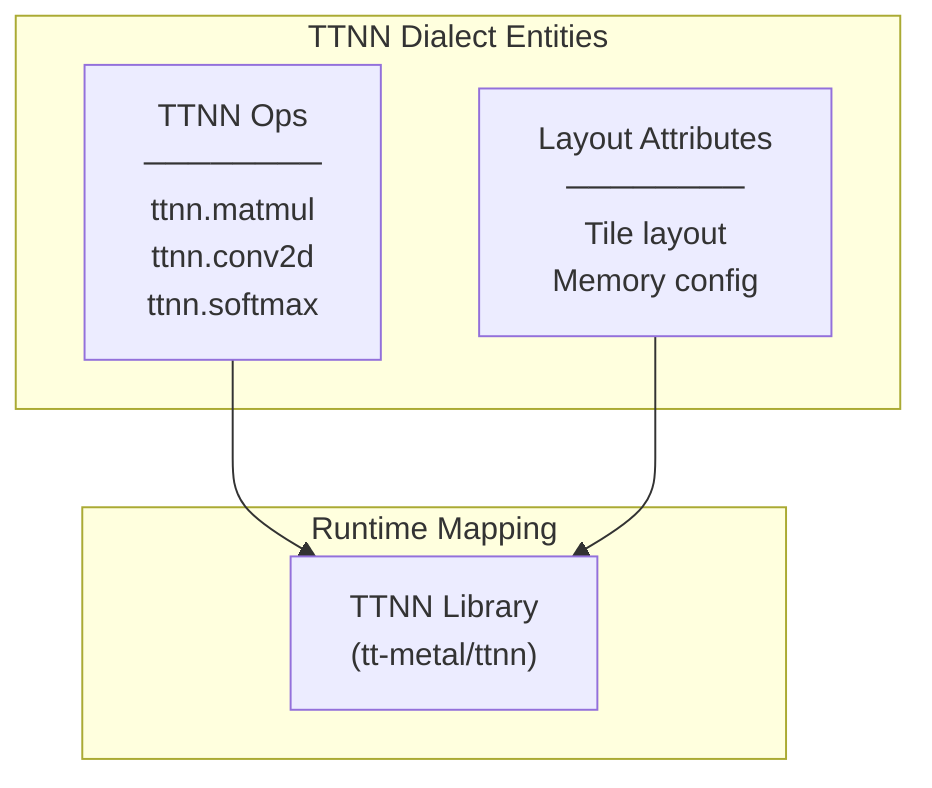

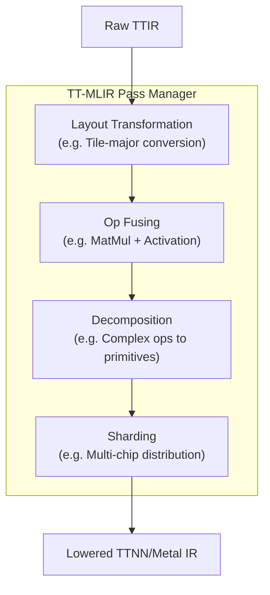

### Related: Layer Hierarchy

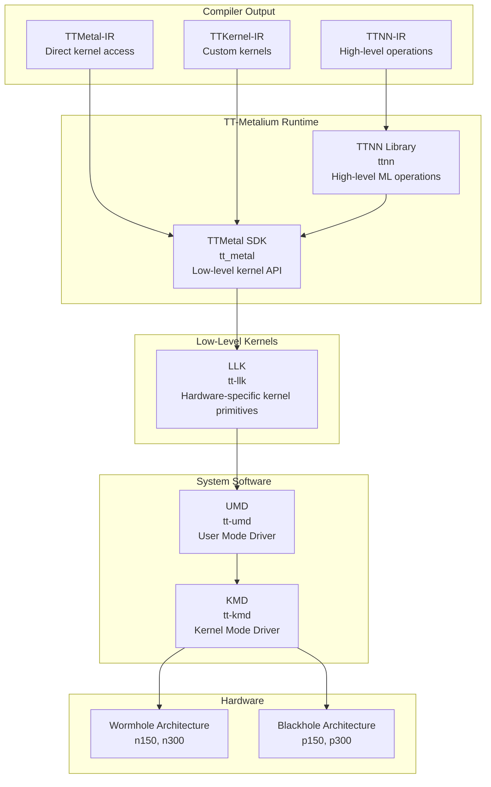

### Related: Runtime Component Interaction

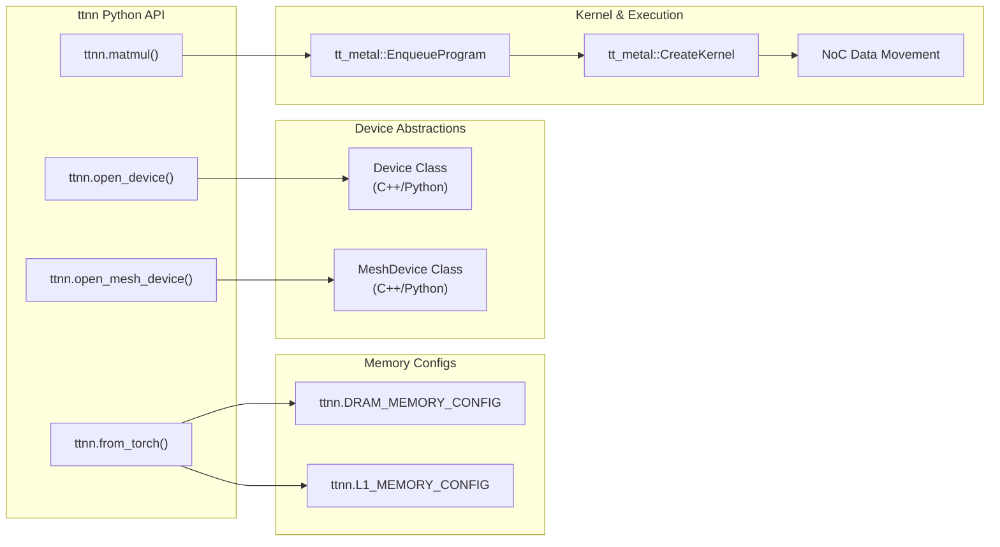

### Related: Workflow Overview

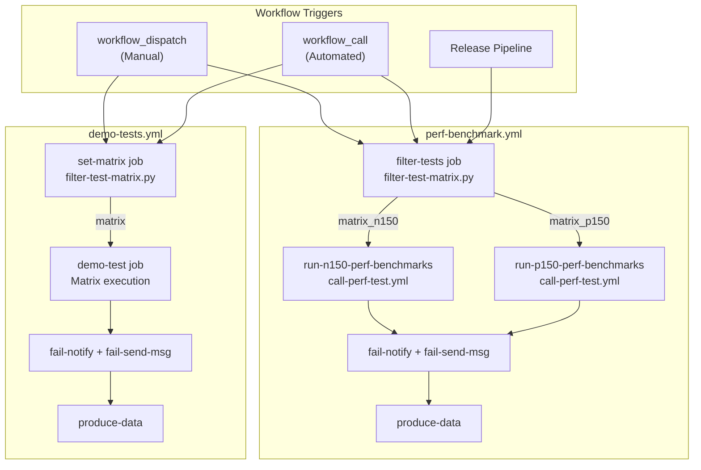

### Related: Demo Execution Architecture

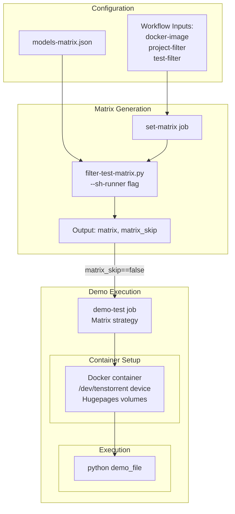

### Related: Model Categories Overview

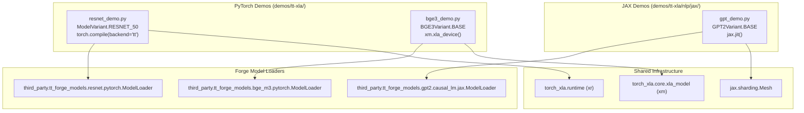

### Related: Code Entity Mapping

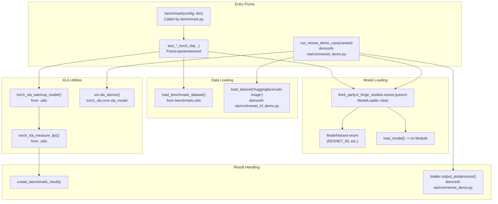

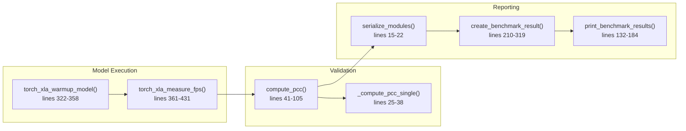

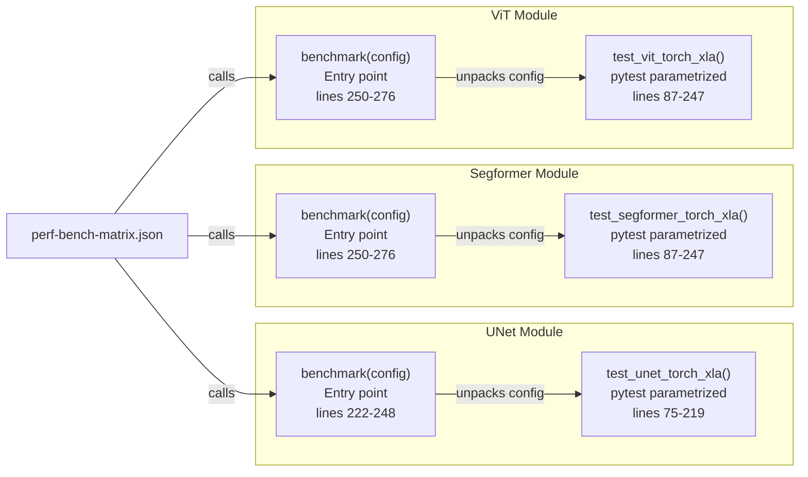

### Related: Architecture

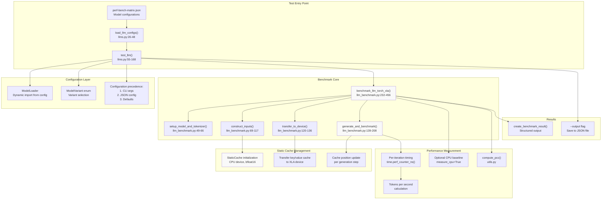

### Related: Execution Phases

```mermaid
graph TB
    subgraph "Phase 1: Setup"
        Params["pytest.mark.parametrize<br/>batch_size, input_size,<br/>loop_count, data_format"]
        LoadInputs["Load/Generate Inputs<br/>load_benchmark_dataset()<br/>or torch.randn()"]
        DataFormat["Convert Data Format<br/>.to(torch.bfloat16)"]
        LoadModel["Load Framework Model<br/>download_model()"]
        ModelFormat["Convert Model Format<br/>.to(torch.bfloat16)"]
    end
    
    subgraph "Phase 2: Compilation"
        CompilerCfg["Create CompilerConfig<br/>MLIRConfig"]
        Compile["forge.compile()<br/>framework_model,<br/>sample_inputs,<br/>compiler_cfg"]
        SaveModel["compiled_model.save()<br/>{model_name}.ttnn"]
    end
    
    subgraph "Phase 3: Device Configuration"
        DevSettings["Create DeviceSettings<br/>enable_program_cache=True"]
        ConfigDev["configure_devices()<br/>device_settings"]
    end
    
    subgraph "Phase 4: Verification"
        VerifyCall["verify()<br/>inputs, framework_model,<br/>compiled_model"]
        PCCCheck["AutomaticValueChecker<br/>pcc=0.97 or 0.99"]
    end
    
    subgraph "Phase 5: Performance Measurement"
        CPUMeasure["measure_cpu_fps()<br/>CPU baseline"]
        StartTimer["start = time.time()"]
        Loop["for i in range(loop_count):<br/>co_out = compiled_model(inputs[i])"]
        EndTimer["end = time.time()"]
        CalcMetrics["total_time = end - start<br/>samples_per_sec"]
    end
    
    subgraph "Phase 6: Evaluation"
        EvalTask{"task type?"}
        Classification["evaluate_classification()<br/>predictions, labels<br/>accuracy"]
        NoEval["evaluation_score = 0.0"]
        FinalVerify["Final PCC Check<br/>fw_out vs co_out"]
    end
    
    subgraph "Phase 7: Results"
        BuildResult["Build result dict<br/>model, measurements,<br/>device_info"]
        ReturnResult["return result"]
    end
    
    Params --> LoadInputs
    LoadInputs --> DataFormat
    DataFormat --> LoadModel
    LoadModel --> ModelFormat
    
    ModelFormat --> CompilerCfg
    CompilerCfg --> Compile
    Compile --> SaveModel
    
    SaveModel --> DevSettings
    DevSettings --> ConfigDev
    
    ConfigDev --> VerifyCall
    VerifyCall --> PCCCheck
    
    PCCCheck --> CPUMeasure
    CPUMeasure --> StartTimer
    StartTimer --> Loop
    Loop --> EndTimer
    EndTimer --> CalcMetrics
    
    CalcMetrics --> EvalTask
    EvalTask -->|classification| Classification
    EvalTask -->|na| NoEval
    Classification --> FinalVerify
    NoEval --> FinalVerify
    
    FinalVerify --> BuildResult
    BuildResult --> ReturnResult
```

### Related: Performance Metrics Overview

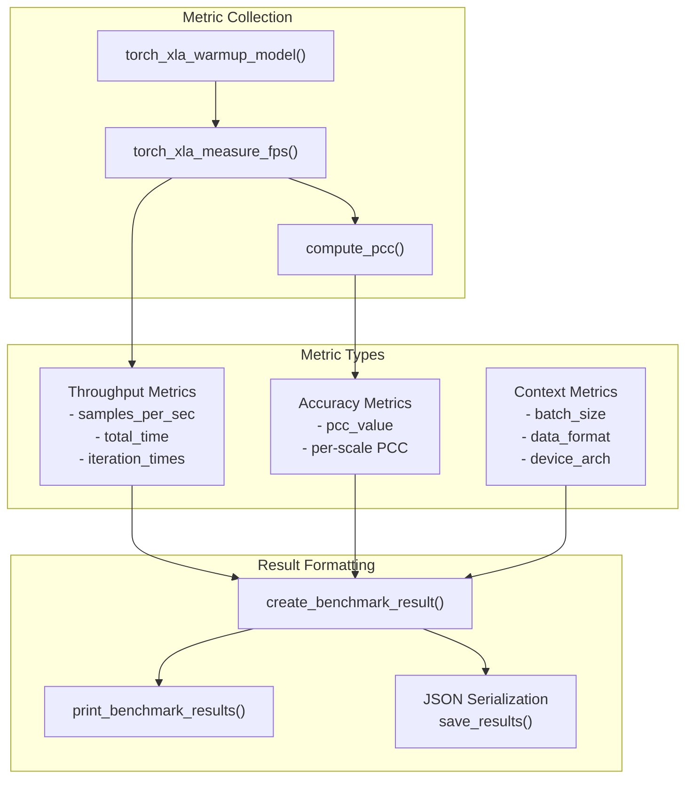

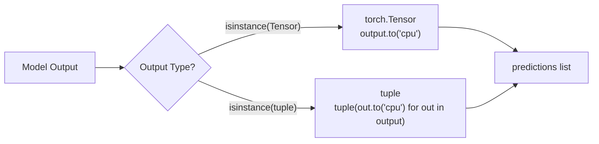

```mermaid
graph TB
    subgraph "Test Workflow Tiers"
        BasicTests["basic-tests.yml<br/>─────────────<br/>Trigger: Pull requests, pushes<br/>Duration: Minutes<br/>Purpose: Rapid smoke testing"]
        DemoTests["demo-tests.yml<br/>─────────────<br/>Trigger: workflow_call, workflow_dispatch<br/>Duration: ~30 minutes<br/>Purpose: End-to-end model validation"]
    end
    
    subgraph "Workflow Invocation Paths"
        PREvent["Pull Request Event"]
        PushEvent["Push to main"]
        DailyReleaser["daily-releaser.yml<br/>Scheduled: 04:00 UTC"]
        ManualDispatch["workflow_dispatch<br/>Manual trigger"]
    end
    
    subgraph "Shared Infrastructure"
        FilterMatrix["filter-test-matrix.py<br/>─────────────<br/>flatten_matrix()<br/>filter_matrix()<br/>update_runners()"]
        MatrixJSON["Test Matrix Files<br/>─────────────<br/>models-matrix.json"]
        
        MatrixJSON --> FilterMatrix
    end
    
    subgraph "Execution Layer"
        RunnerN150["tt-ubuntu-2204-n150-stable<br/>Wormhole hardware"]
        RunnerP150["tt-ubuntu-2204-p150b-stable<br/>Blackhole hardware"]
        DockerContainer["Docker Container<br/>─────────────<br/>Device: /dev/tenstorrent<br/>Volumes: hugepages, modules"]
    end
    
    subgraph "Result Processing"
        FailNotify["fail-notify job<br/>─────────────<br/>re-actors/alls-green@release/v1<br/>Aggregate pass/fail status"]
        FailSendMsg["fail-send-msg job<br/>─────────────<br/>Conditional Slack notification<br/>Channel: C088QN7E0R3"]
        ProduceData["produce-data job<br/>─────────────<br/>Trigger produce_data.yml<br/>Store test results"]
    end
    
    PREvent --> BasicTests
    PushEvent --> BasicTests
    DailyReleaser --> DemoTests
    ManualDispatch --> DemoTests
    
    BasicTests --> FilterMatrix
    DemoTests --> FilterMatrix
    
    FilterMatrix --> RunnerN150
    FilterMatrix --> RunnerP150
    
    RunnerN150 --> DockerContainer
    RunnerP150 --> DockerContainer
    
    DockerContainer --> FailNotify
    FailNotify --> FailSendMsg
    FailSendMsg --> ProduceData
```

### Related: Basic Tests Architecture

```mermaid
graph TB
    subgraph "Workflow Inputs"
        DockerImage["docker-image<br/>Default: tt-forge-slim:nightly-latest"]
        ProjectFilter["project-filter<br/>tt-forge-onnx | tt-torch | tt-xla | tt-forge"]
        RunnerFilter["runner-filter<br/>n150 | p150 | All"]
    end
    
    subgraph "Job: build_matrix"
        SetMatrix["set-matrix step<br/>─────────────<br/>Bash script builds JSON<br/>For each frontend in frontends<br/>For each runner in runs_on<br/>Add to json_matrix"]
        MatrixOutput["Outputs:<br/>json_matrix"]
    end
    
    subgraph "Job: basic-test"
        MatrixStrategy["Strategy: fail-fast: false<br/>matrix: include from json_matrix"]
        
        CheckoutRepo["Checkout repository"]
        FixHome["Fix HOME Directory<br/>─────────────<br/>Issue: actions/runner#863"]
        RunTest["Run tests for frontend<br/>─────────────<br/>python basic_tests/{frontend}/demo_test.py"]
    end
    
    subgraph "Container Configuration"
        ContainerImage["image: docker-image input"]
        DeviceMount["options: --device /dev/tenstorrent"]
        Volumes["volumes:<br/>/dev/hugepages<br/>/lib/modules"]
        RunsOn["runs-on: matrix.runs_on"]
    end
    
    DockerImage --> SetMatrix
    ProjectFilter --> SetMatrix
    RunnerFilter --> SetMatrix
    
    SetMatrix --> MatrixOutput
    MatrixOutput --> MatrixStrategy
    
    MatrixStrategy --> CheckoutRepo
    CheckoutRepo --> FixHome
    FixHome --> RunTest
    
    ContainerImage --> RunTest
    DeviceMount --> RunTest
    Volumes --> RunTest
    RunsOn --> RunTest
```

```mermaid
graph LR
    subgraph "Frontend Systems"
        TTXLA["TT-XLA"]
        TTTorch["TT-Torch"]
        TTForgeONNX["TT-Forge-ONNX"]
    end

    subgraph "Test Entities"
        XLA_Script["basic_tests/tt-xla/demo_test.py"]
        Torch_Script["basic_tests/tt-torch/demo_test.py"]
        ONNX_Script["basic_tests/tt-forge-onnx/demo_test.py"]
    end

    TTXLA --> XLA_Script
    TTTorch --> Torch_Script
    TTForgeONNX --> ONNX_Script
```

```mermaid
graph TD
    subgraph Trigger["GitHub Actions Trigger"]
        Dispatch["workflow_dispatch (Manual)"]
        Call["workflow_call (Automated)"]
    end

    subgraph Orchestration["Matrix Setup Job"]
        MatrixJSON[".github/workflows/models-matrix.json"]
        FilterScript[".github/workflows/filter-test-matrix.py"]
        SetMatrix["set-matrix Job"]
    end

    subgraph Execution["Test Execution Job"]
        Runner["demo-test Job (Matrix)"]
        Hardware["TT Hardware (N150/P150/N300)"]
        Docker["tt-forge-slim Container"]
    end

    subgraph Reporting["Post-Execution"]
        Notify["fail-notify Job"]
        Slack["fail-send-msg Job"]
        Data["produce-data Job"]
    end

    Trigger --> SetMatrix
    MatrixJSON --> FilterScript
    FilterScript --> SetMatrix
    SetMatrix -->|Matrix Output| Runner
    Runner -->|Device Access| Hardware
    Runner --> Notify
    Notify -->|On Failure| Slack
    Notify -->|Always| Data
```

```mermaid
graph TB
    Input["models-matrix.json<br/>Hierarchical test configuration"]
    Script["filter-test-matrix.py"]
    
    subgraph "Processing Pipeline"
        Flatten["flatten_matrix()<br/>Expand tests with multiple runners"]
        Filter["filter_matrix()<br/>Apply project and name filters"]
        UpdateRunners["update_runners()<br/>Map runner names"]
    end
    
    Output["JSON Output<br/>{matrix: [...], matrix_skip: bool}"]
    
    subgraph "Workflow Consumption"
        Strategy["GitHub Actions Matrix Strategy"]
        Jobs["Parallel Test Jobs"]
    end
    
    Input --> Script
    Script --> Flatten
    Flatten --> Filter
    Filter --> UpdateRunners
    UpdateRunners --> Output
    
    Output --> Strategy
    Strategy --> Jobs
```

```mermaid
graph TD
    Start["filter_matrix(matrix, project_filter, name_filter)"]
    
    subgraph "should_include(item)"
        CheckTTForge{"project_filter == 'tt-forge'?"}
        CheckXLA{"item.project in ['tt-xla']?"}
        CheckMatch{"item.project == project_filter?"}
        
        CheckName{"name_filter exists?"}
        MatchName{"Any filter in item.name?"}
        
        Include["Include"]
        Exclude["Exclude"]
    end
    
    Start --> CheckTTForge
    CheckTTForge -->|Yes| CheckXLA
    CheckTTForge -->|No| CheckMatch
    
    CheckXLA -->|Yes| CheckName
    CheckXLA -->|No| Exclude
    
    CheckMatch -->|Yes| CheckName
    CheckMatch -->|No| Exclude
    
    CheckName -->|Yes| MatchName
    CheckName -->|No| Include
    
    MatchName -->|Yes| Include
    MatchName -->|No| Exclude
```

```mermaid
graph LR
    GetReposJob["get-repos Job<br/>ubuntu-latest"]
    GetReposAction["get-repos Action<br/>.github/actions/get-repos"]
    SetReleaseFacts["set-release-facts Action<br/>Reads .version file"]
    OutputMatrix["JSON Output:<br/>json_results"]
    
    NightlyConsumer["release-nightly Job<br/>matrix: include"]
    UpdateConsumer["update-releases Workflow<br/>matrix: include"]
    
    GetReposJob --> GetReposAction
    GetReposAction --> SetReleaseFacts
    SetReleaseFacts --> OutputMatrix
    
    OutputMatrix --> NightlyConsumer
    OutputMatrix --> UpdateConsumer
```

### Related: Workflow Invocation Contract

```mermaid
graph LR
    DailyReleaser["daily-releaser.yml<br/>Orchestrator"]
    
    subgraph "Invocation Paths"
        NightlyInvoke["release-nightly Job<br/>uses: release.yml"]
        UpdateInvoke["update-releases Workflow<br/>uses: release.yml"]
    end
    
    subgraph "release.yml Parameters"
        CommonParams["Common:<br/>repo<br/>repo_short<br/>draft<br/>overwrite_releases"]
        NightlyParams["Nightly-Specific:<br/>release_type: nightly<br/>branch: main"]
        RCParams["RC/Stable-Specific:<br/>release_type: rc/stable<br/>branch: release-X.Y<br/>new_version_tag<br/>latest_branch_commit<br/>current_release_tag_commit"]
    end
    
    DailyReleaser --> NightlyInvoke
    DailyReleaser --> UpdateInvoke
    
    NightlyInvoke --> CommonParams
    NightlyInvoke --> NightlyParams
    
    UpdateInvoke --> CommonParams
    UpdateInvoke --> RCParams
```

### Related: Nightly Release Workflow Execution

```mermaid
graph TB
    subgraph "Trigger"
        Cron["Daily Cron<br/>04:00 UTC"]
        Manual["workflow_dispatch<br/>Manual trigger"]
    end
    
    subgraph "daily-releaser.yml"
        GetRepos["get-repos<br/>Returns all_repos list"]
        LoopRepos["For each repo in:<br/>tt-forge-fe, tt-mlir,<br/>tt-xla, tt-forge"]
    end
    
    subgraph "release.yml Invocation"
        CallRelease["Call release.yml with:<br/>release_type=nightly<br/>branch=main<br/>new_version_tag=<empty>"]
    end
    
    subgraph "set-release-facts Action"
        LoadVersion["Load .version file<br/>MAJOR, MINOR, PATCH"]
        CheckType["Check release_type<br/>== 'nightly'"]
        SetNightlyConfig["Set nightly configuration:<br/>new_version_tag=VERSION.devYYYYMMDD<br/>workflow_allow_failed=true<br/>build_release_find_workflow_branch=main<br/>prerelease=true<br/>make_latest=false"]
        RepoSpecific["Set repo-specific config:<br/>workflow, artifact_download_glob,<br/>pip_wheel_names, etc."]
    end
    
    subgraph "Build Phase"
        CheckExists["Check if release exists<br/>Skip if exists && !overwrite"]
        UpliftOrWait["uplift-artifacts or<br/>wait-on-tt-pypi-wheels"]
        BuildWheel["build-release-wheel<br/>Create Python packages"]
        BuildDocker["docker-build-push<br/>Create slim containers"]
    end
    
    subgraph "Test Phase"
        BasicTest["basic-tests.yml<br/>Quick validation"]
        DemoTest["demo-tests.yml<br/>Model demonstrations"]
    end
    
    subgraph "Publish Phase"
        DocsGen["docs-generator<br/>Generate changelog"]
        PyPI["publish-tenstorrent-pypi<br/>Upload to S3 PyPI"]
        GitTag["push-annotated-git-tag<br/>GPG-signed tag"]
        GHRelease["publish-github-release<br/>Create GitHub release"]
    end
    
    Cron --> GetRepos
    Manual --> GetRepos
    GetRepos --> LoopRepos
    LoopRepos --> CallRelease
    
    CallRelease --> LoadVersion
    LoadVersion --> CheckType
    CheckType --> SetNightlyConfig
    SetNightlyConfig --> RepoSpecific
    
    RepoSpecific --> CheckExists
    CheckExists -->|"proceed"| UpliftOrWait
    UpliftOrWait --> BuildWheel
    BuildWheel --> BuildDocker
    
    BuildDocker --> BasicTest
    BuildDocker --> DemoTest
    
    BasicTest --> DocsGen
    DemoTest --> DocsGen
    
    DocsGen --> PyPI
    PyPI --> GitTag
    GitTag --> GHRelease
```

### Related: RC Workflow Execution

```mermaid
graph TB
    UpdateReleases["update-releases.yml<br/>Detects new commits on release branch"]
    GetBranches["get-release-branches<br/>Finds release-X.Y branches with updates"]
    Release["release.yml<br/>type=rc"]
    SetFacts["set-release-facts<br/>prerelease=true<br/>make_latest=false"]
    CheckRelease["Check if release exists<br/>check_release.sh"]
    BuildWheel["build-release-wheel<br/>Create Python packages"]
    BasicTests["basic-tests.yml<br/>Quick validation"]
    DemoTests["demo-tests.yml<br/>Comprehensive tests"]
    PyPI["publish-tenstorrent-pypi<br/>Upload to PyPI"]
    GitTag["push-annotated-git-tag<br/>Tag with X.Y.ZrcN"]
    GHRelease["publish-github-release<br/>Create GitHub pre-release"]
    
    UpdateReleases --> GetBranches
    GetBranches --> Release
    Release --> SetFacts
    SetFacts --> CheckRelease
    CheckRelease -->|"not exists"| BuildWheel
    BuildWheel --> BasicTests
    BuildWheel --> DemoTests
    BasicTests --> PyPI
    DemoTests --> PyPI
    PyPI --> GitTag
    GitTag --> GHRelease
```

### Related: Test Workflow Structure

```mermaid
graph TB
    CreateBranch["create-version-branches.yml<br/>Create draft-release-X.Y"]
    FirstRC["First RC commit<br/>Creates X.Y.Zrc1"]
    SecondRC["Second RC commit<br/>Triggers bump-version.yml<br/>Creates X.Y.Zrc2"]
    ThirdRC["Implicit third iteration<br/>Creates X.Y.Zrc3"]
    PromoteStable["promote-stable.yml<br/>Creates X.Y.0"]
    FirstPatch["First patch commit<br/>Triggers bump-version.yml<br/>Creates X.Y.1"]
    SecondPatch["Second patch commit<br/>Triggers bump-version.yml<br/>Creates X.Y.2"]
    Validate["Validate all artifacts<br/>Tags, branches, releases"]
    
    CreateBranch --> FirstRC
    FirstRC --> SecondRC
    SecondRC --> ThirdRC
    ThirdRC --> PromoteStable
    PromoteStable --> FirstPatch
    FirstPatch --> SecondPatch
    SecondPatch --> Validate
```

```mermaid
graph TB
    subgraph "release.yml Workflow"
        Start["Workflow Trigger<br/>inputs: repo, release_type,<br/>new_version_tag, branch"]
        GenSeed["generate-seed job<br/>Create random suffix"]
        
        subgraph "build-release job"
            SetFacts["set-release-facts action<br/>Lines 95-102"]
            CheckRelease["Check if release exists<br/>Lines 115-135"]
            BuildWheel["build-release-wheel<br/>Lines 138-151"]
            DockerBuild["docker-build-push<br/>Lines 172-183"]
        end
        
        subgraph "test-release job"
            SetFactsTest["set-release-facts action<br/>Lines 200-206"]
            TriggerBasic["Trigger basic tests<br/>Lines 208-219"]
            TriggerDemo["Trigger demo tests<br/>Lines 221-232"]
        end
        
        subgraph "publish-release job"
            SetFactsPub["set-release-facts action<br/>Lines 269-275"]
            GenDocs["docs-generator<br/>Lines 284-301"]
            PublishPyPI["publish-tenstorrent-pypi<br/>Lines 303-315"]
            PushTag["push-annotated-git-tag<br/>Lines 329-338"]
            PublishGH["publish-github-release<br/>Lines 340-352"]
        end
    end
    
    Start --> GenSeed
    GenSeed --> SetFacts
    SetFacts --> CheckRelease
    CheckRelease --> BuildWheel
    BuildWheel --> DockerBuild
    DockerBuild --> SetFactsTest
    SetFactsTest --> TriggerBasic
    SetFactsTest --> TriggerDemo
    TriggerBasic --> SetFactsPub
    TriggerDemo --> SetFactsPub
    SetFactsPub --> GenDocs
    GenDocs --> PublishPyPI
    PublishPyPI --> PushTag
    PushTag --> PublishGH
    
    SetFacts -.->|36 outputs| BuildWheel
    SetFacts -.->|36 outputs| DockerBuild
    SetFactsTest -.->|36 outputs| TriggerBasic
    SetFactsTest -.->|36 outputs| TriggerDemo
    SetFactsPub -.->|36 outputs| GenDocs
    SetFactsPub -.->|36 outputs| PublishPyPI
```

### Related: Component Association Diagram

```mermaid
graph LR
    SetFacts["set-release-facts<br/>action"]
    
    subgraph "Build Actions"
        BuildWheel["build-release-wheel"]
        UpliftArtifacts["uplift-artifacts"]
        DockerBuild["docker-build-push"]
        TTForgeWheel["tt-forge-wheel"]
    end
    
    subgraph "Test Actions"
        TriggerBasic["trigger-workflow<br/>Basic tests"]
        TriggerDemo["trigger-workflow<br/>Demo tests"]
        TriggerPerf["trigger-workflow<br/>Perf benchmark"]
    end
    
    subgraph "Publish Actions"
        DocsGen["docs-generator"]
        PublishPyPI["publish-tenstorrent-pypi"]
        PushTag["push-annotated-git-tag"]
        PublishGH["publish-github-release"]
    end
    
    SetFacts -->|"build_release_tag<br/>workflow<br/>workflow_allow_failed<br/>artifact_download_glob"| BuildWheel
    
    SetFacts -->|"uplift_artifacts_by_commit<br/>artifact_name_prefix"| UpliftArtifacts
    
    SetFacts -->|"skip_docker_build<br/>gh_new_version_tag"| DockerBuild
    
    SetFacts -->|"pip_wheel_deps_names"| TTForgeWheel
    
    SetFacts -->|"basic_tests_runner_filter<br/>repo_short"| TriggerBasic
    
    SetFacts -->|"test_demo_filter<br/>test_demo_wait"| TriggerDemo
    
    SetFacts -->|"test_perf<br/>test_perf_filter<br/>test_perf_sh_runner"| TriggerPerf
    
    SetFacts -->|"skip_model_compatible_table<br/>git_log_fail_on_error<br/>pip_wheel_names"| DocsGen
    
    SetFacts -->|"new_version_tag<br/>repo"| PublishPyPI
    
    SetFacts -->|"gh_new_version_tag<br/>draft"| PushTag
    
    SetFacts -->|"prerelease<br/>make_latest<br/>repo_full"| PublishGH
```

### Related: Architecture Overview

```mermaid
graph TB
    subgraph "Source Repositories"
        TTXLARepo["tt-xla repository<br/>builds pjrt-plugin-tt"]
        TTMLIRRepo["tt-mlir repository<br/>builds ttmlir"]
        TTForgeFERepo["tt-forge-fe repository<br/>builds tt_forge_fe + tt_tvm"]
        TTForgeRepo["tt-forge repository<br/>builds tt-forge meta-package"]
    end
    
    subgraph "Build Actions"
        BuildWheel["build-release-wheel<br/>(from other repos)"]
        TTForgeWheel["tt-forge-wheel action<br/>(.github/actions/tt-forge-wheel)"]
        SetupTemplate["template-setup.py<br/>Environment substitution"]
    end
    
    subgraph "Dependency Management"
        WaitScript["wait-on-tt-pypi-wheels.sh<br/>Poll PyPI for availability"]
        VersionFile[".version file<br/>MAJOR.MINOR.PATCH"]
        SetReleaseFacts["set-release-facts action<br/>Version calculation"]
    end
    
    subgraph "Artifact Storage"
        GitHubArtifacts["GitHub Actions Artifacts<br/>Temporary storage"]
        TTPyPI["tt-pypi (S3-backed)<br/>pypi.eng.aws.tenstorrent.com"]
    end
    
    subgraph "Artifact Retrieval"
        UpliftAction["uplift-artifacts action<br/>(.github/actions/uplift-artifacts)"]
        DownloadArtifact["Download Artifact action<br/>(.github/actions/download-artifact)"]
    end
    
    subgraph "Container Building"
        BaseDockerfile["Dockerfile.ubuntu-22-04-py3-11<br/>Base Python 3.11 environment"]
        SlimImage["Repository-specific slim image<br/>Base + wheel files"]
    end
    
    TTXLARepo --> BuildWheel
    TTMLIRRepo --> BuildWheel
    TTForgeFERepo --> BuildWheel
    
    BuildWheel --> GitHubArtifacts
    GitHubArtifacts --> TTPyPI
    
    TTPyPI --> WaitScript
    WaitScript --> TTForgeWheel
    
    VersionFile --> SetReleaseFacts
    SetReleaseFacts --> TTForgeWheel
    
    TTForgeWheel --> SetupTemplate
    SetupTemplate --> TTForgeRepo
    
    GitHubArtifacts --> UpliftAction
    UpliftAction --> DownloadArtifact
    
    BuildWheel --> BaseDockerfile
    BaseDockerfile --> SlimImage
    
    TTForgeRepo --> TTPyPI
```

### Related: Code Entity Relationship Diagram

```mermaid
graph TB
    subgraph "Upstream Repositories"
        TTFE["tt-forge-fe Repository<br/>Builds: tt-forge-fe, tt-tvm wheels"]
        TTXLA["tt-xla Repository<br/>Builds: pjrt-plugin-tt wheel"]
    end
    
    subgraph "tt-forge Repository [.github/actions/tt-forge-wheel/]"
        Template["template-setup.py<br/>[.github/scripts/template-setup.py]"]
        Action["tt-forge-wheel action<br/>[.github/actions/tt-forge-wheel/action.yml]"]
        Wait["wait-on-tt-pypi-wheels.sh<br/>[.github/scripts/wait-on-tt-pypi-wheels.sh]"]
    end
    
    subgraph "Build Execution"
        EnvSubst["envsubst command"]
        SetupPy["Generated setup.py"]
        BdistWheel["python setup.py bdist_wheel"]
    end
    
    subgraph "Tenstorrent PyPI"
        PyPIFE["tt-forge-fe-{VERSION}.whl"]
        PyPITVM["tt-tvm-{VERSION}.whl"]
        PyPIPJRT["pjrt-plugin-tt-{VERSION}.whl"]
        PyPIForge["tt-forge-{VERSION}.whl"]
    end
    
    TTFE -->|publishes| PyPIFE
    TTFE -->|publishes| PyPITVM
    TTXLA -->|publishes| PyPIPJRT
    
    Action --> Wait
    Wait -->|checks availability| PyPIFE
    Wait -->|checks availability| PyPITVM
    Wait -->|checks availability| PyPIPJRT
    
    Wait -->|all available| Template
    Template --> EnvSubst
    EnvSubst --> SetupPy
    SetupPy --> BdistWheel
    BdistWheel --> PyPIForge
```

### Related: Conditional Build Execution

```mermaid
graph TD
    StartBuild["Slim image build step"]
    CheckSkip{"skip_docker_build<br/>== false?"}
    CheckRelease{"release_exists<br/>== false?"}
    CheckOverwrite{"overwrite_releases<br/>== true?"}
    
    BuildImage["Execute docker-build-push"]
    SkipBuild["Skip Docker build"]
    
    StartBuild --> CheckSkip
    CheckSkip -->|false| CheckRelease
    CheckSkip -->|true| SkipBuild
    
    CheckRelease -->|true| BuildImage
    CheckRelease -->|false| CheckOverwrite
    
    CheckOverwrite -->|true| BuildImage
    CheckOverwrite -->|false| SkipBuild
```

```mermaid
graph TB
    subgraph "Test Triggers"
        Push["Push to main<br/>Release code changes"]
        PR["Pull Request<br/>Release code changes"]
        Manual["workflow_dispatch<br/>Manual execution"]
    end
    
    subgraph "Test Workflows"
        RCStableTest["test-rc-stable-release-lifecycle.yml<br/>────────────<br/>Complete RC→Stable validation"]
        NightlyTest["test-nightly-releaser.yml<br/>────────────<br/>Nightly release validation"]
        CleanupTest["clean-release-tests.yml<br/>────────────<br/>Artifact cleanup"]
    end
    
    subgraph "Mock Infrastructure"
        MockCommit["mock-commit-tag-merge action<br/>────────────<br/>Creates test commits & tags<br/>Merges to release branches"]
        MockBranch["MOCK_MERGE_BRANCH<br/>Temporary branch for test commits"]
        MockWorkflow["Mock Successful workflow<br/>Simulates passing builds"]
    end
    
    subgraph "Draft Artifacts"
        DraftTags["Draft Tags<br/>────────────<br/>draft.tt-mlir.X.Y.ZrcN<br/>draft.tt-mlir.X.Y.Z<br/>draft.tt-mlir.first-commit-*"]
        DraftBranches["Draft Branches<br/>────────────<br/>draft-tt-mlir-release-X.Y<br/>draft-tt-mlir-release-mock-branch-*"]
        DraftReleases["Draft GitHub Releases<br/>────────────<br/>isDraft: true<br/>Not visible to users"]
    end
    
    subgraph "Validation Jobs"
        ExpectedArtifacts["expected-artifacts<br/>────────────<br/>Defines what should be created"]
        ValidateDraft["validate-draft-artifacts<br/>────────────<br/>Verifies tags, branches, releases exist"]
        DeleteDraft["delete-draft-artifacts<br/>────────────<br/>Cleanup after validation"]
    end
    
    subgraph "Release Workflows Under Test"
        CreateBranch["create-version-branches.yml<br/>draft: true"]
        UpdateReleases["update-releases.yml<br/>draft: true"]
        BumpVersion["bump-version.yml<br/>draft: true"]
        PromoteStable["promote-stable.yml<br/>draft: true"]
        DailyReleaser["daily-releaser.yml<br/>draft: true"]
    end
    
    Push --> RCStableTest
    PR --> RCStableTest
    Push --> NightlyTest
    PR --> NightlyTest
    Manual --> RCStableTest
    
    RCStableTest --> MockCommit
    RCStableTest --> ExpectedArtifacts
    
    MockCommit --> MockBranch
    MockCommit --> MockWorkflow
    
    RCStableTest --> CreateBranch
    RCStableTest --> UpdateReleases
    RCStableTest --> BumpVersion
    RCStableTest --> PromoteStable
    
    NightlyTest --> DailyReleaser
    
    CreateBranch --> DraftBranches
    UpdateReleases --> DraftReleases
    UpdateReleases --> DraftTags
    BumpVersion --> DraftTags
    PromoteStable --> DraftTags
    PromoteStable --> DraftReleases
    
    ValidateDraft --> DraftTags
    ValidateDraft --> DraftBranches
    ValidateDraft --> DraftReleases
    
    ExpectedArtifacts --> ValidateDraft
    ValidateDraft --> DeleteDraft
    
    DeleteDraft --> DraftTags
    DeleteDraft --> DraftBranches
    DeleteDraft --> DraftReleases
    
    CleanupTest --> DeleteDraft
```

### Related: Validation Steps

```mermaid
graph LR
    subgraph "Tag Validation"
        GetTags["git tag --merged origin/draft-branch<br/>Get all tags on release branch"]
        CheckExpected["Check each expected tag exists"]
        CheckNonExpected["Check non-expected tags absent"]
    end
    
    subgraph "Branch Validation"
        GetBranches["git branch -r<br/>Get all remote branches"]
        CheckBranchExists["Check draft branches exist"]
    end
    
    subgraph "Release Validation"
        GetReleases["gh release list --json tagName,isDraft<br/>Get draft releases"]
        CheckReleasesExist["Check release for each tag"]
    end
    
    subgraph "Results"
        Success["✅ All validations passed<br/>Exit 0"]
        Failure["❌ Missing or unexpected artifacts<br/>Exit 1"]
    end
    
    GetTags --> CheckExpected
    CheckExpected --> CheckNonExpected
    CheckNonExpected --> GetBranches
    
    GetBranches --> CheckBranchExists
    CheckBranchExists --> GetReleases
    
    GetReleases --> CheckReleasesExist
    
    CheckReleasesExist -->|All pass| Success
    CheckReleasesExist -->|Any fail| Failure
    CheckExpected -->|Missing tags| Failure
    CheckNonExpected -->|Unexpected tags| Failure
    CheckBranchExists -->|Missing branch| Failure
```

### Related: Benchmark Execution Overview

```mermaid
graph TB
    Developer["Developer"]
    
    subgraph "Configuration Entities"
        Matrix["perf-bench-matrix.json"]
        Filter["filter-test-matrix.py"]
    end
    
    subgraph "Execution Logic"
        Pytest["pytest"]
        Workflow["perf-benchmark.yml"]
    end
    
    subgraph "Implementation Files"
        XLABench["benchmark/tt-xla/resnet.py"]
        ForgeBench["benchmark/tt-forge/mobilenetv2_basic.py"]
    end
    
    Developer --> Matrix
    Matrix --> Filter
    Filter --> Pytest
    Filter --> Workflow
    
    Pytest --> XLABench
    Workflow --> XLABench
```

### Related: Benchmark Infrastructure Architecture

```mermaid
graph TD
    subgraph "Configuration Space"
        MatrixFile["models-matrix.json"]
        MatrixFile -- "defines" --> TestEntry["Test Entry (name, path, pyreq)"]
    end

    subgraph "Filtering Logic"
        FilterScript["filter-test-matrix.py"]
        FlattenFunc["flatten_matrix()"]
        FilterFunc["filter_matrix()"]
        
        FilterScript --> FlattenFunc
        FlattenFunc --> FilterFunc
    end

    subgraph "Execution Logic"
        Workflow["demo-tests.yml"]
        RunStep["Run {matrix.project} demo"]
        
        Workflow -- "calls" --> FilterScript
        FilterFunc -- "returns JSON to" --> Workflow
        Workflow -- "iterates matrix in" --> RunStep
    end

    TestEntry -- "input to" --> FilterScript
    RunStep -- "executes" --> PythonScript["python {matrix.path}"]
```

### Related: Benchmark Infrastructure Architecture

```mermaid
graph LR
    subgraph "Host Environment"
        UserCmd["python demo_file.py"]
        EnvVar["PYTHONPATH=$(pwd)"]
    end

    subgraph "Execution Context"
        Venv["/opt/venv/bin/activate"]
        Reqs["pip install -r requirements.txt"]
        Device["/dev/tenstorrent"]
    end

    subgraph "Hardware"
        N150["n150-perf"]
        P150["p150b"]
    end

    UserCmd --> EnvVar
    EnvVar --> Venv
    Venv --> Reqs
    Reqs --> UserCmd
    UserCmd --> Device
    Device --> N150
    Device --> P150
```

### Related: Demo Test Workflow Architecture

```mermaid
graph TB
    Trigger["Workflow Trigger (dispatch/call)"]
    
    subgraph "Stage 1: Matrix Generation"
        SetMatrix["set-matrix job<br/>runs-on: ubuntu-latest"]
        Checkout1["Checkout repository"]
        FilterMatrix["filter-test-matrix.py<br/>--input: models-matrix.json"]
        Output["Output: matrix JSON<br/>matrix_skip flag"]
        
        SetMatrix --> Checkout1
        Checkout1 --> FilterMatrix
        FilterMatrix --> Output
    end
    
    subgraph "Stage 2: Parallel Execution"
        DemoTest["demo-test job<br/>runs-on: tt-ubuntu-2204-{arch}-stable<br/>strategy: matrix"]
        
        subgraph "Container Setup"
            Container["Docker Container<br/>image: inputs.docker-image<br/>device: /dev/tenstorrent"]
            Volumes["Volume Mounts:<br/>/dev/hugepages<br/>/lib/modules<br/>/opt/tt_metal_infra"]
        end
        
        subgraph "Test Execution Steps"
            Checkout2["Checkout repository"]
            Venv["Activate /opt/venv"]
            InstallDeps["Install dependencies<br/>pip install -r requirements.txt"]
            RunDemo["Execute demo file<br/>python $demo_file"]
        end
        
        DemoTest --> Container
        Container --> Volumes
        Volumes --> Checkout2
        Checkout2 --> Venv
        Venv --> InstallDeps
        InstallDeps --> RunDemo
    end
    
    subgraph "Stage 3: Result Aggregation"
        FailNotify["fail-notify job"]
        CheckStatus["Check job statuses<br/>re-actors/alls-green"]
        SendSlack["Send Slack notification<br/>if failed + main + not draft"]
        ProduceData["Trigger produce_data.yml"]
        
        FailNotify --> CheckStatus
        CheckStatus --> SendSlack
        SendSlack --> ProduceData
    end
    
    Trigger --> SetMatrix
    Output --> DemoTest
    RunDemo --> FailNotify
```

### Related: Automated Model Bringup

```mermaid
graph LR
    subgraph "Workflow Logic"
        MB_Master[".github/workflows/ai-model-bringup-master.yml"]
        MB_Single[".github/workflows/ai-model-bringup.yml"]
    end

    subgraph "Skill Definitions"
        CPU_Skill[".claude/skills/model-bringup-cpu/SKILL.md"]
        HW_Skill[".claude/skills/model-bringup-tt-hardware/SKILL.md"]
    end

    subgraph "Implementation Classes"
        ForgeModel["ForgeModel (base.py)"]
        ModelLoader["ModelLoader (loader.py)"]
    end

    MB_Master -->|Batch| MB_Single
    MB_Single -->|Invoke| CPU_Skill
    MB_Single -->|Invoke| HW_Skill
    CPU_Skill -->|Generates| ModelLoader
    ModelLoader --|> ForgeModel
```

### Related: Implementation Architecture

```mermaid
graph TD
    subgraph "GitHub Event Layer"
        A["Issue/PR Comment '@claude'"] --> B["claude.yml"]
        C["PR Opened/Sync"] --> D["claude-code-review.yml"]
        E["Workflow Dispatch"] --> B
    end

    subgraph "Authorization Logic (claude.yml)"
        B --> F{"Check github.actor"}
        F -- "MEMBER/OWNER/COLLABORATOR" --> G["Checkout Repo"]
        F -- "OTHER" --> H["Add '-1' Reaction & Exit"]
    end

    subgraph "Agent Execution"
        G --> I["claude-code-action@v1"]
        D --> I
        I --> J["Read CLAUDE.md Guidelines"]
        J --> K["Execute Allowed Tools (gh cli)"]
        K --> L["Post Result to GitHub"]
    end
```

### Related: Code Entity Mapping

```mermaid
graph LR
    subgraph "Natural Language Space"
        N1["'Run vision tests'"]
        N2["'Reset the board'"]
        N3["'Check LLM perf'"]
    end

    subgraph "Code Entity Space"
        C1["pytest benchmark/tt-xla/test_vision.py"]
        C2["tt-smi --reset 0"]
        C3["pytest benchmark/tt-xla/test_llms.py"]
        C4["CLAUDE.md: Coding Standards"]
    end

    N1 --> C1
    N2 --> C2
    N3 --> C3
    C4 -.->|"Governs"| C1
    C4 -.->|"Governs"| C3
```

```mermaid
graph TD
    subgraph "GitHub Actions Space"
        A["ai-model-bringup.yml"] -- "triggers" --> B["bringup-cpu Job"]
        A -- "triggers" --> C["bringup-tt-hardware Job"]
    end

    subgraph "AI Agent Space (Claude Code)"
        B -- "invokes" --> D["model-bringup-cpu skill"]
        C -- "invokes" --> E["model-bringup-tt-hardware skill"]
    end

    subgraph "Code Entity Space (tt-forge-models)"
        D -- "implements" --> F["ForgeModel Class"]
        D -- "writes" --> G["loader.py"]
        E -- "modifies" --> G
        F -- "referenced in" --> H["base.py"]
    end

    subgraph "Execution Environment"
        G -- "loaded by" --> I["torch_xla.core.xla_model"]
        I -- "runs on" --> J["Tenstorrent Device (/dev/tenstorrent)"]
    end
```

```mermaid
graph TD
    subgraph "GitHub Actions Context"
        TRIGGER["workflow_dispatch (manual-ai-install.yml)"] --> CALL_CLAUDE["uses: ./.github/workflows/call-claude.yml"]
        CALL_CLAUDE --> RUNNER["Runner: n300 + claude labels"]
    end

    subgraph "Execution Container (Ubuntu 24.04)"
        RUNNER --> DEV_CHECK["Verify /dev/tenstorrent"]
        DEV_CHECK --> AGENT_INIT["anthropics/claude-code-action@v1"]
        AGENT_INIT --> FS_READ["Read README.md & Docs"]
        FS_READ --> INSTALL_PROC["Execute Install Commands"]
        INSTALL_PROC --> DEMO_RUN["Execute Demo Scripts"]
    end

    subgraph "Reporting Pipeline"
        DEMO_RUN --> REPORT_GEN["Generate tt-forge-ai-report.md"]
        REPORT_GEN --> ARTIFACT["Upload Artifact"]
        REPORT_GEN --> STEP_SUMMARY["Attach to GITHUB_STEP_SUMMARY"]
    end
```

### Related: Kernel Execution Flow

```mermaid
graph TD
    subgraph "Tensix Core (Node)"
        subgraph "Reader Thread (@ttl.datamovement)"
            R1["ttl.copy(DRAM, DFB)"] --> R2["dfb.push()"]
        end

        subgraph "Compute Thread (@ttl.compute)"
            C1["dfb.wait()"] --> C2["ttl.math.op()"]
            C2 --> C3["out_dfb.reserve()"]
            C3 --> C4["out_dfb.push()"]
        end

        subgraph "Writer Thread (@ttl.datamovement)"
            W1["out_dfb.wait()"] --> W2["ttl.copy(DFB, DRAM)"]
        end
        
        R2 -. "Signal" .-> C1
        C4 -. "Signal" .-> W1
    end
    
    DRAM[("DRAM / L1 Storage")] -- "Load" --> R1
    W2 -- "Store" --> DRAM
```

### Related: System Entity Mapping

```mermaid
graph TD
    subgraph "Host Space (PyTorch/NumPy)"
        A["torch.Tensor"] --> B["ttnn.from_torch()"]
    end

    subgraph "TTNN Runtime Layer"
        B --> C["ttnn.Tensor"]
        D["ttnn.open_device()"] --> E["Device Handle"]
        F["ttnn.open_mesh_device()"] --> G["MeshDevice Handle"]
    end

    subgraph "Hardware Space"
        C --> H["DRAM_MEMORY_CONFIG"]
        C --> I["L1_MEMORY_CONFIG"]
        E --> J["Physical Chip"]
        G --> K["2D Mesh of Chips"]
    end

    C -- "ttnn.to_device(E/G)" --> H
    C -- "ttnn.to_device(E/G)" --> I
```

```mermaid
graph LR
    subgraph "Tensor Definition"
        TS["ttnn.TensorSpec"] --> SM["MemoryConfig"]
    end
    
    subgraph "Sharding Configuration"
        SM --> HS["ttnn.TensorMemoryLayout.HEIGHT_SHARDED"]
        SM --> WS["ttnn.TensorMemoryLayout.WIDTH_SHARDED"]
        SM --> BS["ttnn.TensorMemoryLayout.BLOCK_SHARDED"]
    end

    subgraph "Resource Mapping"
        HS --> CR["ttnn.CoreRangeSet"]
        WS --> CR
        BS --> CR
    end
```
