# TT-Forge Software Stack

Relevant source files
*   [.github/workflows/pages.yml](https://github.com/tenstorrent/tt-forge/blob/6f2d9645/.github/workflows/pages.yml)
*   [README.md](https://github.com/tenstorrent/tt-forge/blob/6f2d9645/README.md?plain=1)
*   [demos/README.md](https://github.com/tenstorrent/tt-forge/blob/6f2d9645/demos/README.md?plain=1)
*   [docs/.gitignore](https://github.com/tenstorrent/tt-forge/blob/6f2d9645/docs/.gitignore)
*   [docs/book.toml](https://github.com/tenstorrent/tt-forge/blob/6f2d9645/docs/book.toml)
*   [docs/src/SUMMARY.md](https://github.com/tenstorrent/tt-forge/blob/6f2d9645/docs/src/SUMMARY.md?plain=1)
*   [docs/src/getting_started.md](https://github.com/tenstorrent/tt-forge/blob/6f2d9645/docs/src/getting_started.md?plain=1)
*   [docs/src/model-bring-up-guide.md](https://github.com/tenstorrent/tt-forge/blob/6f2d9645/docs/src/model-bring-up-guide.md?plain=1)

## Purpose and Scope

This document describes the complete software stack architecture of TT-Forge, Tenstorrent's open-source AI compiler system. It details the layered flow from high-level AI/ML frameworks (PyTorch, JAX, ONNX) through the MLIR compiler dialects, down to the low-level runtime and hardware execution. For detailed information about specific layers, see:

 — Detail the three frontend systems (TT-XLA, TT-Forge-FE, TT-Torch) that ingest models from various ML frameworks.
 — Explain the compiler architecture, intermediate representations (StableHLO, TTIR, TTNN-IR, TTMetal-IR, TTKernel-IR), and optimization passes.
 — Describe TT-Metalium runtime (TTNN library, TTMetal SDK, LLK), system software (UMD/KMD), and supported hardware (Wormhole, Blackhole).

**Sources:**[README.md 15-32](https://github.com/tenstorrent/tt-forge/blob/6f2d9645/README.md?plain=1#L15-L32)[docs/src/model-bring-up-guide.md 26-65](https://github.com/tenstorrent/tt-forge/blob/6f2d9645/docs/src/model-bring-up-guide.md?plain=1#L26-L65)

## Architectural Overview

The TT-Forge stack is designed to provide a seamless path from standard ML framework code to optimized Tenstorrent hardware execution. The architecture is modular, allowing different frontends to share a common compiler backend and runtime.

| Layer | Primary Components | Role |
| --- | --- | --- |
| **Framework** | PyTorch, JAX, ONNX, TensorFlow, PaddlePaddle | User-facing model definition and training/inference logic. |
| **Frontend** | `tt-xla`, `tt-forge-onnx` | Translates framework-specific graphs into MLIR (StableHLO or TTIR). |
| **Compiler** | `tt-mlir` | Performs graph optimizations, tiling (32x32), and lowering across dialects. |
| **Runtime** | `tt-metal` (TTNN + TTMetal) | Dispatches operations, manages SRAM/DRAM, and executes kernels. |
| **Hardware** | Wormhole, Blackhole | Physical silicon execution on Tensix cores. |

**Sources:**[README.md 25-32](https://github.com/tenstorrent/tt-forge/blob/6f2d9645/README.md?plain=1#L25-L32)[docs/src/model-bring-up-guide.md 30-65](https://github.com/tenstorrent/tt-forge/blob/6f2d9645/docs/src/model-bring-up-guide.md?plain=1#L30-L65)[docs/src/model-bring-up-guide.md 166-184](https://github.com/tenstorrent/tt-forge/blob/6f2d9645/docs/src/model-bring-up-guide.md?plain=1#L166-L184)

## Software Stack Flow

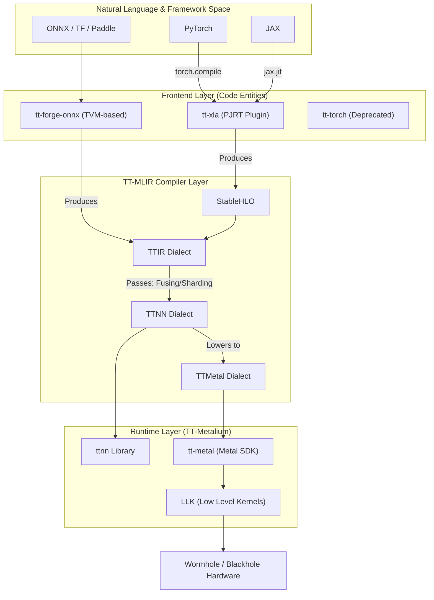


The following diagram illustrates the end-to-end flow of a model through the TT-Forge stack, mapping framework entry points to the internal code entities and libraries.

**Sources:**[README.md 25-32](https://github.com/tenstorrent/tt-forge/blob/6f2d9645/README.md?plain=1#L25-L32)[docs/src/model-bring-up-guide.md 30-65](https://github.com/tenstorrent/tt-forge/blob/6f2d9645/docs/src/model-bring-up-guide.md?plain=1#L30-L65)[demos/README.md 5-18](https://github.com/tenstorrent/tt-forge/blob/6f2d9645/demos/README.md?plain=1#L5-L18)

## Frontend Layer

The Frontend Layer is the entry point for models. It abstracts the complexities of different ML frameworks and produces a standardized representation for the compiler.

*   **TT-XLA (Primary):** The recommended frontend for PyTorch and JAX. It uses the PJRT interface to produce StableHLO graphs. It supports both single-chip and multi-chip (Tensor Parallelism/SPMD) configurations.
*   **TT-Forge-ONNX:** A TVM-based frontend for ONNX, TensorFlow, and PaddlePaddle. It generates TTIR directly but is currently limited to single-chip projects.
*   **TT-Torch:** A legacy frontend for PyTorch; developers are encouraged to migrate to the `tt-xla``torch.compile` path.

For details, see [Frontend Layer](https://deepwiki.com/tenstorrent/tt-forge/2.1-frontend-layer).

**Sources:**[README.md 27-28](https://github.com/tenstorrent/tt-forge/blob/6f2d9645/README.md?plain=1#L27-L28)[docs/src/model-bring-up-guide.md 36-43](https://github.com/tenstorrent/tt-forge/blob/6f2d9645/docs/src/model-bring-up-guide.md?plain=1#L36-L43)[demos/README.md 7-13](https://github.com/tenstorrent/tt-forge/blob/6f2d9645/demos/README.md?plain=1#L7-L13)

## TT-MLIR Compiler Layer

The `tt-mlir` compiler is the heart of the stack. It takes high-level IR (StableHLO or TTIR) and applies hardware-specific transformations.

*   **Tiling:** Automatically handles the conversion of tensors to the hardware-native 32x32 tile format.
*   **Memory Management:** Determines data placement between interleaved DRAM and fast local SRAM (L1).
*   **Optimization Passes:** Includes operation fusing, layout transformations, and sharding for multi-device execution.
*   **Dialects:** Progressively lowers code through `TTIR` ->`TTNN-IR` ->`TTMetal-IR` ->`TTKernel-IR`.

For details, see [TT-MLIR Compiler Layer](https://deepwiki.com/tenstorrent/tt-forge/2.2-tt-mlir-compiler-layer).

**Sources:**[README.md 29](https://github.com/tenstorrent/tt-forge/blob/6f2d9645/README.md?plain=1#L29-L29)[docs/src/model-bring-up-guide.md 47-54](https://github.com/tenstorrent/tt-forge/blob/6f2d9645/docs/src/model-bring-up-guide.md?plain=1#L47-L54)[docs/src/model-bring-up-guide.md 166-184](https://github.com/tenstorrent/tt-forge/blob/6f2d9645/docs/src/model-bring-up-guide.md?plain=1#L166-L184)

## Runtime and Hardware Layers

The Runtime Layer, known as **TT-Metalium**, manages the actual execution of optimized kernels on Tenstorrent silicon.

*   **TTNN:** A high-level C++/Python library of optimized operations (convolutions, matmuls, etc.) that the compiler targets by default.
*   **TT-Metal:** The underlying SDK for dispatching kernels, managing device memory, and coordinating Tensix cores.
*   **System Drivers:** Includes the User Mode Driver (UMD) and Kernel Mode Driver (KMD) for PCIe communication and device initialization.
*   **Hardware Targets:** Supports `Wormhole_b0` and the next-generation `Blackhole` architectures.

For details, see [Runtime and Hardware Layers](https://deepwiki.com/tenstorrent/tt-forge/2.3-runtime-and-hardware-layers).

**Sources:**[README.md 15](https://github.com/tenstorrent/tt-forge/blob/6f2d9645/README.md?plain=1#L15-L15)[docs/src/model-bring-up-guide.md 57-64](https://github.com/tenstorrent/tt-forge/blob/6f2d9645/docs/src/model-bring-up-guide.md?plain=1#L57-L64)[docs/src/model-bring-up-guide.md 95-97](https://github.com/tenstorrent/tt-forge/blob/6f2d9645/docs/src/model-bring-up-guide.md?plain=1#L95-L97)

## Data and Execution Flow Architecture

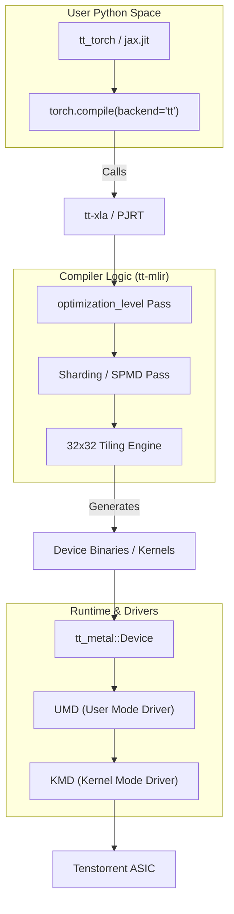


This diagram bridges the gap between the high-level Python API calls and the low-level hardware drivers.

**Sources:**[README.md 48-71](https://github.com/tenstorrent/tt-forge/blob/6f2d9645/README.md?plain=1#L48-L71)[docs/src/model-bring-up-guide.md 99-130](https://github.com/tenstorrent/tt-forge/blob/6f2d9645/docs/src/model-bring-up-guide.md?plain=1#L99-L130)[docs/src/model-bring-up-guide.md 156-184](https://github.com/tenstorrent/tt-forge/blob/6f2d9645/docs/src/model-bring-up-guide.md?plain=1#L156-L184)

Dismiss
Refresh this wiki

Enter email to refresh

## Additional Diagrams


#### Data Flow


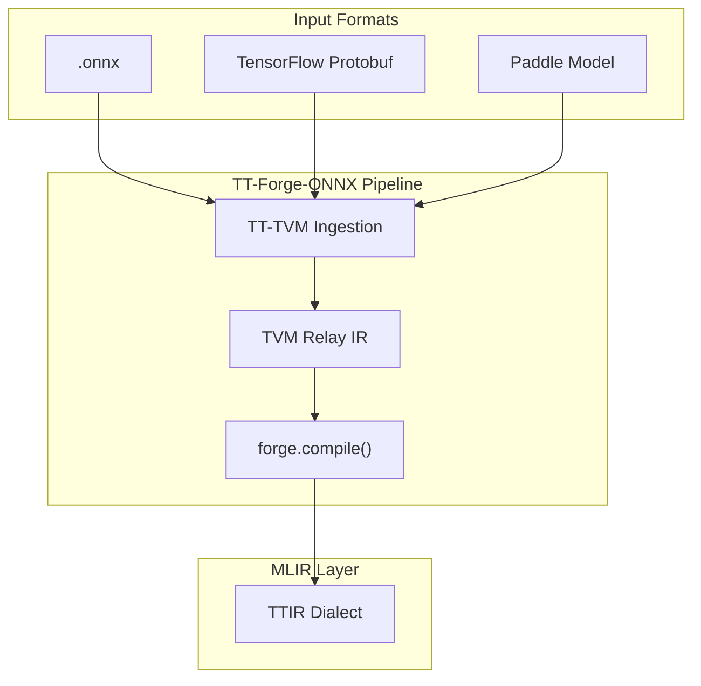

Sources: [README.md:28](), [demos/README.md:11-13]()

---
```


#### Runtime Configuration


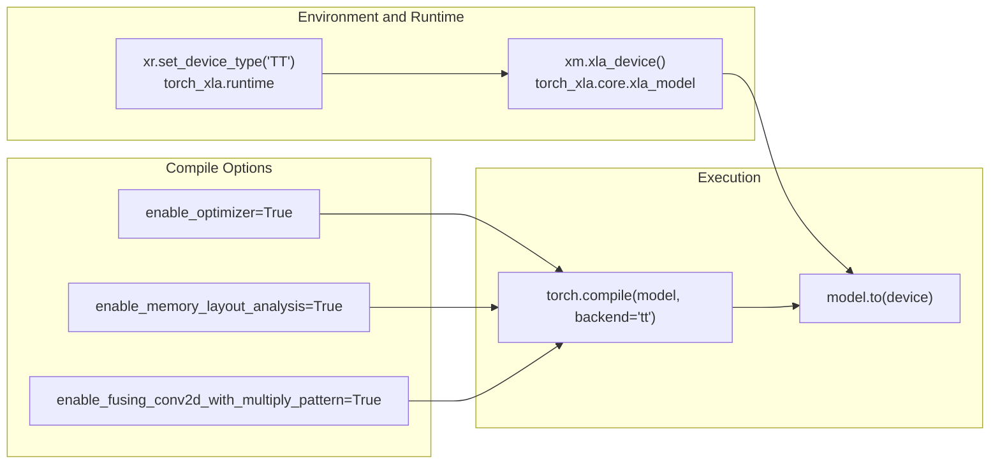

Sources: [demos/tt-xla/cnn/resnet_demo.py:26-38](), [demos/tt-xla/cnn/arnold_demo.py:18-30](), [benchmark/tt-xla/resnet.py:150-159]()
```


#### System Data Flow: Configuration to Results


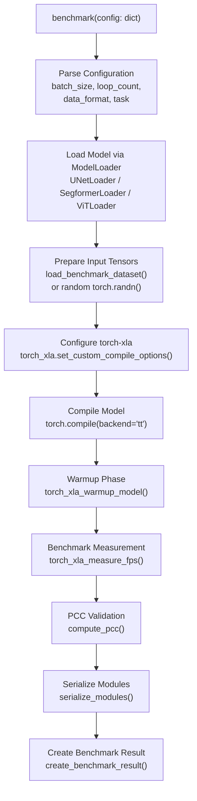


#### Configuration Hierarchy


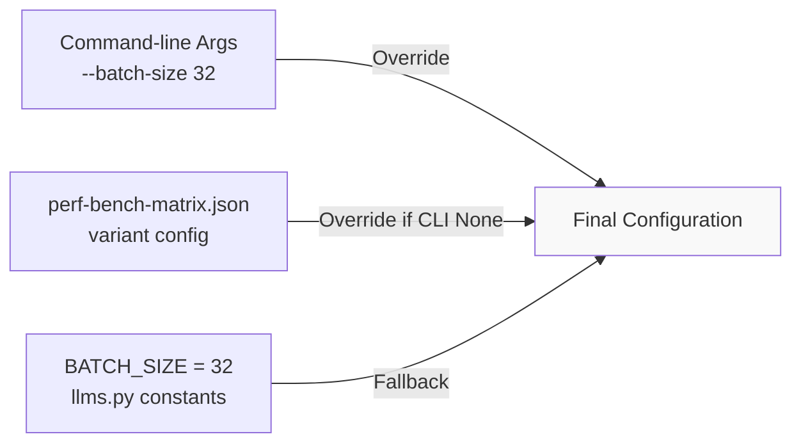


#### Superset API Integration


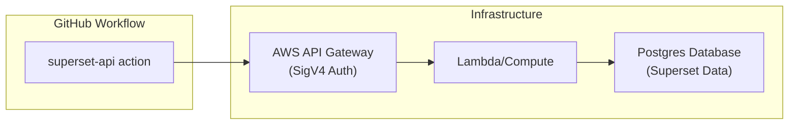


#### Logic and Data Flow


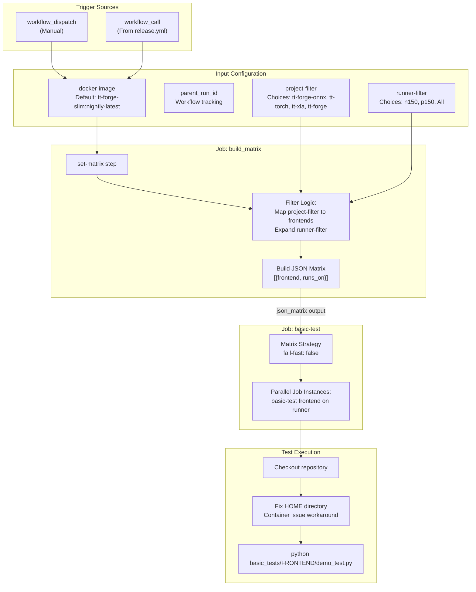


#### Configuration Propagation


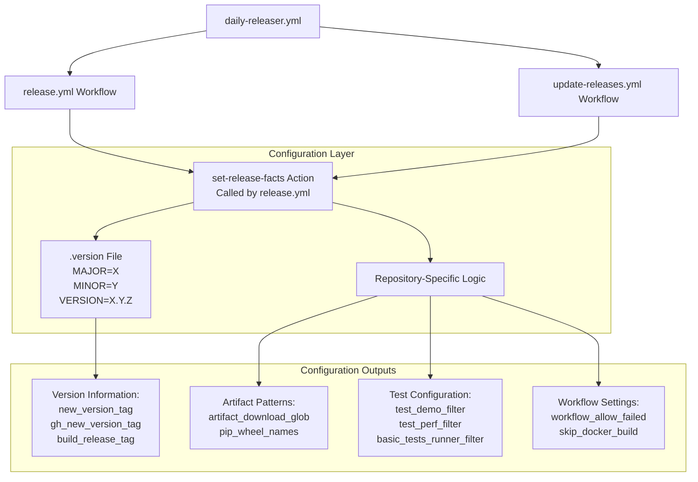


#### Version Management Workflows


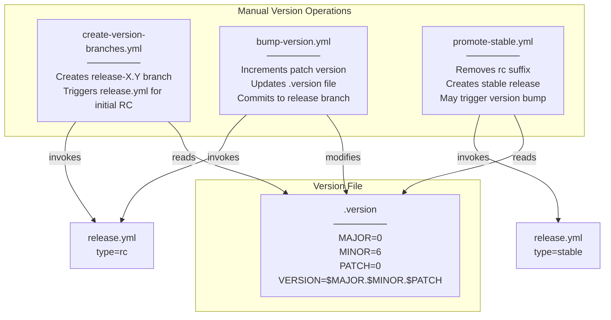


#### Patch Version Flow


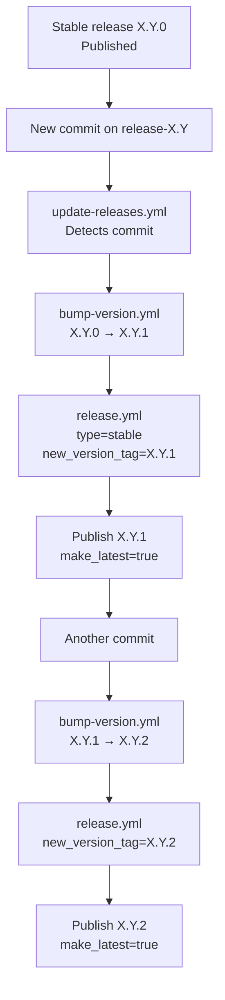

The test lifecycle validates that a second commit after stable release bumps the version from `X.Y.0` to `X.Y.1` [.github/workflows/test-rc-stable-release-lifecycle.yml:455-470]().
```


#### Tag Logic Diagram


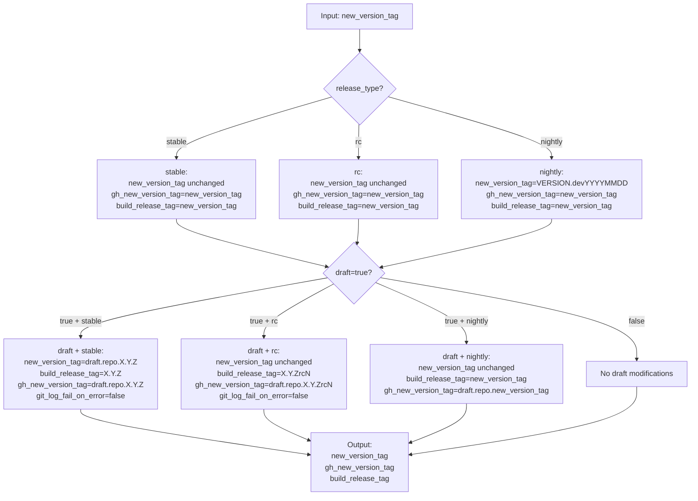


#### System Architecture and Data Flow


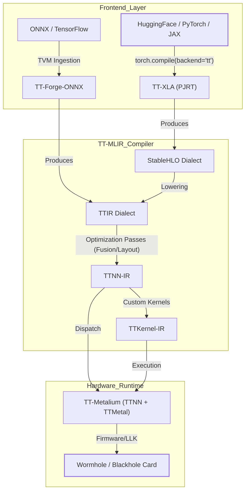
Sources: [docs/src/model-bring-up-guide.md:26-65](), [README.md:23-32]()
```


#### System Architecture: Natural Language to Code Entity Space


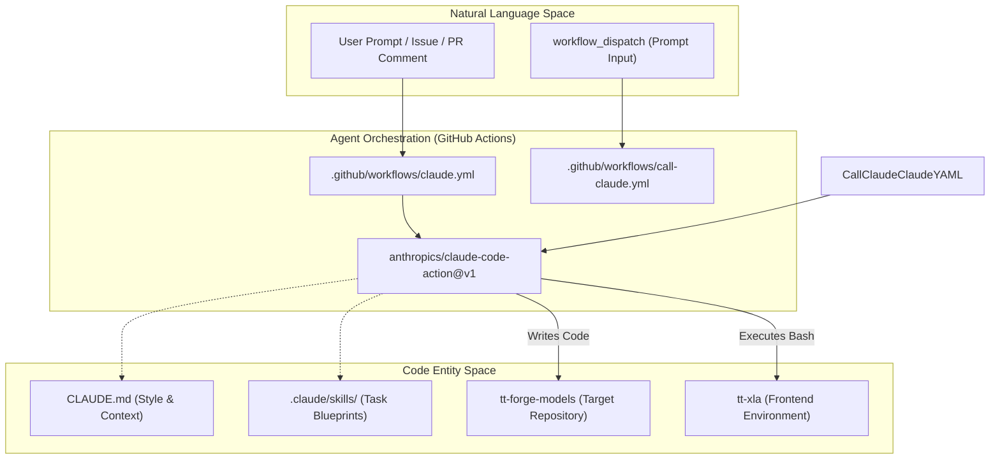


#### Mapping Natural Language to Code Entities


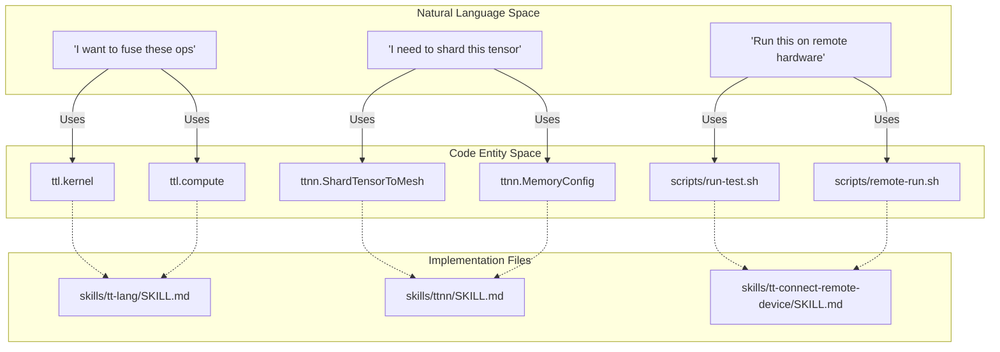


### PipeNet: Inter-Core Communication


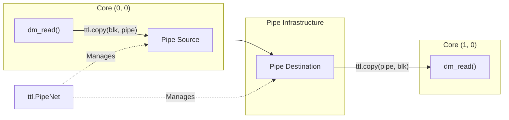
Sources: [skills/tt-lang/examples.md:8-10](), [skills/tt-lang/examples.md:28-35]()
```


#### 2.2 Auto-Profiling and Signposts


```mermaid
graph TD
    subgraph "Natural Language Space"
        "Wall Time Ground Truth"
        "Core Utilization"
        "Hotspot Analysis"
    end

    subgraph "Code Entity Space"
        "TT_METAL_DEVICE_PROFILER"["TT_METAL_DEVICE_PROFILER=1"]
        "TT_METAL_DEVICE_PROFILER_NOC_EVENTS"["TT_METAL_DEVICE_PROFILER_NOC_EVENTS=1"]
        "TTLANG_PERF_DUMP"["TTLANG_PERF_DUMP=1"]
        "TTLANG_AUTO_PROFILE"["TTLANG_AUTO_PROFILE=1"]
        "ttl_signpost"["ttl.signpost()"]
        "perf_summary"["ttl._src.perf_summary"]
    end

    "Wall Time Ground Truth" --> "TTLANG_PERF_DUMP"
    "Core Utilization" --> "perf_summary"
    "Hotspot Analysis" --> "TTLANG_AUTO_PROFILE"
    "Hotspot Analysis" --> "ttl_signpost"
    "TT_METAL_DEVICE_PROFILER" --> "TTLANG_PERF_DUMP"
    "TT_METAL_DEVICE_PROFILER_NOC_EVENTS" --> "perf_summary"
```

Sources: [skills/tt-lang-profile-optimize/SKILL.md:21-117](), [skills/tt-lang-profile-optimize/performance-tools.md:1-144]()

---
```


#### Frontend to Hardware Data Flow


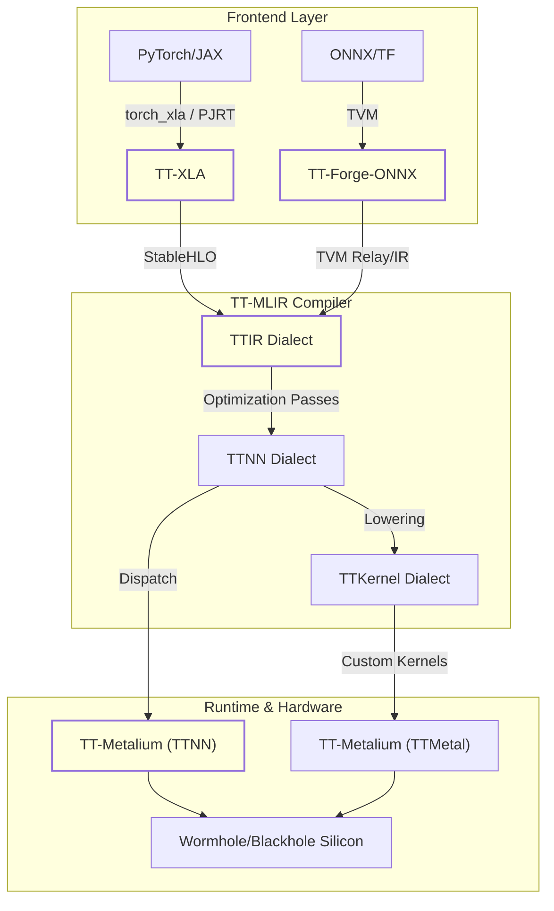

