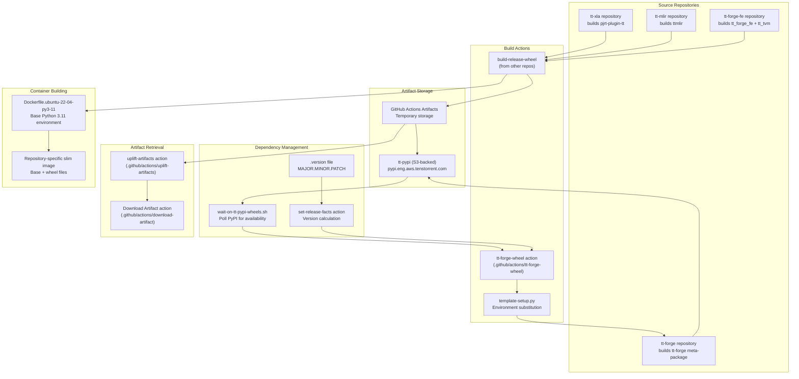
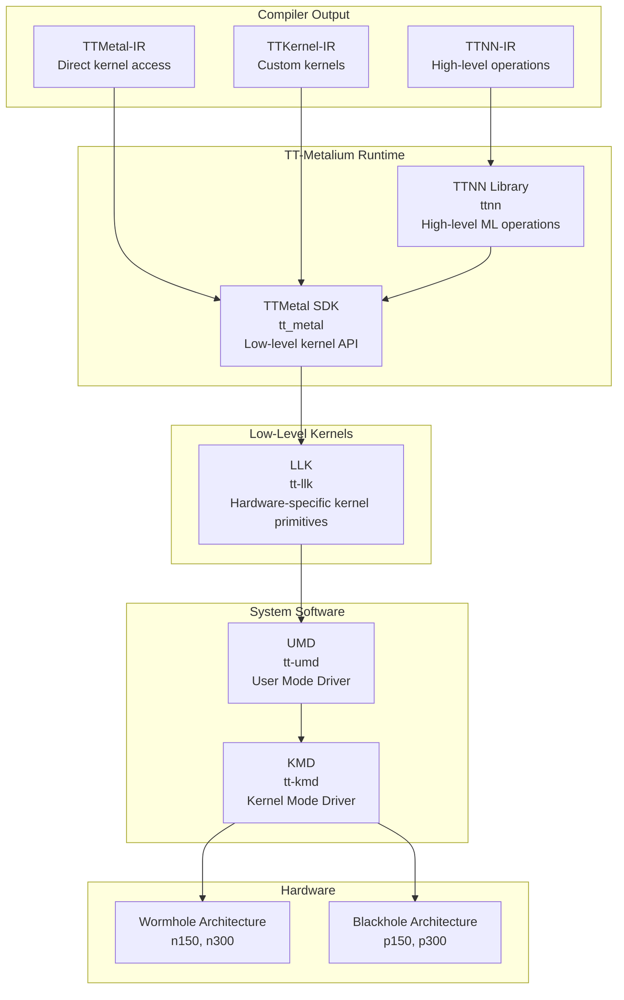
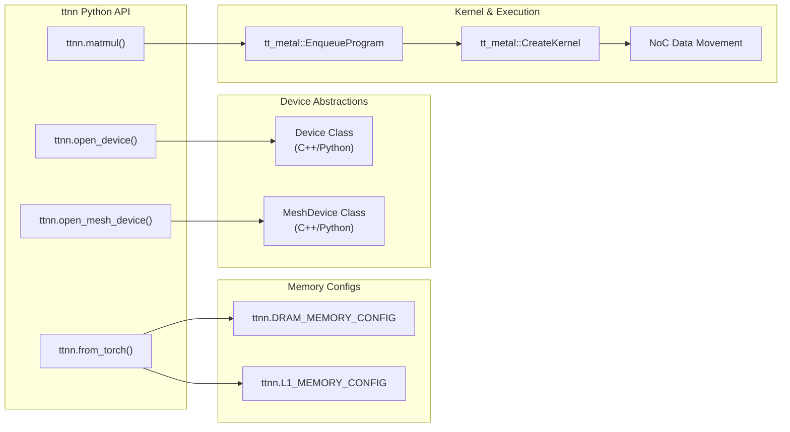

# Runtime and Hardware Layers

Relevant source files
*   [README.md](https://github.com/tenstorrent/tt-forge/blob/6f2d9645/README.md?plain=1)
*   [demos/README.md](https://github.com/tenstorrent/tt-forge/blob/6f2d9645/demos/README.md?plain=1)
*   [docs/src/getting_started.md](https://github.com/tenstorrent/tt-forge/blob/6f2d9645/docs/src/getting_started.md?plain=1)
*   [skills/ttnn/SKILL.md](https://github.com/tenstorrent/tt-forge/blob/6f2d9645/skills/ttnn/SKILL.md?plain=1)

## Purpose and Scope

This document describes the runtime and hardware layers of the TT-Forge software stack, specifically the TT-Metalium runtime system, system software drivers, and supported hardware architectures. These layers execute the compiled code produced by the TT-MLIR compiler and provide the interface to Tenstorrent hardware accelerators.

For information about the compiler layer that produces code for these runtimes, see [TT-MLIR Compiler Layer](https://deepwiki.com/tenstorrent/tt-forge/2.2-tt-mlir-compiler-layer). For information about the frontend frameworks that feed into the compiler, see [Frontend Layer](https://deepwiki.com/tenstorrent/tt-forge/2.1-frontend-layer).

* * *

## Architecture Overview

The runtime and hardware layers form the execution environment for compiled machine learning models. The TT-MLIR compiler (described in [TT-MLIR Compiler Layer](https://deepwiki.com/tenstorrent/tt-forge/2.2-tt-mlir-compiler-layer)) produces IR in three target dialects—TTNN-IR, TTMetal-IR, and TTKernel-IR—which are then executed by corresponding runtime components in the TT-Metalium stack.

### Layer Hierarchy

**Sources:**[README.md 15-32](https://github.com/tenstorrent/tt-forge/blob/6f2d9645/README.md?plain=1#L15-L32)[README.md 120-143](https://github.com/tenstorrent/tt-forge/blob/6f2d9645/README.md?plain=1#L120-L143)

* * *

## TT-Metalium Runtime

TT-Metalium is the runtime layer that executes operations on Tenstorrent hardware. It provides two primary interfaces at different abstraction levels: the TTNN library for high-level ML operations and the TTMetal SDK for low-level kernel programming.

### TTNN Library

The TTNN (Tenstorrent Neural Network) library provides a high-level interface for executing machine learning operations on Tenstorrent hardware. It serves as the execution target for TTNN-IR dialect output from the compiler.

**Key Characteristics:**

*   **High-level ML operations**: Provides optimized implementations of common neural network operations (convolutions, matrix multiplications, activations, normalization, etc.) via a PyTorch-like API [skills/ttnn/SKILL.md 99-100](https://github.com/tenstorrent/tt-forge/blob/6f2d9645/skills/ttnn/SKILL.md?plain=1#L99-L100)
*   **Hardware abstraction**: Abstracts hardware-specific details while maintaining performance through memory configurations like `DRAM_MEMORY_CONFIG` and `L1_MEMORY_CONFIG`[skills/ttnn/SKILL.md 105](https://github.com/tenstorrent/tt-forge/blob/6f2d9645/skills/ttnn/SKILL.md?plain=1#L105-L105)
*   **Multi-device support**: Coordinates execution across multiple chips using the `MeshDevice` abstraction [skills/ttnn/SKILL.md 17-18](https://github.com/tenstorrent/tt-forge/blob/6f2d9645/skills/ttnn/SKILL.md?plain=1#L17-L18)
*   **Tracing**: Supports captured traces via `ttnn.open_device(..., trace_region_size=...)` to eliminate host overhead in hot loops [skills/ttnn/SKILL.md 22](https://github.com/tenstorrent/tt-forge/blob/6f2d9645/skills/ttnn/SKILL.md?plain=1#L22-L22)[skills/ttnn/SKILL.md 67-69](https://github.com/tenstorrent/tt-forge/blob/6f2d9645/skills/ttnn/SKILL.md?plain=1#L67-L69)

**Multi-Device Programming:** TTNN supports various mesh topologies and tensor distribution strategies:

*   `ttnn.open_mesh_device`: Opens a grid of chips (e.g., `MeshShape(1, N_CHIPS)`) [skills/ttnn/SKILL.md 26-27](https://github.com/tenstorrent/tt-forge/blob/6f2d9645/skills/ttnn/SKILL.md?plain=1#L26-L27)
*   `ReplicateTensorToMesh`: Broadcasts data to all devices [skills/ttnn/SKILL.md 32](https://github.com/tenstorrent/tt-forge/blob/6f2d9645/skills/ttnn/SKILL.md?plain=1#L32-L32)
*   `ShardTensorToMesh`: Distributes data across devices for tensor parallelism [skills/ttnn/SKILL.md 37](https://github.com/tenstorrent/tt-forge/blob/6f2d9645/skills/ttnn/SKILL.md?plain=1#L37-L37)

**Sources:**[skills/ttnn/SKILL.md 1-130](https://github.com/tenstorrent/tt-forge/blob/6f2d9645/skills/ttnn/SKILL.md?plain=1#L1-L130)

### TTMetal SDK

The TTMetal SDK provides low-level access to Tenstorrent hardware capabilities, enabling direct kernel programming and fine-grained control over execution.

**Key Characteristics:**

*   **Direct kernel API**: Allows writing custom kernels with explicit control over data movement and computation.
*   **Hardware primitives**: Exposes hardware-specific capabilities like on-chip SRAM and NoC (Network-on-Chip).
*   **L1 Management**: Allows manual adjustment of `worker_l1_size` to trade off user L1 space for larger kernel configuration buffers [skills/ttnn/SKILL.md 54-65](https://github.com/tenstorrent/tt-forge/blob/6f2d9645/skills/ttnn/SKILL.md?plain=1#L54-L65)

**Repository:** The TTMetal SDK is the core of the tt-metal repository at `github.com/tenstorrent/tt-metal`.

**Sources:**[skills/ttnn/SKILL.md 54-65](https://github.com/tenstorrent/tt-forge/blob/6f2d9645/skills/ttnn/SKILL.md?plain=1#L54-L65)[README.md 29-30](https://github.com/tenstorrent/tt-forge/blob/6f2d9645/README.md?plain=1#L29-L30)

* * *

## Low-Level Kernels (LLK)

The Low-Level Kernel (LLK) library provides hardware-specific kernel primitives that serve as the foundation for all computation on Tenstorrent hardware. LLK sits below TTMetal and provides the most direct interface to hardware capabilities.

### LLK Architecture

**Key Characteristics:**

*   **Hardware-specific implementations**: Contains optimized kernels for each Tenstorrent architecture (Wormhole, Blackhole).
*   **Primitive operations**: Provides fundamental math operations and data movement primitives.
*   **Integration**: TTMetal SDK uses LLK primitives to implement higher-level kernel functionality.

**Repository:** Implemented as a separate repository at `github.com/tenstorrent/tt-llk`.

* * *

## System Software Layer

The system software layer provides device communication and management through user-mode and kernel-mode drivers.

### User Mode Driver (UMD)

The UMD provides the primary interface for user-space applications to communicate with Tenstorrent hardware.

**Key Responsibilities:**

*   **Device enumeration**: Discovering and identifying available Tenstorrent devices.
*   **Memory management**: Allocating and managing device memory.
*   **Command submission**: Submitting work to hardware execution units.

**Repository:** Implemented at `github.com/tenstorrent/tt-umd`.

### Kernel Mode Driver (KMD)

The KMD operates at the operating system kernel level to provide low-level hardware access and management.

**Key Responsibilities:**

*   **Hardware initialization**: Setting up devices during system boot.
*   **Memory mapping**: Mapping device memory into user-space address spaces.
*   **DMA management**: Direct Memory Access for efficient data transfer.

**Repository:** Implemented at `github.com/tenstorrent/tt-kmd`.

* * *

## Hardware Layer

The hardware layer consists of Tenstorrent's physical AI accelerator chips. The TT-Forge software stack supports two primary architectures: Wormhole and Blackhole.

### Wormhole Architecture

Wormhole is Tenstorrent's production AI accelerator architecture, designed for efficient neural network inference and training.

**Chip Variants:**

*   **n150**: Single-chip PCIe card configuration.
*   **n300**: Multi-chip configuration with 2 Wormhole dies.

**Key Characteristics:**

*   **Tensix cores**: Programmable compute cores with dedicated math engines.
*   **On-chip SRAM**: High-bandwidth local memory.
*   **Network-on-Chip (NoC)**: High-speed interconnect between cores.

### Blackhole Architecture

Blackhole represents the next generation of Tenstorrent AI accelerators with enhanced capabilities.

**Chip Variants:**

*   **p150**: Single-chip configuration.
*   **p300**: Multi-chip configuration.

**Key Characteristics:**

*   **Enhanced compute**: Improved Tensix cores with higher throughput.
*   **PCIe Gen5 support**: Higher host bandwidth.

### Hardware Architecture Comparison

| Feature | Wormhole (n150/n300) | Blackhole (p150/p300) |
| --- | --- | --- |
| **Status** | Production | Beta/Evaluation |
| **Compute Cores** | Tensix v1 | Enhanced Tensix v2 |
| **Multi-chip Support** | Yes (n300) | Yes (p300) |

* * *

## Runtime Component Interaction

This diagram bridges the natural language concepts of the runtime to the code entities found in the `ttnn` and `tt-metal` libraries.

**Sources:**[skills/ttnn/SKILL.md 22-46](https://github.com/tenstorrent/tt-forge/blob/6f2d9645/skills/ttnn/SKILL.md?plain=1#L22-L46)[skills/ttnn/SKILL.md 105-130](https://github.com/tenstorrent/tt-forge/blob/6f2d9645/skills/ttnn/SKILL.md?plain=1#L105-L130)

* * *

## Summary

The Runtime and Hardware Layers form the execution foundation for the TT-Forge compiler stack:

*   **TT-Metalium Runtime**: Provides `ttnn` library for high-level operations and `tt-metal` SDK for low-level kernel programming.
*   **LLK**: Delivers hardware-specific kernel primitives optimized for each architecture.
*   **System Software**: `tt-umd` and `tt-kmd` manage device communication and resource management.
*   **Hardware**: Wormhole (production) and Blackhole (next-gen) architectures provide the physical compute substrate.

These layers work together to execute compiled ML models with high performance on Tenstorrent AI accelerators.

**Sources:**[README.md 15-32](https://github.com/tenstorrent/tt-forge/blob/6f2d9645/README.md?plain=1#L15-L32)[skills/ttnn/SKILL.md 97-107](https://github.com/tenstorrent/tt-forge/blob/6f2d9645/skills/ttnn/SKILL.md?plain=1#L97-L107)

Dismiss
Refresh this wiki

Enter email to refresh
