# Benchmarking System

Relevant source files
*   [.github/workflows/basic-tests.yml](https://github.com/tenstorrent/tt-forge/blob/6f2d9645/.github/workflows/basic-tests.yml)
*   [.github/workflows/demo-tests.yml](https://github.com/tenstorrent/tt-forge/blob/6f2d9645/.github/workflows/demo-tests.yml)
*   [.github/workflows/filter-test-matrix.py](https://github.com/tenstorrent/tt-forge/blob/6f2d9645/.github/workflows/filter-test-matrix.py)
*   [.github/workflows/models-matrix.json](https://github.com/tenstorrent/tt-forge/blob/6f2d9645/.github/workflows/models-matrix.json)
*   [demos/tt-forge-onnx/README.md](https://github.com/tenstorrent/tt-forge/blob/6f2d9645/demos/tt-forge-onnx/README.md?plain=1)

The benchmarking system provides comprehensive performance validation for the TT-Forge compiler stack across multiple hardware architectures (Wormhole n150, Blackhole p150) and model types. It validates two primary compilation paths: **torch-xla** benchmarks (page 3.3) test the JAX/PyTorch → XLA → TT-MLIR → TTNN path, while **forge.compile** benchmarks (page 3.4) test the TVM → TT-MLIR → TTNN path.

The system consists of:

*   **Benchmark Infrastructure and Workflows** ([Benchmark Infrastructure and Workflows](https://deepwiki.com/tenstorrent/tt-forge/3.1-benchmark-infrastructure-and-workflows)): `perf-benchmark.yml` orchestration, GitHub runners, and Docker containers.
*   **Test Matrix Configuration** ([Test Matrix Configuration](https://deepwiki.com/tenstorrent/tt-forge/3.2-test-matrix-configuration)): `perf-bench-matrix.json` structure and `filter-test-matrix.py` filtering logic.
*   **torch-xla Backend Benchmarks** ([torch-xla Backend Benchmarks](https://deepwiki.com/tenstorrent/tt-forge/3.3-torch-xla-backend-benchmarks)): ResNet, UNet, ViT, and LLMs using the torch-xla device.
*   **forge.compile Backend Benchmarks** ([forge.compile Backend Benchmarks](https://deepwiki.com/tenstorrent/tt-forge/3.4-forge.compile-backend-benchmarks)): MobileNetV2, Segformer, and UNet using the `forge.compile` API.
*   **Performance Metrics and Reporting** ([Performance Metrics and Reporting](https://deepwiki.com/tenstorrent/tt-forge/3.5-performance-metrics-and-reporting)): FPS measurement, PCC validation, and JSON result structures.

## System Architecture

The benchmarking system is built on a three-tier architecture: workflow orchestration, matrix-based configuration, and dynamic execution.

### Overall Architecture

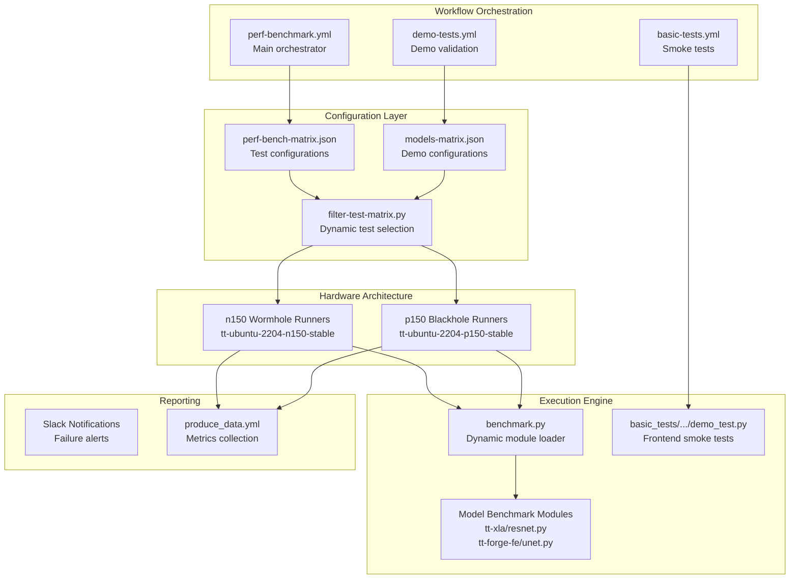

Sources: [.github/workflows/demo-tests.yml:54-104](), [.github/workflows/basic-tests.yml:58-100](), [.github/workflows/filter-test-matrix.py:10-24]()
```


Sources: [.github/workflows/demo-tests.yml 54-104](https://github.com/tenstorrent/tt-forge/blob/6f2d9645/.github/workflows/demo-tests.yml#L54-L104)[.github/workflows/basic-tests.yml 58-100](https://github.com/tenstorrent/tt-forge/blob/6f2d9645/.github/workflows/basic-tests.yml#L58-L100)[.github/workflows/filter-test-matrix.py 10-24](https://github.com/tenstorrent/tt-forge/blob/6f2d9645/.github/workflows/filter-test-matrix.py#L10-L24)

## Workflow Orchestration

The system uses specialized workflows to handle different validation levels, from quick smoke tests to deep performance benchmarks.

### Workflow Types

| Workflow | Purpose | Key File |
| --- | --- | --- |
| **Basic Tests** | Rapid validation of frontend functionality (smoke tests). | [.github/workflows/basic-tests.yml 1-57](https://github.com/tenstorrent/tt-forge/blob/6f2d9645/.github/workflows/basic-tests.yml#L1-L57) |
| **Demo Tests** | Validates end-to-end model demos across different projects. | [.github/workflows/demo-tests.yml 1-47](https://github.com/tenstorrent/tt-forge/blob/6f2d9645/.github/workflows/demo-tests.yml#L1-L47) |
| **Perf Benchmarks** | Detailed performance measurement (FPS, Latency, PCC). | [.github/workflows/perf-benchmark.yml](https://github.com/tenstorrent/tt-forge/blob/6f2d9645/.github/workflows/perf-benchmark.yml) |

For details, see [Benchmark Infrastructure and Workflows](https://deepwiki.com/tenstorrent/tt-forge/3.1-benchmark-infrastructure-and-workflows).

## Matrix Configuration System

The benchmarking system uses JSON-based matrix files to define test configurations. The `filter-test-matrix.py` script parses these matrices and generates filtered test configurations based on project, test name, and hardware requirements.

### Matrix Filtering Logic

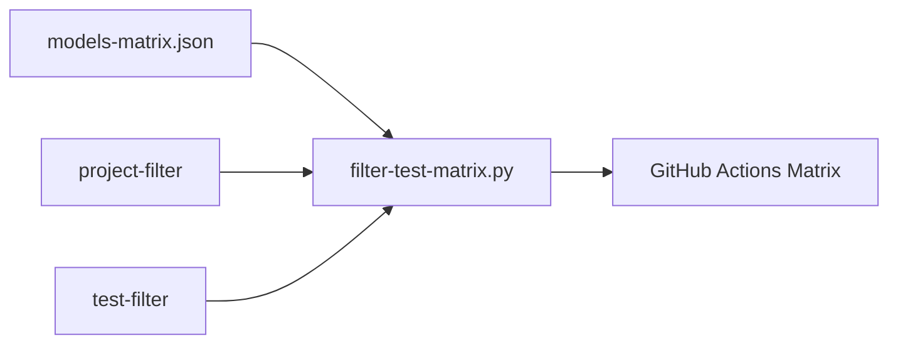

For details, see [Test Matrix Configuration](#3.2).
```


The script `filter-test-matrix.py` performs the following operations:

1.   **Flattening**: Expands tests with multiple `runs-on` targets into individual matrix entries [[.github/workflows/filter-test-matrix.py 10-24](https://github.com/tenstorrent/tt-forge/blob/6f2d9645/[.github/workflows/filter-test-matrix.py#L10-L24)].
2.   **Filtering**: Matches entries against `project-filter` and `test-filter` inputs [[.github/workflows/filter-test-matrix.py 27-48](https://github.com/tenstorrent/tt-forge/blob/6f2d9645/[.github/workflows/filter-test-matrix.py#L27-L48)].
3.   **Runner Mapping**: Maps logical runner names (e.g., `n150`) to specific CI labels (e.g., `n150-perf`) [[.github/workflows/filter-test-matrix.py 51-60](https://github.com/tenstorrent/tt-forge/blob/6f2d9645/[.github/workflows/filter-test-matrix.py#L51-L60)].

For details, see [Test Matrix Configuration](https://deepwiki.com/tenstorrent/tt-forge/3.2-test-matrix-configuration).

## Backend Benchmarks

The system validates performance across different frontend entry points.

### torch-xla Backend

This backend targets the JAX and PyTorch ecosystem. Benchmarks include:

*   **NLP**: ALBERT, GPT2, OPT, BGE-M3 [[.github/workflows/models-matrix.json 24-32](https://github.com/tenstorrent/tt-forge/blob/6f2d9645/[.github/workflows/models-matrix.json#L24-L32)].
*   **CNN**: ResNet50, ResNet50-HF [[.github/workflows/models-matrix.json 29-30](https://github.com/tenstorrent/tt-forge/blob/6f2d9645/[.github/workflows/models-matrix.json#L29-L30)].

For details, see [torch-xla Backend Benchmarks](https://deepwiki.com/tenstorrent/tt-forge/3.3-torch-xla-backend-benchmarks).

### forge.compile Backend

This backend targets models compiled via the TVM-based frontend. It covers a wide range of computer vision models including AlexNet, DenseNet, and EfficientNet [[demos/tt-forge-onnx/README.md 25-32](https://github.com/tenstorrent/tt-forge/blob/6f2d9645/[demos/tt-forge-onnx/README.md?plain=1#L25-L32)].

For details, see [forge.compile Backend Benchmarks](https://deepwiki.com/tenstorrent/tt-forge/3.4-forge.compile-backend-benchmarks).

## Performance Metrics and Reporting

The system tracks several critical metrics to ensure hardware efficiency and numerical correctness:

*   **FPS (Frames Per Second)**: Throughput measurement.
*   **PCC (Pearson Correlation Coefficient)**: Measures numerical accuracy against a CPU baseline.
*   **CPU FPS**: Baseline performance for comparison.

### Failure Notification

Failures on the `main` branch trigger Slack notifications to the `C088QN7E0R3` channel [[.github/workflows/demo-tests.yml 173-190](https://github.com/tenstorrent/tt-forge/blob/6f2d9645/[.github/workflows/demo-tests.yml#L173-L190)].

For details, see [Performance Metrics and Reporting](https://deepwiki.com/tenstorrent/tt-forge/3.5-performance-metrics-and-reporting).

Sources: [.github/workflows/demo-tests.yml 173-190](https://github.com/tenstorrent/tt-forge/blob/6f2d9645/.github/workflows/demo-tests.yml#L173-L190)[.github/workflows/models-matrix.json 1-45](https://github.com/tenstorrent/tt-forge/blob/6f2d9645/.github/workflows/models-matrix.json#L1-L45)[.github/workflows/filter-test-matrix.py 1-94](https://github.com/tenstorrent/tt-forge/blob/6f2d9645/.github/workflows/filter-test-matrix.py#L1-L94)

Dismiss
Refresh this wiki

Enter email to refresh

## Additional Diagrams


### Compilation Flow


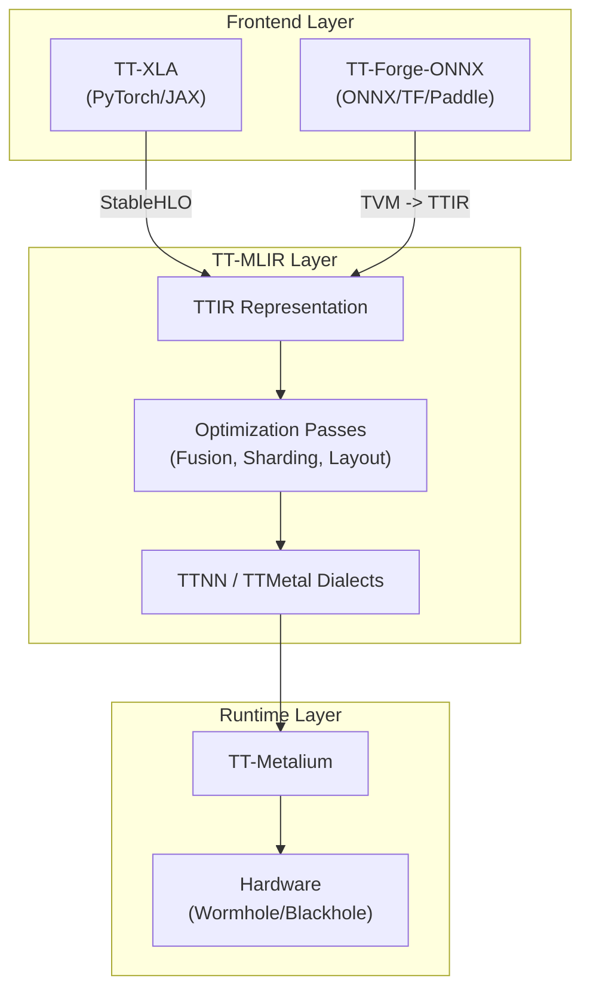

**Diagram: System-wide Compilation Flow**
```


#### Compiler Configuration Structure


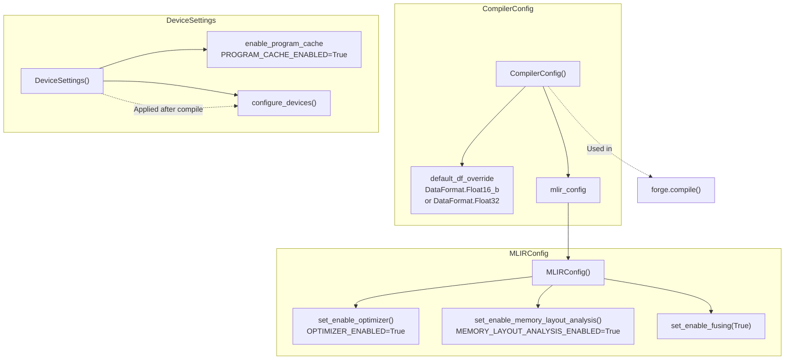


#### Input Data Flow


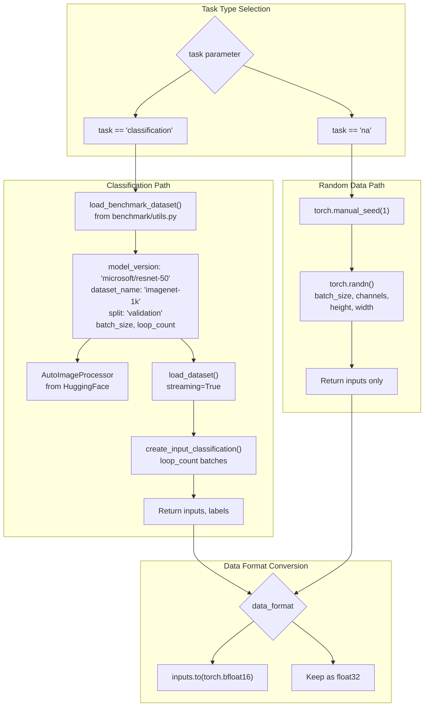


#### Performance Metrics Collection


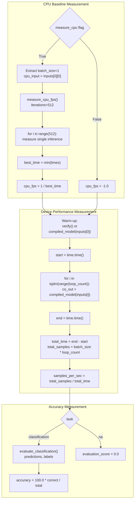


#### Result Dictionary Schema


```mermaid
graph TB
    subgraph "Top-Level Fields"
        Model["model: str<br/>e.g. 'MobileNet V2 Basic'"]
        ModelType["model_type: str<br/>e.g. 'Classification, ImageNet-1K'"]
        RunType["run_type: str<br/>Unique identifier"]
        Config["config: dict"]
        NumLayers["num_layers: int"]
        BatchSize["batch_size: int"]
        Precision["precision: str<br/>e.g. 'bfloat16'"]
        DatasetName["dataset_name: str"]
        ProfileName["profile_name: str"]
        SeqLengths["input_sequence_length: int<br/>output_sequence_length: int"]
        ImageDim["image_dimension: str<br/>e.g. '3x224x224'"]
        PerfAnalysis["perf_analysis: bool"]
        Training["training: bool"]
        Measurements["measurements: List[dict]"]
        DeviceInfo["device_info: dict"]
        DeviceIP["device_ip: Optional[str]"]
    end
    
    subgraph "config dict"
        ModelSize["model_size: str<br/>e.g. 'small'"]
        OptEnabled["optimizer_enabled: bool"]
        ProgCache["program_cache_enabled: bool"]
        MemLayout["memory_layout_analysis_enabled: bool"]
        Trace["trace_enabled: bool"]
    end
    
    subgraph "measurements list"
        Meas1["Measurement 1:<br/>total_samples"]
        Meas2["Measurement 2:<br/>total_time"]
        Meas3["Measurement 3:<br/>evaluation_score"]
        Meas4["Measurement 4:<br/>cpu_fps"]
    end
    
    Config --> ModelSize
    Config --> OptEnabled
    Config --> ProgCache
    Config --> MemLayout
    Config --> Trace
    
    Measurements --> Meas1
    Measurements --> Meas2
    Measurements --> Meas3
    Measurements --> Meas4
    
    DeviceInfo --> DevName["device_name"]
    DeviceInfo --> Galaxy["galaxy"]
    DeviceInfo --> Arch["arch"]
    DeviceInfo --> Chips["chips"]
```


#### Pearson Correlation Coefficient


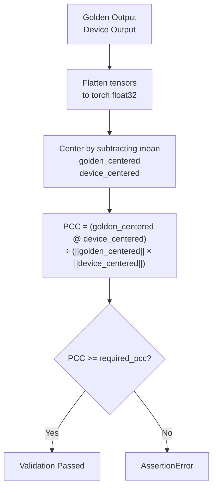


#### Benchmark Result Schema


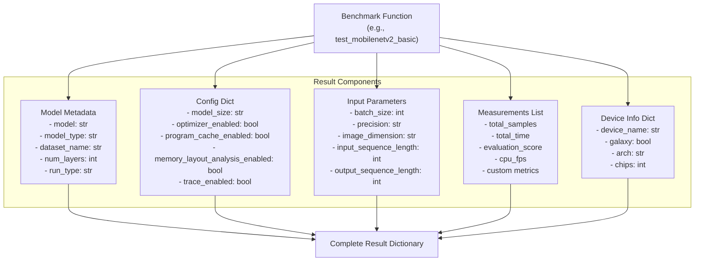


#### Metrics Aggregation Pipeline


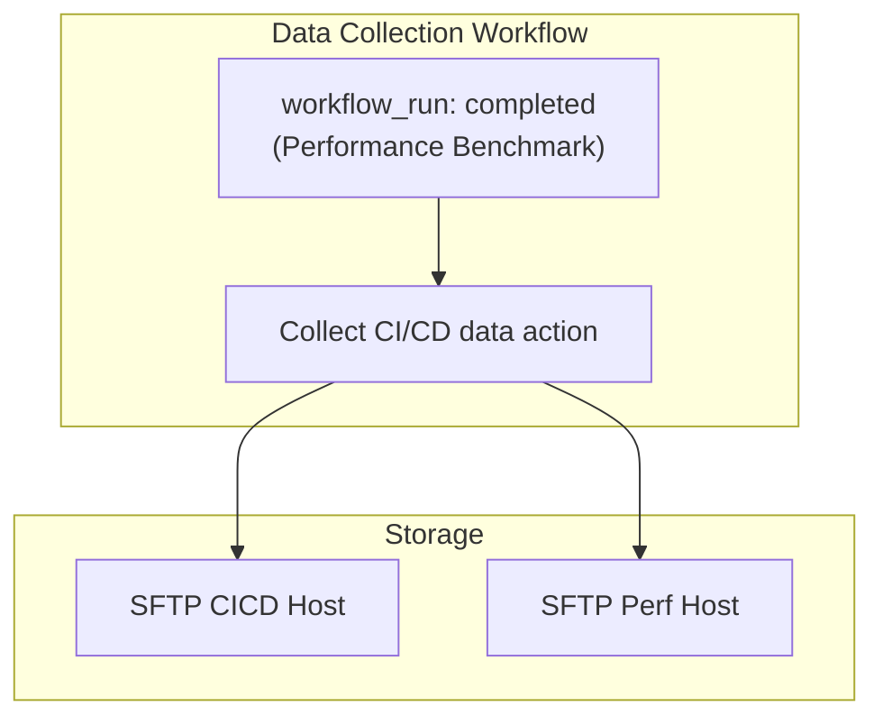

**Implementation Details:**
- **Trigger**: Automatically runs when the "Performance Benchmark External Trigger" workflow completes [.github/workflows/produce_data.yml:28-32]().
- **Action**: Uses `tenstorrent/tt-github-actions/.github/actions/collect_data` [.github/workflows/produce_data.yml:46]().
- **Destinations**: Distinguishes between standard CI/CD data and specialized performance data via separate SFTP host secrets [.github/workflows/produce_data.yml:51-54]().
```


#### Matrix Filtering Flow


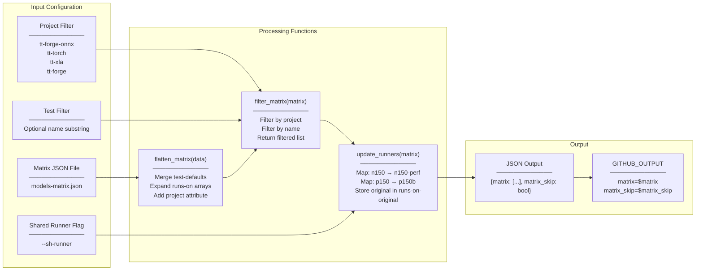


### Orchestration Architecture


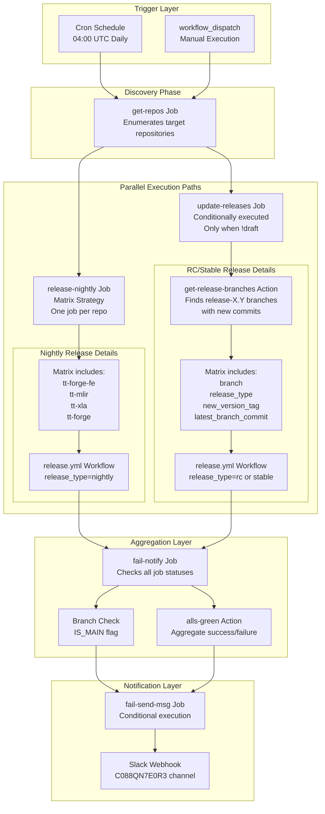

**Orchestration Flow:**
1. **Trigger Layer**: Workflow activated via cron schedule or manual dispatch [.github/workflows/daily-releaser.yml:4-9]().
2. **Discovery Phase**: `get-repos` job identifies all repositories to process [.github/workflows/daily-releaser.yml:56-66]().
3. **Parallel Execution**: Two independent paths execute simultaneously:
   - **Nightly Path**: Always runs for all repositories [.github/workflows/daily-releaser.yml:84-98]().
   - **RC/Stable Path**: Conditionally runs (skipped in draft mode) [.github/workflows/daily-releaser.yml:68-82]().
4. **Aggregation**: `fail-notify` job waits for all parallel jobs to complete [.github/workflows/daily-releaser.yml:101-118]().
5. **Notification**: Slack alert sent only for main branch scheduled failures [.github/workflows/daily-releaser.yml:119-136]().
```


#### Failure Aggregation


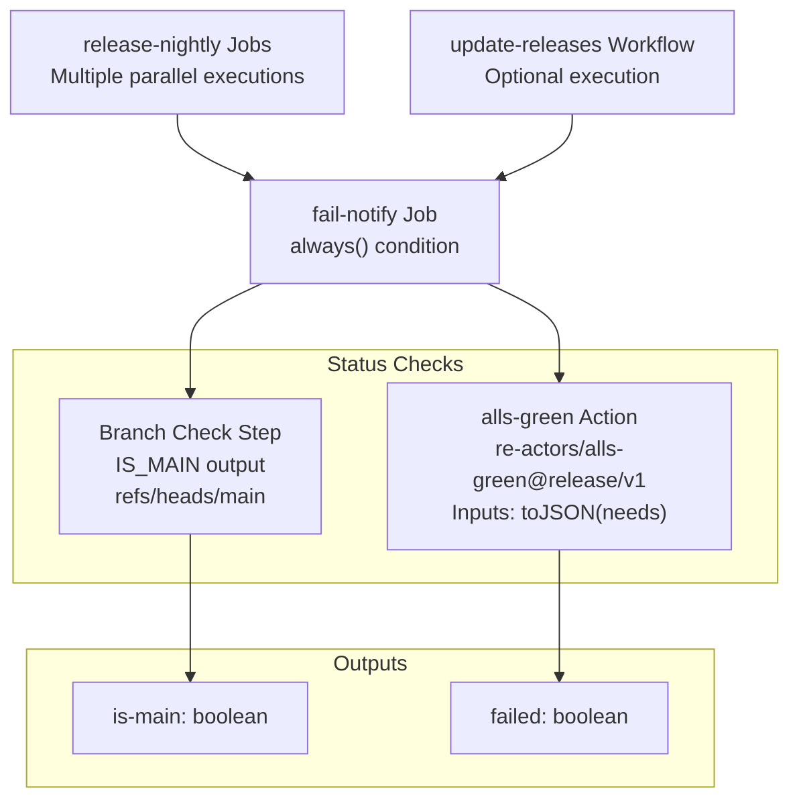

**Execution Characteristics:**
- **Trigger Condition:** `if: always()` - Runs regardless of job failures [.github/workflows/daily-releaser.yml:102]().
- **Dependency Analysis:** Waits for `release-nightly` [.github/workflows/daily-releaser.yml:101]().
- **Status Detection:** Uses `re-actors/alls-green@release/v1` action to check job outcomes [.github/workflows/daily-releaser.yml:115-117]().

**Branch Detection Logic:**
```bash
IS_MAIN=$(if [ '${{ github.ref }}' == 'refs/heads/main' ]; then echo true; else echo false; fi)
```
[.github/workflows/daily-releaser.yml:108-111]()
```


### Build Workflow Selection


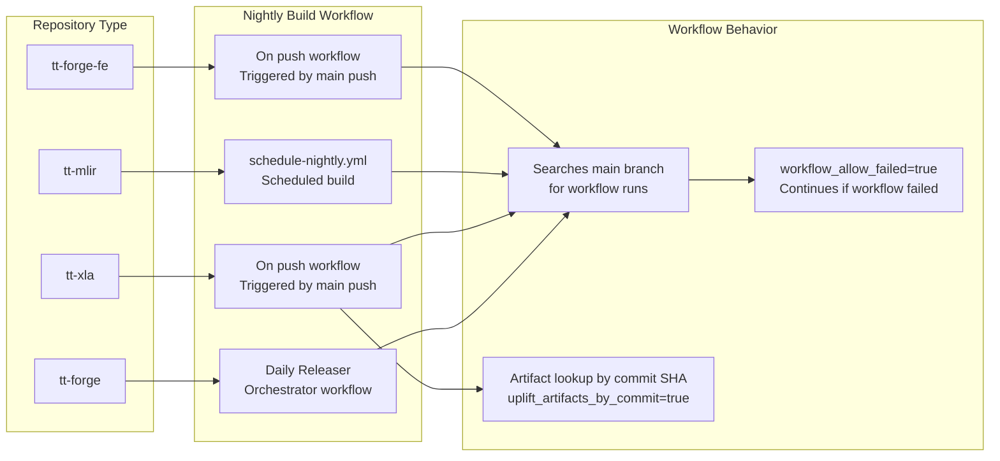


#### Logical Decision Flow


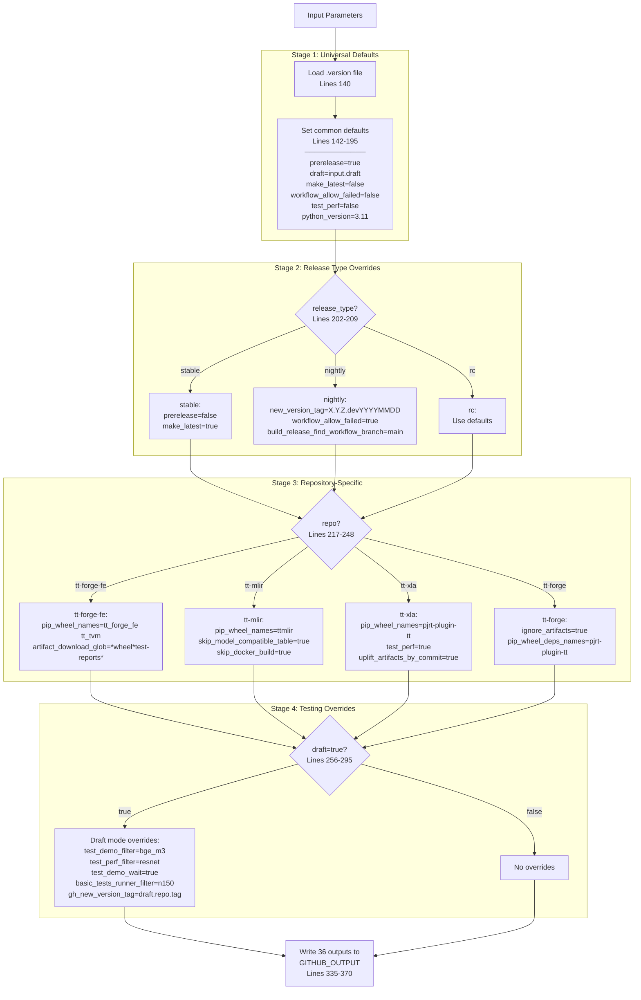


#### The Compilation Pipeline


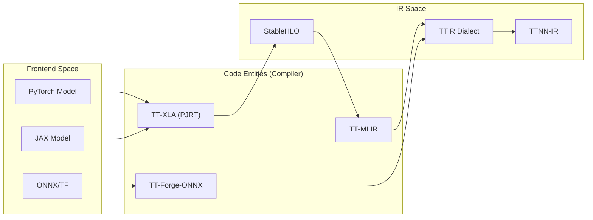


### Test Matrix Configuration System


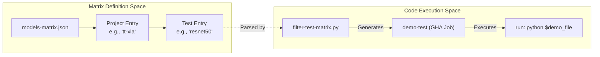

**Matrix Structure**

The `models-matrix.json` file contains an array of project objects. Each project defines its tests and optional default settings like `runs-on` [.github/workflows/models-matrix.json:1-45]().

| Field | Description |
|-------|-------------|
| `project` | The frontend/project name (e.g., `tt-forge-onnx`, `tt-torch`, `tt-xla`) |
| `test-defaults` | Default settings applied to all tests in the project (e.g., `runs-on: ["n150", "p150"]`) |
| `tests` | Array of test objects containing `name`, `path`, and optional overrides |

**Example Matrix Entry (tt-torch):**
```json
{
  "project": "tt-torch",
  "tests": [
    { 
      "runs-on": "n150", 
      "name": "resnet50", 
      "path": "resnet50_demo.py", 
      "pyreq": "loguru requests transformers datasets==3.6.0 torch==2.7.0 torchvision pytest tabulate" 
    }
  ]
}
```
Sources: [.github/workflows/models-matrix.json:36-44]()
```


#### Matrix Definition Structure


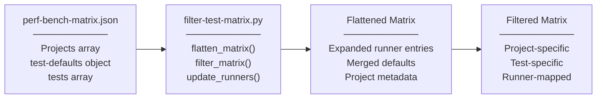


#### Matrix Flattening Process


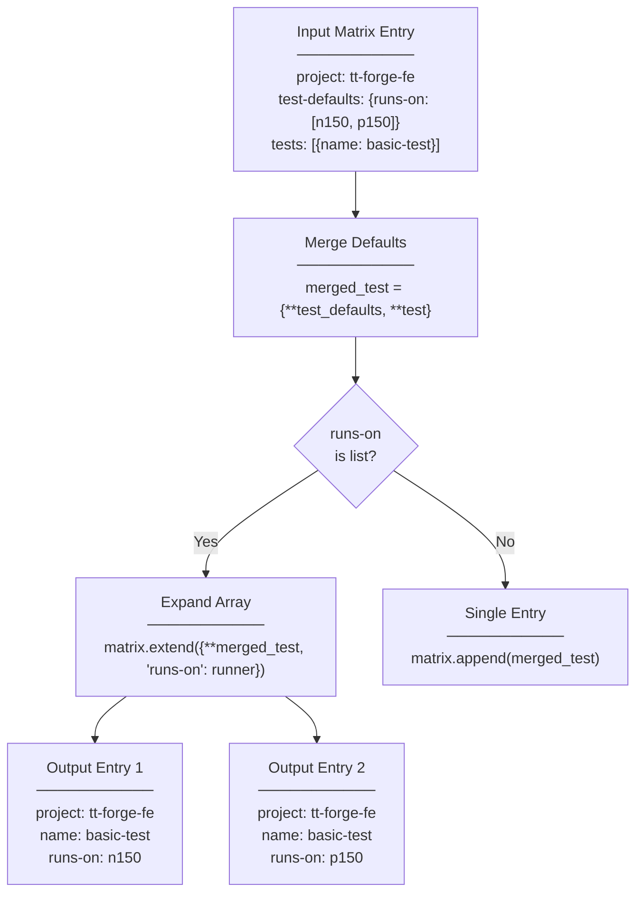


#### Project Filtering Logic


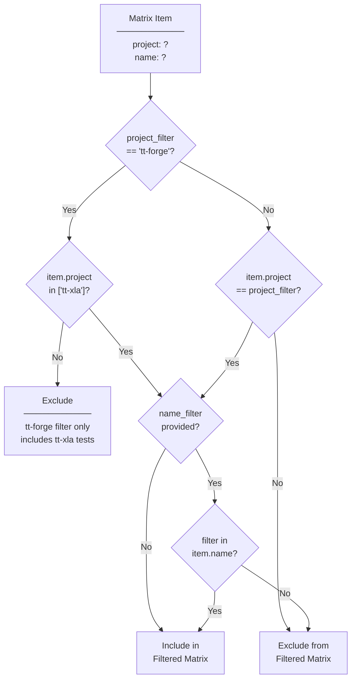


### Data Flow and Reporting


```mermaid
graph LR
    PROMPT["Prompt (manual-ai-install.yml)"] -- "inputs.prompt" --> CLAUDE_ACTION["claude-code-action"]
    CLAUDE_ACTION -- "Bash/Read/Write" --> WORKSPACE["/github/workspace/"]
    WORKSPACE -- "tt-forge-ai-report.md" --> UPLOAD["actions/upload-artifact"]
    WORKSPACE -- "cat report" --> SUMMARY["GITHUB_STEP_SUMMARY"]
    
    subgraph "Entities in Code"
        PROMPT
        CLAUDE_ACTION
        WORKSPACE
    end
```


#### 5.2 Reporting Requirements


```mermaid
graph LR
    subgraph "Natural Language Space"
        "Reproducer Script"
        "Actual vs Expected"
        "Compiler Flags"
    end

    subgraph "Code Entity Space"
        "gh_issue_create"["gh issue create"]
        "ttlang_initial_mlir"["/tmp/ttlang_initial.mlir"]
        "ttlang_final_mlir"["/tmp/ttlang_final.mlir"]
        "ttlang_test_output"["/tmp/ttlang_test_output.log"]
    end

    "Reproducer Script" --> "gh_issue_create"
    "Actual vs Expected" --> "ttlang_test_output"
    "Compiler Flags" --> "ttlang_initial_mlir"
    "Compiler Flags" --> "ttlang_final_mlir"
```

Sources: [skills/tt-bug-report/SKILL.md:1-68]()
43:T1f36,
```

