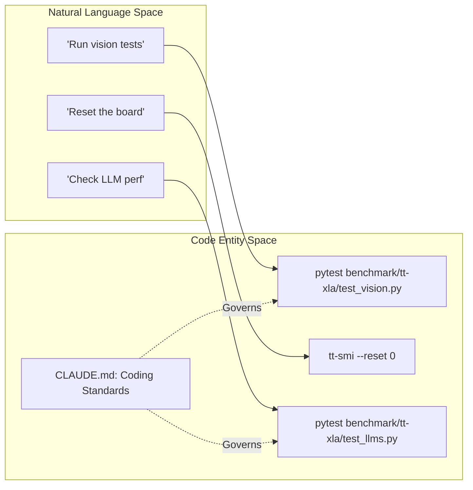
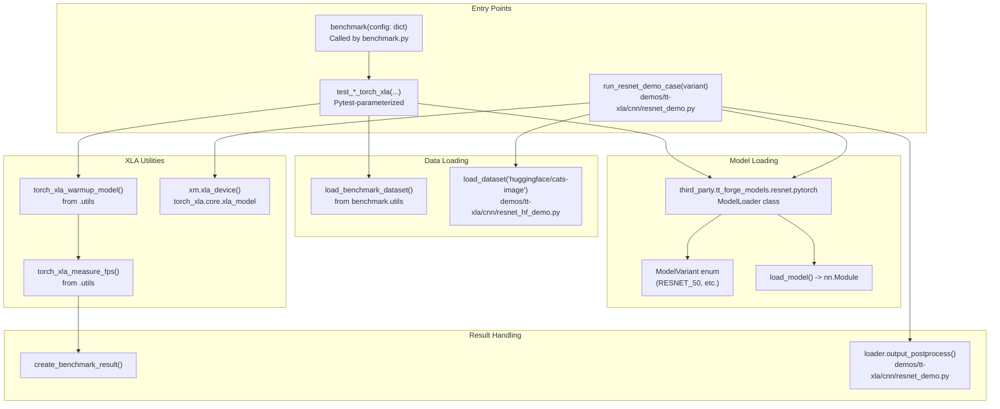
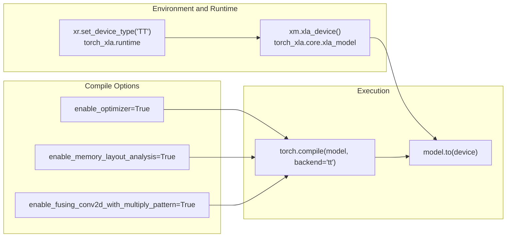

# CNN and Vision Model Benchmarks

Relevant source files
*   [demos/tt-xla/cnn/arnold_demo.py](https://github.com/tenstorrent/tt-forge/blob/6f2d9645/demos/tt-xla/cnn/arnold_demo.py)
*   [demos/tt-xla/cnn/resnet_demo.py](https://github.com/tenstorrent/tt-forge/blob/6f2d9645/demos/tt-xla/cnn/resnet_demo.py)
*   [demos/tt-xla/cnn/resnet_hf_demo.py](https://github.com/tenstorrent/tt-forge/blob/6f2d9645/demos/tt-xla/cnn/resnet_hf_demo.py)
*   [demos/tt-xla/nlp/pytorch/albert_demo.py](https://github.com/tenstorrent/tt-forge/blob/6f2d9645/demos/tt-xla/nlp/pytorch/albert_demo.py)
*   [demos/tt-xla/nlp/pytorch/bge3_demo.py](https://github.com/tenstorrent/tt-forge/blob/6f2d9645/demos/tt-xla/nlp/pytorch/bge3_demo.py)

## Purpose and Scope

This document describes the Convolutional Neural Network (CNN) and vision model benchmarks implemented for the torch-xla backend. These benchmarks measure inference performance of CNN architectures on Tenstorrent hardware using PyTorch with the torch-xla integration through the TT-XLA frontend.

The CNN benchmarks cover image classification models including ResNet, VoVNet, EfficientNet, and MobileNetV2. All benchmarks use the ImageNet-1K validation dataset and measure throughput in samples per second (FPS) and evaluation accuracy.

For segmentation and transformer vision models, see page 3.3.2. For the overall benchmarking infrastructure, see page 3.1.

## Supported CNN Models

The CNN benchmark suite includes four model families, each implemented in a separate benchmark module:

| Model | File | Model Variant | Layers | Batch Size | Data Format |
| --- | --- | --- | --- | --- | --- |
| ResNet | `benchmark/tt-xla/resnet.py` | microsoft/resnet-50 | 50 | 12 | bfloat16, float32 |
| VoVNet | `benchmark/tt-xla/vovnet.py` | ese_vovnet19b_dw.ra_in1k | - | 1 | bfloat16 |
| EfficientNet | `benchmark/tt-xla/efficientnet.py` | timm/efficientnet-b0 | 82 | 1 | bfloat16 |
| MobileNetV2 | `benchmark/tt-xla/mobilenetv2.py` | torch-hub/mobilenet_v2 | 54 | 1 | bfloat16 |

All models use:

*   **Input size**: 224x224 pixels
*   **Channels**: 3 (RGB)
*   **Task**: Image classification
*   **Dataset**: ImageNet-1K validation split
*   **Loop counts**: 1, 2, 4, 8, 16, 32 iterations

Sources: [benchmark/tt-xla/resnet.py 79-81](https://github.com/tenstorrent/tt-forge/blob/6f2d9645/benchmark/tt-xla/resnet.py#L79-L81)[benchmark/tt-xla/vovnet.py 78-80](https://github.com/tenstorrent/tt-forge/blob/6f2d9645/benchmark/tt-xla/vovnet.py#L78-L80)[benchmark/tt-xla/efficientnet.py 50-78](https://github.com/tenstorrent/tt-forge/blob/6f2d9645/benchmark/tt-xla/efficientnet.py#L50-L78)[benchmark/tt-xla/mobilenetv2.py 50-78](https://github.com/tenstorrent/tt-forge/blob/6f2d9645/benchmark/tt-xla/mobilenetv2.py#L50-L78)

## Common Benchmark Architecture

### Workflow Overview

All CNN benchmarks follow a standardized workflow from initialization through measurement to result reporting. This flow is also mirrored in the demonstration scripts like `resnet_demo.py` and `resnet_hf_demo.py`.

Sources: [benchmark/tt-xla/resnet.py 12-46](https://github.com/tenstorrent/tt-forge/blob/6f2d9645/benchmark/tt-xla/resnet.py#L12-L46)[benchmark/tt-xla/resnet.py 150-175](https://github.com/tenstorrent/tt-forge/blob/6f2d9645/benchmark/tt-xla/resnet.py#L150-L175)[demos/tt-xla/cnn/resnet_demo.py 26-34](https://github.com/tenstorrent/tt-forge/blob/6f2d9645/demos/tt-xla/cnn/resnet_demo.py#L26-L34)[demos/tt-xla/cnn/resnet_hf_demo.py 20-32](https://github.com/tenstorrent/tt-forge/blob/6f2d9645/demos/tt-xla/cnn/resnet_hf_demo.py#L20-L32)

### Code Entity Mapping

The benchmark implementation uses a consistent set of functions and classes across all CNN models, utilizing the `third_party.tt_forge_models` library for model definitions.

Sources: [benchmark/tt-xla/resnet.py 32-42](https://github.com/tenstorrent/tt-forge/blob/6f2d9645/benchmark/tt-xla/resnet.py#L32-L42)[demos/tt-xla/cnn/resnet_demo.py 18-38](https://github.com/tenstorrent/tt-forge/blob/6f2d9645/demos/tt-xla/cnn/resnet_demo.py#L18-L38)[demos/tt-xla/cnn/resnet_hf_demo.py 23-35](https://github.com/tenstorrent/tt-forge/blob/6f2d9645/demos/tt-xla/cnn/resnet_hf_demo.py#L23-L35)



Sources: [CLAUDE.md:15-62](), [CLAUDE.md:86-112]()
```




Sources: [benchmark/tt-xla/resnet.py:32-42](), [demos/tt-xla/cnn/resnet_demo.py:18-38](), [demos/tt-xla/cnn/resnet_hf_demo.py:23-35]()
```
### Runtime Configuration

All CNN benchmarks and demos configure the torch-xla runtime with consistent settings to target Tenstorrent hardware:

Sources: [demos/tt-xla/cnn/resnet_demo.py 26-38](https://github.com/tenstorrent/tt-forge/blob/6f2d9645/demos/tt-xla/cnn/resnet_demo.py#L26-L38)[demos/tt-xla/cnn/arnold_demo.py 18-30](https://github.com/tenstorrent/tt-forge/blob/6f2d9645/demos/tt-xla/cnn/arnold_demo.py#L18-L30)[benchmark/tt-xla/resnet.py 150-159](https://github.com/tenstorrent/tt-forge/blob/6f2d9645/benchmark/tt-xla/resnet.py#L150-L159)




Sources: [demos/tt-xla/cnn/resnet_demo.py:26-38](), [demos/tt-xla/cnn/arnold_demo.py:18-30](), [benchmark/tt-xla/resnet.py:150-159]()
```
## Model-Specific Implementations

### ResNet Benchmark and Demos

The ResNet suite tests the ResNet-50 architecture. Demos include standard `tt_forge_models` variants and a HuggingFace-native tutorial implementation.

**Key Characteristics:**

*   **Benchmark Variant**: `ResNetVariant.RESNET_50_HF` loaded via `ResNetLoader`.
*   **Demo Variants**: Supports `RESNET_50_TIMM`, `RESNET_18`, `RESNET_34`, `RESNET_50`, `RESNET_101`, and `RESNET_152`[demos/tt-xla/cnn/resnet_demo.py 60-67](https://github.com/tenstorrent/tt-forge/blob/6f2d9645/demos/tt-xla/cnn/resnet_demo.py#L60-L67)
*   **HuggingFace Demo**: Uses `ResNetForImageClassification` from `transformers` library [demos/tt-xla/cnn/resnet_hf_demo.py 13-27](https://github.com/tenstorrent/tt-forge/blob/6f2d9645/demos/tt-xla/cnn/resnet_hf_demo.py#L13-L27)
*   **Data Transfer**: Uses `tree_map` with `attempt_to_device` to move nested input dictionaries or lists to the XLA device [demos/tt-xla/cnn/resnet_demo.py 40-45](https://github.com/tenstorrent/tt-forge/blob/6f2d9645/demos/tt-xla/cnn/resnet_demo.py#L40-L45)

Sources: [benchmark/tt-xla/resnet.py 90-96](https://github.com/tenstorrent/tt-forge/blob/6f2d9645/benchmark/tt-xla/resnet.py#L90-L96)[demos/tt-xla/cnn/resnet_demo.py 23-53](https://github.com/tenstorrent/tt-forge/blob/6f2d9645/demos/tt-xla/cnn/resnet_demo.py#L23-L53)[demos/tt-xla/cnn/resnet_hf_demo.py 17-51](https://github.com/tenstorrent/tt-forge/blob/6f2d9645/demos/tt-xla/cnn/resnet_hf_demo.py#L17-L51)

### Arnold (RL/CNN) Demo

The Arnold demo tests a Reinforcement Learning model architecture (DefendTheCenter) which utilizes CNN layers for screen processing.

**Key Characteristics:**

*   **Variant**: `ModelVariant.DEFEND_THE_CENTER_FF`[demos/tt-xla/cnn/arnold_demo.py 60](https://github.com/tenstorrent/tt-forge/blob/6f2d9645/demos/tt-xla/cnn/arnold_demo.py#L60-L60)
*   **Inputs**: Requires both `screens` and `variables` tensors [demos/tt-xla/cnn/arnold_demo.py 23](https://github.com/tenstorrent/tt-forge/blob/6f2d9645/demos/tt-xla/cnn/arnold_demo.py#L23-L23)
*   **Processing**: Outputs Q-values after post-processing via `loader.post_process(output_tensor, return_q_values=True)`[demos/tt-xla/cnn/arnold_demo.py 52](https://github.com/tenstorrent/tt-forge/blob/6f2d9645/demos/tt-xla/cnn/arnold_demo.py#L52-L52)

Sources: [demos/tt-xla/cnn/arnold_demo.py 15-54](https://github.com/tenstorrent/tt-forge/blob/6f2d9645/demos/tt-xla/cnn/arnold_demo.py#L15-L54)

### VoVNet Benchmark

The VoVNet benchmark (`benchmark/tt-xla/vovnet.py`) tests the ESE-VoVNet-19b-DW architecture from the TIMM library.

**Key Characteristics:**

*   Model variant: `VovNetVariant.TIMM_VOVNET19B_DW_RAIN1K` loaded via `VovNetLoader`.
*   Batch size: 1.
*   Data format: `bfloat16` only.
*   Higher PCC requirement: 0.97 for validation.

Sources: [benchmark/tt-xla/vovnet.py 89-100](https://github.com/tenstorrent/tt-forge/blob/6f2d9645/benchmark/tt-xla/vovnet.py#L89-L100)[benchmark/tt-xla/vovnet.py 133-136](https://github.com/tenstorrent/tt-forge/blob/6f2d9645/benchmark/tt-xla/vovnet.py#L133-L136)

### EfficientNet Benchmark

The EfficientNet benchmark (`benchmark/tt-xla/efficientnet.py`) tests the EfficientNet-B0 architecture from TIMM.

**Key Characteristics:**

*   Model variant: `EfficientNetVariant.TIMM_EFFICIENTNET_B0` loaded via `EfficientNetLoader`.
*   Batch size: 1.
*   Number of layers: 82.
*   PCC requirement: 0.97 for validation.

Sources: [benchmark/tt-xla/efficientnet.py 87-93](https://github.com/tenstorrent/tt-forge/blob/6f2d9645/benchmark/tt-xla/efficientnet.py#L87-L93)[benchmark/tt-xla/efficientnet.py 123-126](https://github.com/tenstorrent/tt-forge/blob/6f2d9645/benchmark/tt-xla/efficientnet.py#L123-L126)

### MobileNetV2 Benchmark

The MobileNetV2 benchmark (`benchmark/tt-xla/mobilenetv2.py`) tests the MobileNetV2 architecture from PyTorch Hub.

**Key Characteristics:**

*   Model variant: `MobileNetV2Variant.MOBILENET_V2_TORCH_HUB` loaded via `MobileNetV2Loader`.
*   Batch size: 1.
*   Number of layers: 54.
*   Handles models with `.logits` attribute during evaluation.

Sources: [benchmark/tt-xla/mobilenetv2.py 87-93](https://github.com/tenstorrent/tt-forge/blob/6f2d9645/benchmark/tt-xla/mobilenetv2.py#L87-L93)[benchmark/tt-xla/mobilenetv2.py 123-126](https://github.com/tenstorrent/tt-forge/blob/6f2d9645/benchmark/tt-xla/mobilenetv2.py#L123-L126)

## Benchmark Execution Flow

### Data Preparation and Device Transfer

After data preparation, the model is compiled and transferred to the TT device using the torch-xla runtime:

Sources: [demos/tt-xla/cnn/resnet_demo.py 26-45](https://github.com/tenstorrent/tt-forge/blob/6f2d9645/demos/tt-xla/cnn/resnet_demo.py#L26-L45)[benchmark/tt-xla/resnet.py 150-169](https://github.com/tenstorrent/tt-forge/blob/6f2d9645/benchmark/tt-xla/resnet.py#L150-L169)[demos/tt-xla/cnn/arnold_demo.py 18-39](https://github.com/tenstorrent/tt-forge/blob/6f2d9645/demos/tt-xla/cnn/arnold_demo.py#L18-L39)

### Performance Measurement

The core performance measurement uses `torch_xla_measure_fps()` which handles device synchronization and timing:

Sources: [benchmark/tt-xla/resnet.py 172-174](https://github.com/tenstorrent/tt-forge/blob/6f2d9645/benchmark/tt-xla/resnet.py#L172-L174)[benchmark/tt-xla/vovnet.py 176-178](https://github.com/tenstorrent/tt-forge/blob/6f2d9645/benchmark/tt-xla/vovnet.py#L176-L178)

## Configuration Parameters

### Pytest Parameterization

All CNN benchmarks use pytest's `@pytest.mark.parametrize` decorator to test multiple configurations:

| Parameter | Values | Purpose |
| --- | --- | --- |
| `batch_size` | `[1]` or `[12]` | Samples per batch |
| `loop_count` | `[1, 2, 4, 8, 16, 32]` | Inference iterations |
| `data_format` | `["bfloat16", "float32"]` | Precision |
| `task` | `["classification"]` | ML task type |

Sources: [benchmark/tt-xla/resnet.py 84-89](https://github.com/tenstorrent/tt-forge/blob/6f2d9645/benchmark/tt-xla/resnet.py#L84-L89)[benchmark/tt-xla/vovnet.py 83-88](https://github.com/tenstorrent/tt-forge/blob/6f2d9645/benchmark/tt-xla/vovnet.py#L83-L88)

### Compiler Optimization Flags

All benchmarks use these optimization settings in the `options` dictionary:

| Flag | Value | Purpose |
| --- | --- | --- |
| `enable_optimizer` | `True` | Enable graph-level optimizations |
| `enable_memory_layout_analysis` | `True` | Optimize memory layout |
| `enable_fusing_conv2d_with_multiply_pattern` | `True` | Fuse Conv2D with element-wise multiply |

Sources: [benchmark/tt-xla/resnet.py 12-15](https://github.com/tenstorrent/tt-forge/blob/6f2d9645/benchmark/tt-xla/resnet.py#L12-L15)[benchmark/tt-xla/resnet.py 150-155](https://github.com/tenstorrent/tt-forge/blob/6f2d9645/benchmark/tt-xla/resnet.py#L150-L155)

## Performance Metrics and Reporting

Each benchmark produces a standardized result dictionary via `create_benchmark_result()`:

| Field | Description |
| --- | --- |
| `samples_per_sec` | Calculated as `(batch_size * loop_count) / total_time` |
| `evaluation_score` | Accuracy for classification tasks |
| `pcc_value` | Pearson Correlation Coefficient for validation |
| `cpu_fps` | Comparison metric against host CPU performance |

Sources: [benchmark/tt-xla/resnet.py 189-191](https://github.com/tenstorrent/tt-forge/blob/6f2d9645/benchmark/tt-xla/resnet.py#L189-L191)[benchmark/tt-xla/resnet.py 224-248](https://github.com/tenstorrent/tt-forge/blob/6f2d9645/benchmark/tt-xla/resnet.py#L224-L248)

Dismiss
Refresh this wiki

Enter email to refresh
