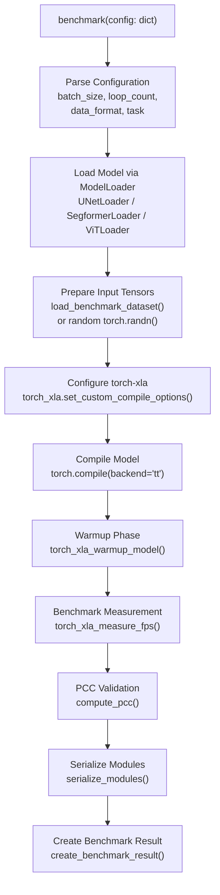
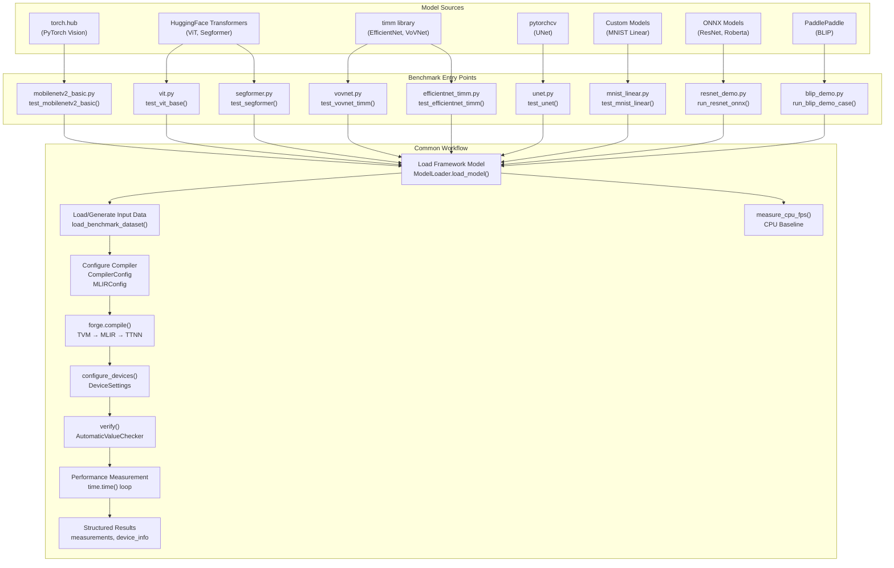
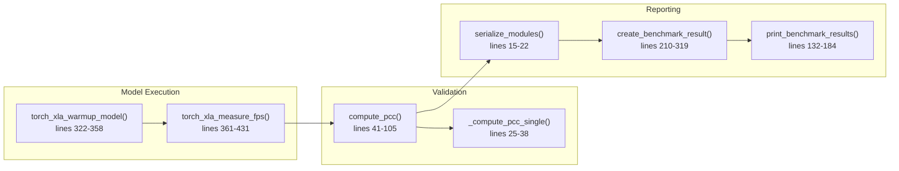
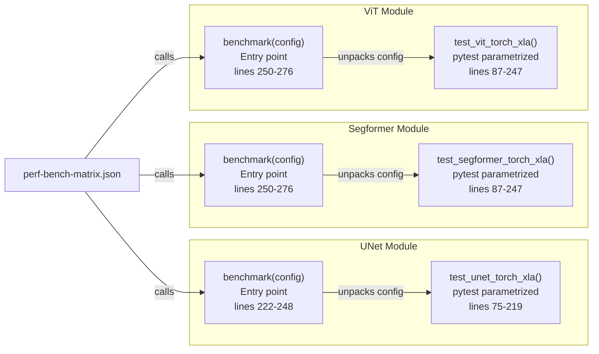

# Segmentation and Transformer Benchmarks

Relevant source files
*   [demos/tt-xla/cnn/resnet_hf_demo.py](https://github.com/tenstorrent/tt-forge/blob/6f2d9645/demos/tt-xla/cnn/resnet_hf_demo.py)
*   [demos/tt-xla/nlp/jax/albert_demo.py](https://github.com/tenstorrent/tt-forge/blob/6f2d9645/demos/tt-xla/nlp/jax/albert_demo.py)
*   [demos/tt-xla/nlp/jax/opt_demo.py](https://github.com/tenstorrent/tt-forge/blob/6f2d9645/demos/tt-xla/nlp/jax/opt_demo.py)
*   [demos/tt-xla/nlp/pytorch/albert_demo.py](https://github.com/tenstorrent/tt-forge/blob/6f2d9645/demos/tt-xla/nlp/pytorch/albert_demo.py)

## Purpose and Scope

This document details the TT-XLA benchmark implementations for segmentation and transformer models: UNet, Segformer, and Vision Transformer (ViT). These benchmarks measure inference performance on Tenstorrent hardware using the `torch-xla` backend.

For CNN benchmarks (ResNet, VoVNet, EfficientNet, MobileNetV2), see [3.3.1](https://github.com/tenstorrent/tt-forge/blob/6f2d9645/3.3.1) For the overall benchmarking infrastructure, see [3.1](https://github.com/tenstorrent/tt-forge/blob/6f2d9645/3.1) and [3.2](https://github.com/tenstorrent/tt-forge/blob/6f2d9645/3.2)

## Overview

The segmentation and transformer benchmarks consist of three model implementations located in the `benchmark/tt-xla/` directory. These benchmarks utilize the `tt-xla` frontend, which integrates PyTorch with Tenstorrent hardware via the `torch-xla` stack.

| Model | File | Architecture Type | Primary Task | Model Loader |
| --- | --- | --- | --- | --- |
| UNet | `unet.py` | Encoder-Decoder Segmentation | Semantic Segmentation (Cityscapes) | `third_party.tt_forge_models.vgg19_unet.pytorch.loader.ModelLoader` |
| Segformer | `segformer.py` | Transformer-based Segmentation | Semantic Segmentation / Classification | `third_party.tt_forge_models.segformer.semantic_segmentation.pytorch.loader.ModelLoader` |
| ViT | `vit.py` | Vision Transformer | Image Classification | `third_party.tt_forge_models.vit.pytorch.loader.ViTLoader` |

All three benchmarks follow the same execution pattern: model loading, `torch-xla` compilation, warmup, measurement, and validation using Pearson Correlation Coefficient (PCC).

**Sources:**[benchmark/tt-xla/unet.py 1-249](https://github.com/tenstorrent/tt-forge/blob/6f2d9645/benchmark/tt-xla/unet.py#L1-L249)[benchmark/tt-xla/segformer.py 1-277](https://github.com/tenstorrent/tt-forge/blob/6f2d9645/benchmark/tt-xla/segformer.py#L1-L277)[benchmark/tt-xla/vit.py 1-277](https://github.com/tenstorrent/tt-forge/blob/6f2d9645/benchmark/tt-xla/vit.py#L1-L277)

## Benchmark Execution Flow

The following diagram illustrates the data flow from configuration parsing to final result generation.

### System Data Flow: Configuration to Results

**Sources:**[benchmark/tt-xla/unet.py 222-248](https://github.com/tenstorrent/tt-forge/blob/6f2d9645/benchmark/tt-xla/unet.py#L222-L248)[benchmark/tt-xla/segformer.py 250-276](https://github.com/tenstorrent/tt-forge/blob/6f2d9645/benchmark/tt-xla/segformer.py#L250-L276)[benchmark/tt-xla/vit.py 250-276](https://github.com/tenstorrent/tt-forge/blob/6f2d9645/benchmark/tt-xla/vit.py#L250-L276)[demos/tt-xla/cnn/resnet_hf_demo.py 32-36](https://github.com/tenstorrent/tt-forge/blob/6f2d9645/demos/tt-xla/cnn/resnet_hf_demo.py#L32-L36)






## Common Infrastructure

All three benchmarks share common utilities defined in `benchmark/tt-xla/utils.py`.

### Core Benchmarking Functions



### torch_xla_warmup_model Function

The `torch_xla_warmup_model()` function at [benchmark/tt-xla/utils.py 322-358](https://github.com/tenstorrent/tt-forge/blob/6f2d9645/benchmark/tt-xla/utils.py#L322-L358) performs device warmup before benchmarking. It processes `loop_count` inputs through the model without timing, moving outputs back to CPU to ensure the device is ready for measurement.

Key implementation details:

*   Validates input count matches `loop_count`[benchmark/tt-xla/utils.py 339-340](https://github.com/tenstorrent/tt-forge/blob/6f2d9645/benchmark/tt-xla/utils.py#L339-L340)
*   Uses `torch.no_grad()` context for inference [benchmark/tt-xla/utils.py 342](https://github.com/tenstorrent/tt-forge/blob/6f2d9645/benchmark/tt-xla/utils.py#L342-L342)
*   Handles both `torch.Tensor` and tuple outputs [benchmark/tt-xla/utils.py 351-357](https://github.com/tenstorrent/tt-forge/blob/6f2d9645/benchmark/tt-xla/utils.py#L351-L357)
*   Extracts `.logits` attribute if present (for models like Segformer) [benchmark/tt-xla/utils.py 348-349](https://github.com/tenstorrent/tt-forge/blob/6f2d9645/benchmark/tt-xla/utils.py#L348-L349)

### torch_xla_measure_fps Function

The `torch_xla_measure_fps()` function at [benchmark/tt-xla/utils.py 361-431](https://github.com/tenstorrent/tt-forge/blob/6f2d9645/benchmark/tt-xla/utils.py#L361-L431) performs the actual benchmark measurement, returning predictions and total execution time.

Execution sequence:

1.   Process each input through model forward pass [benchmark/tt-xla/utils.py 392-406](https://github.com/tenstorrent/tt-forge/blob/6f2d9645/benchmark/tt-xla/utils.py#L392-L406)
2.   Time each iteration using `time.perf_counter_ns()`[benchmark/tt-xla/utils.py 393-406](https://github.com/tenstorrent/tt-forge/blob/6f2d9645/benchmark/tt-xla/utils.py#L393-L406)
3.   Move all outputs to CPU after forward passes complete [benchmark/tt-xla/utils.py 411-421](https://github.com/tenstorrent/tt-forge/blob/6f2d9645/benchmark/tt-xla/utils.py#L411-L421)
4.   Include CPU transfer time in total [benchmark/tt-xla/utils.py 426-427](https://github.com/tenstorrent/tt-forge/blob/6f2d9645/benchmark/tt-xla/utils.py#L426-L427)

### PCC Validation

The `compute_pcc()` function at [benchmark/tt-xla/utils.py 41-105](https://github.com/tenstorrent/tt-forge/blob/6f2d9645/benchmark/tt-xla/utils.py#L41-L105) validates device output against golden (CPU) output using Pearson Correlation Coefficient. The function supports both single tensors and collections (for multi-scale outputs), computing per-scale PCC and overall PCC [benchmark/tt-xla/utils.py 61-83](https://github.com/tenstorrent/tt-forge/blob/6f2d9645/benchmark/tt-xla/utils.py#L61-L83)

**Sources:**[benchmark/tt-xla/utils.py 15-431](https://github.com/tenstorrent/tt-forge/blob/6f2d9645/benchmark/tt-xla/utils.py#L15-L431)

## UNet Benchmark

The UNet benchmark implements semantic segmentation benchmarking for the Cityscapes dataset variant.

### Configuration and Compilation

UNet is unique among these benchmarks in supporting both `bfloat16` and `float32` data formats [benchmark/tt-xla/unet.py 52](https://github.com/tenstorrent/tt-forge/blob/6f2d9645/benchmark/tt-xla/unet.py#L52-L52) It uses specific compilation options at [benchmark/tt-xla/unet.py 128-133](https://github.com/tenstorrent/tt-forge/blob/6f2d9645/benchmark/tt-xla/unet.py#L128-L133):

`options = {    "enable_optimizer": OPTIMIZER_ENABLED,    "enable_memory_layout_analysis": MEMORY_LAYOUT_ANALYSIS_ENABLED,    "enable_l1_interleaved": False,    "enable_fusing_conv2d_with_multiply_pattern": True,}`
The `enable_fusing_conv2d_with_multiply_pattern` option is particularly important for UNet's convolutional architecture.

### Input Data

UNet uses random input data rather than real Cityscapes images [benchmark/tt-xla/unet.py 95-100](https://github.com/tenstorrent/tt-forge/blob/6f2d9645/benchmark/tt-xla/unet.py#L95-L100) to allow testing without dataset dependencies.

**Sources:**[benchmark/tt-xla/unet.py 1-249](https://github.com/tenstorrent/tt-forge/blob/6f2d9645/benchmark/tt-xla/unet.py#L1-L249)

## Segformer Benchmark

Segformer is a transformer-based semantic segmentation model that can also perform classification tasks.

### Configuration and Model Variant

Segformer differs from other benchmarks by disabling the optimizer and memory layout analysis [benchmark/tt-xla/segformer.py 12-14](https://github.com/tenstorrent/tt-forge/blob/6f2d9645/benchmark/tt-xla/segformer.py#L12-L14) It uses the `B0_FINETUNED` variant loaded via `SegformerLoader`[benchmark/tt-xla/segformer.py 123](https://github.com/tenstorrent/tt-forge/blob/6f2d9645/benchmark/tt-xla/segformer.py#L123-L123)

### Task Support

Segformer supports two task modes:

1.   **Classification with ImageNet-1K**: Uses `load_benchmark_dataset()` to load real images and labels [benchmark/tt-xla/segformer.py 98-106](https://github.com/tenstorrent/tt-forge/blob/6f2d9645/benchmark/tt-xla/segformer.py#L98-L106)
2.   **Random Data ("na" task)**: Uses random tensors for testing [benchmark/tt-xla/segformer.py 107-113](https://github.com/tenstorrent/tt-forge/blob/6f2d9645/benchmark/tt-xla/segformer.py#L107-L113)

**Sources:**[benchmark/tt-xla/segformer.py 1-277](https://github.com/tenstorrent/tt-forge/blob/6f2d9645/benchmark/tt-xla/segformer.py#L1-L277)

## Vision Transformer (ViT) Benchmark

ViT is a pure transformer architecture for image classification that treats images as sequences of patches.

### Configuration and Cache Initialization

ViT uses the same optimization settings as UNet [benchmark/tt-xla/vit.py 12-15](https://github.com/tenstorrent/tt-forge/blob/6f2d9645/benchmark/tt-xla/vit.py#L12-L15) It explicitly initializes the XLA cache at [benchmark/tt-xla/vit.py 46-48](https://github.com/tenstorrent/tt-forge/blob/6f2d9645/benchmark/tt-xla/vit.py#L46-L48):

`xr.set_device_type("TT")cache_dir = f"{os.getcwd()}/cachedir"xr.initialize_cache(cache_dir)`
### Model Variant

ViT uses the `BASE` variant (12 layers) loaded via `ViTLoader`[benchmark/tt-xla/vit.py 123-126](https://github.com/tenstorrent/tt-forge/blob/6f2d9645/benchmark/tt-xla/vit.py#L123-L126) Like Segformer, it supports both classification with real data and random data testing [benchmark/tt-xla/vit.py 98-114](https://github.com/tenstorrent/tt-forge/blob/6f2d9645/benchmark/tt-xla/vit.py#L98-L114)

**Sources:**[benchmark/tt-xla/vit.py 1-277](https://github.com/tenstorrent/tt-forge/blob/6f2d9645/benchmark/tt-xla/vit.py#L1-L277)

## Comparison and Integration

### Benchmark Comparison Table

| Feature | UNet | Segformer | ViT |
| --- | --- | --- | --- |
| **Architecture** | Encoder-Decoder CNN | Transformer-based | Pure Transformer |
| **Optimizer** | Enabled | Disabled | Enabled |
| **Memory Layout Analysis** | Enabled | Disabled | Enabled |
| **Data Formats** | bfloat16, float32 | bfloat16 only | bfloat16 only |
| **Task Support** | Random data only | Classification, Random | Classification, Random |
| **Model Variant** | `unet_cityscapes` | `B0_FINETUNED` | `BASE` |
| **Layers** | -1 (not specified) | 32 | 12 |

### Code Entity Mapping: Benchmark Integration

Each `benchmark()` function serves as the entry point for the dynamic benchmark execution system. It extracts configuration values and calls the corresponding test function:

*   UNet: [benchmark/tt-xla/unet.py 222-248](https://github.com/tenstorrent/tt-forge/blob/6f2d9645/benchmark/tt-xla/unet.py#L222-L248)
*   Segformer: [benchmark/tt-xla/segformer.py 250-276](https://github.com/tenstorrent/tt-forge/blob/6f2d9645/benchmark/tt-xla/segformer.py#L250-L276)
*   ViT: [benchmark/tt-xla/vit.py 250-276](https://github.com/tenstorrent/tt-forge/blob/6f2d9645/benchmark/tt-xla/vit.py#L250-L276)

**Sources:**[benchmark/tt-xla/unet.py 69-248](https://github.com/tenstorrent/tt-forge/blob/6f2d9645/benchmark/tt-xla/unet.py#L69-L248)[benchmark/tt-xla/segformer.py 81-276](https://github.com/tenstorrent/tt-forge/blob/6f2d9645/benchmark/tt-xla/segformer.py#L81-L276)[benchmark/tt-xla/vit.py 81-276](https://github.com/tenstorrent/tt-forge/blob/6f2d9645/benchmark/tt-xla/vit.py#L81-L276)




Each `benchmark()` function serves as the entry point for the dynamic benchmark execution system. It extracts configuration values and calls the corresponding test function:
- UNet: [benchmark/tt-xla/unet.py:222-248]()
- Segformer: [benchmark/tt-xla/segformer.py:250-276]()
- ViT: [benchmark/tt-xla/vit.py:250-276]()
```
## Module Serialization and Reporting

All benchmarks serialize compiled modules to disk using `serialize_modules()` after measurement. This function at [benchmark/tt-xla/utils.py 15-22](https://github.com/tenstorrent/tt-forge/blob/6f2d9645/benchmark/tt-xla/utils.py#L15-L22) calls `parse_compiled_artifacts_from_cache_to_disk()` from the `tt_torch` module.

Benchmarks return a standardized result dictionary created by `create_benchmark_result()` at [benchmark/tt-xla/utils.py 210-319](https://github.com/tenstorrent/tt-forge/blob/6f2d9645/benchmark/tt-xla/utils.py#L210-L319) Each benchmark adds CPU FPS as a custom measurement [benchmark/tt-xla/unet.py 169-175](https://github.com/tenstorrent/tt-forge/blob/6f2d9645/benchmark/tt-xla/unet.py#L169-L175)[benchmark/tt-xla/segformer.py 195-201](https://github.com/tenstorrent/tt-forge/blob/6f2d9645/benchmark/tt-xla/segformer.py#L195-L201)[benchmark/tt-xla/vit.py 195-201](https://github.com/tenstorrent/tt-forge/blob/6f2d9645/benchmark/tt-xla/vit.py#L195-L201)

**Sources:**[benchmark/tt-xla/utils.py 15-319](https://github.com/tenstorrent/tt-forge/blob/6f2d9645/benchmark/tt-xla/utils.py#L15-L319)[benchmark/tt-xla/unet.py 154-175](https://github.com/tenstorrent/tt-forge/blob/6f2d9645/benchmark/tt-xla/unet.py#L154-L175)[benchmark/tt-xla/segformer.py 173-201](https://github.com/tenstorrent/tt-forge/blob/6f2d9645/benchmark/tt-xla/segformer.py#L173-L201)[benchmark/tt-xla/vit.py 173-201](https://github.com/tenstorrent/tt-forge/blob/6f2d9645/benchmark/tt-xla/vit.py#L173-L201)

Dismiss
Refresh this wiki

Enter email to refresh
