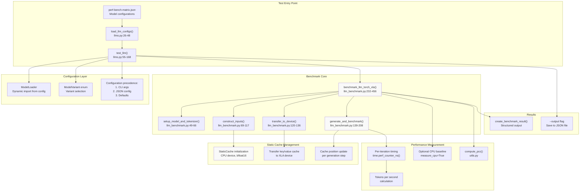
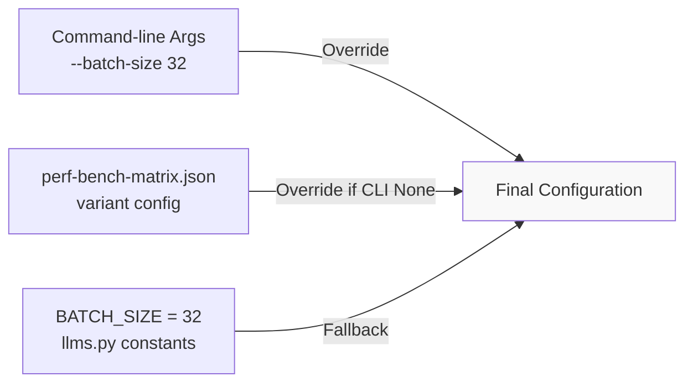

# LLM Benchmarks

Relevant source files
*   [demos/tt-xla/nlp/jax/gpt_demo.py](https://github.com/tenstorrent/tt-forge/blob/6f2d9645/demos/tt-xla/nlp/jax/gpt_demo.py)
*   [demos/tt-xla/nlp/pytorch/llama_demo.py](https://github.com/tenstorrent/tt-forge/blob/6f2d9645/demos/tt-xla/nlp/pytorch/llama_demo.py)
*   [demos/tt-xla/nlp/pytorch/qwen_demo.py](https://github.com/tenstorrent/tt-forge/blob/6f2d9645/demos/tt-xla/nlp/pytorch/qwen_demo.py)
*   [demos/tt-xla/nlp/pytorch/tiny_llama_demo.py](https://github.com/tenstorrent/tt-forge/blob/6f2d9645/demos/tt-xla/nlp/pytorch/tiny_llama_demo.py)

## Purpose and Scope

This page documents the Large Language Model (LLM) benchmarking infrastructure for the torch-xla backend, which measures text generation performance on Tenstorrent hardware. The benchmark system supports autoregressive token generation with static key-value caching and comprehensive performance measurement.

For CNN and vision model benchmarks using torch-xla, see [CNN and Vision Model Benchmarks](https://deepwiki.com/tenstorrent/tt-forge/3.3.1-cnn-and-vision-model-benchmarks). For segmentation and transformer benchmarks, see [Segmentation and Transformer Benchmarks](https://deepwiki.com/tenstorrent/tt-forge/3.3.2-segmentation-and-transformer-benchmarks). For benchmarks using the forge.compile backend instead of torch-xla, see [forge.compile Backend Benchmarks](https://deepwiki.com/tenstorrent/tt-forge/3.4-forge.compile-backend-benchmarks).

**Sources:**[benchmark/tt-xla/llm_benchmark.py 1-457](https://github.com/tenstorrent/tt-forge/blob/6f2d9645/benchmark/tt-xla/llm_benchmark.py#L1-L457)[benchmark/tt-xla/llms.py 1-168](https://github.com/tenstorrent/tt-forge/blob/6f2d9645/benchmark/tt-xla/llms.py#L1-L168)

## Overview

The LLM benchmarking system provides infrastructure for measuring text generation performance of causal language models compiled with torch-xla for Tenstorrent hardware. The system implements autoregressive token generation with static key-value cache management, performance measurement in tokens per second, and numerical correctness validation using Pearson Correlation Coefficient (PCC).

The benchmark workflow consists of five phases:

1.   **Model Setup**: Load model and tokenizer from HuggingFace
2.   **Input Construction**: Tokenize input prompts and initialize static cache
3.   **Compilation**: Compile model with `torch.compile` using the `"tt"` backend
4.   **Warmup**: Execute minimum iterations to warm up program cache
5.   **Benchmark**: Run generation loop with per-token timing and validation

**Sources:**[benchmark/tt-xla/llm_benchmark.py 232-456](https://github.com/tenstorrent/tt-forge/blob/6f2d9645/benchmark/tt-xla/llm_benchmark.py#L232-L456)

## Architecture

The following diagram shows the main components of the LLM benchmarking system and their relationships:

**Component Roles:**

| Component | File Location | Responsibility |
| --- | --- | --- |
| `test_llm()` | [benchmark/tt-xla/llms.py 55-168](https://github.com/tenstorrent/tt-forge/blob/6f2d9645/benchmark/tt-xla/llms.py#L55-L168) | Pytest entry point, configuration precedence, result saving |
| `load_llm_configs()` | [benchmark/tt-xla/llms.py 26-48](https://github.com/tenstorrent/tt-forge/blob/6f2d9645/benchmark/tt-xla/llms.py#L26-L48) | Load model configurations from JSON file |
| `benchmark_llm_torch_xla()` | [benchmark/tt-xla/llm_benchmark.py 232-456](https://github.com/tenstorrent/tt-forge/blob/6f2d9645/benchmark/tt-xla/llm_benchmark.py#L232-L456) | Main benchmark orchestration and measurement |
| `setup_model_and_tokenizer()` | [benchmark/tt-xla/llm_benchmark.py 49-66](https://github.com/tenstorrent/tt-forge/blob/6f2d9645/benchmark/tt-xla/llm_benchmark.py#L49-L66) | Instantiate HuggingFace model and tokenizer |
| `construct_inputs()` | [benchmark/tt-xla/llm_benchmark.py 69-117](https://github.com/tenstorrent/tt-forge/blob/6f2d9645/benchmark/tt-xla/llm_benchmark.py#L69-L117) | Tokenize prompts, create `StaticCache` |
| `transfer_to_device()` | [benchmark/tt-xla/llm_benchmark.py 120-136](https://github.com/tenstorrent/tt-forge/blob/6f2d9645/benchmark/tt-xla/llm_benchmark.py#L120-L136) | Move tensors to XLA device |
| `generate_and_benchmark()` | [benchmark/tt-xla/llm_benchmark.py 139-208](https://github.com/tenstorrent/tt-forge/blob/6f2d9645/benchmark/tt-xla/llm_benchmark.py#L139-L208) | Autoregressive generation loop with timing |

**Sources:**[benchmark/tt-xla/llm_benchmark.py 1-457](https://github.com/tenstorrent/tt-forge/blob/6f2d9645/benchmark/tt-xla/llm_benchmark.py#L1-L457)[benchmark/tt-xla/llms.py 1-168](https://github.com/tenstorrent/tt-forge/blob/6f2d9645/benchmark/tt-xla/llms.py#L1-L168)




**Component Roles:**

| Component | File Location | Responsibility |
|-----------|---------------|----------------|
| `test_llm()` | [benchmark/tt-xla/llms.py:55-168]() | Pytest entry point, configuration precedence, result saving |
| `load_llm_configs()` | [benchmark/tt-xla/llms.py:26-48]() | Load model configurations from JSON file |
| `benchmark_llm_torch_xla()` | [benchmark/tt-xla/llm_benchmark.py:232-456]() | Main benchmark orchestration and measurement |
| `setup_model_and_tokenizer()` | [benchmark/tt-xla/llm_benchmark.py:49-66]() | Instantiate HuggingFace model and tokenizer |
| `construct_inputs()` | [benchmark/tt-xla/llm_benchmark.py:69-117]() | Tokenize prompts, create `StaticCache` |
| `transfer_to_device()` | [benchmark/tt-xla/llm_benchmark.py:120-136]() | Move tensors to XLA device |
| `generate_and_benchmark()` | [benchmark/tt-xla/llm_benchmark.py:139-208]() | Autoregressive generation loop with timing |
```
## Model Configuration System

The LLM benchmark system uses a centralized JSON configuration file to define model-specific parameters and supports runtime overrides via command-line arguments.

### Configuration Hierarchy

Configuration values are resolved in the following precedence order (highest to lowest):

1.   **Command-line arguments**: pytest options like `--batch-size 32`
2.   **JSON variant config**: Model-specific settings in `perf-bench-matrix.json`
3.   **Default constants**: Fallback values defined in [benchmark/tt-xla/llms.py 11-20](https://github.com/tenstorrent/tt-forge/blob/6f2d9645/benchmark/tt-xla/llms.py#L11-L20)



### Configuration File Structure

The configuration file at [.github/workflows/perf-bench-matrix.json](https://github.com/tenstorrent/tt-forge/blob/6f2d9645/.github/workflows/perf-bench-matrix.json) contains model definitions:

The `load_llm_configs()` function extracts configurations:

| Configuration Key | Type | Default | Description |
| --- | --- | --- | --- |
| `model_loader_module` | str | Required | Python module path for `ModelLoader` class |
| `optimizer_enabled` | bool | False | Enable MLIR optimizer passes |
| `memory_layout_analysis` | bool | False | Enable memory layout analysis |
| `trace_enabled` | bool | False | Enable trace capture |
| `batch_size` | int | 32 | Batch size for generation |
| `loop_count` | int | 1 | Number of benchmark iterations |
| `input_sequence_length` | int | 128 | Maximum sequence length for static cache |
| `data_format` | str | "bfloat16" | Model data type (only bfloat16 supported) |
| `measure_cpu` | bool | False | Measure CPU baseline performance |
| `task` | str | "text-generation" | Task type (only text-generation supported) |
| `experimental_compile` | bool | True | Enable experimental compile flag |

**Sources:**[benchmark/tt-xla/llms.py 26-48](https://github.com/tenstorrent/tt-forge/blob/6f2d9645/benchmark/tt-xla/llms.py#L26-L48)[benchmark/tt-xla/llms.py 105-128](https://github.com/tenstorrent/tt-forge/blob/6f2d9645/benchmark/tt-xla/llms.py#L105-L128)

### Dynamic Model Loading

The system dynamically imports model loader modules based on configuration:

This design allows adding new models without modifying benchmark code, only by updating the JSON configuration.

**Sources:**[benchmark/tt-xla/llms.py 91-99](https://github.com/tenstorrent/tt-forge/blob/6f2d9645/benchmark/tt-xla/llms.py#L91-L99)

## Static Cache Management

The LLM benchmark uses HuggingFace Transformers' `StaticCache` class to preallocate key-value cache memory for efficient autoregressive generation. This approach avoids dynamic memory allocation during generation.

### Cache Initialization

The cache is initialized on CPU before device transfer to work around a known trace/fusion issue:

**Note:** CPU initialization is required due to issue [tt-xla#1645](https://github.com/tenstorrent/tt-forge/blob/6f2d9645/tt-xla#1645) Direct device initialization causes trace/fusion failures.

**Sources:**[benchmark/tt-xla/llm_benchmark.py 101-107](https://github.com/tenstorrent/tt-forge/blob/6f2d9645/benchmark/tt-xla/llm_benchmark.py#L101-L107)

### Cache Transfer to Device

After initialization, the cache is explicitly transferred to the XLA device:

The cache structure contains separate lists for key and value caches across all model layers.

**Sources:**[benchmark/tt-xla/llm_benchmark.py 131-133](https://github.com/tenstorrent/tt-forge/blob/6f2d9645/benchmark/tt-xla/llm_benchmark.py#L131-L133)

### Cache Position Management

During generation, the `cache_position` tensor tracks which cache slots to update:

The position is updated on CPU and transferred to device to avoid device-side tensor operations.

**Sources:**[benchmark/tt-xla/llm_benchmark.py 108](https://github.com/tenstorrent/tt-forge/blob/6f2d9645/benchmark/tt-xla/llm_benchmark.py#L108-L108)[benchmark/tt-xla/llm_benchmark.py 196-198](https://github.com/tenstorrent/tt-forge/blob/6f2d9645/benchmark/tt-xla/llm_benchmark.py#L196-L198)

### Cache Workflow

**Maximum Generation Length:** The maximum number of tokens that can be generated is limited by the static cache size:

**Sources:**[benchmark/tt-xla/llm_benchmark.py 101-107](https://github.com/tenstorrent/tt-forge/blob/6f2d9645/benchmark/tt-xla/llm_benchmark.py#L101-L107)[benchmark/tt-xla/llm_benchmark.py 131-133](https://github.com/tenstorrent/tt-forge/blob/6f2d9645/benchmark/tt-xla/llm_benchmark.py#L131-L133)[benchmark/tt-xla/llm_benchmark.py 196-198](https://github.com/tenstorrent/tt-forge/blob/6f2d9645/benchmark/tt-xla/llm_benchmark.py#L196-L198)[benchmark/tt-xla/llm_benchmark.py 298](https://github.com/tenstorrent/tt-forge/blob/6f2d9645/benchmark/tt-xla/llm_benchmark.py#L298-L298)

## Generation and Benchmarking Loop

The `generate_and_benchmark()` function implements autoregressive token generation with per-iteration timing and early stopping detection.

### Generation Loop Structure

**Sources:**[benchmark/tt-xla/llm_benchmark.py 164-204](https://github.com/tenstorrent/tt-forge/blob/6f2d9645/benchmark/tt-xla/llm_benchmark.py#L164-L204)

### Timing Methodology

Performance measurement uses high-resolution nanosecond timing:

| Metric | Measurement Method |
| --- | --- |
| **Per-iteration time** | `time.perf_counter_ns()` at start and end of each generation step |
| **Total time** | Sum of all iteration times |
| **Tokens per second** | `total_tokens / (total_time_ns / 1e9)` |

The timer captures the full forward pass including:

*   Model execution on device
*   Logits transfer to CPU
*   Token selection (argmax)
*   Input preparation for next iteration

**Sources:**[benchmark/tt-xla/llm_benchmark.py 166](https://github.com/tenstorrent/tt-forge/blob/6f2d9645/benchmark/tt-xla/llm_benchmark.py#L166-L166)[benchmark/tt-xla/llm_benchmark.py 200-201](https://github.com/tenstorrent/tt-forge/blob/6f2d9645/benchmark/tt-xla/llm_benchmark.py#L200-L201)[benchmark/tt-xla/llm_benchmark.py 383-388](https://github.com/tenstorrent/tt-forge/blob/6f2d9645/benchmark/tt-xla/llm_benchmark.py#L383-L388)

### Output Handling

The function supports two output formats from the model:

This handles both `return_dict=False` and `return_dict=True` model configurations.

**Sources:**[benchmark/tt-xla/llm_benchmark.py 171-177](https://github.com/tenstorrent/tt-forge/blob/6f2d9645/benchmark/tt-xla/llm_benchmark.py#L171-L177)

### Early Stopping

The loop implements EOS token detection for early termination:

**Sources:**[benchmark/tt-xla/llm_benchmark.py 184-191](https://github.com/tenstorrent/tt-forge/blob/6f2d9645/benchmark/tt-xla/llm_benchmark.py#L184-L191)

### Warmup and Benchmark Execution

The benchmark performs two generation runs:

The warmup phase uses `MIN_STEPS = 16` iterations to populate the program cache. After warmup, inputs are reconstructed with a fresh static cache before the actual benchmark run.

**Validation Check:**

**Sources:**[benchmark/tt-xla/llm_benchmark.py 38](https://github.com/tenstorrent/tt-forge/blob/6f2d9645/benchmark/tt-xla/llm_benchmark.py#L38-L38)[benchmark/tt-xla/llm_benchmark.py 353-363](https://github.com/tenstorrent/tt-forge/blob/6f2d9645/benchmark/tt-xla/llm_benchmark.py#L353-L363)[benchmark/tt-xla/llm_benchmark.py 366-378](https://github.com/tenstorrent/tt-forge/blob/6f2d9645/benchmark/tt-xla/llm_benchmark.py#L366-L378)[benchmark/tt-xla/llm_benchmark.py 380-381](https://github.com/tenstorrent/tt-forge/blob/6f2d9645/benchmark/tt-xla/llm_benchmark.py#L380-L381)

## Performance Metrics

The benchmark system collects multiple performance and correctness metrics.

### Primary Metrics

| Metric | Calculation | Units | Source |
| --- | --- | --- | --- |
| **Tokens Per Second (Device)** | `total_tokens / total_time` | tokens/s | Main performance metric |
| **Total Time** | `sum(iteration_times) / 1e9` | seconds | End-to-end generation time |
| **Total Tokens** | `len(output_logits)` | tokens | Number of generated tokens |
| **Per-iteration Times** | Individual `iteration_times` | nanoseconds | Distribution analysis |

**Sources:**[benchmark/tt-xla/llm_benchmark.py 383-388](https://github.com/tenstorrent/tt-forge/blob/6f2d9645/benchmark/tt-xla/llm_benchmark.py#L383-L388)

### CPU Baseline Measurement

When `measure_cpu=True`, the benchmark measures CPU performance for comparison:

The CPU measurement takes the **best per-token time** over multiple runs (not average) to represent optimal CPU performance.

**Sources:**[benchmark/tt-xla/llm_benchmark.py 312-329](https://github.com/tenstorrent/tt-forge/blob/6f2d9645/benchmark/tt-xla/llm_benchmark.py#L312-L329)

### Numerical Correctness Validation

The benchmark validates output correctness using Pearson Correlation Coefficient (PCC):

**PCC Requirements:**

*   **Required threshold**: 0.99
*   **Comparison**: First token logits from device vs CPU
*   **Failure action**: Raises exception if PCC below threshold

The `compute_pcc()` utility function from [benchmark/tt-xla/utils.py](https://github.com/tenstorrent/tt-forge/blob/6f2d9645/benchmark/tt-xla/utils.py) computes the correlation coefficient between two tensors.

**Sources:**[benchmark/tt-xla/llm_benchmark.py 426-427](https://github.com/tenstorrent/tt-forge/blob/6f2d9645/benchmark/tt-xla/llm_benchmark.py#L426-L427)[benchmark/tt-xla/utils.py 31-32](https://github.com/tenstorrent/tt-forge/blob/6f2d9645/benchmark/tt-xla/utils.py#L31-L32)

### Custom Measurements

The results include additional measurements in structured format:

**Sources:**[benchmark/tt-xla/llm_benchmark.py 400-406](https://github.com/tenstorrent/tt-forge/blob/6f2d9645/benchmark/tt-xla/llm_benchmark.py#L400-L406)

### Result Structure

The benchmark returns a comprehensive result dictionary via `create_benchmark_result()`:

| Field | Type | Description |
| --- | --- | --- |
| `full_model_name` | str | HuggingFace model identifier |
| `model_type` | str | "text-generation" |
| `dataset_name` | str | "Random Data" (no dataset used) |
| `num_layers` | int | Number of hidden layers from config |
| `batch_size` | int | Generation batch size |
| `input_size` | tuple | (input_sequence_length,) |
| `total_time` | float | Total generation time in seconds |
| `total_samples` | int | Total tokens generated |
| `evaluation_score` | float | 0.0 (not applicable for generation) |
| `custom_measurements` | list | CPU FPS baseline |
| `device_name` | str | Hostname from `socket.gethostname()` |
| `arch` | str | Device architecture from `get_xla_device_arch()` |
| `input_sequence_length` | int | Maximum cache length used |

**Sources:**[benchmark/tt-xla/llm_benchmark.py 429-454](https://github.com/tenstorrent/tt-forge/blob/6f2d9645/benchmark/tt-xla/llm_benchmark.py#L429-L454)[benchmark/tt-xla/utils.py 28-32](https://github.com/tenstorrent/tt-forge/blob/6f2d9645/benchmark/tt-xla/utils.py#L28-L32)

## Configuration Parameters

The LLM benchmark system accepts configuration through multiple interfaces: JSON configuration files, pytest command-line options, and programmatic defaults.

### Command-Line Options

The pytest configuration in [benchmark/tt-xla/conftest.py](https://github.com/tenstorrent/tt-forge/blob/6f2d9645/benchmark/tt-xla/conftest.py) defines command-line arguments:

| Option | Type | Validation | Description |
| --- | --- | --- | --- |
| `--variant` | str | Required | Model variant identifier (e.g., "llama-3.2-1b") |
| `--output` | str | Optional | Path to save JSON results |
| `--optimizer-enabled` | bool | true/false | Enable MLIR optimizer passes |
| `--memory-layout-analysis` | bool | true/false | Enable memory layout analysis |
| `--trace-enabled` | bool | true/false | Enable trace capture |
| `--batch-size` | int | > 0 | Generation batch size |
| `--loop-count` | int | > 0 | Number of benchmark iterations |
| `--input-sequence-length` | int | > 0 | Maximum sequence length |
| `--data-format` | str | bfloat16/float32 | Model data type |
| `--measure-cpu` | bool | true/false | Measure CPU baseline |
| `--task` | str | text-generation | Task type |
| `--experimental-compile` | bool | true/false | Enable experimental compile flag |

**Sources:**[benchmark/tt-xla/conftest.py 77-156](https://github.com/tenstorrent/tt-forge/blob/6f2d9645/benchmark/tt-xla/conftest.py#L77-L156)

### Input Validation

Custom validators ensure parameter correctness:

**Valid Sets:**

*   `VALID_DATA_FORMATS = {"bfloat16", "float32"}`
*   `VALID_TASKS = {"text-generation"}`
*   `VALID_BOOLEAN_VALUES = {"true", "false"}`

**Sources:**[benchmark/tt-xla/conftest.py 17-74](https://github.com/tenstorrent/tt-forge/blob/6f2d9645/benchmark/tt-xla/conftest.py#L17-L74)

### Constraint Enforcement

The `benchmark_llm_torch_xla()` function enforces runtime constraints:

**Sources:**[benchmark/tt-xla/llm_benchmark.py 252-278](https://github.com/tenstorrent/tt-forge/blob/6f2d9645/benchmark/tt-xla/llm_benchmark.py#L252-L278)

### Transformers Version Check

The benchmark validates HuggingFace Transformers version compatibility:

**Reason:** Version 4.52.5+ changed SDPA implementation causing dynamo trace failures ([tt-xla#1020](https://github.com/tenstorrent/tt-forge/blob/6f2d9645/tt-xla#1020)).

**Sources:**[benchmark/tt-xla/llm_benchmark.py 211-229](https://github.com/tenstorrent/tt-forge/blob/6f2d9645/benchmark/tt-xla/llm_benchmark.py#L211-L229)

### XLA Compilation Options

The benchmark configures torch-xla compilation through custom options:

**Fixed Options:**

*   `enable_l1_interleaved`: Always `False`
*   `enable_fusing_conv2d_with_multiply_pattern`: Always `True`
*   `export_path`: `"modules"` constant

**Sources:**[benchmark/tt-xla/llm_benchmark.py 338-351](https://github.com/tenstorrent/tt-forge/blob/6f2d9645/benchmark/tt-xla/llm_benchmark.py#L338-L351)[benchmark/tt-xla/llm_benchmark.py 46](https://github.com/tenstorrent/tt-forge/blob/6f2d9645/benchmark/tt-xla/llm_benchmark.py#L46-L46)

### Environment Variables

The benchmark sets specific environment variables:

**Sources:**[benchmark/tt-xla/llm_benchmark.py 34-41](https://github.com/tenstorrent/tt-forge/blob/6f2d9645/benchmark/tt-xla/llm_benchmark.py#L34-L41)

## Integration with Test Infrastructure

The LLM benchmark integrates with pytest and the CI/CD perf-benchmark workflow, using a configuration-driven approach that supports both local development and automated testing.

### Pytest Integration Flow

### Test Function Signature

The `test_llm()` function receives configuration via pytest fixtures:

Each parameter corresponds to a pytest fixture defined in [benchmark/tt-xla/conftest.py 159-216](https://github.com/tenstorrent/tt-forge/blob/6f2d9645/benchmark/tt-xla/conftest.py#L159-L216)

**Sources:**[benchmark/tt-xla/llms.py 55-83](https://github.com/tenstorrent/tt-forge/blob/6f2d9645/benchmark/tt-xla/llms.py#L55-L83)

### CI Integration Pattern

The benchmark is invoked from the perf-benchmark workflow with matrix expansion:

The matrix values come from [.github/workflows/perf-bench-matrix.json](https://github.com/tenstorrent/tt-forge/blob/6f2d9645/.github/workflows/perf-bench-matrix.json) filtered by [.github/workflows/filter-test-matrix.py](https://github.com/tenstorrent/tt-forge/blob/6f2d9645/.github/workflows/filter-test-matrix.py)

For details on the CI workflow structure, see [Benchmark Infrastructure and Workflows](https://deepwiki.com/tenstorrent/tt-forge/3.1-benchmark-infrastructure-and-workflows).

**Sources:**[benchmark/tt-xla/conftest.py 1-217](https://github.com/tenstorrent/tt-forge/blob/6f2d9645/benchmark/tt-xla/conftest.py#L1-L217)

### Result Output Format

When `--output` is specified, results are saved as JSON:

The JSON structure follows the benchmark result format documented in [Performance Metrics and Reporting](https://deepwiki.com/tenstorrent/tt-forge/3.5-performance-metrics-and-reporting).

**Sources:**[benchmark/tt-xla/llms.py 162-167](https://github.com/tenstorrent/tt-forge/blob/6f2d9645/benchmark/tt-xla/llms.py#L162-L167)

## Model Demonstrations

In addition to formal benchmarks, the codebase includes simplified demo scripts for various LLMs. These serve as functional examples of using `torch_xla` or `jax` with Tenstorrent hardware.

### PyTorch Demonstrations

The PyTorch demos utilize `torch.compile` with the `tt` backend to execute HuggingFace models.

Key PyTorch demo implementations:

*   **Llama 3.2-1B**: Demonstrates basic inference and top-k token prediction [demos/tt-xla/nlp/pytorch/llama_demo.py 9-45](https://github.com/tenstorrent/tt-forge/blob/6f2d9645/demos/tt-xla/nlp/pytorch/llama_demo.py#L9-L45)
*   **TinyLlama-1.1B**: Uses `torch.bfloat16` and disables HuggingFace internal caching (`use_cache=False`) to simplify initial bring-up [demos/tt-xla/nlp/pytorch/tiny_llama_demo.py 9-51](https://github.com/tenstorrent/tt-forge/blob/6f2d9645/demos/tt-xla/nlp/pytorch/tiny_llama_demo.py#L9-L51)
*   **Qwen3-0.6B**: Showcases the use of chat templates via `tokenizer.apply_chat_template` before inference [demos/tt-xla/nlp/pytorch/qwen_demo.py 17-57](https://github.com/tenstorrent/tt-forge/blob/6f2d9645/demos/tt-xla/nlp/pytorch/qwen_demo.py#L17-L57)

### JAX Demonstrations

JAX demos use the `flax.nnx` API and `jax.jit` for compilation.

*   **GPT-2**: The `gpt_demo.py` script iterates through `BASE`, `MEDIUM`, `LARGE`, and `XL` variants. It defines a `generate_logits` function that is compiled using `jax.jit`[demos/tt-xla/nlp/jax/gpt_demo.py 18-98](https://github.com/tenstorrent/tt-forge/blob/6f2d9645/demos/tt-xla/nlp/jax/gpt_demo.py#L18-L98)

**Sources:**[demos/tt-xla/nlp/pytorch/llama_demo.py 1-45](https://github.com/tenstorrent/tt-forge/blob/6f2d9645/demos/tt-xla/nlp/pytorch/llama_demo.py#L1-L45)[demos/tt-xla/nlp/pytorch/tiny_llama_demo.py 1-51](https://github.com/tenstorrent/tt-forge/blob/6f2d9645/demos/tt-xla/nlp/pytorch/tiny_llama_demo.py#L1-L51)[demos/tt-xla/nlp/pytorch/qwen_demo.py 1-57](https://github.com/tenstorrent/tt-forge/blob/6f2d9645/demos/tt-xla/nlp/pytorch/qwen_demo.py#L1-L57)[demos/tt-xla/nlp/jax/gpt_demo.py 1-99](https://github.com/tenstorrent/tt-forge/blob/6f2d9645/demos/tt-xla/nlp/jax/gpt_demo.py#L1-L99)

Dismiss
Refresh this wiki

Enter email to refresh
