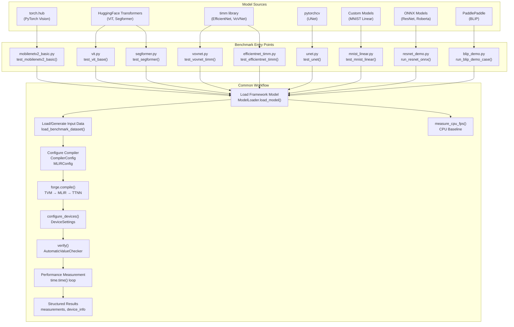
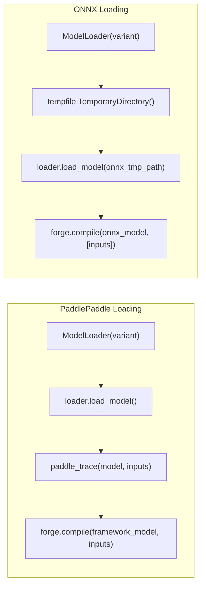
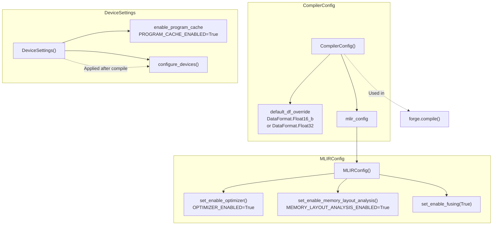
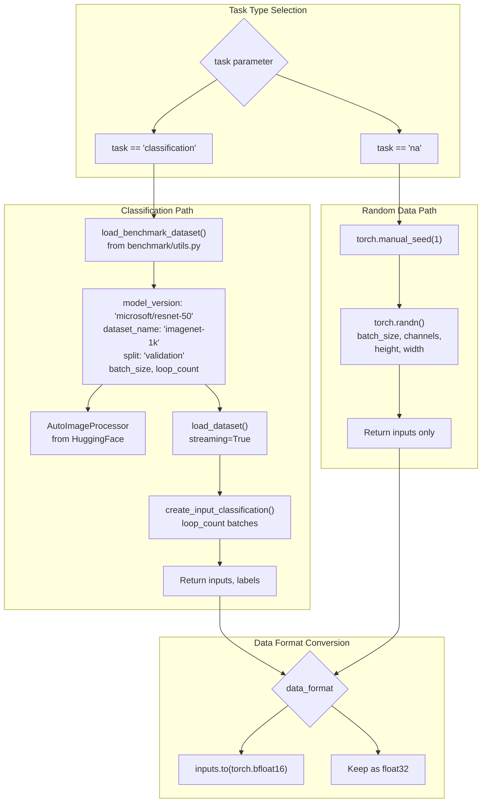
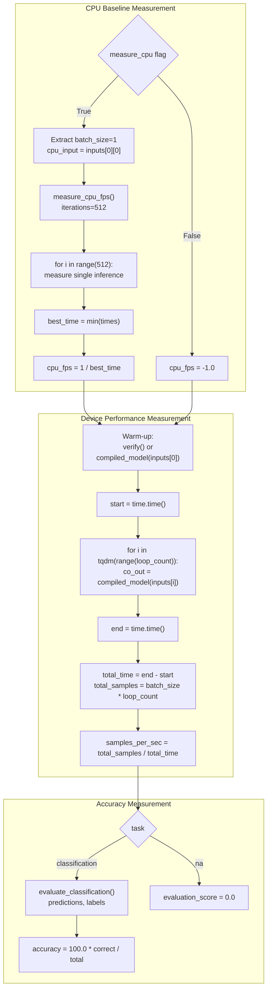

# forge.compile Backend Benchmarks

Relevant source files
*   [demos/tt-forge-onnx/onnx/cnn/resnet_demo.py](https://github.com/tenstorrent/tt-forge/blob/6f2d9645/demos/tt-forge-onnx/onnx/cnn/resnet_demo.py)
*   [demos/tt-forge-onnx/onnx/nlp/roberta_demo.py](https://github.com/tenstorrent/tt-forge/blob/6f2d9645/demos/tt-forge-onnx/onnx/nlp/roberta_demo.py)
*   [demos/tt-forge-onnx/onnx/nlp/squeezebert_demo.py](https://github.com/tenstorrent/tt-forge/blob/6f2d9645/demos/tt-forge-onnx/onnx/nlp/squeezebert_demo.py)
*   [demos/tt-forge-onnx/paddlepaddle/cnn/resnet_demo.py](https://github.com/tenstorrent/tt-forge/blob/6f2d9645/demos/tt-forge-onnx/paddlepaddle/cnn/resnet_demo.py)
*   [demos/tt-forge-onnx/paddlepaddle/multimodal/blip_demo.py](https://github.com/tenstorrent/tt-forge/blob/6f2d9645/demos/tt-forge-onnx/paddlepaddle/multimodal/blip_demo.py)

## Purpose and Scope

This document describes the benchmark suite for the **forge.compile** backend, which tests the TT-Forge-FE (TVM-based frontend) compilation path. These benchmarks validate model compilation, execution correctness, and performance on Tenstorrent hardware using the `forge.compile()` API. For benchmarks using the torch-xla backend, see [torch-xla Backend Benchmarks](https://deepwiki.com/tenstorrent/tt-forge/3.3-torch-xla-backend-benchmarks). For the general benchmarking infrastructure and test matrix configuration, see [Benchmark Infrastructure and Workflows](https://deepwiki.com/tenstorrent/tt-forge/3.1-benchmark-infrastructure-and-workflows) and [Test Matrix Configuration](https://deepwiki.com/tenstorrent/tt-forge/3.2-test-matrix-configuration).

The forge.compile benchmarks are located in [benchmark/tt-forge-fe/](https://github.com/tenstorrent/tt-forge/blob/6f2d9645/benchmark/tt-forge-fe/) and cover computer vision models including CNNs, transformers, and segmentation networks. Additionally, the codebase includes demo scripts that showcase `forge.compile` usage for ONNX and PaddlePaddle models.

**Sources:**[benchmark/tt-forge-fe/mobilenetv2_basic.py](https://github.com/tenstorrent/tt-forge/blob/6f2d9645/benchmark/tt-forge-fe/mobilenetv2_basic.py)[benchmark/tt-forge-fe/vovnet.py](https://github.com/tenstorrent/tt-forge/blob/6f2d9645/benchmark/tt-forge-fe/vovnet.py)[benchmark/tt-forge-fe/mnist_linear.py](https://github.com/tenstorrent/tt-forge/blob/6f2d9645/benchmark/tt-forge-fe/mnist_linear.py)[benchmark/tt-forge-fe/vit.py](https://github.com/tenstorrent/tt-forge/blob/6f2d9645/benchmark/tt-forge-fe/vit.py)[benchmark/tt-forge-fe/efficientnet_timm.py](https://github.com/tenstorrent/tt-forge/blob/6f2d9645/benchmark/tt-forge-fe/efficientnet_timm.py)[benchmark/tt-forge-fe/unet.py](https://github.com/tenstorrent/tt-forge/blob/6f2d9645/benchmark/tt-forge-fe/unet.py)[benchmark/tt-forge-fe/segformer.py](https://github.com/tenstorrent/tt-forge/blob/6f2d9645/benchmark/tt-forge-fe/segformer.py)[demos/tt-forge-onnx/onnx/cnn/resnet_demo.py](https://github.com/tenstorrent/tt-forge/blob/6f2d9645/demos/tt-forge-onnx/onnx/cnn/resnet_demo.py)

* * *

## Benchmark Architecture

The forge.compile benchmarks follow a consistent architecture where PyTorch models are compiled using the TT-Forge-FE frontend and executed on Tenstorrent hardware. The system validates both functional correctness and performance metrics.

### System Flow

**Sources:**[benchmark/tt-forge-fe/mobilenetv2_basic.py 69-290](https://github.com/tenstorrent/tt-forge/blob/6f2d9645/benchmark/tt-forge-fe/mobilenetv2_basic.py#L69-L290)[benchmark/tt-forge-fe/vovnet.py 77-314](https://github.com/tenstorrent/tt-forge/blob/6f2d9645/benchmark/tt-forge-fe/vovnet.py#L77-L314)[benchmark/tt-forge-fe/mnist_linear.py 96-243](https://github.com/tenstorrent/tt-forge/blob/6f2d9645/benchmark/tt-forge-fe/mnist_linear.py#L96-L243)[benchmark/tt-forge-fe/vit.py 76-286](https://github.com/tenstorrent/tt-forge/blob/6f2d9645/benchmark/tt-forge-fe/vit.py#L76-L286)[benchmark/tt-forge-fe/efficientnet_timm.py 72-298](https://github.com/tenstorrent/tt-forge/blob/6f2d9645/benchmark/tt-forge-fe/efficientnet_timm.py#L72-L298)[benchmark/tt-forge-fe/unet.py 54-229](https://github.com/tenstorrent/tt-forge/blob/6f2d9645/benchmark/tt-forge-fe/unet.py#L54-L229)[benchmark/tt-forge-fe/segformer.py 64-252](https://github.com/tenstorrent/tt-forge/blob/6f2d9645/benchmark/tt-forge-fe/segformer.py#L64-L252)[demos/tt-forge-onnx/onnx/cnn/resnet_demo.py 9-28](https://github.com/tenstorrent/tt-forge/blob/6f2d9645/demos/tt-forge-onnx/onnx/cnn/resnet_demo.py#L9-L28)[demos/tt-forge-onnx/paddlepaddle/multimodal/blip_demo.py 12-49](https://github.com/tenstorrent/tt-forge/blob/6f2d9645/demos/tt-forge-onnx/paddlepaddle/multimodal/blip_demo.py#L12-L49)

* * *

## Model Coverage

The forge.compile benchmarks and demos cover various model types across computer vision, NLP, and multimodal tasks:

| Model | File | Model Source | Primary Task | Default Batch Size |
| --- | --- | --- | --- | --- |
| MobileNetV2 Basic | mobilenetv2_basic.py | torch.hub | Classification | 1 |
| VoVNet (TIMM) | vovnet.py | timm | Classification | 1 |
| MNIST Linear | mnist_linear.py | Custom (nn.Module) | Classification | 1-64 |
| ViT Base | vit.py | HuggingFace | Classification | 1 |
| EfficientNet B0 | efficientnet_timm.py | timm | Classification | 1 |
| UNet | unet.py | pytorchcv | Segmentation | 1 |
| Segformer | segformer.py | HuggingFace | Classification | 1 |
| ResNet (ONNX) | resnet_demo.py | ONNX/TIMM | Classification | 1 |
| Roberta (ONNX) | roberta_demo.py | ONNX/HF | NLP Classification | 1 |
| SqueezeBERT (ONNX) | squeezebert_demo.py | ONNX/HF | NLP Classification | 1 |
| BLIP (Paddle) | blip_demo.py | PaddlePaddle | Multimodal | 1 |

**Sources:**[benchmark/tt-forge-fe/mobilenetv2_basic.py 35-61](https://github.com/tenstorrent/tt-forge/blob/6f2d9645/benchmark/tt-forge-fe/mobilenetv2_basic.py#L35-L61)[benchmark/tt-forge-fe/vovnet.py 38-68](https://github.com/tenstorrent/tt-forge/blob/6f2d9645/benchmark/tt-forge-fe/vovnet.py#L38-L68)[benchmark/tt-forge-fe/mnist_linear.py 31-62](https://github.com/tenstorrent/tt-forge/blob/6f2d9645/benchmark/tt-forge-fe/mnist_linear.py#L31-L62)[demos/tt-forge-onnx/onnx/cnn/resnet_demo.py 32-35](https://github.com/tenstorrent/tt-forge/blob/6f2d9645/demos/tt-forge-onnx/onnx/cnn/resnet_demo.py#L32-L35)[demos/tt-forge-onnx/onnx/nlp/roberta_demo.py 32-35](https://github.com/tenstorrent/tt-forge/blob/6f2d9645/demos/tt-forge-onnx/onnx/nlp/roberta_demo.py#L32-L35)[demos/tt-forge-onnx/paddlepaddle/multimodal/blip_demo.py 51-57](https://github.com/tenstorrent/tt-forge/blob/6f2d9645/demos/tt-forge-onnx/paddlepaddle/multimodal/blip_demo.py#L51-L57)

### Model Loading and Tracing

For models originating from non-PyTorch frameworks like PaddlePaddle, an intermediate tracing step is often required before calling `forge.compile`.

**Sources:**[demos/tt-forge-onnx/paddlepaddle/multimodal/blip_demo.py 18-24](https://github.com/tenstorrent/tt-forge/blob/6f2d9645/demos/tt-forge-onnx/paddlepaddle/multimodal/blip_demo.py#L18-L24)[demos/tt-forge-onnx/onnx/cnn/resnet_demo.py 14-22](https://github.com/tenstorrent/tt-forge/blob/6f2d9645/demos/tt-forge-onnx/onnx/cnn/resnet_demo.py#L14-L22)[forge/tvm_calls/forge_utils.py 8](https://github.com/tenstorrent/tt-forge/blob/6f2d9645/forge/tvm_calls/forge_utils.py#L8-L8)

* * *

## Compilation Configuration

All forge.compile benchmarks use a consistent compiler configuration pattern with MLIR optimizations enabled.

### Compiler Configuration Structure

**Sources:**[benchmark/tt-forge-fe/mobilenetv2_basic.py 116-129](https://github.com/tenstorrent/tt-forge/blob/6f2d9645/benchmark/tt-forge-fe/mobilenetv2_basic.py#L116-L129)[benchmark/tt-forge-fe/vovnet.py 134-146](https://github.com/tenstorrent/tt-forge/blob/6f2d9645/benchmark/tt-forge-fe/vovnet.py#L134-L146)[benchmark/tt-forge-fe/mnist_linear.py 124-128](https://github.com/tenstorrent/tt-forge/blob/6f2d9645/benchmark/tt-forge-fe/mnist_linear.py#L124-L128)[benchmark/tt-forge-fe/vit.py 123-132](https://github.com/tenstorrent/tt-forge/blob/6f2d9645/benchmark/tt-forge-fe/vit.py#L123-L132)[benchmark/tt-forge-fe/efficientnet_timm.py 119-132](https://github.com/tenstorrent/tt-forge/blob/6f2d9645/benchmark/tt-forge-fe/efficientnet_timm.py#L119-L132)[benchmark/tt-forge-fe/unet.py 85-99](https://github.com/tenstorrent/tt-forge/blob/6f2d9645/benchmark/tt-forge-fe/unet.py#L85-L99)[benchmark/tt-forge-fe/segformer.py 120-133](https://github.com/tenstorrent/tt-forge/blob/6f2d9645/benchmark/tt-forge-fe/segformer.py#L120-L133)

* * *

## Benchmark Execution Flow

Each benchmark follows a standardized execution flow with pytest parameterization, data loading, compilation, verification, and performance measurement.

### Execution Phases

**Sources:**[benchmark/tt-forge-fe/mobilenetv2_basic.py 69-290](https://github.com/tenstorrent/tt-forge/blob/6f2d9645/benchmark/tt-forge-fe/mobilenetv2_basic.py#L69-L290)[benchmark/tt-forge-fe/vovnet.py 77-314](https://github.com/tenstorrent/tt-forge/blob/6f2d9645/benchmark/tt-forge-fe/vovnet.py#L77-L314)[benchmark/tt-forge-fe/efficientnet_timm.py 72-298](https://github.com/tenstorrent/tt-forge/blob/6f2d9645/benchmark/tt-forge-fe/efficientnet_timm.py#L72-L298)

* * *

```mermaid
graph TB
    subgraph "Phase 1: Setup"
        Params["pytest.mark.parametrize<br/>batch_size, input_size,<br/>loop_count, data_format"]
        LoadInputs["Load/Generate Inputs<br/>load_benchmark_dataset()<br/>or torch.randn()"]
        DataFormat["Convert Data Format<br/>.to(torch.bfloat16)"]
        LoadModel["Load Framework Model<br/>download_model()"]
        ModelFormat["Convert Model Format<br/>.to(torch.bfloat16)"]
    end
    
    subgraph "Phase 2: Compilation"
        CompilerCfg["Create CompilerConfig<br/>MLIRConfig"]
        Compile["forge.compile()<br/>framework_model,<br/>sample_inputs,<br/>compiler_cfg"]
        SaveModel["compiled_model.save()<br/>{model_name}.ttnn"]
    end
    
    subgraph "Phase 3: Device Configuration"
        DevSettings["Create DeviceSettings<br/>enable_program_cache=True"]
        ConfigDev["configure_devices()<br/>device_settings"]
    end
    
    subgraph "Phase 4: Verification"
        VerifyCall["verify()<br/>inputs, framework_model,<br/>compiled_model"]
        PCCCheck["AutomaticValueChecker<br/>pcc=0.97 or 0.99"]
    end
    
    subgraph "Phase 5: Performance Measurement"
        CPUMeasure["measure_cpu_fps()<br/>CPU baseline"]
        StartTimer["start = time.time()"]
        Loop["for i in range(loop_count):<br/>co_out = compiled_model(inputs[i])"]
        EndTimer["end = time.time()"]
        CalcMetrics["total_time = end - start<br/>samples_per_sec"]
    end
    
    subgraph "Phase 6: Evaluation"
        EvalTask{"task type?"}
        Classification["evaluate_classification()<br/>predictions, labels<br/>accuracy"]
        NoEval["evaluation_score = 0.0"]
        FinalVerify["Final PCC Check<br/>fw_out vs co_out"]
    end
    
    subgraph "Phase 7: Results"
        BuildResult["Build result dict<br/>model, measurements,<br/>device_info"]
        ReturnResult["return result"]
    end
    
    Params --> LoadInputs
    LoadInputs --> DataFormat
    DataFormat --> LoadModel
    LoadModel --> ModelFormat
    
    ModelFormat --> CompilerCfg
    CompilerCfg --> Compile
    Compile --> SaveModel
    
    SaveModel --> DevSettings
    DevSettings --> ConfigDev
    
    ConfigDev --> VerifyCall
    VerifyCall --> PCCCheck
    
    PCCCheck --> CPUMeasure
    CPUMeasure --> StartTimer
    StartTimer --> Loop
    Loop --> EndTimer
    EndTimer --> CalcMetrics
    
    CalcMetrics --> EvalTask
    EvalTask -->|classification| Classification
    EvalTask -->|na| NoEval
    Classification --> FinalVerify
    NoEval --> FinalVerify
    
    FinalVerify --> BuildResult
    BuildResult --> ReturnResult
```

## Dataset Loading and Input Generation

Benchmarks support two modes of operation: classification with real datasets or arbitrary inference with random data.

### Input Data Flow

**Sources:**[benchmark/utils.py 210-246](https://github.com/tenstorrent/tt-forge/blob/6f2d9645/benchmark/utils.py#L210-L246)[benchmark/utils.py 177-207](https://github.com/tenstorrent/tt-forge/blob/6f2d9645/benchmark/utils.py#L177-L207)[benchmark/utils.py 144-174](https://github.com/tenstorrent/tt-forge/blob/6f2d9645/benchmark/utils.py#L144-L174)[benchmark/utils.py 105-141](https://github.com/tenstorrent/tt-forge/blob/6f2d9645/benchmark/utils.py#L105-L141)[benchmark/tt-forge-fe/mobilenetv2_basic.py 82-96](https://github.com/tenstorrent/tt-forge/blob/6f2d9645/benchmark/tt-forge-fe/mobilenetv2_basic.py#L82-L96)[benchmark/tt-forge-fe/vovnet.py 99-112](https://github.com/tenstorrent/tt-forge/blob/6f2d9645/benchmark/tt-forge-fe/vovnet.py#L99-L112)

* * *

## Performance Measurement

Benchmarks measure both device performance (samples per second) and optionally CPU baseline performance for comparison.

### Performance Metrics Collection

**Sources:**[benchmark/utils.py 284-305](https://github.com/tenstorrent/tt-forge/blob/6f2d9645/benchmark/utils.py#L284-L305)[benchmark/utils.py 249-271](https://github.com/tenstorrent/tt-forge/blob/6f2d9645/benchmark/utils.py#L249-L271)[benchmark/tt-forge-fe/mobilenetv2_basic.py 108-113](https://github.com/tenstorrent/tt-forge/blob/6f2d9645/benchmark/tt-forge-fe/mobilenetv2_basic.py#L108-L113)[benchmark/tt-forge-fe/mobilenetv2_basic.py 156-173](https://github.com/tenstorrent/tt-forge/blob/6f2d9645/benchmark/tt-forge-fe/mobilenetv2_basic.py#L156-L173)[benchmark/tt-forge-fe/vovnet.py 126-131](https://github.com/tenstorrent/tt-forge/blob/6f2d9645/benchmark/tt-forge-fe/vovnet.py#L126-L131)[benchmark/tt-forge-fe/vovnet.py 160-200](https://github.com/tenstorrent/tt-forge/blob/6f2d9645/benchmark/tt-forge-fe/vovnet.py#L160-L200)

* * *

## Result Structure

All benchmarks return a standardized result dictionary containing model metadata, configuration, measurements, and device information.

### Result Dictionary Schema

**Sources:**[benchmark/tt-forge-fe/mobilenetv2_basic.py 217-288](https://github.com/tenstorrent/tt-forge/blob/6f2d9645/benchmark/tt-forge-fe/mobilenetv2_basic.py#L217-L288)[benchmark/tt-forge-fe/vovnet.py 241-312](https://github.com/tenstorrent/tt-forge/blob/6f2d9645/benchmark/tt-forge-fe/vovnet.py#L241-L312)[benchmark/tt-forge-fe/mnist_linear.py 180-241](https://github.com/tenstorrent/tt-forge/blob/6f2d9645/benchmark/tt-forge-fe/mnist_linear.py#L180-L241)[benchmark/tt-forge-fe/vit.py 213-284](https://github.com/tenstorrent/tt-forge/blob/6f2d9645/benchmark/tt-forge-fe/vit.py#L213-L284)[benchmark/tt-forge-fe/efficientnet_timm.py 225-296](https://github.com/tenstorrent/tt-forge/blob/6f2d9645/benchmark/tt-forge-fe/efficientnet_timm.py#L225-L296)[benchmark/tt-forge-fe/unet.py 167-227](https://github.com/tenstorrent/tt-forge/blob/6f2d9645/benchmark/tt-forge-fe/unet.py#L167-L227)[benchmark/tt-forge-fe/segformer.py 189-250](https://github.com/tenstorrent/tt-forge/blob/6f2d9645/benchmark/tt-forge-fe/segformer.py#L189-L250)

* * *

```mermaid
graph TB
    subgraph "Top-Level Fields"
        Model["model: str<br/>e.g. 'MobileNet V2 Basic'"]
        ModelType["model_type: str<br/>e.g. 'Classification, ImageNet-1K'"]
        RunType["run_type: str<br/>Unique identifier"]
        Config["config: dict"]
        NumLayers["num_layers: int"]
        BatchSize["batch_size: int"]
        Precision["precision: str<br/>e.g. 'bfloat16'"]
        DatasetName["dataset_name: str"]
        ProfileName["profile_name: str"]
        SeqLengths["input_sequence_length: int<br/>output_sequence_length: int"]
        ImageDim["image_dimension: str<br/>e.g. '3x224x224'"]
        PerfAnalysis["perf_analysis: bool"]
        Training["training: bool"]
        Measurements["measurements: List[dict]"]
        DeviceInfo["device_info: dict"]
        DeviceIP["device_ip: Optional[str]"]
    end
    
    subgraph "config dict"
        ModelSize["model_size: str<br/>e.g. 'small'"]
        OptEnabled["optimizer_enabled: bool"]
        ProgCache["program_cache_enabled: bool"]
        MemLayout["memory_layout_analysis_enabled: bool"]
        Trace["trace_enabled: bool"]
    end
    
    subgraph "measurements list"
        Meas1["Measurement 1:<br/>total_samples"]
        Meas2["Measurement 2:<br/>total_time"]
        Meas3["Measurement 3:<br/>evaluation_score"]
        Meas4["Measurement 4:<br/>cpu_fps"]
    end
    
    Config --> ModelSize
    Config --> OptEnabled
    Config --> ProgCache
    Config --> MemLayout
    Config --> Trace
    
    Measurements --> Meas1
    Measurements --> Meas2
    Measurements --> Meas3
    Measurements --> Meas4
    
    DeviceInfo --> DevName["device_name"]
    DeviceInfo --> Galaxy["galaxy"]
    DeviceInfo --> Arch["arch"]
    DeviceInfo --> Chips["chips"]
```

## Common Utilities

All forge.compile benchmarks share utility functions from [benchmark/utils.py](https://github.com/tenstorrent/tt-forge/blob/6f2d9645/benchmark/utils.py) for common operations.

### Utility Functions Overview

| Function | Purpose | Key Parameters | Return Value |
| --- | --- | --- | --- |
| `load_benchmark_dataset()` | Load datasets for benchmarks | task, model_version, dataset_name, split, batch_size, loop_count | inputs: List[Tensor], labels: List[Tensor] |
| `evaluate_classification()` | Calculate classification accuracy | predictions: Tensor, labels: Tensor | accuracy: float (0-100) |
| `measure_cpu_fps()` | Measure CPU baseline FPS | model, input, iterations=512 | fps: float |
| `download_model()` | Download models with retry logic | download_func, *args, num_retries=3, timeout=180 | model object |
| `get_ffe_device_arch()` | Get device architecture for forge.compile | None | arch: str ('wormhole' or 'blackhole') |
| `reset_seeds()` | Reset random seeds for reproducibility | None | None |

**Sources:**[benchmark/utils.py 210-246](https://github.com/tenstorrent/tt-forge/blob/6f2d9645/benchmark/utils.py#L210-L246)[benchmark/utils.py 249-271](https://github.com/tenstorrent/tt-forge/blob/6f2d9645/benchmark/utils.py#L249-L271)[benchmark/utils.py 284-305](https://github.com/tenstorrent/tt-forge/blob/6f2d9645/benchmark/utils.py#L284-L305)[benchmark/utils.py 84-102](https://github.com/tenstorrent/tt-forge/blob/6f2d9645/benchmark/utils.py#L84-L102)[benchmark/utils.py 44-59](https://github.com/tenstorrent/tt-forge/blob/6f2d9645/benchmark/utils.py#L44-L59)[benchmark/utils.py 274-281](https://github.com/tenstorrent/tt-forge/blob/6f2d9645/benchmark/utils.py#L274-L281)

* * *

## Summary

The forge.compile backend benchmarks provide comprehensive coverage of computer vision, NLP, and multimodal models using the TVM-based TT-Forge-FE frontend. Key characteristics:

*   **Consistent Architecture**: All benchmarks follow the same structure with pytest parameterization, compilation, verification, and measurement phases.
*   **Framework Support**: Supports PyTorch, ONNX, and PaddlePaddle models via tracing or direct compilation.
*   **Compiler Configuration**: Standardized use of `CompilerConfig`, `MLIRConfig`, and `DeviceSettings` with optimizations enabled.
*   **Correctness Validation**: All benchmarks verify functional correctness using `verify()` and `AutomaticValueChecker` with PCC thresholds.
*   **Performance Metrics**: Device FPS measurement with optional CPU baseline comparison.
*   **Structured Results**: Standardized result dictionary format with model metadata, measurements, and device information.

**Sources:**[benchmark/tt-forge-fe/mobilenetv2_basic.py](https://github.com/tenstorrent/tt-forge/blob/6f2d9645/benchmark/tt-forge-fe/mobilenetv2_basic.py)[benchmark/tt-forge-fe/vovnet.py](https://github.com/tenstorrent/tt-forge/blob/6f2d9645/benchmark/tt-forge-fe/vovnet.py)[demos/tt-forge-onnx/onnx/cnn/resnet_demo.py](https://github.com/tenstorrent/tt-forge/blob/6f2d9645/demos/tt-forge-onnx/onnx/cnn/resnet_demo.py)[demos/tt-forge-onnx/paddlepaddle/multimodal/blip_demo.py](https://github.com/tenstorrent/tt-forge/blob/6f2d9645/demos/tt-forge-onnx/paddlepaddle/multimodal/blip_demo.py)[benchmark/utils.py](https://github.com/tenstorrent/tt-forge/blob/6f2d9645/benchmark/utils.py)

Dismiss
Refresh this wiki

Enter email to refresh
