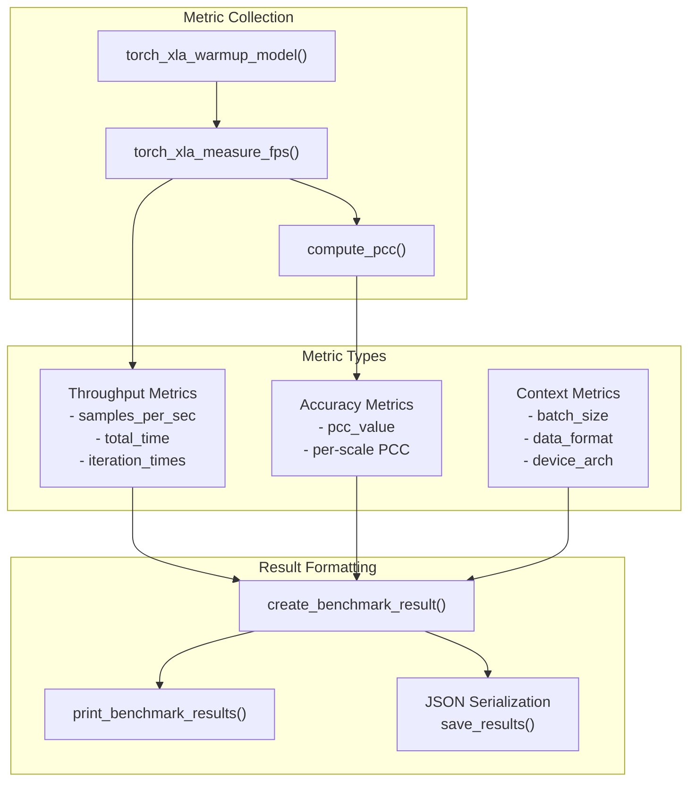
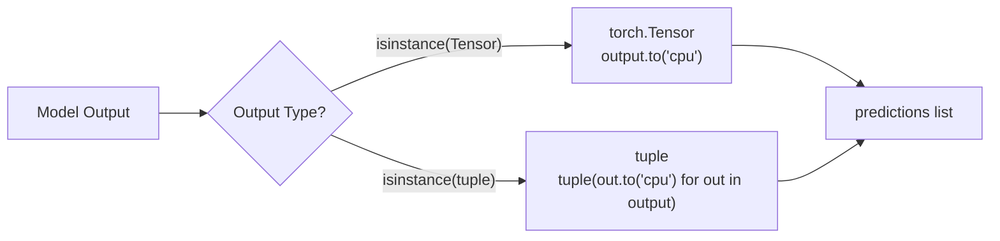
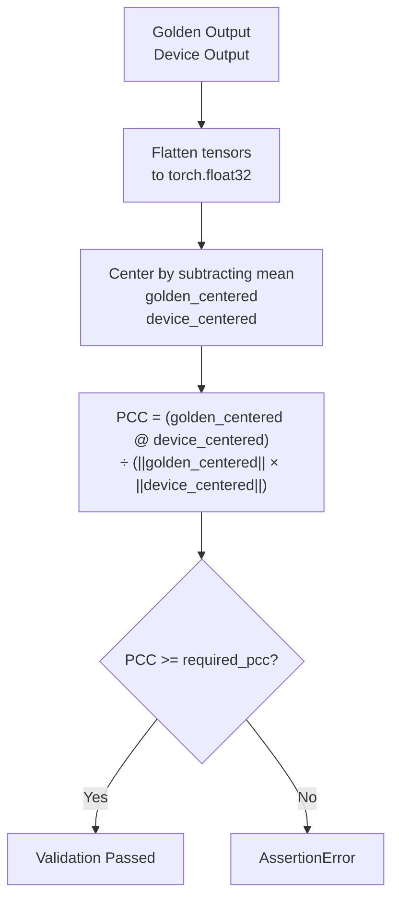
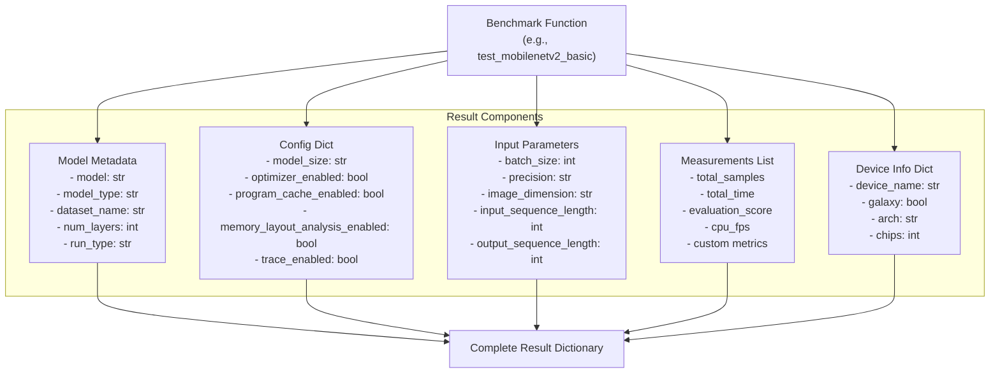
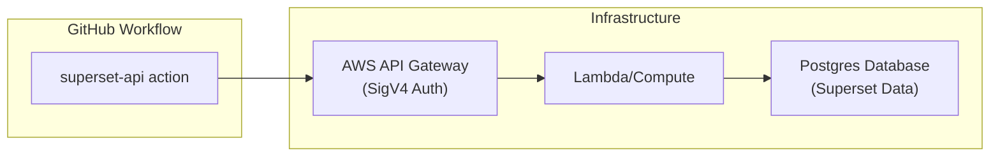
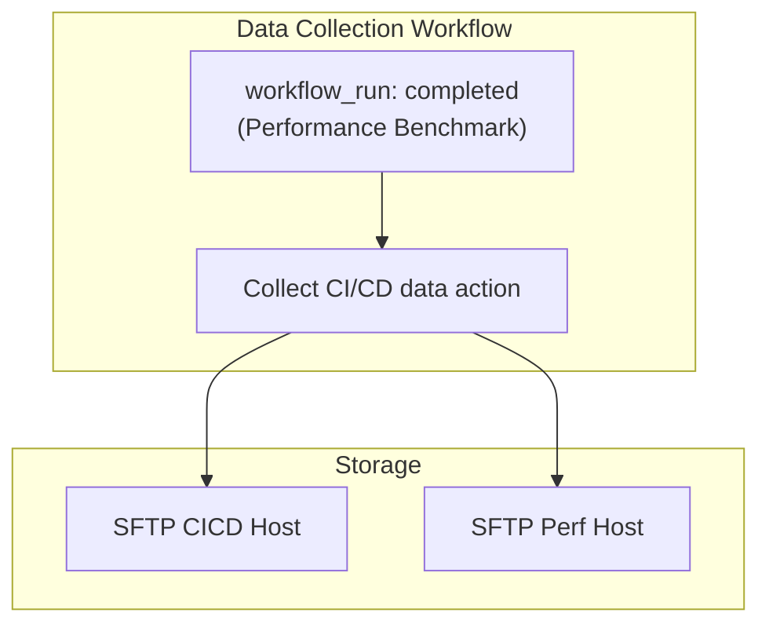

# Performance Metrics and Reporting

Relevant source files
*   [.github/actions/superset-api/README.md](https://github.com/tenstorrent/tt-forge/blob/6f2d9645/.github/actions/superset-api/README.md?plain=1)
*   [.github/actions/superset-api/action.yml](https://github.com/tenstorrent/tt-forge/blob/6f2d9645/.github/actions/superset-api/action.yml)
*   [.github/workflows/produce_data.yml](https://github.com/tenstorrent/tt-forge/blob/6f2d9645/.github/workflows/produce_data.yml)
*   [.github/workflows/test-superset-api.yml](https://github.com/tenstorrent/tt-forge/blob/6f2d9645/.github/workflows/test-superset-api.yml)
*   [scripts/topsheet/README.md](https://github.com/tenstorrent/tt-forge/blob/6f2d9645/scripts/topsheet/README.md?plain=1)
*   [scripts/topsheet/topsheet-automation.gs](https://github.com/tenstorrent/tt-forge/blob/6f2d9645/scripts/topsheet/topsheet-automation.gs)

## Purpose and Scope

This document describes the performance metrics collection and reporting infrastructure used in the TT-Forge benchmarking system. It covers how throughput (FPS), accuracy (PCC), and timing metrics are collected during benchmark execution, how results are formatted and serialized to JSON, and how results are reported through automated workflows, Slack notifications, and the Superset API.

For information about the benchmark execution infrastructure and test orchestration, see [Benchmark Infrastructure and Workflows](https://deepwiki.com/tenstorrent/tt-forge/3.1-benchmark-infrastructure-and-workflows). For details about specific model benchmarks, see [torch-xla Backend Benchmarks](https://deepwiki.com/tenstorrent/tt-forge/3.3-torch-xla-backend-benchmarks).

* * *

## Performance Metrics Overview

The benchmarking system collects three primary categories of metrics during model execution:

| Metric Category | Key Measurements | Purpose |
| --- | --- | --- |
| **Throughput** | Samples per second (FPS), total execution time, per-iteration timing | Measure inference performance |
| **Accuracy** | Pearson Correlation Coefficient (PCC) | Validate output correctness vs CPU reference |
| **System** | CPU FPS (optional), device architecture, batch size, data format | Provide execution context |

All metrics are collected through instrumented benchmark functions and aggregated into structured JSON results for downstream analysis.

**Sources:**[benchmark/tt-xla/utils.py 322-431](https://github.com/tenstorrent/tt-forge/blob/6f2d9645/benchmark/tt-xla/utils.py#L322-L431)[benchmark/tt-xla/unet.py 86-219](https://github.com/tenstorrent/tt-forge/blob/6f2d9645/benchmark/tt-xla/unet.py#L86-L219)

* * *



## FPS (Throughput) Measurement

### Measurement Methodology

The `torch_xla_measure_fps()` function measures inference throughput by executing the model in a loop and timing each iteration. The function handles both single-tensor and multi-tensor outputs (e.g., YOLO multi-scale predictions).

**Key Implementation Details:**

The function performs the following steps:

1.   **Per-Iteration Timing**[benchmark/tt-xla/utils.py 392-407](https://github.com/tenstorrent/tt-forge/blob/6f2d9645/benchmark/tt-xla/utils.py#L392-L407): Each iteration is timed from input transfer to output generation (non-blocking).
2.   **Output Collection**[benchmark/tt-xla/utils.py 411-424](https://github.com/tenstorrent/tt-forge/blob/6f2d9645/benchmark/tt-xla/utils.py#L411-L424): All outputs are moved to CPU in a separate timed phase, which blocks until device execution completes.
3.   **Time Aggregation**[benchmark/tt-xla/utils.py 426-431](https://github.com/tenstorrent/tt-forge/blob/6f2d9645/benchmark/tt-xla/utils.py#L426-L431): Total time is the sum of iteration times plus output transfer time.

### Multi-Output Support

The measurement function handles both single tensors and tuples of tensors:

**Sources:**[benchmark/tt-xla/utils.py 361-431](https://github.com/tenstorrent/tt-forge/blob/6f2d9645/benchmark/tt-xla/utils.py#L361-L431)



### Warmup Phase

Before measurement begins, the `torch_xla_warmup_model()` function executes the model for the same number of iterations to ensure program cache compilation and memory allocation are complete.

**Sources:**[benchmark/tt-xla/utils.py 322-358](https://github.com/tenstorrent/tt-forge/blob/6f2d9645/benchmark/tt-xla/utils.py#L322-L358)[benchmark/tt-xla/unet.py 147-148](https://github.com/tenstorrent/tt-forge/blob/6f2d9645/benchmark/tt-xla/unet.py#L147-L148)

* * *

## PCC (Accuracy) Validation

### Pearson Correlation Coefficient

The `compute_pcc()` function validates model output correctness by comparing device output against a CPU "golden" reference using Pearson Correlation Coefficient.

**Computation Formula:**



### Multi-Scale PCC Support

For models with multiple output tensors, the function computes PCC both per-scale and overall. The function accepts a `required_pcc` parameter (default 0.99) and raises an `AssertionError` if the computed PCC falls below this threshold [benchmark/tt-xla/utils.py 95-103](https://github.com/tenstorrent/tt-forge/blob/6f2d9645/benchmark/tt-xla/utils.py#L95-L103)

**Sources:**[benchmark/tt-xla/utils.py 25-105](https://github.com/tenstorrent/tt-forge/blob/6f2d9645/benchmark/tt-xla/utils.py#L25-L105)[benchmark/tt-xla/unet.py 156-157](https://github.com/tenstorrent/tt-forge/blob/6f2d9645/benchmark/tt-xla/unet.py#L156-L157)

* * *

## Result Data Structure

### Benchmark Result Schema

Both `torch-xla` and `forge.compile` benchmarks return a standardized dictionary containing all benchmark metadata and measurements.

**Sources:**[benchmark/tt-forge-fe/mobilenetv2_basic.py 217-289](https://github.com/tenstorrent/tt-forge/blob/6f2d9645/benchmark/tt-forge-fe/mobilenetv2_basic.py#L217-L289)[benchmark/tt-forge-fe/vovnet.py 241-313](https://github.com/tenstorrent/tt-forge/blob/6f2d9645/benchmark/tt-forge-fe/vovnet.py#L241-L313)[benchmark/tt-forge-fe/mnist_linear.py 180-242](https://github.com/tenstorrent/tt-forge/blob/6f2d9645/benchmark/tt-forge-fe/mnist_linear.py#L180-L242)

* * *



## Automated Reporting Systems

### Superset API Integration

The `superset-api` action provides a mechanism to query historical benchmark data from the Tenstorrent Postgres database. This is used to compare current run results against historical baselines.

**Implementation Details:**

*   **Authentication**: Uses AWS SigV4 authentication via `boto3` and `botocore.auth.SigV4Auth`[.github/actions/superset-api/action.yml 75-78](https://github.com/tenstorrent/tt-forge/blob/6f2d9645/.github/actions/superset-api/action.yml#L75-L78)
*   **Endpoint**: Targets a centralized API Gateway endpoint [.github/actions/superset-api/action.yml 51](https://github.com/tenstorrent/tt-forge/blob/6f2d9645/.github/actions/superset-api/action.yml#L51-L51)
*   **Queries**: Supports predefined queries like `benchmarks/last_measurement` with JSON parameters for project, model name, and precision [.github/actions/superset-api/README.md 32-38](https://github.com/tenstorrent/tt-forge/blob/6f2d9645/.github/actions/superset-api/README.md?plain=1#L32-L38)

**Sources:**[.github/actions/superset-api/action.yml 1-96](https://github.com/tenstorrent/tt-forge/blob/6f2d9645/.github/actions/superset-api/action.yml#L1-L96)[.github/actions/superset-api/README.md 1-108](https://github.com/tenstorrent/tt-forge/blob/6f2d9645/.github/actions/superset-api/README.md?plain=1#L1-L108)[.github/workflows/test-superset-api.yml 25-46](https://github.com/tenstorrent/tt-forge/blob/6f2d9645/.github/workflows/test-superset-api.yml#L25-L46)



### TopSheet Automation

For project management, benchmark status and model bring-up issues are synchronized to Google Sheets via the TopSheet automation script.

**Features:**

*   **GitHub Project Sync**: Fetches issues from the TT-Forge project (`PVT_kwDOA9MHEM4AjeTl`) using the GitHub GraphQL API [scripts/topsheet/topsheet-automation.gs 71-165](https://github.com/tenstorrent/tt-forge/blob/6f2d9645/scripts/topsheet/topsheet-automation.gs#L71-L165)
*   **Filtering**: Specifically targets issues labeled "Top Problems/Issues" or those with non-empty "Top Sheet" fields [scripts/topsheet/topsheet-automation.gs 200-205](https://github.com/tenstorrent/tt-forge/blob/6f2d9645/scripts/topsheet/topsheet-automation.gs#L200-L205)
*   **Visual Reporting**: Applies status color coding ([G]reen, [Y]ellow, [R]ed, [D]one) to the sheet [scripts/topsheet/README.md 65-71](https://github.com/tenstorrent/tt-forge/blob/6f2d9645/scripts/topsheet/README.md?plain=1#L65-L71)

**Sources:**[scripts/topsheet/topsheet-automation.gs 1-85](https://github.com/tenstorrent/tt-forge/blob/6f2d9645/scripts/topsheet/topsheet-automation.gs#L1-L85)[scripts/topsheet/README.md 1-93](https://github.com/tenstorrent/tt-forge/blob/6f2d9645/scripts/topsheet/README.md?plain=1#L1-L93)

* * *

## Failure Notification and Data Collection

### Slack Integration

The benchmarking workflows include automated failure notifications via Slack when tests fail on the `main` branch.

**Sources:**[.github/workflows/perf-benchmark.yml 186-243](https://github.com/tenstorrent/tt-forge/blob/6f2d9645/.github/workflows/perf-benchmark.yml#L186-L243)[.github/workflows/demo-tests.yml 162-218](https://github.com/tenstorrent/tt-forge/blob/6f2d9645/.github/workflows/demo-tests.yml#L162-L218)

### Metrics Aggregation Pipeline




**Implementation Details:**
- **Trigger**: Automatically runs when the "Performance Benchmark External Trigger" workflow completes [.github/workflows/produce_data.yml:28-32]().
- **Action**: Uses `tenstorrent/tt-github-actions/.github/actions/collect_data` [.github/workflows/produce_data.yml:46]().
- **Destinations**: Distinguishes between standard CI/CD data and specialized performance data via separate SFTP host secrets [.github/workflows/produce_data.yml:51-54]().
```

After benchmark completion, the `produce-cicd-data` job triggers the collection of CI/CD data, including performance metrics, to a remote SFTP storage system for long-term tracking.

**Implementation Details:**

*   **Trigger**: Automatically runs when the "Performance Benchmark External Trigger" workflow completes [.github/workflows/produce_data.yml 28-32](https://github.com/tenstorrent/tt-forge/blob/6f2d9645/.github/workflows/produce_data.yml#L28-L32)
*   **Action**: Uses `tenstorrent/tt-github-actions/.github/actions/collect_data`[.github/workflows/produce_data.yml 46](https://github.com/tenstorrent/tt-forge/blob/6f2d9645/.github/workflows/produce_data.yml#L46-L46)
*   **Destinations**: Distinguishes between standard CI/CD data and specialized performance data via separate SFTP host secrets [.github/workflows/produce_data.yml 51-54](https://github.com/tenstorrent/tt-forge/blob/6f2d9645/.github/workflows/produce_data.yml#L51-L54)

**Sources:**[.github/workflows/produce_data.yml 1-56](https://github.com/tenstorrent/tt-forge/blob/6f2d9645/.github/workflows/produce_data.yml#L1-L56)

Dismiss
Refresh this wiki

Enter email to refresh
