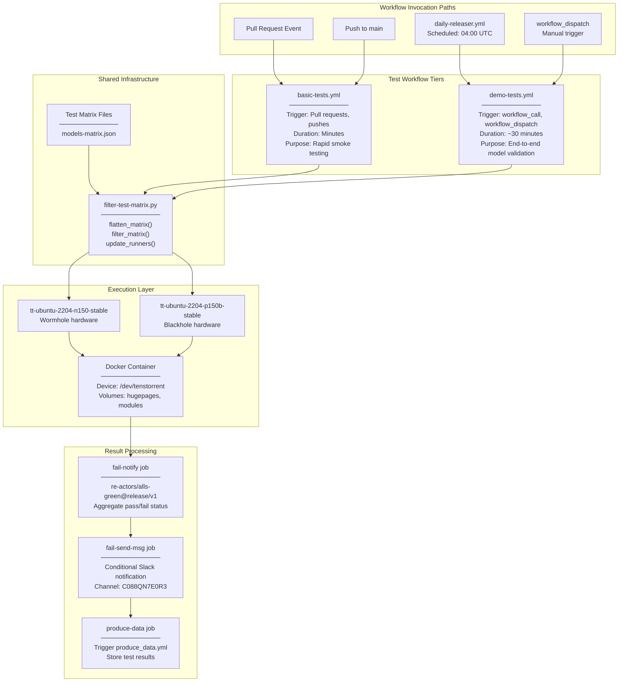
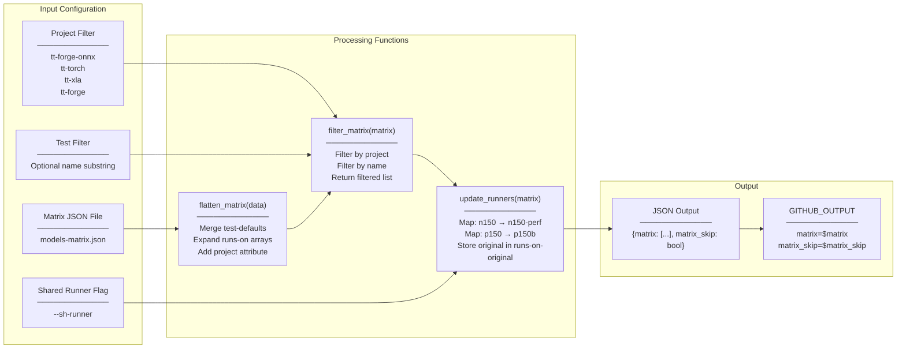
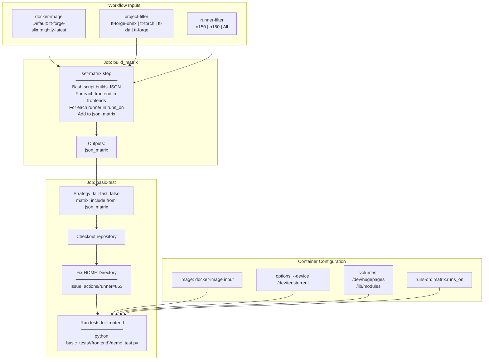
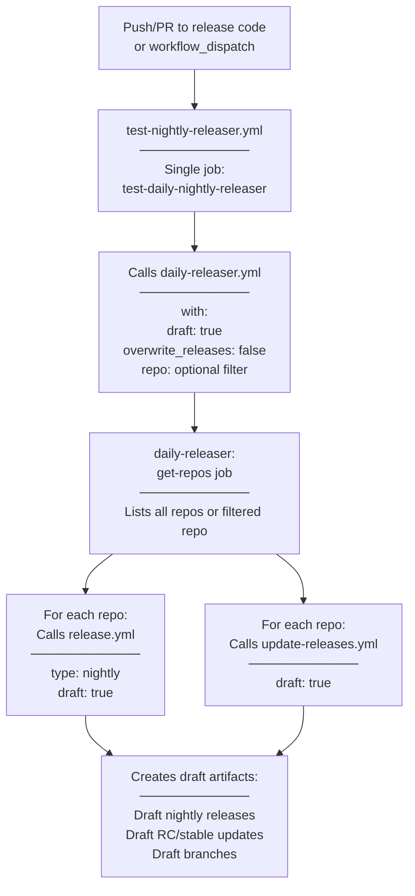

# Testing Infrastructure

Relevant source files
*   [.github/workflows/basic-tests.yml](https://github.com/tenstorrent/tt-forge/blob/6f2d9645/.github/workflows/basic-tests.yml)
*   [.github/workflows/demo-tests.yml](https://github.com/tenstorrent/tt-forge/blob/6f2d9645/.github/workflows/demo-tests.yml)
*   [.github/workflows/models-matrix.json](https://github.com/tenstorrent/tt-forge/blob/6f2d9645/.github/workflows/models-matrix.json)
*   [basic_tests/tt-forge-onnx/demo_test.py](https://github.com/tenstorrent/tt-forge/blob/6f2d9645/basic_tests/tt-forge-onnx/demo_test.py)
*   [basic_tests/tt-torch/demo_test.py](https://github.com/tenstorrent/tt-forge/blob/6f2d9645/basic_tests/tt-torch/demo_test.py)
*   [basic_tests/tt-xla/demo_test.py](https://github.com/tenstorrent/tt-forge/blob/6f2d9645/basic_tests/tt-xla/demo_test.py)
*   [demos/tt-forge-onnx/README.md](https://github.com/tenstorrent/tt-forge/blob/6f2d9645/demos/tt-forge-onnx/README.md?plain=1)

## Purpose and Scope

The testing infrastructure provides automated validation of TT-Forge functionality through two primary test workflows: basic tests for rapid smoke testing and demo tests for comprehensive model validation. This system is separate from the performance benchmarking infrastructure (see [Benchmarking System](https://deepwiki.com/tenstorrent/tt-forge/3-benchmarking-system)) and focuses on functional correctness rather than performance regression detection.

The testing infrastructure covers:

*   Quick validation tests that run on pull requests (`basic-tests.yml`)
*   Comprehensive model demonstrations that validate end-to-end functionality (`demo-tests.yml`)
*   Shared test matrix filtering and runner management (`filter-test-matrix.py`)
*   Result aggregation and notification systems
*   Docker-based test execution on Tenstorrent hardware

For information about performance benchmarking and metrics collection, see [Benchmarking System](https://deepwiki.com/tenstorrent/tt-forge/3-benchmarking-system). For information about how tests are integrated into the release process, see [CI/CD and Release System](https://deepwiki.com/tenstorrent/tt-forge/5-cicd-and-release-system).

## Overview of Test Workflows

The testing system implements a multi-tier validation strategy optimized for feedback speed and coverage breadth. Each tier serves a distinct purpose in the validation pipeline.

**Sources:**[.github/workflows/basic-tests.yml 1-57](https://github.com/tenstorrent/tt-forge/blob/6f2d9645/.github/workflows/basic-tests.yml#L1-L57)[.github/workflows/demo-tests.yml 1-53](https://github.com/tenstorrent/tt-forge/blob/6f2d9645/.github/workflows/demo-tests.yml#L1-L53)[.github/workflows/demo-tests.yml 85-132](https://github.com/tenstorrent/tt-forge/blob/6f2d9645/.github/workflows/demo-tests.yml#L85-L132)[.github/workflows/demo-tests.yml 133-191](https://github.com/tenstorrent/tt-forge/blob/6f2d9645/.github/workflows/demo-tests.yml#L133-L191)

## Test Matrix Filtering System

The `filter-test-matrix.py` script provides a unified interface for test selection across all testing workflows. It transforms hierarchical test configurations into flat matrices suitable for GitHub Actions parallel execution.

### Matrix Filtering Flow

### Special Filtering Rules

The filter logic implements special handling for the `tt-forge` project filter. In `demo-tests.yml`, the filter script is called using inputs from the workflow trigger to select specific models from `models-matrix.json`[.github/workflows/demo-tests.yml 69-84](https://github.com/tenstorrent/tt-forge/blob/6f2d9645/.github/workflows/demo-tests.yml#L69-L84)

**Sources:**[.github/workflows/demo-tests.yml 69-84](https://github.com/tenstorrent/tt-forge/blob/6f2d9645/.github/workflows/demo-tests.yml#L69-L84)[.github/workflows/models-matrix.json 1-45](https://github.com/tenstorrent/tt-forge/blob/6f2d9645/.github/workflows/models-matrix.json#L1-L45)

## Basic Tests Workflow

The `basic-tests.yml` workflow provides rapid validation for pull requests and commits. It executes lightweight smoke tests to verify that core functionality has not regressed.

### Basic Tests Architecture

### Test Execution

Each test executes a frontend-specific Python script located at `basic_tests/${{ matrix.frontend }}/demo_test.py`[.github/workflows/basic-tests.yml 153](https://github.com/tenstorrent/tt-forge/blob/6f2d9645/.github/workflows/basic-tests.yml#L153-L153) These scripts typically perform minimal operations to ensure the backend is reachable:

*   `tt-torch`: Verifies `torch.compile(model, backend="tt")` with a simple tensor addition [basic_tests/tt-torch/demo_test.py 1-19](https://github.com/tenstorrent/tt-forge/blob/6f2d9645/basic_tests/tt-torch/demo_test.py#L1-L19)
*   `tt-xla`: Verifies JAX device placement on "tt" and execution of a JIT-compiled function [basic_tests/tt-xla/demo_test.py 1-22](https://github.com/tenstorrent/tt-forge/blob/6f2d9645/basic_tests/tt-xla/demo_test.py#L1-L22)
*   `tt-forge-onnx`: Verifies model compilation and verification via `forge.compile`[basic_tests/tt-forge-onnx/demo_test.py 1-27](https://github.com/tenstorrent/tt-forge/blob/6f2d9645/basic_tests/tt-forge-onnx/demo_test.py#L1-L27)

For details, see [Basic Tests Workflow](https://deepwiki.com/tenstorrent/tt-forge/4.1-basic-tests-workflow).

**Sources:**[.github/workflows/basic-tests.yml 1-154](https://github.com/tenstorrent/tt-forge/blob/6f2d9645/.github/workflows/basic-tests.yml#L1-L154)[basic_tests/tt-torch/demo_test.py 1-19](https://github.com/tenstorrent/tt-forge/blob/6f2d9645/basic_tests/tt-torch/demo_test.py#L1-L19)[basic_tests/tt-xla/demo_test.py 1-22](https://github.com/tenstorrent/tt-forge/blob/6f2d9645/basic_tests/tt-xla/demo_test.py#L1-L22)[basic_tests/tt-forge-onnx/demo_test.py 1-27](https://github.com/tenstorrent/tt-forge/blob/6f2d9645/basic_tests/tt-forge-onnx/demo_test.py#L1-L27)

## Demo Tests Workflow

The `demo-tests.yml` workflow executes comprehensive model demonstrations to validate end-to-end functionality. It supports both manual dispatch and programmatic invocation from the release pipeline.

### Demo Test Matrix Configuration

Demo tests read configuration from `models-matrix.json`[.github/workflows/demo-tests.yml 74](https://github.com/tenstorrent/tt-forge/blob/6f2d9645/.github/workflows/demo-tests.yml#L74-L74) This file defines models, their paths, and specific hardware requirements:

`{  "project": "tt-torch",  "tests": [    {       "runs-on": "n150",       "name": "resnet50",       "path": "resnet50_demo.py",       "pyreq": "loguru requests transformers datasets==3.6.0 torch==2.7.0 torchvision pytest tabulate"     }  ]}`
**Sources:**[.github/workflows/models-matrix.json 36-44](https://github.com/tenstorrent/tt-forge/blob/6f2d9645/.github/workflows/models-matrix.json#L36-L44)

### Dependency Installation and Execution

The workflow automatically installs dependencies before running the demo:

1.   It checks for a `requirements.txt` in the demo folder [.github/workflows/demo-tests.yml 128-130](https://github.com/tenstorrent/tt-forge/blob/6f2d9645/.github/workflows/demo-tests.yml#L128-L130)
2.   It adds the repository root to `PYTHONPATH` so demos can access models in `third_party`[.github/workflows/demo-tests.yml 126](https://github.com/tenstorrent/tt-forge/blob/6f2d9645/.github/workflows/demo-tests.yml#L126-L126)
3.   It executes the demo file using the Python interpreter [.github/workflows/demo-tests.yml 131](https://github.com/tenstorrent/tt-forge/blob/6f2d9645/.github/workflows/demo-tests.yml#L131-L131)

For details, see [Demo Tests Workflow](https://deepwiki.com/tenstorrent/tt-forge/4.2-demo-tests-workflow).

**Sources:**[.github/workflows/demo-tests.yml 114-131](https://github.com/tenstorrent/tt-forge/blob/6f2d9645/.github/workflows/demo-tests.yml#L114-L131)

## Test Matrix Filtering and Selection

The system uses `filter-test-matrix.py` to manage the complexity of different projects and hardware combinations.

### Runner Mapping

The infrastructure supports mapping logical runner names (like `n150`) to specific stable GitHub runner labels:

*   `n150` maps to `tt-ubuntu-2204-n150-stable`[.github/workflows/demo-tests.yml 94](https://github.com/tenstorrent/tt-forge/blob/6f2d9645/.github/workflows/demo-tests.yml#L94-L94)
*   `p150` maps to `tt-ubuntu-2204-p150-stable`[.github/workflows/demo-tests.yml 94](https://github.com/tenstorrent/tt-forge/blob/6f2d9645/.github/workflows/demo-tests.yml#L94-L94)

For details, see [Test Matrix Filtering and Selection](https://deepwiki.com/tenstorrent/tt-forge/4.3-test-matrix-filtering-and-selection).

**Sources:**[.github/workflows/demo-tests.yml 88-94](https://github.com/tenstorrent/tt-forge/blob/6f2d9645/.github/workflows/demo-tests.yml#L88-L94)[.github/workflows/filter-test-matrix.py 1-87](https://github.com/tenstorrent/tt-forge/blob/6f2d9645/.github/workflows/filter-test-matrix.py#L1-L87)

## Result Aggregation and Notification

All test workflows implement a result processing pipeline that aggregates results and sends notifications.

### Notification Conditions

Slack notifications are sent to channel `C088QN7E0R3` when failures occur on the `main` branch during automated runs [.github/workflows/demo-tests.yml 173-190](https://github.com/tenstorrent/tt-forge/blob/6f2d9645/.github/workflows/demo-tests.yml#L173-L190)

### produce-data Integration

After tests complete, the workflow triggers `produce_data.yml` to store test results for historical tracking [.github/workflows/demo-tests.yml 192-212](https://github.com/tenstorrent/tt-forge/blob/6f2d9645/.github/workflows/demo-tests.yml#L192-L212)

**Sources:**[.github/workflows/demo-tests.yml 173-212](https://github.com/tenstorrent/tt-forge/blob/6f2d9645/.github/workflows/demo-tests.yml#L173-L212)

Dismiss
Refresh this wiki

Enter email to refresh
