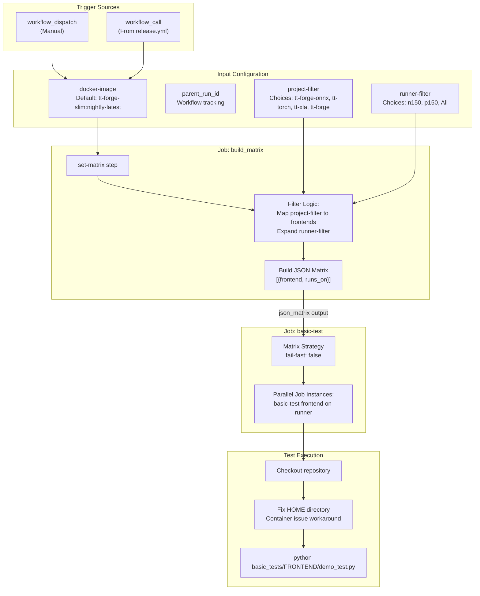
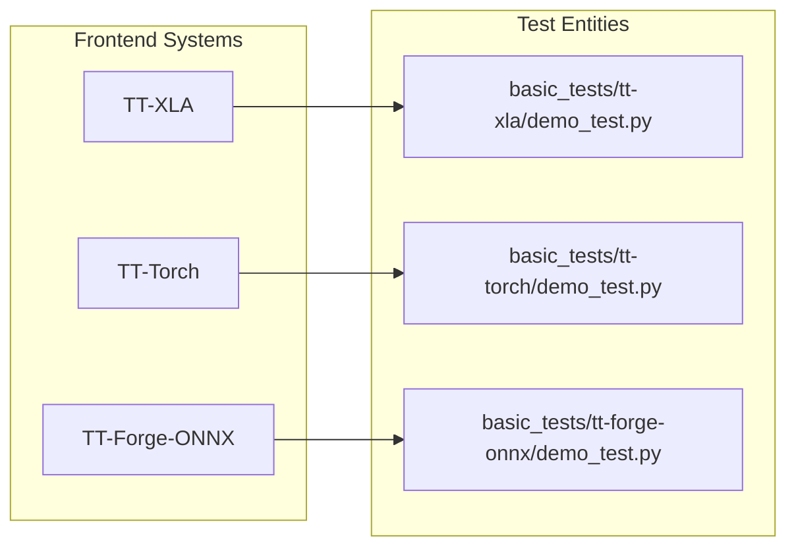
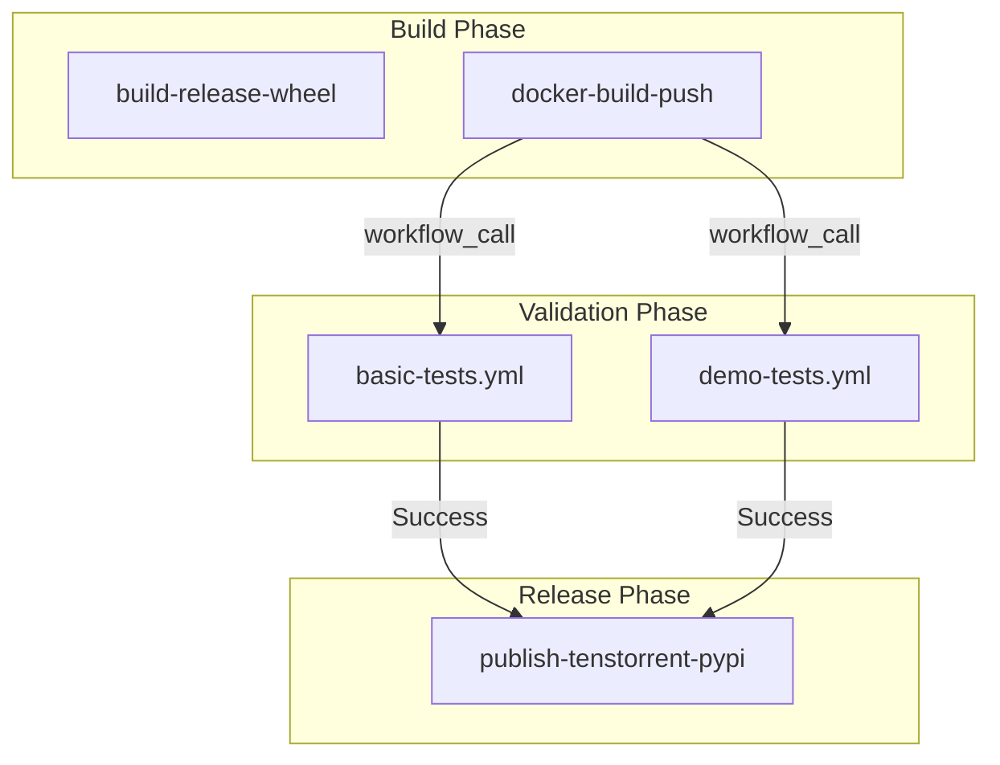

# Basic Tests Workflow

Relevant source files
*   [.github/workflows/basic-tests.yml](https://github.com/tenstorrent/tt-forge/blob/6f2d9645/.github/workflows/basic-tests.yml)
*   [.github/workflows/demo-tests.yml](https://github.com/tenstorrent/tt-forge/blob/6f2d9645/.github/workflows/demo-tests.yml)
*   [.github/workflows/models-matrix.json](https://github.com/tenstorrent/tt-forge/blob/6f2d9645/.github/workflows/models-matrix.json)
*   [basic_tests/tt-forge-onnx/demo_test.py](https://github.com/tenstorrent/tt-forge/blob/6f2d9645/basic_tests/tt-forge-onnx/demo_test.py)
*   [basic_tests/tt-torch/demo_test.py](https://github.com/tenstorrent/tt-forge/blob/6f2d9645/basic_tests/tt-torch/demo_test.py)
*   [basic_tests/tt-xla/demo_test.py](https://github.com/tenstorrent/tt-forge/blob/6f2d9645/basic_tests/tt-xla/demo_test.py)
*   [demos/tt-forge-onnx/README.md](https://github.com/tenstorrent/tt-forge/blob/6f2d9645/demos/tt-forge-onnx/README.md?plain=1)

## Purpose and Scope

The **basic-tests.yml** workflow provides rapid validation of the TT-Forge compiler stack through frontend smoke tests. This is the fastest tier of testing in the system, designed to complete in minutes and provide immediate feedback on pull requests and main branch commits. The workflow validates that each frontend (TT-XLA, TT-Forge-FE, TT-Torch) can successfully execute a basic demonstration on Tenstorrent hardware.

For comprehensive model demonstrations, see [Demo Tests Workflow](https://deepwiki.com/tenstorrent/tt-forge/4.2-demo-tests-workflow). For performance regression testing, see [Benchmark Infrastructure and Workflows](https://deepwiki.com/tenstorrent/tt-forge/3.1-benchmark-infrastructure-and-workflows). For test matrix configuration shared across workflows, see [Test Matrix Filtering and Selection](https://deepwiki.com/tenstorrent/tt-forge/4.3-test-matrix-filtering-and-selection).

**Sources**: [.github/workflows/basic-tests.yml 1-57](https://github.com/tenstorrent/tt-forge/blob/6f2d9645/.github/workflows/basic-tests.yml#L1-L57)

* * *

## Workflow Architecture

The basic tests workflow implements a two-stage execution model: matrix construction followed by parallel test execution.

### Logic and Data Flow

The `build_matrix` job processes inputs to generate a JSON array of test configurations. This matrix is then consumed by the `basic-test` job to spawn parallel runners.

Title: Basic Tests Workflow Architecture

**Sources**: [.github/workflows/basic-tests.yml 5-57](https://github.com/tenstorrent/tt-forge/blob/6f2d9645/.github/workflows/basic-tests.yml#L5-L57)[.github/workflows/basic-tests.yml 59-98](https://github.com/tenstorrent/tt-forge/blob/6f2d9645/.github/workflows/basic-tests.yml#L59-L98)[.github/workflows/basic-tests.yml 100-154](https://github.com/tenstorrent/tt-forge/blob/6f2d9645/.github/workflows/basic-tests.yml#L100-L154)

* * *



## Trigger Mechanisms

The workflow supports multiple invocation patterns to accommodate different use cases:

| Trigger Type | Usage | Key Inputs | Typical Caller |
| --- | --- | --- | --- |
| `workflow_dispatch` | Manual execution from GitHub UI | All inputs configurable | Developers |
| `workflow_call` | Programmatic invocation | `docker-image` (required) | `release.yml`, `daily-releaser.yml` |

The `workflow_dispatch` trigger provides full control over test execution parameters, while `workflow_call` enables integration with the release pipeline. The `parent_run_id` input allows tracking of hierarchical workflow executions when orchestration workflows like `daily-releaser.yml` are used.

**Sources**: [.github/workflows/basic-tests.yml 4-57](https://github.com/tenstorrent/tt-forge/blob/6f2d9645/.github/workflows/basic-tests.yml#L4-L57)

* * *

## Input Configuration Parameters

### Docker Image Specification

The workflow accepts a fully qualified Docker image reference containing the TT-Forge runtime environment. During release workflows, this parameter receives freshly built images with version tags (e.g., `tt-forge-slim:0.9.0.dev20250127`).

**Sources**: [.github/workflows/basic-tests.yml 7-11](https://github.com/tenstorrent/tt-forge/blob/6f2d9645/.github/workflows/basic-tests.yml#L7-L11)

### Project and Runner Filtering

The `project-filter` input determines which frontend(s) to test:

| Project Filter | Frontend(s) Tested | Use Case |
| --- | --- | --- |
| `tt-forge` (default) | `tt-xla` | Meta-package validation |
| `tt-forge-onnx` | `tt-forge-onnx` | ONNX frontend validation |
| `tt-torch` | `tt-torch` | PyTorch backend validation |
| `tt-xla` | `tt-xla` | XLA/PJRT frontend isolation |

The `runner-filter` input controls hardware target selection:

| Runner Filter | Hardware Target |
| --- | --- |
| `All` (default) | n150 and p150 |
| `n150` | Wormhole n150 |
| `p150` | Blackhole p150 |

**Sources**: [.github/workflows/basic-tests.yml 17-35](https://github.com/tenstorrent/tt-forge/blob/6f2d9645/.github/workflows/basic-tests.yml#L17-L35)

* * *

## Matrix Building Strategy

The `build_matrix` job dynamically constructs a test matrix. This approach enables flexible test selection without maintaining static matrix definitions in the workflow YAML.

### Frontend Selection Logic

The mapping from `project-filter` to the internal `frontends` list implements special handling for the `tt-forge` meta-package. If `tt-forge` is selected, the workflow defaults to testing `tt-xla`.

### Matrix Expansion Algorithm

The workflow produces a Cartesian product of frontends and runners using a nested loop and `jq`.

**Example**: With `project-filter=tt-forge` and `runner-filter=All`, the output matrix contains two entries:

**Sources**: [.github/workflows/basic-tests.yml 64-98](https://github.com/tenstorrent/tt-forge/blob/6f2d9645/.github/workflows/basic-tests.yml#L64-L98)

* * *

## Test Execution Environment

### Container Configuration

Each test instance executes within a Docker container configured for direct hardware access. The `runs-on` label is dynamically constructed using `["in-service", "{0}"]` to target specific hardware types.

**Sources**: [.github/workflows/basic-tests.yml 108-117](https://github.com/tenstorrent/tt-forge/blob/6f2d9645/.github/workflows/basic-tests.yml#L108-L117)

### HOME Directory Fix

The workflow includes a workaround for a known GitHub Actions issue where the `HOME` environment variable is incorrectly set in containers. The fix retrieves the correct home directory from `/etc/passwd`.

**Sources**: [.github/workflows/basic-tests.yml 128-143](https://github.com/tenstorrent/tt-forge/blob/6f2d9645/.github/workflows/basic-tests.yml#L128-L143)

### Test Implementation

The workflow executes a specific `demo_test.py` for each frontend. These tests represent the "Natural Language Space" of "Smoke Tests" mapped to "Code Entity Space" Python scripts.

Title: Basic Test Entity Mapping

| Frontend | Test Script | Implementation Detail |
| --- | --- | --- |
| `tt-xla` | `basic_tests/tt-xla/demo_test.py` | Uses `jax.jit` and `jax.devices("tt")` to compute `m * x + b`. |
| `tt-torch` | `basic_tests/tt-torch/demo_test.py` | Uses `torch.compile(model, backend="tt")` with a simple `AddTensors` module. |
| `tt-forge-onnx` | `basic_tests/tt-forge-onnx/demo_test.py` | Uses `forge.compile` and `forge.verify` to validate elementwise addition. |

**Sources**: [basic_tests/tt-xla/demo_test.py 5-23](https://github.com/tenstorrent/tt-forge/blob/6f2d9645/basic_tests/tt-xla/demo_test.py#L5-L23)[basic_tests/tt-torch/demo_test.py 9-19](https://github.com/tenstorrent/tt-forge/blob/6f2d9645/basic_tests/tt-torch/demo_test.py#L9-L19)[basic_tests/tt-forge-onnx/demo_test.py 9-27](https://github.com/tenstorrent/tt-forge/blob/6f2d9645/basic_tests/tt-forge-onnx/demo_test.py#L9-L27)

* * *




| Frontend | Test Script | Implementation Detail |
|----------|-------------|-----------------------|
| `tt-xla` | `basic_tests/tt-xla/demo_test.py` | Uses `jax.jit` and `jax.devices("tt")` to compute `m * x + b`. |
| `tt-torch` | `basic_tests/tt-torch/demo_test.py` | Uses `torch.compile(model, backend="tt")` with a simple `AddTensors` module. |
| `tt-forge-onnx` | `basic_tests/tt-forge-onnx/demo_test.py` | Uses `forge.compile` and `forge.verify` to validate elementwise addition. |
```
## Integration with CI/CD Pipeline




The workflow sets `TRACY_NO_INVARIANT_CHECK: 1` to ensure that Tracy profiler checks do not interfere with the rapid smoke test execution.
```

The `basic-tests.yml` workflow serves as a quality gate in the release pipeline. When invoked via `workflow_call`, it receives the freshly built Docker image as input and validates that the build artifacts are functional.

Title: CI/CD Pipeline Integration

The workflow sets `TRACY_NO_INVARIANT_CHECK: 1` to ensure that Tracy profiler checks do not interfere with the rapid smoke test execution.

**Sources**: [.github/workflows/basic-tests.yml 146-154](https://github.com/tenstorrent/tt-forge/blob/6f2d9645/.github/workflows/basic-tests.yml#L146-L154)

Dismiss
Refresh this wiki

Enter email to refresh
