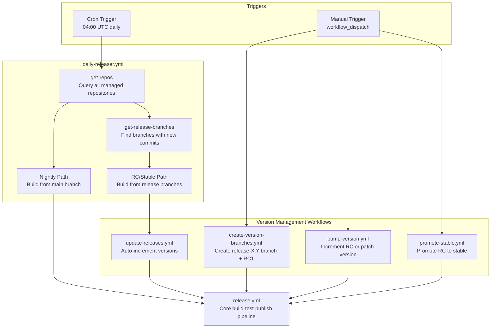
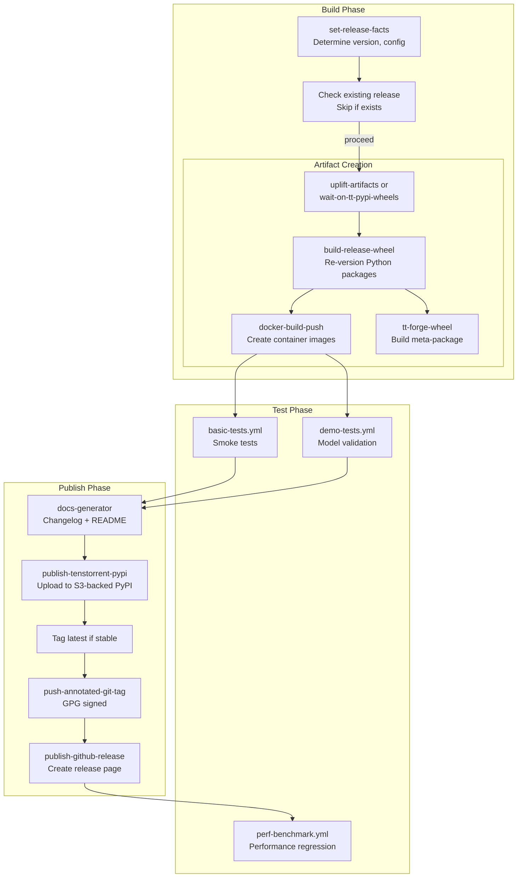
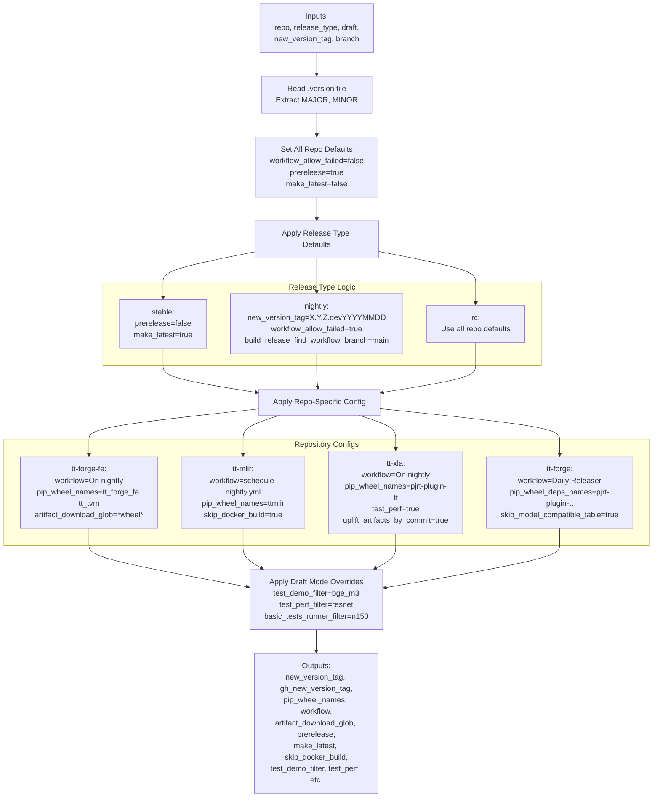
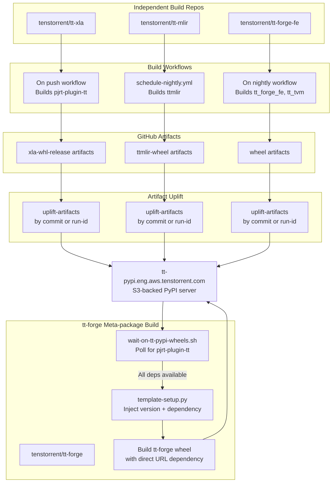
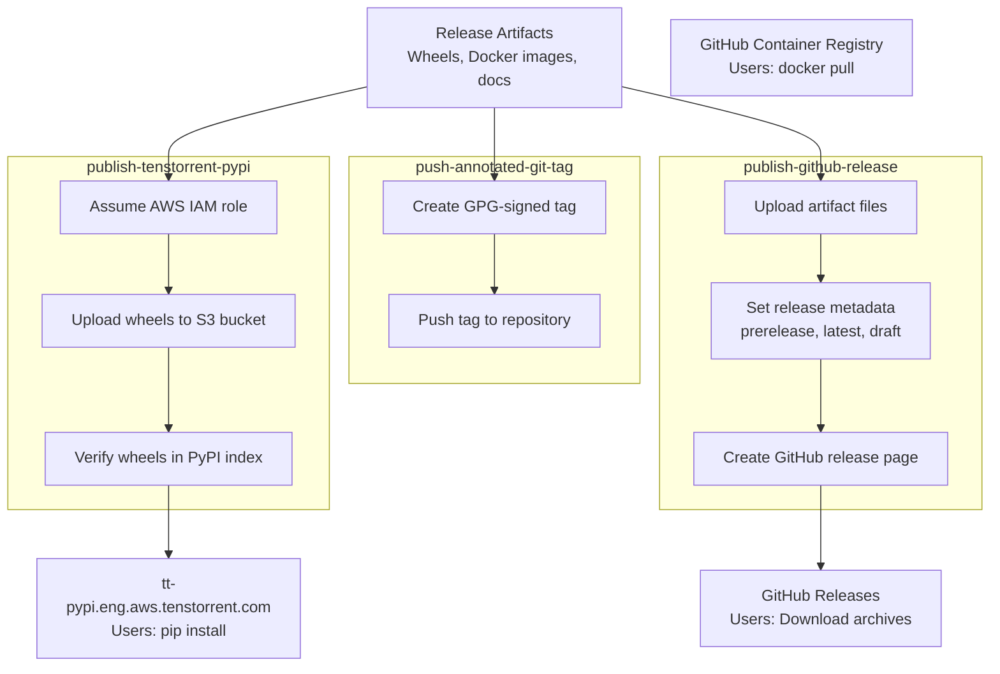

# CI/CD and Release System

Relevant source files
*   [.github/CODEOWNERS](https://github.com/tenstorrent/tt-forge/blob/6f2d9645/.github/CODEOWNERS)
*   [.github/actions/download-artifact/action.yaml](https://github.com/tenstorrent/tt-forge/blob/6f2d9645/.github/actions/download-artifact/action.yaml)
*   [.github/workflows/community-issue-tagging.yml](https://github.com/tenstorrent/tt-forge/blob/6f2d9645/.github/workflows/community-issue-tagging.yml)
*   [.github/workflows/download-artifact-test.yml](https://github.com/tenstorrent/tt-forge/blob/6f2d9645/.github/workflows/download-artifact-test.yml)
*   [.github/workflows/pr-main.yml](https://github.com/tenstorrent/tt-forge/blob/6f2d9645/.github/workflows/pr-main.yml)
*   [.github/workflows/schedule-uplift.yml](https://github.com/tenstorrent/tt-forge/blob/6f2d9645/.github/workflows/schedule-uplift.yml)

## Purpose and Scope

This document describes the TT-Forge CI/CD and release system, which automates the complete software delivery lifecycle from daily builds to stable production releases. The system manages four repositories (tt-forge, tt-xla, tt-forge-fe, tt-mlir) through a unified release pipeline that handles artifact building, testing, and publication.

For information about the testing infrastructure that validates releases, see [Testing Infrastructure](https://deepwiki.com/tenstorrent/tt-forge/4-testing-infrastructure). For details about the benchmarking system used to validate performance, see [Benchmarking System](https://deepwiki.com/tenstorrent/tt-forge/3-benchmarking-system).

## System Architecture

The CI/CD system is built on GitHub Actions and consists of three layers: orchestration workflows that coordinate releases across repositories, core release workflows that execute the build-test-publish pipeline, and reusable actions that provide common functionality.

### Orchestration Layer

**Sources:**[.github/workflows/daily-releaser.yml](https://github.com/tenstorrent/tt-forge/blob/6f2d9645/.github/workflows/daily-releaser.yml)[.github/workflows/release.yml](https://github.com/tenstorrent/tt-forge/blob/6f2d9645/.github/workflows/release.yml)[.github/workflows/create-version-branches.yml](https://github.com/tenstorrent/tt-forge/blob/6f2d9645/.github/workflows/create-version-branches.yml)[.github/workflows/bump-version.yml](https://github.com/tenstorrent/tt-forge/blob/6f2d9645/.github/workflows/bump-version.yml)[.github/workflows/promote-stable.yml](https://github.com/tenstorrent/tt-forge/blob/6f2d9645/.github/workflows/promote-stable.yml)[.github/workflows/update-releases.yml](https://github.com/tenstorrent/tt-forge/blob/6f2d9645/.github/workflows/update-releases.yml)

The `daily-releaser.yml` workflow serves as the central orchestrator, running on a cron schedule at 04:00 UTC. It spawns two parallel paths: the nightly path builds development releases from the main branch of each repository, while the RC/Stable path checks all release branches for new commits and triggers version bumps when detected. Manual workflows provide control points for creating release branches, bumping versions, and promoting releases to stable.

### Core Release Pipeline

**Sources:**[.github/workflows/release.yml](https://github.com/tenstorrent/tt-forge/blob/6f2d9645/.github/workflows/release.yml)[.github/actions/set-release-facts/action.yaml](https://github.com/tenstorrent/tt-forge/blob/6f2d9645/.github/actions/set-release-facts/action.yaml)[.github/actions/build-release-wheel/action.yml](https://github.com/tenstorrent/tt-forge/blob/6f2d9645/.github/actions/build-release-wheel/action.yml)[.github/actions/docker-build-push/action.yml](https://github.com/tenstorrent/tt-forge/blob/6f2d9645/.github/actions/docker-build-push/action.yml)

The `release.yml` workflow implements a strict build → test → publish sequence with quality gates. The build phase determines configuration through `set-release-facts`, checks for existing releases to avoid duplicates, uplifts or waits for dependency artifacts, and creates versioned Python wheels and Docker images. The test phase runs basic smoke tests and comprehensive demo tests to validate functionality. The publish phase generates documentation, uploads to PyPI, tags Docker images, creates GPG-signed Git tags, and publishes GitHub releases. Performance tests run asynchronously after publication.

## Release Types and Versioning

The system supports four release types with distinct version formats and promotion paths:

| Release Type | Version Format | Example | Source Branch | Prerelease | Latest Tag |
| --- | --- | --- | --- | --- | --- |
| Nightly | `X.Y.Z.devYYYYMMDD` | `0.1.0.dev20250115` | `main` | Yes | No |
| Release Candidate | `X.Y.ZrcN` | `0.1.0rc1` | `release-X.Y` | Yes | No |
| Stable | `X.Y.Z` | `0.1.0` | `release-X.Y` | No | Yes |
| Patch | `X.Y.Z+1` | `0.1.1` | `release-X.Y` | No | Yes |

**Sources:**[.github/actions/set-release-facts/action.yaml](https://github.com/tenstorrent/tt-forge/blob/6f2d9645/.github/actions/set-release-facts/action.yaml)

Version numbers are derived from the `.version` file in the repository root, which contains `MAJOR` and `MINOR` variables. The `set-release-facts` action constructs the full version tag based on the release type input parameter.

### Version Progression State Machine

**Sources:**[.github/workflows/update-releases.yml](https://github.com/tenstorrent/tt-forge/blob/6f2d9645/.github/workflows/update-releases.yml)[.github/workflows/promote-stable.yml](https://github.com/tenstorrent/tt-forge/blob/6f2d9645/.github/workflows/promote-stable.yml)

The version progression follows a controlled path: nightly builds occur daily from the main branch until a release branch is created. The `create-version-branches.yml` workflow creates the release branch and initial RC1 tag. As new commits are pushed to the release branch, `update-releases.yml` automatically increments the RC number (RC1 → RC2 → RC3). When testing is complete, `promote-stable.yml` removes the RC suffix to create a stable release. Subsequent commits to the stable release branch increment the patch version (0.1.0 → 0.1.1 → 0.1.2).

## Configuration System

The `set-release-facts` action serves as the central configuration authority for the release system. It determines all release parameters based on repository name, release type, and draft status.

### Configuration Resolution Flow

**Sources:**[.github/actions/set-release-facts/action.yaml](https://github.com/tenstorrent/tt-forge/blob/6f2d9645/.github/actions/set-release-facts/action.yaml)

The action implements a layered configuration system: it reads the `.version` file to get the major and minor version numbers, applies all-repo defaults, applies release-type-specific defaults based on the `release_type` input, applies repository-specific configuration based on the `repo` input, and finally applies draft mode overrides if `draft=true`. Each layer can override values from previous layers.

## Multi-Repository Artifact Flow

The release system coordinates artifact dependencies across four repositories: tt-xla, tt-mlir, tt-forge-fe, and tt-forge.

**Sources:**[.github/actions/build-release-wheel/action.yml](https://github.com/tenstorrent/tt-forge/blob/6f2d9645/.github/actions/build-release-wheel/action.yml)[.github/actions/uplift-artifacts/action.yml](https://github.com/tenstorrent/tt-forge/blob/6f2d9645/.github/actions/uplift-artifacts/action.yml)[.github/actions/tt-forge-wheel/action.yml](https://github.com/tenstorrent/tt-forge/blob/6f2d9645/.github/actions/tt-forge-wheel/action.yml)

Each independent repository builds its wheels through repository-specific workflows. The `release.yml` workflow calls `build-release-wheel`, which uses `uplift-artifacts` to retrieve artifacts from successful workflow runs. For tt-forge, the build process is more complex because it depends on pjrt-plugin-tt. The `tt-forge-wheel` action executes a wait script that polls the PyPI server until the correct dependency version is available.

## Build Artifact Processing

The build phase transforms artifacts from upstream workflows into versioned release artifacts.

### Artifact Uplift and Download

The system provides a robust mechanism for downloading and extracting artifacts across repositories. The `Download Artifact` action [.github/actions/download-artifact/action.yaml 1-118](https://github.com/tenstorrent/tt-forge/blob/6f2d9645/%20.github/actions/download-artifact/action.yaml#L1-L118) handles the complexity of retrieving files from GitHub runs, including:

*   Automatic extraction of `tar`, `tar.gz`, and `tar.zst` archives [.github/actions/download-artifact/action.yaml 81-94](https://github.com/tenstorrent/tt-forge/blob/6f2d9645/%20.github/actions/download-artifact/action.yaml#L81-L94)
*   Configurable retry logic to handle transient network failures [.github/actions/download-artifact/action.yaml 99-116](https://github.com/tenstorrent/tt-forge/blob/6f2d9645/%20.github/actions/download-artifact/action.yaml#L99-L116)
*   Security checks to ensure downloads stay within the workspace [.github/actions/download-artifact/action.yaml 58-61](https://github.com/tenstorrent/tt-forge/blob/6f2d9645/%20.github/actions/download-artifact/action.yaml#L58-L61)

### Submodule Management

The repository automates the uplift of internal dependencies. For example, the `Weekly Forge Models Uplift` workflow [.github/workflows/schedule-uplift.yml 1-92](https://github.com/tenstorrent/tt-forge/blob/6f2d9645/%20.github/workflows/schedule-uplift.yml#L1-L92) automatically updates the `third_party/tt_forge_models` submodule [.github/workflows/schedule-uplift.yml 20](https://github.com/tenstorrent/tt-forge/blob/6f2d9645/%20.github/workflows/schedule-uplift.yml#L20-L20) every Saturday. It performs the following:

*   Fetches the latest commit from the models repository [.github/workflows/schedule-uplift.yml 36](https://github.com/tenstorrent/tt-forge/blob/6f2d9645/%20.github/workflows/schedule-uplift.yml#L36-L36)
*   Updates the submodule [.github/workflows/schedule-uplift.yml 42](https://github.com/tenstorrent/tt-forge/blob/6f2d9645/%20.github/workflows/schedule-uplift.yml#L42-L42)
*   Generates a commit log summary of changes [.github/workflows/schedule-uplift.yml 49-55](https://github.com/tenstorrent/tt-forge/blob/6f2d9645/%20.github/workflows/schedule-uplift.yml#L49-L55)
*   Creates and automatically approves/merges a Pull Request [.github/workflows/schedule-uplift.yml 59-89](https://github.com/tenstorrent/tt-forge/blob/6f2d9645/%20.github/workflows/schedule-uplift.yml#L59-L89)

## Documentation and Publication

After artifacts are built and tested, the system generates documentation and publishes through multiple channels.

### Publication Channels

**Sources:**[.github/actions/publish-tenstorrent-pypi/action.yml](https://github.com/tenstorrent/tt-forge/blob/6f2d9645/.github/actions/publish-tenstorrent-pypi/action.yml)[.github/actions/push-annotated-git-tag/action.yml](https://github.com/tenstorrent/tt-forge/blob/6f2d9645/.github/actions/push-annotated-git-tag/action.yml)[.github/actions/publish-github-release/action.yml](https://github.com/tenstorrent/tt-forge/blob/6f2d9645/.github/actions/publish-github-release/action.yml)

Publication occurs through four channels:

1.   **tt-pypi (S3-backed PyPI)**: Internal repository for wheels.
2.   **Docker Registries**: Images are pushed to GitHub Container Registry (GHCR).
3.   **Git Tags**: GPG-signed tags provide cryptographic verification.
4.   **GitHub Releases**: Final artifacts and release notes are published to the GitHub release page.

## Child Pages

For more technical details on specific components of the release system, refer to the following child pages:

 — Explain the release types (nightly, RC, stable, patch), version progression, and the state machine for release management.
 — Document the `daily-releaser.yml` workflow that orchestrates nightly builds and RC/stable updates across all repositories.
 — Overview of the core `release.yml` workflow and related workflows for creating and managing releases.
 — Overview of the artifact creation process including Python wheels, Docker images, and dependency management.
 — Explain `docs-generator` action, changelog building, installation instructions, and model compatibility tables.
 — Document `test-rc-stable-release-lifecycle.yml` and other workflows that validate the release process.

**Sources:**[.github/workflows/daily-releaser.yml](https://github.com/tenstorrent/tt-forge/blob/6f2d9645/.github/workflows/daily-releaser.yml)[.github/workflows/release.yml](https://github.com/tenstorrent/tt-forge/blob/6f2d9645/.github/workflows/release.yml)[.github/actions/download-artifact/action.yaml](https://github.com/tenstorrent/tt-forge/blob/6f2d9645/.github/actions/download-artifact/action.yaml)[.github/workflows/schedule-uplift.yml](https://github.com/tenstorrent/tt-forge/blob/6f2d9645/.github/workflows/schedule-uplift.yml)[.github/actions/set-release-facts/action.yaml](https://github.com/tenstorrent/tt-forge/blob/6f2d9645/.github/actions/set-release-facts/action.yaml)

Dismiss
Refresh this wiki

Enter email to refresh