# CI/CD and Release System

Relevant source files
*   [.github/CODEOWNERS](https://github.com/tenstorrent/tt-forge/blob/6f2d9645/.github/CODEOWNERS)
*   [.github/actions/download-artifact/action.yaml](https://github.com/tenstorrent/tt-forge/blob/6f2d9645/.github/actions/download-artifact/action.yaml)
*   [.github/workflows/community-issue-tagging.yml](https://github.com/tenstorrent/tt-forge/blob/6f2d9645/.github/workflows/community-issue-tagging.yml)
*   [.github/workflows/download-artifact-test.yml](https://github.com/tenstorrent/tt-forge/blob/6f2d9645/.github/workflows/download-artifact-test.yml)
*   [.github/workflows/pr-main.yml](https://github.com/tenstorrent/tt-forge/blob/6f2d9645/.github/workflows/pr-main.yml)
*   [.github/workflows/schedule-uplift.yml](https://github.com/tenstorrent/tt-forge/blob/6f2d9645/.github/workflows/schedule-uplift.yml)

## Purpose and Scope

This document describes the TT-Forge CI/CD and release system, which automates the complete software delivery lifecycle from daily builds to stable production releases. The system manages four repositories (tt-forge, tt-xla, tt-forge-fe, tt-mlir) through a unified release pipeline that handles artifact building, testing, and publication.

For information about the testing infrastructure that validates releases, see [Testing Infrastructure](https://deepwiki.com/tenstorrent/tt-forge/4-testing-infrastructure). For details about the benchmarking system used to validate performance, see [Benchmarking System](https://deepwiki.com/tenstorrent/tt-forge/3-benchmarking-system).

## System Architecture

The CI/CD system is built on GitHub Actions and consists of three layers: orchestration workflows that coordinate releases across repositories, core release workflows that execute the build-test-publish pipeline, and reusable actions that provide common functionality.

### Orchestration Layer

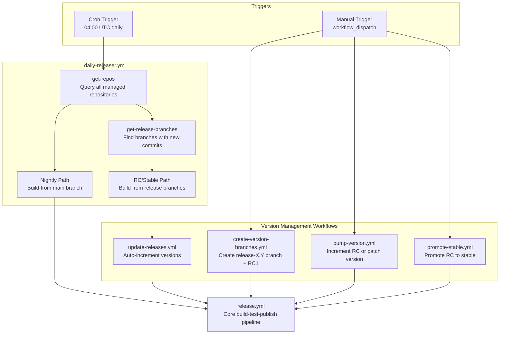
```mermaid
graph TB
    subgraph "Triggers"
        Cron["Cron Trigger<br/>04:00 UTC daily"]
        Manual["Manual Trigger<br/>workflow_dispatch"]
    end
    
    subgraph "daily-releaser.yml"
        GetRepos["get-repos<br/>Query all managed repositories"]
        GetBranches["get-release-branches<br/>Find branches with new commits"]
        
        NightlyPath["Nightly Path<br/>Build from main branch"]
        RCStablePath["RC/Stable Path<br/>Build from release branches"]
    end
    
    subgraph "Version Management Workflows"
        CreateBranch["create-version-branches.yml<br/>Create release-X.Y branch + RC1"]
        BumpVersion["bump-version.yml<br/>Increment RC or patch version"]
        PromoteStable["promote-stable.yml<br/>Promote RC to stable"]
        UpdateReleases["update-releases.yml<br/>Auto-increment versions"]
    end
    
    Release["release.yml<br/>Core build-test-publish pipeline"]
    
    Cron --> GetRepos
    Manual --> CreateBranch
    Manual --> BumpVersion
    Manual --> PromoteStable
    
    GetRepos --> NightlyPath
    GetRepos --> GetBranches
    GetBranches --> RCStablePath
    
    RCStablePath --> UpdateReleases
    UpdateReleases --> Release
    NightlyPath --> Release
    CreateBranch --> Release
    BumpVersion --> Release
    PromoteStable --> Release
```

**Sources:**[.github/workflows/daily-releaser.yml](https://github.com/tenstorrent/tt-forge/blob/6f2d9645/.github/workflows/daily-releaser.yml)[.github/workflows/release.yml](https://github.com/tenstorrent/tt-forge/blob/6f2d9645/.github/workflows/release.yml)[.github/workflows/create-version-branches.yml](https://github.com/tenstorrent/tt-forge/blob/6f2d9645/.github/workflows/create-version-branches.yml)[.github/workflows/bump-version.yml](https://github.com/tenstorrent/tt-forge/blob/6f2d9645/.github/workflows/bump-version.yml)[.github/workflows/promote-stable.yml](https://github.com/tenstorrent/tt-forge/blob/6f2d9645/.github/workflows/promote-stable.yml)[.github/workflows/update-releases.yml](https://github.com/tenstorrent/tt-forge/blob/6f2d9645/.github/workflows/update-releases.yml)

The `daily-releaser.yml` workflow serves as the central orchestrator, running on a cron schedule at 04:00 UTC. It spawns two parallel paths: the nightly path builds development releases from the main branch of each repository, while the RC/Stable path checks all release branches for new commits and triggers version bumps when detected. Manual workflows provide control points for creating release branches, bumping versions, and promoting releases to stable.

### Core Release Pipeline

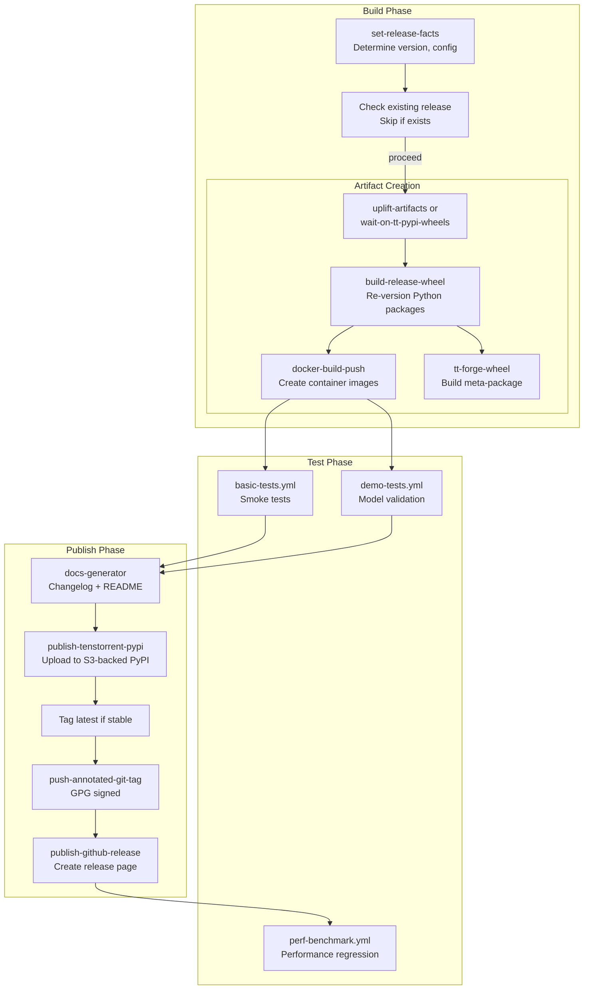
```mermaid
graph TB
    subgraph "Build Phase"
        SetFacts["set-release-facts<br/>Determine version, config"]
        CheckExists["Check existing release<br/>Skip if exists"]
        
        subgraph "Artifact Creation"
            UpliftWait["uplift-artifacts or<br/>wait-on-tt-pypi-wheels"]
            BuildWheel["build-release-wheel<br/>Re-version Python packages"]
            BuildDocker["docker-build-push<br/>Create container images"]
            TTForge["tt-forge-wheel<br/>Build meta-package"]
        end
    end
    
    subgraph "Test Phase"
        BasicTests["basic-tests.yml<br/>Smoke tests"]
        DemoTests["demo-tests.yml<br/>Model validation"]
        PerfTests["perf-benchmark.yml<br/>Performance regression"]
    end
    
    subgraph "Publish Phase"
        DocsGen["docs-generator<br/>Changelog + README"]
        PyPI["publish-tenstorrent-pypi<br/>Upload to S3-backed PyPI"]
        DockerTag["Tag latest if stable"]
        GitTag["push-annotated-git-tag<br/>GPG signed"]
        GHRelease["publish-github-release<br/>Create release page"]
    end
    
    SetFacts --> CheckExists
    CheckExists -->|proceed| UpliftWait
    UpliftWait --> BuildWheel
    BuildWheel --> BuildDocker
    BuildWheel --> TTForge
    
    BuildDocker --> BasicTests
    BuildDocker --> DemoTests
    
    BasicTests --> DocsGen
    DemoTests --> DocsGen
    
    DocsGen --> PyPI
    PyPI --> DockerTag
    DockerTag --> GitTag
    GitTag --> GHRelease
    
    GHRelease --> PerfTests
```

**Sources:**[.github/workflows/release.yml](https://github.com/tenstorrent/tt-forge/blob/6f2d9645/.github/workflows/release.yml)[.github/actions/set-release-facts/action.yaml](https://github.com/tenstorrent/tt-forge/blob/6f2d9645/.github/actions/set-release-facts/action.yaml)[.github/actions/build-release-wheel/action.yml](https://github.com/tenstorrent/tt-forge/blob/6f2d9645/.github/actions/build-release-wheel/action.yml)[.github/actions/docker-build-push/action.yml](https://github.com/tenstorrent/tt-forge/blob/6f2d9645/.github/actions/docker-build-push/action.yml)

The `release.yml` workflow implements a strict build → test → publish sequence with quality gates. The build phase determines configuration through `set-release-facts`, checks for existing releases to avoid duplicates, uplifts or waits for dependency artifacts, and creates versioned Python wheels and Docker images. The test phase runs basic smoke tests and comprehensive demo tests to validate functionality. The publish phase generates documentation, uploads to PyPI, tags Docker images, creates GPG-signed Git tags, and publishes GitHub releases. Performance tests run asynchronously after publication.

## Release Types and Versioning

The system supports four release types with distinct version formats and promotion paths:

| Release Type | Version Format | Example | Source Branch | Prerelease | Latest Tag |
| --- | --- | --- | --- | --- | --- |
| Nightly | `X.Y.Z.devYYYYMMDD` | `0.1.0.dev20250115` | `main` | Yes | No |
| Release Candidate | `X.Y.ZrcN` | `0.1.0rc1` | `release-X.Y` | Yes | No |
| Stable | `X.Y.Z` | `0.1.0` | `release-X.Y` | No | Yes |
| Patch | `X.Y.Z+1` | `0.1.1` | `release-X.Y` | No | Yes |

**Sources:**[.github/actions/set-release-facts/action.yaml](https://github.com/tenstorrent/tt-forge/blob/6f2d9645/.github/actions/set-release-facts/action.yaml)

Version numbers are derived from the `.version` file in the repository root, which contains `MAJOR` and `MINOR` variables. The `set-release-facts` action constructs the full version tag based on the release type input parameter.

### Version Progression State Machine

**Sources:**[.github/workflows/update-releases.yml](https://github.com/tenstorrent/tt-forge/blob/6f2d9645/.github/workflows/update-releases.yml)[.github/workflows/promote-stable.yml](https://github.com/tenstorrent/tt-forge/blob/6f2d9645/.github/workflows/promote-stable.yml)

The version progression follows a controlled path: nightly builds occur daily from the main branch until a release branch is created. The `create-version-branches.yml` workflow creates the release branch and initial RC1 tag. As new commits are pushed to the release branch, `update-releases.yml` automatically increments the RC number (RC1 → RC2 → RC3). When testing is complete, `promote-stable.yml` removes the RC suffix to create a stable release. Subsequent commits to the stable release branch increment the patch version (0.1.0 → 0.1.1 → 0.1.2).

## Configuration System

The `set-release-facts` action serves as the central configuration authority for the release system. It determines all release parameters based on repository name, release type, and draft status.

### Configuration Resolution Flow

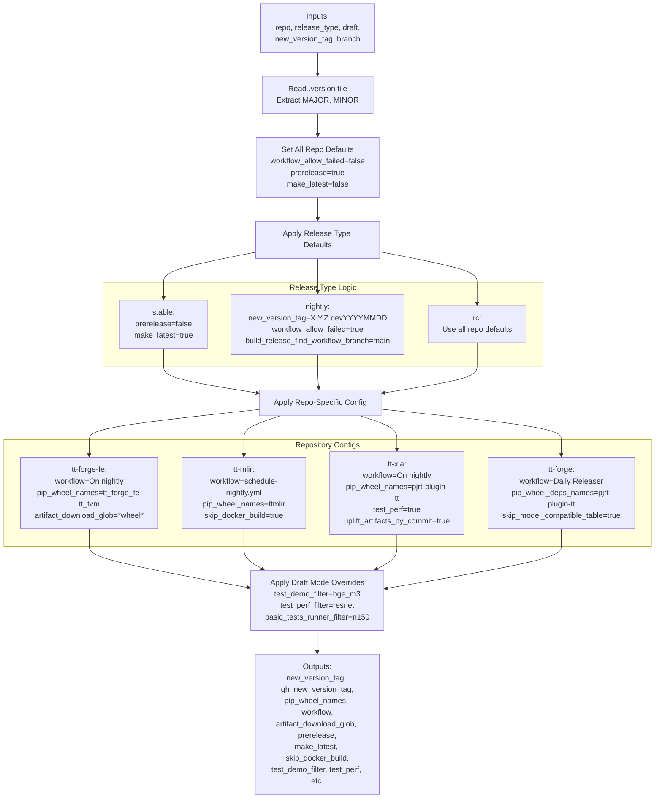
```mermaid
graph TB
    Input["Inputs:<br/>repo, release_type, draft,<br/>new_version_tag, branch"]
    
    ReadVersion["Read .version file<br/>Extract MAJOR, MINOR"]
    
    AllDefaults["Set All Repo Defaults<br/>workflow_allow_failed=false<br/>prerelease=true<br/>make_latest=false"]
    
    TypeDefaults["Apply Release Type Defaults"]
    
    subgraph "Release Type Logic"
        Stable["stable:<br/>prerelease=false<br/>make_latest=true"]
        Nightly["nightly:<br/>new_version_tag=X.Y.Z.devYYYYMMDD<br/>workflow_allow_failed=true<br/>build_release_find_workflow_branch=main"]
        RC["rc:<br/>Use all repo defaults"]
    end
    
    RepoSpecific["Apply Repo-Specific Config"]
    
    subgraph "Repository Configs"
        ForgeFE["tt-forge-fe:<br/>workflow=On nightly<br/>pip_wheel_names=tt_forge_fe tt_tvm<br/>artifact_download_glob=*wheel*"]
        
        MLIR["tt-mlir:<br/>workflow=schedule-nightly.yml<br/>pip_wheel_names=ttmlir<br/>skip_docker_build=true"]
        
        XLA["tt-xla:<br/>workflow=On nightly<br/>pip_wheel_names=pjrt-plugin-tt<br/>test_perf=true<br/>uplift_artifacts_by_commit=true"]
        
        Forge["tt-forge:<br/>workflow=Daily Releaser<br/>pip_wheel_deps_names=pjrt-plugin-tt<br/>skip_model_compatible_table=true"]
    end
    
    DraftOverrides["Apply Draft Mode Overrides<br/>test_demo_filter=bge_m3<br/>test_perf_filter=resnet<br/>basic_tests_runner_filter=n150"]
    
    Outputs["Outputs:<br/>new_version_tag, gh_new_version_tag,<br/>pip_wheel_names, workflow,<br/>artifact_download_glob, prerelease,<br/>make_latest, skip_docker_build,<br/>test_demo_filter, test_perf, etc."]
    
    Input --> ReadVersion
    ReadVersion --> AllDefaults
    AllDefaults --> TypeDefaults
    TypeDefaults --> Stable
    TypeDefaults --> Nightly
    TypeDefaults --> RC
    Stable --> RepoSpecific
    Nightly --> RepoSpecific
    RC --> RepoSpecific
    RepoSpecific --> ForgeFE
    RepoSpecific --> MLIR
    RepoSpecific --> XLA
    RepoSpecific --> Forge
    ForgeFE --> DraftOverrides
    MLIR --> DraftOverrides
    XLA --> DraftOverrides
    Forge --> DraftOverrides
    DraftOverrides --> Outputs
```

**Sources:**[.github/actions/set-release-facts/action.yaml](https://github.com/tenstorrent/tt-forge/blob/6f2d9645/.github/actions/set-release-facts/action.yaml)

The action implements a layered configuration system: it reads the `.version` file to get the major and minor version numbers, applies all-repo defaults, applies release-type-specific defaults based on the `release_type` input, applies repository-specific configuration based on the `repo` input, and finally applies draft mode overrides if `draft=true`. Each layer can override values from previous layers.

## Multi-Repository Artifact Flow

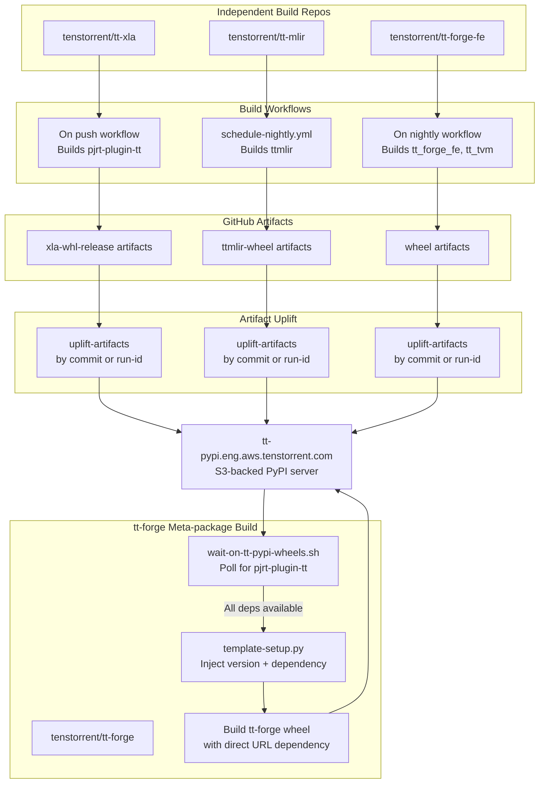
```mermaid
graph TB
    subgraph "Independent Build Repos"
        XLARepo["tenstorrent/tt-xla"]
        MLIRRepo["tenstorrent/tt-mlir"]
        FERepo["tenstorrent/tt-forge-fe"]
    end
    
    subgraph "Build Workflows"
        XLAWorkflow["On push workflow<br/>Builds pjrt-plugin-tt"]
        MLIRWorkflow["schedule-nightly.yml<br/>Builds ttmlir"]
        FEWorkflow["On nightly workflow<br/>Builds tt_forge_fe, tt_tvm"]
    end
    
    subgraph "GitHub Artifacts"
        XLAArtifacts["xla-whl-release artifacts"]
        MLIRArtifacts["ttmlir-wheel artifacts"]
        FEArtifacts["wheel artifacts"]
    end
    
    subgraph "Artifact Uplift"
        UpliftXLA["uplift-artifacts<br/>by commit or run-id"]
        UpliftMLIR["uplift-artifacts<br/>by commit or run-id"]
        UpliftFE["uplift-artifacts<br/>by commit or run-id"]
    end
    
    TTAPI["tt-pypi.eng.aws.tenstorrent.com<br/>S3-backed PyPI server"]
    
    subgraph "tt-forge Meta-package Build"
        ForgeRepo["tenstorrent/tt-forge"]
        WaitScript["wait-on-tt-pypi-wheels.sh<br/>Poll for pjrt-plugin-tt"]
        TemplateSetup["template-setup.py<br/>Inject version + dependency"]
        BuildForge["Build tt-forge wheel<br/>with direct URL dependency"]
    end
    
    XLARepo --> XLAWorkflow
    MLIRRepo --> MLIRWorkflow
    FERepo --> FEWorkflow
    
    XLAWorkflow --> XLAArtifacts
    MLIRWorkflow --> MLIRArtifacts
    FEWorkflow --> FEArtifacts
    
    XLAArtifacts --> UpliftXLA
    MLIRArtifacts --> UpliftMLIR
    FEArtifacts --> UpliftFE
    
    UpliftXLA --> TTAPI
    UpliftMLIR --> TTAPI
    UpliftFE --> TTAPI
    
    TTAPI --> WaitScript
    WaitScript -->|All deps available| TemplateSetup
    TemplateSetup --> BuildForge
    BuildForge --> TTAPI
```

The release system coordinates artifact dependencies across four repositories: tt-xla, tt-mlir, tt-forge-fe, and tt-forge.

**Sources:**[.github/actions/build-release-wheel/action.yml](https://github.com/tenstorrent/tt-forge/blob/6f2d9645/.github/actions/build-release-wheel/action.yml)[.github/actions/uplift-artifacts/action.yml](https://github.com/tenstorrent/tt-forge/blob/6f2d9645/.github/actions/uplift-artifacts/action.yml)[.github/actions/tt-forge-wheel/action.yml](https://github.com/tenstorrent/tt-forge/blob/6f2d9645/.github/actions/tt-forge-wheel/action.yml)

Each independent repository builds its wheels through repository-specific workflows. The `release.yml` workflow calls `build-release-wheel`, which uses `uplift-artifacts` to retrieve artifacts from successful workflow runs. For tt-forge, the build process is more complex because it depends on pjrt-plugin-tt. The `tt-forge-wheel` action executes a wait script that polls the PyPI server until the correct dependency version is available.

## Build Artifact Processing

The build phase transforms artifacts from upstream workflows into versioned release artifacts.

### Artifact Uplift and Download

The system provides a robust mechanism for downloading and extracting artifacts across repositories. The `Download Artifact` action [.github/actions/download-artifact/action.yaml 1-118](https://github.com/tenstorrent/tt-forge/blob/6f2d9645/%20.github/actions/download-artifact/action.yaml#L1-L118) handles the complexity of retrieving files from GitHub runs, including:

*   Automatic extraction of `tar`, `tar.gz`, and `tar.zst` archives [.github/actions/download-artifact/action.yaml 81-94](https://github.com/tenstorrent/tt-forge/blob/6f2d9645/%20.github/actions/download-artifact/action.yaml#L81-L94)
*   Configurable retry logic to handle transient network failures [.github/actions/download-artifact/action.yaml 99-116](https://github.com/tenstorrent/tt-forge/blob/6f2d9645/%20.github/actions/download-artifact/action.yaml#L99-L116)
*   Security checks to ensure downloads stay within the workspace [.github/actions/download-artifact/action.yaml 58-61](https://github.com/tenstorrent/tt-forge/blob/6f2d9645/%20.github/actions/download-artifact/action.yaml#L58-L61)

### Submodule Management

The repository automates the uplift of internal dependencies. For example, the `Weekly Forge Models Uplift` workflow [.github/workflows/schedule-uplift.yml 1-92](https://github.com/tenstorrent/tt-forge/blob/6f2d9645/%20.github/workflows/schedule-uplift.yml#L1-L92) automatically updates the `third_party/tt_forge_models` submodule [.github/workflows/schedule-uplift.yml 20](https://github.com/tenstorrent/tt-forge/blob/6f2d9645/%20.github/workflows/schedule-uplift.yml#L20-L20) every Saturday. It performs the following:

*   Fetches the latest commit from the models repository [.github/workflows/schedule-uplift.yml 36](https://github.com/tenstorrent/tt-forge/blob/6f2d9645/%20.github/workflows/schedule-uplift.yml#L36-L36)
*   Updates the submodule [.github/workflows/schedule-uplift.yml 42](https://github.com/tenstorrent/tt-forge/blob/6f2d9645/%20.github/workflows/schedule-uplift.yml#L42-L42)
*   Generates a commit log summary of changes [.github/workflows/schedule-uplift.yml 49-55](https://github.com/tenstorrent/tt-forge/blob/6f2d9645/%20.github/workflows/schedule-uplift.yml#L49-L55)
*   Creates and automatically approves/merges a Pull Request [.github/workflows/schedule-uplift.yml 59-89](https://github.com/tenstorrent/tt-forge/blob/6f2d9645/%20.github/workflows/schedule-uplift.yml#L59-L89)

## Documentation and Publication

After artifacts are built and tested, the system generates documentation and publishes through multiple channels.

### Publication Channels

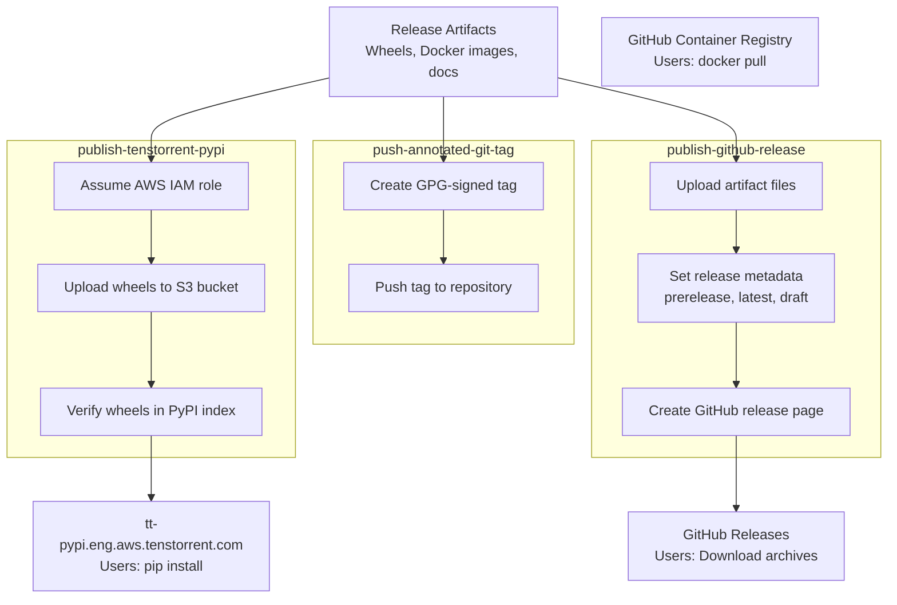
```mermaid
graph TB
    Artifacts["Release Artifacts<br/>Wheels, Docker images, docs"]
    
    subgraph "publish-tenstorrent-pypi"
        AssumeRole["Assume AWS IAM role"]
        UploadS3["Upload wheels to S3 bucket"]
        VerifyIndex["Verify wheels in PyPI index"]
    end
    
    subgraph "push-annotated-git-tag"
        SignTag["Create GPG-signed tag"]
        PushTag["Push tag to repository"]
    end
    
    subgraph "publish-github-release"
        UploadAssets["Upload artifact files"]
        SetMetadata["Set release metadata<br/>prerelease, latest, draft"]
        CreateRelease["Create GitHub release page"]
    end
    
    TTAPI2["tt-pypi.eng.aws.tenstorrent.com<br/>Users: pip install"]
    
    GHCR2["GitHub Container Registry<br/>Users: docker pull"]
    
    GHRelease["GitHub Releases<br/>Users: Download archives"]
    
    Artifacts --> AssumeRole
    AssumeRole --> UploadS3
    UploadS3 --> VerifyIndex
    VerifyIndex --> TTAPI2
    
    Artifacts --> SignTag
    SignTag --> PushTag
    
    Artifacts --> UploadAssets
    UploadAssets --> SetMetadata
    SetMetadata --> CreateRelease
    CreateRelease --> GHRelease
```

**Sources:**[.github/actions/publish-tenstorrent-pypi/action.yml](https://github.com/tenstorrent/tt-forge/blob/6f2d9645/.github/actions/publish-tenstorrent-pypi/action.yml)[.github/actions/push-annotated-git-tag/action.yml](https://github.com/tenstorrent/tt-forge/blob/6f2d9645/.github/actions/push-annotated-git-tag/action.yml)[.github/actions/publish-github-release/action.yml](https://github.com/tenstorrent/tt-forge/blob/6f2d9645/.github/actions/publish-github-release/action.yml)

Publication occurs through four channels:

1.   **tt-pypi (S3-backed PyPI)**: Internal repository for wheels.
2.   **Docker Registries**: Images are pushed to GitHub Container Registry (GHCR).
3.   **Git Tags**: GPG-signed tags provide cryptographic verification.
4.   **GitHub Releases**: Final artifacts and release notes are published to the GitHub release page.

## Child Pages

For more technical details on specific components of the release system, refer to the following child pages:

 — Explain the release types (nightly, RC, stable, patch), version progression, and the state machine for release management.
 — Document the `daily-releaser.yml` workflow that orchestrates nightly builds and RC/stable updates across all repositories.
 — Overview of the core `release.yml` workflow and related workflows for creating and managing releases.
 — Overview of the artifact creation process including Python wheels, Docker images, and dependency management.
 — Explain `docs-generator` action, changelog building, installation instructions, and model compatibility tables.
 — Document `test-rc-stable-release-lifecycle.yml` and other workflows that validate the release process.

**Sources:**[.github/workflows/daily-releaser.yml](https://github.com/tenstorrent/tt-forge/blob/6f2d9645/.github/workflows/daily-releaser.yml)[.github/workflows/release.yml](https://github.com/tenstorrent/tt-forge/blob/6f2d9645/.github/workflows/release.yml)[.github/actions/download-artifact/action.yaml](https://github.com/tenstorrent/tt-forge/blob/6f2d9645/.github/actions/download-artifact/action.yaml)[.github/workflows/schedule-uplift.yml](https://github.com/tenstorrent/tt-forge/blob/6f2d9645/.github/workflows/schedule-uplift.yml)[.github/actions/set-release-facts/action.yaml](https://github.com/tenstorrent/tt-forge/blob/6f2d9645/.github/actions/set-release-facts/action.yaml)

Dismiss
Refresh this wiki

Enter email to refresh

### Related: Model Loading and Tracing

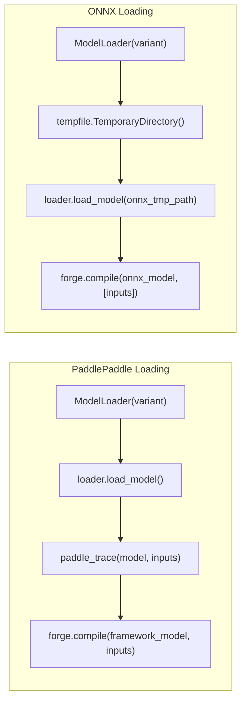
```mermaid
graph LR
    subgraph "PaddlePaddle Loading"
        P_Loader["ModelLoader(variant)"]
        P_Model["loader.load_model()"]
        P_Trace["paddle_trace(model, inputs)"]
        P_Compile["forge.compile(framework_model, inputs)"]
    end
    
    subgraph "ONNX Loading"
        O_Loader["ModelLoader(variant)"]
        O_Tmp["tempfile.TemporaryDirectory()"]
        O_Model["loader.load_model(onnx_tmp_path)"]
        O_Compile["forge.compile(onnx_model, [inputs])"]
    end

    P_Loader --> P_Model --> P_Trace --> P_Compile
    O_Loader --> O_Tmp --> O_Model --> O_Compile
```

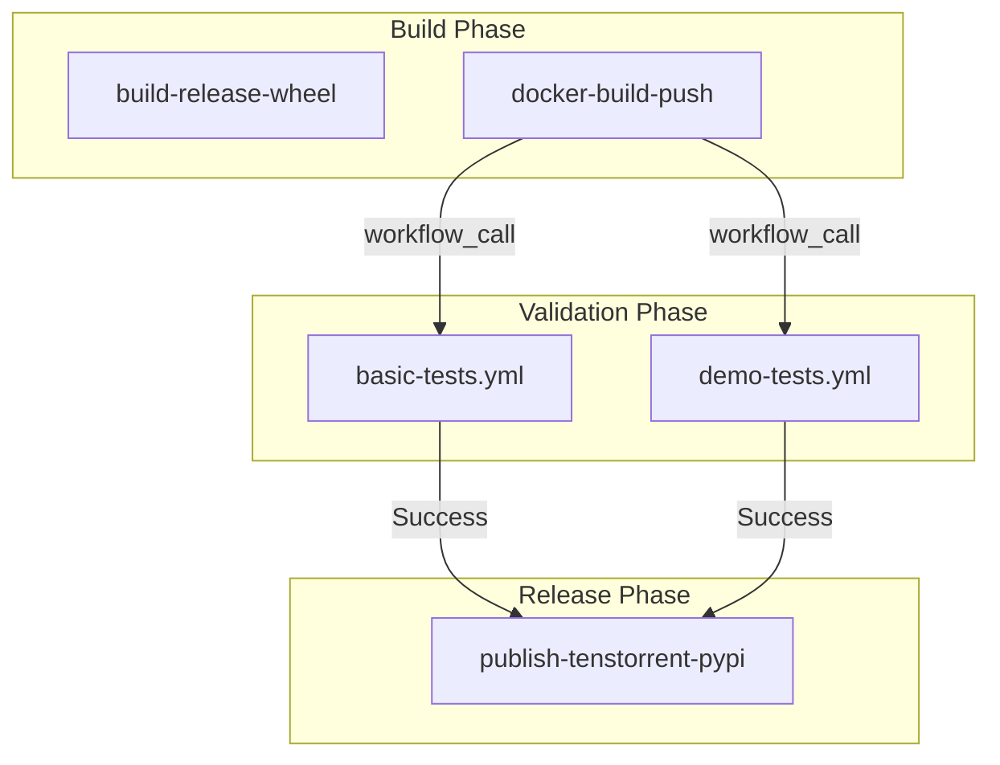
```mermaid
graph TB
    subgraph "Build Phase"
        Wheel["build-release-wheel"]
        Docker["docker-build-push"]
    end
    
    subgraph "Validation Phase"
        Basic["basic-tests.yml"]
        Demo["demo-tests.yml"]
    end
    
    subgraph "Release Phase"
        PyPI["publish-tenstorrent-pypi"]
    end
    
    Docker -->|workflow_call| Basic
    Docker -->|workflow_call| Demo
    Basic -->|Success| PyPI
    Demo -->|Success| PyPI
```

### Related: Version Tag Construction

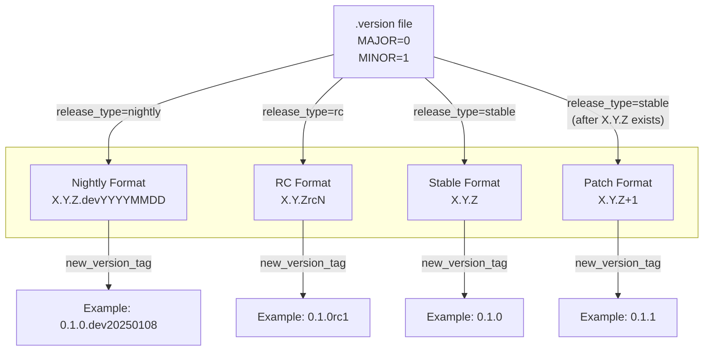
```mermaid
graph TB
    VersionFile[".version file<br/>MAJOR=0<br/>MINOR=1"]
    
    subgraph " "
        NightlyFormat["Nightly Format<br/>X.Y.Z.devYYYYMMDD"]
        RCFormat["RC Format<br/>X.Y.ZrcN"]
        StableFormat["Stable Format<br/>X.Y.Z"]
        PatchFormat["Patch Format<br/>X.Y.Z+1"]
    end
    
    VersionFile -->|"release_type=nightly"| NightlyFormat
    VersionFile -->|"release_type=rc"| RCFormat
    VersionFile -->|"release_type=stable"| StableFormat
    VersionFile -->|"release_type=stable<br/>(after X.Y.Z exists)"| PatchFormat
    
    NightlyFormat -->|"new_version_tag"| NightlyExample["Example: 0.1.0.dev20250108"]
    RCFormat -->|"new_version_tag"| RCExample["Example: 0.1.0rc1"]
    StableFormat -->|"new_version_tag"| StableExample["Example: 0.1.0"]
    PatchFormat -->|"new_version_tag"| PatchExample["Example: 0.1.1"]
```

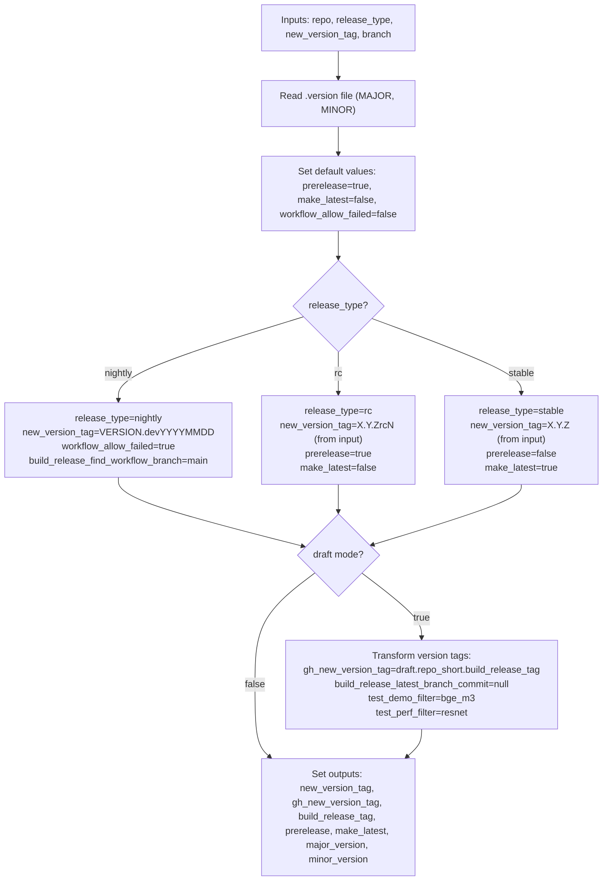
```mermaid
graph TB
    Input["Inputs: repo, release_type, new_version_tag, branch"]
    
    ReadVersion["Read .version file (MAJOR, MINOR)"]
    
    SetDefaults["Set default values: prerelease=true, make_latest=false, workflow_allow_failed=false"]
    
    CheckType{release_type?}
    
    Nightly["release_type=nightly<br/>new_version_tag=VERSION.devYYYYMMDD<br/>workflow_allow_failed=true<br/>build_release_find_workflow_branch=main"]
    
    RC["release_type=rc<br/>new_version_tag=X.Y.ZrcN (from input)<br/>prerelease=true<br/>make_latest=false"]
    
    Stable["release_type=stable<br/>new_version_tag=X.Y.Z (from input)<br/>prerelease=false<br/>make_latest=true"]
    
    DraftCheck{draft mode?}
    
    DraftTransform["Transform version tags:<br/>gh_new_version_tag=draft.repo_short.build_release_tag<br/>build_release_latest_branch_commit=null<br/>test_demo_filter=bge_m3<br/>test_perf_filter=resnet"]
    
    SetOutputs["Set outputs: new_version_tag, gh_new_version_tag, build_release_tag, prerelease, make_latest, major_version, minor_version"]
    
    Input --> ReadVersion
    ReadVersion --> SetDefaults
    SetDefaults --> CheckType
    
    CheckType -->|nightly| Nightly
    CheckType -->|rc| RC
    CheckType -->|stable| Stable
    
    Nightly --> DraftCheck
    RC --> DraftCheck
    Stable --> DraftCheck
    
    DraftCheck -->|true| DraftTransform
    DraftCheck -->|false| SetOutputs
    DraftTransform --> SetOutputs
```

### Related: Repository-Specific Configuration

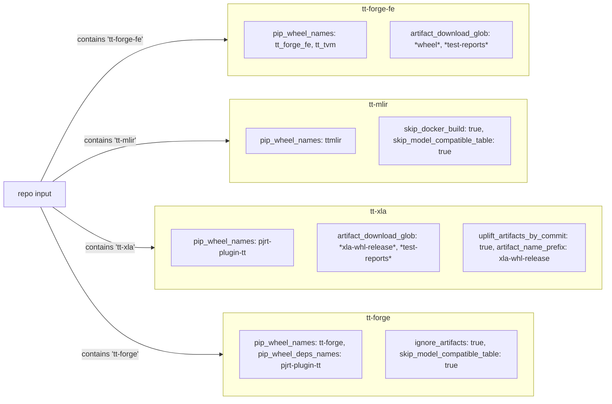
```mermaid
graph LR
    RepoInput["repo input"]
    
    subgraph TTFE["tt-forge-fe"]
        TTFE_Wheels["pip_wheel_names: tt_forge_fe, tt_tvm"]
        TTFE_Artifacts["artifact_download_glob: *wheel*, *test-reports*"]
    end
    
    subgraph TTMLIR["tt-mlir"]
        TTMLIR_Wheels["pip_wheel_names: ttmlir"]
        TTMLIR_Skip["skip_docker_build: true, skip_model_compatible_table: true"]
    end
    
    subgraph TTXLA["tt-xla"]
        TTXLA_Wheels["pip_wheel_names: pjrt-plugin-tt"]
        TTXLA_Artifacts["artifact_download_glob: *xla-whl-release*, *test-reports*"]
        TTXLA_Uplift["uplift_artifacts_by_commit: true, artifact_name_prefix: xla-whl-release"]
    end
    
    subgraph TTForge["tt-forge"]
        TTForge_Wheels["pip_wheel_names: tt-forge, pip_wheel_deps_names: pjrt-plugin-tt"]
        TTForge_Ignore["ignore_artifacts: true, skip_model_compatible_table: true"]
    end
    
    RepoInput -->|"contains 'tt-forge-fe'"| TTFE
    RepoInput -->|"contains 'tt-mlir'"| TTMLIR
    RepoInput -->|"contains 'tt-xla'"| TTXLA
    RepoInput -->|"contains 'tt-forge'"| TTForge
```

### Related: Version Increment Rules

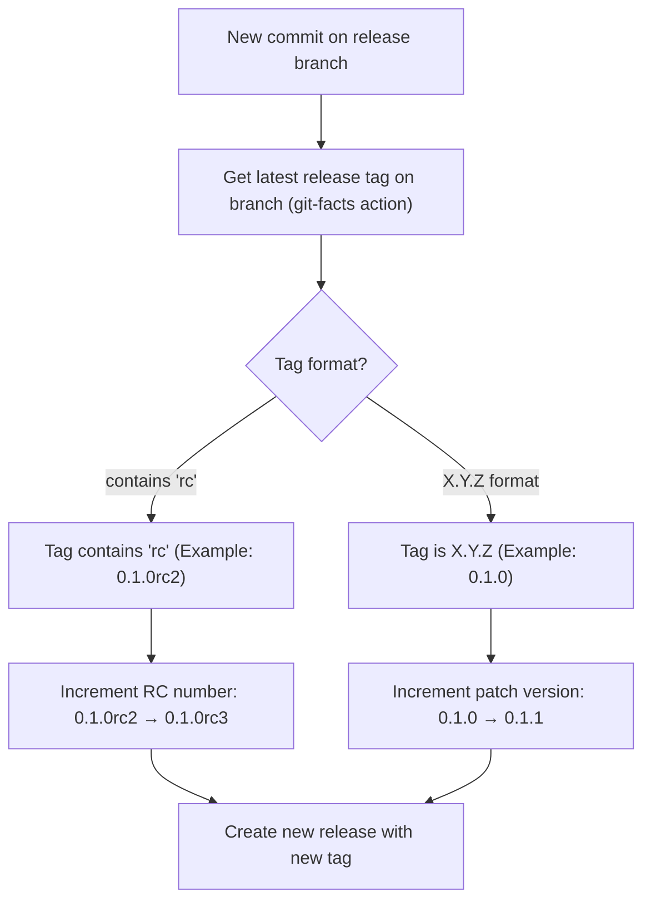
```mermaid
graph TB
    Start["New commit on release branch"]
    
    GetTag["Get latest release tag on branch (git-facts action)"]
    
    CheckTag{Tag format?}
    
    IsRC["Tag contains 'rc' (Example: 0.1.0rc2)"]
    IsStable["Tag is X.Y.Z (Example: 0.1.0)"]
    
    IncrementRC["Increment RC number: 0.1.0rc2 → 0.1.0rc3"]
    IncrementPatch["Increment patch version: 0.1.0 → 0.1.1"]
    
    NewTag["Create new release with new tag"]
    
    Start --> GetTag
    GetTag --> CheckTag
    
    CheckTag -->|"contains 'rc'"| IsRC
    CheckTag -->|"X.Y.Z format"| IsStable
    
    IsRC --> IncrementRC
    IsStable --> IncrementPatch
    
    IncrementRC --> NewTag
    IncrementPatch --> NewTag
```

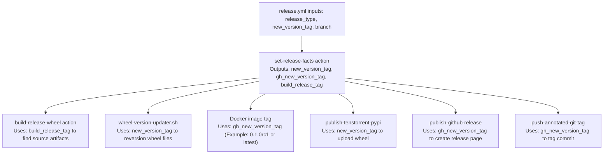
```mermaid
graph TB
    WorkflowInput["release.yml inputs: release_type, new_version_tag, branch"]
    
    SetFacts["set-release-facts action<br/>Outputs: new_version_tag, gh_new_version_tag, build_release_tag"]
    
    BuildWheel["build-release-wheel action<br/>Uses: build_release_tag to find source artifacts"]
    
    UpdateVersion["wheel-version-updater.sh<br/>Uses: new_version_tag to reversion wheel files"]
    
    DockerTag["Docker image tag<br/>Uses: gh_new_version_tag (Example: 0.1.0rc1 or latest)"]
    
    PyPIPublish["publish-tenstorrent-pypi<br/>Uses: new_version_tag to upload wheel"]
    
    GitHubRelease["publish-github-release<br/>Uses: gh_new_version_tag to create release page"]
    
    GitTag["push-annotated-git-tag<br/>Uses: gh_new_version_tag to tag commit"]
    
    WorkflowInput --> SetFacts
    SetFacts --> BuildWheel
    SetFacts --> UpdateVersion
    SetFacts --> DockerTag
    SetFacts --> PyPIPublish
    SetFacts --> GitHubRelease
    SetFacts --> GitTag
```

### Related: Nightly Release Path

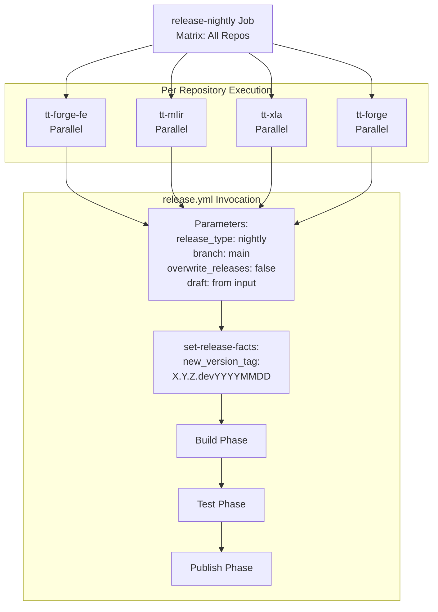
```mermaid
graph TD
    ReleaseNightly["release-nightly Job<br/>Matrix: All Repos"]
    
    subgraph "Per Repository Execution"
        RepoForgeFE["tt-forge-fe<br/>Parallel"]
        RepoMLIR["tt-mlir<br/>Parallel"]
        RepoXLA["tt-xla<br/>Parallel"]
        RepoForge["tt-forge<br/>Parallel"]
    end
    
    subgraph "release.yml Invocation"
        ReleaseParams["Parameters:<br/>release_type: nightly<br/>branch: main<br/>overwrite_releases: false<br/>draft: from input"]
        SetFacts["set-release-facts:<br/>new_version_tag:<br/>X.Y.Z.devYYYYMMDD"]
        BuildPhase["Build Phase"]
        TestPhase["Test Phase"]
        PublishPhase["Publish Phase"]
    end
    
    ReleaseNightly --> RepoForgeFE
    ReleaseNightly --> RepoMLIR
    ReleaseNightly --> RepoXLA
    ReleaseNightly --> RepoForge
    
    RepoForgeFE --> ReleaseParams
    RepoMLIR --> ReleaseParams
    RepoXLA --> ReleaseParams
    RepoForge --> ReleaseParams
    
    ReleaseParams --> SetFacts
    SetFacts --> BuildPhase
    BuildPhase --> TestPhase
    TestPhase --> PublishPhase
```

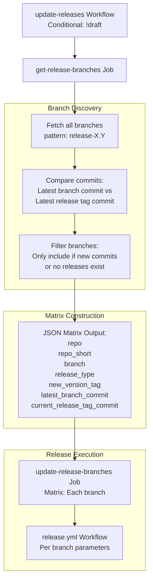
```mermaid
graph TD
    UpdateReleases["update-releases Workflow<br/>Conditional: !draft"]
    GetBranches["get-release-branches Job"]
    
    subgraph "Branch Discovery"
        FetchBranches["Fetch all branches<br/>pattern: release-X.Y"]
        CheckCommits["Compare commits:<br/>Latest branch commit vs<br/>Latest release tag commit"]
        FilterBranches["Filter branches:<br/>Only include if new commits<br/>or no releases exist"]
    end
    
    subgraph "Matrix Construction"
        MatrixOutput["JSON Matrix Output:<br/>repo<br/>repo_short<br/>branch<br/>release_type<br/>new_version_tag<br/>latest_branch_commit<br/>current_release_tag_commit"]
    end
    
    subgraph "Release Execution"
        MatrixJobs["update-release-branches Job<br/>Matrix: Each branch"]
        ReleaseInvoke["release.yml Workflow<br/>Per branch parameters"]
    end
    
    UpdateReleases --> GetBranches
    GetBranches --> FetchBranches
    FetchBranches --> CheckCommits
    CheckCommits --> FilterBranches
    FilterBranches --> MatrixOutput
    MatrixOutput --> MatrixJobs
    MatrixJobs --> ReleaseInvoke
```

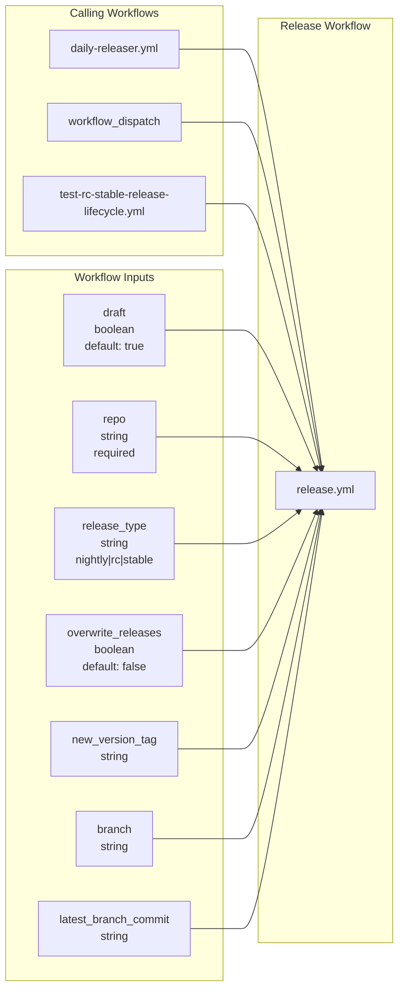
```mermaid
graph LR
    subgraph "Workflow Inputs"
        draft["draft<br/>boolean<br/>default: true"]
        repo["repo<br/>string<br/>required"]
        release_type["release_type<br/>string<br/>nightly|rc|stable"]
        overwrite["overwrite_releases<br/>boolean<br/>default: false"]
        new_version_tag["new_version_tag<br/>string"]
        branch["branch<br/>string"]
        latest_commit["latest_branch_commit<br/>string"]
    end
    
    subgraph "Calling Workflows"
        daily_releaser["daily-releaser.yml"]
        manual["workflow_dispatch"]
        test_lifecycle["test-rc-stable-release-lifecycle.yml"]
    end
    
    subgraph "Release Workflow"
        release["release.yml"]
    end
    
    daily_releaser --> release
    manual --> release
    test_lifecycle --> release
    
    draft --> release
    repo --> release
    release_type --> release
    overwrite --> release
    new_version_tag --> release
    branch --> release
    latest_commit --> release
```

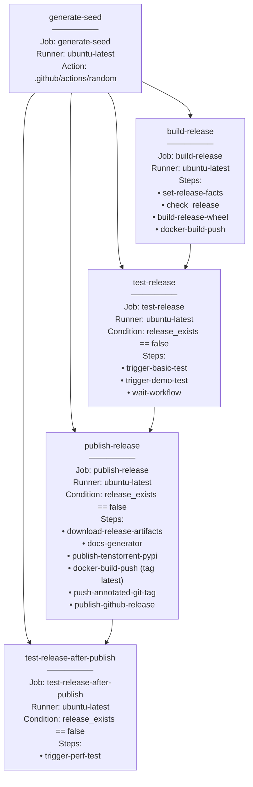
```mermaid
graph TB
    generate_seed["generate-seed<br/>────────<br/>Job: generate-seed<br/>Runner: ubuntu-latest<br/>Action: .github/actions/random"]
    
    build_release["build-release<br/>────────<br/>Job: build-release<br/>Runner: ubuntu-latest<br/>Steps:<br/>• set-release-facts<br/>• check_release<br/>• build-release-wheel<br/>• docker-build-push"]
    
    test_release["test-release<br/>────────<br/>Job: test-release<br/>Runner: ubuntu-latest<br/>Condition: release_exists == false<br/>Steps:<br/>• trigger-basic-test<br/>• trigger-demo-test<br/>• wait-workflow"]
    
    publish_release["publish-release<br/>────────<br/>Job: publish-release<br/>Runner: ubuntu-latest<br/>Condition: release_exists == false<br/>Steps:<br/>• download-release-artifacts<br/>• docs-generator<br/>• publish-tenstorrent-pypi<br/>• docker-build-push (tag latest)<br/>• push-annotated-git-tag<br/>• publish-github-release"]
    
    test_after_publish["test-release-after-publish<br/>────────<br/>Job: test-release-after-publish<br/>Runner: ubuntu-latest<br/>Condition: release_exists == false<br/>Steps:<br/>• trigger-perf-test"]
    
    generate_seed --> build_release
    generate_seed --> test_release
    generate_seed --> publish_release
    generate_seed --> test_after_publish
    
    build_release --> test_release
    test_release --> publish_release
    publish_release --> test_after_publish
```

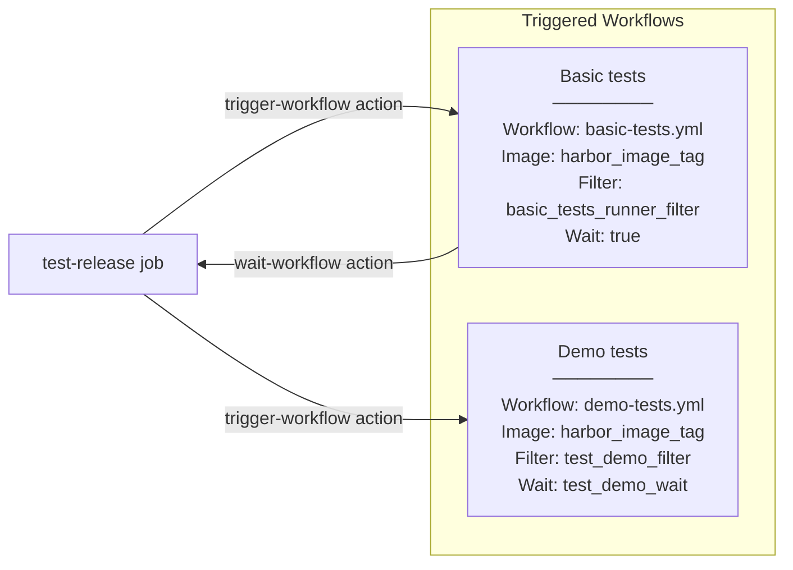
```mermaid
graph LR
    test_release["test-release job"]
    
    subgraph "Triggered Workflows"
        basic_tests["Basic tests<br/>────────<br/>Workflow: basic-tests.yml<br/>Image: harbor_image_tag<br/>Filter: basic_tests_runner_filter<br/>Wait: true"]
        
        demo_tests["Demo tests<br/>────────<br/>Workflow: demo-tests.yml<br/>Image: harbor_image_tag<br/>Filter: test_demo_filter<br/>Wait: test_demo_wait"]
    end
    
    test_release -->|"trigger-workflow action"| basic_tests
    test_release -->|"trigger-workflow action"| demo_tests
    
    basic_tests -->|"wait-workflow action"| test_release
```

### Related: Cross-Repository Artifact Flow

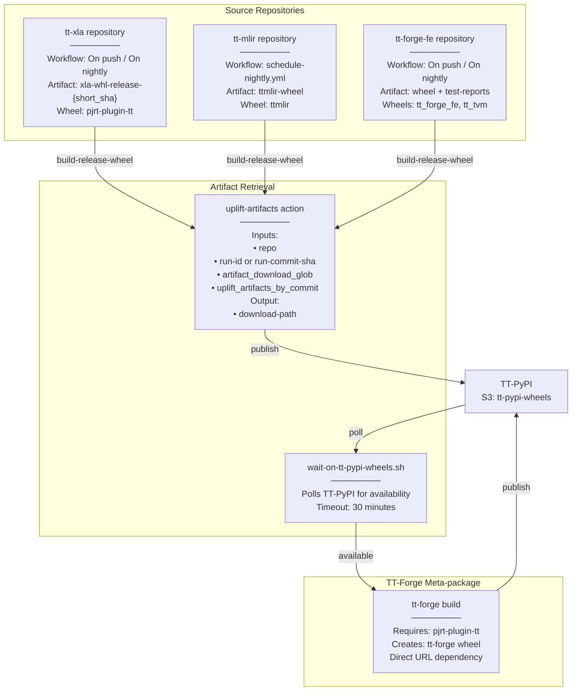
```mermaid
graph TB
    subgraph "Source Repositories"
        tt_xla["tt-xla repository<br/>────────<br/>Workflow: On push / On nightly<br/>Artifact: xla-whl-release-{short_sha}<br/>Wheel: pjrt-plugin-tt"]
        
        tt_mlir["tt-mlir repository<br/>────────<br/>Workflow: schedule-nightly.yml<br/>Artifact: ttmlir-wheel<br/>Wheel: ttmlir"]
        
        tt_forge_fe["tt-forge-fe repository<br/>────────<br/>Workflow: On push / On nightly<br/>Artifact: wheel + test-reports<br/>Wheels: tt_forge_fe, tt_tvm"]
    end
    
    subgraph "Artifact Retrieval"
        uplift["uplift-artifacts action<br/>────────<br/>Inputs:<br/>• repo<br/>• run-id or run-commit-sha<br/>• artifact_download_glob<br/>• uplift_artifacts_by_commit<br/>Output:<br/>• download-path"]
        
        wait_wheels["wait-on-tt-pypi-wheels.sh<br/>────────<br/>Polls TT-PyPI for availability<br/>Timeout: 30 minutes"]
    end
    
    subgraph "TT-Forge Meta-package"
        forge_build["tt-forge build<br/>────────<br/>Requires: pjrt-plugin-tt<br/>Creates: tt-forge wheel<br/>Direct URL dependency"]
    end
    
    tt_xla -->|"build-release-wheel"| uplift
    tt_mlir -->|"build-release-wheel"| uplift
    tt_forge_fe -->|"build-release-wheel"| uplift
    
    uplift -->|"publish"| tt_pypi["TT-PyPI<br/>S3: tt-pypi-wheels"]
    
    tt_pypi -->|"poll"| wait_wheels
    wait_wheels -->|"available"| forge_build
    
    forge_build -->|"publish"| tt_pypi
```

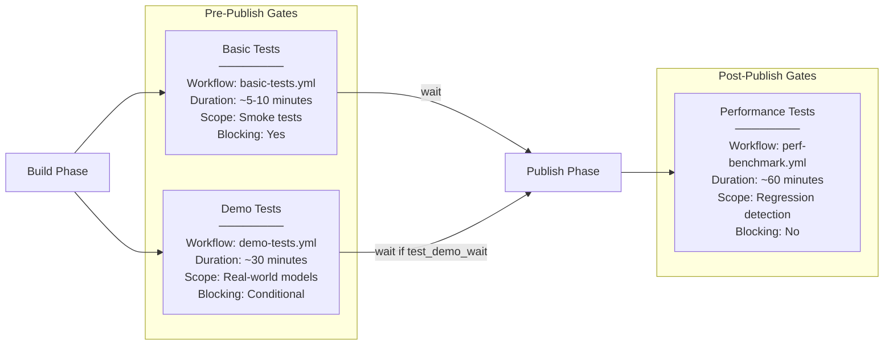
```mermaid
graph LR
    subgraph "Pre-Publish Gates"
        basic["Basic Tests<br/>────────<br/>Workflow: basic-tests.yml<br/>Duration: ~5-10 minutes<br/>Scope: Smoke tests<br/>Blocking: Yes"]
        
        demo["Demo Tests<br/>────────<br/>Workflow: demo-tests.yml<br/>Duration: ~30 minutes<br/>Scope: Real-world models<br/>Blocking: Conditional"]
    end
    
    subgraph "Post-Publish Gates"
        perf["Performance Tests<br/>────────<br/>Workflow: perf-benchmark.yml<br/>Duration: ~60 minutes<br/>Scope: Regression detection<br/>Blocking: No"]
    end
    
    build["Build Phase"] --> basic
    build --> demo
    basic -->|"wait"| publish["Publish Phase"]
    demo -->|"wait if test_demo_wait"| publish
    publish --> perf
```

### Related: Standard Artifact Uplift

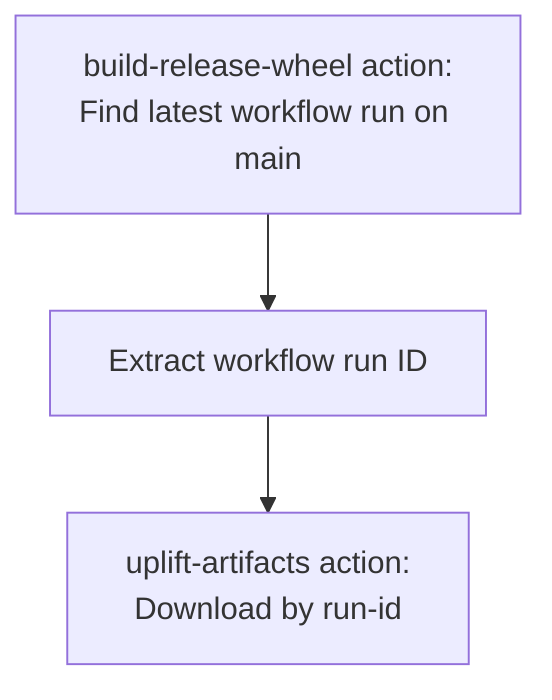
```mermaid
graph TB
    FindWorkflow["build-release-wheel action:<br/>Find latest workflow run on main"]
    GetRunID["Extract workflow run ID"]
    DownloadArtifacts["uplift-artifacts action:<br/>Download by run-id"]
    
    FindWorkflow --> GetRunID
    GetRunID --> DownloadArtifacts
```

```mermaid
graph TB
    GetCommit["Get latest commit SHA<br/>from main branch"]
    ShortSHA["Convert to short SHA:<br/>git rev-parse --short"]
    BuildArtifactName["Construct artifact name:<br/>xla-whl-release-{short_sha}"]
    CheckArtifact["GitHub API check:<br/>/repos/{repo}/actions/artifacts?name={artifact_name}"]
    GetRunID["Extract workflow_run.id<br/>from artifact metadata"]
    Download["Download artifacts<br/>by run-id"]
    
    GetCommit --> ShortSHA
    ShortSHA --> BuildArtifactName
    BuildArtifactName --> CheckArtifact
    CheckArtifact -->|"found"| GetRunID
    GetRunID --> Download
    CheckArtifact -->|"not found"| Error["Exit with error"]
```

### Related: Testing Configuration for Nightly Releases

```mermaid
graph TB
    BuildComplete["Build phase complete<br/>Docker image ready"]
    
    subgraph "Parallel Test Execution"
        BasicTests["basic-tests.yml<br/>trigger-workflow action<br/>wait=false<br/>wait_for_run_url=true"]
        DemoTests["demo-tests.yml<br/>trigger-workflow action<br/>wait=false<br/>wait_for_run_url=true"]
    end
    
    WaitBasic["wait-workflow action<br/>Block on basic-tests"]
    ProceedPublish["Proceed to publish phase"]
    
    BuildComplete --> BasicTests
    BuildComplete --> DemoTests
    
    BasicTests --> WaitBasic
    WaitBasic --> ProceedPublish
```

### Related: Nightly Release Version Progression

```mermaid
graph TB
    VersionFile[".version file<br/>MAJOR=0, MINOR=6, PATCH=0"]
    
    subgraph "Daily Nightly Releases"
        Day1["0.6.0.dev20250115<br/>Jan 15 nightly"]
        Day2["0.6.0.dev20250116<br/>Jan 16 nightly"]
        Day3["0.6.0.dev20250117<br/>Jan 17 nightly"]
    end
    
    subgraph "Release Branch Creation"
        CreateBranch["create-version-branches.yml<br/>Creates release-0.6 branch"]
        RC1["0.6.0rc1<br/>First release candidate"]
    end
    
    subgraph "Continued Development"
        BumpMinor["bump-version.yml<br/>Increment MINOR to 7"]
        NextNightly["0.7.0.dev20250120<br/>Next nightly series"]
    end
    
    VersionFile --> Day1
    Day1 --> Day2
    Day2 --> Day3
    Day3 --> CreateBranch
    
    CreateBranch --> RC1
    CreateBranch --> BumpMinor
    BumpMinor --> NextNightly
    
    style Day1 fill:#f9f9f9
    style Day2 fill:#f9f9f9
    style Day3 fill:#f9f9f9
    style NextNightly fill:#f9f9f9
```

### Related: Dependency Uplift Integration

```mermaid
graph TB
    Schedule["Weekly Cron<br/>Saturday 08:00 UTC"]
    CheckLatest["gh api repos/tenstorrent/tt-forge-models/commits/main"]
    UpdateSubmodule["git submodule update --remote --merge"]
    CreatePR["peter-evans/create-pull-request<br/>Branch: uplift-forge-models"]
    ApprovePR["gh pr review --approve"]
    AutoMerge["gh pr merge --squash --auto"]

    Schedule --> CheckLatest
    CheckLatest --> UpdateSubmodule
    UpdateSubmodule --> CreatePR
    CreatePR --> ApprovePR
    ApprovePR --> AutoMerge
```

```mermaid
graph LR
    RC1["0.4.0rc1<br/>First RC"]
    RC2["0.4.0rc2<br/>Second RC"]
    RC3["0.4.0rc3<br/>Third RC"]
    Stable["0.4.0<br/>Stable"]
    Patch1["0.4.1<br/>Patch"]
    Patch2["0.4.2<br/>Patch"]
    
    RC1 -->|"bump-version.yml"| RC2
    RC2 -->|"bump-version.yml"| RC3
    RC3 -->|"promote-stable.yml"| Stable
    Stable -->|"bump-version.yml"| Patch1
    Patch1 -->|"bump-version.yml"| Patch2
```

### Related: Bump Version Workflow

```mermaid
graph TB
    Commit["New commit on release-X.Y branch"]
    UpdateReleases["update-releases.yml<br/>Detects commit"]
    BumpVersion["bump-version.yml<br/>Called with branch name"]
    FindRC["Find latest RC tag<br/>e.g., X.Y.Zrc2"]
    IncrementRC["Increment RC number<br/>rc2 → rc3"]
    TriggerRelease["release.yml<br/>with new_version_tag=X.Y.Zrc3"]
    CreateRelease["Build and publish X.Y.Zrc3"]
    
    Commit --> UpdateReleases
    UpdateReleases --> BumpVersion
    BumpVersion --> FindRC
    FindRC --> IncrementRC
    IncrementRC --> TriggerRelease
    TriggerRelease --> CreateRelease
```

```mermaid
graph TB
    Manual["Manual trigger or<br/>automated decision"]
    PromoteStable["promote-stable.yml<br/>Input: release_branch"]
    FindLatestRC["Find latest RC on branch<br/>e.g., X.Y.Zrc3"]
    ExtractBase["Extract base version<br/>X.Y.Z from X.Y.Zrc3"]
    TriggerRelease["release.yml<br/>type=stable<br/>new_version_tag=X.Y.Z"]
    SetFacts["set-release-facts<br/>prerelease=false<br/>make_latest=true"]
    BuildPublish["Build, test, and publish<br/>as stable release"]
    TagLatest["Docker: Tag as latest<br/>GitHub: Mark as latest release"]
    
    Manual --> PromoteStable
    PromoteStable --> FindLatestRC
    FindLatestRC --> ExtractBase
    ExtractBase --> TriggerRelease
    TriggerRelease --> SetFacts
    SetFacts --> BuildPublish
    BuildPublish --> TagLatest
```

### Related: Phase 1: Build Release

```mermaid
graph TB
    Input["Workflow inputs<br/>repo, release_type, new_version_tag, branch"]
    SetFacts["set-release-facts<br/>Configure based on release_type"]
    CheckExists["check_release.sh<br/>Skip if exists & !overwrite"]
    UpliftArtifacts["uplift-artifacts or wait-on-tt-pypi-wheels<br/>Retrieve dependencies"]
    BuildWheel["build-release-wheel<br/>Create Python packages"]
    BuildDocker["docker-build-push<br/>Create container image"]
    
    Input --> SetFacts
    SetFacts --> CheckExists
    CheckExists -->|"release does not exist"| UpliftArtifacts
    UpliftArtifacts --> BuildWheel
    BuildWheel --> BuildDocker
```

### Related: Phase 2: Test Release

```mermaid
graph TB
    BuildComplete["Build phase complete<br/>Artifacts available"]
    TriggerBasic["Trigger basic-tests.yml<br/>Quick validation"]
    TriggerDemo["Trigger demo-tests.yml<br/>Comprehensive model tests"]
    WaitBasic["wait-workflow<br/>Wait for basic tests"]
    DemoAsync["Demo tests run async<br/>unless test_demo_wait=true"]
    
    BuildComplete --> TriggerBasic
    BuildComplete --> TriggerDemo
    TriggerBasic --> WaitBasic
    TriggerDemo --> DemoAsync
    WaitBasic --> ProceedToPublish["Proceed to publish phase"]
```

```mermaid
graph TB
    TestsPass["Tests passed"]
    DownloadArtifacts["Download release artifacts<br/>from build phase"]
    GenerateDocs["docs-generator<br/>Changelog, README, install instructions"]
    PublishPyPI["publish-tenstorrent-pypi<br/>Upload wheels to S3-backed PyPI"]
    TagDocker["Tag Docker image as latest<br/>if make_latest=true"]
    PushTag["push-annotated-git-tag<br/>Create GPG-signed Git tag"]
    PublishGH["publish-github-release<br/>Create GitHub release page"]
    PerfTest["trigger perf-benchmark.yml<br/>Post-publish validation"]
    
    TestsPass --> DownloadArtifacts
    DownloadArtifacts --> GenerateDocs
    GenerateDocs --> PublishPyPI
    PublishPyPI --> TagDocker
    TagDocker --> PushTag
    PushTag --> PublishGH
    PublishGH --> PerfTest
```

### Related: Artifact Management

```mermaid
graph LR
    GHRun["GitHub Workflow Run"]
    DAAction["Download Artifact Action<br/>.github/actions/download-artifact"]
    RetryLogic["Retry Loop<br/>(lines 101-111)"]
    Extraction["Extraction Logic<br/>(lines 81-94)"]
    Workspace["Local Workspace"]

    GHRun --> DAAction
    DAAction --> RetryLogic
    RetryLogic --> Extraction
    Extraction --> Workspace
```

### Related: Artifact Management Architecture

```mermaid
graph TB
    subgraph "Source Repositories"
        TTFE["tt-forge-fe"]
        TTTorch["tt-torch"]
        TTXLA["tt-xla"]
        TTMLIR["tt-mlir"]
    end
    
    subgraph "Artifact Operations"
        UpliftAction["uplift-artifacts<br/>Cross-repo discovery"]
        DownloadAction["download-artifact<br/>gh run download + retry"]
        InstallAction["install-wheel<br/>Project-specific install"]
    end
    
    subgraph "Storage & Consumers"
        GitHub["GitHub Artifacts"]
        Workflows["CI Workflows<br/>(release.yml, perf-benchmark.yml)"]
    end
    
    TTFE --> GitHub
    TTTorch --> GitHub
    TTXLA --> GitHub
    TTMLIR --> GitHub
    
    Workflows --> UpliftAction
    Workflows --> InstallAction
    UpliftAction --> DownloadAction
    InstallAction --> DownloadAction
    DownloadAction --> GitHub
```

### Related: Image Build Architecture

```mermaid
graph TB
    subgraph "Base Image Build"
        Ubuntu["ubuntu:22.04<br/>Official Ubuntu image"]
        BaseDockerfile[".github/Dockerfile.ubuntu-22-04-py3-11"]
        BaseBuild["docker-build-push action<br/>Build base Python image"]
        BaseImage["ghcr.io/tenstorrent/forge-ubuntu-22-04-py3-11<br/>Tagged: VERSION & latest"]
        
        Ubuntu --> BaseDockerfile
        BaseDockerfile --> BaseBuild
        BaseBuild --> BaseImage
    end
    
    subgraph "Wheel Artifacts"
        WheelBuild["build-release-wheel action<br/>Creates wheel files"]
        WheelPath["wheel_files_path<br/>Workspace path to .whl files"]
        
        WheelBuild --> WheelPath
    end
    
    subgraph "Slim Image Build"
        SlimDockerfile[".github/Dockerfile.single-wheel-slim"]
        SlimBuildArgs["Build args:<br/>--build-arg REPO_SHORT<br/>--build-arg WHEEL_FILES_PATH<br/>--build-arg DOCKER_BASE_IMAGE"]
        SlimBuild["docker-build-push action<br/>Build slim image"]
        SlimImage["ghcr.io/tenstorrent/REPO_SHORT-slim:VERSION<br/>Examples:<br/>- tt-xla-slim<br/>- tt-forge-fe-slim"]
        
        BaseImage --> SlimBuildArgs
        WheelPath --> SlimBuildArgs
        SlimDockerfile --> SlimBuildArgs
        SlimBuildArgs --> SlimBuild
        SlimBuild --> SlimImage
    end
    
    subgraph "Tagging Strategy"
        VersionTag["VERSION tag<br/>e.g., 0.5.0"]
        LatestTag["latest tag<br/>For stable releases only"]
        
        SlimImage --> VersionTag
        SlimImage -.->|if stable release| LatestTag
    end
```

### Related: Base Image Build Step

```mermaid
graph LR
    CheckPythonVer["Check python_version<br/>from set-release-facts"]
    BuildBase["docker-build-push action<br/>Step: docker-build-push-3-11"]
    DetermineBase["determine-docker-base-image step<br/>Set DOCKER_BASE_IMAGE output"]
    
    CheckPythonVer -->|if python_version == 3.11| BuildBase
    BuildBase --> DetermineBase
```

```mermaid
graph TB
    subgraph "Preconditions"
        SkipCheck["Check skip_docker_build flag<br/>from set-release-facts"]
        ReleaseCheck["Check release_exists<br/>from check_release step"]
        OverwriteCheck["Check overwrite_releases input"]
        
        SkipCheck -->|skip_docker_build == false| ProceedBuild
        ReleaseCheck -->|release_exists == false| ProceedBuild
        OverwriteCheck -->|overwrite_releases == true| ProceedBuild
    end
    
    subgraph "Build Execution"
        ProceedBuild["Proceed with build"]
        SetArgs["Set build arguments:<br/>REPO_SHORT: e.g., tt-xla<br/>WHEEL_FILES_PATH: from build-release-wheel<br/>DOCKER_BASE_IMAGE: from determine step"]
        DockerBuildPush["docker-build-push action"]
        OutputImageTag["Output: harbor_image_tag, image_tag"]
        
        ProceedBuild --> SetArgs
        SetArgs --> DockerBuildPush
        DockerBuildPush --> OutputImageTag
    end
    
    subgraph "Image Registry"
        GHCR["GitHub Container Registry<br/>ghcr.io/tenstorrent/"]
        Harbor["Harbor Registry<br/>Internal mirror"]
        
        OutputImageTag --> GHCR
        OutputImageTag --> Harbor
    end
```

```mermaid
graph TB
    subgraph "Phase 1: Initial Build"
        InitialBuild["Slim image build<br/>build-release job"]
        InitialTag["Tag: VERSION<br/>make_latest: false"]
        
        InitialBuild --> InitialTag
    end
    
    subgraph "Phase 2: Post-Publish Tagging"
        PublishJob["After publish-release job completes"]
        CheckMakeLatest["Check make_latest flag<br/>from set-release-facts"]
        RetagJob["docker-build-push action<br/>Re-tag existing image"]
        LatestTag["Additional tag: latest<br/>Applied if stable release"]
        
        PublishJob --> CheckMakeLatest
        CheckMakeLatest -->|make_latest == true| RetagJob
        RetagJob --> LatestTag
    end
    
    InitialTag -.-> PublishJob
    
    subgraph "Version Tag Patterns"
        Nightly["Nightly:<br/>X.Y.Z.devYYYYMMDD"]
        RC["Release Candidate:<br/>X.Y.ZrcN"]
        Stable["Stable:<br/>X.Y.Z"]
        Draft["Draft:<br/>draft.REPO_SHORT.X.Y.Z"]
    end
```

### Related: Documentation Data Flow

```mermaid
graph TB
    subgraph "Trigger Sources"
        DailyReleaser["daily-releaser.yml<br/>Scheduled: 0 4 * * *"]
        UpdateReleases["update-releases.yml<br/>RC/Stable updates"]
        ReleaseWF["release.yml<br/>Main release orchestrator"]
        PushMain["push to main branch"]
    end
    
    subgraph "docs-generator Action (Release Docs)"
        GetTags["Get current tags<br/>action.yml lines 66-126"]
        ModelTable["Create model compatible table<br/>action.yml lines 128-144"]
        BuildChangelog["Build Changelog<br/>mikepenz action<br/>action.yml lines 146-212"]
        OutputReadme["Output readme<br/>action.yml lines 214-267"]
    end
    
    subgraph "mdBook (Static Docs)"
        InstallMDB["Install mdBook 0.4.47<br/>pages.yml lines 28-32"]
        BuildMDB["mdbook build docs<br/>pages.yml line 36"]
    end
    
    subgraph "Output Artifacts"
        ReadmeFile["/tmp/release/docs/readme<br/>Combined documentation"]
        GitHubRelease["GitHub Release Page"]
        GitHubPages["GitHub Pages Site"]
    end
    
    DailyReleaser -->|triggers| ReleaseWF
    UpdateReleases -->|triggers| ReleaseWF
    ReleaseWF -->|invokes| GetTags
    PushMain -->|triggers| InstallMDB
    
    GetTags --> ModelTable
    GetTags --> BuildChangelog
    BuildChangelog --> OutputReadme
    OutputReadme --> ReadmeFile
    ReadmeFile --> GitHubRelease
    
    InstallMDB --> BuildMDB
    BuildMDB --> GitHubPages
```

### Related: Test Workflow Sequence

```mermaid
graph TB
    Start["Test Trigger<br/>Push or PR to release code"]
    
    GetRepos["get-repos job<br/>────────────<br/>Identifies tt-mlir for testing"]
    
    ExpectedArtifacts["expected-artifacts job<br/>────────────<br/>Defines expected tags:<br/>- draft.tt-mlir.X.Y.0rc1/rc2/rc3<br/>- draft.tt-mlir.X.Y.0/1/2<br/>- draft.tt-mlir.first-commit-*<br/>- draft.tt-mlir.second-commit-*"]
    
    MockWorkflow1["mock-successful-workflow-pre-release-branch<br/>────────────<br/>Trigger Mock Successful workflow<br/>Get run_head_sha"]
    
    CreateBranch["create-version-branch job<br/>────────────<br/>Calls create-version-branches.yml<br/>draft: true<br/>Creates draft-tt-mlir-release-X.Y"]
    
    GetBranches["get-release-branches job<br/>────────────<br/>Finds draft release branches<br/>ignore_update_check: true"]
    
    subgraph "RC Creation Phase"
        FirstRC["first-commit-successful-pre-release-branch<br/>────────────<br/>mock-commit-tag-merge action<br/>Tag: FIRST_COMMIT_PRE_RELEASE_TAG<br/>Merge to release branch"]
        
        ReleaseRC1["release-rc-first-commit-observed<br/>────────────<br/>Calls update-releases.yml<br/>Creates draft.tt-mlir.X.Y.0rc1"]
    end
    
    subgraph "RC Bump Phase"
        SecondRC["second-commit-successful-pre-release-branch<br/>────────────<br/>mock-commit-tag-merge action<br/>Tag: SECOND_COMMIT_PRE_RELEASE_TAG<br/>Merge to release branch"]
        
        BumpRC["bump-rc-version-observed<br/>────────────<br/>Calls bump-version.yml<br/>Creates draft.tt-mlir.X.Y.0rc2"]
    end
    
    subgraph "Stable Promotion Phase"
        PromoteStable["promote-stable job<br/>────────────<br/>Calls promote-stable.yml<br/>Creates draft.tt-mlir.X.Y.0"]
    end
    
    subgraph "Patch Release Phase"
        FirstStable["first-commit-successful-stable-branch<br/>────────────<br/>mock-commit-tag-merge action<br/>Tag: FIRST_COMMIT_STABLE_TAG"]
        
        ReleaseStable1["release-stable-first-commit-observed<br/>────────────<br/>Calls update-releases.yml<br/>Creates draft.tt-mlir.X.Y.1"]
        
        SecondStable["second-commit-successful-stable-branch<br/>────────────<br/>mock-commit-tag-merge action<br/>Tag: SECOND_COMMIT_STABLE_TAG"]
        
        BumpStable["bump-stable-version-observed<br/>────────────<br/>Calls bump-version.yml<br/>Creates draft.tt-mlir.X.Y.2"]
    end
    
    subgraph "Validation Phase"
        ValidateTags["validate-draft-artifacts job<br/>────────────<br/>Verify all expected tags exist<br/>Verify non-expected tags absent<br/>Verify draft branches exist<br/>Verify draft releases exist"]
        
        DeleteArtifacts["delete-draft-artifacts job<br/>────────────<br/>Delete draft tags<br/>Delete draft branches<br/>Delete draft releases"]
    end
    
    Start --> GetRepos
    GetRepos --> ExpectedArtifacts
    GetRepos --> MockWorkflow1
    
    MockWorkflow1 --> CreateBranch
    CreateBranch --> GetBranches
    
    GetBranches --> FirstRC
    FirstRC --> ReleaseRC1
    
    ReleaseRC1 --> SecondRC
    SecondRC --> BumpRC
    
    BumpRC --> PromoteStable
    
    PromoteStable --> FirstStable
    FirstStable --> ReleaseStable1
    
    ReleaseStable1 --> SecondStable
    SecondStable --> BumpStable
    
    BumpStable --> ValidateTags
    ExpectedArtifacts --> ValidateTags
    
    ValidateTags --> DeleteArtifacts
```

### Related: Test Types Overview

```mermaid
graph TB
    Developer["Developer Changes"]
    
    subgraph "Test Categories"
        BasicTests["Basic Tests<br/>───────────<br/>Quick validation<br/>Frontend smoke tests<br/>~5-10 minutes"]
        DemoTests["Demo Tests<br/>───────────<br/>Real-world models<br/>Comprehensive coverage<br/>~30 minutes"]
        PerfBench["Performance Benchmarks<br/>───────────<br/>Regression detection<br/>FPS measurements<br/>~60 minutes"]
        CICDTests["CI/CD Validation Tests<br/>───────────<br/>Release lifecycle<br/>Infrastructure validation<br/>~2-3 hours"]
    end
    
    subgraph "Execution Context"
        LocalExec["Local Execution<br/>Developer machine"]
        CIExec["CI Execution<br/>Automated pipelines"]
    end
    
    Developer --> BasicTests
    Developer --> DemoTests
    
    BasicTests --> LocalExec
    BasicTests --> CIExec
    
    DemoTests --> CIExec
    PerfBench --> CIExec
    CICDTests --> CIExec
```
