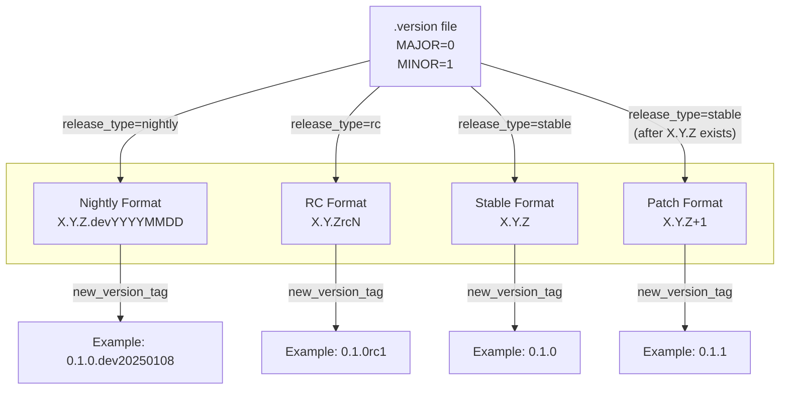
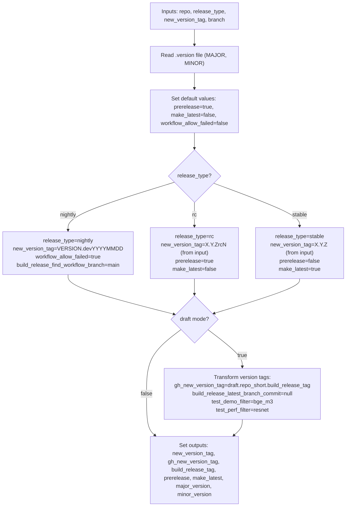
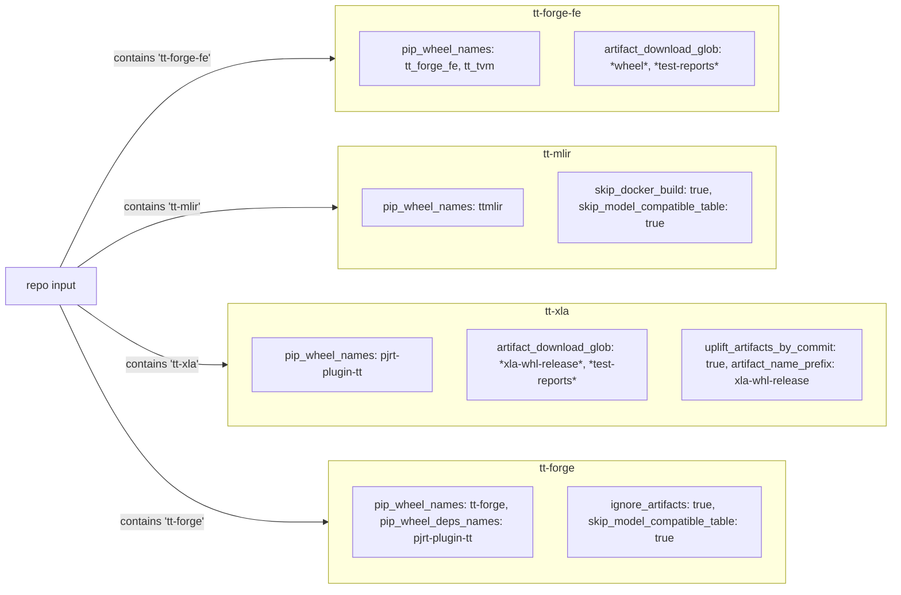
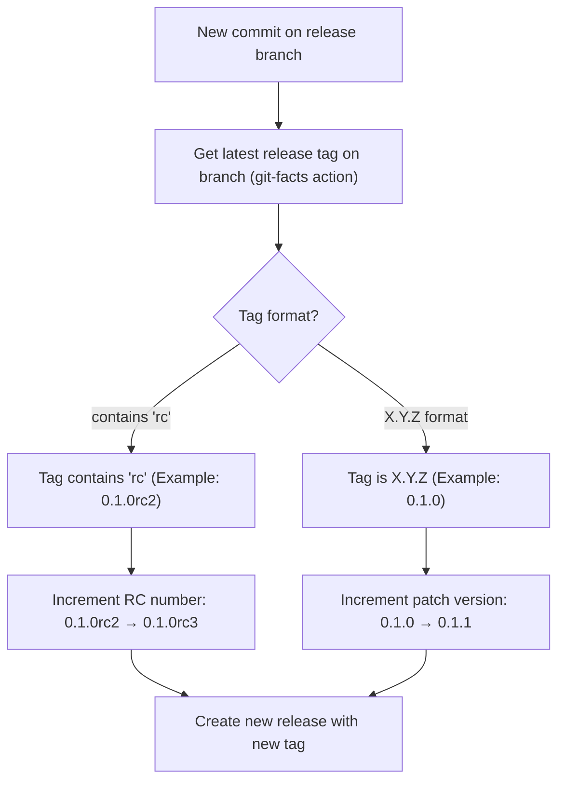
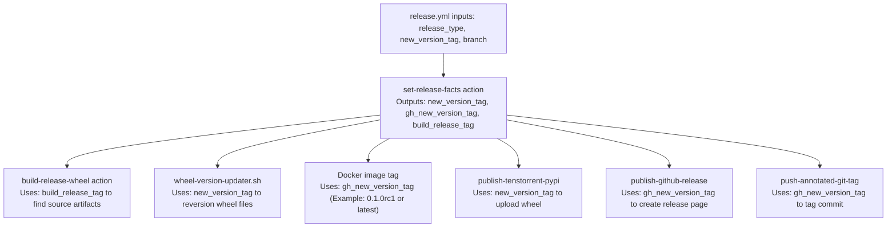

# Release Lifecycle and Versioning

Relevant source files
*   [.github/CODEOWNERS](https://github.com/tenstorrent/tt-forge/blob/6f2d9645/.github/CODEOWNERS)
*   [.github/workflows/pr-main.yml](https://github.com/tenstorrent/tt-forge/blob/6f2d9645/.github/workflows/pr-main.yml)
*   [.github/workflows/schedule-uplift.yml](https://github.com/tenstorrent/tt-forge/blob/6f2d9645/.github/workflows/schedule-uplift.yml)

## Purpose and Scope

This document describes the version numbering scheme and release type lifecycle used across TT-Forge repositories. It covers the four release types (nightly, RC, stable, patch), version tag formats, version progression rules, and the central configuration system that determines version numbers.

The release system is designed to manage a complex MLIR-based compiler stack across multiple repositories, ensuring that development builds (nightly) remain separated from production-ready candidates (RC) and finalized releases (stable).

For information about the orchestration workflows that create these releases, see [Daily Release Orchestration](https://deepwiki.com/tenstorrent/tt-forge/5.2-daily-release-orchestration). For details on the specific build and publish processes, see [Release Workflows](https://deepwiki.com/tenstorrent/tt-forge/5.3-release-workflows).

## Release Types

The TT-Forge release system supports four distinct release types, each serving a different purpose in the software delivery pipeline.

### Release Type Overview

| Release Type | Version Format | Source Branch | Prerelease Status | Update Frequency | Purpose |
| --- | --- | --- | --- | --- | --- |
| **Nightly** | `X.Y.Z.devYYYYMMDD` | `main` | Yes | Daily (automated) | Latest development code for testing |
| **Release Candidate (RC)** | `X.Y.ZrcN` | `release-X.Y` | Yes | On commit (automated) | Pre-release testing and validation |
| **Stable** | `X.Y.Z` | `release-X.Y` | No | Manual promotion | Production-ready release |
| **Patch** | `X.Y.Z+1` | `release-X.Y` | No | On commit (automated) | Bug fixes for stable releases |

Sources: [.github/actions/set-release-facts/action.yaml 202-209](https://github.com/tenstorrent/tt-forge/blob/6f2d9645/.github/actions/set-release-facts/action.yaml#L202-L209)[RELEASE.md 572-590](https://github.com/tenstorrent/tt-forge/blob/6f2d9645/RELEASE.md?plain=1#L572-L590)

### Nightly Releases

Nightly builds are automatically generated from the `main` branch and provide the latest development features. The version format includes a date stamp: `X.Y.Z.devYYYYMMDD`.

**Configuration in set-release-facts:**

Key characteristics:

*   Tagged as GitHub pre-releases (`prerelease="true"`)
*   Not marked as latest (`make_latest="false"`)
*   Tolerates failed workflows (`workflow_allow_failed="true"`)
*   Built from the most recent commit on `main`

Sources: [.github/actions/set-release-facts/action.yaml 205-209](https://github.com/tenstorrent/tt-forge/blob/6f2d9645/.github/actions/set-release-facts/action.yaml#L205-L209)[RELEASE.md 252-253](https://github.com/tenstorrent/tt-forge/blob/6f2d9645/RELEASE.md?plain=1#L252-L253)

### Release Candidates

Release candidates are created on `release-X.Y` branches and follow the format `X.Y.ZrcN`, where N increments with each new commit on the release branch.

**Version progression example:**

*   Initial RC: `0.1.0rc1`
*   After fixes: `0.1.0rc2`
*   After more fixes: `0.1.0rc3`

Key characteristics:

*   Tagged as GitHub pre-releases (`prerelease="true"`)
*   Auto-incremented by `get-release-branches` action
*   Require successful workflow runs on the release branch
*   Can be manually bumped using `bump-version.yml`

Sources: [RELEASE.md 579-583](https://github.com/tenstorrent/tt-forge/blob/6f2d9645/RELEASE.md?plain=1#L579-L583)[RELEASE.md 322-346](https://github.com/tenstorrent/tt-forge/blob/6f2d9645/RELEASE.md?plain=1#L322-L346)

### Stable Releases

Stable releases are promoted from release candidates and use semantic versioning: `X.Y.Z`. The initial stable release on a branch is always `X.Y.0`.

**Configuration in set-release-facts:**

Key characteristics:

*   Not marked as pre-release (`prerelease="false"`)
*   Marked as latest release (`make_latest="true"`)
*   Docker images tagged with `latest`
*   Published to PyPI without pre-release flags

Sources: [.github/actions/set-release-facts/action.yaml 202-204](https://github.com/tenstorrent/tt-forge/blob/6f2d9645/.github/actions/set-release-facts/action.yaml#L202-L204)[RELEASE.md 585-590](https://github.com/tenstorrent/tt-forge/blob/6f2d9645/RELEASE.md?plain=1#L585-L590)

### Patch Releases

Patch releases increment the patch version number (e.g., `0.1.0` → `0.1.1`) and are created automatically when new commits are pushed to a stable release branch.

Key characteristics:

*   Follow same configuration as stable releases
*   Auto-incremented by `get-release-branches` action
*   Maintain stable release status
*   Published as full GitHub releases

Sources: [RELEASE.md 327-332](https://github.com/tenstorrent/tt-forge/blob/6f2d9645/RELEASE.md?plain=1#L327-L332)

## Version Format Specification

### Base Version Source

All version numbers derive from the `.version` file at the repository root, which defines `MAJOR` and `MINOR` version numbers:

Sources: [.github/actions/set-release-facts/action.yaml 140](https://github.com/tenstorrent/tt-forge/blob/6f2d9645/.github/actions/set-release-facts/action.yaml#L140-L140)[.github/actions/set-release-facts/action.yaml 167-169](https://github.com/tenstorrent/tt-forge/blob/6f2d9645/.github/actions/set-release-facts/action.yaml#L167-L169)

### Version Tag Construction

**Title: Version Tag Format Rules by Release Type**

Sources: [.github/actions/set-release-facts/action.yaml 140-212](https://github.com/tenstorrent/tt-forge/blob/6f2d9645/.github/actions/set-release-facts/action.yaml#L140-L212)[RELEASE.md 570-590](https://github.com/tenstorrent/tt-forge/blob/6f2d9645/RELEASE.md?plain=1#L570-L590)




Sources: [.github/actions/set-release-facts/action.yaml:140-212](), [RELEASE.md:570-590]()
```
### Version Tag Variables

The `set-release-facts` action produces three version-related outputs:

| Output Variable | Purpose | Example (RC) | Example (Stable) |
| --- | --- | --- | --- |
| `new_version_tag` | Python wheel version | `0.1.0rc1` | `0.1.0` |
| `gh_new_version_tag` | GitHub release tag | `0.1.0rc1` | `0.1.0` |
| `build_release_tag` | Artifact lookup version | `0.1.0rc1` | `0.1.0` |

**Special case for draft releases:**

*   `gh_new_version_tag`: `draft.{repo_short}.{build_release_tag}`
*   Example: `draft.tt-forge-fe.0.1.0rc1`

Sources: [.github/actions/set-release-facts/action.yaml 46-51](https://github.com/tenstorrent/tt-forge/blob/6f2d9645/.github/actions/set-release-facts/action.yaml#L46-L51)[.github/actions/set-release-facts/action.yaml 211-212](https://github.com/tenstorrent/tt-forge/blob/6f2d9645/.github/actions/set-release-facts/action.yaml#L211-L212)[.github/actions/set-release-facts/action.yaml 256-295](https://github.com/tenstorrent/tt-forge/blob/6f2d9645/.github/actions/set-release-facts/action.yaml#L256-L295)

## Release Lifecycle State Machine

**Title: Release Type Transitions and Version Progression**

Sources: [RELEASE.md 88-155](https://github.com/tenstorrent/tt-forge/blob/6f2d9645/RELEASE.md?plain=1#L88-L155)[.github/actions/set-release-facts/action.yaml 160-209](https://github.com/tenstorrent/tt-forge/blob/6f2d9645/.github/actions/set-release-facts/action.yaml#L160-L209)

## Version Determination Logic

### set-release-facts Action

The `set-release-facts` action is the central configuration system that determines all version-related parameters for a release. It is called at the start of every release workflow.

**Title: set-release-facts Version Determination Flow**

Sources: [.github/actions/set-release-facts/action.yaml 134-371](https://github.com/tenstorrent/tt-forge/blob/6f2d9645/.github/actions/set-release-facts/action.yaml#L134-L371)




Sources: [.github/actions/set-release-facts/action.yaml:134-371]()
```
### Repository-Specific Configuration

The `set-release-facts` action also applies repository-specific defaults:

**Title: Repository-Specific Version Configuration**

Sources: [.github/actions/set-release-facts/action.yaml 216-248](https://github.com/tenstorrent/tt-forge/blob/6f2d9645/.github/actions/set-release-facts/action.yaml#L216-L248)




Sources: [.github/actions/set-release-facts/action.yaml:216-248]()
```
## Version Progression Examples

### Typical Version Timeline

**Timeline showing version progression for a typical release:**

```
Development Phase (main branch):
├─ 0.1.0.dev20250101  ← Nightly build
├─ 0.1.0.dev20250102  ← Nightly build
├─ 0.1.0.dev20250103  ← Nightly build
└─ 0.1.0.dev20250104  ← Nightly build

Release Branch Created (release-0.1):
└─ 0.1.0rc1           ← Initial RC (create-version-branches.yml)

Testing & Fixes Phase:
├─ 0.1.0rc2           ← Fix commit 1 (daily-releaser.yml or bump-version.yml)
├─ 0.1.0rc3           ← Fix commit 2
└─ 0.1.0rc4           ← Fix commit 3

Stable Release:
└─ 0.1.0              ← Promoted from RC4 (promote-stable.yml)

Maintenance Phase:
├─ 0.1.1              ← Patch release (daily-releaser.yml)
├─ 0.1.2              ← Patch release
└─ 0.1.3              ← Patch release
```

Sources: [RELEASE.md 616-624](https://github.com/tenstorrent/tt-forge/blob/6f2d9645/RELEASE.md?plain=1#L616-L624)

### Version Increment Rules

**Title: Version Increment Decision Logic**

Sources: [RELEASE.md 244-250](https://github.com/tenstorrent/tt-forge/blob/6f2d9645/RELEASE.md?plain=1#L244-L250)[RELEASE.md 322-333](https://github.com/tenstorrent/tt-forge/blob/6f2d9645/RELEASE.md?plain=1#L322-L333)




Sources: [RELEASE.md:244-250](), [RELEASE.md:322-333]()
```
## Version Tag Usage Across Workflows

### Version Tags in release.yml

The `release.yml` workflow receives version information from various sources and uses it to coordinate the build, test, and publish phases:

**Title: Version Tag Flow Through release.yml**

Sources: [.github/workflows/release.yml 95-102](https://github.com/tenstorrent/tt-forge/blob/6f2d9645/.github/workflows/release.yml#L95-L102)[.github/workflows/release.yml 140-150](https://github.com/tenstorrent/tt-forge/blob/6f2d9645/.github/workflows/release.yml#L140-L150)[.github/workflows/release.yml 178-183](https://github.com/tenstorrent/tt-forge/blob/6f2d9645/.github/workflows/release.yml#L178-L183)[.github/workflows/release.yml 303-315](https://github.com/tenstorrent/tt-forge/blob/6f2d9645/.github/workflows/release.yml#L303-L315)[.github/workflows/release.yml 329-338](https://github.com/tenstorrent/tt-forge/blob/6f2d9645/.github/workflows/release.yml#L329-L338)[.github/workflows/release.yml 340-353](https://github.com/tenstorrent/tt-forge/blob/6f2d9645/.github/workflows/release.yml#L340-L353)




Sources: [.github/workflows/release.yml:95-102](), [.github/workflows/release.yml:140-150](), [.github/workflows/release.yml:178-183](), [.github/workflows/release.yml:303-315](), [.github/workflows/release.yml:329-338](), [.github/workflows/release.yml:340-353]()
```
### Version Tag Sanitization for Draft Releases

Draft releases receive special version tag handling to prevent conflicts with production releases:

This produces tags like:

*   `draft.tt-mlir.0.1.0` (stable draft)
*   `draft.tt-forge-fe.0.1.0rc1` (RC draft)

Sources: [.github/actions/set-release-facts/action.yaml 256-295](https://github.com/tenstorrent/tt-forge/blob/6f2d9645/.github/actions/set-release-facts/action.yaml#L256-L295)

## Version Number Validation

### Semantic Versioning Compliance

All stable and patch releases follow semantic versioning 2.0.0 ([https://semver.org/](https://semver.org/)):

*   Format: `MAJOR.MINOR.PATCH`
*   Each component is a non-negative integer
*   No leading zeros

RC releases extend semantic versioning with pre-release identifiers:

*   Format: `MAJOR.MINOR.PATCHrcN`
*   RC number N is always a positive integer

Nightly releases use local version identifiers as defined in PEP 440:

*   Format: `MAJOR.MINOR.PATCH.devYYYYMMDD`
*   Compatible with Python package versioning

Sources: [.github/actions/set-release-facts/action.yaml 206](https://github.com/tenstorrent/tt-forge/blob/6f2d9645/.github/actions/set-release-facts/action.yaml#L206-L206)[RELEASE.md 574-590](https://github.com/tenstorrent/tt-forge/blob/6f2d9645/RELEASE.md?plain=1#L574-L590)

### Version Uniqueness

Each version tag must be unique within a repository:

*   The `release.yml` workflow checks for existing releases before creating new ones
*   Draft releases use prefixed tags to avoid collisions
*   Overwrite mode (`overwrite_releases: true`) can bypass uniqueness checks

Sources: [.github/workflows/release.yml 115-135](https://github.com/tenstorrent/tt-forge/blob/6f2d9645/.github/workflows/release.yml#L115-L135)

## Integration with Other Release Components

The versioning system integrates with:

*   **Build System** ([Build System](https://deepwiki.com/tenstorrent/tt-forge/5.4-build-system)): Version tags determine artifact naming and wheel metadata
*   **Documentation Generation** ([Documentation Generation](https://deepwiki.com/tenstorrent/tt-forge/5.5-documentation-generation)): Version tags appear in changelogs and installation instructions
*   **Docker Images** ([Docker Image Building](https://deepwiki.com/tenstorrent/tt-forge/5.4.3-docker-image-building)): Version tags become Docker image tags, with `latest` for stable releases
*   **PyPI Publishing**: Version numbers must comply with PEP 440 for Python package distribution
*   **GitHub Releases**: Version tags become Git tags and release page titles
*   **Submodule Uplifts**: Weekly automation (e.g., `schedule-uplift.yml`) ensures third-party dependencies like `tt-forge-models` are synchronized with the current release cycle [.github/workflows/schedule-uplift.yml 1-8](https://github.com/tenstorrent/tt-forge/blob/6f2d9645/.github/workflows/schedule-uplift.yml#L1-L8)

Sources: [.github/workflows/release.yml 1-391](https://github.com/tenstorrent/tt-forge/blob/6f2d9645/.github/workflows/release.yml#L1-L391)[RELEASE.md 1-628](https://github.com/tenstorrent/tt-forge/blob/6f2d9645/RELEASE.md?plain=1#L1-L628)[.github/workflows/schedule-uplift.yml 4-9](https://github.com/tenstorrent/tt-forge/blob/6f2d9645/.github/workflows/schedule-uplift.yml#L4-L9)

Dismiss
Refresh this wiki

Enter email to refresh
