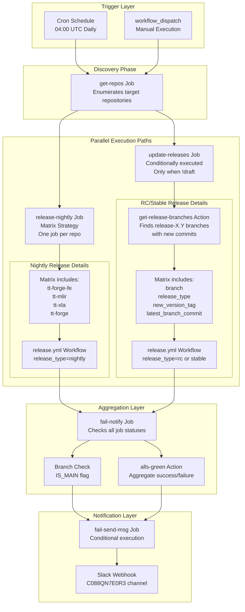
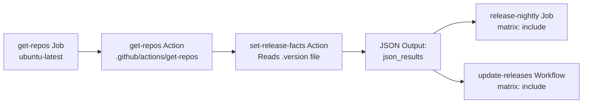
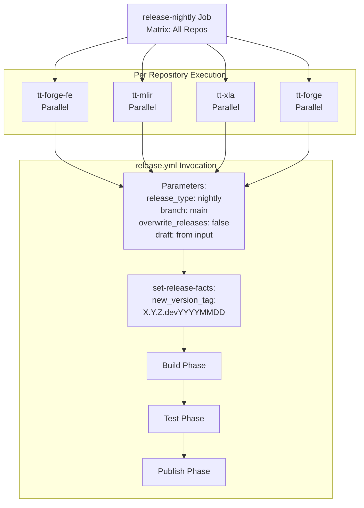
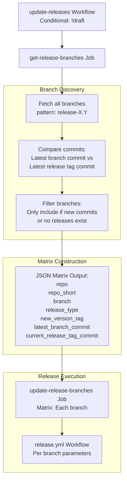
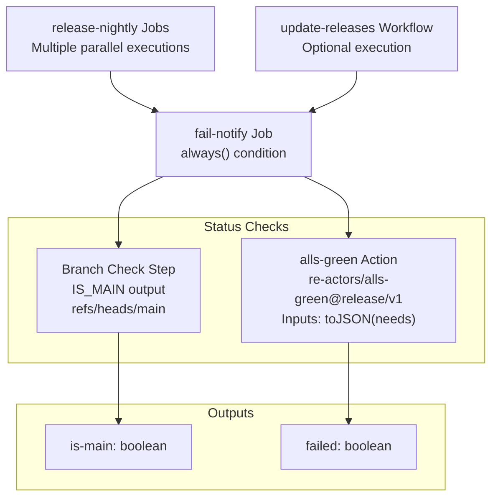
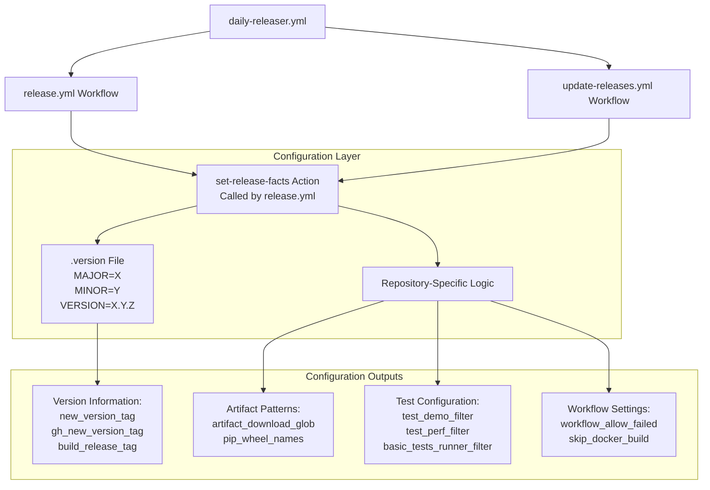
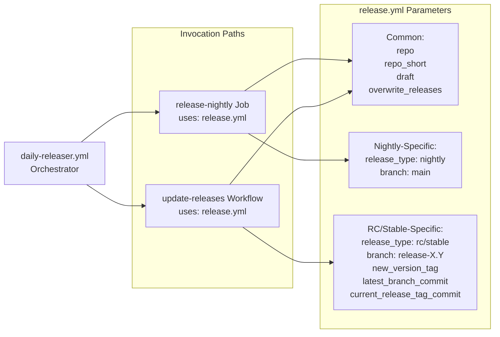

# Daily Release Orchestration

Relevant source files
*   [.github/CODEOWNERS](https://github.com/tenstorrent/tt-forge/blob/6f2d9645/.github/CODEOWNERS)
*   [.github/workflows/pr-main.yml](https://github.com/tenstorrent/tt-forge/blob/6f2d9645/.github/workflows/pr-main.yml)
*   [.github/workflows/schedule-uplift.yml](https://github.com/tenstorrent/tt-forge/blob/6f2d9645/.github/workflows/schedule-uplift.yml)

## Purpose and Scope

This document describes the `daily-releaser.yml` workflow, which serves as the central orchestrator for automated releases across the TT-Forge ecosystem. This workflow runs on a daily schedule to coordinate nightly builds from the main branch and manage release candidate (RC) and stable releases from release branches.

For details on the release lifecycle and version progression, see [Release Lifecycle and Versioning](https://deepwiki.com/tenstorrent/tt-forge/5.1-release-lifecycle-and-versioning). For the internal workings of individual release workflows, see [Release Workflows](https://deepwiki.com/tenstorrent/tt-forge/5.3-release-workflows).

**Sources:**[.github/workflows/daily-releaser.yml 1-136](https://github.com/tenstorrent/tt-forge/blob/6f2d9645/.github/workflows/daily-releaser.yml#L1-L136)

* * *

## Orchestration Architecture

The daily releaser implements a multi-repository, multi-track release orchestration system. It operates as a coordinator that spawns parallel release workflows across all managed repositories.

**Orchestration Flow:**

1.   **Trigger Layer**: Workflow activated via cron schedule or manual dispatch [.github/workflows/daily-releaser.yml 4-9](https://github.com/tenstorrent/tt-forge/blob/6f2d9645/.github/workflows/daily-releaser.yml#L4-L9)
2.   **Discovery Phase**: `get-repos` job identifies all repositories to process [.github/workflows/daily-releaser.yml 56-66](https://github.com/tenstorrent/tt-forge/blob/6f2d9645/.github/workflows/daily-releaser.yml#L56-L66)
3.   **Parallel Execution**: Two independent paths execute simultaneously: 
    *   **Nightly Path**: Always runs for all repositories [.github/workflows/daily-releaser.yml 84-98](https://github.com/tenstorrent/tt-forge/blob/6f2d9645/.github/workflows/daily-releaser.yml#L84-L98)
    *   **RC/Stable Path**: Conditionally runs (skipped in draft mode) [.github/workflows/daily-releaser.yml 68-82](https://github.com/tenstorrent/tt-forge/blob/6f2d9645/.github/workflows/daily-releaser.yml#L68-L82)

4.   **Aggregation**: `fail-notify` job waits for all parallel jobs to complete [.github/workflows/daily-releaser.yml 101-118](https://github.com/tenstorrent/tt-forge/blob/6f2d9645/.github/workflows/daily-releaser.yml#L101-L118)
5.   **Notification**: Slack alert sent only for main branch scheduled failures [.github/workflows/daily-releaser.yml 119-136](https://github.com/tenstorrent/tt-forge/blob/6f2d9645/.github/workflows/daily-releaser.yml#L119-L136)

**Sources:**[.github/workflows/daily-releaser.yml 4-136](https://github.com/tenstorrent/tt-forge/blob/6f2d9645/.github/workflows/daily-releaser.yml#L4-L136)

* * *




**Orchestration Flow:**
1. **Trigger Layer**: Workflow activated via cron schedule or manual dispatch [.github/workflows/daily-releaser.yml:4-9]().
2. **Discovery Phase**: `get-repos` job identifies all repositories to process [.github/workflows/daily-releaser.yml:56-66]().
3. **Parallel Execution**: Two independent paths execute simultaneously:
   - **Nightly Path**: Always runs for all repositories [.github/workflows/daily-releaser.yml:84-98]().
   - **RC/Stable Path**: Conditionally runs (skipped in draft mode) [.github/workflows/daily-releaser.yml:68-82]().
4. **Aggregation**: `fail-notify` job waits for all parallel jobs to complete [.github/workflows/daily-releaser.yml:101-118]().
5. **Notification**: Slack alert sent only for main branch scheduled failures [.github/workflows/daily-releaser.yml:119-136]().
```
## Trigger Mechanisms

The daily releaser supports two trigger modes with different operational characteristics.

### Scheduled Execution

The primary trigger is a daily cron schedule:

**Execution Time:** 04:00 UTC daily

**Operational Mode:** Production mode with full release creation

**Failure Handling:** Slack notifications sent to engineering channel

**Sources:**[.github/workflows/daily-releaser.yml 4-5](https://github.com/tenstorrent/tt-forge/blob/6f2d9645/.github/workflows/daily-releaser.yml#L4-L5)

### Manual Dispatch

Developers can manually trigger the workflow via GitHub Actions UI with configurable parameters:

| Parameter | Type | Default | Description |
| --- | --- | --- | --- |
| `draft` | boolean | `true` | Enables testing mode without creating real releases |
| `delete-drafts` | boolean | `false` | Cleans up draft releases from previous test runs |
| `repo` | string | `''` | Limits execution to a single repository (e.g., `tt-forge-fe`) |
| `overwrite_releases` | boolean | `false` | Forces recreation of existing releases |

**Draft Mode Behavior:**

*   Creates releases in `tenstorrent/tt-forge` repository instead of target repositories.
*   Tags releases with `draft.{repo}.{version}` prefix.
*   Skips the `update-releases` job entirely [.github/workflows/daily-releaser.yml 69](https://github.com/tenstorrent/tt-forge/blob/6f2d9645/.github/workflows/daily-releaser.yml#L69-L69)
*   Prevents Slack notifications.
*   Useful for CI/CD pipeline testing.

**Sources:**[.github/workflows/daily-releaser.yml 6-44](https://github.com/tenstorrent/tt-forge/blob/6f2d9645/.github/workflows/daily-releaser.yml#L6-L44)[.github/workflows/daily-releaser.yml 69](https://github.com/tenstorrent/tt-forge/blob/6f2d9645/.github/workflows/daily-releaser.yml#L69-L69)

* * *

## Repository Discovery and Enumeration

The `get-repos` job is responsible for identifying which repositories should be processed by the daily releaser.

The action reads the repository list from `set-release-facts` and produces a JSON matrix.

**Repository Filtering:**

*   If `inputs.repo` is specified, only that repository is included [.github/workflows/daily-releaser.yml 61](https://github.com/tenstorrent/tt-forge/blob/6f2d9645/.github/workflows/daily-releaser.yml#L61-L61)
*   Otherwise, all repositories defined in `set-release-facts` are processed.
*   The list is defined in the configuration within the `set-release-facts` action.

**Matrix Strategy:** The JSON output is consumed by downstream jobs using GitHub Actions matrix strategy:

**Sources:**[.github/workflows/daily-releaser.yml 56-66](https://github.com/tenstorrent/tt-forge/blob/6f2d9645/.github/workflows/daily-releaser.yml#L56-L66)[.github/workflows/daily-releaser.yml 88-90](https://github.com/tenstorrent/tt-forge/blob/6f2d9645/.github/workflows/daily-releaser.yml#L88-L90)

* * *




The action reads the repository list from `set-release-facts` and produces a JSON matrix.

**Repository Filtering:**
- If `inputs.repo` is specified, only that repository is included [.github/workflows/daily-releaser.yml:61]().
- Otherwise, all repositories defined in `set-release-facts` are processed.
- The list is defined in the configuration within the `set-release-facts` action.

**Matrix Strategy:**
The JSON output is consumed by downstream jobs using GitHub Actions matrix strategy:

```yaml
strategy:
  fail-fast: false
  matrix:
    include: ${{ fromJson(needs.get-repos.outputs.json_results) }}
```
## Dual Release Paths

The daily releaser executes two independent release paths in parallel, each serving a different purpose in the release lifecycle.

### Nightly Release Path

The `release-nightly` job creates daily development releases from the main branch for all repositories.

**Characteristics:**

*   **Execution:** Always runs, regardless of draft mode [.github/workflows/daily-releaser.yml 84](https://github.com/tenstorrent/tt-forge/blob/6f2d9645/.github/workflows/daily-releaser.yml#L84-L84)
*   **Source Branch:**`main` branch for all repositories [.github/workflows/daily-releaser.yml 95](https://github.com/tenstorrent/tt-forge/blob/6f2d9645/.github/workflows/daily-releaser.yml#L95-L95)
*   **Version Format:**`X.Y.Z.devYYYYMMDD` (e.g., `0.1.0.dev20240315`).
*   **Overwrite Policy:** Creates new releases daily; checks for existing releases.
*   **Failure Handling:** Allows workflow failures when finding build artifacts.

**Sources:**[.github/workflows/daily-releaser.yml 84-98](https://github.com/tenstorrent/tt-forge/blob/6f2d9645/.github/workflows/daily-releaser.yml#L84-L98)




**Characteristics:**
- **Execution:** Always runs, regardless of draft mode [.github/workflows/daily-releaser.yml:84]().
- **Source Branch:** `main` branch for all repositories [.github/workflows/daily-releaser.yml:95]().
- **Version Format:** `X.Y.Z.devYYYYMMDD` (e.g., `0.1.0.dev20240315`).
- **Overwrite Policy:** Creates new releases daily; checks for existing releases.
- **Failure Handling:** Allows workflow failures when finding build artifacts.
```
### RC and Stable Update Path

The `update-releases` job manages release branches by creating new RC versions or promoting to stable.

**Discovery Logic:** The `get-release-branches` action performs sophisticated analysis:

1.   **Branch Enumeration:** Finds all branches matching `release-X.Y` pattern.
2.   **Commit Comparison:** For each branch, determines if new commits exist since last release.
3.   **Release Type Determination:**
    *   If no releases exist for the branch → Create `rc1`.
    *   If `rcN` releases exist → Create `rcN+1`.
    *   If stable release exists and new commits → Create patch release.

4.   **Skipping Logic:** Branches with no new commits are excluded from the matrix.

**Conditional Execution:**

The entire path is skipped when `draft=true`, preventing accidental RC/stable releases during testing [.github/workflows/daily-releaser.yml 69](https://github.com/tenstorrent/tt-forge/blob/6f2d9645/.github/workflows/daily-releaser.yml#L69-L69)

**Sources:**[.github/workflows/daily-releaser.yml 68-82](https://github.com/tenstorrent/tt-forge/blob/6f2d9645/.github/workflows/daily-releaser.yml#L68-L82)

* * *




**Discovery Logic:**
The `get-release-branches` action performs sophisticated analysis:
1. **Branch Enumeration:** Finds all branches matching `release-X.Y` pattern.
2. **Commit Comparison:** For each branch, determines if new commits exist since last release.
3. **Release Type Determination:**
   - If no releases exist for the branch → Create `rc1`.
   - If `rcN` releases exist → Create `rcN+1`. 
   - If stable release exists and new commits → Create patch release.
4. **Skipping Logic:** Branches with no new commits are excluded from the matrix.

**Conditional Execution:**
```yaml
if: ${{ !inputs.draft }}
```
The entire path is skipped when `draft=true`, preventing accidental RC/stable releases during testing [.github/workflows/daily-releaser.yml:69]().
```
## Failure Handling and Notification System

The daily releaser implements a sophisticated failure detection and notification system to alert engineers of release failures.

### Failure Aggregation

The `fail-notify` job aggregates the status of all parallel release jobs:

**Execution Characteristics:**

*   **Trigger Condition:**`if: always()` - Runs regardless of job failures [.github/workflows/daily-releaser.yml 102](https://github.com/tenstorrent/tt-forge/blob/6f2d9645/.github/workflows/daily-releaser.yml#L102-L102)
*   **Dependency Analysis:** Waits for `release-nightly`[.github/workflows/daily-releaser.yml 101](https://github.com/tenstorrent/tt-forge/blob/6f2d9645/.github/workflows/daily-releaser.yml#L101-L101)
*   **Status Detection:** Uses `re-actors/alls-green@release/v1` action to check job outcomes [.github/workflows/daily-releaser.yml 115-117](https://github.com/tenstorrent/tt-forge/blob/6f2d9645/.github/workflows/daily-releaser.yml#L115-L117)

**Branch Detection Logic:**

[.github/workflows/daily-releaser.yml 108-111](https://github.com/tenstorrent/tt-forge/blob/6f2d9645/.github/workflows/daily-releaser.yml#L108-L111)

**Sources:**[.github/workflows/daily-releaser.yml 101-118](https://github.com/tenstorrent/tt-forge/blob/6f2d9645/.github/workflows/daily-releaser.yml#L101-L118)




**Execution Characteristics:**
- **Trigger Condition:** `if: always()` - Runs regardless of job failures [.github/workflows/daily-releaser.yml:102]().
- **Dependency Analysis:** Waits for `release-nightly` [.github/workflows/daily-releaser.yml:101]().
- **Status Detection:** Uses `re-actors/alls-green@release/v1` action to check job outcomes [.github/workflows/daily-releaser.yml:115-117]().

**Branch Detection Logic:**
```bash
IS_MAIN=$(if [ '${{ github.ref }}' == 'refs/heads/main' ]; then echo true; else echo false; fi)
```
[.github/workflows/daily-releaser.yml:108-111]()
```
### Notification Dispatch

The `fail-send-msg` job conditionally sends Slack notifications based on multiple criteria:

**Notification Criteria:** All three conditions must be true [.github/workflows/daily-releaser.yml 124](https://github.com/tenstorrent/tt-forge/blob/6f2d9645/.github/workflows/daily-releaser.yml#L124-L124):

1.   `failed == 'true'` - At least one release job failed.
2.   `is-main == 'true'` - Running on main branch (not a fork or feature branch).
3.   `event_name == 'schedule'` - Triggered by cron, not manual dispatch.

**Slack Integration:**

*   **Channel:**`C088QN7E0R3` (engineering notifications channel) [.github/workflows/daily-releaser.yml 132](https://github.com/tenstorrent/tt-forge/blob/6f2d9645/.github/workflows/daily-releaser.yml#L132-L132)
*   **Webhook:** Stored in `SLACK_NIGHTLY_FAIL` secret [.github/workflows/daily-releaser.yml 135](https://github.com/tenstorrent/tt-forge/blob/6f2d9645/.github/workflows/daily-releaser.yml#L135-L135)

**Sources:**[.github/workflows/daily-releaser.yml 119-136](https://github.com/tenstorrent/tt-forge/blob/6f2d9645/.github/workflows/daily-releaser.yml#L119-L136)

* * *

## Configuration Management Through set-release-facts

The `set-release-facts` action serves as the central configuration system for all release operations. The daily releaser invokes this action implicitly through the workflows it calls.

### Configuration Propagation



### Draft Mode Overrides

When `draft=true`, the configuration applies testing-specific overrides:

*   Limits tests to single representative cases.
*   Restricts execution to specific hardware runners.
*   Prefixes version tags with `draft.{repo}.` to prevent conflicts.

**Sources:**[.github/workflows/daily-releaser.yml 6-14](https://github.com/tenstorrent/tt-forge/blob/6f2d9645/.github/workflows/daily-releaser.yml#L6-L14)[.github/workflows/daily-releaser.yml 92](https://github.com/tenstorrent/tt-forge/blob/6f2d9645/.github/workflows/daily-releaser.yml#L92-L92)

* * *

## Execution Timeline and Resource Utilization

The daily releaser's execution characteristics vary based on operational mode and release complexity.

### Typical Execution Duration

| Phase | Duration | Description |
| --- | --- | --- |
| Repository Discovery | 1-2 minutes | `get-repos` job execution |
| Nightly Releases (Parallel) | 60-90 minutes | All repositories build simultaneously |
| RC/Stable Updates (Parallel) | 30-120 minutes | Variable based on branch count |
| Failure Aggregation | < 1 minute | Status check and notification |
| **Total (Scheduled Run)** | **90-120 minutes** | Typical daily execution |

### Parallelization Strategy

The daily releaser maximizes throughput through GitHub Actions matrix parallelization:

**Parallel Execution:**

*   **Nightly Path:** 4 repositories build simultaneously (tt-forge-fe, tt-mlir, tt-xla, tt-forge) [.github/workflows/daily-releaser.yml 88-90](https://github.com/tenstorrent/tt-forge/blob/6f2d9645/.github/workflows/daily-releaser.yml#L88-L90)
*   **Failure Isolation:**`fail-fast: false` ensures one repository's failure doesn't cancel others [.github/workflows/daily-releaser.yml 87](https://github.com/tenstorrent/tt-forge/blob/6f2d9645/.github/workflows/daily-releaser.yml#L87-L87)

**Sources:**[.github/workflows/daily-releaser.yml 84-98](https://github.com/tenstorrent/tt-forge/blob/6f2d9645/.github/workflows/daily-releaser.yml#L84-L98)

* * *

## Integration with Release Workflow

The daily releaser serves as an orchestration layer that invokes the core `release.yml` workflow with different parameters for each release type.

### Workflow Invocation Contract




**Nightly Release Invocation:**
```yaml
uses: ./.github/workflows/release.yml
with:
  draft: ${{ inputs.draft || false }}
  repo: ${{ matrix.repo }}
  overwrite_releases: ${{ inputs.overwrite_releases || false }}
  release_type: nightly
  repo_short: ${{ matrix.repo_short }}
```
[.github/workflows/daily-releaser.yml:91-98]()
```

**Nightly Release Invocation:**

[.github/workflows/daily-releaser.yml 91-98](https://github.com/tenstorrent/tt-forge/blob/6f2d9645/.github/workflows/daily-releaser.yml#L91-L98)

**Sources:**[.github/workflows/daily-releaser.yml 84-98](https://github.com/tenstorrent/tt-forge/blob/6f2d9645/.github/workflows/daily-releaser.yml#L84-L98)

Dismiss
Refresh this wiki

Enter email to refresh
