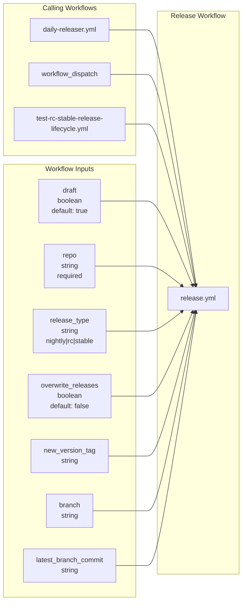
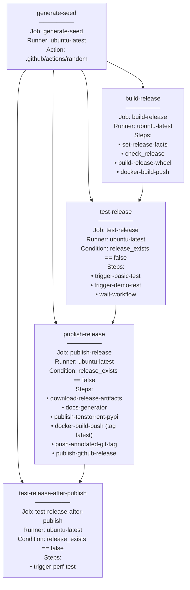
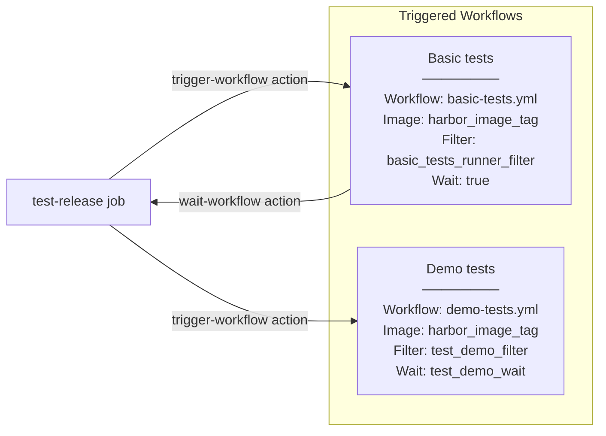
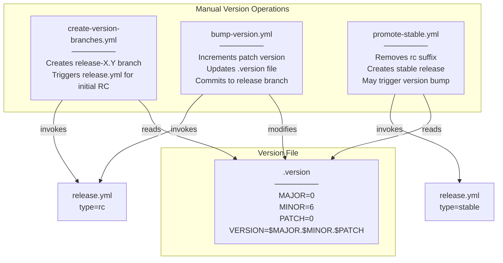
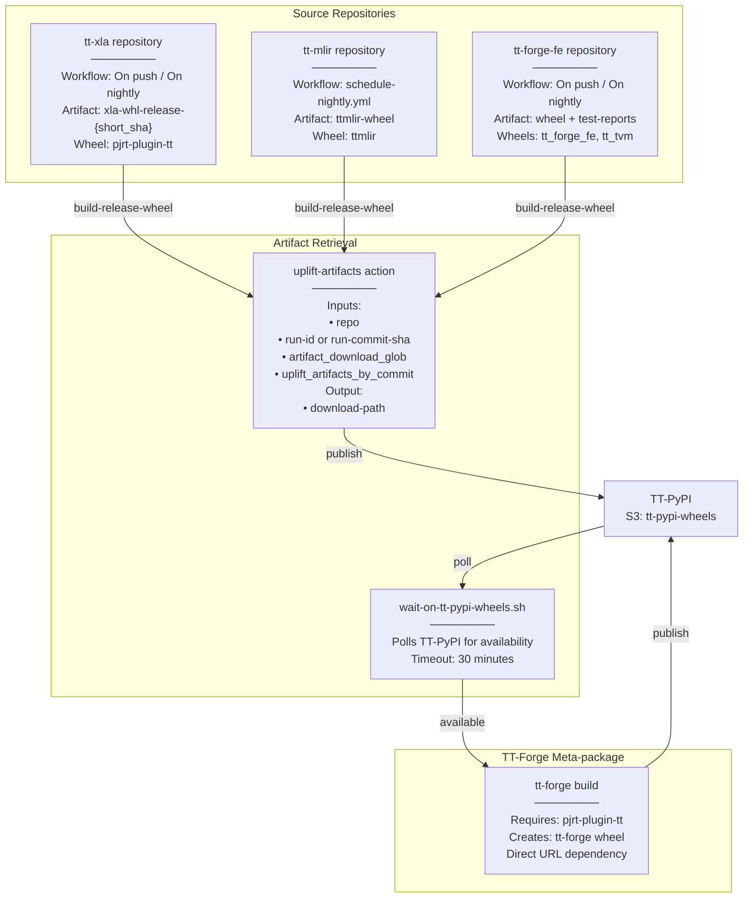
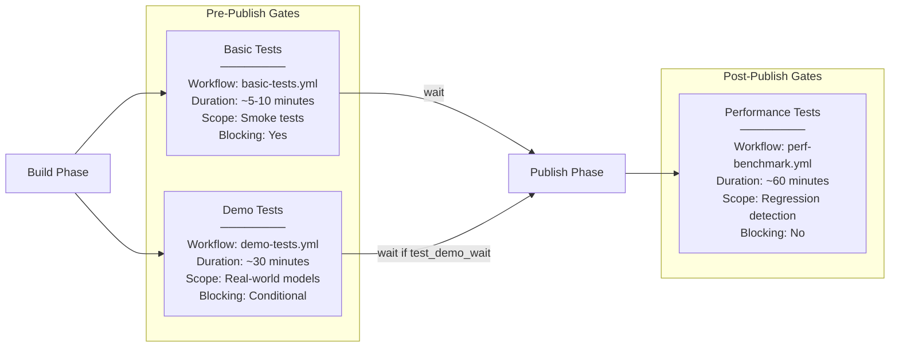

# Release Workflows

Relevant source files
*   [.github/CODEOWNERS](https://github.com/tenstorrent/tt-forge/blob/6f2d9645/.github/CODEOWNERS)
*   [.github/actions/download-artifact/action.yaml](https://github.com/tenstorrent/tt-forge/blob/6f2d9645/.github/actions/download-artifact/action.yaml)
*   [.github/workflows/community-issue-tagging.yml](https://github.com/tenstorrent/tt-forge/blob/6f2d9645/.github/workflows/community-issue-tagging.yml)
*   [.github/workflows/download-artifact-test.yml](https://github.com/tenstorrent/tt-forge/blob/6f2d9645/.github/workflows/download-artifact-test.yml)
*   [.github/workflows/pr-main.yml](https://github.com/tenstorrent/tt-forge/blob/6f2d9645/.github/workflows/pr-main.yml)
*   [.github/workflows/schedule-uplift.yml](https://github.com/tenstorrent/tt-forge/blob/6f2d9645/.github/workflows/schedule-uplift.yml)

## Purpose and Scope

This page documents the core release workflows used to build, test, and publish releases for the TT-Forge ecosystem. The primary workflow is `release.yml`, which implements a three-phase pipeline: build → test → publish. This page covers the workflow structure, job dependencies, and integration points. For information about release types and version progression, see [Release Lifecycle and Versioning](https://deepwiki.com/tenstorrent/tt-forge/5.1-release-lifecycle-and-versioning). For orchestration across all repositories, see [Daily Release Orchestration](https://deepwiki.com/tenstorrent/tt-forge/5.2-daily-release-orchestration). For detailed configuration mechanics, see [set-release-facts Configuration System](https://deepwiki.com/tenstorrent/tt-forge/5.3.3-set-release-facts-configuration-system).

## Release Workflow Overview

The `release.yml` workflow is the central component of the release system, invoked by `daily-releaser.yml` for each repository that has new commits. It handles four repository types: `tt-forge-fe`, `tt-mlir`, `tt-xla`, and `tt-forge`, each with distinct artifact types and testing requirements.

The workflow supports three release types (`nightly`, `rc`, `stable`) and can be invoked in draft mode for integration testing. All releases follow the same three-phase pipeline, with conditional execution based on whether a release already exists.

### Workflow Inputs and Triggers

[.github/workflows/release.yml 3-55](https://github.com/tenstorrent/tt-forge/blob/6f2d9645/.github/workflows/release.yml#L3-L55)

**Sources:**[.github/workflows/release.yml 3-55](https://github.com/tenstorrent/tt-forge/blob/6f2d9645/.github/workflows/release.yml#L3-L55)



## Workflow Job Structure

The `release.yml` workflow contains four jobs that execute sequentially with conditional gates. The workflow uses a random seed for artifact uniqueness and implements existence checks to avoid redundant builds.

### Job Dependency Graph

**Sources:**[.github/workflows/release.yml 65-390](https://github.com/tenstorrent/tt-forge/blob/6f2d9645/.github/workflows/release.yml#L65-L390)



### Build Phase

The `build-release` job is responsible for creating Python wheels and Docker images. It performs existence checks to avoid redundant work and outputs artifact IDs for downstream jobs.

[.github/workflows/release.yml 78-184](https://github.com/tenstorrent/tt-forge/blob/6f2d9645/.github/workflows/release.yml#L78-L184)

**Key Steps:**

1.   **set-release-facts**: Centralizes all configuration based on repository and release type. See [set-release-facts Configuration System](https://deepwiki.com/tenstorrent/tt-forge/5.3.3-set-release-facts-configuration-system) for details.

2.   **Check if release exists**: Uses `.github/scripts/check_release.sh` to query GitHub API for existing releases. If `overwrite_releases` is false and release exists, workflow exits early.

3.   **build-release-wheel**: Invokes `.github/actions/build-release-wheel` to either:

    *   Build Python wheels from source for `tt-forge`
    *   Uplift artifacts from dependency repositories for other repos

4.   **Docker builds**: Creates base Python image and slim image with wheels:

    *   Base image: `ghcr.io/tenstorrent/forge-ubuntu-22-04-py3-11`
    *   Slim image: `ghcr.io/tenstorrent/{repo_short}-slim:{gh_new_version_tag}`

**Outputs:**

| Output | Description |
| --- | --- |
| `release-artifacts-id` | GitHub Actions artifact ID for wheels |
| `release_exists` | Boolean indicating if release already exists |
| `target_commit` | Git commit SHA being released |
| `harbor_image_tag` | Internal Harbor registry image tag |
| `image_tag` | GHCR image tag |
| `workflow_run_status_symbol` | Status symbol (✅/❌) from build workflow |
| `workflow_run_url` | URL to source workflow run |

**Sources:**[.github/workflows/release.yml 78-184](https://github.com/tenstorrent/tt-forge/blob/6f2d9645/.github/workflows/release.yml#L78-L184)

### Test Phase

The `test-release` job triggers parallel test workflows and waits for basic tests to complete before proceeding. Demo tests run asynchronously unless `test_demo_wait` is true.

[.github/workflows/release.yml 185-256](https://github.com/tenstorrent/tt-forge/blob/6f2d9645/.github/workflows/release.yml#L185-L256)

**Test Workflow Parameters:**

| Workflow | Parameters |
| --- | --- |
| `basic-tests.yml` | `docker-image`, `project-filter`, `runner-filter` |
| `demo-tests.yml` | `docker-image`, `project-filter`, `test-filter` |

The `trigger-workflow` action (`.github/actions/trigger-workflow`) starts the workflow and optionally waits for completion. The `wait-workflow` action (`.github/actions/wait-workflow`) blocks until specified tests complete.

**Sources:**[.github/workflows/release.yml 185-256](https://github.com/tenstorrent/tt-forge/blob/6f2d9645/.github/workflows/release.yml#L185-L256)




**Test Workflow Parameters:**

| Workflow | Parameters |
|----------|-----------|
| `basic-tests.yml` | `docker-image`, `project-filter`, `runner-filter` |
| `demo-tests.yml` | `docker-image`, `project-filter`, `test-filter` |

The `trigger-workflow` action (`.github/actions/trigger-workflow`) starts the workflow and optionally waits for completion. The `wait-workflow` action (`.github/actions/wait-workflow`) blocks until specified tests complete.
```
### Publish Phase

The `publish-release` job performs final artifact distribution and release creation only after tests pass.

[.github/workflows/release.yml 257-353](https://github.com/tenstorrent/tt-forge/blob/6f2d9645/.github/workflows/release.yml#L257-L353)

**Publishing Steps:**

1.   **Download Release Artifacts**: Retrieves wheels from `build-release` job using artifact ID via `.github/actions/download-artifact`[.github/workflows/release.yml 277-282](https://github.com/tenstorrent/tt-forge/blob/6f2d9645/.github/workflows/release.yml#L277-L282)

2.   **Generate docs**: Creates changelog and README using `.github/actions/docs-generator`

    *   Aggregates git log commits between releases
    *   Generates installation instructions
    *   Creates model compatibility table (unless `skip_model_compatible_table == true`) [.github/workflows/release.yml 284-301](https://github.com/tenstorrent/tt-forge/blob/6f2d9645/.github/workflows/release.yml#L284-L301)

3.   **Publish to TT-PyPI**: Uploads wheels to S3-backed internal PyPI using `.github/actions/publish-tenstorrent-pypi`

    *   Skipped for draft releases
    *   Uploads to `s3://{bucket}/simple/{package_name}/`[.github/workflows/release.yml 303-315](https://github.com/tenstorrent/tt-forge/blob/6f2d9645/.github/workflows/release.yml#L303-L315)

4.   **Tag Docker image as latest**: For stable releases, retags slim image with `latest` tag [.github/workflows/release.yml 318-327](https://github.com/tenstorrent/tt-forge/blob/6f2d9645/.github/workflows/release.yml#L318-L327)

5.   **Push annotated Git tag**: Creates GPG-signed Git tag using `.github/actions/push-annotated-git-tag`

    *   Skipped for nightly draft releases
    *   Uses `TT_FORGE_RELEASER` token for cross-repo tagging [.github/workflows/release.yml 329-338](https://github.com/tenstorrent/tt-forge/blob/6f2d9645/.github/workflows/release.yml#L329-L338)

6.   **Publish GitHub Release**: Creates GitHub release page using `.github/actions/publish-github-release`

    *   Attaches wheel artifacts
    *   Includes generated changelog
    *   Marks as prerelease for RC/nightly
    *   Marks as latest for stable releases [.github/workflows/release.yml 340-352](https://github.com/tenstorrent/tt-forge/blob/6f2d9645/.github/workflows/release.yml#L340-L352)

**Sources:**[.github/workflows/release.yml 257-353](https://github.com/tenstorrent/tt-forge/blob/6f2d9645/.github/workflows/release.yml#L257-L353)

### Post-Publish Testing

The `test-release-after-publish` job triggers performance benchmarks after wheels are published to PyPI. This ensures benchmarks test the actual published artifacts.

[.github/workflows/release.yml 357-390](https://github.com/tenstorrent/tt-forge/blob/6f2d9645/.github/workflows/release.yml#L357-L390)

Performance tests are only triggered when:

*   `skip_docker_build == false`
*   `test_perf == true` (currently only `tt-xla`)

This job was moved after publish to work around a dependency issue documented in [#170](https://github.com/tenstorrent/tt-forge/blob/6f2d9645/#170)

**Sources:**[.github/workflows/release.yml 357-390](https://github.com/tenstorrent/tt-forge/blob/6f2d9645/.github/workflows/release.yml#L357-L390)

## Related Release Management Workflows

Several auxiliary workflows complement `release.yml` for version management and testing.

### Workflow Catalog

| Workflow | Purpose | Trigger |
| --- | --- | --- |
| `daily-releaser.yml` | Orchestrates nightly and RC/stable releases across all repos | Cron, manual |
| `update-releases.yml` | Manages RC/stable version progression | Called by daily-releaser |
| `create-version-branches.yml` | Creates `release-X.Y` branches | Manual dispatch |
| `bump-version.yml` | Increments version numbers in branches | Manual dispatch |
| `promote-stable.yml` | Promotes RC to stable | Manual dispatch |
| `test-rc-stable-release-lifecycle.yml` | Integration tests for release process | Pull request |
| `schedule-uplift.yml` | Automates weekly uplift of `tt_forge_models` submodule | Cron: `0 8 * * 6` |

**Sources:**[.github/workflows/schedule-uplift.yml 4-9](https://github.com/tenstorrent/tt-forge/blob/6f2d9645/.github/workflows/schedule-uplift.yml#L4-L9) Context from high-level diagrams

### Version Management Workflows

**Sources:** Context from high-level diagrams, [.version 1-4](https://github.com/tenstorrent/tt-forge/blob/6f2d9645/.version#L1-L4)



## Artifact Flow and Dependencies

The release system manages complex artifact dependencies across multiple repositories. The `tt-forge` meta-package depends on `pjrt-plugin-tt` from `tt-xla`, requiring careful coordination.

### Cross-Repository Artifact Flow

**Sources:**[.github/actions/uplift-artifacts/action.yml 1-98](https://github.com/tenstorrent/tt-forge/blob/6f2d9645/.github/actions/uplift-artifacts/action.yml#L1-L98) Context from high-level diagrams



### Download Artifact Action

The system uses a custom `download-artifact` composite action to handle artifact retrieval with robust error handling.

[.github/actions/download-artifact/action.yaml 1-118](https://github.com/tenstorrent/tt-forge/blob/6f2d9645/.github/actions/download-artifact/action.yaml#L1-L118)

**Key Features:**

*   **Retry Logic**: Automatically retries downloads up to `retry_count` times (default 3) with a configurable `retry_wait` (default 10s) [.github/actions/download-artifact/action.yaml 22-29](https://github.com/tenstorrent/tt-forge/blob/6f2d9645/.github/actions/download-artifact/action.yaml#L22-L29)
*   **Automatic Extraction**: Detects and extracts `.tar` and `.tar.zst` (zstd) compressed files automatically [.github/actions/download-artifact/action.yaml 81-94](https://github.com/tenstorrent/tt-forge/blob/6f2d9645/.github/actions/download-artifact/action.yaml#L81-L94)
*   **Security Validation**: Ensures the download path is within the `${GITHUB_WORKSPACE}` to prevent malicious path traversal [.github/actions/download-artifact/action.yaml 58-61](https://github.com/tenstorrent/tt-forge/blob/6f2d9645/.github/actions/download-artifact/action.yaml#L58-L61)

**Sources:**[.github/actions/download-artifact/action.yaml 1-118](https://github.com/tenstorrent/tt-forge/blob/6f2d9645/.github/actions/download-artifact/action.yaml#L1-L118)

### Uplift Artifacts Action

The `uplift-artifacts` action retrieves build artifacts from dependency repositories, supporting two modes:

**Mode 1: By Run ID** (default)

*   Searches for artifacts from a specific workflow run
*   Used for most repositories

**Mode 2: By Commit SHA** (`uplift_artifacts_by_commit == true`)

*   Searches for artifacts by commit SHA in artifact name
*   Used for `tt-xla` to enable reusing cached builds
*   Artifact name pattern: `{artifact_name_prefix}-{short_sha}`

[.github/actions/uplift-artifacts/action.yml 46-64](https://github.com/tenstorrent/tt-forge/blob/6f2d9645/.github/actions/uplift-artifacts/action.yml#L46-L64)

The action performs cleanup operations to reduce artifact size:

*   Extracts `.tar`, `.tar.gz`, `.zip` archives
*   Deletes files matching `artifact_cleanup_file_glob`
*   Deletes folders matching `artifact_cleanup_folder_glob`

[.github/actions/uplift-artifacts/action.yml 76-97](https://github.com/tenstorrent/tt-forge/blob/6f2d9645/.github/actions/uplift-artifacts/action.yml#L76-L97)

**Sources:**[.github/actions/uplift-artifacts/action.yml 1-98](https://github.com/tenstorrent/tt-forge/blob/6f2d9645/.github/actions/uplift-artifacts/action.yml#L1-L98)

## Repository-Specific Configuration

Each repository has distinct build and test requirements configured through `set-release-facts`. The following table summarizes key differences:

| Repository | Build Workflow | Artifacts | Wheels | Docker Build | Performance Tests |
| --- | --- | --- | --- | --- | --- |
| `tt-forge-fe` | On nightly / On push | wheel + test-reports | tt_forge_fe, tt_tvm | Yes | No |
| `tt-mlir` | schedule-nightly.yml | ttmlir-wheel | ttmlir | No | No |
| `tt-xla` | On nightly / On push | xla-whl-release + test-reports | pjrt-plugin-tt | Yes | Yes |
| `tt-forge` | Daily Releaser | None (meta-package) | tt-forge | No | No |

**Key Configuration Differences:**

*   **tt-forge-fe**: Generates model compatibility table, builds Docker images [.github/actions/set-release-facts/action.yaml 217-225](https://github.com/tenstorrent/tt-forge/blob/6f2d9645/.github/actions/set-release-facts/action.yaml#L217-L225)

*   **tt-mlir**: Skips model compatibility table and Docker builds [.github/actions/set-release-facts/action.yaml 226-231](https://github.com/tenstorrent/tt-forge/blob/6f2d9645/.github/actions/set-release-facts/action.yaml#L226-L231)

*   **tt-xla**: Uses commit-based artifact uplift, runs performance tests, builds Docker images [.github/actions/set-release-facts/action.yaml 232-241](https://github.com/tenstorrent/tt-forge/blob/6f2d9645/.github/actions/set-release-facts/action.yaml#L232-L241)

*   **tt-forge**: Ignores artifacts (meta-package), waits for `pjrt-plugin-tt` dependency [.github/actions/set-release-facts/action.yaml 242-248](https://github.com/tenstorrent/tt-forge/blob/6f2d9645/.github/actions/set-release-facts/action.yaml#L242-L248)

**Sources:**[.github/actions/set-release-facts/action.yaml 215-248](https://github.com/tenstorrent/tt-forge/blob/6f2d9645/.github/actions/set-release-facts/action.yaml#L215-L248)

## Testing Gates and Validation

The release workflow implements multiple testing gates to ensure quality before publication:

### Testing Gate Matrix

**Test Filtering for Draft Releases:**

Draft releases (used for integration testing) use restricted test filters to reduce CI time:

*   `test_demo_filter = "bge_m3"` (single demo test)
*   `test_perf_filter = "resnet"` (single performance test)
*   `basic_tests_runner_filter = "tt-ubuntu-2204-n150-stable"` (single hardware type)

[.github/actions/set-release-facts/action.yaml 256-264](https://github.com/tenstorrent/tt-forge/blob/6f2d9645/.github/actions/set-release-facts/action.yaml#L256-L264)

**Sources:**[.github/workflows/release.yml 185-390](https://github.com/tenstorrent/tt-forge/blob/6f2d9645/.github/workflows/release.yml#L185-L390)[.github/actions/set-release-facts/action.yaml 256-264](https://github.com/tenstorrent/tt-forge/blob/6f2d9645/.github/actions/set-release-facts/action.yaml#L256-L264)




**Test Filtering for Draft Releases:**

Draft releases (used for integration testing) use restricted test filters to reduce CI time:
- `test_demo_filter = "bge_m3"` (single demo test)
- `test_perf_filter = "resnet"` (single performance test)
- `basic_tests_runner_filter = "tt-ubuntu-2204-n150-stable"` (single hardware type)

[.github/actions/set-release-facts/action.yaml:256-264]()
```
## Draft Release Mode

Draft mode enables testing the complete release pipeline without affecting production releases. When `draft == true`:

**Version Tag Modifications:**

*   Stable: `draft.{repo_short}.{version}` (e.g., `draft.tt-xla.0.6.0`)
*   RC: `draft.{repo_short}.{version}rcN` (e.g., `draft.tt-xla.0.6.0rc1`)
*   Nightly: Uses normal dev version format

[.github/actions/set-release-facts/action.yaml 277-294](https://github.com/tenstorrent/tt-forge/blob/6f2d9645/.github/actions/set-release-facts/action.yaml#L277-L294)

**Behavioral Changes:**

*   Release existence check returns `false` to force rebuild
*   Test filters restrict to single test per type
*   Git log errors don't fail workflow
*   Build artifacts sourced from `main` branch
*   PyPI upload skipped
*   Git tags prefixed with `draft.{repo_short}.`

[.github/actions/set-release-facts/action.yaml 256-295](https://github.com/tenstorrent/tt-forge/blob/6f2d9645/.github/actions/set-release-facts/action.yaml#L256-L295)[.github/workflows/release.yml 305-306](https://github.com/tenstorrent/tt-forge/blob/6f2d9645/.github/workflows/release.yml#L305-L306)

Draft mode is used by `test-rc-stable-release-lifecycle.yml` to validate release mechanics without side effects.

**Sources:**[.github/actions/set-release-facts/action.yaml 256-295](https://github.com/tenstorrent/tt-forge/blob/6f2d9645/.github/actions/set-release-facts/action.yaml#L256-L295)[.github/workflows/release.yml 115-135](https://github.com/tenstorrent/tt-forge/blob/6f2d9645/.github/workflows/release.yml#L115-L135)

## Workflow Permissions

The `release.yml` workflow requires extensive GitHub permissions to perform all release operations:

`permissions:  pages: write          # Documentation generation  id-token: write       # OIDC for AWS (PyPI upload)  contents: write       # Git tags and releases  actions: write        # Trigger workflows  packages: write       # Docker image push  attestations: write   # Artifact attestations`
[.github/workflows/release.yml 57-63](https://github.com/tenstorrent/tt-forge/blob/6f2d9645/.github/workflows/release.yml#L57-L63)

These permissions allow the workflow to:

*   Create and push Git tags to any repository using `TT_FORGE_RELEASER` token
*   Publish Docker images to GHCR
*   Upload wheels to S3-backed PyPI via OIDC
*   Trigger and monitor test workflows
*   Create GitHub releases with artifacts

**Sources:**[.github/workflows/release.yml 57-63](https://github.com/tenstorrent/tt-forge/blob/6f2d9645/.github/workflows/release.yml#L57-L63)

Dismiss
Refresh this wiki

Enter email to refresh
