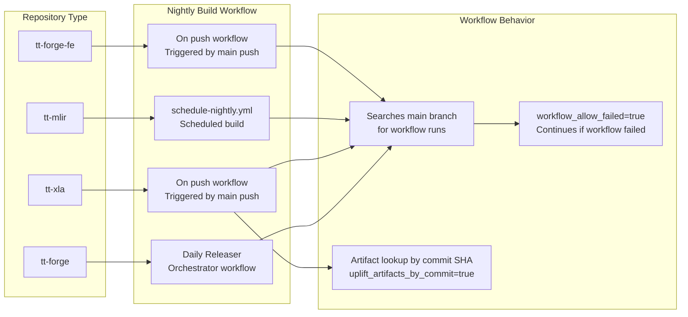
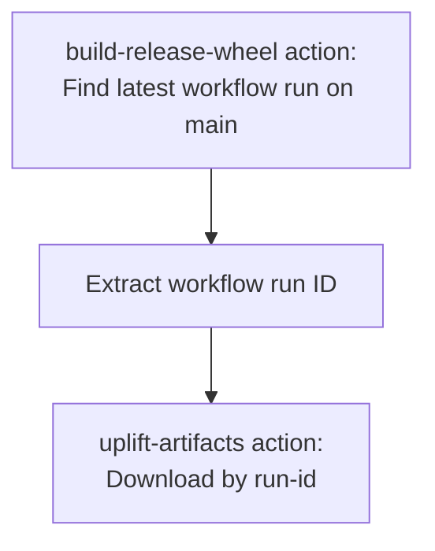
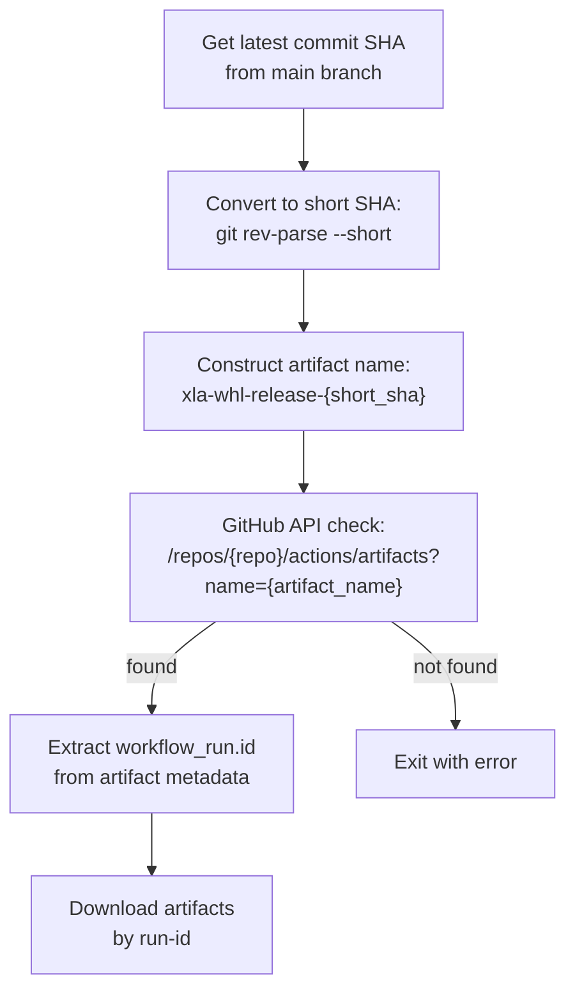
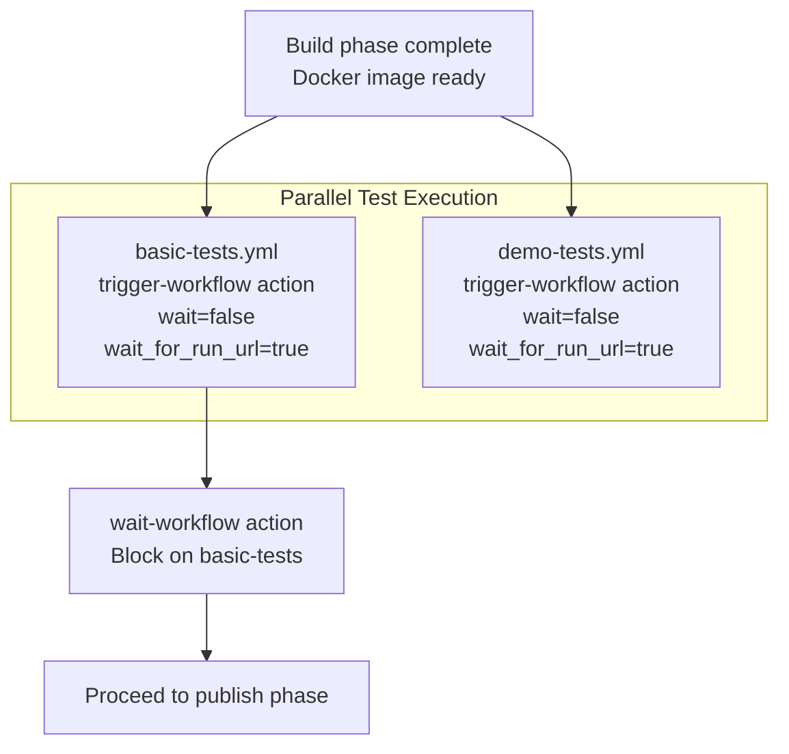
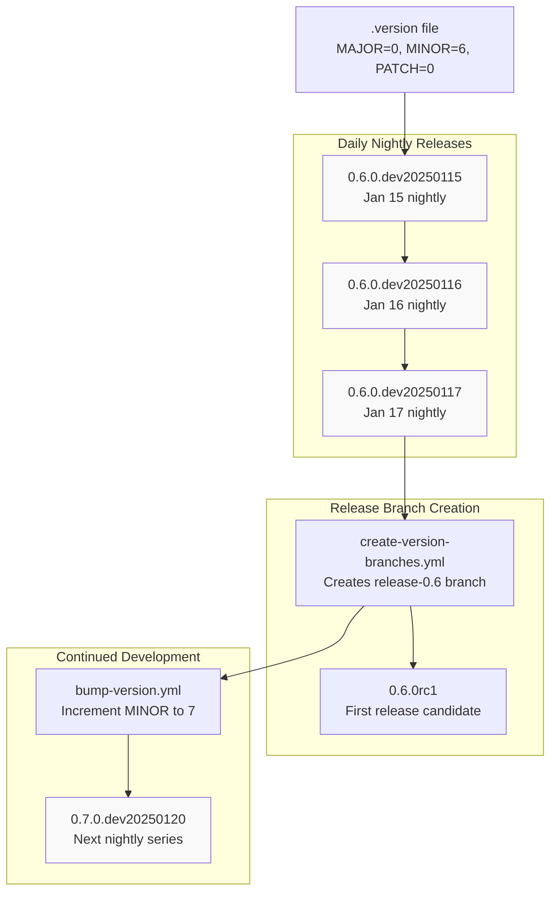
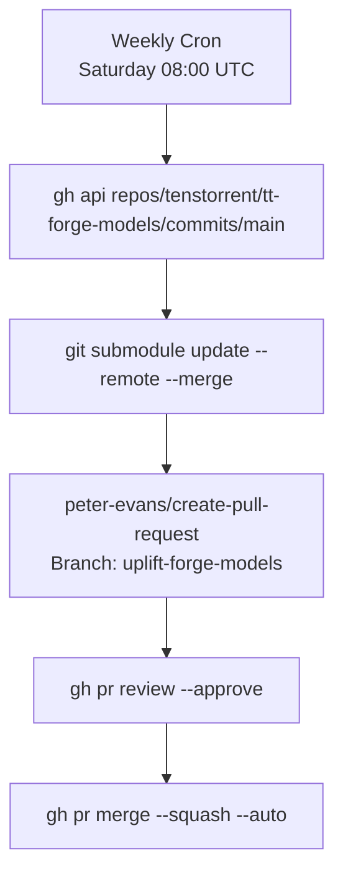

# Nightly Release Process

Relevant source files
*   [.github/CODEOWNERS](https://github.com/tenstorrent/tt-forge/blob/6f2d9645/.github/CODEOWNERS)
*   [.github/workflows/pr-main.yml](https://github.com/tenstorrent/tt-forge/blob/6f2d9645/.github/workflows/pr-main.yml)
*   [.github/workflows/schedule-uplift.yml](https://github.com/tenstorrent/tt-forge/blob/6f2d9645/.github/workflows/schedule-uplift.yml)

## Purpose and Scope

This document describes the automated nightly release process for TT-Forge repositories. Nightly releases are daily development snapshots built from the `main` branch with version tags in the format `X.Y.Z.devYYYYMMDD`. These releases enable continuous integration testing and provide early access to the latest changes.

For information about release candidate and stable releases, see [Release Candidate and Stable Releases](https://deepwiki.com/tenstorrent/tt-forge/5.3.2-release-candidate-and-stable-releases). For details on the orchestration across all repositories, see [Daily Release Orchestration](https://deepwiki.com/tenstorrent/tt-forge/5.2-daily-release-orchestration). For the central configuration system, see [set-release-facts Configuration System](https://deepwiki.com/tenstorrent/tt-forge/5.3.3-set-release-facts-configuration-system).

## Nightly Release Overview

Nightly releases are automated daily builds that serve as development snapshots. They have distinct characteristics compared to release candidates and stable releases:

| Characteristic | Nightly Releases | RC/Stable Releases |
| --- | --- | --- |
| **Version Format** | `X.Y.Z.devYYYYMMDD` | `X.Y.ZrcN` or `X.Y.Z` |
| **Source Branch** | `main` | `release-X.Y` |
| **Trigger** | Daily cron (04:00 UTC) | Manual or commit-based |
| **Prerelease Flag** | `true` | `true` (RC) / `false` (stable) |
| **Make Latest** | `false` | `false` (RC) / `true` (stable) |
| **Workflow Failures** | Allowed (`workflow_allow_failed=true`) | Not allowed |
| **Build Branch** | Always `main` | Release branch |

**Sources:**[.github/actions/set-release-facts/action.yaml 202-209](https://github.com/tenstorrent/tt-forge/blob/6f2d9645/.github/actions/set-release-facts/action.yaml#L202-L209)

### Version Tag Generation

The nightly version tag is generated dynamically at build time using the current date:

`# Format: MAJOR.MINOR.PATCH.devYYYYMMDDnew_version_tag="${VERSION}.dev$(date +"%Y%m%d")"`
For example, if `.version` contains `MAJOR=0`, `MINOR=6`, `PATCH=0`, a nightly build on January 15, 2025 would produce version `0.6.0.dev20250115`.

**Sources:**[.github/actions/set-release-facts/action.yaml 206](https://github.com/tenstorrent/tt-forge/blob/6f2d9645/.github/actions/set-release-facts/action.yaml#L206-L206)[.version 1-4](https://github.com/tenstorrent/tt-forge/blob/6f2d9645/.version#L1-L4)

## Nightly Release Workflow Execution

The following diagram illustrates how nightly releases are triggered and executed:

**Sources:**[.github/workflows/release.yml 1-391](https://github.com/tenstorrent/tt-forge/blob/6f2d9645/.github/workflows/release.yml#L1-L391)[.github/actions/set-release-facts/action.yaml 134-371](https://github.com/tenstorrent/tt-forge/blob/6f2d9645/.github/actions/set-release-facts/action.yaml#L134-L371)

```mermaid
graph TB
    subgraph "Trigger"
        Cron["Daily Cron<br/>04:00 UTC"]
        Manual["workflow_dispatch<br/>Manual trigger"]
    end
    
    subgraph "daily-releaser.yml"
        GetRepos["get-repos<br/>Returns all_repos list"]
        LoopRepos["For each repo in:<br/>tt-forge-fe, tt-mlir,<br/>tt-xla, tt-forge"]
    end
    
    subgraph "release.yml Invocation"
        CallRelease["Call release.yml with:<br/>release_type=nightly<br/>branch=main<br/>new_version_tag=<empty>"]
    end
    
    subgraph "set-release-facts Action"
        LoadVersion["Load .version file<br/>MAJOR, MINOR, PATCH"]
        CheckType["Check release_type<br/>== 'nightly'"]
        SetNightlyConfig["Set nightly configuration:<br/>new_version_tag=VERSION.devYYYYMMDD<br/>workflow_allow_failed=true<br/>build_release_find_workflow_branch=main<br/>prerelease=true<br/>make_latest=false"]
        RepoSpecific["Set repo-specific config:<br/>workflow, artifact_download_glob,<br/>pip_wheel_names, etc."]
    end
    
    subgraph "Build Phase"
        CheckExists["Check if release exists<br/>Skip if exists && !overwrite"]
        UpliftOrWait["uplift-artifacts or<br/>wait-on-tt-pypi-wheels"]
        BuildWheel["build-release-wheel<br/>Create Python packages"]
        BuildDocker["docker-build-push<br/>Create slim containers"]
    end
    
    subgraph "Test Phase"
        BasicTest["basic-tests.yml<br/>Quick validation"]
        DemoTest["demo-tests.yml<br/>Model demonstrations"]
    end
    
    subgraph "Publish Phase"
        DocsGen["docs-generator<br/>Generate changelog"]
        PyPI["publish-tenstorrent-pypi<br/>Upload to S3 PyPI"]
        GitTag["push-annotated-git-tag<br/>GPG-signed tag"]
        GHRelease["publish-github-release<br/>Create GitHub release"]
    end
    
    Cron --> GetRepos
    Manual --> GetRepos
    GetRepos --> LoopRepos
    LoopRepos --> CallRelease
    
    CallRelease --> LoadVersion
    LoadVersion --> CheckType
    CheckType --> SetNightlyConfig
    SetNightlyConfig --> RepoSpecific
    
    RepoSpecific --> CheckExists
    CheckExists -->|"proceed"| UpliftOrWait
    UpliftOrWait --> BuildWheel
    BuildWheel --> BuildDocker
    
    BuildDocker --> BasicTest
    BuildDocker --> DemoTest
    
    BasicTest --> DocsGen
    DemoTest --> DocsGen
    
    DocsGen --> PyPI
    PyPI --> GitTag
    GitTag --> GHRelease
```



## Configuration Details for Nightly Releases

The `set-release-facts` action configures nightly releases differently from other release types. Here are the key configuration changes:

### Global Nightly Configuration

When `release_type == "nightly"`, the following configurations are applied:

`# Dynamic version tag with current datenew_version_tag: "${VERSION}.dev$(date +"%Y%m%d")" # Allow workflows to fail (e.g., build workflow not found)workflow_allow_failed: true # Always search for build artifacts on main branchbuild_release_find_workflow_branch: main # Mark as prerelease (not production-ready)prerelease: true # Do not mark as latest releasemake_latest: false`
**Sources:**[.github/actions/set-release-facts/action.yaml 205-209](https://github.com/tenstorrent/tt-forge/blob/6f2d9645/.github/actions/set-release-facts/action.yaml#L205-L209)

### Repository-Specific Nightly Configuration

Each repository has customized nightly settings:

#### tt-forge-fe

`workflow: "On push"  # For nightly, use main push workflowartifact_download_glob: '*{wheel,test-reports}*'pip_wheel_names: "tt_forge_fe tt_tvm"skip_model_compatible_table: falseskip_docker_build: false`
**Sources:**[.github/actions/set-release-facts/action.yaml 217-225](https://github.com/tenstorrent/tt-forge/blob/6f2d9645/.github/actions/set-release-facts/action.yaml#L217-L225)

#### tt-mlir

`workflow: "schedule-nightly.yml"artifact_download_glob: '*ttmlir-wheel*'pip_wheel_names: "ttmlir"skip_model_compatible_table: trueskip_docker_build: true`
**Sources:**[.github/actions/set-release-facts/action.yaml 226-231](https://github.com/tenstorrent/tt-forge/blob/6f2d9645/.github/actions/set-release-facts/action.yaml#L226-L231)

#### tt-xla

`workflow: "On push"  # For nightly, use main push workflowartifact_name_prefix: "xla-whl-release"artifact_download_glob: '*{xla-whl-release,test-reports}*'pip_wheel_names: "pjrt-plugin-tt"test_perf: trueuplift_artifacts_by_commit: true  # Use commit-based artifact lookup`
**Sources:**[.github/actions/set-release-facts/action.yaml 232-241](https://github.com/tenstorrent/tt-forge/blob/6f2d9645/.github/actions/set-release-facts/action.yaml#L232-L241)

#### tt-forge

`workflow: "Daily Releaser"ignore_artifacts: true  # tt-forge is meta-package, builds own wheelpip_wheel_deps_names: "pjrt-plugin-tt"pip_wheel_names: "tt-forge"skip_model_compatible_table: true`
**Sources:**[.github/actions/set-release-facts/action.yaml 242-248](https://github.com/tenstorrent/tt-forge/blob/6f2d9645/.github/actions/set-release-facts/action.yaml#L242-L248)

## Build Workflow Selection

The nightly release process selects different build workflows based on the repository:

**Sources:**[.github/actions/set-release-facts/action.yaml 217-248](https://github.com/tenstorrent/tt-forge/blob/6f2d9645/.github/actions/set-release-facts/action.yaml#L217-L248)



### Workflow Failure Tolerance

Nightly releases set `workflow_allow_failed="true"` to handle cases where the build workflow may not exist or has failed. This ensures the release process continues even if artifacts cannot be found from a specific commit:

`# From release.ymlworkflow_allow_failed: ${{ inputs.workflow_allow_failed || steps.set-release-facts.outputs.workflow_allow_failed }}`
This is passed to the `build-release-wheel` action which tolerates workflow failures during artifact uplift.

**Sources:**[.github/workflows/release.yml 150](https://github.com/tenstorrent/tt-forge/blob/6f2d9645/.github/workflows/release.yml#L150-L150)[.github/actions/set-release-facts/action.yaml 207](https://github.com/tenstorrent/tt-forge/blob/6f2d9645/.github/actions/set-release-facts/action.yaml#L207-L207)

## Artifact Uplift Strategy

Nightly releases use different artifact uplift strategies depending on the repository:

### Standard Artifact Uplift

Most repositories (tt-forge-fe, tt-mlir) use run-id-based artifact uplift:



### Commit-Based Artifact Uplift (tt-xla)

The tt-xla repository uses commit-based artifact lookup to ensure version consistency:

**Sources:**[.github/actions/uplift-artifacts/action.yml 46-65](https://github.com/tenstorrent/tt-forge/blob/6f2d9645/.github/actions/uplift-artifacts/action.yml#L46-L65)[.github/actions/set-release-facts/action.yaml 241](https://github.com/tenstorrent/tt-forge/blob/6f2d9645/.github/actions/set-release-facts/action.yaml#L241-L241)

The commit-based approach ensures that the exact artifact matching the release commit is used, preventing version mismatches in nightly builds.



## Release Checking and Overwriting

The nightly release process includes a check to prevent duplicate releases:

`# From release.yml - check_release job steprelease_exists="$(.github/scripts/check_release.sh $REPO $TAG)" # For nightly: TAG = "0.6.0.dev20250115"# REPO = "tenstorrent/tt-forge-fe" (or other repo)`
The workflow proceeds with the build only if:

*   `release_exists == false`, OR
*   `overwrite_releases == true`, OR
*   The workflow is manually dispatched with overwrite enabled

**Sources:**[.github/workflows/release.yml 115-136](https://github.com/tenstorrent/tt-forge/blob/6f2d9645/.github/workflows/release.yml#L115-L136)

## Testing Configuration for Nightly Releases

Nightly releases undergo the same test suite as other release types, but with default (permissive) test filters:

| Test Type | Nightly Configuration |
| --- | --- |
| **Basic Tests** | `basic_tests_runner_filter="All"` - Runs on all available runners |
| **Demo Tests** | `test_demo_filter=""` - Runs all demo tests, `test_demo_wait=false` - Non-blocking |
| **Performance Tests** | Repository-specific (e.g., tt-xla: `test_perf=true`) |

The test execution follows this sequence:

The demo tests run in parallel but don't block the release pipeline, while basic tests must complete successfully before publishing.

**Sources:**[.github/workflows/release.yml 208-256](https://github.com/tenstorrent/tt-forge/blob/6f2d9645/.github/workflows/release.yml#L208-L256)[.github/actions/set-release-facts/action.yaml 178-191](https://github.com/tenstorrent/tt-forge/blob/6f2d9645/.github/actions/set-release-facts/action.yaml#L178-L191)




The demo tests run in parallel but don't block the release pipeline, while basic tests must complete successfully before publishing.
```
## Publication Process

Nightly releases are published through multiple channels:

### 1. Documentation Generation

The `docs-generator` action creates release notes with:

*   Changelog from git commits
*   Installation instructions for the nightly version
*   Workflow status symbols and links
*   Test run URLs

**Sources:**[.github/workflows/release.yml 284-301](https://github.com/tenstorrent/tt-forge/blob/6f2d9645/.github/workflows/release.yml#L284-L301)

### 2. PyPI Publication

Wheels are uploaded to the internal S3-backed PyPI server (`tt-pypi`) with the nightly version tag:

`# Nightly version example: 0.6.0.dev20250115new_version_tag: "0.6.0.dev20250115"`
The `publish-tenstorrent-pypi` action uploads all wheels specified in `pip_wheel_names`.

**Sources:**[.github/workflows/release.yml 303-316](https://github.com/tenstorrent/tt-forge/blob/6f2d9645/.github/workflows/release.yml#L303-L316)

### 3. Docker Image Tagging

Docker images are tagged with the nightly version but are **not** marked as latest:

`docker_tag: "0.6.0.dev20250115"  # Nightly version tagmake_latest: false  # Never mark nightly as latest`
**Sources:**[.github/workflows/release.yml 318-328](https://github.com/tenstorrent/tt-forge/blob/6f2d9645/.github/workflows/release.yml#L318-L328)

### 4. Git Tagging

Nightly releases receive annotated, GPG-signed Git tags:

`# Tag format: 0.6.0.dev20250115# Target: Latest commit on main branch# Signed with: TT-FORGE_RELEASER GPG key`
**Sources:**[.github/workflows/release.yml 329-338](https://github.com/tenstorrent/tt-forge/blob/6f2d9645/.github/workflows/release.yml#L329-L338)

### 5. GitHub Release

A GitHub Release is created with:

*   **Prerelease flag:**`true` (marks as non-production)
*   **Make latest:**`false` (does not show as latest release)
*   **Target commit:** Latest commit from main branch
*   **Assets:** Downloaded artifacts (wheels, test reports)

**Sources:**[.github/workflows/release.yml 340-353](https://github.com/tenstorrent/tt-forge/blob/6f2d9645/.github/workflows/release.yml#L340-L353)

## Nightly Release Version Progression

The following diagram shows how nightly versions relate to the broader release lifecycle:

**Sources:**[.version 1-4](https://github.com/tenstorrent/tt-forge/blob/6f2d9645/.version#L1-L4)[.github/actions/set-release-facts/action.yaml 206](https://github.com/tenstorrent/tt-forge/blob/6f2d9645/.github/actions/set-release-facts/action.yaml#L206-L206)



## Key Differences: Nightly vs. RC/Stable

The following table summarizes the critical differences in workflow behavior:

| Configuration | Nightly | RC/Stable |
| --- | --- | --- |
| **new_version_tag** | `VERSION.devYYYYMMDD` | Passed as input parameter |
| **build_release_find_workflow_branch** | `main` | Release branch (e.g., `release-0.6`) |
| **workflow_allow_failed** | `true` | `false` |
| **prerelease** | `true` | `true` (RC), `false` (stable) |
| **make_latest** | `false` | `false` (RC), `true` (stable) |
| **Source branch** | Always `main` | `release-X.Y` branch |
| **Git log fail on error** | `true` | `true` |

**Sources:**[.github/actions/set-release-facts/action.yaml 197-209](https://github.com/tenstorrent/tt-forge/blob/6f2d9645/.github/actions/set-release-facts/action.yaml#L197-L209)

## Dependency Uplift Integration

The nightly release process often incorporates updated submodules. The `schedule-uplift.yml` workflow automates weekly updates of the `tt_forge_models` submodule to ensure nightly builds use the latest model implementations.

**Sources:**[.github/workflows/schedule-uplift.yml 1-92](https://github.com/tenstorrent/tt-forge/blob/6f2d9645/.github/workflows/schedule-uplift.yml#L1-L92)



## Nightly Release Workflow Files

The nightly release process involves the following key files:

| File | Role |
| --- | --- |
| `.github/workflows/release.yml` | Core release workflow invoked for all release types |
| `.github/actions/set-release-facts/action.yaml` | Central configuration that determines nightly-specific settings |
| `.version` | Source of version components (MAJOR, MINOR, PATCH) |
| `.github/actions/build-release-wheel/` | Handles artifact uplift and wheel building |
| `.github/actions/uplift-artifacts/action.yml` | Downloads artifacts from upstream workflows |
| `.github/actions/docker-build-push/` | Builds and pushes Docker images with nightly tags |
| `.github/actions/publish-tenstorrent-pypi/` | Uploads wheels to S3-backed PyPI |
| `.github/actions/push-annotated-git-tag/` | Creates GPG-signed Git tags |
| `.github/actions/publish-github-release/` | Creates GitHub Release with artifacts |
| `.github/workflows/schedule-uplift.yml` | Automates submodule updates for nightly builds |

**Sources:**[.github/workflows/release.yml](https://github.com/tenstorrent/tt-forge/blob/6f2d9645/.github/workflows/release.yml)[.github/actions/set-release-facts/action.yaml](https://github.com/tenstorrent/tt-forge/blob/6f2d9645/.github/actions/set-release-facts/action.yaml)[.version](https://github.com/tenstorrent/tt-forge/blob/6f2d9645/.version)[.github/actions/uplift-artifacts/action.yml](https://github.com/tenstorrent/tt-forge/blob/6f2d9645/.github/actions/uplift-artifacts/action.yml)[.github/workflows/schedule-uplift.yml](https://github.com/tenstorrent/tt-forge/blob/6f2d9645/.github/workflows/schedule-uplift.yml)

Dismiss
Refresh this wiki

Enter email to refresh
