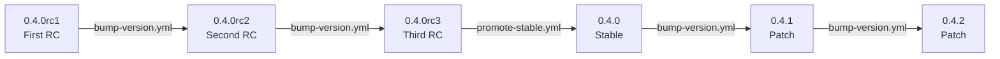
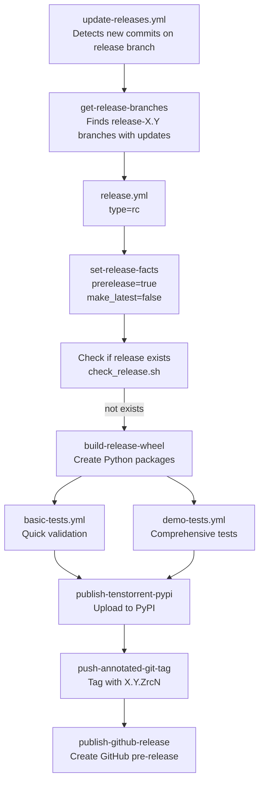
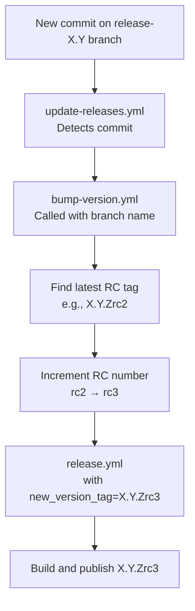
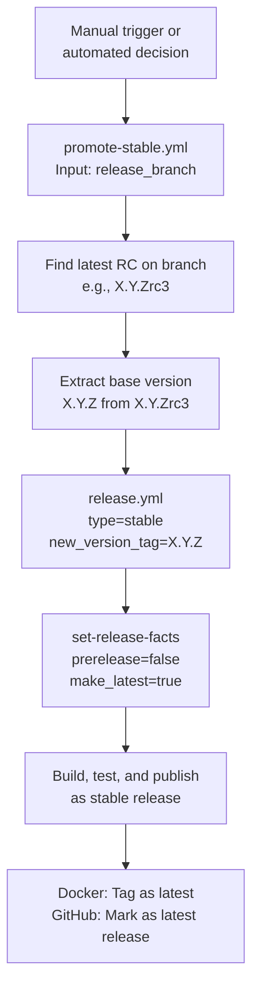
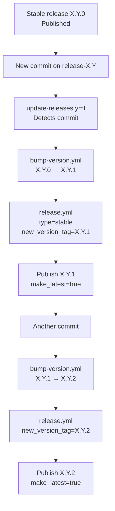
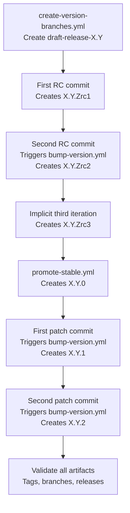
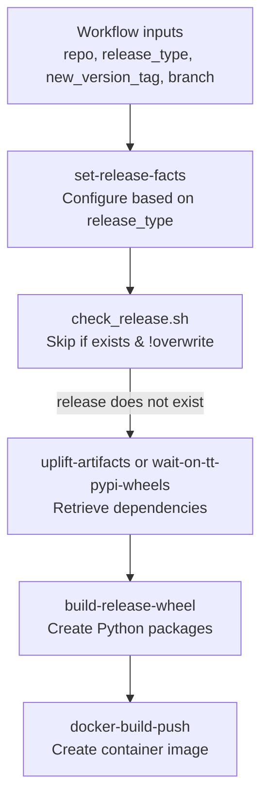
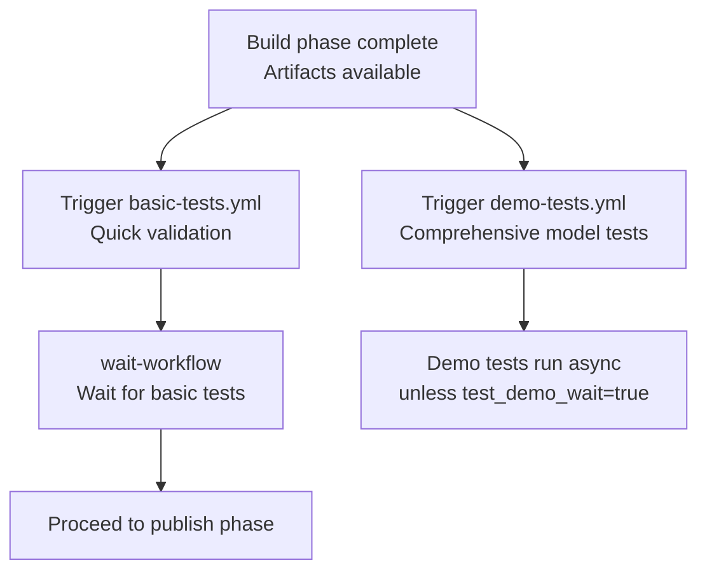
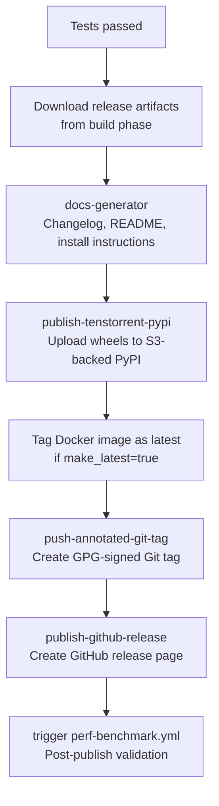

# Release Candidate and Stable Releases

Relevant source files
*   [.github/CODEOWNERS](https://github.com/tenstorrent/tt-forge/blob/6f2d9645/.github/CODEOWNERS)
*   [.github/workflows/pr-main.yml](https://github.com/tenstorrent/tt-forge/blob/6f2d9645/.github/workflows/pr-main.yml)
*   [.github/workflows/schedule-uplift.yml](https://github.com/tenstorrent/tt-forge/blob/6f2d9645/.github/workflows/schedule-uplift.yml)

This document describes the creation and management of Release Candidate (RC) and Stable releases in the TT-Forge ecosystem. RC releases represent pre-production versions undergoing final validation, while Stable releases are production-ready versions marked as the latest. This page covers version tagging schemes, the promotion workflow from RC to Stable, and patch release management.

For information about nightly development releases, see **5.3.1 Nightly Release Process**. For details about the central configuration system, see **5.3.3 set-release-facts Configuration System**. For the overall release lifecycle and version progression, see **5.1 Release Lifecycle and Versioning**.

## Version Tagging Scheme

RC and Stable releases follow distinct version tagging patterns based on semantic versioning principles.

### Release Candidate Versions

RC versions use the format `X.Y.ZrcN` where:

*   `X.Y.Z` represents the target stable version
*   `rc` indicates a release candidate
*   `N` is the RC iteration number (1, 2, 3, etc.)

Examples: `0.4.0rc1`, `0.4.0rc2`, `0.4.0rc3`

### Stable Versions

Stable versions use the format `X.Y.Z` with no suffix. The first stable release for a version line is always `X.Y.0`.

Examples: `0.4.0`, `0.5.0`, `1.0.0`

### Patch Versions

After a stable release, patch versions increment the patch number: `X.Y.Z+1`, `X.Y.Z+2`, etc.

Examples: `0.4.1`, `0.4.2`, `0.5.1`

**Diagram: Version Progression State Machine**

**Sources:**[.github/actions/set-release-facts/action.yaml 161-212](https://github.com/tenstorrent/tt-forge/blob/6f2d9645/.github/actions/set-release-facts/action.yaml#L161-L212)



## Release Configuration Differences

The `set-release-facts` action configures releases differently based on type. The key differences between RC and Stable releases are:

| Configuration | RC Release | Stable Release |
| --- | --- | --- |
| `prerelease` | `true` | `false` |
| `make_latest` | `false` | `true` |
| `new_version_tag` | `X.Y.ZrcN` | `X.Y.Z` |
| GitHub Release | Pre-release badge | Latest badge |
| Docker tag | Version-specific | Version + `latest` |

The configuration logic is implemented in `set-release-facts` action:

`if [[ "${{ inputs.release_type }}" == "stable" ]]; then  prerelease="false"  make_latest="true"elif [[ "${{ inputs.release_type }}" == "nightly" ]]; then  # ... nightly configurationfi`
**Sources:**[.github/actions/set-release-facts/action.yaml 202-209](https://github.com/tenstorrent/tt-forge/blob/6f2d9645/.github/actions/set-release-facts/action.yaml#L202-L209)

## Release Candidate Creation

RC releases are typically created from release branches (e.g., `release-0.4`) when new commits are detected. The process is automated through the `update-releases.yml` workflow invoked by the daily releaser.

### RC Workflow Execution

**Diagram: RC Release Creation Workflow**

The workflow checks for existing releases to prevent duplicate builds. This is controlled by the `overwrite_releases` parameter in the `release.yml` workflow [.github/workflows/release.yml 115-135](https://github.com/tenstorrent/tt-forge/blob/6f2d9645/.github/workflows/release.yml#L115-L135)

**Sources:**[.github/workflows/release.yml 1-391](https://github.com/tenstorrent/tt-forge/blob/6f2d9645/.github/workflows/release.yml#L1-L391)[.github/scripts/check_release.sh 1-20](https://github.com/tenstorrent/tt-forge/blob/6f2d9645/.github/scripts/check_release.sh#L1-L20)




The workflow checks for existing releases to prevent duplicate builds. This is controlled by the `overwrite_releases` parameter in the `release.yml` workflow [.github/workflows/release.yml:115-135]().
```
## RC Version Bumping

When a new commit is added to a release branch that already has an RC release, the RC version number is incremented (e.g., `0.4.0rc1` → `0.4.0rc2`). This is handled by the `bump-version.yml` workflow.

### Bump Version Workflow

The workflow performs the following steps:

1.   **Identify Current RC**: Finds the latest RC tag on the release branch.
2.   **Increment RC Number**: Extracts the RC number and increments it.
3.   **Update Version File**: Updates `.version` file if needed.
4.   **Trigger Release**: Invokes `release.yml` with the new RC version tag.

**Diagram: RC Version Bumping Process**

The test lifecycle demonstrates this by simulating a second commit to the release branch and verifying the version bump [.github/workflows/test-rc-stable-release-lifecycle.yml 335-350](https://github.com/tenstorrent/tt-forge/blob/6f2d9645/.github/workflows/test-rc-stable-release-lifecycle.yml#L335-L350)

**Sources:**[.github/workflows/test-rc-stable-release-lifecycle.yml 335-350](https://github.com/tenstorrent/tt-forge/blob/6f2d9645/.github/workflows/test-rc-stable-release-lifecycle.yml#L335-L350)[.github/workflows/bump-version.yml](https://github.com/tenstorrent/tt-forge/blob/6f2d9645/.github/workflows/bump-version.yml)




The test lifecycle demonstrates this by simulating a second commit to the release branch and verifying the version bump [.github/workflows/test-rc-stable-release-lifecycle.yml:335-350]().
```
## Promotion to Stable

After final validation, an RC release is promoted to Stable using the `promote-stable.yml` workflow. This workflow removes the `rc` suffix from the version tag.

### Promotion Process

**Diagram: RC to Stable Promotion**

When `release_type == "stable"`, the `set-release-facts` action sets `prerelease="false"` and `make_latest="true"`[.github/actions/set-release-facts/action.yaml 202-204](https://github.com/tenstorrent/tt-forge/blob/6f2d9645/.github/actions/set-release-facts/action.yaml#L202-L204) The test lifecycle validates this promotion [.github/workflows/test-rc-stable-release-lifecycle.yml 352-368](https://github.com/tenstorrent/tt-forge/blob/6f2d9645/.github/workflows/test-rc-stable-release-lifecycle.yml#L352-L368)

**Sources:**[.github/workflows/promote-stable.yml](https://github.com/tenstorrent/tt-forge/blob/6f2d9645/.github/workflows/promote-stable.yml)[.github/workflows/test-rc-stable-release-lifecycle.yml 352-368](https://github.com/tenstorrent/tt-forge/blob/6f2d9645/.github/workflows/test-rc-stable-release-lifecycle.yml#L352-L368)[.github/actions/set-release-facts/action.yaml 202-204](https://github.com/tenstorrent/tt-forge/blob/6f2d9645/.github/actions/set-release-facts/action.yaml#L202-L204)




When `release_type == "stable"`, the `set-release-facts` action sets `prerelease="false"` and `make_latest="true"` [.github/actions/set-release-facts/action.yaml:202-204](). The test lifecycle validates this promotion [.github/workflows/test-rc-stable-release-lifecycle.yml:352-368]().
```
## Patch Release Management

After a stable release, subsequent commits to the same release branch create patch releases with incremented patch numbers.

### Patch Version Flow

**Diagram: Patch Release Progression**

The test lifecycle validates that a second commit after stable release bumps the version from `X.Y.0` to `X.Y.1`[.github/workflows/test-rc-stable-release-lifecycle.yml 455-470](https://github.com/tenstorrent/tt-forge/blob/6f2d9645/.github/workflows/test-rc-stable-release-lifecycle.yml#L455-L470)

**Sources:**[.github/workflows/test-rc-stable-release-lifecycle.yml 370-470](https://github.com/tenstorrent/tt-forge/blob/6f2d9645/.github/workflows/test-rc-stable-release-lifecycle.yml#L370-L470)[.github/workflows/bump-version.yml](https://github.com/tenstorrent/tt-forge/blob/6f2d9645/.github/workflows/bump-version.yml)




The test lifecycle validates that a second commit after stable release bumps the version from `X.Y.0` to `X.Y.1` [.github/workflows/test-rc-stable-release-lifecycle.yml:455-470]().
```
## Complete Release Lifecycle Test

The repository includes a comprehensive integration test `test-rc-stable-release-lifecycle.yml` that validates the entire RC-to-Stable-to-Patch lifecycle.

### Test Workflow Structure

**Diagram: Complete Release Lifecycle Test Flow**

The test validates the existence of tags like `draft.tt-mlir.X.Y.0rc1` and `draft.tt-mlir.X.Y.0`[.github/workflows/test-rc-stable-release-lifecycle.yml 154-161](https://github.com/tenstorrent/tt-forge/blob/6f2d9645/.github/workflows/test-rc-stable-release-lifecycle.yml#L154-L161) and ensures non-expected versions do not exist [.github/workflows/test-rc-stable-release-lifecycle.yml 163-166](https://github.com/tenstorrent/tt-forge/blob/6f2d9645/.github/workflows/test-rc-stable-release-lifecycle.yml#L163-L166)

**Sources:**[.github/workflows/test-rc-stable-release-lifecycle.yml 94-659](https://github.com/tenstorrent/tt-forge/blob/6f2d9645/.github/workflows/test-rc-stable-release-lifecycle.yml#L94-L659)




The test validates the existence of tags like `draft.tt-mlir.X.Y.0rc1` and `draft.tt-mlir.X.Y.0` [.github/workflows/test-rc-stable-release-lifecycle.yml:154-161]() and ensures non-expected versions do not exist [.github/workflows/test-rc-stable-release-lifecycle.yml:163-166]().
```
## Release Workflow Execution Details

The core `release.yml` workflow handles both RC and Stable releases through three phases.

### Phase 1: Build Release

**Diagram: Release Workflow - Build Phase**

[.github/workflows/release.yml 78-184](https://github.com/tenstorrent/tt-forge/blob/6f2d9645/.github/workflows/release.yml#L78-L184)




[.github/workflows/release.yml:78-184]()
```
### Phase 2: Test Release

**Diagram: Release Workflow - Test Phase**

[.github/workflows/release.yml 185-256](https://github.com/tenstorrent/tt-forge/blob/6f2d9645/.github/workflows/release.yml#L185-L256)




[.github/workflows/release.yml:185-256]()
```
### Phase 3: Publish Release

**Diagram: Release Workflow - Publish Phase**

[.github/workflows/release.yml 257-391](https://github.com/tenstorrent/tt-forge/blob/6f2d9645/.github/workflows/release.yml#L257-L391)

**Sources:**[.github/workflows/release.yml 1-391](https://github.com/tenstorrent/tt-forge/blob/6f2d9645/.github/workflows/release.yml#L1-L391)




[.github/workflows/release.yml:257-391]()
```
## Repository-Specific Configurations

Different repositories in the TT-Forge ecosystem have specific configurations for RC and Stable releases [.github/actions/set-release-facts/action.yaml 217-248](https://github.com/tenstorrent/tt-forge/blob/6f2d9645/.github/actions/set-release-facts/action.yaml#L217-L248)

| Repository | RC/Stable Workflow | Artifacts | Docker Build |
| --- | --- | --- | --- |
| `tt-forge-fe` | `On nightly` | `tt_forge_fe`, `tt_tvm` wheels | Yes |
| `tt-mlir` | `schedule-nightly.yml` | `ttmlir` wheel | No |
| `tt-xla` | `On nightly` | `pjrt-plugin-tt` wheel | Yes |
| `tt-forge` | `Daily Releaser` | `tt-forge` wheel (meta-package) | No |

The `tt-forge` repository uses `wait-on-tt-pypi-wheels.sh` to ensure its dependencies (like `pjrt-plugin-tt`) are available on the internal PyPI server before building its meta-package [.github/actions/set-release-facts/action.yaml 242-248](https://github.com/tenstorrent/tt-forge/blob/6f2d9645/.github/actions/set-release-facts/action.yaml#L242-L248)

**Sources:**[.github/actions/set-release-facts/action.yaml 217-248](https://github.com/tenstorrent/tt-forge/blob/6f2d9645/.github/actions/set-release-facts/action.yaml#L217-L248)

## Draft Release Testing

The release system supports "draft" mode for testing the entire release pipeline without affecting production releases [.github/actions/set-release-facts/action.yaml 256-295](https://github.com/tenstorrent/tt-forge/blob/6f2d9645/.github/actions/set-release-facts/action.yaml#L256-L295)

Key differences:

*   Tags prefixed with `draft.{repo_short}.` (e.g., `draft.tt-mlir.0.4.0rc1`).
*   Published to `tenstorrent/tt-forge` repository instead of source repo.
*   Limited test execution (single demo, single perf test).
*   Git log errors don't fail the workflow.

**Sources:**[.github/actions/set-release-facts/action.yaml 256-295](https://github.com/tenstorrent/tt-forge/blob/6f2d9645/.github/actions/set-release-facts/action.yaml#L256-L295)[.github/workflows/test-rc-stable-release-lifecycle.yml 1-659](https://github.com/tenstorrent/tt-forge/blob/6f2d9645/.github/workflows/test-rc-stable-release-lifecycle.yml#L1-L659)

Dismiss
Refresh this wiki

Enter email to refresh
